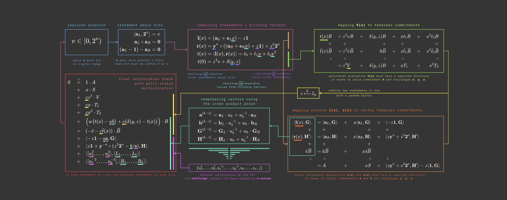
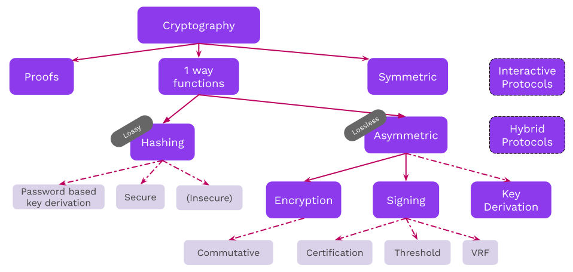

# Cryptography Day I

<pba-flex center>

- Introduction to cryptography<!-- .element: class="fragment" data-fragment-index="0" -->
- Addresses and Keys<!-- .element: class="fragment" data-fragment-index="1" -->
- Many time pad activity<!-- .element: class="fragment" data-fragment-index="2" -->

</pba-flex>

---

# Introduction to Cryptography

---

## Some Useful Equations



Notes:

Just kidding!

---

## Goals for this lesson

<pba-flex center>

- Understand the goals of cryptography<!-- .element: class="fragment" data-fragment-index="0" -->
- Understand security guarantees for resources<!-- .element: class="fragment" data-fragment-index="1" -->
- Learn the primitives<!-- .element: class="fragment" data-fragment-index="2" -->

</pba-flex>

Notes:

In this first lesson,

---

## Cryptography Landscape



Notes:

What is covered in this course is all connected subjects.
We will not cover any details for hybrid or interactive protocols in the course.

---

## Operating Context

##### _Protocols use resources and cryptography ensures that they provide security guarantees_

- **Network, storage, computation, etc.**: We want to specify guarantees on what the resources provide.

<pba-flex center>

- Stored/transmitted data is untampered,<!-- .element: class="fragment" data-fragment-index="1" -->
- Transmitted data comes from a specific sender,<!-- .element: class="fragment" data-fragment-index="2" -->
- A computation over data has been performed correctly,<!-- .element: class="fragment" data-fragment-index="3" -->
- Sensitive data does not get leaked,<!-- .element: class="fragment" data-fragment-index="4" -->
- and many more...<!-- .element: class="fragment" data-fragment-index="5" -->

</pba-flex>

---

## Operating Context: Example

##### _The internet is a public space_

We communicate over public channels.
Adversaries may want to:

<pba-flex center>

- Read messages not intended for them<!-- .element: class="fragment" data-fragment-index="0" -->
- Impersonate others<!-- .element: class="fragment" data-fragment-index="1" -->
- Tamper with messages<!-- .element: class="fragment" data-fragment-index="2" -->

</pba-flex>

Notes:

Use e-mail as an example of an flawed system.

Some examples include:

- An attacker may impersonate your boss, trying to get you to send them money<!-- .element: class="fragment" data-fragment-index="0" -->
- An attacker may change a message sent over a network, e.g. an instruction to transfer 100 EUR to 10000 EUR<!-- .element: class="fragment" data-fragment-index="1" -->

Probably best for the teacher to ask students to participate with examples of application messages,
not just person-to-person messages.

---

## Public vs. Private Systems

_Cryptography based on public systems is more sound_

**Kerckhoff's Principle:** Security should not rely on secret _methods_,<br/>but rather on secret _information_

Notes:

There is no such thing as a "closed channel" :)

- Methods can be reverse engineered.
  After that, the communication channel is completely insecure.
  For example, CSS protection for DVDs.
- We always work with public, open protocols.

---

## Security Guarantees\*

<pba-flex center>

- Data confidentiality<!-- .element: class="fragment" data-fragm ent-index="0" -->
- Data authenticity<!-- .element: class="fragment" data-fragm ent-index="1" -->
- Data integrity<!-- .element: class="fragment" data-fragm ent-index="2" -->
- Non-repudiation<!-- .element: class="fragment" data-fragm ent-index="3" -->
- Data availability<!-- .element: class="fragment" data-fragm ent-index="4" -->
- Data verifiability<!-- .element: class="fragment" data-fragm ent-index="5" -->
- ...<!-- .element: class="fragment" data-fragm ent-index="6" -->
  </pba-flex>

Notes:

Cryptography is one of the (most important) tools we have to build tools that are _guaranteed_ to work correctly.
This is regardless of who (human, machine, or otherwise) is using them and their intentions (good or bad).

Why an asterisk?
There generally are no perfect & absolute guarantees here, but for most practical purposes the bounds on where these fail are good enough to serve our needs as engineers and users.
Do note the assumptions and monitor their validity over time (like quantum tech).

---

## Data Confidentiality

A party may gain access to information<br/>if and only if they know some secret (a key).

<br/>

Confidentiality ensures that a third party cannot read my confidential data.

Notes:

The ability to decrypt some data and reveal its underlying information directly implies knowledge of some secret, potentially unknown to the originator of the information.
Supplying the original information (aka plain text message) can be used in a "challenge game" mechanism as one means of proving knowledge of the secret without compromising it.

Mention use of the term "plaintext".

Allegory: A private document stored on server where sysadmin has _access_ can be subpoenaed, violating assumed Attorney-Client Privilege on the document.

---v

<!-- This slide should potentially be pushed into the lecture on encryption. I can see it in either spot. Alternately, could be cut entirely, as encrypted communication is not an emphasized topic. -->

## Confidentiality in Communication Channels

Suppose Alice and Bob are sending confidential messages back and forth. There are some subtypes of confidentiality here:

- **Forward Secrecy**: Even if an adversary temporarily learns Alice's secret, it cannot read future messages after some point.
- **Backwards Secrecy**: Even if an adversary temporarily learns Alice's secret, it cannot read past messages beyond some previous point.

---

## Data Authenticity

Users can have the **credible** expectation that the stated origin of a message is authentic.

<br/>

Authenticity ensures that a third party cannot pretend I created some data.<!-- .element: class="fragment" data-fragm ent-index="1" -->

Notes:

- Digital signatures should be difficult (practically speaking: impossible) to forge.
- Digital signatures should verify that the signer knows some secret, without revealing the secret itself.

---

## Data Integrity

If data is tampered with, it is detectable. In other words, it possible to check if the current state of some data is the consistent with when it was created.

<br/>

Integrity ensures that if data I create is corrupted, it can be detected.<!-- .element: class="fragment" data-fragm ent-index="1" -->
---v

## Physical Signatures

Physical signatures provide weak authenticity guarantees<br/>(i.e. they are quite easy to forge), and no integrity guarantees.

---v

## An Ideal Signature


Notes:

For example, if you change the year on your university diploma, the dean's signature is still valid.
Digital signatures provide a guarantee that the signed information has not been tampered with.

---

## Non-repudiation

The sender of a message cannot deny that they sent it.

<br/>

Non-repudiation ensures if Bob sends me some data, I can prove to a third party that they sent it.<!-- .element: class="fragment" data-fragm ent-index="1" -->

---

## Data availability

Not always considered a cryptographic guarantee, but in many contexts we would like that data is available to people when they want to access it.

Notes:

Cryptography alone cannot make strong guarantees that data is available to people when they want to access it.

There are many schemes to get around this, and this topic will come up later in the course.
We will touch on erasure coding, which makes data availability more efficient.

---

## Data Verifiability

In some contexts we want to show that (possibly sensitive) data satisfies certain properties.

Notes:

Proving without showing --> we will see that zero-knowledge proofs will allow us to show that a data satisfies certain properties. For example, that I know the key that corresponds to the ciphertext data that I have sent you. Or that the data I have sent you is indeed the correct result of a computation.

---

## One-Way Functions

One-way functions form the basis of cryptographic primitives. A function $f$ is one way if:

- it is reasonably fast to compute<!-- .element: class="fragment" data-fragm ent-index="1" -->
- it is very, very slow to undo<!-- .element: class="fragment" data-fragm ent-index="2" -->

Notes:

There are a lot of assumptions about why these functions are hard to invert, but we cannot rigorously prove it.
We often express inversion problems in terms of mathematical games or oracles.

---

## Hash Functions

**Motivation:** We often want a succinct, yet unique representation of some (potentially large) data.

</br>

A fingerprint, which is much smaller than a person, yet uniquely identifies an individual.<!-- .element: class="fragment" data-fragm ent-index="1" -->

Notes:

The following slides serve as an intro.
Many terms may be glossed over, and covered in detail later.
There are lessons later in this module dedicated to hashes and hash-based data structures.

---v

## Hash Function Applications

Hashes can be useful for many applications:

<pba-flex center>

- Representation of larger data object<br/>(history, commitment, file)<!-- .element: class="fragment" data-fragm ent-index="0" -->
- Keys in a database<!-- .element: class="fragment" data-fragm ent-index="1" -->
- Digital signatures<!-- .element: class="fragment" data-fragm ent-index="2" -->
- Key derivation<!-- .element: class="fragment" data-fragm ent-index="3" -->
- Pseudorandom functions<!-- .element: class="fragment" data-fragm ent-index="4" -->

</pba-flex>

---

## Symmetric Cryptography

<pba-flex center>

- Symmetric cryptography assumes all parties begin with some shared secret information.
- This is a potentially very difficult requirement.<!-- .element: class="fragment" data-fragm ent-index="1" -->
- The shared secret can then be used to protect further communications from others who do not know this secret.<!-- .element: class="fragment" data-fragm ent-index="2" -->
- In essence, it gives a way of "extending" a shared secret over time.<!-- .element: class="fragment" data-fragm ent-index="3" -->

</pba-flex>

Notes:

Remember that these communications are over an _open channel_, as we assumed that all channels can be monitored.

---

## Symmetric Encryption

For example, the Enigma cipher in WW2. A _channel_ was initiated by sharing a secret ("key") between two participants. Using the cipher, those participants could then exchange information securely.

However, since the key contained only limited "entropy" ("information"), enough usage of it eventually compromised the secret and allowed the allies to decode messages. Even altering it once per day was not enough.<!-- .element: class="fragment" data-fragm ent-index="0" -->

Notes:

When communicating over a channel that is protected with only a certain amount of entropy, it is still possible to extend messages basically indefinitely by introducing _new entropy_ that is used to protect the channel sufficiently often.

---

## Asymmetric Cryptography

- In asymmetric cryptography, we devise a means to transform one value (the "secret") into some corresponding counterpart (the "public" key), preserving certain properties.
- We believe that this is a one-way function (that there is no easy/fast inverse of this function).<!-- .element: class="fragment" data-fragm ent-index="1" -->
- Aside from preserving certain properties, we believe this counterpart (the "public key") reveals no information about the secret.<!-- .element: class="fragment" data-fragm ent-index="2" -->

---

## Asymmetric Encryption

_Using only the public key_, information can be transformed ("encrypted") such that only those with knowledge of the secret are able to inverse and regain the original information.

---

## Digital Signatures

- _Using the secret key_, information can be transformed ("signed") such that anyone with knowledge of the information and the counterpart public key is able to affirm the operation.
- Digital signatures provide message authenticity and integrity guarantees.<!-- .element: class="fragment" data-fragm ent-index="1" -->
- There are two lessons dedicated to digital signatures,<br/>this is strictly an intro.<!-- .element: class="fragment" data-fragm ent-index="1" -->

---

## Digital Signatures

**Signing function**: a function which operates on some<br/>_message data_ and some _secret_ to yield a _signature_.

A **signature** _proves_ that the signer had knowledge of the secret,<br/>without revealing the secret itself.

The signature cannot be used to create other signatures, and is unique to the message.<!-- .element: class="fragment" data-fragm ent-index="1" -->

Notes:

A **signing function** is a pure function which operates on some _message data_ (which may or may not be small, depending on the function) and some _secret_ (a small piece of information known only to the operator).
The result of this function is a small piece of data called a _signature_.

Pure means that it has no side effects.

It has a special property: it proves (beyond reasonable doubt) that the signer (i.e. operator of the signing function) had knowledge of the secret and utilized this knowledge with the specific _message_ data, yet it does not reveal the secret itself, nor can knowledge of the signature be used to create other signatures (e.g. for alternative message data).

---

## Non-repudiation for Cryptographic Signatures

There is cryptographic proof that the secret was known to the producer of the signature.

<br/>

The signer cannot claim that the signature was forged, unless they can defend a claim that the secret was compromised prior to signing.<br/><!-- .element: class="fragment" data-fragm ent-index="1" -->

---

## Practical Considerations

**Symmetric cryptography** is much faster, but requires more setup (key establishment) and trust (someone else knows the secret).

**Asymmetric cryptography** is slow, but typically preserves specific algebraic relationships, which then permit more diverse if fragile protocols.

---

## Hybrid Cryptography

Hybrid cryptography composes new mechanisms from different cryptographic primitives.

For example:

- Symmetric encryption can provide speed, and often confidentiality,<!-- .element: class="fragment" data-fragm ent-index="1" -->
- Hash functions can reduce the size of data while preserving identity,<!-- .element: class="fragment" data-fragm ent-index="2" -->
- Asymmetric cryptography can dictate relations among the participants.<!-- .element: class="fragment" data-fragm ent-index="3" -->

---

## Certifications

Certifications are used to make attestations about public key relationships.

Typically in the form of a _signature_ on:

- One or more cryptographically strong identifiers (e.g. public keys, hashes).
- Information about its ownership, its use and any other properties that the signer is capable of attesting/authorizing/witnessing.<!-- .element: class="fragment" data-fragm ent-index="1" -->
- "(Meta-)information" about this information itself, such as how long it is valid for and external considerations which would invalidate it.<!-- .element: class="fragment" data-fragm ent-index="1" -->

Notes:

- Real application is the hierarchy of SSL certs.
  - Root keys -> State level entities -> Smaller entities.
- Web of Trust & GPG cross-signing
- In the case of signature-based certificates, as long as you have the signature, data, and originating public key, you can trust a certificate no matter where it came from. It could be posted on a public message board, sent to you privately, or etched into stone.

---

## Entropy, Randomness, and Key Size

- Entropy: Amount of non-redundant information contained within some data.
- Randomness: Unpredictability of some information. Less random implies lower entropy.<!-- .element: class="fragment" data-fragm ent-index="1" -->
- Key size: Upper limit of possible entropy contained in a key. Keys with less random (more predictable) data have less entropy than this upper bound.<!-- .element: class="fragment" data-fragm ent-index="2" -->
- One-time pad: A key of effectively infinite size. If it is perfectly random (i.e. has maximal entropy), then the cipher is theoretically unbreakable.<!-- .element: class="fragment" data-fragm ent-index="3" -->

Notes:

Mention the upcoming "many time pad" activity, that exploits using a one time pad multiple times.

---

## Randomness Generation

```rust
fn roll_die() -> u32 {
  // Guaranteed random: it was achieved through a real-life die-roll.
  4u32
}
```

- Pseudo-random sequences<!-- .element: class="fragment" data-fragm ent-index="1" -->
- Physical data collection (e.g. cursor movement, LSB of microphone)<!-- .element: class="fragment" data-fragm ent-index="2" -->
- Specialised hardware (e.g. low-level noise on silicon gates, quantum-amplifiers)<!-- .element: class="fragment" data-fragm ent-index="3" -->

Notes:

LSB := Least Significant Bit

---

## Summary

Cryptography is much more than encryption.

<pba-flex center>

- Communicate on public networks, in the open<!-- .element: class="fragment" data-fragm ent-index="1" -->
- Access information<!-- .element: class="fragment" data-fragm ent-index="1" -->
- Have expectations about a message's authenticity and integrity<!-- .element: class="fragment" data-fragm ent-index="1" -->
- Prove knowledge of some secret information<!-- .element: class="fragment" data-fragm ent-index="1" -->
- Represent large amounts of data succinctly<!-- .element: class="fragment" data-fragm ent-index="1" -->

</pba-flex>

---

<!-- .slide: data-background-color="#4A2439" -->

# Questions


##### _What insights did you gain?_

Notes:

Class discussion.
Last slide.
