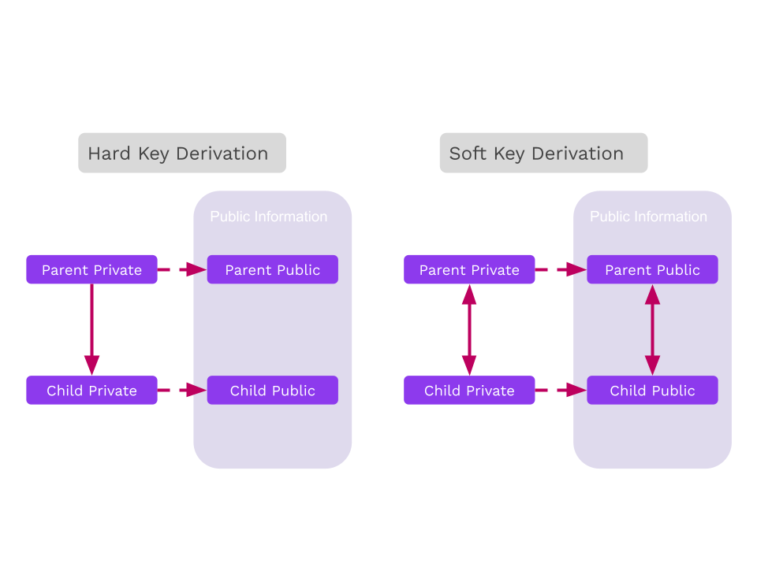
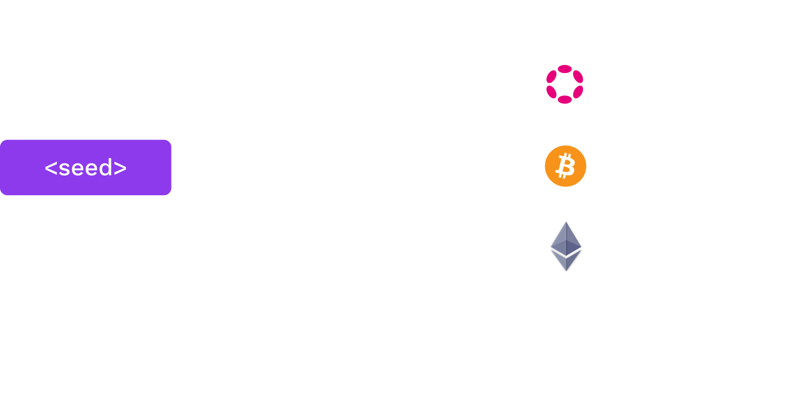

# Addresses and Keys

---

# Outline

<pba-flex center>

1. Binary Formats<!-- .element: class="fragment" data-fragment-index="1" -->
1. Seed Creation<!-- .element: class="fragment" data-fragment-index="2" -->
1. Hierarchical Deterministic Key Derivation<!-- .element: class="fragment" data-fragment-index="3" -->

</pba-flex>

---

## Binary Display Formats

When representing binary data, there are a few different display formats you should be familiar with.

Hex: 0-9, a-f<!-- .element: class="fragment" data-fragment-index="1" -->

Base64: A-Z, a-z, 0-9, +, /<!-- .element: class="fragment" data-fragment-index="2" -->

Base58: Base64 without 0/O, I/l, +, and /<!-- .element: class="fragment" data-fragment-index="3" -->

Notes:

Be very clear that this is a display format that we use to _transmit binary data through text_. The same data can be encoded with any of these formats, it's just important to know which one you're using to decode. Data is not typically stored in these formats unless it has to be transmitted through text.

---

## Binary Display Formats Example

Every hex character is 4 bits.</br>
Every base64 character is 6 bits.</br>
base58 characters are usually _about_ 6 bits.</br>

```text
binary: 10011111 00001010 10011110 10011000 01001100 11010011 10110010 00000101
hex:    9   f    0   a    9   e    9   8    4    c   d   3    b   2    0   5
base64: n     w      q      e      m     E      z      T      s     g      U=
base58: T     b      u      H      z     e      3      c      t     k      c

hex:    9f0a9e984cd3b205
base64: nwqemEzTsgU=
base58: TbuHze3ctkc
```

Notes:

It turns out that converting from hex/base64 to base58 can in theory take n^2 time!

The number of bits of a character is log2(Base) so for base58 it is log2(58) ~ 5.8

---

# Mnemonics and Seed Creation

Notes:

These are all different _representation_ of a secret. Fundamentally doesn't really change anything.

---

## Seeds are secrets

Recall, both symmetric and asymmetric cryptography require a secret.

---

## Mnemonics

Many wallets use a dictionary of words and give people phrases,<br />often 12 or 24 words, as these are easier to back up/recover than byte arrays.

Notes:

High entropy needed.
People are _bad_ at being random.
Some people create their own phrases... this is usually stupid.

---

## Dictionaries

<pba-cols>
<pba-col>

There are some standard dictionaries to define which words (and character sets) are included in the generation of a phrase. Substrate uses the dictionary from BIP39.

</pba-col>
<pba-col>

| No. | word    |
| --- | ------- |
| 1   | abandon |
| 2   | ability |
| 3   | able    |
| 4   | about   |
| 5   | above   |

<pba-flex style="font-size: .6em;" center>

_The first 5 words of the [BIP39 English dictionary](https://github.com/bitcoin/bips/blob/master/bip-0039/english.txt)_

</pba-col>
</pba-cols>

Notes:

Question to ask:
Does anyone know what a BIP is?

---

## Mnemonic to Secret Key

For the Math peoples, what is a secret key?<!-- .element: class="fragment" data-fragment-index="0" -->

Mathematically, the secret key is usually an element of some huge finite field. <!-- .element: class="fragment" data-fragment-index="1" -->

In common asymmetric cryptographic systems, it is an element of the scalar field of an elliptic curve. <!-- .element: class="fragment" data-fragment-index="2" -->

In that regard, it not just a phrase! <!-- .element: class="fragment" data-fragment-index="3" -->

BIP39 applies 2,048 rounds of the SHA-512 hash function<br /> to the mnemonic to derive a 64 byte key.<!-- .element: class="fragment" data-fragment-index="4" -->

---

## Portability

Different key derivation functions affect the ability to use the same mnemonic in multiple wallets as different wallets may use different functions to derive the secret from the mnemonic.

Notes:
i.e. May hash to a different scalar field because of a different elliptic curve

---

## Cryptography Types

In common (modernish) cryptosystems, generally you will encounter 3 different modern types of cryptography across most systems you use.

- Ed25519
- Sr25519
- ECDSA (over secp256k1)

We will go more in depth in future lectures!

Notes:

These are digital signature schemes. ECDSA can use any elliptic curve but
in the case of bitcoin it use secp256k1

Sr25519 and Ed25519 uses the same which is Curve25519

You may have learned RSA in school. It is outdated now, and requires _huge_ keys.
RSA-4096: A 4096-bit RSA key 512 bytes
sr25519 is 32 bytes

There is also BLS12-381 curves but it is less user facing.

---

## What is an address?

An address is a representation of a public key, potentially with additional contextual information.

Notes:

A public key is a point on a defined elliptic curve more specifically
the secret scalar value multiplied times a fixed base point on some curve G

Having an address for a symmetric cryptography doesn't actually make any sense, because there is no
public information about a symmetric key.

---

## Address Formats

Addresses often include a checksum so that a typo cannot change one valid address to another.

```text
Valid address:   5GEkFD1WxzmfasT7yMUERDprkEueFEDrSojE3ajwxXvfYYaF
Invalid address: 5GEkFD1WxzmfasT7yMUERDprk3ueFEDrSojE3ajwxXvfYYaF
                                          ^
                                          E changed to 3
```

Notes:

It hasn't been covered yet, but some addresses even go _extra fancy_ and include an error correcting code in the address.

Question for class:
What is a checksum?

---

## SS58 Address Format

SS58 is the format used in Substrate.

It is base58 encoded, and includes a checksum and some context information.
Almost always, it is 2 bytes of context and 2 bytes of checksum.

```text
base58Encode( context | public key | checksum )
```

Notes:
`|` here stands for concatenation.

For ECDSA, the public key is 33 bytes, so we use the hash of it in place of the public key.

There are a lot more variants here, but this is by far the most common one.

[reference](https://docs.substrate.io/reference/address-formats/)

---

## HDKD

Hierarchical Deterministic Key Derivation


---

## Hard vs. Soft

Key derivation allows one to derive (virtually limitless)<br />child keys from one "parent".

Derivations can either be "hard" or "soft".

---

## Hard vs. Soft



---

## Hard Derivation

Hard derivation requires the secret key and derives new child secret keys.<!-- .element: class="fragment" data-fragment-index="0" -->

Always do hard paths first, then conclude in soft paths.<!-- .element: class="fragment" data-fragment-index="1" -->

Notes:
Typical "operational security" usages should favor hard derivation over soft derivation because hard derivations avoid leaking the sibling keys, unless the original secret is compromised.

    DONT MENTION THIS BUT FOR NOTES!!
    - Because you cannot derive a parent key from a child key with hard derivation but with soft you can

---

## Hard Derivation in Wallets

Wallets can derive keys for use in different consensus systems while only needing to back up one secret plus a pattern for child derivation.



---

## Hard Derivation in Wallets

Let's imagine we want to use this key on multiple networks, but we don't want the public keys to be connected to each other.


---

<!-- .slide: data-background-color="#4A2439" -->

# Subkey Demo

## Hard Derivation

Notes:

Hard keys: Take a _path_ (data like a name/index), concatenate with the original key, and hash it for a new key.
They reveal nothing about keys above them, and only with the _path_ between it and children could they be recovered.

- use `sha3sum -N 256` for a 32byte output and hash type in two things and press ctrl D
- use inspect on the two private keys see that they are completely different public keys non-linkable

---

## Soft Derivation

Soft derivation allows one to create derived addresses from only the public key.
Contrary to hard derivation, _all_ keys are related.

Notes:

- With any key and the paths to children and. or parents, the public _and_ private keys can be recovered.
- Soft derivations can break some niche advanced protocols, but our sr25519 crate avoids supporting protocols that conflict with soft derivations.

---

## Soft Derivation

- Note that these generate new addresses, but use the same secret seed.

---

## Soft Derivation in Wallets

Wallets can use soft derivation to link all payments controlled by a single private key, without the need to expose the private key for the address derivation.

**Use case:** _A business wants to generate a new address for each payment, but should be able to automatically give customers an address without the secret key owner deriving a new child._

Notes:

On the use case, taking each payment at a different address could help make the association between payment and customer.

See: <https://wiki.polkadot.network/docs/learn-accounts#soft-vs-hard-derivation>

---

<!-- .slide: data-background-color="#4A2439" -->

# Subkey Demo

## Soft Derivation

Notes:

See the Jupyter notebook and/or HackMD cheat sheet for this lesson.

Mention that these derivations create entirely new secret seeds.

---

<!-- .slide: data-background-color="#4A2439" -->

# Questions
