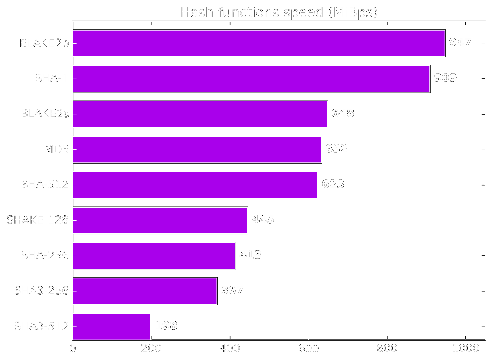
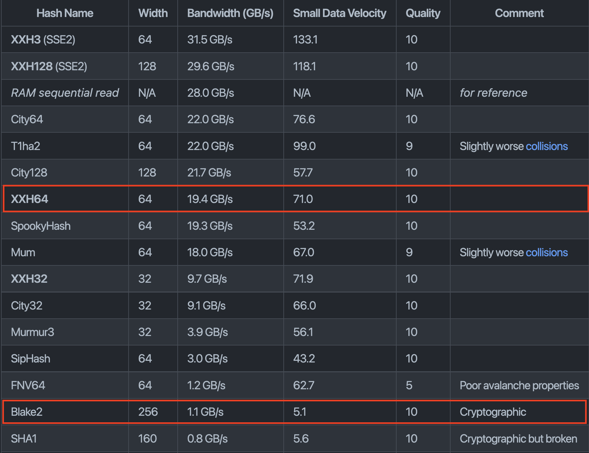
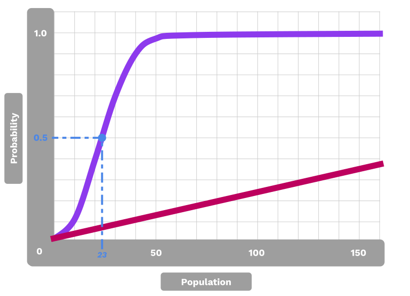
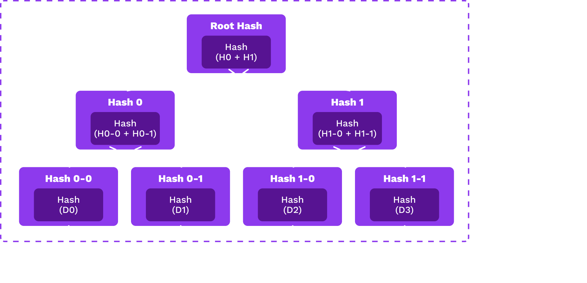

# Cryptography Day II

<pba-flex center>

- Quiz<!-- .element: class="fragment" data-fragment-index="-1" -->
- Hash functions<!-- .element: class="fragment" data-fragment-index="0" -->
- Encryption<!-- .element: class="fragment" data-fragment-index="1" -->
- Basic Digital Signatures<!-- .element: class="fragment" data-fragment-index="2" -->
- Advanced Digital Signatures<!-- .element: class="fragment" data-fragment-index="3" -->
- AES Mods activity<!-- .element: class="fragment" data-fragment-index="4" -->

</pba-flex>

---

# Hash Functions

---

## Introduction

We often want a succinct representation of some data<br />with the expectation that we are referring to the same data.

##### A "fingerprint"

---

## Hash Function Properties

- Accept unbounded size input <!-- .element: class="fragment" data-fragment-index="0" -->
- Map to a bounded output <!-- .element: class="fragment" data-fragment-index="1" -->
- Be fast to compute <!-- .element: class="fragment" data-fragment-index="2" -->
- Resist pre-image attacks:<br />Given an output, it is hard to compute a pre-image <!-- .element: class="fragment" data-fragment-index="3" -->
- Second pre-image resistance: <br />Given an input (and its hashed output), it is hard to compute another input with the same hash<br /><!-- .element: class="fragment" data-fragment-index="4" -->
- Resist collisions:<br />It is hard to compute two inputs that have the same hash<!-- .element: class="fragment" data-fragment-index="5" -->

Notes:

1.  one way meaning for a given output difficult to get the input
1.  attacker has the value 5 and from that can find a preimage that hashes to 5 (5 just an example value)
1.  attacker has input and output and cant find a another input which maps to the output
1.  More generally the attacker has the entire input space and cant find two inputs which hash to the same value

---

## Hash Function API

A hash function should:

- Accept an unbounded input size (`[u8]` byte array)
- Return a fixed-length output (here, a 32 byte array).

```rust
fn hash(s: &[u8]) -> [u8; 32];
```

---

## Example

**Short input (5 bytes):**

```text
hash('hello') =
 0x1c8aff950685c2ed4bc3174f3472287b56d9517b9c948127319a09a7a36deac8
```

**Large input (1.2 MB):**

```text
hash(Harry_Potter_series_as_string) u
 0xc4d194054f03dc7155ccb080f1e6d8519d9d6a83e916960de973c93231aca8f4
```

---

## Input Sensitivity

Changing even 1 bit of a hash function _completely_ scrambles the output.

```text
hash('hello') =
 0x1c8aff950685c2ed4bc3174f3472287b56d9517b9c948127319a09a7a36deac8
```

```text
hash('hellp') =
 0x7bc9c272894216442e0ad9df694c50b6a0e12f6f4b3d9267904239c63a7a0807
```

---

## Speed

- Some hash functions are designed to be slow. <!-- .element: class="fragment" data-fragment-index="0" -->
- Does anyone know why someone would want a hash function to be slow? <!-- .element: class="fragment" data-fragment-index="1" -->
- These have applications like password hashing, which would slow down brute-force attackers. <!-- .element: class="fragment" data-fragment-index="2" -->
- For our purposes, we generally want them to be fast. <!-- .element: class="fragment" data-fragment-index="3" -->

---

## Famous Hash Algorithms

<pba-flex center>

- xxHash a.k.a TwoX (non-cryptographic)
- MD5
- SHA1
- RIPEMD-160
- SHA2-256 (aka SHA256) &c.
- SHA3
- Keccak
- Blake2

xxHash64 is about 20x faster than Blake2.

</pba-flex>

---

## Hash Functions in Blockchains

<pba-flex center>

- Bitcoin: SHA2-256 & RIPMD-160
- Ethereum: Keccak-256 (though others supported via EVM)
- Polkadot: Blake2 & xxHash (though others supported via host functions)

</pba-flex>

Notes:

Substrate also implements traits that provide 160, 256, and 512 bit outputs for each hasher.

Exercise: Write your own benchmarking script that compares the performance of these algorithms with various input sizes.

---

### Hashing Benchmarks



Notes:

Benchmarks for the _cryptographic_ hashing algorithms.
Source: <https://www.blake2.net/>

---

#### XXHash - _Fast_ hashing algorithm



Notes:

Benchmarks for the XX-hash algorithms.
Source: <https://github.com/Cyan4973/xxHash#benchmarks>

---

## Non-Cryptographic Hash Functions

Non-cryptographic hash functions provide weaker<br />guarantees in exchange for performance.

They are OK to use when you know that the input is not malicious.

**If in doubt, use a cryptographic hash function.**

---

## One Way

Given a hash, it should be difficult to find an input value (pre-image)<br />that would produce the given hash.

That is, given `H(x)`, it should be difficult to find `x`.

Notes:

We sometimes add random bytes to pre-images to prevent guesses based on context (e.g., if you are hashing "rock, paper, scissors", then finding a pre-image is trivial without some added randomness.)

---

## Second Pre-Image Attacks

Given a hash and a pre-image, it should be difficult to find _another_<br />pre-image that would produce the same hash.

Given `H(x)`, it should be difficult to find any `x'`

such that `H(x) == H(x')`.

Notes:

Since most signature schemes perform some internal hashing, this second pre-image would also pass signature verification.

---

## Collision Resistance

It should be difficult for someone to find two messages that<br />hash to the same value.

It should be difficult to find an `x` and `y`

such that `H(x) == H(y)`.

---

## Collision Resistance

**Difference from second pre-image attack:**

In a second pre-image attack, the attacker only controls one input.

In a collision, the attacker controls both inputs.

Notes:

Attacker has intention to impersonate the signer with the other. Generally speaking, even finding a
single hash collision often results in the hash function being considered unsafe.

---

## Birthday Problem

<pba-cols>
<pba-col style="font-size:smaller">

> With 23 people, there is a 6% chance that someone will be born on a specific date, but a 50% chance that two share a birthday.

- Must compare each birthday with every other, not with a single one.<br /> <!-- .element: class="fragment" data-fragment-index="0" -->
- Number of possible "hits" increases exponentially for more attempts, reducing the expected success to the square-root of what a specific target would be. <!-- .element: class="fragment" data-fragment-index="1" -->

</pba-col>
<pba-col>



</pba-col>
</pba-cols>

---

## Birthday Attack

Thus, with a birthday attack, it is possible to find a collision of a hash function in $\sqrt {2^{n}}=2^{^{\frac{n}{2}}}$, with $\cdot 2^{^{\frac{n}{2}}}$ being the classical preimage resistance security.

So, hash function security is only half of the bit space.

Notes:

e.g., a 256 bit hash output yields 2^128 security

- <https://en.wikipedia.org/wiki/Birthday_attack>

- <https://en.wikipedia.org/wiki/Birthday_problem>

---

## Partial Resistance

It should be difficult for someone to partially (for a substring of the hash output) find a collision or "second" pre-image.

- Bitcoin PoW is a partial pre-image attack. <!-- .element: class="fragment" data-fragment-index="0" -->
- Can anyone explain how? <!-- .element: class="fragment" data-fragment-index="1" -->

Notes:
This is a technique used to trick users into thinking they are interacting with a trusted entity (like a account or piece of data) when they are actually interacting with a malicious actor. This can be done by creating a fraudulent address that looks similar to a legitimate one.
example AEVXZ AEVYZ

---

## Hash Function Selection

<pba-flex center>

When users (i.e. attackers) have control of the input, cryptographic hash functions must be used.

When input is not controllable (e.g. a system-assigned index), a non-cryptographic hash function can be used and is faster.

Notes:

Only safe when the users cannot select the pre-image, e.g. a system-assigned index.

Keccak is available for Ethereum compatibility.

---

<!-- .slide: data-background-color="#4A2439" -->

# Applications

---

## Cryptographic Guarantees

Let's see which cryptographic properties apply to hashes.

---v

## Confidentiality

- Sending or publicly posting a hash of some data $D$ keeps $D$ confidential, as only those who already knew $D$ recognize $H(D)$ as representing $D$.
- Both cryptographic and non-cryptographic hashes work for this, _only if the input space is large enough_.

---v

## Confidentiality Bad Example

Imagine playing rock, paper, scissors by posting hashes and then revealing. However, if the message is either "rock", "paper", or "scissors", the output will always be either:

```text
hash('rock') = 0x10977e4d68108d418408bc9310b60fc6d0a750c63ccef42cfb0ead23ab73d102
hash('paper') = 0xea923ca2cdda6b54f4fb2bf6a063e5a59a6369ca4c4ae2c4ce02a147b3036a21
hash('scissors') = 0x389a2d4e358d901bfdf22245f32b4b0a401cc16a4b92155a2ee5da98273dad9a
```

The other player doesn't need to undo the hash function to know what you played!

Notes:

Question:
How can we fix this issue?

The data space has to be _sufficiently large_.
Adding some randomness to input of the hash fixes this. Add x bits of randomness to make it x bits of security on that hash.

---v

## Authenticity

Anyone can make a hash, so hashes provide no authenticity guarantees.

---v

## Integrity

A hash changes if the data changes, so it does provide integrity.

---v

## Non-Repudiation

Hashes on their own cannot provide authenticity, and as such cannot provide non-repudiation.

However, if used in another cryptographic primitive that _does_ provide non-repudiation, $H(D)$ provides the same non-repudation as $D$ itself.

Notes:

- The hash alone doesnt give one the ability to authenticate or identify the originator of the data because anyone with access to the data can produce the same hash.

This is key in digital signatures. However, it's important to realize that if $D$ is kept secret, $H(D)$ is basically meaningless.

---

## Content-Derived Indexing

Hash functions can be used to generate deterministic<br />and unique lookup keys for databases.

Notes:

Given some fixed property, like an ID and other metadata the user knows beforehand, they can always find the database entry with all of the content they are looking for.

---

## Data Integrity Checks

Members of a peer-to-peer network may host and share<br />file chunks rather than large files.

In [Bittorrent](https://en.wikipedia.org/wiki/BitTorrent), each file chunk is hash identified so peers can<br /> _request and verify_ the chunk is a member of the larger,<br /> _content addressed_ file.

Notes:

- Content addressed file is when a file is identified based on the content of the file.

- The hash of the large file can also serve as a signal to the protocol that transmission is complete.

---

## Account Abstractions

Public keys can be used to authorize actions by signing of instructions.

The properties of hash functions allow other kinds of representations.

---

## Public Key Representation

Because hashes serve as unique representations of other data,<br />that other data could include public keys.<br />
A system can map a plurality of key sizes to a fixed length<br />(e.g. for use as a database key).

For example, the ECDSA public key is 33 bytes:

```text
Public key (hex):
  0x02d82cdc83a966aaabf660c4496021918466e61455d2bc403c34bde8148b227d7a

Hash of pub key:
  0x8fea32b38ed87b4739378aa48f73ea5d0333b973ee72c5cb7578b143f82cf7e9
                                                                    ^^
```

---

## Commitment Schemes

It is often useful to commit to some information<br /> without storing or revealing it:

- A prediction market would want to reveal predictions only after the confirming/refuting event occurred.<!-- .element: class="fragment" data-fragment-index="0" -->
- Users of a system may want to discuss proposals without storing the proposal on the system.<!-- .element: class="fragment" data-fragment-index="1" -->
- However, participants should not be able to modify their predictions or proposals.<!-- .element: class="fragment" data-fragment-index="2" -->

Notes:
What is an example of an application would use an application like this?

---

## Commit-Reveal

<pba-flex center>

1. Share a hash of data as a commitment ($c$)
1. Reveal the data itself ($d$)

<pba-flex>

It is normal to add some randomness to the message<br />to expand the input set size:

$$ hash(message + randomness) => commitment $$

<pba-flex style="font-size: smaller;">

Commitment: `0x97c9b8d5019e51b227b7a13cd2c753cae2df9d3b435e4122787aff968e666b0b`

---

## Reveal

Message with some added randomness:

<pba-flex style="font-size: smaller;">

> "I predict Boris Johnson will resign on 7 July 2022. facc8d3303c61ec1808f00ba612c680f"

---

## Data Identifiers

Sometimes people want to store information in one place and reference it in another. For reference, they need some "fingerprint" or digest.

As an example, they may vote on executing some privileged instructions within the system.

The hash of the information can succinctly represent the information and commit its creator to not altering it.

---

## Data Structures (in Brief)

This is the focus of a later lesson.

Notes:
For now, just a brief introduction.

---

## Pointer-Based Linked Lists

Pointer-based linked lists are a foundation of programming.

But pointers are independent from the data they reference,<br />so the data can be modified while maintaining the list.

That is, pointer-based linked lists are not tamper evident.


---

## Hash-Based Linked Lists

Hash-based lists make the reference related to the data they are referencing.<br />
The properties of hash functions make them a good choice for this application.

Any change at any point in the list would create downstream changes to all hashes.

---

## Merkle Trees



Notes:

Each leaf is the hash of some data object and each node is the hash of its children.

---

## Proofs

Merkle trees allow many proofs relevant to the rest of this course,<br />e.g. that some data object is a member of the tree<br />without passing the entire tree.

**_More info in a later lesson._**

---

<!-- .slide: data-background-color="#4A2439" -->

# Questions

---
