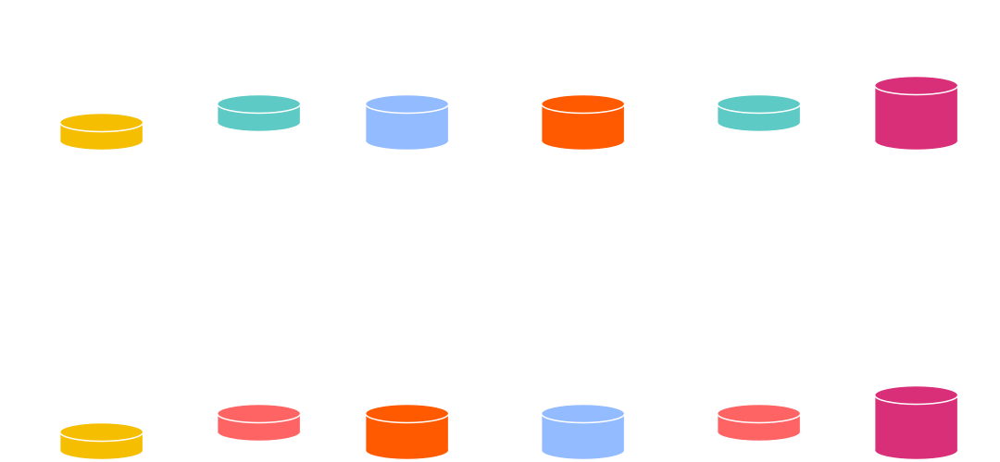
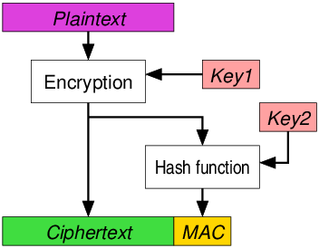

# Encryption

---

## Goals for this lesson

<pba-flex center>

- Learn about the differences between symmetric and asymmetric encryption.

</pba-flex>

---

## Symmetric Cryptography

Symmetric encryption assumes all parties begin with some shared secret information, a potentially very difficult requirement.<br/>The shared secret can then be used to protect further communications from others who do not know this secret.

In essence, it gives a way of _extending_ a shared secret over time.

---

## Symmetric Encryption


Examples: ChaCha20, Twofish, Serpent, Blowfish, XOR, DES, AES<!-- .element: class="fragment" data-fragment-index="0" -->

---

## Symmetric Encryption API

Symmetric encryption libraries should generally all expose some basic functions:

- `fn generate_key(r) -> k;` <br/> Generate a `k` (secret key) from some input `r`.
- `fn encrypt(k, msg) -> ciphertext;` <br/> Takes `k` and a message; returns the ciphertext.
- `fn decrypt(k, ciphertext) -> msg;` <br/> Takes `k` and a ciphertext; returns the original message.

It always holds that `decrypt(k, encrypt(k, msg)) == msg`.

Notes:

The input `r` is typically a source of randomness, for example the movement pattern of a mouse.

---

## Symmetric Encryption Guarantees

Provides:

- Confidentiality

Does not provide:

- Authenticity
- Integrity
- Non-Repudiation

Notes:

- Authenticity: The message could only be sent by someone who knows the shared secret key. In most cases, this is functionally authentication to the receiving party.
- Integrity: There is no proper integrity check, however the changed section of the message will be gibberish if it has been changed. Detection of gibberish could function as a form of integrity-checking.

---

## Symmetric Encryption

#### _Example: XOR Cipher_

<pba-cols>
<pba-col>

The encryption and decryption functions are identical: applying a bitwise XOR operation with a key.

</pba-col>
<pba-col style="padding-right: 100px">

```text
Plain: 1010  -->Cipher: 0110
Key:   1100  |          1100
       ----  |          ----
       0110--^          1010
```

Notes:

A plaintext can be converted to ciphertext, and vice versa, by applying a bitwise XOR operation with a key known to both parties.

</pba-col>
</pba-cols>

---

## Symmetric Encryption

#### ⚠ Warning ⚠

We typically expect symmetric encryption to preserve little about the original plaintext.
We caution however that constructing these protocols remains delicate, even given secure primitives, with two classical examples being unsalted passwords and the [ECB penguin](https://tonybox.net/posts/ecb-penguin/).

---

### ECB penguin

<pba-cols>
<pba-col>


_Original image_

</pba-col>
<pba-col>


_Encrypted image_

(by blocks)

</pba-col>
<pba-col>


_Encrypted image_

(all at once)

</pba-col>
</pba-cols>

Notes:

The ECB penguin shows what can go wrong when you encrypt a small piece of data, and do this many times with the same key, instead of encrypting data all at once.

Image sources: <https://github.com/robertdavidgraham/ecb-penguin/blob/master/Tux.png> and <https://github.com/robertdavidgraham/ecb-penguin/blob/master/Tux.ecb.png> and <https://upload.wikimedia.org/wikipedia/commons/5/58/Tux_secure.png>

---

## Asymmetric Encryption

- Assumes the sender does not know the recipient's secret "key" 🎉😎
- Sender only knows a special identifier of this secret<!-- .element: class="fragment" data-fragment-index="0" -->
- Messages encrypted with the special identifier can only be decrypted with knowledge of the secret.<!-- .element: class="fragment" data-fragment-index="1" -->
- Knowledge of this identifier does not imply knowledge of the secret, and thus cannot be used to decrypt messages encrypted with it.<!-- .element: class="fragment" data-fragment-index="2" -->
- For this reason, the identifier may be shared publicly and is known as the "public key".<!-- .element: class="fragment" data-fragment-index="3" -->

---

## Asymmetric Encryption


---

## Why "Asymmetric"?

_Using only the public key_, information can be transformed ("encrypted") such that only those with knowledge of the secret are able to inverse and regain the original information.

i.e. Public key is used to encrypt but a different, _secret_, key must be used to decrypt.

---

## Asymmetric Encryption API

Asymmetric encryption libraries should generally all expose some basic functions:

- `fn generate_key(r) -> sk;` <br/> Generate a `sk` (secret key) from some input `r`.
- `fn public_key(sk) -> pk;` <br/> Generate a `pk` (public key) from the private key `sk`.
- `fn encrypt(pk, msg) -> ciphertext;` <br/> Takes the public key and a message; returns the ciphertext.
- `fn decrypt(sk, ciphertext) -> msg;` <br/> For the inputs `sk` and a ciphertext; returns the original message.

It always holds that `decrypt(sk, encrypt(public_key(sk), msg)) == msg`.

Notes:

The input `r` is typically a source of randomness, for example the movement pattern of a mouse.

---

## Asymmetric Encryption Guarantees

Provides:

- Confidentiality

Does not provide:

- Integrity
- Authenticity
- Non-Repudiation

Notes:

- Authenticity: The message could only be sent by someone who knows the shared secret key. In most cases, this is functionally authentication to the receiving party.
- Integrity: There is no proper integrity check, however the changed section of the message will be gibberish if it has been changed. Detection of gibberish could function as a form of integrity-checking.

---

## Diffie-Hellman Key Exchange



Mixing Paint Visualization

Notes:

Mixing paint example.
Image Source: <https://upload.wikimedia.org/wikipedia/commons/4/46/Diffie-Hellman_Key_Exchange.svg>

---

## Authenticated Encryption

Authenticated encryption adds a **M**essage **A**uthentication **C**ode to additionally provide an _authenticity_ and _integrity_ guarantee to encrypted data.

A reader can check the MAC to ensure the message was constructed by someone knowing the secret.



Notes:

Specifically, this authenticity says that _anyone who does not know the sender's secret_ could not construct the message.

Generally, this adds ~16-32 bytes of overhead per encrypted message.

The image only shows only of of many possible constructions of authenticated encryption.

Explain that the Key2 in the image, could be derived from Key1.

---

## AEAD (**A**uthenticated **E**ncryption **A**ssociated **D**ata)

AEAD is authenticated with some extra data which is unencrypted, but does have integrity and authenticity guarantees.

Notes:

Authenticated encryption and AEAD can work with both symmetric and asymmetric cryptography.

---

## AEAD Example

Imagine a table with encrypted medical records stored in a table, where the data is stored using AEAD. What are the advantages of such a scheme?

```text
UserID -> Data (encrypted), UserID (associated data)
```

Notes:

By using this scheme, the data is always associated with the userID. An attacker could not put that entry into another user's entry.

---

## Hybrid Encryption

Hybrid encryption combines the best of all worlds in encryption. Asymmetric encryption establishes a shared secret between the sender and a specific public key, and then uses symmetric encryption to encrypt the actual message. It can also be authenticated.

Notes:

In practice, asymmetric encryption is _almost always_ hybrid encryption.

---

## Cryptographic Properties

| Property        | Symmetric | Asymmetric | Authenticated | Hybrid + Authenticated |
| --------------- | --------- | ---------- | ------------- | ---------------------- |
| Confidentiality | Yes       | Yes        | Yes           | Yes                    |
| Authenticity    | No        | No         | Yes           | Yes                    |
| Integrity       | No        | No         | Yes           | Yes                    |
| Non-repudiation | No        | No         | No            | No                     |

Notes:

- Symmetric-Authentication and Authenticated-Authenticity: The message could only be sent by someone who knows the shared secret key. In most cases, this is functionally authentication to the receiving party.
- Symmetric-Integrity and Asymmetric-Integrity: There is no proper integrity check, however the message will be gibberish if it has been changed. Detection of gibberish could function as a form of integrity-checking.
- Non-Repudation: Even though none of these primitives provide non-repudiation on their own, it's very possible to add non-repudation to asymmetric and hybrid schemes via signatures.
- Note that encryption also, most importantly, makes the data _available_ to everyone who should have access.

---

<!-- .slide: data-background-color="#4A2439" -->

# Questions
