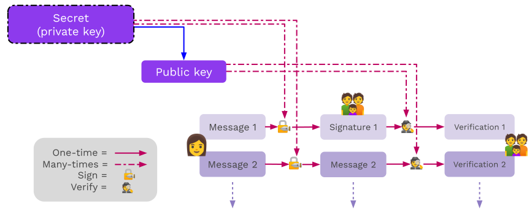

# Cryptography Day II

<pba-flex center>

- Quiz
- Hash functions
- Encryption
- Basic Digital Signatures<!-- .element: class="fragment" data-fragment-index="2" -->
- Advanced Digital Signatures<!-- .element: class="fragment" data-fragment-index="3" -->
- AES Mods activity<!-- .element: class="fragment" data-fragment-index="4" -->

</pba-flex>

---

# Digital Signatures Basics

---

## Signature API

Signature libraries should generally all expose some basic functions:

<ul>
<li class="fragment"><code>fn generate_key(r) -> sk;</code>  Generate a <code>sk</code> (secret key) from some input <code>r</code>.</li>
<li class="fragment"><code>fn public_key(sk) -> pk;</code>   Return the <code>pk</code> (public key) from a <code>sk</code>.</li>
<li class="fragment"><code>fn sign(sk, msg) -> signature;</code>   Takes <code>sk</code> and a message; returns a digital signature.</li>
<li class="fragment"><code>fn verify(pk, msg, signature) -> bool;</code>   For the inputs <code>pk</code>, a message, and a signature; returns whether the signature is valid.</li>
</ul>

Notes:

The input `r` could be anything, for example the movement pattern of a mouse.

For some cryptographies (ECDSA), the verify might not take in the public key as an input. It takes in the message and signature, and returns the public key if it is valid.

---

<!-- .slide: data-background-color="#4A2439" -->

# Subkey Demo

## Key Generation and Signing

Notes:

See the Jupyter notebook and/or HackMD cheat sheet for this lesson.

1. Generate a secret key
1. Sign a message
1. Verify the signature
1. Attempt to alter the message

---

<!-- ##  Hash Functions -->

<!-- There are two lessons dedicated to hash functions. But they are used as part of all signing processes. -->

<!-- For now, we only concern ourselves with using Blake2. -->

<!-- --- -->

## Signing Hashed Messages

As mentioned in the introduction, it's often more practical to sign the hash of a message.

Therefore, the sign/verify API may be _used_ like:

- `fn sign(sk, H(msg)) -> signature;` <!-- .element: class="fragment" data-fragment-index="0" -->
- `fn verify(pk, H(msg), signature) -> bool;` <!-- .element: class="fragment" data-fragment-index="1" -->

Notes:

Where `H` is a hash function (for our purposes, Blake2). 
This means the verifier will need to run the correct hash function on the message.

---

## Cryptographic Guarantees

Signatures provide many useful properties:

<ul>
<li class="fragment"><strong>Confidentiality: </strong> Weak, the same as a hash</li>
<li class="fragment"><strong>Authenticity: </strong> Yes</li>
<li class="fragment"><strong>Integrity: </strong> Yes</li>
<li class="fragment"><strong>Non-repudiation: </strong> Yes</li>
</ul>

Notes:

Question what do each of these mean?

- Confidentiality - If a hash is signed, you can prove a signature is valid _without_ telling anyone the actual message that was signed, just the hash.
- Authenticity: Authenticity assures that the data comes from a verified source.
- Integrity assures that the data has not been changed in an unauthorized manner.
- Non-Repudiation provides evidence that can be used to prove the involvement of parties in a communication, preventing them from denying their actions.

---

## Signing Payloads

<ul>
<li class="fragment">Signing payloads are an important part of system design.</li>
<li class="fragment">Users should have credible expectations about how their messages are used.</li>
<li class="fragment">For example, when a user authorizes a transfer, they almost always mean just one time.</li>
</ul>

Notes:

There need to be explicit rules about how a message is interpreted. If the same signature can be used in multiple contexts, there is the possibility that it will be maliciously resubmitted.

In an application, this typically looks like namespacing in the signature payload.

---

## Signing and Verifying

Notes:

Note that signing and encryption are _not_ inverses.

---

## Replay Attacks

Replay attacks occur when someone intercepts and resends a valid message. 
The receiver will carry out the instructions since the message contains a valid signature.

<pba-flex center>

- Since we assume that channels are insecure, all messages should be considered intercepted.
- The "receiver", for blockchain purposes, is actually an automated system.

</pba-flex>

Notes:

Lack of _context_ is the problem.
Solve by embedding the context and intent \_within the message being signed.
Tell the story of Ethereum Classic replays.

---

## Replay Attack Prevention

Signing payloads should be designed so that they can only be used _one time_ and in _one context_. 
Examples:

<pba-flex center>

<ul>
<li class="fragment">Monotonically increasing account nonces</li>
<li class="fragment">Timestamps (or previous blocks)</li>
<li class="fragment">Context identifiers like genesis hash and spec versions</li>
</ul>

---

# Signature Schemes

---

## ECDSA

<ul>
<li class="fragment">Commonly uses Secp256k1 elliptic curve.</li>
<li class="fragment">ECDSA (used initially in Bitcoin/Ethereum) was developed to work around the patent on Schnorr signatures.</li>
<li class="fragment">ECDSA complicates more advanced cryptographic techniques, like threshold signatures.</li>
<li class="fragment">Non-Deterministic</li>
</ul>

Notes:

inverted nonce to get from all signing parties
is difficult

Setup is difficult secret sharing and setup

Show image of ECDSA vs schnorr to demonstrate this

---

## Ed25519

<ul>
<li class="fragment">Schnorr signature designed to reduce mistakes in implementation and usage in classical applications, like TLS certificates.</li>
<li class="fragment">Signing is 20-30x faster than ECDSA signatures.</li>
<li class="fragment">Deterministic</li>
</ul>

---

## Schnorr Signature

- To Sign: <!-- .element: class="fragment" data-fragment-index="0" -->
  - $r \leftarrow kG$ <!-- .element: class="fragment" data-fragment-index="1" -->
  - $e \leftarrow H(r | M)$<!-- .element: class="fragment" data-fragment-index="2" --> (<s>Verify sends random $e$</s>) <!-- .element: class="fragment" data-fragment-index="2" -->
  - $s \leftarrow k - xe$ ($x$ is signer's secret key). <!-- .element: class="fragment" data-fragment-index="3" -->
  - Send $(s, e)$. <!-- .element: class="fragment" data-fragment-index="4" -->
- To Verify : <!-- .element: class="fragment" data-fragment-index="5" -->
  - recover $r = sG + e Pub_{Signer}.$ <!-- .element: class="fragment" data-fragment-index="6" -->
  - Verify $e \stackrel{?}{=}  H(r | M)$ <!-- .element: class="fragment" data-fragment-index="7" -->

---

## Sr25519

Sr25519 addresses several small risk factors that emerged from Ed25519 usage by blockchains.

Notes:

Can be Deterministic but in Substrate is implemented as non-deterministic

---

## Use in Substrate

- Sr25519 is the default key type in most Substrate-based applications.
- Its public key is 32 bytes and generally used to identify key holders (likewise for ed25519).
- Secp256k1 public keys are _33_ bytes, so their _hash_ is used to represent their holders.

---

<!-- .slide: data-background-color="#4A2439" -->

# Questions
