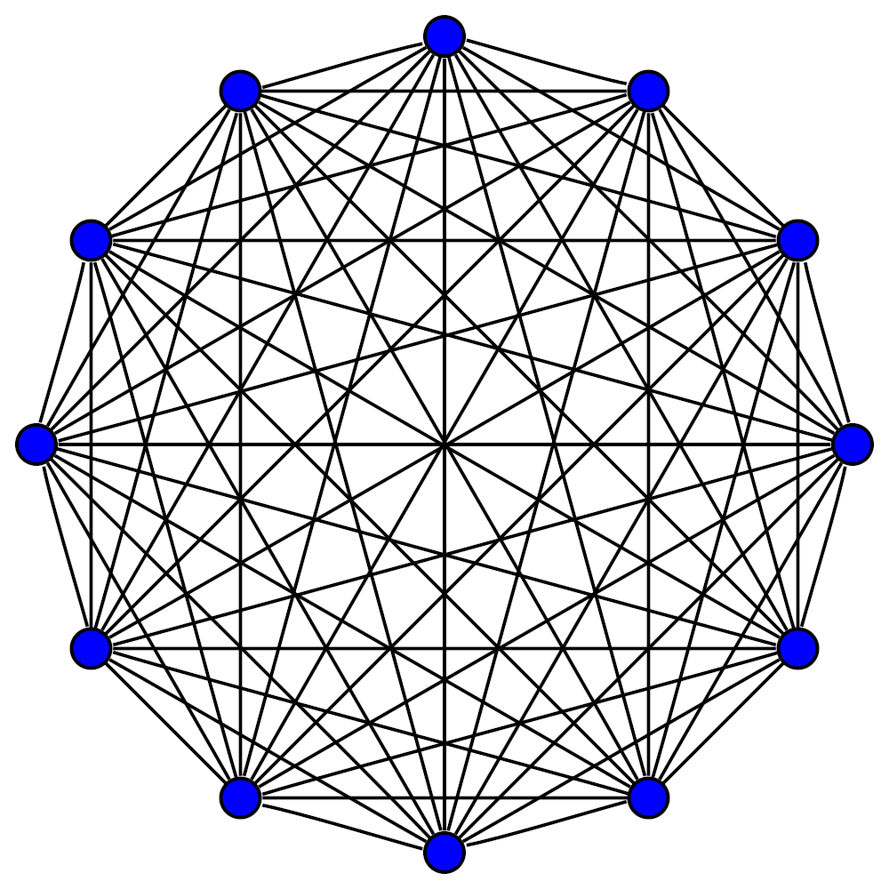
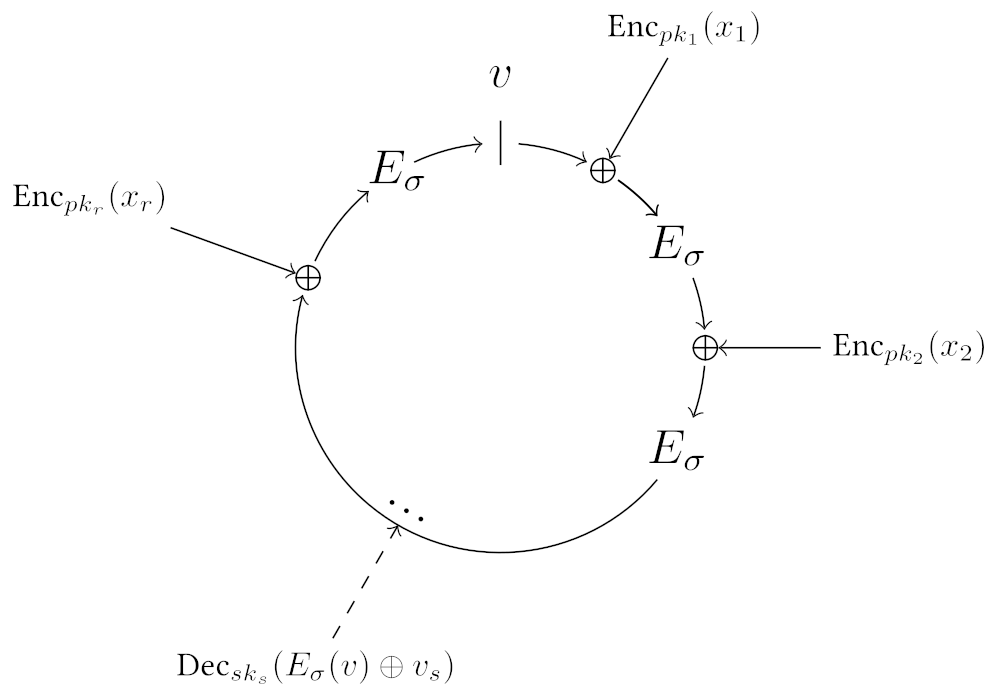

# Advanced Digital Signatures

---

### Certificates

A certificate is essentially a witness statement concerning one or more public keys. It is a common usage of digital signatures, but _it is not a cryptographic primitive_!

Notes:

A certificate is one issuing key signing a message containing another certified key, which attests to some properties or relationship about the certified key.

We must already trust the issuing key to give this attestation any significance, traditionally provided under "Certificate Authority" or "Web of Trust" schemes.

---

### Certificates

A certification system specified conventions on who is allowed to issue certificates, the rules over their issuance (e.g. time limits and revocation) as well as their format and semantics.

For example, the certificate transparency protocol for TLS certificates helps protect against compromised Certificate Authorities.<!-- .element: class="fragment" data-fragment-index="0" -->

Notes:

Certificate transparency: [explanation](https://certificate.transparency.dev/howctworks/) and [dashboard](https://ct.cloudflare.com/)

- Maybe mention PGP web-of-trust style schemes

---

### Certificates in Web3

We are building systems that do not have a centralized "Certificate Authority". 
But we can still use certificates to transfer some power from one key to another.

Notes:

Potential example to give verbally:

- Session keys are a set of keys that generally run in online infrastructure.
  An account, whose keys are protected, can sign a transaction to certify all the keys in the set.
- Session keys are used to sign operational messages, but also in challenge-response type games to prove availability by signing a message.
- Registrar.
- Identity chains.

---

### Multi-Signatures

We often want signatures that must be signed by multiple parties to become valid.

<pba-flex center>

- Require some threshold of members to agree to a message<!-- .element: class="fragment" data-fragment-index="0" -->
- Protect against key loss<!-- .element: class="fragment" data-fragment-index="1" -->

</pba-flex>

---

### Types of Multi-Signature

<pba-flex center>

- Trivial: Sending all individual signatures together.<!-- .element: class="fragment" data-fragment-index="0" -->
- Cryptographically Aggregated.<!-- .element: class="fragment" data-fragment-index="1" -->
- Cryptographically Threshold.<!-- .element: class="fragment" data-fragment-index="2" -->

---

### Trivial Multiple Signatures

- We assume that there is some verifier, who can check that some threshold of individual keys have provided valid signatures.
- This could be a trusted company or third party.<!-- .element: class="fragment" data-fragment-index="1" -->
- For our purposes, "it's a blockchain."<!-- .element: class="fragment" data-fragment-index="2" -->

---

### Trivial Multiple Signatures

Trivial multiple signatures generally provide a good user experience, as no interaction is required from the participants.

Notes:

This good experience comes at the cost of using state and more user interactions with the system, but is generally low.

Even in a web3 system, the verifier can be _distinct_ from the blockchain. 5 people can entrust a verifier with the identity of "all 5 signed this" associated to a verifier-owned private key.

---

### Cryptographic Multi-Sigs

We want a succinct way to demonstrate that everyone from some set of parties have signed a message. This could be achieved purely on the signer side (without support from the verifier).

<pba-flex center>

_Example: "The five key holders have signed this message."_

---

### Key Generation for Multi-Sigs

In cryptographic multi-signatures, signatures from individual public keys are aggregated.
.

Each participant can choose their own key to use for the multi-signature.<!-- .element: class="fragment" data-fragment-index="0" -->

Notes:

In some cases, a security requirement of these systems is that every participant demonstrates ownership of the public key submitted for the multi-signature, otherwise security can be compromised.

---

### Cryptographic Threshold Multi-Sigs

- Makes more compact signatures compatible with legacy systems.
- The public key is associated with a "threshold" number of signing parties.<!-- .element: class="fragment" data-fragment-index="0" -->
- Not all parties are needed to take part in the signing process to create a valid signature.<!-- .element: class="fragment" data-fragment-index="1" -->
- This requires MPC protocols and may need multiple rounds of interaction to generate the final signature.<!-- .element: class="fragment" data-fragment-index="2" -->
- They may be vulnerable to DoS from a malfunctioning (or malicious) key-holder.<!-- .element: class="fragment" data-fragment-index="3" -->

<pba-flex center>

Example: "5 of 7 key holders have signed this message.".<!-- .element: class="fragment" data-fragment-index="4" -->

Notes:

These require multi-party computation (MPC) protocols, which add some complexity for the signing users.

---

### Key Generation - Threshold

- Threshold multi-signature schemes require that all signers run a distributed key generation (DKG) protocol that constructs key "shares".
  <!-- .element: class="fragment" data-fragment-index="0" -->
- The secret encodes the threshold behavior, and signing demands some threshold of signature "fragments".<!-- .element: class="fragment" data-fragment-index="1" -->
- This DKG protocol breaks other useful things, like hard key derivation.<!-- .element: class="fragment" data-fragment-index="2" -->

Notes:

DKG requires MPC which adds a lot of communication overhead.

---

### Schnorr Multi-Sigs

Schnorr signatures are primarily used for threshold multi-sig.

- Fit legacy systems nicely, and can reduce fees on blockchains.<!-- .element: class="fragment" data-fragment-index="0" -->
- Reduce verifier costs in bandwidth & CPU time, so great for certificates.<!-- .element: class="fragment" data-fragment-index="1" -->
- Could support soft key derivations.<!-- .element: class="fragment" data-fragment-index="2" -->

---

### Schnorr Multi-Sigs - Downside

- However, automation becomes tricky.
- We need agreement upon the final signer list and two random nonce contributions from each prospective signer, before constructing the signature fragments.<!-- .element: class="fragment" data-fragment-index="0" -->

---

### BLS Signatures

- BLS signatures are especially useful for aggregated multi-signatures (but can be used for threshold as well).<!-- .element: class="fragment" data-fragment-index="0" -->
- Signatures can be aggregated without advance agreement upon the signer list.<!-- .element: class="fragment" data-fragment-index="1" -->
- This simplifies automation and makes them useful in consensus.<!-- .element: class="fragment" data-fragment-index="2" -->
- Verifying individual signatures is slow, but verifying aggregated ones is relatively fast.<!-- .element: class="fragment" data-fragment-index="3" -->
- (Coming to Substrate soonish.)<!-- .element: class="fragment" data-fragment-index="4" -->

---

### BLS Signatures

Allows multiple signatures generated under multiple public keys for multiple messages to be aggregated into a single signature.

<pba-flex center>

- Uses heavier pairing friendly elliptic curves than ECDSA/Schnorr.<!-- .element: class="fragment" data-fragment-index="0" -->
- Very popular for consensus.<!-- .element: class="fragment" data-fragment-index="1" -->

<pba-flex>

---

### BLS Signatures - Downside

- DKGs remain tricky (for threshold).<!-- .element: class="fragment" data-fragment-index="0" -->
- Soft key derivations are typically insecure for BLS.<!-- .element: class="fragment" data-fragment-index="1" -->
- Verifiers are significantly slower than Schnorr, due to using pairings, for a single signature.<!-- .element: class="fragment" data-fragment-index="2" -->
- But for hundreds or thousands of signatures on the same message, aggregated signature verification can be much faster than Schnorr.<!-- .element: class="fragment" data-fragment-index="3" -->

---

### Schnorr and BLS Summary

Schnorr & BLS multi-signatures avoid complicating verifier logic, but introduce user experience costs such as:

- DKG protocols<!-- .element: class="fragment" data-fragment-index="0" -->
- Reduced key derivation ability<!-- .element: class="fragment" data-fragment-index="1" -->
- Verification speed<!-- .element: class="fragment" data-fragment-index="2" -->
- Proof of possession verification.<!-- .element: class="fragment" data-fragment-index="3" -->

---

### Ring Signatures

- Ring signatures prove the signer lies within some "anonymity set" of signing keys, but hide which key actually signed.
  <!-- .element: class="fragment" data-fragment-index="1" -->
- Ring signatures come in many sizes, with many ways of presenting their anonymity sets.<!-- .element: class="fragment" data-fragment-index="2" -->
- Anonymous blockchain transactions typically employ ring signatures (Monero, ZCash).<!-- .element: class="fragment" data-fragment-index="3" -->

Notes:

- ZCash uses a ring signature based upon Groth16 zkSNARKs which makes the entire chain history be the anonymity set.
- Monero uses ring signatures with smaller signer sets.
- Ring signatures trade some _non-repudation_ for _privacy_.

---

<!-- .slide: data-background-color="#4A2439" -->

# Questions
