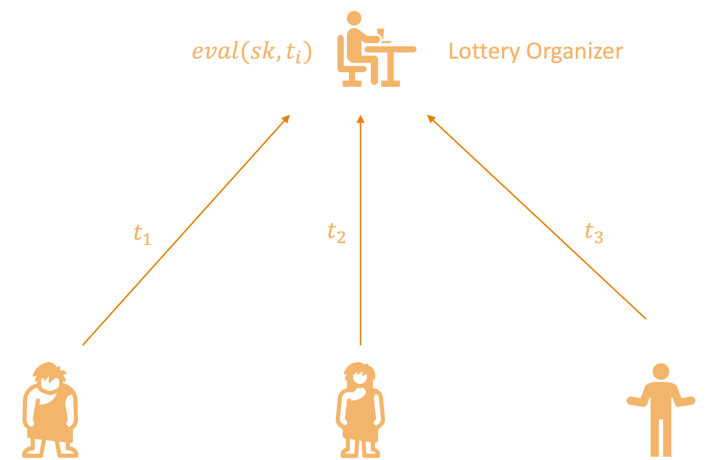
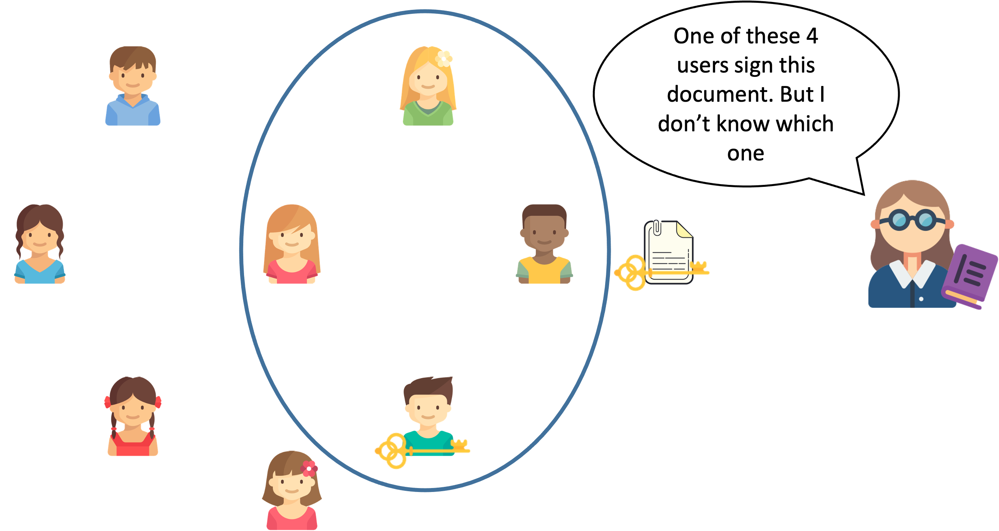
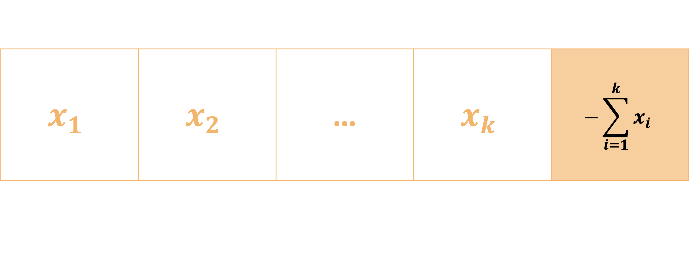
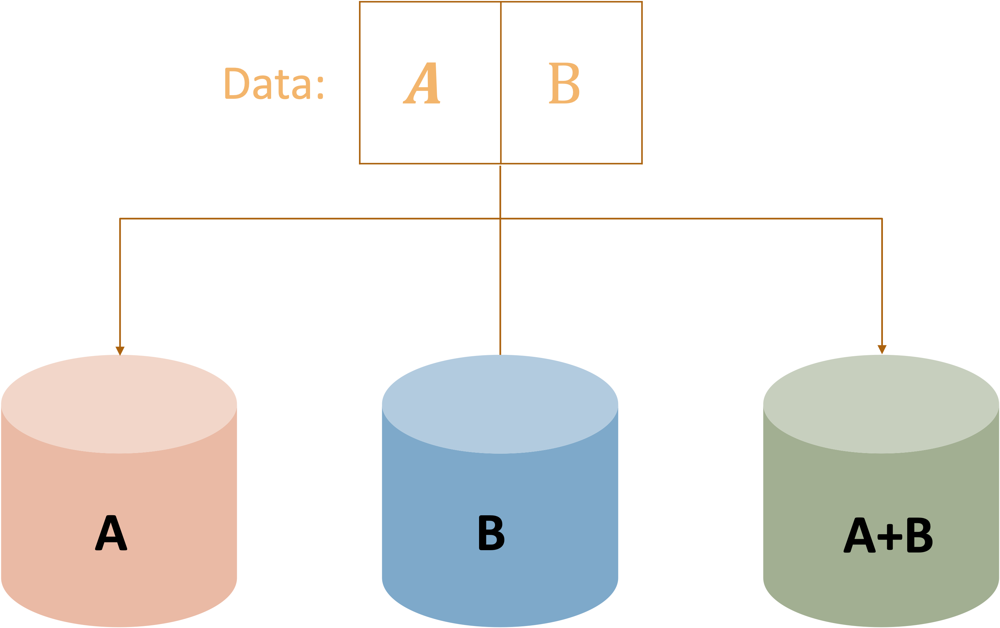
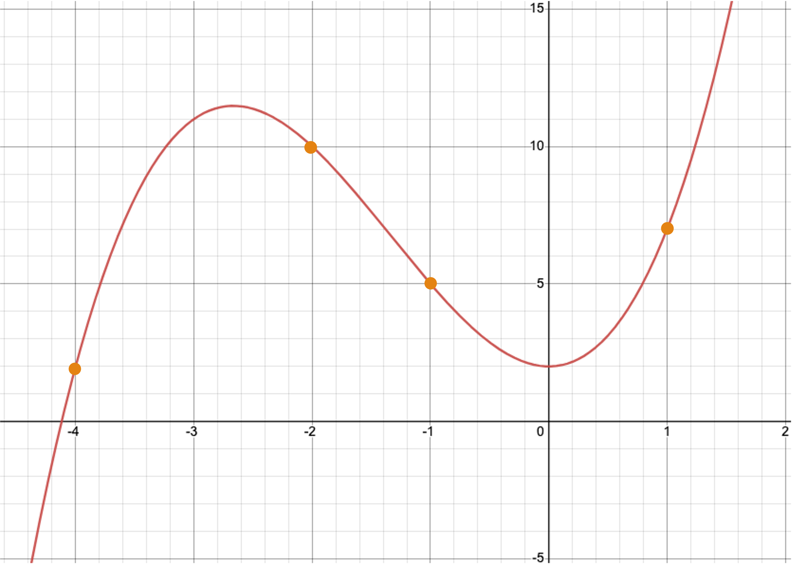
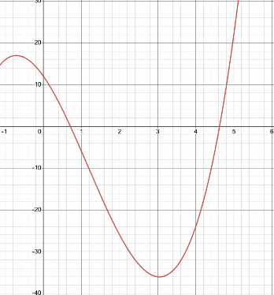
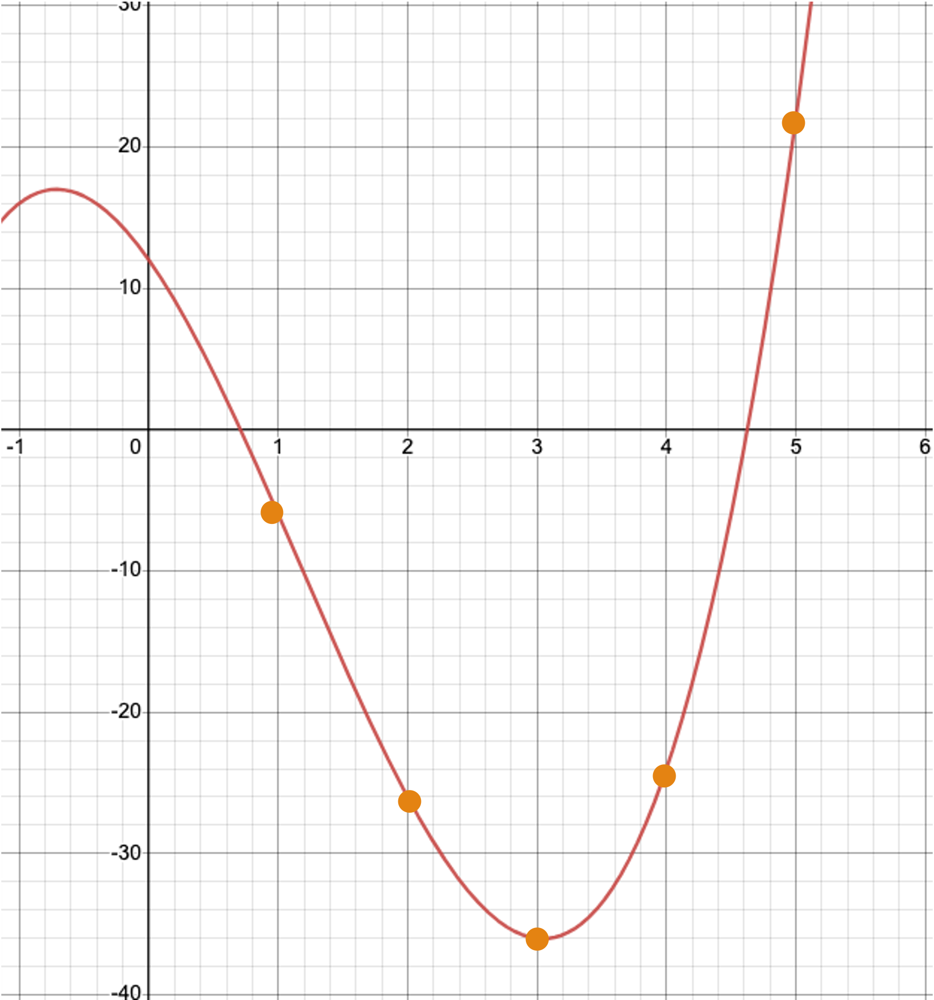
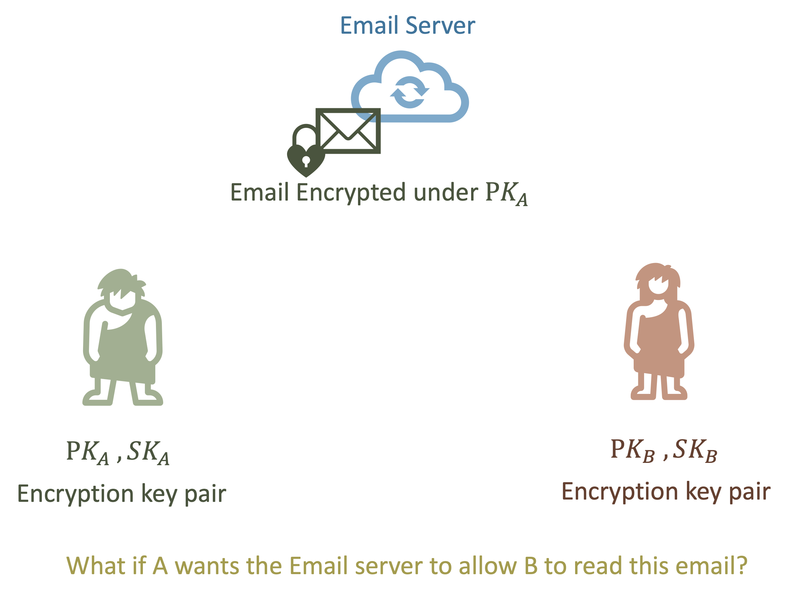

# Exotic Primitives

---

# Outline

<pba-flex center>

1. [Verifiable Random Functions (VRFs)](#verifiable-random-functionsvrfs)
1. [Erasure coding](#erasure-coding)
1. [Shamir Secret Sharing](#shamir-secret-sharing)
1. [Proxy Re-Encryption](#proxy-reencryption)

</pba-flex>

---

## Verifiable Random Functions (VRFs)

<widget-center>

- Used to obtain <ins>private randomness</ins>, that is <ins>publicly verifiable</ins>

- A variation on a signature scheme:
  - still have private/public key pairs, input as message
  - in addition to signature, we get an output

---

## VRF Interface

- `eval(sk,input) -> output`

- `sign(sk, input) -> signature`

- `verify(pk, input, signature) -> option output`

Notes:

The output of verification being an option represents the possibility of an invalid signature

---

## VRF Output properties

- Output is a deterministic function of _key_ and _input_
  - i.e. eval should be deterministic
- It should be pseudo-random
- But until the VRF proof is revealed, only the holder of the secret key knows the output
- Revealing output does not leak secret key

---

## VRF Usage

- Choose input after key, then the key holder cannot influence the output
- The output then is effectively a random number known only to the key holder
- But they can later reveal it, by publishing the VRF proof (signature)

Notes:

The signature proves that this is the output associated to their input and public key.

---

## VRF Example

- Playing a card game in a distributed and trustless way
- For player A to draw a card, the players agree on a new random number x
- A's card is determined by `eval(sk_A,x) mod 52`
- To play the card, A publishes the VRF proof (signature)

---

## VRF Example

_Lottery_

- Lottery organizer generate $pk$,$sk$ for VRF;
- Each participants choose their own tickets $t_i$;

---

## VRF Example

_Lottery_

- Lottery organizer computes `eval(sk,$t_i$)-> $y_i$` for each participants;
- $y_i$ determines wining or not;
- `sign(sk, $t_i$) -> $\sigma_i$` published for verification.
  

---

## Recall Signature Interface

- `sign(sk, msg) -> signature;`

- `verify(pk, msg, signature) -> bool;`

---

## BLS-based VRF

- `sign(sk,input) `: run `BLS.sign(sk, input)->signature`, return `signature`

- `eval(sk,input)`： return `Hash(signature)`

- `verify(pk,input,signature)`: `BLS.verify(pk, input, signature)?=1`, if holds, output `Hash(signature)`

---

## VRF Extensions

- Threshold VRFs / Common coin

  - Generate the same random number if $t$ out of $n$ people participate

- RingVRFs

  - The VRF output could be from any one of a group of public keys.

Notes:

Common coins were used in consensus before blockchains were a thing.
Dfinity based their consensus on this.
But this needs a DKG, and it's unclear if a decentralized protocol can do those easily.
A participant in a RingVRF could still only reveal _one_ random number.

---

## Threshold VRFs

- Also called Distributed VRFs;
- Each of the $n$ users get their public/secret key $(pk_i,sk_i)$;
- $t$ participants generate `output_i`, `signature_i` using their key on the same `input`;
- Combine $t$ `output_i`, `signature_i` to get `output`, `signature`.

---

## Ring Signature and Ring VRFs

- Ring Signature: Sign on behalf of a group people without revealing the true identity of the signer;

- Ring VRFs: generate `output` and `signature` on behalf of a group of people without revealing the true identity of the signer.

---

## Erasure Coding

_Magical data expansion_

- A type of Error Correction Code  Detect and correct errors occur in data transmission without the need for retransmission

- Turn data into pieces (with some redundancy) so it can be reconstructed even if some pieces are missing

- A message of $k$ symbols is turned into a coded message of $n$ symbols and can be recovered from any $k$ of these $n$ symbols

---

## Erasure Coding Intuition

Erasure coding relies on both parties sharing an understanding of what possible messages are valid. This lets mistakes be noticed and corrected.

Imagine you are receiving a message, and you know ahead of time that the only two possible messages you would receive are `file` and `ruin`.

Notes:

This concept of a subset of messages being valid is super common in real life, and occurs all over the place.
At a restaurant, when they ask you if you want soup or salad, even if you mumble they will probably understand you.

---v

## Erasure Coding Intuition

How would you classify each of the following words?

file pile pale tale tall rule tail rail rain ruin

---v

## Erasure Coding Intuition

How would you classify each of the following words?

file pile pale tale tall rule  tail rail rain ruin

You can classify them based on how close they are to a valid input. This also means we can find the errors in these messages.

Notes:

There is no perfect way to separate these, but one very reasonable one is to do it based on the edit distance of the received word with any valid messsage you could receive.

---v

## Erasure Coding Intuition

Now, you are receiving messages that could be `msg1` or `msg2`. Can you apply the same technique? Is it as easy to separate received messages?

What if you receive `msg3`?

Notes:

If the messages are not far apart, it is impossible to distinguish in many cases. There is not enough "distance" between the two possibilities.

---v

## Erasure Coding Intuition

With erasure coding, we extend each message magically so they are different enough. The sender and receiver know the same encoding procedure. These extensions will be very different, even if the messages are similar.

`msg1``jdf` and `msg2``ajk`

Notes:

It is actually always possible to make the extra magic only appended to the message. This is called a _systematic encoding_.

For those curious about how the "magic" works:

The magic here is polynomials, and the fact that a polynomial of degree $n$ is completely determined by $n+1$ points. There are many good explanations online.

---

## Erasure Coding

---

## Example for 1 Bit Erasuring

Parity Check: $n=k+1$

- Codeword length $(x_1,\cdots,x_k)$: $k$
- Add a sum of the codeword

- What if one element gets erasured during transmission?

---

## Erasure Coding Classical use

- Used for noisy channels
- If a few bits of the coded data are randomly flipped,  we can still recover the original data
- Typically $n$ is not much bigger than $k$

---

## Use in Decentralized Systems

---

## Use in Decentralized Systems

- We have data we want to keep publicly available

  - but not have everyone store
  - but we don't trust everyone who is storing pieces

---

## Shamir Secret Sharing

_Redundancy for your secrets_

- Turn data (typically a secret) into pieces so it can be reconstructed from some subset of the pieces.

- A secret is turned into $n$ shares, and be recovered by any $k$ of the shares. $k-1$ shares together reveals nothing about the secret.

---

## Shamir Secret Sharing

Notes:

Image credit here: https://medium.com/clavestone/bitcoin-multisig-vs-shamirs-secret-sharing-scheme-ea83a888f033

---

## How to Share Secrets?

- A polynomial of degree $t$ is completely determined by $t+1$ points.
- We can reconstruct the $t$ polynomial from any of its $t+1$ points (use Lagrange interpolation).
- With point less than $t+1$, the polynomial cannot be uncovered.
- $y=x^3+4x^2+2$
  

---

## How to Share Secrets?

- Assume we want to share a secret value $a$ among $n$ people
- We expect that with any $k$ secret shares we are able to reconstruct $a$;

---

## Share Secret Value $a$

- Construct polynomial $f(X)=a_0+a_1X+a_2X^2+\cdots+a_{k-1}X^{k-1}$ with degree $k-1$;

- **$a_0=a$**;
- $a_1$,$\cdots$, $a_{k-1}$ are all randomly picked;

- The $n$ secret shares are $f(1)$, $f(2)$,$\cdots$, $f(n)$;

- With any $k$ of the $n$ secret shares, we are able to recover $f(x)$.

---

## Example:$a=12, n=5, k=4$

- Construct a polynomial $f(x)=12-13x-7x^2+2x^3$

---

## Example:$a=12, n=5, k=4$

- Evaluate on $f(1)$, $f(2)$, $f(3)$, $f(4)$, $f(5)$

  

---

## Distributed Private Key Storage

- The management and protection of private keys is important;

- There are wallet introduced Shamir secret sharing to help share private key into multiple pieces;

- Shares are stored in different locations.

---

## Pros and Cons

- Can reconstruct a secret if you lose it.
- So can other people who collect enough shares.

---

## Recall Asymmetric (Public Key) Encryption

- `fn generate_key(r) -> sk;`   Generate a `sk` (secret key) from some input `r`.
- `fn public_key(sk) -> pk;`   Generate a `pk` (public key) from the private key `sk`.
- `fn encrypt(pk, msg) -> ciphertext;`   Takes the public key and a message; returns the ciphertext.
- `fn decrypt(sk, ciphertext) -> msg;`   For the inputs `sk` and a ciphertext; returns the original message.

---

## Proxy Reencryption Intuition

- Directly give Email Server $sk_A$?
- $A$ encrypt the email using $pk_B$ by itself and send the ciphertext to server?

---

## Proxy Reencryption

- A varient of asymmetric encrytion schemes
- Generate keys to allow a third party to transform encrypted data so someone else can read it
- Keep the data secret to the third party

---

## Proxy Reencryption

Notes:

[img source](https://scrapbox.io/layerx/Proxy_Re-Encryption%28PRE%29%E3%81%A8NuCypher)

---

## Proxy Reencryption API

- `fn encrypt(pk, msg) -> ciphertext;`   Takes your public key and a message; returns ciphertext.
- `fn decrypt(sk, ciphertext) -> msg;`   Takes your private key and a ciphertext; returns the message.
- `fn get_reencryption_key(sk, pk) -> rk;`   Takes your private key, and the recipient's public key; returns a reencryption key.
- `fn reencrypt(rk, old_ciphertext) -> new_ciphertext;`   Take a reencryption key, and transform ciphertext to be decrypted by new party.

---

## Requirements for Proxy Reencryption

- Bob (delegatee) should be able to correctly decrypt new ciphertext with his $pk$;

- With $rk$, Proxy can not get Alice's (delegator) secret key.

- The ciphertext is secure even $rk$ leaked;

---

## Summary

- VRF: Private randomness that is later publicly verifiable
- Erasure Coding: Making data robust against losses with redundancy
- Shamir Secret Sharing: Redundancy for your secrets.
- Proxy Re-encryption: Allow access to your data _with cryptography_.

---

<!-- .slide: data-background-color="#4A2439" -->

# Questions
