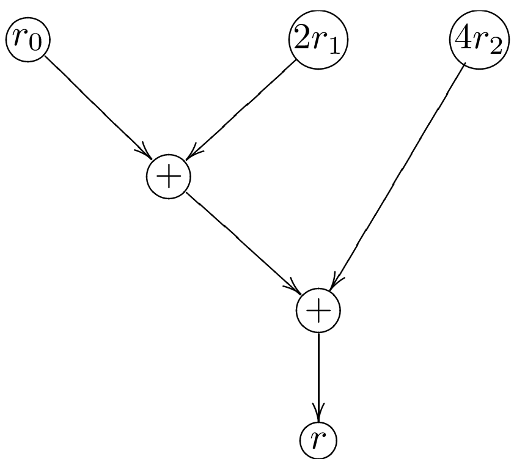

# Cryptography Day III

<pba-flex center>

- Quiz
- Hash Based Data Structures
- Exotic Primitives
- Merkle Tree Activity
- Zero-Knowledge Proofs (Part I)<!-- .element: class="fragment" data-fragment-index="3" -->
- Crypto in Context <!-- .element: class="fragment" data-fragment-index="4" -->
- VRF Poker Activity<!-- .element: class="fragment" data-fragment-index="5" -->

</pba-flex>

---

# ZK Proofs

---

# Outline

<pba-flex center>

1. [ZK Proofs overview](#zk-proofs)<!-- .element: class="fragment" data-fragment-index="0" -->
2. [Examples](#simple-zk-example)<!-- .element: class="fragment" data-fragment-index="1" -->
3. [zk-SNARKs](#zk-snarks)<!-- .element: class="fragment" data-fragment-index="2" -->
4. [Applications of zk-SNARKs](#zk-application)<!-- .element: class="fragment" data-fragment-index="3" -->

</pba-flex>

---

## ZK Proofs

How do we do private operations on a public blockchain and have everyone know that they were done correctly?

Notes:

(we are working on substrate support for these and will use them for protocols)

---

## What is a ZK Proof?

- A prover wants to convince a verifier that something is true without revealing why it is true.

- They are mostly interactive protocols, but mostly we'll turn them non-interactive and deal with their non-interactive variety.

Notes:

- Interactive means multiple back and forthes between parties. It requires that the parties to be online at the same time.
- Non-interactive means one party post their contribution and the other party could use the data at the time of their convinience.
  This does not require the praties to be online at the same time.

---

## What can we show?

- NP relation: `function(statement, witness) -> bool`

- Prover knows a witness for a statement:

  - They want to show that they know it (_a proof of knowledge_)

  - ... Without revealing anything about the witness (_ZK_)

Notes:
NP problems are problems that might be hard to solve but are relatively easy to verify. Easy as in "polynomial time".

---

## ZK Proof Interface

- NP relation: `function(statement, witness) -> bool`

- `prove(statement, witness) -> proof`

- `verify(statement, proof) -> bool`

---

## Examples

---

## ZK Proof Example

_Example:_ Schnorr signatures are ZK Proofs

- $(s, e)$ such that $s = (\textrm{Random blinding factor }r) - \\ \textrm{Private Key} \times e$<!-- .element: class="fragment" data-fragment-index="0" -->
- They show that the prover knows the private key such that $\textrm{private key} \times G = \textrm{Public Key}$ without revealing anything about it.<!-- .element: class="fragment" data-fragment-index="1" -->
- The statement is the public key and the witness the private key.<!-- .element: class="fragment" data-fragment-index="2" -->

---

## The ZK Proof Example we study in this module

_Example:_ Prover knows a non-trivial factorization of N

- Prover wants to prove that they know $N = r \times s$ without revealing $r$ or $s$.<!-- .element: class="fragment" data-fragment-index="0" -->
- The Prover should convince us they know the two non-trivial integer $r$ and $s$ that is $r,s \neq 1$ such that:<!-- .element: class="fragment" data-fragment-index="1" -->

$r\times s = N$ <!-- .element: class="fragment" data-fragment-index="1" -->

- Without revealing any other information about $r$ or $s$.<!-- .element: class="fragment" data-fragment-index="2" -->
- The statement is $N$ and the witnesses are $r$ and $s$.<!-- .element: class="fragment" data-fragment-index="3" -->

---

## ZK Proof properties

- Completeness: If the claim is true, then it _must_ pass `verify(statement, proof) == true`
- Statistical Knowledge Soundness: If the prover does not know the witness then `verify(statement, proof) == false` with high probability
- Zero Knowledge: the proof reveals nothing about the witness that was not revealed by the statement itself<!-- .element: class="fragment" data-fragment-index="0" -->
- The common way of implementing zero knowledge protocol is by means of zk-SNARK<!-- .element: class="fragment" data-fragment-index="1" -->

Notes:

- We prove Zero knowldege by showing a party without any knowledge of the witness, could fool an external party who was not been part of the interaction that they interacted with the prover and got a valid proof form the prover.

---

## zk-SNARKs

---

## zk-SNARK

**Z**ero-**K**nowledge **S**uccinct **N**on-interactive **Ar**gument of **K**nowledge

- **Zero knowledge** - the proof reveals nothing about the witness that was not revealed by the statement itself.
- **Succinct** - the proof is small
- **Non-interactive** - Does not require live interaction between the prover and verifier.
- **Proof of knowledge** - if you can compute correct proofs of a statement, you should be able to compute a witness for it.

---

## What can we show?

- NP relation: `function(statement, witness) -> bool`

  - They want to show that they know it (_a proof of knowledge_)

  - ... Without revealing anything about the witness (_ZK_)

- With a small proof even if the witness is large (_succinctness_)

---

## What can we show?

- There are many SNARK schemes to produce succinct ZK proofs of knowledge (_ZK-SNARKs_) for every NP relation. We concentrate on PLONK in this course.

---

## How do (polynomial-based) SNARKs prove of knowledge

- Translate our problem into an arithmetic circuit which should output zero if we know the solution.<!-- .element: class="fragment" data-fragment-index="0" -->
- Make a polynomials which have roots in specific values using the solutions.<!-- .element: class="fragment" data-fragment-index="1" -->
- Prove that we know the polynomial by evaluating it at random values and provig that we have evaluated it correctly.<!-- .element: class="fragment" data-fragment-index="2" -->
- We talk about each step in detail in next lecture<!-- .element: class="fragment" data-fragment-index="3" -->
- Most popular SNARKs uses polynomials, other SNARKs could use other mathematical structures such as vectors, etc<!-- .element: class="fragment" data-fragment-index="4" -->

Notes:

- We can not send the polynomial as a proof: 1. it is too big (so not succinct) 2. reveals the secret solution.

---

# SNARK = PIOP + commitment + Fiat-Shamir

- PIOP => ARK
- PIOP + Commitment => SARK
- PIOP + Commitment + Fiat-Shamir => SNARK

---

# SARK → SNARK

- Everytime the prover need the verifier to provide them with a random value... <!-- .element: class="fragment" data-fragment-index="1" -->
- The prover apply a hash function to all it has already provided to the verifier. <!-- .element: class="fragment" data-fragment-index="2" -->
- This way the prover is unable to cheat and control the value and break the systemc. <!-- .element: class="fragment" data-fragment-index="3" -->
- This is know Fiat-Shamir Transform <!-- .element: class="fragment" data-fragment-index="4" -->

---

## Applications of zk-SNARKs

---

## ZK Proof Scaling

- A small amount of data, a ZK proof, and execution time can be used to show properties of a much larger dataset which the verifier doesn't need to know.
- "doesn't need/want to" know as opposed to "is not supposed to" know.<!-- .element: class="fragment" data-fragment-index="1" -->

---

## Scaling via ZK Proofs in Blockchain

- Large amount of data - a blockchain
- Verifier is e.g. an app on a mobile phone

Notes:

e.g. Mina do a blockchain with a constant size proof (of correctness of execution and consensus) using recursive SNARKs.

---

## Scaling via ZK Proofs in Blockchain

- The verifier is a blockchain: very expensive data and computation costs.
- Layer 2s using ZK rollups

Notes:

Of which Ethereum has many, ZKsync, ZKEVM etc.
Polkadot already scales better!

---

## Privacy

<pba-flex center>

A user has private data, but we can show publicly that this private data is correctly used. 
An example would a private cryptocurrency:

- Keep who pays who secret
- Keep amounts secret,   _But show they are positive!_

</pba-flex>

Notes:

You can do some of keeping amounts secret without ZK-SNARKs, but the positive part is difficult.
To do everything well, ZK-SNARKs are needed in e.g. ZCash and its many derivatives e.g. Manta.

---

## Practical Considerations

- Very powerful primitive<!-- .element: class="fragment" data-fragment-index="0" -->
- Useful for both scaling and privacy<!-- .element: class="fragment" data-fragment-index="1" -->
- One can design many protocols with ZK Proofs that wouldn't otherwise be possible<!-- .element: class="fragment" data-fragment-index="2" -->

---

## Downside

- Slow prover time for general computation<!-- .element: class="fragment" data-fragment-index="1" -->
- To be fast, need to hand optimize<!-- .element: class="fragment" data-fragment-index="2" -->

Notes:
Very weird computation model?
Weird as in binary arithmetic is hard, condition is hard.
taking square-root of an element mod p is easy.
Non-deterministic arithmetic circuits

---

## Under the hood of zk-SNARKs

- We are going to talk about the elementary math behind zk-SNARKs.<!-- .element: class="fragment" data-fragment-index="0" -->
- The goal is to familiarize you with the magic behind the zk-SNARKs.<!-- .element: class="fragment" data-fragment-index="1" -->
- But we are not aming at making you zk-Proof expert in one lecture.<!-- .element: class="fragment" data-fragment-index="2" -->

---

## Recall steps to SNARKify your problem

- Turn the problem into an arithmetic circuit (describe it only with +, -, x). <!-- .element: class="fragment" data-fragment-index="0" -->
- Make polynomials from the circuit and your secret solution.<!-- .element: class="fragment" data-fragment-index="1" -->
- But we are not aming at making you zk-Proof expert in one lecture.<!-- .element: class="fragment" data-fragment-index="2" -->

---

## Making a SNARK out of the factorization problem

- The trick is to transform our problem of proving the knowledge of factors (witnesses) into:<!-- .element: class="fragment" data-fragment-index="0" -->
- A problem of knowledge of certain polynomials.<!-- .element: class="fragment" data-fragment-index="1" -->
- $x^n + a_{n-1} x^{n-1} + \dots + a_1x + a_0$ <!-- .element: class="fragment" data-fragment-index="2" -->
- Then verifier could ask me questions about those polynomials, and if the prover answers correctly,<!-- .element: class="fragment" data-fragment-index="3" -->
- The verifier could be fairly confident that the prover knows that polynomial hence also the witness.<!-- .element: class="fragment" data-fragment-index="4" -->

---

## Making an SNARK for knowledge of factors problem

- A routine way of to turning the problem into a polynomial is:

1. To represents our problem into an arithmetic circuit.<!-- .element: class="fragment" data-fragment-index="1" -->
2. Then there are algorithms such as PLONK for representing the circuit as few univariate polynomials.<!-- .element: class="fragment" data-fragment-index="2" -->

Notes:

- Mathematically circuit is a n-variate polynomials, with some of the variables are public and some are not.

---

## The conditions the prover's solution must satisfy

- $r \times s = N$<!-- .element: class="fragment" data-fragment-index="0" -->
- We also need to make sure that prover doesn't fool us with trivial factors.<!-- .element: class="fragment" data-fragment-index="1" -->
- prevent them from using $r = 1$ or $s = 1$ only using polynomial equations.<!-- .element: class="fragment" data-fragment-index="2" -->
- $r \neq 1$ is not a polynomial equation.<!-- .element: class="fragment" data-fragment-index="3" -->
- So we ask them to invert $r - 1$ and $s-1$:<!-- .element: class="fragment" data-fragment-index="4" -->
  - $(r-1)\times \frac{1}{r - 1} = 1$<!-- .element: class="fragment" data-fragment-index="5" -->
  - $(s-1)\times \frac{1}{s - 1} = 1$<!-- .element: class="fragment" data-fragment-index="6" -->

---

## Overflow prevention

- Our polynomials are all defined modulo some prime $p$<!-- .element: class="fragment" data-fragment-index="0" -->
- We need to prevent the prover from fooling us with a factorization like<!-- .element: class="fragment" data-fragment-index="1" -->
  $r \times s = N' = N + q\times p$ where $q \neq 0$.<!-- .element: class="fragment" data-fragment-index="2" -->
- This happens if $r$ and $s$ are too big and $r \times s$ overflows over $p$<!-- .element: class="fragment" data-fragment-index="3" -->
- We should make sure that $r < \sqrt{p}$ and $s < \sqrt{p}$ are small.<!-- .element: class="fragment" data-fragment-index="4" -->
- We use binary decomposition instead.<!-- .element: class="fragment" data-fragment-index="5" -->
- $r = r_{0} + 2r_{1} + 4r_{2}$ where<!-- .element: class="fragment" data-fragment-index="6" -->
- We should only allow them to use 0 or 1 for $r_{i}$'s so they need to satisfy:<!-- .element: class="fragment" data-fragment-index="7" -->
- $r_{i} \times (r_{i} - 1) = 0$<!-- .element: class="fragment" data-fragment-index="8" -->

---

## Factorization Circuit

$r \times s = N$

---

## Prevent Factor 1 Circuit

$(r-1)(\frac{1}{r - 1}) = 1$

---

## Prevent Big Factors: Binary decompostion circuit

$r = r_{0} + 2r_{1} + 4r_{2} \Rightarrow$

$r_{01} = r_{0} + 2r_{1}$

$r = r_{01} + 4r_{2}$

---

## Prevent Big Factors: only allow 0 or 1 in binary decomposition

$r_{i} \times (r_{i} - 1) = 0$

---

## Writing our circuit in Circom

Circom demo.

---

## Summary

- We discussed the general idea of ZK-Proofs.
- Their application for scalability and privacy.
- We looked how a sample ZK Proof is generated.
- We generate and verify the proof using modern ZK tools.

---

<!-- .slide: data-background-color="#4A2439" -->

# Questions
