# Game Theory Basics

---

# Outline

<ul>
    <li class="fragment">Lesson
        <ul>
            <li class="fragment">What is Game Theory?</li>
            <li class="fragment">What is a Game?</li>
            <li class="fragment">Types of Games</li>
            <li class="fragment">Common Games</li>
            <li class="fragment">Nash Equilibrium</li>
            <li class="fragment">Equilibrium Selection</li>
        </ul>
    </li>
    <li class="fragment">Workshop & Activities
        <ul>
            <li class="fragment">Discussions & more games</li>
        </ul>
    </li>
</ul>

---

## What is Game Theory?

> Game theory studies strategic situations where the outcome for each participant or 'player' depends on the actions of all others. It formulates models to represent these scenarios and predicts the most likely or optimal outcomes.

Notes:

- Game theory is all about the power of incentives.
- Helps you understand and design systems and guide behavior of participants.

---

## Game Theory in Web3

In the context of blockchains, game theoretic reasoning is used for modelling and understanding.

Notes:

- The term is heavily over-used.
- 9/10 times people using the term they simply mean there is some economic structure behind their protocols.
- Rarely real game theoretic analysis is done.

---

## Modelling

<ul>
<li class="fragment"><strong>Tokenomics:</strong> Macroeconomic design of a token (inflation, utility, etc.).</li>
<li class="fragment"><strong>Business Logic:</strong> Interaction of the token with different modules of a protocol.</li>
<li class="fragment"><strong>Consensus:</strong> Providing sufficient incentives to guarantee that participating nodes agree on a distributed state of the network.</li>
<li class="fragment"><strong>Collaboration:</strong> Nudging (aggregated) human behavior and their interaction with the protocol.</li>
</ul>

---

## Understanding

<ul>
<li class="fragment"><strong>Economics:</strong> Interaction between different protocols and how finite resources are allocated among all of them.</li>
<li class="fragment"><strong>Security:</strong> Testing economic security of protocols against various types of attacks.</li>
</ul>

---

## History of Game Theory

<ul>
<li class="fragment">Early “game theoretic” considerations going back to ancient times.</li>
<li class="fragment">“Game theoretic” research early 19th century, still relevant.</li>
<li class="fragment">The systematic study of games with mathematically and logically sound frameworks started in the 20th century.</li>
<li class="fragment">Modern game theory is used in economics, biology, sociology, political science, psychology, among others.</li>
<li class="fragment">In economics, game theory is used to analyze many different strategic situations like auctions, industrial economics, and business administration.</li>
</ul>

Notes:

- In Plato's texts, Socrates recalls the following considerations of a commentator of the Battle of Delium:
  - An example is a soldier considering his options in battle: if his side is likely to win, his personal contribution might not be essential, but he risks injury or death.
    If his side is likely to lose, his risk of injury or death increases, and his contribution becomes pointless.
  - This reasoning might suggest the soldier is better off fleeing, regardless of the likely outcome of the battle.
  - If all soldiers think this way, the battle is certain to be lost.
  - The soldiers' anticipation of each other's reasoning can lead to a self-fulfilling prophecy: they might panic and retreat before the enemy even engages, resulting in a defeat.
- Spanish conqueror Cortez, when landing in Mexico with a small force who had good reason to fear their capacity to repel attack from the far more numerous Aztecs, removed the risk that his troops might think their way into a retreat by burning the ships on which they had landed
- Antoine Augustin Cournot, a french mathematician, already described a duopoly game with respective solution in 1844.
  - We will see this later.
- Examples:
  - Biology: Animals fight for resources or are peaceful, why cooperation evolved
  - Political science: Art of conflict, escalation and de-escalation between nations.

---

## Game theory is abstract

<ul>
<li class="fragment">Game theoretic models aim to get at the essence of a given strategic problem.</li>
<li class="fragment">This often requires many simplifying assumptions.</li>
<li class="fragment">Pro: <em>Abstraction</em> makes the problem amenable to analysis and helps to identify the key incentives at work.</li>
<li class="fragment">Con: A certain lack of realism.</li>
<li class="fragment">In any case: Modeling a strategic situation always entails a tradeoff between tractability and realism.</li>
</ul>

Notes:

- Need to explain what we mean by lack of realism:
- Often people have more choices than we model.
- Often people take other things into consideration when making choices than the model allows.
- Often people know more/less than we assume.
- How to resolve the tradeoff between tractability and realism is often subjective and depends on the taste of the modeler.

---

# What is a Game?

---

## Definition: (Economic) Game

<ul>
<li class="fragment">A game is a strategic interaction among several players, that defines <em>common knowledge</em> about the following properties:</li>
<li class="fragment">all the possible <em>actions</em> of the players</li>
<li class="fragment">all the possible <em>outcomes</em></li>
<li class="fragment">how each combination of actions affects the outcome</li>
<li class="fragment">how the players value the different outcomes</li>
</ul>

---

## Definition: Common Knowledge

<ul>
<li class="fragment">An event $X$ is common knowledge if:</li>
<ul>
<li class="fragment">everyone knows $X$,</li>
<li class="fragment">everyone knows that everyone knows $X$,</li>
<li class="fragment">everyone knows that everyone knows that everyone knows $X$,</li>
<li class="fragment">... and so on ad infinitum.</li>
</ul>
</ul>

---

### Examples: Common Knowledge

<pba-cols>
<pba-col>

##### Auctions

- Actions: Bids.
- Outcome: Winner and Payment.

</pba-col>
<pba-col>

##### Price-competition between firms

- Actions: Price charged.
- Outcome: Demand for each firm, profit of each firm.

</pba-col>
</pba-cols>

Notes:

Crucial feature of a game: outcome not only depends on own actions but also on the actions of the other players.

---

## Types of games

Game theory distinguishes between:

<ul>
<li class="fragment">static & dynamic games</li>
<li class="fragment">complete & incomplete information games</li>
</ul>

---

## Static and Dynamic Games

|                  | Static Game                                                          | Dynamic Game                                                                                           |
| ---------------- | -------------------------------------------------------------------- | ------------------------------------------------------------------------------------------------------ |
| Definition       | All players take their actions at the same time                      | Players move sequentially and possibly multiple times, (at least partially) observing previous actions |
| Simple Example   | Rock-Paper-Scissors                                                  | Tic-Tac-Toe                                                                                            |
| Economic Example | Sealed-bid auction.                                                  | English Auction.                                                                                       |
|                  | All bidders submit their bids simultaneously (in a sealed envelope). | Auctioneer publicly raises price if at least one bidder accepts the price.                             |
| Representation   | Payoff Matrix                                                        | Decision Tree                                                                                          |

Notes:

- Also referred to as simultaneous or sequential games

---

## Completeness of Information in Games

|                       | Game of Complete Information                          | Game of Incomplete Information                             |
| --------------------- | ----------------------------------------------------- | ---------------------------------------------------------- |
| Information available | All information relevant to decision-making is known. | Not all information relevant to decision-making is known.  |
| Simple Example        | Chess                                                 | Poker                                                      |
| Economic Example      | Sealed auction for seized Bitcoin.                    | Used-car market: the resale value of a used car is opaque. |

---

### Three firms want to hire an engineer...

<pba-cols>
<pba-col>

- The engineer brings added value to each firm of 300,000 USD per year.
- The payoff of the firm is known by everyone to be 300,000 USD minus the salary.
- The payoff to the engineer is salary minus cost of working, which is known to everyone.
- All firms make a salary offer at the same time.

</pba-col>
<pba-col>

### Quiz Questions:

1.  Is this game static or dynamic?
    What would need to change in the description of the game such that it would fall in the other category?
1.  Is this game of complete or incomplete information?
    What would need to change in the description of the game such that it would fall in the other category?

</pba-col>
</pba-cols>

Notes:

1.  The game is static.
    For it to be dynamic, firms would need to make offers sequentially, _knowing what the firms before had offered_.

2.  The game is of complete information.
    To make information incomplete, we would need to have that the value of hiring the engineer differs between firms and is unknown between firms.
    Or that the cost of working for the engineer is not known to the firms.
    The point is that we need to have uncertainty over payoffs.

- This lesson focuses on static games of complete information.
- When we look at auctions in lesson Price finding mechanisms, we will also consider games of incomplete information, both dynamic and static.

---

## Utility

<ul>
    <li class="fragment">Core concept of Game Theory.</li>
    <li class="fragment">Can transform any outcome to some value that is comparable.
        <ul>
            <li class="fragment">For example: What is better? Scenario A: Going for a vacation to France and drink Wine, or Scenario B: going to Germany and drink Beer?</li>
            <li class="fragment">Those dimensions are only comparable if we give both some value like U(A) = 5, U(B) = 3.</li>
        </ul>
    </li>
    <li class="fragment">Essential assumption: Agents are utility maximizers.</li>
    <li class="fragment">Monetary payouts can also be transformed to utility.
        <ul>
            <li class="fragment">Simplest assumption U(x) = x.</li>
            <li class="fragment">But that is likely not true in reality.</li>
        </ul>
    </li>
    <li class="fragment">Most things have <strong>diminishing rates of returns</strong>.</li>
</ul>

Notes:

- Expected Utility is the average utility we get from comparing several outcomes and weigh them with the probability they occur.
- In the following, we won't need that, because either we deal with money or other dimensions that are comparable.

---

<!-- .slide: data-background-color="#4A2439" -->

# Common Games

---

## Prisoners' Dilemma

A fundamental problem:

> Even though everyone knows there is a socially optimal course of actions, no one will take it because they are rational utility maximizers.

It's a static game of complete information.

Notes:

One of the most famous games studied in game theory.

- Static because both players take their action at the same time.
- Complete because everybody is aware of all the payouts.

---

## Bonnie and Clyde

Bonnie and Clyde are accused of robbing two banks:

<ul>
<li class="fragment">The evidence for the first robbery is overwhelming and will certainly lead to a conviction with two years of jail.</li>
<li class="fragment">The evidence for the second robbery is not sufficient and they will be convicted only if at least one of them confesses to it.</li>
</ul>

---

## Bonnie and Clyde

In the interrogation they both are offered the following:

<ul>
<li class="fragment">If you both confess you both go to jail for 4 years.</li>
<li class="fragment">If you do not confess but your partner does, you go to jail for 5 years: 1 extra year for obstruction of justice.</li>
<li class="fragment">However, if you confess but your partner does not, we reduce your jail time to one year.</li>
</ul>

Notes:

They are interrogated in different rooms, apart from each other.

---

## Bonnie and Clyde

- **Cooperate** ($C$) with each other and not say anything
- **Defect** ($D$) and confess their crime

    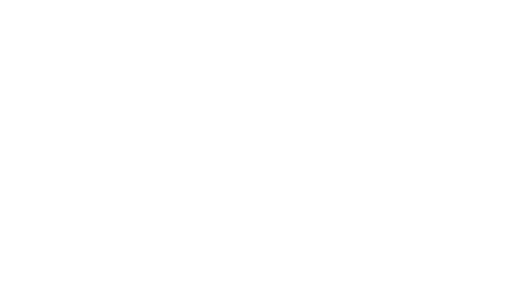

Notes:

- They can either cooperate or defect
- Second payoff is Clyde, first is Bonnie

---

## Nash-Equilibrium

<ul>
<li class="fragment">Fundamental concept in Game Theory</li>
<li class="fragment">A NE is a set of strategies, one for each player, such that no player can unilaterally improve their outcome by changing their strategy, assuming that the other player's strategy remains the same.</li>
</ul>

---

## Finding the NE

    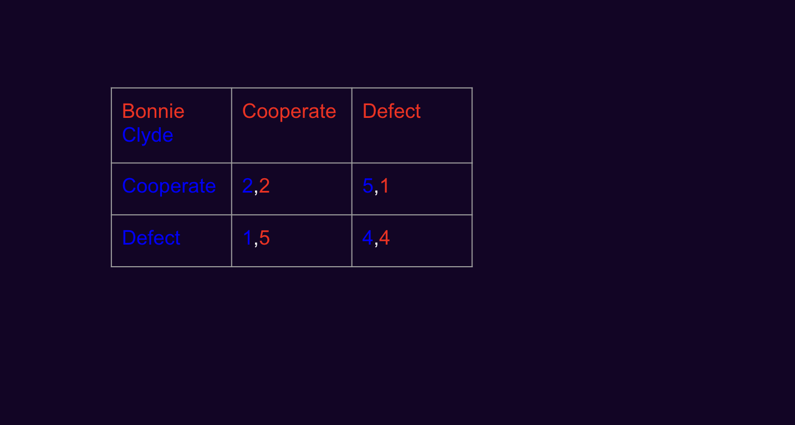

---

## Finding the NE

    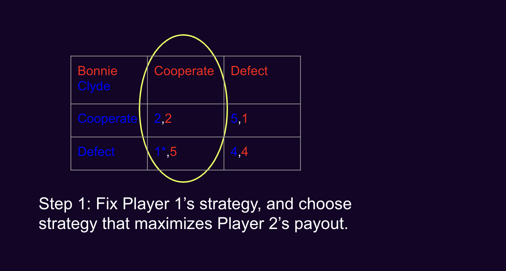

---

## Finding the NE

    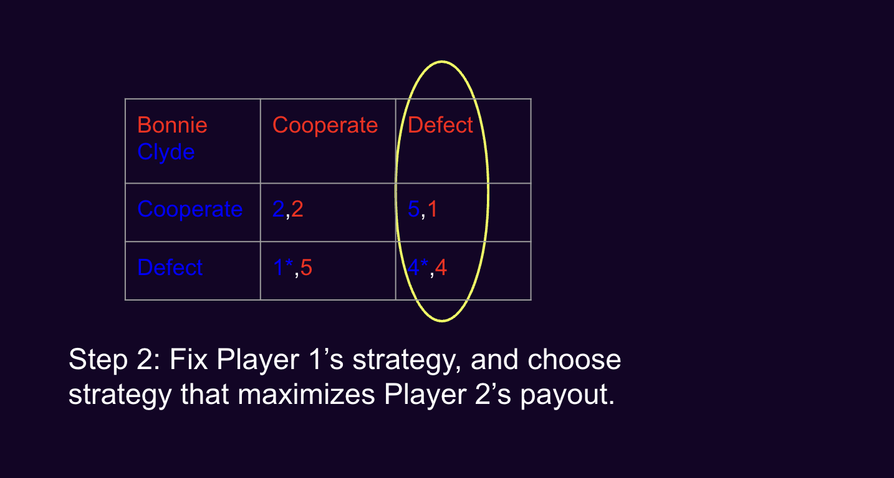

---

## Finding the NE

    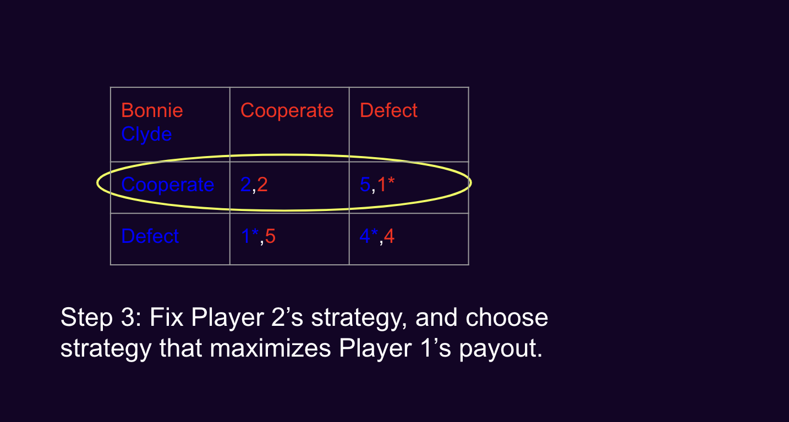

---

## Finding the NE

    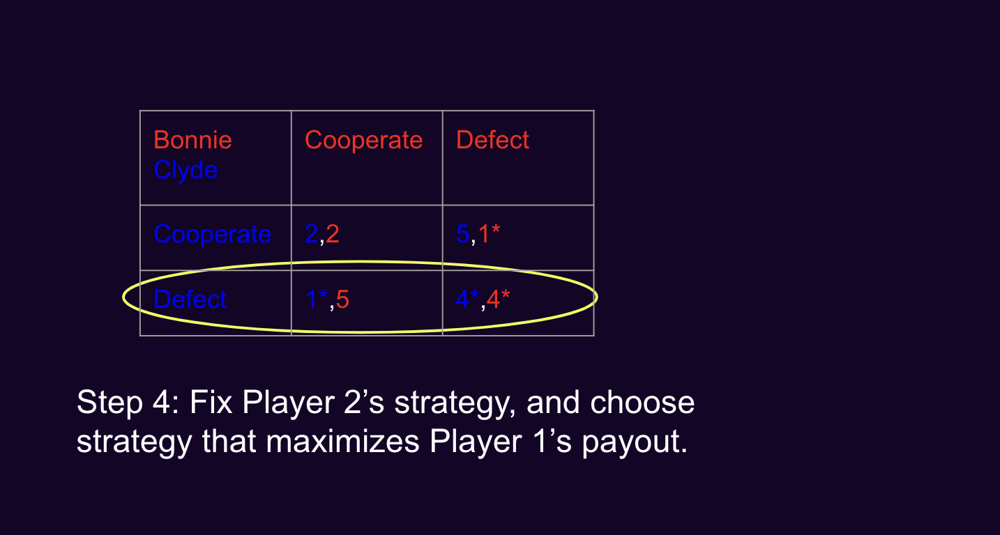

---

## Finding the NE

    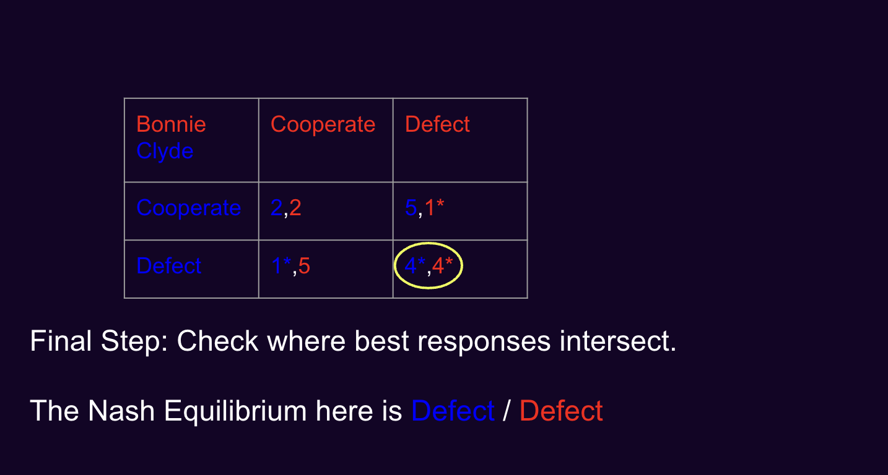

---

## Nash Equilibrium

- Remember: a Nash Equilibrium describes a set of strategies such that no player can unilaterally increase their payout assuming the other player's strategy is fixed.
- A Nash Equilibrium **does not mean** that payouts of players are maximized (either individually or collectively)!

---

## Dominant Strategy

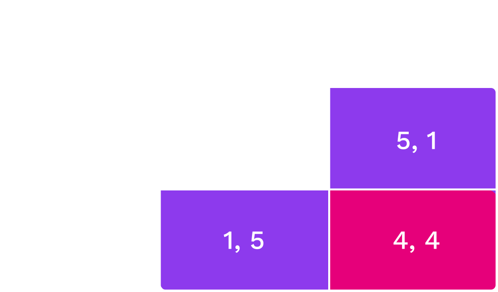

Choosing D is a dominant strategy: a strategy that is always optimal for a player, regardless of what the other players do.

Notes:

No matter what Clyde does, D is always the best choice.
So, they end up both defecting, resulting in 4 years each.
It would be in their best interest to cooperate and not to say anything.
This would minimize the total jail time for the two.
However, both Bonnie and Clyde are rational utility maximizers.
So, they end up in a situation where they not only fare worse _individually_ (4 instead of 2) but also _jointly_ (the total jail time is 8 years rather than 4 years).

---

## Prisoners' Dilemma IRL

<ul>
<li class="fragment"><strong>Nuclear Arms Race:</strong> <a href="https://www.history.com/topics/cold-war/arms-race">NATO and Russia</a> prefer no arms race to an arms race. Yet, having some arms is preferable to having no arms, irrespective of whether the other one is armed.</li>
<li class="fragment"><strong>OPEC:</strong> <a href="https://www.opec.org/opec_web/en/">Limiting oil supply</a> is in the best interest of all. However, given the high price that thus results, everyone has an incentive to increase individual oil supply to maximize profits.</li>
</ul>

Notes:

OPEC: Organization of the Petroleum Exporting Countries.
It is something like a cartel that agree on limiting the global oil production and keep the oil price artificially high.

OPEC and Cartels generally seems to overcome the Prisoners' Dilemma...
More on that later.

---

## Ultimatum Game

<ul>
    <li class="fragment">We played it before.</li>
    <li class="fragment">Sequential game.</li>
    <li class="fragment">The Nash Equilibrium can be reasoned by <strong>backwards induction.</strong></li>
    <li class="fragment">The proposer has the following considerations:
    <ul>
        <li class="fragment">What would the recipient accept?</li>
        <li class="fragment">Answer: every payoff (larger than 0).</li>
        <li class="fragment">Therefore, I should offer, since I want to maximize my payout, something equal or slightly higher than 0.</li>
    </ul>
    </li>
    <li class="fragment">That means, the proposer offering something small and the recipient always accepting is the only NE.</li>
</ul>

Notes:

- We saw that empirically that is not the case.
- Fairness concerns are too strong in that setting.

---

## Coordination Game

<ul>
<li class="fragment">The prediction of play in the Prisoner's Dilemma was easy: both will defect.
  <ul>
  <li class="fragment">This is the optimal thing to do no matter what the other player does.</li>
  </ul>
</li>
<li class="fragment">In other games, predictions of play are not so clear.
  <ul>
  <li class="fragment">One instance is the coordination game.</li>
  </ul>
</li>
</ul>

---

## Coordination Game

> A coordination game is a type of static game in which a player will earn a higher payoff when they select the same course of action as another player.

---

## Coordination Game Example

<pba-cols>
<pba-col>

- Choose $L$ or $R$.
- The numbers represent the payoffs a player receives.
- The players only obtain utility if they coordinate their actions.

</pba-col>
<pba-col>

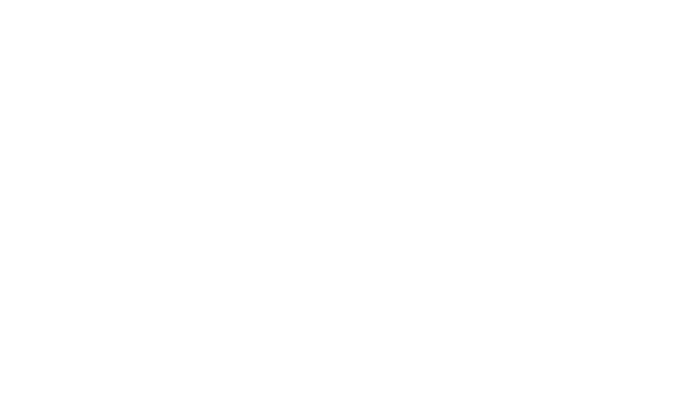

</pba-col>
</pba-cols>

Notes:

Examples:

- Driving on the right/left side of the road.
- Money adoption.
- Standard adoption.

---

## Coordination Game Example

<pba-cols>
<pba-col>

- The coordination game has two outcomes $(L,L)$ and $(R,R)$ that stand out.
- Clearly, if the other player chooses $L$ ($R$), then it is optimal for the other to do so also.
- So, in the outcomes $(L,L)$ and $(R,R)$ the players choose mutually optimal actions.

</pba-col>
<pba-col>

</pba-col>
</pba-cols>

Notes:

- That is, for both players it holds:
  - Playing $L$ is a _best response_ to the other player playing $L$.
  - Playing $R$ is a _best response_ to the other player playing $R$.

---

## Coordination Game Example

<pba-cols>
<pba-col>

- Both $(L,L)$ and $(R,R)$ are instances of Nash equilibrium.
- By their very nature, coordination games always have multiple equilibria.
- The outcome $(D,D)$ in the Prisoner's dilemma is the unique Nash equilibrium.

</pba-col>
<pba-col>

</pba-col>
</pba-cols>

Notes:

Nash equilibrium: If other players follows the recommended strategy, then the best response for you is to do the same.
As the same logic is true for other players, it's reasonable to assume that everybody will indeed follow the recommended strategy.

However, a Nash equilibrium is a weaker notion than a dominant strategy, because if the other players don't follow the recommended strategy, it is not clear what your best response should be.

---

## Equilibrium selection

<ul>
    <li class="fragment">So, which outcome does the theory of Nash equilibrium predict in the coordination game?</li>
      <ul>
      <li class="fragment">None? Both?</li>
      </ul>
    <li class="fragment">Sometimes people switch between equilibria (if they are made to)...</li>
</ul>

    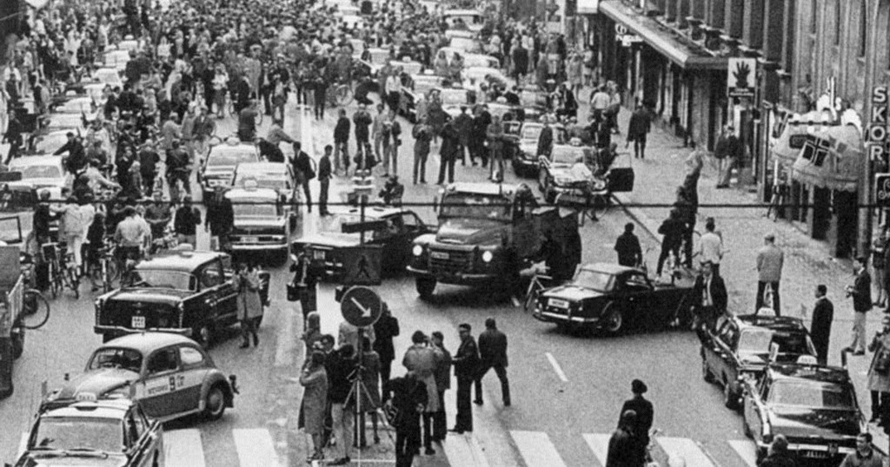 
    
Sweden, 1967.

Notes:

- The NE does not predict any outcome.
- Sweden switched from left-side driving to right-side.

---

## Schelling Points

<ul>
<li class="fragment">Nash equilibrium does not predict which strategies the players actually take.</li>
<li class="fragment">This is especially pronounced in games with multiple equilibria (e.g., coordination games).</li>
<li class="fragment">There are theories that offer insights into which strategies players actually take.</li>
</ul>

Notes:

- In the 1950s American economist Thomas Schelling ran a couple of informal experiments in which he asked his students (quote on slide)

---

## Schelling Points

> If you are to meet a stranger in New York City, but you cannot communicate with the person, then when and where will you choose to meet?

<ul>
<li class="fragment">Literally any point and time is a Nash equilibrium...</li>
<ul>
<li class="fragment">However, most people responded: noon at (the information booth at) Grand Central Terminal.</li>
</ul>
<li class="fragment">Basic idea: in case of multiple equilibria, social norms may help to choose one.</li>
</ul>

Notes:

- Imagine you are held in prison.
- You and your significant other is asked to guess a number.
- If you both guess the same number, you are set free.
- You have the following options: 0.231, 1, or 0.823
- Guessing both the same number is a NE every time.
- It's highly likely you will walk free.

---

# Summary (so far...)

<ul>
<li class="fragment">Typology of games: static/dynamic, complete/incomplete information.</li>
<li class="fragment">Three canonical games: Prisoner's Dilemma, Ultimatum-, and Coordination Game.</li>
<li class="fragment">The Prisoner's Dilemma has a unique Nash equilibrium, which is dominant, whereas the Coordination game has two Nash equilibria.</li>
<li class="fragment">To select among multiple equilibria, the concept of a Schelling Point is sometimes used.</li>
</ul>

---

## Why are theories of equilibrium important?

<ul>
<li class="fragment">Nash Equilibria are used to predict the behavior of others in a closed system.</li>
<li class="fragment">If you can identify a unique Nash Equilibrium or the Schelling point in a system, you have a strong prediction of user behavior.</li>
<li class="fragment">So, you can begin to drive user behavior by designing incentives accordingly.</li>
</ul>

---

## Public Goods

<ul>
<li class="fragment"><strong>Non-excludable</strong> No-one can be excluded from consumption</li>
<li class="fragment"><strong>Non-rivalrous</strong> My consumption does not affect yours</li>
<li class="fragment">e.g., fireworks, street-lighting.</li>
</ul>

Notes:

- We will now talk about public goods and common goods, which are goods enjoyed by everyone.
- This is, of course, a very important and very tricky class of goods in a collective.

---

## Common Goods

<ul>
<li class="fragment"><strong>Non-excludable</strong> No-one can be excluded from consumption</li>
<li class="fragment"><strong>Rivalrous</strong> My consumption reduces your possibility to consume</li>
<li class="fragment">i.e., a public park, an office coffee machine.</li>
</ul>

Notes:

- Recall: Public good was _non_-rivalrous.

Examples:

- Public park: anyone can go; too many people spoil the experience or kills the grass.
- Coffee machine in the office: anyone can use it; too many users may cause congestion or the amount of coffee may be limited.

---

## Public vs. Common Good

<ul>
<li class="fragment">Main difference is that in a common good your consumption reduces the value of the good to others.</li>
<li class="fragment">This is called a consumption externality that you impose on others (and others impose on you.)</li>
<li class="fragment"> The tragedy of the commons is that, because you do not take this externality into account, consumption is higher than would be socially optimal. </li>
</ul>

---

## Stylized Public Good Game:

<ul>
<li class="fragment">$N$ players have 10 US dollars each, say, $N=4$.</li>
<li class="fragment">Each player can choose how much to place into a project.</li>
<li class="fragment">Funds in the project are magically multiplied by a factor $\alpha$, say, $\alpha=2$.</li>
<li class="fragment">Finally, the funds in the project are split equally among all players.</li>
<ul>
  <li class="fragment">What would be best for the individual?</li>
  <li class="fragment">What would be best for the collective?</li>
<ul>
</ul>

Notes:

- As long as $\alpha>1$, it's best for the collective to contribute as much money as possible, because the money in the project increases magically, so we end up with more money that we started with.
- However, the problem is that everyone benefits from the project funds regardless of their individual contribution (it is a common good). If a player decreases their initial contribution by one dollar, their individual payoff decreases by $\alpha/N$ dollars, so as long as $\alpha<N$, it is best for each individual to contribute zero.
- As a result, we can expect that no one will contribute anything, and the money-multiplying powers of the project will be unused. This opportunity cost is a tragedy of the commons.
- Finally, if $\alpha\geq N$ then it would be individually better to contribute everything, and we would not have a tragedy of the commons.

---

## Overfishing

<ul>
<li class="fragment">Fishing gives private benefit but might destroy the broader ecosystem, which has its own value for everyone (e.g., due to tourism).</li>
<li class="fragment">Because individual fishermen do not pay for the damage they cause to the broader ecosystem, they will fish too much.</li>
</ul>

---

## Air pollution

<ul>
<li class="fragment">Producing a good yields private profit but reduces air quality for everyone.</li>
<li class="fragment">Because there is no price attached to air quality, the firms do not have to pay for its reduction and, hence, will produce too much.</li>
</ul>

---

## But...

<ul>
<li class="fragment">There should be fishing/production/mining! After all, there are always benefits to these activities.</li>
<li class="fragment">The tragedy of the commons is that the externality is not priced into these activities, driving them to inefficiently high levels.</li>
</ul>

Notes:

To be precise, in the last example the so-called "tragedy" is not that producing a good leads to air pollution; after all, this may be unavoidable if we want to consume the good.
The tragedy is that even if we agree on the level of production and air pollution that is economically ideal for the collective, we will end up with more pollution.

---

<!-- .slide: data-background-color="#000" -->

# Break (10 minutes)

Notes:

- Next up class activities.

---

<!-- .slide: data-background-color="#4A2439" -->

# Open Source

> Providing open-source software is like contributing to a public good and the community will therefore sooner or later collapse!

Notes:

- Why it might not fail:
  - Other incentives:
    - Intrinsic motivation
    - Reputation concerns (your github history is part of your CV)
    - Reciprocity
    - Direct benefit: Some contributors also use the software and benefit from improvements.

---

<!-- .slide: data-background-color="#4A2439" -->

# Design a 2x2 game

> Jack and Christine are rivals and keep taunting each other in front of others.
> At one time, Jack challenges Christine to a game of chicken.
> He proposes that they both get in their cars and drive towards each other on a road.
> In the middle of the distance between each other, there is a small bridge with a single lane.
> Whoever swerves away before the bridge chickened out.
> If both keep straight, there is no way to avoid a strong collision between the two cars.
> All friends will be present to see the result.

Design this game in a 2x2 matrix and assign payoffs to the different outcomes.

Notes:

- Need a white board!
- Give Class about 5 minuets to discuss in small groups on this
- Then have 10 minutes to ask the class you solve the 2x2 matrix and discuss (on next slide).

---

## Design a 2x2 game

- What is/are the Nash Equilibrium/Equilibria here?
- Which type of games does this remind you of?
- How would you translate this game to real scenarios?

Notes:

- Game of chicken or Hawk-Dove Game
- |              | Swerve | Straight     |
  | ------------ | ------ | ------------ |
  | **Swerve**   | 0, 0   | -1, +1       |
  | **Straight** | +1, -1 | -1000, -1000 |
- "Anti-Coordination Game" with the tension between competition and mutual benefit of compromise.
- Real-world situations of conflict, where both would prefer not to fight but would actually like to intimidate, leading to a real conflict.
- Two businesses would be better off not to engage in price war, but it would be good to be the only one to reduce the price to grab some market share.

---

<!-- .slide: data-background-color="#4A2439" -->

# Workshop: Games

Notes:

- roughly 70 minutes

---

## Game 1: Guessing Game

- We divide the classroom into three groups and play a guessing game.
- **The budget for this game is: $448**.
- The game is simple: each player enters a number from 1 to 100.
- The player who guessed closest to 2/3 of the average number wins.
- You can only choose integer values.
- If multiple people win, the payoff is split equally.
- The game is repeated for ten rounds.

---

<!-- .slide: data-background-color="#4A2439" -->

## Game 1: Questions?

### Don't ask about strategies!

---

## Game 1: Guessing Game

Link will be distributed!

---

## Game 1: Discussion

- What number did you choose / what was your strategy?
  (which group were you in?)
- Did your strategy change over time?

Notes:

- A number above 2/3\*100 does not make sense
- If everybody believes that, choosing a number above 2/3\*2/3\*100 does not make sense
- ... it goes to 0
- But does 0 Win? No!
- **Question: Who made these considerations?**
- Empirical results:
  - Financial Times asked their readers to submit their solution: Winning number was 13 (~1500 participants)
  - Other news magazine: ~3700 subjects, winning number 16.99, ~2800 subjects, winning number 14.7
  - There were spikes at 33 (response to randomness), 22 (response to that), and 0 (rationality)
- Level-k-thinking: 1 or 2 steps most prevalent, seldom more than that.
- **Question: What would be the NE for multiplication of 1 of the mean?**
  - It becomes a coordination game where all players choose the same value.

---

## Game 1: Results!

---

## Game 2: Prisoner's Dilemma

- You play a Prisoner's Dilemma (groups of 2) over 10 rounds.
- You will be randomly matched to another student in the class.
- **Budget for this game: $938**
- You have the option to chat between rounds.
- Important: Keep the chat civil and do not reveal any identifying information about yourself.
- We will read the chat.

---

## Game 2: Payoffs

|           |             | **_The other participant_** |                        |
| --------- | ----------- | --------------------------- | ---------------------- |
|           |             | _Cooperate_                 | _Defect_               |
| **_You_** | _Cooperate_ | 200 points, 200 points      | 0 points, 300 points   |
|           | _Defect_    | 300 points, 0 points        | 100 points, 100 points |

---

<!-- .slide: data-background-color="#4A2439" -->

## Game 2: Questions?

### Don't ask about strategies!

---

## Game 2: Let's go!

Link will be distributed!

---

## Game 2: Results!

---

## Repeated Prisonner's Dilemma

<ul>
    <li class="fragment">Prof. Robert Axelrod held a tournament in the 1980s to find out which computer program ("strategy") would perform best against others.</li>
    <li class="fragment">In the first tournament, 14 strategies were submitted by leading Game Theorists and others in the field.</li>
    <li class="fragment">The game would be repeated 200 times.</li>
    <li class="fragment">Each strategy would play against every other strategy and against itself.</li>
</ul>

Notes:

- Based on https://ve42.co/Axelrod1980a and https://www.youtube.com/watch?v=mScpHTIi-kM

---

## Repeated Prisonner's Dilemma

<ul>
    Some famous strategies were:
    <li class="fragment">Being sneaky: Cooperate but smuggle in some defections.</li>
    <li class="fragment">Grim trigger: Always cooperate but retaliate and defect forever, if the other defect once.</li>
    <li class="fragment">Tit-For-Tat: Start with cooperate and copy the opponent's strategy of the last round.</li>
</ul>

---

## Repeated Prisonner's Dilemma

<ul>
    <li class="fragment">Tit-for-Tat was the best-performing strategy.</li>
    <li class="fragment">Prof. Axelrod was able to deduce four main aspects of well-performing strategies:
        <ul>
            <li class="fragment">First: Be nice (do not defect first).</li>
            <li class="fragment">Second: Be forgiving (retaliate but do not hold a grudge).</li>
            <li class="fragment">Third: Be retaliatory (strike back).</li>
            <li class="fragment">Fourth: Be clear (signal a simple strategy so the other knows who they are playing against).</li>
        </ul>
    </li>
</ul>

Notes:

- This was rather big surprise, especially since dominant strategy is being nasty.
- A lot of it is what we can observe in today's politics.

---

## Repeated Prisonner's Dilemma

<ul>
    <li class="fragment">There is no single best strategy.</li>
    <li class="fragment">It always depends on who you are playing against.</li>
    <li class="fragment">Simulations in a later study show that a cluster of tit-for-tat players within a defecting population can grow and overtake defecting types.</li>
</ul>

---

## Game 3: Public Good Game

- We will play a public good game as presented in the lesson.
- **Budget for this game: $938**
- Groups of 4 over 10 periods.
- Points in the project is multiplied by factor $1.6$.
- With one additional mechanism: After each round each player sees the contributions of the other players and can decide to deduct points from them (at own costs).

---

## Game 3: Instructions

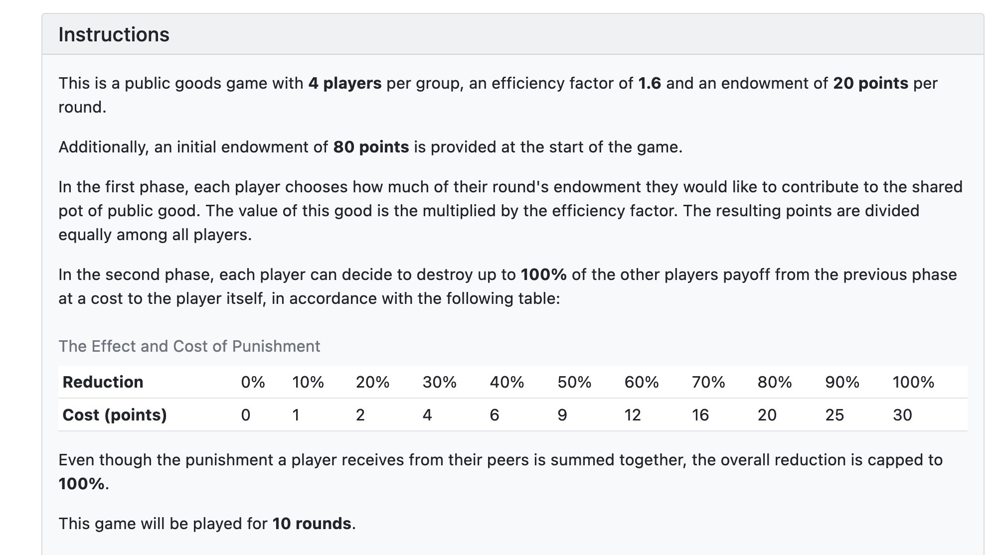

---

## Game 3: Contribution

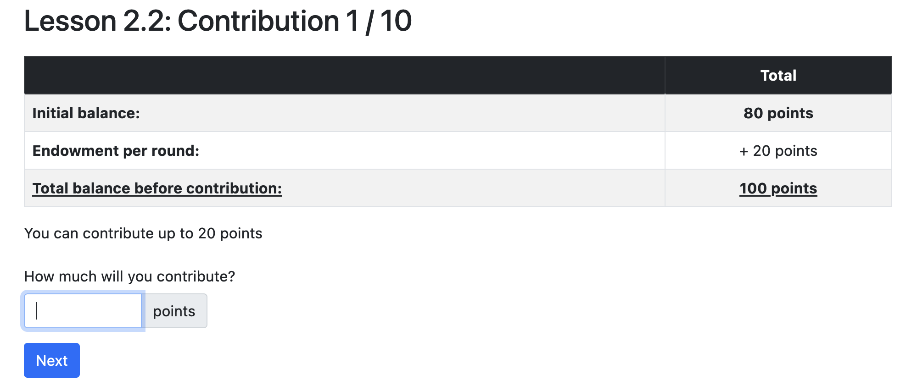

---

## Game 3: Punishment

---

## Game 3: Payout

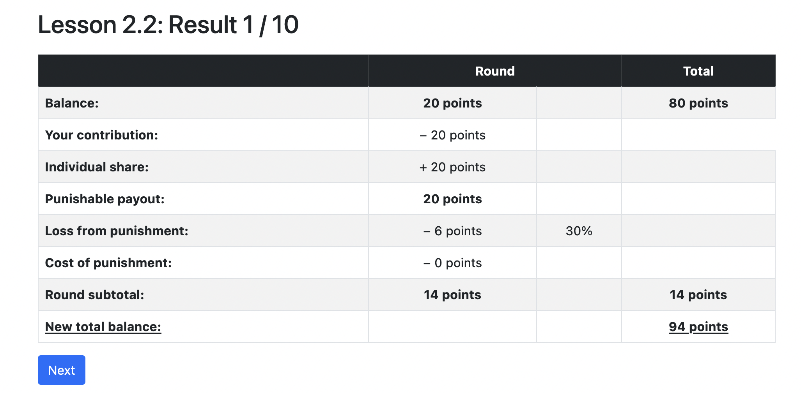

---

<!-- .slide: data-background-color="#4A2439" -->

## Game 3: Questions?

### Don't ask about strategies!

---

## Game 3: Let's go!

Link will be distributed!

---

## Game 3: Discussion

- What was your strategy?
- Were your groups able to sustain cooperation?
- Did you cooperate?
- Did you punish?

Notes:

- Additional free rider problem: Punishment was fixed to 100% of the other's points.
  That means, it was better to hope for other players to punish a player.
- They cooperate maybe because they did not understand the game.

---

<!-- .slide: data-background-color="#4A2439" -->

## Game 3: Results!

---

## Game 3: Discussion

<ul>
    <li class="fragment">How could we characterize players to types?
     <ul>
            <li class="fragment">Freerider</li>
            <li class="fragment">Cooperators</li>
            <li class="fragment">Altruists</li>
        </ul>
    <li class="fragment">What do you think happens when playing this ...
        <ul>
            <li class="fragment">... for one round?</li>
            <li class="fragment">... for many rounds?</li>
            <li class="fragment">... when allowing for communication?</li>
            <li class="fragment">... with different group sizes?</li>
        </ul>
    </li>
</ul>

Notes:

What about empirical evidence?

- One Round: Little contribution.
- Many Rounds: Some little contribution but quickly to 0.
- Some longer and stronger contribution but eventually going to 0 quickly
- Different group sizes: Larger groups are more prone to freeriding, i.e., cooperation collapses more quickly.
- **Question: How can we distinguish freerider from those that only freeride because they expect others to freeride?**
  - Answer: Ask them to provide a "conditional cooperation table" - i.e., they should state how much they contribute given other's /(average) contributions.
  - Real freeriders have 0 even if others contribute.

---

## Summary

- the basics of game theoretic concepts.
- different types of games.
- how games can be modeled.
- how to apply game theoretic thinking in our decision making in certain games.

---

<!-- .slide: data-background-color="#4A2439" -->

# Questions

---

## Further Reading

- [Comprehensive introduction to Game Theory](https://plato.stanford.edu/entries/game-theory/)
- [Great video about the Prisonner's Dilemma](https://www.youtube.com/watch?v=mScpHTIi-kM)
