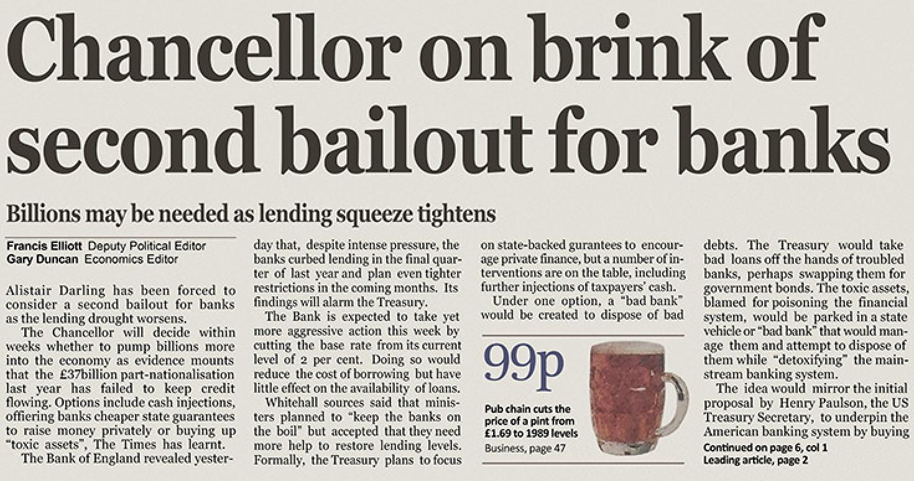
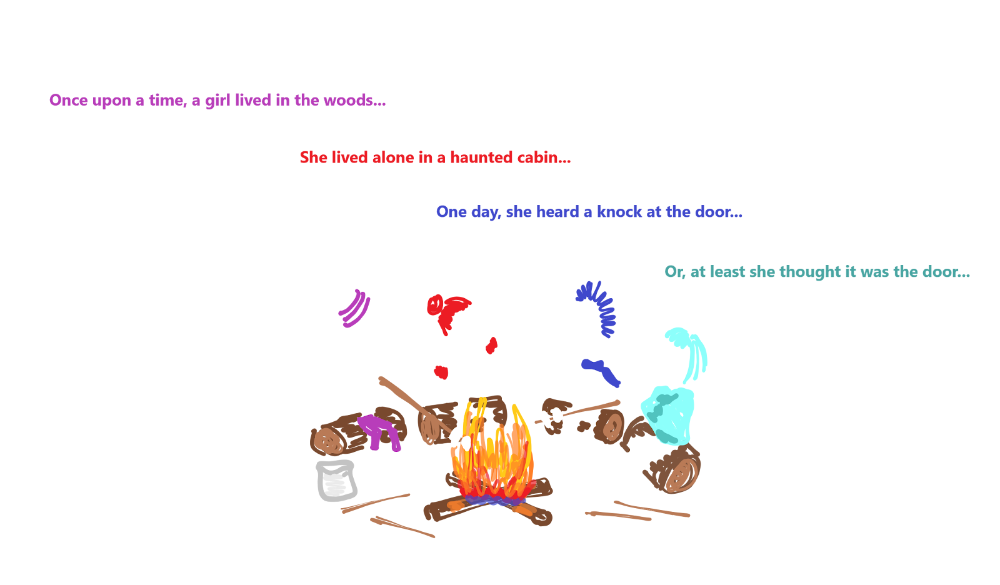
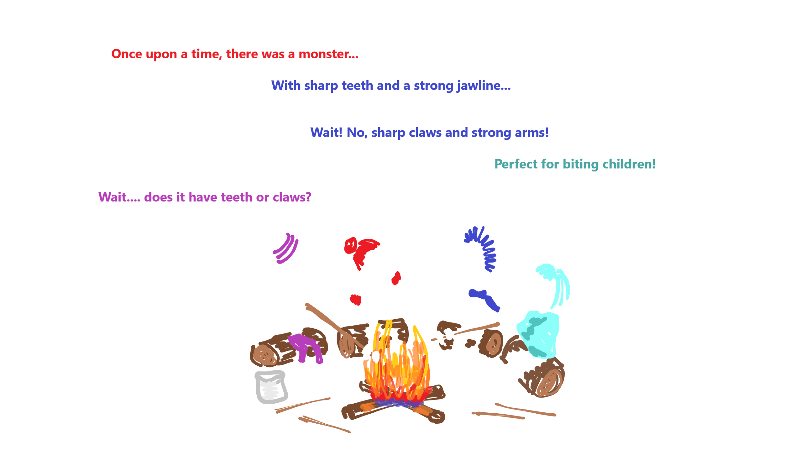

# Coordination and Centralization

## Past Present and Future

Notes:

Introduce instructors, tell about background, glad to be here.
Let's all learn together.
Shoot the shit until the initial nervousness starts to wear off, or at least peaks.

Lets get started.

For 100ks of year, humans have been on this earth.
During this time we have been working on better and better ways to understand each other, and coordinate with each other.
Sometimes we coordinate to do great things like build skyscrapers, or win sports tournaments.
Other times we just coordinate enough to not anger each other.

I believe that blcokchain is our generation's contribution to this endeavor that human kind is on.

---

## Goals

- Trustless provisioning of infrastructure. <!-- .element: class="fragment" -->
- Ways to coordinate with people we don't trust. <!-- .element: class="fragment" -->

Notes:

So. What are we doing here? What are our goals?

First:
Something kind of like a server, that doesn't rely on a server operator, and has strong guarantees like Cryptography has to offer.

Next: Coming to a shared understanding of a common history, and therefore a common state, of a system.

---v

## Comparison with Cryptography

Cryptography provides strong guarantees about _messages_ without a trusted party, regardless of the conduit over which a message was transported.

Notes:

Crypto guarantees:

- No tampering
- No eavesdropping
- Authenticity of the author

We want these same _kinds_ of guarantees, not just about messages, but about entire systems.

---

## A Shared History

Notes:

So now we understand the goals of web3. How do we achieve them? The key is allowing users to agree on a shared history. The simplest blockchains do nothing more than timestamp and attest to a stream of historical records. In Web 2, and indeed often in governmental bureaucracies, users have no visibility into the history of the app. They must trust the provider to accurately represent the current state. By giving the service provider the power to change the story, we give them the power to shape our understanding of reality and consequently our behavior.

---v

## A Shared History

> Any large-scale operation - whether a modern state, a medieval church, or an archaic tribe - is rooted in common stories that exist only in people's collective imaginations.

> Telling effective stories is not easy. The difficulty lies ... in convincing everyone else to believe it. Much of history revolves around this question: How does one convince millions of people to believe particular stories about gods, nations, or LLCs?

<!-- .element: class="fragment" -->

_-- Yuval Noah Harari, Sapiens --_

Notes:

Knowing and believing shared stories is important because it helps bootstrap trust.

---

## Let's Tell Some Stories

- Enuma Elish<!-- .element: class="fragment" -->
- Cherokee Creation Story<!-- .element: class="fragment" -->
- Big Bang<!-- .element: class="fragment" -->
- Genesis Creation Stor(ies)<!-- .element: class="fragment" -->

Notes:

Tell them or let students tell them.

These stories have really stood the test of time. They span cultures. They are the bedrock of much of modern humanity's understanding of who they are.

---v

## Newer Stories

Notes:

I'm not only a human. I'm also an American. This story is also important to me.

I bet some of you have other similar stories.

---v

## Modern Stories

Chancellor on Brink of second bailout for banks

Notes:

---

## Storytelling Technology

---

## Who Writes the Story?

A Dictator?

<blockquote>Dictator (n) - One who dictates, speaks, or narrates.

Notes:

This is how we used to understand how much grain was in the grainery.

This is how we used to understand what the holy scriptures told us to do.

This is dangerous.

---v

## Tell the Story Together

---v

## Tell the Story Together

---v

## Tell the Story Together

---

# The 21st Century Rumor Mill

Notes:

Shifting gears a little bit, let's take a look at what oral tradition, communication, and gossip have looked like in more recent times.

---

## Web 0

Telegraph, Telephone

Users transmit information peer-to-peer.

Crypto not typically used except by military, but upheld guarantees when used.

---

## Web 1

Introduction of always-on servers.

Still mostly peer-to-peer.

Cryptography more often, but still not ubiquitous.

---

## Web 2

Introduction of **Digital Services** with **Rich State**.

Administered by service providers: "Send _us_ your information."

However, users must place faith in the service provider.

Cryptographic guarantees are about interactions with the service provider, not peers.

---v

## Digital Services

People rely on digital services every day.
They are inescapable and valuable.

- Twitter, Instagram, Facebook, etc.
- Journalism and sources
- Banks
- Lawyers, notaries, regulators

Notes:

- Ask class for more examples
- Digital services are not bad in and of themselves. They are very valuable. We use all of these every day. We are even using some to administer this course. But they are also hard to escape.

---v

## Trust Example

Two users on Twitter:

- Trust that we are seeing information from the same database\*
- Trust that if a tweet is from X, then X wrote that tweet\*
- Trust that others see our messages as from us\*
- Trust that the messages we see are the messages the users wrote\*
- Trust that we're interacting with the application as equals

Notes:

- Cryptography actually provides a lot of these guarantees, but not when an intermediary has stepped in between users.
- This is one example, but class should discuss.

---v

## God Mode Enabled

In web 2, service providers can perform abuses:

- Censoring user interaction
- Restricting users interaction
- Failing to produce requested data
- Mutating state opaquely

---v

## Thought experiment: Digital Currency

Bitcoin's application was digital currency - a trivially simple application.

Could this be built with Web2 technology?

Notes:

Yep it could. This is the kind of simple app you might build in a Freshman year course
on modern web interfaces. It just needs to maintain a set of bank notes and their owners (or alternatively a set of accounts and their balances.) So why didn't this exist in web 2? Because the provider could print money. Or steal money. Or freeze funds.
Side thought. How different is this from fiat currencies?

---v

## Distributed Applications in Web 2

Providers run redundant data centers to prevents accidents.

But it still assumes benevolent participants and some trusted leader.

Notes:

Even in web2 we start to see the idea of redundancy to prevent accidents from natural disasters, sabotage, hardware failure etc.
But we do not yet see disintermediation. In web 2, the masses become beholden to the service providers who were free to extract value and manipulate the users.

In fact redundant systems were widely studied even before web 2. Consider a flight computer that has sensors for things like air speed and altitude. If one sensor fails we want the plane to keep flying.

---

## Web3

- A provision of digital services without the need to trust a service _provider_. <!-- .element: class="fragment" -->
- Providers do not need to be trusted; they are economically incentivized to behave honestly. <!-- .element: class="fragment" -->
- Allow users to interact with a common system without trusting any intermediaries. <!-- .element: class="fragment" -->

Notes:

We want to maintain the value, versatility, and richness of Web2, but remove the trust, and possibility of extractive behavior.

---

# Desired Properties

---v

## Permissionless access

Anyone should be able to access and interact with the system.

---v

## Privacy

Users should have credible expectations about what information they give up about themselves.

---v

## Authenticity

Users should have credible expectations about the messages they see, regardless of the platform the messages are on.

---v

## Finality

Users should be able to form credible expectations about when a state transition is final.

---v

## Behavior

The system should behave as expected, even if system operators do not.

---v

## Unstoppability

No individual actor, company, state, or coalition should be able to degrade any of these properties.

---

# Coordination and Centralization

## Past Present and Future
