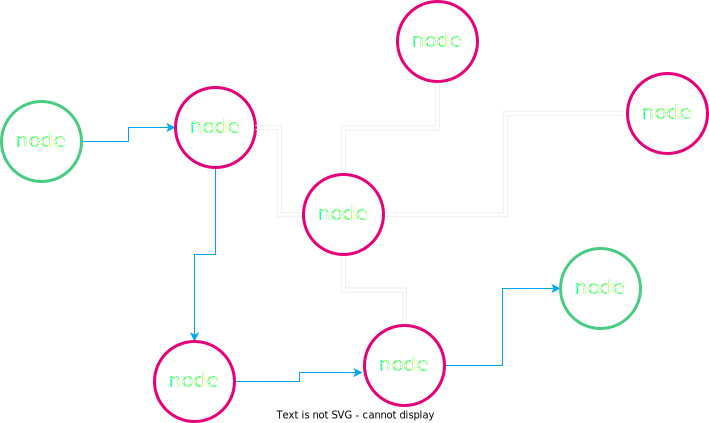
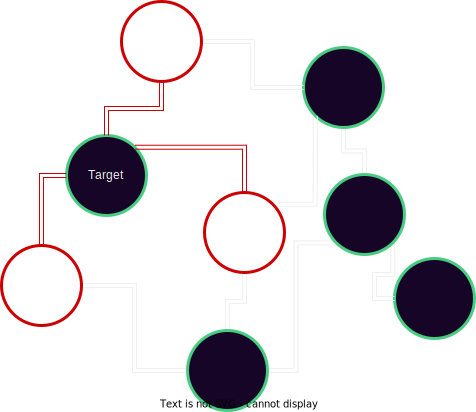

# Peer-to-Peer Networking

---

## From Circuit Switching to **Packet Switching**

- Mode of data transmission in which a message is broken into a number of parts (packets) that are sent independently <!-- .element: class="fragment" data-fragment-index="2" -->
- Packets are sent over whatever route is optimal <!-- .element: class="fragment" data-fragment-index="3" -->
- Packets are reassembled at the destination <!-- .element: class="fragment" data-fragment-index="4" -->

Notes:

Standard telephone networks used circuit switching, where a physical wire connected two communicating ends.

Packet-switching, on the other hand, is a more decentralized approach that can divide data, send it across the network, and reconstruct it.

The network is now able to survive partial destruction because there is no longer a single physical circuit between machines.

It was the first step toward a distributed and resilient network

---v

## Packets


Notes:

Mention that headers contain addressing, destination information, and ordering, typically depending on the context

---v

## Routing


Notes:

We have a message that needs to be sent between two nodes.

---v

## Routing



Notes:

A Route is composed of all the nodes that will be traversed before reaching the ends.

Not all packets need to traverse the same route

---v

## What if a node goes down?


---v

## Another Route is Used


Notes:

That's the strength of Packet Switching Networks, they are resilient and can survive a partial shutdown of the network

As said before, not all packets need to be routed in the same way

---v

## ARPANET

- First operational packet-switching network <!-- .element: class="fragment" data-fragment-index="2" -->
- Developed in the late 1960s by DARPA(The Defense Advanced Research Projects Agency) <!-- .element: class="fragment" data-fragment-index="3" -->
- Laid the foundation for the modern internet <!-- .element: class="fragment" data-fragment-index="4" -->

Notes:

Arpanet followed a more Client-Server structure, where people were asking for papers, documents, and other information

---

## Peer-to-Peer (P2P) Networks

- Unlike client-server model, all nodes (peers) are equal participants <!-- .element: class="fragment" data-fragment-index="2" -->
- P2P is a decentralized form of network structure <!-- .element: class="fragment" data-fragment-index="3" -->
- Data is shared directly between systems without a central server <!-- .element: class="fragment" data-fragment-index="4" -->
- Peers contribute resources, including bandwidth, storage space, and processing power <!-- .element: class="fragment" data-fragment-index="5" -->

Notes:

As opposed to client-server structures, p2p structures are a different type of network in which all nodes are at the same level

---

## Historical P2P applications

Notes:

Napster, Limewire, BitTorrent

---

## Napster

- Launched in 1999, first P2P sharing platform <!-- .element: class="fragment" data-fragment-index="2" -->
- Central server for indexing, P2P for transfers <!-- .element: class="fragment" data-fragment-index="3" -->
- Shutdown in 2001 due to legal issues <!-- .element: class="fragment" data-fragment-index="4" -->

Notes:

Napster's story is closely tied with the band Metallica.
In 2000, Metallica discovered that a demo of their song "I Disappear" was being circulated via Napster before its official release.
This led to Metallica filing a lawsuit against Napster for copyright infringement.
Napster had to comply by banning hundreds of thousands of users from their platform who were sharing Metallica's music.
This was a turning point in digital copyright law and played a significant role in Napster's eventual shutdown in 2001.

---v

## Napster Setup


---v

## Napster Setup


---v

## Napster Setup


---v

## Napster Setup


---

## Limewire

- Free Software p2p file sharing client <!-- .element: class="fragment" data-fragment-index="2" -->
- In its history, it has mainly used two protocols: <!-- .element: class="fragment" data-fragment-index="3" -->
  - Gnutella <!-- .element: class="fragment" data-fragment-index="3" -->
  - BitTorrent <!-- .element: class="fragment" data-fragment-index="3" -->

---v

## Gnutella

- Each node serves as both a client and a server <!-- .element: class="fragment" data-fragment-index="2" -->
- Query recursively all connected nodes for files <!-- .element: class="fragment" data-fragment-index="3" -->
- It does not just flood the network, it does it intelligently using concepts such as:
  <!-- .element: class="fragment" data-fragment-index="4" -->
  - Infection Factor
  <!-- .element: class="fragment" data-fragment-index="5" -->
  - TTL (Time To Live)
  <!-- .element: class="fragment" data-fragment-index="5" -->


<!-- .element: class="fragment" data-fragment-index="5" -->

Notes:

- Check local filestore for file and if it is not available, forward the request to all connected peers.

- Gnutella generates a significant amount of network traffic

Deep explanation of gossiping and how Gnutella gossiping works: https://nakamoto.com/gnutella/

---v

## BitTorrent

First launched using Trackers: <!-- .element: class="fragment" data-fragment-index="2" -->

- Files are split into multiple pieces <!-- .element: class="fragment" data-fragment-index="3" -->
- .torrent files contain the hash of the pieces <!-- .element: class="fragment" data-fragment-index="4" -->
- Trackers saves which peers in the network have which file
<!-- .element: class="fragment" data-fragment-index="5" -->

```rust
HashMap<FileId, Vec<Peer>>
```

<!-- .element: class="fragment" data-fragment-index="5" -->

- You can download different pieces by different peers in parallel <!-- .element: class="fragment" data-fragment-index="6" -->

Notes:

More efficient peer-to-peer (p2p) file sharing networks than Gnutella (but more centralized).

Each data was split into multiple packets.

You could request from each peer in the swarm a piece of the file you wanted to download to really take advantage of the increased bandwidth offered by the p2p network

---v


---v

## BitTorrent

Later introduced, **Trackerless** mode:

<!-- .element: class="fragment" data-fragment-index="7" -->

- Does not require Tracker nodes
<!-- .element: class="fragment" data-fragment-index="8" -->
- How does it achieve that? How is the knowledge of who has what is shared across the network?
<!-- .element: class="fragment" data-fragment-index="9" -->

Notes:

Trackerless was added later to support fully decentralized networks. It uses something called Distributed Hash Table (DHT), particularly Kademlia (a specific type of DHT)

---v

### Distributed Hash Table - DHT

Same `HashMap` as before, but distributed:

<!-- .element: class="fragment" data-fragment-index="2" -->

- key: hash of the .torrent file (=FileId)
<!-- .element: class="fragment" data-fragment-index="3" -->
- value: list of peers who own the file <!-- .element: class="fragment" data-fragment-index="4" -->

Notes:

Instead of going directly to the tracker node, a single peer who knows the info hash could use the DHT to ask the network for the list of needed peers

---v

### Kademlia

- Each node in the network has a NodeId <!-- .element: class="fragment" data-fragment-index="2" -->
- Keys are the same length of NodeIds <!-- .element: class="fragment" data-fragment-index="3" -->
- NodeIds and Keys live in the same Key Space <!-- .element: class="fragment" data-fragment-index="4" -->
- XOR is used as distance metric between NodeIds and Keys <!-- .element: class="fragment" data-fragment-index="5" -->
- The knowledge of distance is used for: <!-- .element: class="fragment" data-fragment-index="6" -->
  - save known peers and values <!-- .element: class="fragment" data-fragment-index="7" -->
  - understand were to ask for new key-value pairs <!-- .element: class="fragment" data-fragment-index="8" -->

Notes:

The Kademlia specification is not very extensive, but here we will provide an overview of how effectively the nodes know where to ask for key-value pairs not owned by them.

The distance metric makes it possible to understand the distance between you and the key you are looking for. This enables knowing where to ask for the key: the closest node to the key you know of!

---

<section>
    <h2>Client-Server vs Peer-to-Peer (P2P) Networks</h2>
    <table>
        <thead>
            <tr>
                <th></th>
                <th>Client-Server Network</th>
                <th>P2P Network</th>
            </tr>
        </thead>
        <tbody>
            <tr class="fragment">
                <td>Structure</td>
                <td>Centralized: One or more central servers control the network</td>
                <td>Decentralized: All nodes (peers) participate equally</td>
            </tr>
            <tr class="fragment">
                <td>Data Flow</td>
                <td>Server provides data to clients</td>
                <td>Peers directly share data with each other</td>
            </tr>
            <tr class="fragment">
                <td>Resource Management</td>
                <td>Servers manage resources and control access</td>
                <td>Peers contribute resources including bandwidth, storage space, and processing power</td>
            </tr>
            <tr class="fragment">
                <td>Scalability</td>
                <td>Can be limited by server capacity</td>
                <td>Highly scalable due to the distribution of resources</td>
            </tr>
            <tr class="fragment">
                <td>Security</td>
                <td>Centralized security measures, single point of failure</td>
                <td>Potential attack vector to the network from the outside, but also sensible to malicious actors
            </tr>
        </tbody>
    </table>
</section>

---

### Single Point of failure - Centralized Networks


---v

### Single Point of failure - Centralized Networks


---v

### Single Point of failure - Decentralized Networks


Notes:

1. No single node or nodes (CDN) have access to all of the content or files or is critical for operating the network. Each node has a copy of the data.
2. No central node carrying all of the load of traffic.

---v

### Single Point of failure - Decentralized Networks


Notes:

4. Difficult to overload the network or DOS (No single node is privileged).
5. Although many nodes are run on Centralized cloud compute platforms, they don't have to be (Typically).

Mention to block production ans block peering/importing. Generally there is no one single node carrying all the block production locic and not transactions and blocks fly in the same direction to a single node, but they are gossiped around.

---

## Overlay Network


Notes:

This is how you can imagine the p2p network, lines represent the knowledge of other nodes.

But...

---v

## Underlay Network


Notes:

This could be the real physical connection, and something like a transatlantic cable could be connecting two completely separate sets of nodes.

There could be logical connections that are not physical but also the opposite

---v

## The Underlay Network breaks


---v

## What's happen to the overlay?


Notes:

There are two disjointed networks that will continue working on their behalf. You will learn in later lectures what could happen if this network were running a blockchain

---

## Difficulties or Disadvantages

- Since it is permissionless, a node can share malicious resources <!-- .element: class="fragment" data-fragment-index="2" -->
- Latency <!-- .element: class="fragment" data-fragment-index="3" -->
- Difficult to regulate illicit activity <!-- .element: class="fragment" data-fragment-index="4" -->
- The network is limited by nodes with the weakest hardware <!-- .element: class="fragment" data-fragment-index="5" -->

Notes:

1. eg. wrong blocks making other nodes wasting time discarting them
2. Latency may be an issue if we need to wait for many peers to receive the data produced from a single node since everyone may not have a direct connection.
   Mention finality time!
3. No central point to go and snoop all users data (for better or for worse).
4. Why we have hardware requirements for blockchain networks.

---

<section>
    <h2>Structured vs Unstructured P2P Networks</h2>
    <table>
        <thead>
            <tr>
                <th></th>
                <th>Structured P2P Networks</th>
                <th>Unstructured P2P Networks</th>
            </tr>
        </thead>
        <tbody>
            <tr class="fragment">
                <td>Organization</td>
                <td>Nodes are organized following specific protocols and structures (like Distributed Hash Tables)</td>
                <td>Nodes are connected without any particular organization</td>
            </tr>
            <tr class="fragment">
                <td>Search Efficiency</td>
                <td>Efficient search operations due to structured nature</td>
                <td>Search operations may be less efficient and can involve flooding the network</td>
            </tr>
            <tr class="fragment">
                <td>Flexibility</td>
                <td>Less flexible as changes in topology require restructuring</td>
                <td>Highly flexible as nodes can freely join, leave, and reorganize</td>
            </tr>
            <tr class="fragment">
                <td>Privacy</td>
                <td>Data location is predictable due to structured organization</td>
                <td>Greater potential for anonymity</td>
            </tr>
        </tbody>
    </table>
</section>

---

## Gossip Protocol


Notes:

Given structured or unstructured networks, messages still have to be transmitted to other nodes

In blockchain, nodes could gossip blocks that have been produced or received by someone else. Now it's time for that node to decide how it should be gossiped

---v

## Gossip Protocol


Notes:

Bitcoin floods the network with requests, gossiping the block to all the known nodes, because the want share the last produced block as fast as possible.

Less consuming strategies could be applied, as Gnutella did, or even using advertising. Asking for more context before sending the data.

There are multiple ways to gossip information/blocks, and it depends on why you're sharing that information.

---

## Discovery

1. Connect to a peer <!-- .element: class="fragment" data-fragment-index="2" -->
2. Ask peer for a list of their known nodes <!-- .element: class="fragment" data-fragment-index="3" -->
3. Connect to random subset of peers from the list <!-- .element: class="fragment" data-fragment-index="4" -->
4. Repeat steps 2 and 3 <!-- .element: class="fragment" data-fragment-index="5" -->

Notes:

We talked about how the network works, how it can be used, but not how to join it

---v

## Initial Discovery

requires bootnodes (More on this later in Substrate)

Notes:

Must know someone who is participating in the network initially(Bootnode)

---

## Attacks


Notes:

- Can anyone think of a way to exploit some of these networks?
- What would be some things to try to take advantage of?

There are multiple ways to attack an open network like the one we described because you can actively participate in it and behave maliciously.

1. Distorts view of the healthy normal honest state of the network
2. Transaction confirmations can be fictions
3. Sybil Attack
4. Data Poisoning
5. Content Pollution

---v

## Eclipse Attack



---v

## Eclipse Attack Execution

1. Flood a target node with a bunch of malicious peer addresses <!-- .element: class="fragment" data-fragment-index="2" -->
1. The targeted node then stores these malicious peers and utilizes them when re-syncing on next bootup <!-- .element: class="fragment" data-fragment-index="3" -->
1. DOS targeted node to take it offline to force a resync with these new malicious peers <!-- .element: class="fragment" data-fragment-index="4" -->

---v

## Preventing Attacks

- Restrict inbound connections in some way <!-- .element: class="fragment" data-fragment-index="2" -->
- Random selection of peers to connect with <!-- .element: class="fragment" data-fragment-index="3" -->
- Deterministic node selection (Bootnodes) <!-- .element: class="fragment" data-fragment-index="4" -->
- Restricting new nodes (Probably not what we want...) <!-- .element: class="fragment" data-fragment-index="5" -->

Notes:

1. Be wary of new connections with other nodes
1. Don't just take the most recent request for connections to avoid the flooding
1. Bootnodes with higher credibility and trust (Can be a bottleneck) - Rotate bootnodes as they are also subject to attacks

---

## libp2p

- Created during the development of IPFS (InterPlanetary File System)
- Modular system of protocols, specifications and libraries that enable the development of peer-to-peer network applications
- Used in Substrate

Notes:

Libp2p aims to be a modular, general-purpose toolkit for any peer-to-peer application.

Not reinventing the wheel

---

## Conclusion

P2P networks offer us a path forward towards applications which are more decentralized and censorship resilient
