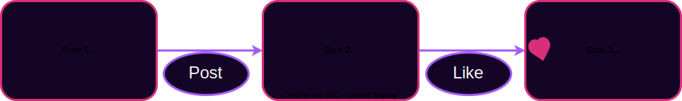

# State Machines

---

## State Machines

We can formalize this notion of shared story with state machine model.

Notes:

Most systems that we care about can be modeled as state machines. A state machine is not a real machine that you can touch. It is a model comprised of a set of states and a set of rules about how to transition between the states.

---v

## Labelled Transition Systems

Sometimes you can map the entire state space as an LTS.

Other times it is too big.

Notes:

Consider if we tried to map all possible states of a social media app or a digital currency. Sometimes an LTS drawing like this is useful, other times it would be too large or even infinite. Even still, sometimes drawing part of it can help you think about what the states and transitions might be.

Example: Audio Amplifier

There are three buttons (louder, quieter, mute). The amplifier's volume output can be one of four levels: Silent, Quiet, Normal, Loud. Volume up and down should be pretty clear. When you mute the output immediately goes silent, and when you unmute it goes back to whatever it was before.

Q: How should we model the states?
A: We could make the states directly be the volume levels. Let's try that.

Q: Is this enough? How do we unmute?
A: Gonna need to store the "previous_volume"

---v

## Example: Light Switch

Simple Switch: 2 States, 1 Transition

**Labelled Transition System** <!-- .element: class="fragment" data-fragment-index="2" -->

 <!-- .element: class="fragment" data-fragment-index="2" -->

**History** <!-- .element: class="fragment" data-fragment-index="3" -->

 <!-- .element: class="fragment" data-fragment-index="3" -->

---v

## State Machine Example: Digital Cash

Each state is a set of bank notes. Where a bank note has an amount and an owner.
A transition involves a user consuming (spending) some bank notes and creating new ones.

Notes:

Not all conceivable transitions are valid. Imagine a user consuming a bank note worth 5 coins, and creating two new ones each worth 3 coins.

---v

## Sate Machine Example: Social Media

Each state is a set of posts and their associated comments and emoji reaction counts.
A transition involves, making a new post, or reacting to someone elses, or commenting

Notes:

There is not a single model here. Some state machines will allow deleting or editing posts, while others will not. Some will allow disliking posts while others only allow liking.

---v

## More State Machine Examples:

<pba-flex center>

- Light Control in this room
- A Car-style Transmission vs a Motorcycle-style Transmission
- Hotel Elevator
- Roulette table

</pba-flex>

Notes:

Let's brainstorm what the state and the transitions might be for each of these.

Feel free to simplify these as necessary.

---v

## Shared Story of a State Machine

<pba-cols>
<pba-col>
<pba-flex center>

If we agree on:

- The starting state (aka genesis state)
- The history of transitions

</pba-col>
<pba-col>
</pba-flex>

Then we _MUST_ agree on:

<pba-flex center>

- The current state

</pba-flex>

</pba-col>
</pba-cols>

Notes:

Now that we have a formal math-y model of systems that we care about, we can see that the notion of shared stories being powerful is more than slick language of philosophical mumbo jumbo. Even the term genesis state (or genesis block) is taken straight from mythology. We aren't newly discovering or inventing the idea that having a shared understanding of our past is important. It dates back to pre-history. We are just formalizing it and applying it to digital services.

I have a talk from 2020 that goes into more detail and philosophy about this shared history idea and its relation to blockchain:
https://www.youtube.com/watch?v=FZXk3_RTvfc

It is one of my favorite talks I've ever given.

---

## Blockchains (Finally)

A blockchain can be thought of in three parts

<pba-cols>
<pba-col>
<pba-flex center>

**State Machine**

What does the state hold?

What are the _rules_ to change it?

</pba-flex>
</pba-col>
<pba-col>
<pba-flex center>

**Shared History** (data structure)

Which potential histories exist?

</pba-flex>
</pba-col>
<pba-col>

<pba-flex center>

**Consensus**

Which history is the real one?

What part of history is final?

</pba-flex>
</pba-col>
</pba-cols>

Notes:

Let's end this lesson with a little history of what we have seen in the blockchain space so far.

First, each blockchain tracks some state machine. We've discussed several examples of what that might be already, we'll code some simple examples shortly, and we'll spend all of module 5 digging into how to create a blockchain-friendly production-ready state machine.

Next is the Blockchain Data structure. This data structure is basically a linked list of state transitions. But unlike the linked lists you studied in your data structures course, it isn't just linked by memory addresses or any other malleable thing. Instead it is cryptographically linked so that if anyone presents a different history, you can tell right away that you don't agree on a shared history. We'll dive into this data structure in the next lesson.

Finally, is a consensus mechanism. Defining a state machine alone does not uniquely define a history. There are many possible valid histories. Just like the many worlds interpretation of quantum mechanics. To really agree on the current state, we need to agree on which of the possible histories is the real one.

---v

## Short History of Blockchains

---v

## Bitcoin

Uses an unspent transaction output (UTXO) model & Proof of Work (PoW) consensus. <!-- .element: class="fragment" -->

Notes:

Who knows where the figure is from?

CLICK

Bitcoin was first.
It was a money app.
The first app chain.
It hosts a smart contract in the broad definition.

It was the first time most people considered a digital service that was not run by a particular person.

Figure source: [Bitcoin white paper](https://bitcoin.org/en/bitcoin-paper)

---v

## Litecoin, Monero, Dogecoin

Notes:

Only a few year later people realized they could fork the code and make small changed and improvements.
Some changes were trivial.
Some were interesting: monero and privacy.

For me personally, this was a small crisis.
I thought bitcoin was the one global one.
Aren't these other coins undermining the narrative?
NO! The point is that anytime you don't like the system or have an idea for a better one, you can do it!
If you don't like bitcoin, build your own coin and make it better.
Let the market decide.

---v

## Ethereum and Smart Contracts

- Generalization of Bitcoin: provides a quasi-Turing-complete VM
- Uses an account-based system
- Accounts can store balances, but can also store executable code (smart contracts)
- Each contract can have its own internal state and API

---v

## Polkadot, Cosmos, Avalanche, Near, ...

Notes:

Iterations on Ethereum's general computing platform. Strive for scalability interoperability etc. Experiment with different consensus models.
