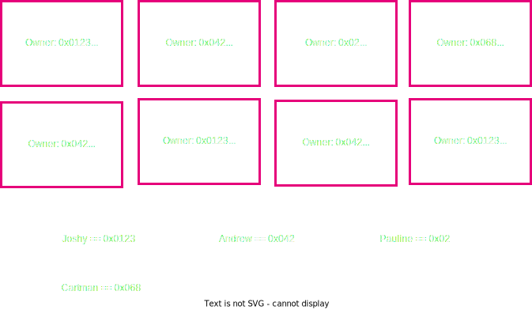
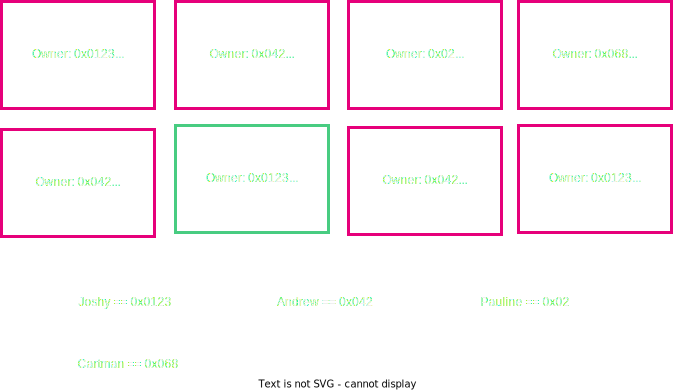
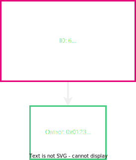
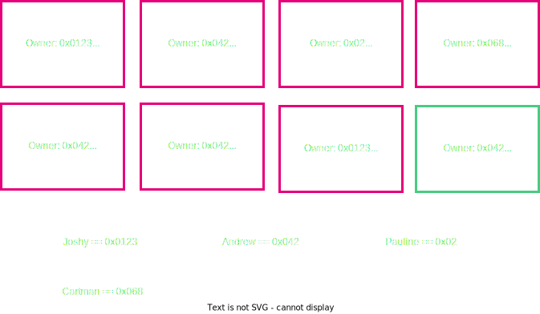
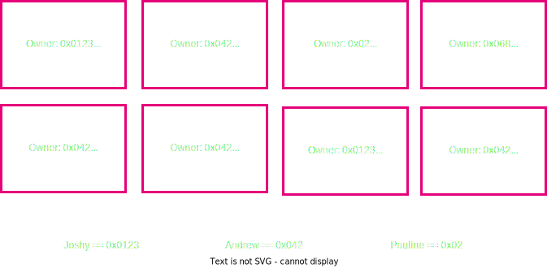
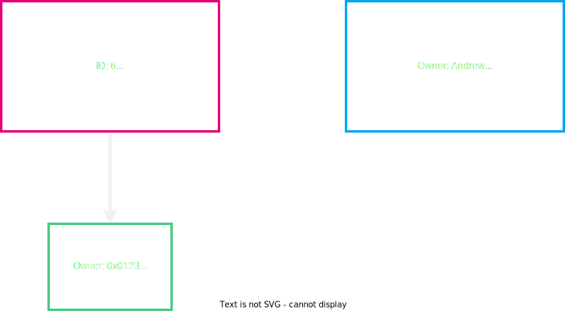
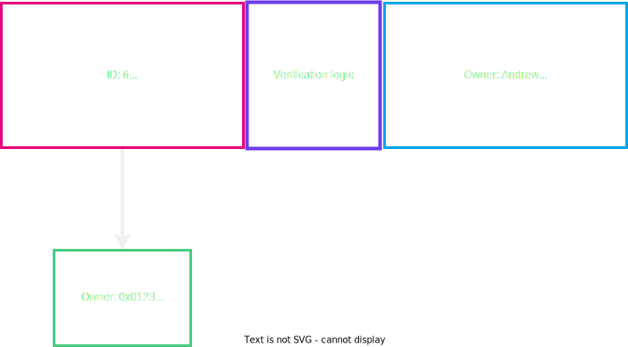
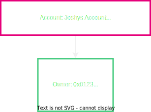
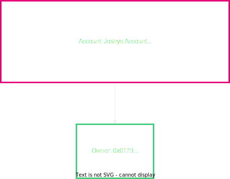
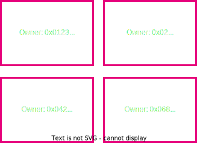

# Accounting Models & User Abstractions in Blockchains

---

## Multi-User State Machines

- We can model simple state machines.
- But now we want a multi-user state machine where users can interact.

Notes:

We have a lot of practice modeling simple state machines like a single audio amplifier
We can generalize this a little bit by giving every user their own machine. Their own amplifier.
But we can get even more rich, by having cross over effects between the amplifiers.
Imagine you plug the output of your amp into the input of my amp

---

## Multiple Models

- Unspent Transaction Output
- Accounts

Notes:

There are two popular methods for doing this in blockchain.
There amy very well be more viable way to do it as well.
For example I've heard of the actor model.
We will focus on these two because they are by far the most common.

---

## UTXO Model

---

## UTXO Model

---

## How to represent Joshy and Andrew?

---

## User Representation

---

## Addresses

How to send from Joshy to Andrew? What do you need?

Notes:

We can use cryptographic identifiers. Perhaps a public key.
In practice it os often a hash of a public key.

---

## Inputs

What if we want to spend this?

Notes:

Why do we say spend here and not modify?

---

## Input

---

## Transaction

Notes:

Why do we not send all of the 70 to Andrew?

---

## How to verify this state change is valid?

- We can actually spend this thing signature verification!
- Sum of the inputs is >= sum of the outputs
- No coins are worth 0
- Has this already been spent before?

Notes:

Which did I forget??

---

## Our new state

---

## How do we generalize beyond money?

---

## How do we generalize beyond money?

Notes:

How are we going to verify now that the state transition is valid?

---

## Transaction

---

## Transaction

---

## Is this a good model? Why or why not? Let's discuss

- Scalability
- Privacy
- General Computation

---

## Is there a different way?

Notes:

Now ease them to the solution of Accounts

---

## Accounts

Notes:

Now ease them to the solution of Accounts

---

## State Transition Accounts

---

## State Transition Accounts

---

## How do we verify and handle this transaction?

- Verify enough funds are in Joshy's account
- Verify this amount + Andrews amount don't exceed the max value
- Check the nonce of the transaction
- Do the actual computation of output values

Notes:

Did I forget any?

---

## State Transition Accounts

---

## What did we do differently in Accounts vs UTXO model?

Notes:

Verify as opposed to determining the outcome. Not submitting output state in transaction

---

## Account Arbitrary Data

---

## Is this a good model? Why or why not? Lets Discuss

- Scalability
- Privacy
- General Computation

Notes:

Parallelization? Storage space, privacy solutions?
