# **Econ & Game Theory in Blockchain**

Notes:

- Presenter Introduction
- Timeline clarification (after mod 2 and 3)
- Today we'll be going through a brand new lecture on Econ & Game Theory in Blockchain

---

# What's the goal?

Notes:

What's the goal of this lecture?
---v

## What's the goal?

<pba-cols>
    <pba-col>
        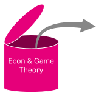
    </pba-col>
    <pba-col>
        <ul>
            <li> Demand & Supply </li>
            <li> Markets </li>
            <li> Nash Equilibrium </li>
            <li> Schelling Point </li>
            <li> <strong>...</strong> </li>
        </ul>
    </pba-col>
</pba-cols>

Notes:

By now you all should be familiar with all the terms and techniques from the Economy and Game Theory module like the Demand & Supply or Nash equilibrium.

---v

## What's the goal?

<pba-cols>
    <pba-col>
        
    </pba-col>
    <pba-col>
        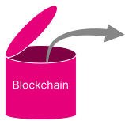
    </pba-col>
    <pba-col>
        <ul>
            <li> Consensus </li>
            <li> Protocol </li>
            <li> Tokens </li>
            <li> State Transition Functions </li>
            <li> <strong>...</strong> </li>
        </ul>
    </pba-col>
</pba-cols>

Notes:

And you also just finished covering the basics of Blockchains so you all should be familiar with state transition functions as well as have some understanding of consensus protocols.

---v

## What's the goal?

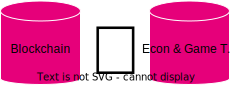

Notes:

Having all that in mind, the goal of this lecture is to combine the two and see how the economy and game theory can be applied to blockchain.
To do that we'll provide some exemplary use-cases and case studies.

---

# Landscape

Notes:

But first let's start with a quick summary of how we'll be approaching to bridge the gap between the two modules.

---v

## Landscape

<pba-cols>
    <pba-col>
        <ul>
            <li> Systems as Games </li>
        </ul>
    </pba-col>
    <pba-col>
        
    </pba-col>

Notes:

Firstly, we'll be looking at various blockchain systems as isolated games.

---v

## Landscape

<pba-cols>
    <pba-col>
        <ul>
            <li> Systems as Games </li>
            <li> Nodes/Miners/Validators as Players </li>
        </ul>
    </pba-col>
    <pba-col>
        
    </pba-col>

Notes:

Participants in those games will be for instance the miners, like in the Bitcoin protocol, maybe the validators in the Polkadot protocol or just some users of your smart contract.

---v

## Landscape

<pba-cols>
    <pba-col>
        <ul>
            <li> Systems as Games </li>
            <li> Nodes/Miners/Validators as Players </li>
            <li> Protocols as Game Rules</li>
        </ul>
    </pba-col>
    <pba-col>
        
    </pba-col>

Notes:

The protocol is essentially a set of rules that will define the game itself.
The one we will be analyzing.

---v

## Landscape

<pba-cols>
    <pba-col>
        <ul>
            <li> Systems as Games </li>
            <li> Nodes/Miners/Validators as Players </li>
            <li> Protocols as Game Rules</li>
            <li> Cryptocurrencies as Points </li>
        </ul>
    </pba-col>
    <pba-col>
        
    </pba-col>

Notes:

And to properly analyze those games we need to have some value representation, which in our case will be usually cryptocurrencies.

---v

## Landscape

<pba-cols>
    <pba-col>
        <ul>
            <li> Systems as Games </li>
            <li> Nodes/Miners/Validators as Players </li>
            <li> Protocols as Game Rules</li>
            <li> Cryptocurrencies as Points </li>
            <li> Rewards & Punishments as Incentives</li>
        </ul>
    </pba-col>
    <pba-col>
        
    </pba-col>

Notes:

And finally we'll be having various reward and punishment schemes that will shape the incentives of the players.

Now that we have all the elements defining our blockchain games we can look for further parallels.

---v

# Market Emergence

Notes:

And first let's take a look at something that hopefully very familiar: Markets

---v

## Market Emergence

_"A market is a composition of systems, institutions, procedures, social relations or infrastructures whereby parties engage in exchange."_

Notes:

So a market is a composition of systems where ppl exchange stuff.
This is the simplest way of putting it.

And Markets are the cornerstone of our economy and they are everywhere which also means they are thoroughly studied.
Which is very fortunate for us.

Now let's look at something that might also be pretty familiar to many...

---v

## Market Emergence

#### _Fee Market_

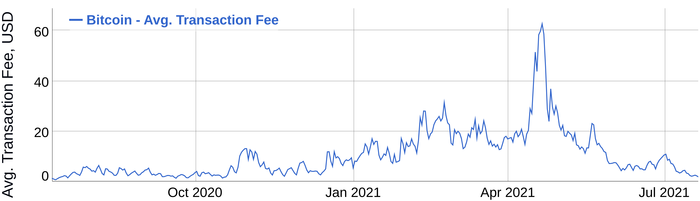

Notes:

The fee market.
That's a chart of the average transaction fees in the Bitcoin network over time.
As you can see the price is constantly fluctuating.

---v

## Market Emergence

#### _Fee Market_

<pba-cols>
    <pba-col>
        <strong> Fees/Tips </strong>
        <ul>
            <li> Users bid with the fees </li>
            <li> Miners select highest fee transactions </li>
        </ul>
    </pba-col>
    <pba-col>
        
    </pba-col>
</pba-cols>

Notes:

Let's dive a bit deeper.
So the users are bidding with how much they are willing to pay and miners are choosing the most lucrative transactions.
If miners already included all the best transactions and there are not many new ones coming in they need to start accepting lower fees, so the price drops.
But wait...?

---v

## Market Emergence

#### _Fee Market_

<pba-cols>
    <pba-col>
        <strong> What is the product? </strong>
    </pba-col>
    <pba-col>
        
    </pba-col>
</pba-cols>

Notes:

What is the actual product being exchanged here? When you have the crude oil market the goods being exchanged are clearly defined.
It's crude oil barrels.
What is actually being traded in here?

Anyone has an idea what it might be?

---v

## Market Emergence

#### _Fee Market_

<pba-cols>
    <pba-col>
        <strong> What is the product? </strong>
        <ul>
            <li> What is being exchanged is the blockspace </li>
            <li> Miners produce blockspace and effectively auction it to users </li>
        </ul>
    </pba-col>
    <pba-col>
        
    </pba-col>
</pba-cols>

Notes:

It's the BLOCKSPACE.
Miners secure and produce blockspace and sell it in an auction to various users.
Blockspace as a product is actually a pretty new way of thinking about blockchains so I highly suggest checking out the article linked in the notes.

- https://polkadot.network/blog/blockspace-blockspace-ecosystems-how-polkadot-is-unlocking-the-full-potential-of-web3/

---v

## Market Emergence

#### _Fee Market_

<pba-cols>
    <pba-col>
        <strong> Market Equilibrium </strong>
        <ul>
            <li> The transactions that manage to get into the blocks have fees representative of the current market equilibrium </li>
        </ul>
    </pba-col>
    <pba-col>
        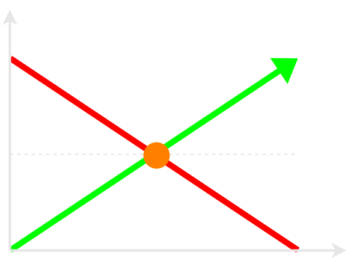
    </pba-col>
</pba-cols>

Notes:

The price of blockspace is determined by the market equilibrium of supply and demand.
Demand force is the users willing to transact and supply is the miners producing the blockspace.
Transactions that are actually included represent the current equilibrium.

---v

## Market Emergence

#### _Fee Market_

<pba-cols>
    <pba-col>
        <strong> Supply & Demand </strong>
        <ul>
            <li> In extreme cases the demand can raise so much that the fees overwhelm the network </li>
        </ul>
    </pba-col>
    <pba-col>
        
    </pba-col>
</pba-cols>

Notes:

We all know that the transaction fees can sometimes get outrageous.
In cases where many users want to transact the demand can skyrocket.
And what we see is the price equilibrium following suit.

---v

## Market Emergence

#### _Fee Market_

<pba-cols>
    <pba-col>
        <strong> Supply & Demand </strong>
        <ul>
            <li> In extreme cases the demand can raise so much that the fees overwhelm the network </li>
            <li> Most economic markets can react to growing demand with increased supply, but that is not directly possible in most blockchains </li>
        </ul>
    </pba-col>
    <pba-col>
        
    </pba-col>
</pba-cols>

Notes:

And now let's think of what normal markets do.
If our demand and price go extremely high the suppliers would have an incentive to produce more.
But in blockchains that's not directly possible.
More miners often don't mean more blockspace but MORE SECURE blockspace.
That means a better quality blockspace.

So the supply is often fixed and the demand is fluctuating.
This is often the cause for the very volatile fee market.

---v

## Market Emergence

#### _Fee Market_

<pba-cols>
    <pba-col>
        <strong> Supply & Demand </strong>
        <ul>
            <li> In extreme cases the demand can raise so much that the fees overwhelm the network </li>
            <li> Most economic markets can react to growing demand with increased supply, but that is not directly possible in most blockchains </li>
        </ul>
    </pba-col>
    <pba-col>
        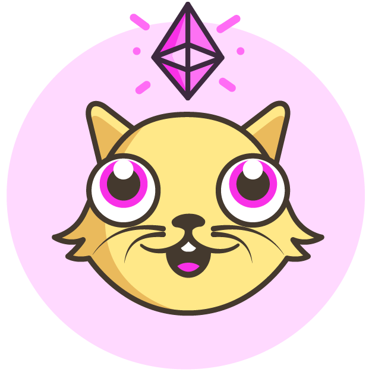
    </pba-col>
</pba-cols>

Notes:

And according to that theory some large blockchains actually tried implementing variable size blocks to react to the demand, but it's a pretty complex task and a big tradeoff.

Some of you maybe recognize this image as the CryptoKitties game on Ethereum.
It's a game where you can buy and breed digital cats.
It was so popular that it actually clogged the Ethereum network and made normal transactions nearly unfeasible.
And maybe now you have some additional insights into what actually happened there.

=5 sec pause=

---

# Nash Equilibrium

Notes:

Now let's look at something a bit different that allows us to predict what users would do...
a Nash Equilibrium.

---v

## Nash Equilibrium

- Strategy from which no player wants to deviate
- But what's the strategy for BTC mining?

Notes:

Nash Equilibrium is strategy from which no player wants to deviate.
Pretty simple but what's the strategy for BTC mining? How can we leverage that knowledge?

---v

## Nash Equilibrium

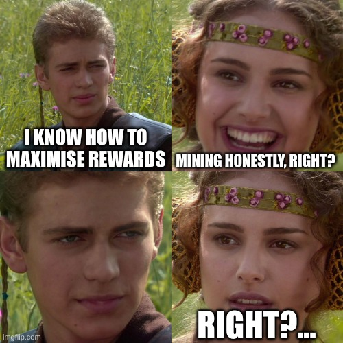

Notes:

And more importantly...
being honestly is the answer, right?

---v

## Nash Equilibrium

#### _Bitcoin Mining_

Notes:

Let's dive in and actually see what's the answer.
What's the Nash Equilibrium of Bitcoin mining? Is it being honest or dishonest?

---v

## Nash Equilibrium

<pba-cols>
    <pba-col>
        <strong>Assumptions:</strong>
        <ul>
            <li> Only 2 miners </li>
            <li> Block reward = 2 </li>
            <li> Difficulty scales with number of honest miners </li>
            <li> Miners are rational actors </li>
            <li> Dishonest miners do not cooperate </li>
        </ul>
    </pba-col>
    <pba-col>
        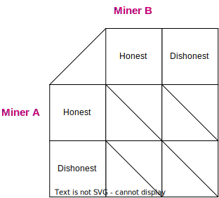
    </pba-col>
</pba-cols>

Notes:

Here we have a few assumptions, but the main ones are:

- imagine we have only 2 miners
- the block rewards is 2
- miners can be honestly following the protocol or try to cheat and push invalid blocks (for instance one where they get 999 bitcoins)

Let's figure out how many bitcoins each one of them will mine on average.

---v

## Nash Equilibrium

Notes:

If both miners are not mining honestly, none of them produce valid bitcoin blocks...
then there are no ACTUAL bitcoins being mined.
Remember that they don't cooperate but for instance try and push blocks with 9999 BTC in their account.
So the reward is 0 for both.

---v

## Nash Equilibrium

Notes:

If both are working honestly and making valid blocks they have an equal chance to mine a block and reap the rewards.
Rest of the nodes will accept those blocks but the two miners compete for the same resource so each one will get a single BTC on average (as the mining reward is 2).

---v

## Nash Equilibrium

Notes:

If one of them is dishonest the other one can still keep working honestly and reap greater rewards as there is no competition.
In that case the honest party gains 2 BTC.

Now that we know who earns how many bitcoins in each scenario we need to shift out attention to another important force.
Things like Twitter, Facebook or Bitcoin are often deemed as valuable because of their Network Effect.

---v

## Nash Equilibrium

 

#### _Network Effect_

_"The network effect is a business principle that illustrates the idea that when more people use a product or service,
its value increases."_

Notes:

Generally the more ppl use some platform or believe in something the more valuable it is.
It's a pretty simple concept but it's very important in the blockchain space.
Bitcoin is precious to many because many people believe in it and mine it and exchange it.
In blockchains if more people use your chain it's more valuable.

---v

## Nash Equilibrium

 

#### _Network Effect_

 
<strong>Assumptions revisited:</strong>
<ul>
    <li style="color: grey;"> Only 2 miners </li>
    <li style="color: grey;"> Block reward = 2 </li>
    <li style="color: grey;"> Difficulty scales linearly with number of honest miners </li>
    <li style="color: grey;"> Miners are rational actors </li>
    <li style="color: grey;"> Dishonest miners do not cooperate </li>
    <li> Token price scales quadratically with the number of honest miners
        <ul>
            <li>1 honest miner -> 1$</li>
            <li>2 honest miners -> 4$</li>
    </li>
</ul>

Notes:

Let's add this extra assumption into our model.
If there are more miners securing the network the coins itself are more valuable.
We will use a super simple model here where the price of a coin is a square of the number of miners.
We will be investigating small systems so it is a good enough approximation.

---v

## Nash Equilibrium

Notes:

We can apply the changes by changing the evaluations of the miners coins.

---v

## Nash Equilibrium

Notes:

If both miners honestly secure the network the coin price is 4 and in case of single honest miner the price is 1.

---v

## Nash Equilibrium

Notes:

Now we can actually focus on finding the Nash Equilibrium
so let's used the simplest method.

---v

## Nash Equilibrium

Notes:

Assuming Miner B is honest the Miner A needs to choose between a payoff of 4 or 0.

---v

## Nash Equilibrium

Notes:

He ofc chooses 4 as it's higher.
We temporarily mark it with the red circle.

---v

## Nash Equilibrium

Notes:

Same reasoning for B being dishonest and A chooses 2 over 0.

---v

## Nash Equilibrium

Notes:

Now we reverse the assumptions and assume A is honest and then B chooses between 4 and 0.

---v

## Nash Equilibrium

Notes:

Similarly as before he should choose 4 as it's higher.

---v

## Nash Equilibrium

Notes:

And the last remaining options will result in the circled 2.

---v

## Nash Equilibrium

Notes:

Now the square with all the options circled is the Nash Equilibrium.
In our case it seems to be being honest.

---v

## Nash Equilibrium

Notes:

Not a big surprise, and being dishonest lands you with zero coins so it was too be expected.
But what if we change the assumptions a bit?

---v

## Nash Equilibrium

 
What does it mean exactly to be <strong>dishonest</strong>?
 
 

    There are some mainstream rules (the protocol) and if an individual miner breaks them it seems like an isolated
    mistake or an attempt at cheating.

<!-- .element: class="fragment" data-fragment-index="1" -->

 
 

If multiple miners break the protocol <strong>in the same way</strong>, it can be seen as a new protocol deviating from
the main one.

<!-- .element: class="fragment" data-fragment-index="2" -->

Notes:

We were assuming that miners are either honest or dishonest, but what does being DISHONEST actually mean?

=fragment=

There are some mainstream rules (the protocol) and if an individual miner breaks them it seems like an isolated mistake or an attempt at cheating.
This is what we were analyzing before.

=fragment=

But what if multiple miners break the protocol in the same way? It can be seen as a new protocol deviating from the main one.
And that's what we'll be looking at next.
The dishonest miners are cooperating.

---v

## Nash Equilibrium

<pba-cols>
    <pba-col>
        <strong>Assumptions:</strong>
        <ul>
            <li> Only 2 miners </li>
            <li> Block reward = 2 </li>
            <li> Difficulty scales with number of honest miners </li>
            <li> Token price scales quadratically wih the number of honest miners </li>
            <li> Miners are rational actors </li>
            <li> Decision between which protocol to follow </li>
        </ul>
    </pba-col>
    <pba-col>
        
    </pba-col>
</pba-cols>

Notes:

Assumptions are pretty much the same but this time around the dishonest miners will cooperate.
Effectively they will be following a different modified protocol.

So we will no longer consider them dishonest but they simply follow a different set of rules.
Now miners choose to mine for the bitcoin BTC protocol or the bitcoin cash BCH protocol.

---v

## Nash Equilibrium

Notes:

Let's quickly fill up this table with the same rules as before.
Only this time of both miners follow BCH they ofc get the rewards in the BCH token.

---v

## Nash Equilibrium

Notes:

Just as before we take the extra step and apply the network effect.
If both miners secure the network price is 4 and if only 1 the price is 1.

---v

## Nash Equilibrium

Notes:

Here we have all the prices adjusted.

---v

## Nash Equilibrium

Notes:

Now let's take a look at what happens if Miner B miners BTC.
Miner A would prefer to also mine bitcoin.
So they are both mining the same thing.

---v

## Nash Equilibrium

Notes:

On the other hand if miner B mines BCH then it seems that Miner A prefers to mine BCH...

---v

## Nash Equilibrium

Notes:

And in fact what we have in here is two distinct Nash Equilibria!

---v

## Nash Equilibrium

So is being honest the best strategy?

 
 

Not always.
If the majority of people are honest then honesty pays off.
If the majority of people are _dishonest_ in the
same way then be _dishonest_ with them.

<!-- .element: class="fragment" data-fragment-index="1" -->

 
 

    In fact it was proven that in PoW following the majority is the true Nash Equilibrium no matter what
    strategy/protocol they are using as long as it's consistent.

<!-- .element: class="fragment" data-fragment-index="2" -->

Notes:

So is being honest the best strategy?

=fragment=

Not always.
If the majority of people are honest then honesty pays off.
If the majority of people are _dishonest_ in the same way then be _dishonest_ with them.

=fragment=

In fact it was proven that in PoW following the majority is the true Nash Equilibrium no matter what strategy/protocol they are using as long as it's consistent.
So Bitcoin mining is in fact a huge coordination game and this is why honesty AKA following the BTC protocol usually pays off.

- More complex examples will be explored later in the forks lecture on Friday
- Paper investigating PoW Nash Equilibrium and following the majority:
  https://typeset.io/pdf/mining-pool-game-model-and-nash-equilibrium-analysis-for-pow-2lckzso542.pdf

---

# Schelling Point

Notes:

On that topic...
What if we have multiple Nash Equilibria? Schelling point often comes to the rescue.

---v

## Schelling Point

- A solution that people tend to choose (easiest to coordinate on)
- Generally it is also a Nash Equilibrium
- How in the world can it be useful in Blockchain?
<!-- .element: class="fragment" data-fragment-index="1" -->

Notes:

So first a Schelling point is a strategy people tend to choose.
It is generally a Nash Equilibrium

=fragment=

But how in the world is it useful to us in Blockchain?

---v

## Schelling Point

#### Detective game

<pba-cols>
    <pba-col>
        <ul>
            <li> Two partners in crime</li>
            <li> Detective interrogates them individually </li>
        </ul>
    </pba-col>
    <pba-col>
        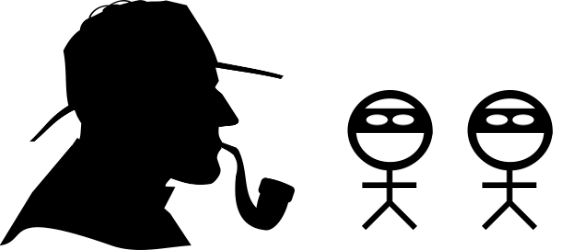
    </pba-col>
</pba-cols>

Notes:

But before we can fully answer that let's explore a different game that can show you how Schelling points work.
And I promise it will be applicable to Blockchain.

So the story goes like that.
We have to bank robbers and a detective.
The detective interrogates he robbers and tries to make them confess or catch them lying.

---v

## Schelling Point

#### _Detective game_

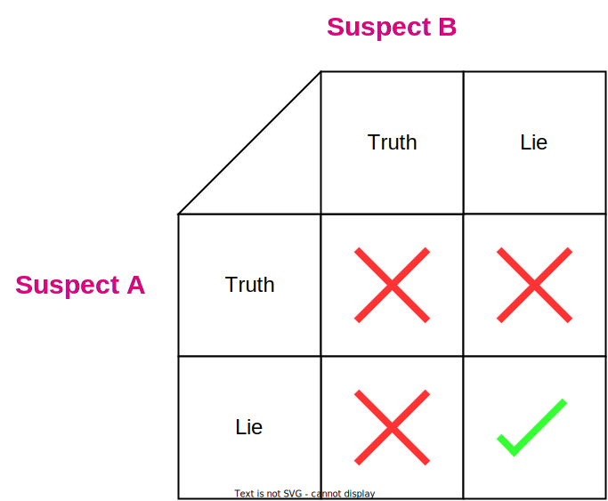

Notes:

If any of the robbers spill the beans and tell the truth they both loose the game and go to prison.
If both of them lie they get away with it.
Seems super simple and it should be pretty straightforward that they both simply need to lie.

Seems like a safe strategy, right? But remember than both of them witnessed the same real events of the robbery...

---v

## Schelling Point

#### _Detective game_

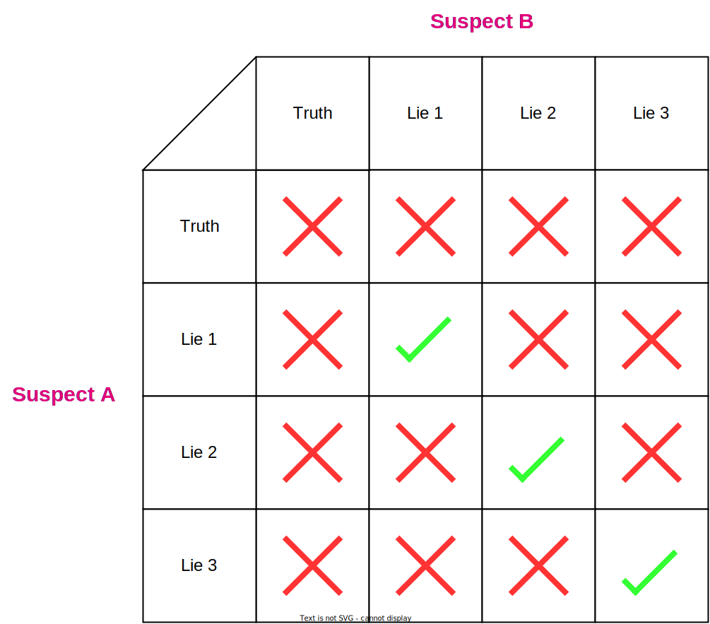

Notes:

But there are multiple lies they can construct.
If they have inconsistent stories the detective will catch them.
So now they need to coordinate on a specific lie and have all the details exactly the same or they are screwed.

Contrast it with how easy it would be to just tell the truth.
They both witnessed the truth so talking about it in a consistent way is trivial.

---v

## Schelling Point

#### _Detective game_

Truthful answers are one of the easiest strategies coordinate on, so they are the Schelling Points.

Notes:

That's why we can say that Truthful answers are one of the easiest strategies coordinate on, so they are the Schelling Points.
The truth itself is a Schelling point.

And this concept is vital to something in blockchain called...

---v

## Schelling Point

#### _Oracles_

Oracles are blockchain entities that provide information from the outside world to the blockchain.
 
 

Notes:

Oracles.
Firstly who in the room heard of oracles? Raise your hands.
Oracles are super interesting because what they are trying to achieve is to provide information from the outside world to the blockchain.
And that's a very very hard task.

---v

## Schelling Point

#### _Oracles_

Oracles are blockchain entities that provide information from the outside world to the blockchain.
 
 

    <strong>External Information Examples:</strong>
    <ul>
        <li> What's the temperature in Berkeley? </li>
        <li> Who won the election? </li>
        <li> What's the exchange rate of USD to BTC? </li>
    </ul>

Notes:

Some examples of the information they can provide are for instance what's the current temperature in Berkeley? Who won the election? What's the exchange rate of USD to BTC? and may others.

Let's actually see how they might work is a slightly simplified version with the temperate example.

---v

## Schelling Point

#### _Oracles_

 
 
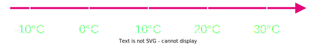

Notes:

So what's the temperature in Berkeley? Imagine you have a garden in Berkeley and you have on chain insurance that if the temperature is too high you get a payout.
So you want to know the temperature in Berkeley.

We know the answer lies somewhere on this axis.
But what it is exactly?

---v

## Schelling Point

#### _Oracles_

 
 
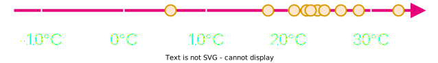

Notes:

We can ask some users to submit what they think the temperature is.
Some of them will check it themselves, some will use weather apps and some will just guess.

---v

## Schelling Point

#### _Oracles_

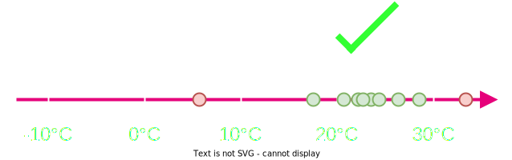

Notes:

What we are hoping for is that the cluster of votes you can see here will be around the actual temperature.
The best approach would be to check the median.
And why is that?

---v

## Schelling Point

#### _Oracles_

<pba-cols>
    <pba-col>
        <ul>
            <li> Honest participants are naturally coordinated </li>
            <li> Attackers could try to coordinate and lie </li>
        </ul>
    </pba-col>
    <pba-col>
        
    </pba-col>
</pba-cols>

Notes:

Honest voters are naturally coordinated.
They will check the temperature and vote honestly all within some small margin of error.

People that would lie to skew the results and would submit random values generally wouldn't cluster like the honest voters.
To make a more dangerous attack they would need to strategically coordinate on a specific value and all lie about it.
It's much harder to pull of than simply checking the temperature outside.

Submitting the truth is the Schelling Point in here and it makes it easy to be honest.

---v

## Schelling Point

#### _Oracles_

<pba-cols>
    <pba-col>
        What to do with attackers?
    </pba-col>
    <pba-col>
        
    </pba-col>
</pba-cols>

Notes:

But what if there are some attackers? What can we do about them?

---v

## Schelling Point

#### _Oracles_

<pba-cols>
    <pba-col>
        What to do with attackers?
          
        If they go unpunished they can repeat the attack until successful
    </pba-col>
    <pba-col>
        
    </pba-col>
</pba-cols>

Notes:

If we never punish them they can repeat the attack until they are successful.
And that's not good.

---v

## Schelling Point

#### _Oracles_

<pba-cols>
    <pba-col>
        What to do with attackers?
          
        If they go unpunished they can repeat the attack until successful
          
        Or even worse, they can make a million fake identities and spam incorrect votes
    </pba-col>
    <pba-col>
        
    </pba-col>
</pba-cols>

Notes:

Or even worse, they can make a million fake identities and spam incorrect votes.
So we need to punish them.

But this is no longer a problem of a Schelling Point.
The Schelling point did its job already.
What we are talking about right now are...

---

# Incentives

Notes:

Incentives.
Incentives are the next big topic we will be exploring.
And they are vital to the blockchain space.

---v

## Incentives

_"Something that encourages a person to do something."_
  

In our case we want to shape incentives that motivate the users to submit honest values.

<!-- .element: class="fragment" data-fragment-index="1" -->

Notes:

Incentives are things that encourage people to do something.

=fragment=

In our case we want to shape incentives that motivate the users to submit honest values.
We need to build out incentives in a way that shapes the expected behavior of the users to honesty.

---v

## Incentives

#### _Oracles_

<pba-cols>
    <pba-col>
        What to do with attackers?
          
        If they go unpunished they can repeat the attack until successful
          
        Or even worse, they can make a million fake identities and spam incorrect votes
    </pba-col>
    <pba-col>
        
    </pba-col>
</pba-cols>

Notes:

So going back to our oracle problem how can we deal with attackers?

---v

## Incentives

#### _Oracles_

<pba-cols>
    <pba-col>
        
What to do with attackers?
          
        If they go unpunished they can repeat the attack until successful
          

        <strong>Or even worse, they can make a million fake identities and spam incorrect votes</strong>
    </pba-col>
    <pba-col>
        
    </pba-col>
</pba-cols>

Notes:

Let's focus on the second issue of fake identities.
How can we prevent that?

---v

## Incentives

#### _Oracles_

<pba-cols>
    <pba-col>
        <strong> Sybil Attacks </strong>
          
        Common problem in blockchain.
          
        
If deploying on a chain, an easy solution is to make users lock some funds.

        <!-- .element: class="fragment" data-fragment-index="1" -->
    </pba-col>
    <pba-col>
        
    </pba-col>
</pba-cols>

Notes:

An attack where a single entity creates multiple fake identities is called a sybil attack and is super common in blockchain.
This is one of the things you always will need to ask yourself when you deploy things in blockchain.
Is whatever I built safe from Sybil Attacks?

=fragment=

One easy ready solution that is often used is making users lock some funds.
Only a user with some funds locked can vote.
The strength of the vote is proportional to the stake so making a million accounts makes no sense.
This is a very simple solution but it's not always applicable.

---v

## Incentives

#### _Oracles_

<pba-cols>
    <pba-col>
        
What to do with attackers? 

         
        <strong>If they go unpunished they can repeat the attack until successful</strong>
          
        
Or even worse, they can make a million fake identities and spam incorrect votes 

    </pba-col>
    <pba-col>
        
    </pba-col>
</pba-cols>

Notes:

Now let's go back to the first issue of unpunished attackers.
How can we deal with them so they don't continue attacking us?

---v

## Incentives

#### _Oracles_

<pba-cols>
    <pba-col>
        <strong> Punishments </strong>
          
        We already laid out the foundation for punishments.
          
        
 Our solution for de-sybiling users makes them lock funds.
          
        If such a user would vote incorrectly, we can slash their funds.
        

        <!-- .element: class="fragment" data-fragment-index="1" -->
    </pba-col>
    <pba-col>
        
    </pba-col>
</pba-cols>

Notes:

Interestingly we already laid out the foundation for the defense.
Voters have some funds locked in the system so they have Skin in the game.

=fragment=

If they vote incorrectly we can slash their funds.
This is a very common solution in blockchain.
Incorrect in that case would be very far from the median.

We have designed some protective incentives and now the system seems safe.

---v

## Incentives

#### _Oracles_

 
Did we forget about something?

  

**Why would anyone participate in this system?**

<!-- .element: class="fragment" data-fragment-index="1" -->

Notes:

But did we forget about something? Anyone has any idea what it might be? What we are missing?

=fragment=

Why would anyone participate in this system? Why would anyone vote? Why would anyone lock their funds and take the risk?

---v

## Incentives

#### _Oracles_

<pba-cols>
    <pba-col>
        <strong> Ghost Town </strong>
          
        No user wants to participate
          
        Getting information from the real world is an effort and they voters are doing the protocol a service
    </pba-col>
    <pba-col>
        
    </pba-col>
</pba-cols>

Notes:

Getting information from the real world is an effort and they voters are doing the protocol a service.
So we need to incentivize them to participate.
We need a rewards scheme or otherwise the network will be a ghost town.

---v

## Incentives

#### _Oracles_

<pba-cols>
    <pba-col>
        <strong> Reward Scheme </strong>
          
        If users are doing the protocol a service they need to be rewarded
          
        
 One way to do it is to mint some token rewards for well-behaved voters 

        <!-- .element: class="fragment" data-fragment-index="1" -->
         
        
 Or distribute them from a previously acquired pool of rewards 

        <!-- .element: class="fragment" data-fragment-index="2" -->
    </pba-col>
    <pba-col>
        
    </pba-col>
</pba-cols>

Notes:

If users are doing the protocol a service they need to be rewarded.

=fragment=

One way to do it is to mint some token rewards for well-behaved voters.

=fragment=

Or distribute them from a previously acquired pool of rewards.

But what is crucial here the protocol is safe and dependable only if there is enough voters so the incentives need to be designed in a way that encourages participation.

More precisely, incentives need to be roughly proportional to the value an attacker could gain by compromising the system.
Low-stakes oracles don't need to have super aggressive incentives.

---v

## Incentives

#### _Oracles_

<pba-cols>
    <pba-col>
        <strong> Reward Scheme Question</strong>
          
        Can we distribute fixed value rewards for correct votes?
         Correct vote = 10$ 

          
        

         No.
         We should base rewards on the size of the voter's stake.
        

        <!-- .element: class="fragment" data-fragment-index="1" -->
    </pba-col>
    <pba-col>
        
    </pba-col>
</pba-cols>

Notes:

Let's do a quick question.
Can we distribute fixed value rewards for correct votes? As an example each Correct vote = 10$

=question time=

=fragment=

No.
We should base rewards on the size of the voter's stake.
Otherwise the system is vulnerable to sybil attacks.
If you have a million fake identities you can vote a million times and get a million times the reward.
So the reward should be proportional to the stake.

---v

## Incentives

**In summary:**

- Make it easy to honest users and hard for attackers
<!-- .element: class="fragment" data-fragment-index="1" -->
- Service to the protocol needs to be rewarded
<!-- .element: class="fragment" data-fragment-index="2" -->
- Destructive or interfering actions need to be punished
<!-- .element: class="fragment" data-fragment-index="3" -->
- De-Sybiling the users can help defend against spam
<!-- .element: class="fragment" data-fragment-index="4" -->

Notes:

Now let's summarize the main points.

We need to make it easy for honest nodes and hard for attackers.
The Schelling Point as the foundational part of the design handles that for us.

=fragment=

Service to the protocol needs to be rewarded.
We need to incentivize participation to guarantee reliable results.

=fragment=

Destructive or interfering actions need to be punished.
We need to disincentivize bad behavior.
In our case we did the slashes.

=fragment=

De-Sybiling the users can help defend against spam.

We we have all of that our systems should be properly incentivized and safe...
and on that note what happens when the incentives are...

---

# Misaligned Incentives

Notes:

Misaligned.
When they promote some behavior that is not good for the network.

---v

## Misaligned Incentives

#### _Ethereum State Storage Issue_

Notes:

Let's take a look at Ethereum.
Ethereum is a blockchain that has a lot of smart contracts.
And smart contracts are basically programs that run on the blockchain.
They are stored on chain and they can be executed by anyone.
For them to work a bunch of code needs to be deployed on the chain.

---v

## Misaligned Incentives

#### _Ethereum State Storage Issue_

<pba-cols>
    <pba-col>
         
        <strong> State Storage Replication </strong>
          
        Whenever we store something on chain (like a smart contract) it needs to be at least partially replicated among the nodes.
          
        
 Multiple nodes store the same data.

    </pba-col>
    <pba-col>
        
    </pba-col>
</pba-cols>

Notes:

And moreover whenever we store something on chain (like a smart contract) it needs to be at least partially replicated among the nodes.
Thousands of nodes store the same data which is not super efficient.

---v

## Misaligned Incentives

#### _Ethereum State Storage Issue_

<pba-cols>
    <pba-col>
         
        <strong> State Storage Replication Costs </strong>
          
        Ethereum deals with the burden of replication by charging more gas for submitting bulky data.
          
        All of that is ON TOP OF any computation gas costs.
    </pba-col>
    <pba-col>
        
    </pba-col>
</pba-cols>

Notes:

Ethereum attempts to deal with it by introducing scaling fees.
The more data you put in the state the more you need to pay.
And that's on top of any computation costs.

---v

## Misaligned Incentives

#### _Ethereum State Storage Issue_

<pba-cols>
    <pba-col>
         
        <strong> State Storage Duration</strong>
          
        This particular part of the state might be relevant for future state transitions so nodes cannot simply discard it.
          
        
 Full nodes need to keep ALL the data.

    </pba-col>
    <pba-col>
        
    </pba-col>
</pba-cols>

Notes:

Note that once we put something in state it has to stay there pretty much indefinitely until we use it again.
Because who knows, it might be relevant to some future state transitions.
So nodes cannot simply discard it.

Now let's explore an example.

---v

## Misaligned Incentives

#### _Ethereum State Storage Issue_

<pba-cols>
    <pba-col>
         
        <strong> Meet Bob </strong>
          
        Bob happily deploys his awesome smart contract in Ethereum.
        He paid a hefty gas fee but so be it.
          
    </pba-col>
    <pba-col>
        
    </pba-col>
</pba-cols>

Notes:

So let's meet Bob.
Bob is a developer and he happily deploys his awesome smart contract in Ethereum.
He paid a hefty gas fee but so be it.
His code was added to the state and now many nodes hold a copy of it.

---v

## Misaligned Incentives

#### _Ethereum State Storage Issue_

<pba-cols>
    <pba-col>
         
        <strong> The Problem </strong>
          
        Bob decided to become a musician or just no longer likes programming.
          
        He doesn't care about his smart contract anymore.
    </pba-col>
    <pba-col>
        
    </pba-col>
</pba-cols>

Notes:

But imagine that one day Bob decides to become a musician or he just no longer likes programming.
He doesn't care about his smart contract anymore.
But the chain doesn't know about it.
His code still lives in the state and has to be continuously replicated and maintained.

---v

## Misaligned Incentives

#### _Ethereum State Storage Issue_

<pba-cols>
    <pba-col>
         
        <strong> The Problem Made Worse </strong>
          
        Many others like Bob follow suit.
          
        Some of them continue developing but, <strong>why bother</strong> removing old data? They already paid for it.
    </pba-col>
    <pba-col>
        
    </pba-col>
</pba-cols>

Notes:

Now imagine there are hundreds of people like Bob.
Some of them even continue developing but, WHY BOTHER removing old data? They already paid for it.
And some of them just don't care anymore.

---v

## Misaligned Incentives

#### _Ethereum State Storage Issue_

<pba-cols>
    <pba-col>
         
        <strong> "Why Bother?" </strong>
          
        Getting data on chain is expensive, but there is no incentive to clean it up.
          
        This is a core misalignment of incentives that lead to Ethereum state size growing out of control.
    </pba-col>
    <pba-col>
        
    </pba-col>
</pba-cols>

Notes:

We need to focus on this "why bother" part.
This is a core example of a misalignment of incentives that lead to Ethereum state size growing out of control.

Getting the data to state is indeed expensive but once we do...
why clean it? There is no incentive to do so.
So the chain was getting overwhelmed in junk.

---v

## Misaligned Incentives

#### _Ethereum State Storage Issue_

<pba-cols>
    <pba-col>
         
        <strong> The Goal </strong>
          
        Design new protocol rules that shape the behavior of the users in a way that they start cleaning up the state.
    </pba-col>
    <pba-col>
        
    </pba-col>
</pba-cols>

Notes:

So what can we do about it? What's the goal? We need to design new protocol rules that shape the behavior of the users in a way that they start cleaning up the state.
Hopefully without any side effects.

---v

## Misaligned Incentives

#### _Ethereum State Storage Issue_

<pba-cols>
    <pba-col>
         
        <strong> The Solution </strong>
          
        State Storage Gas Refunds
          
        Pay a hefty fee when deploying data to state, but get some of it refunded when removing it.
    </pba-col>
    <pba-col>
        
    </pba-col>
</pba-cols>

Notes:

One of the proposed solutions was the introduction of a Gas Refund.
You pay a hefty fee when deploying data to state, but get some of it refunded when removing it.
So now there is an incentive to clean up the state.

---v

## Misaligned Incentives

#### _Ethereum State Storage Issue_

  
<strong>behavior Before</strong>

Notes:

So what we had originally is Bob paid for his smart contract and then simply went away to play a guitar.

---v

## Misaligned Incentives

#### _Ethereum State Storage Issue_

  
<strong>behavior After</strong>

Notes:

Afterwards Bob deploys his contract in the same way but before running of to play a guitar he removes it from the state and gets some of the gas back.
He likes the extra money so he has an incentive to clean.
In here we're presenting the version where he recovers the full value for educational purposes but Ethereum only refunds a portion of the gas.

But wait...
So what is the actual cost if he paid 10 and got 10 back? Anyone has any idea? Cost might not be obvious but it is an...

---

# Opportunity Cost

Notes:

Opportunity Cost.
It's a very important concept in economics and it's also crucial in blockchain.

---v

## Opportunity Cost

_"The loss of other alternatives when one option is chosen."_

Notes:

d
Generally opportunity cost is the loss of other alternatives when making a choice.
When choosing between 10 and 30$ the opportunity cost of picking 30 is 10, the other option you are forgoing.

---v

## Opportunity Cost

#### _Ethereum State Storage_

<pba-cols>
    <pba-col>
         
        <strong> The Real Cost </strong>
          
        Instead of having the funds locked in the storage deposit/refund scheme, Bob could have invested them somewhere else and gain some profit.
          
        
Just locking your funds is sort of a punishment by itself.
<!-- .element: class="fragment" data-fragment-index="1" -->
    </pba-col>
    <pba-col>
        
    </pba-col>
</pba-cols>

Notes:

Going back to the topic of Ethereum the real cost for Bob is not the 10$ he paid for storage as he regains it later.
The cost is in losing the opportunity of investing the money elsewhere.

=fragment=

Just locking your funds is sort of a punishment by itself.
Even if you regain them later.
This is especially true in inflationary systems, and spoiler alert that most of them.

The opportunity cost is a clever mechanism that allows us to include costs without directly charging them, and we also need to be super aware so we don't accidentally punish the users by not thinking of some external opportunity costs.

---v

## Opportunity Cost

#### _Extra Examples_

- Creating invalid blocks in Bitcoin never gets directly punished even if the block is rejected by the network.
  The real cost is the opportunity cost, as the miner could have mined a valid block instead.
- Polkadot native token DOT is inflationary (\~7.5% per year) but it can be staked to earn rewards (~15% per year).
Not staking DOT has an opportunity cost which incentives staking to secure the network.
<!-- .element: class="fragment" data-fragment-index="1" -->

Notes:

There is a lot of awesome examples of opportunity costs in blockchain.
For instance Creating invalid blocks in Bitcoin never gets directly punished even if the block is rejected by the network.
The real cost is the opportunity cost, as the miner could have mined a valid block instead.

=fragment=

and the Polkadot native token DOT is inflationary (\~7.5% per year) but it can be staked to earn rewards (~15% per year).
Not staking DOT has an opportunity cost which incentives staking to secure the network.

And there are also many other staking and DeFi examples out there.

---

# Externalities

Notes:

Now to actually appreciate what the we did in the previous section we need to talk about externalities.

---v

## Externalities

_"A consequence of an economic activity that is experienced by unrelated third parties."_

Notes:

An externality is a consequence of an economic activity that is experienced by some third parties.

As an example, think of the pollution you emit when driving a car.
It's a negative externality that affects all the people around you.
Alternatively imagine planting a tree in your garden simply because you like how it looks and gives you some shade.
The tree improves the quality of air in the neighborhood and that's a positive externality for the people around you.

---v

## Externalities

#### _Ethereum State Storage_

The clogging of the chain with useless data is a negative externality that affects all the users of the chain.

As protocol designers we need to be aware of such externalities and we can try and limit their effects by **pricing them in**.

Notes:

In the Ethereum example you could argue that the network getting clogged is the externality of the single developer not cleaning after himself.
And it affects all the users of the chain.
The chain is an example of a common good.

As protocol engineers or system designers you need to identify those externality costs and price them in.

---v

## Externalities

#### _Ethereum State Storage_

<pba-cols>
    <pba-col>
         
        <strong> Negative Externality Cost </strong>
          
        In the Ethereum State Storage problem we priced in the negative externality as the opportunity cost of locking your funds.
    </pba-col>
    <pba-col>
        
    </pba-col>
</pba-cols>

Notes:

That's what we did with the opportunity cost in Ethereum.
We made it so burdening the chain is actually expensive for the perpetrator.
We aligned his incentives with the incentives of the chain.

---v

## Externalities

#### _Oracles_

<pba-cols>
    <pba-col>
         
        <strong> Positive Externality </strong>
          
        Providing the voting services in the Oracle scheme can be seen as a positive externality for the network that can further use this extra information.
          
        The voters are providing a valuable service to the protocol.
    </pba-col>
    <pba-col>
        
    </pba-col>
</pba-cols>

Notes:

But not all externalities are negative.

For example the whole oracle scheme makes it so the chain can get information from the real world.
This is a positive externality for the network that can further use this extra information.

---v

## Externalities

#### _Oracles_

The voters are providing a valuable service to the protocol.

So if they submit the vote on chain through a transaction, should they pay any fees? <!-- .element: class="fragment" data-fragment-index="1" -->

Notes:

The honest voters are providing a valuable service to the protocol.

=fragment=

So having that mind should they pay any transaction fees when submitting votes?

---v

## Externalities

#### _Oracles_

<pba-cols>
    <pba-col>
         
        <strong> Beneficial Transactions </strong>
          
        Such a transaction can be totally free.
          
        
But make sure it cannot be spammed!
<!-- .element: class="fragment" data-fragment-index="1" -->
    </pba-col>
    <pba-col>
        
    </pba-col>
</pba-cols>

Notes:

And contrary to the common belief such a transaction can be totally free.

=fragment=

But make sure it cannot be spammed! And it's super important, because if it is free it can be trivial.
In our oracle system we can make sure there is only ONE vote per stake.
This way we remain safe and can make the transaction free to further incentivize participation.

---v

## Free Transactions

<pba-cols>
    <pba-col>
         
        There are other free transactions that are not necessarily positive externalities.
          
        <strong> Inherent Transactions </strong>
        <ul>
            <li> Block rewards in BTC </li>
            <li> Any logic that needs to be executed for every block (is inherent to the block) </li>
        </ul>
    </pba-col>
    <pba-col>
        
    </pba-col>
</pba-cols>

Notes:

There are other free transactions that are not necessarily positive externalities.
For instance in Bitcoin after mining a block you get a reward.
This is a free transaction that is not a positive externality.
It's just inherent to the block.
Usually any logic that needs to be executed for every block (is inherent to the block) is free.

---

# Complete vs Partial Information Games

Notes:

Now let's look at something totally different.
We will talk about a concept crucial to game theory and that is information.

---v

## Complete vs Incomplete Information Games

_Do players know everything about the game state?_

_Do players **NEED** to know everything about the game state?_

Notes:

We'll be looking at questions like do players know everything about the game state? Do they NEED to know everything about the game state? And how does it affect the game?

---v

## Complete vs Incomplete Information Games

#### _Polkadot Approval Voting (Simplified)_

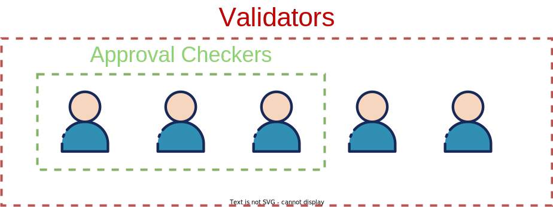

Notes:

To investigate this topic we'll dive deeper into Polkadot and particularly the Approval Voting subsystem.
This is something I personally work on at Parity and you will learn a lot more about it in the later modules.

What you need to understand now is that there are some special nodes called validators.
They as they name suggests validate if the new blocks in the network are valid and correct.

---v

## Complete vs Incomplete Information Games

#### _Polkadot Approval Voting (Simplified)_

<pba-cols>
    <pba-col>
         
        <strong> Approval Checkers </strong>
          
        In Polkadot when new blocks are validated, not everyone does the work.
        Only some randomly chosen validators - called <strong>Approval Checkers</strong> - are selected to validate candidate blocks.
    </pba-col>
    <pba-col>
        
    </pba-col>
</pba-cols>

Notes:

But in Polkadot not every validator does all the work.
They share the work and each block is checked only by a subset of validators.
They are called Approval Checkers.

---v

## Complete vs Incomplete Information Games

#### _Polkadot Approval Voting (Simplified)_

<pba-cols>
    <pba-col>
         
        <strong> Attackers </strong>
          
        We assume that attackers can DDoS some but not ALL Validators.
          
        Being DDoS'ed makes them unable to vote in time.
    </pba-col>
    <pba-col>
        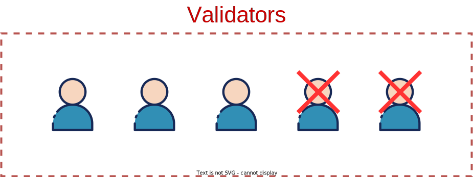
    </pba-col>
</pba-cols>

Notes:

We also need to make some assumptions about the attackers willing to disrupt the network.
We assume that attackers can DDoS some but not ALL Validators.
Being DDoS'ed makes them unable to vote in time.

---v

## Complete vs Incomplete Information Games

#### _Polkadot Approval Voting_

**Default Scenario**

- Randomly select 3 Approval Checkers and announce them
- Approval Checkers publish votes if they are selected
- If all the votes received confirm the block is fine it passes

Notes:

A default validation scenario would go like that.
We randomly select 3 Approval Checkers and announce them.
Approval Checkers publish votes if they are selected.
If all the votes received confirm the block is fine it passes.

But there is a problem with it? Does anyone know what it is?

---v

## Complete vs Incomplete Information Games

#### _Polkadot Approval Voting_

**Default Scenario**

- Randomly select 3 Approval Checkers and announce them
- Approval Checkers publish votes if they are selected
- **Attackers use the information and DDoS the selected before they publish the vote** (except their insider)
- If all the votes received confirm the block is fine it passes

Notes:

If the attackers learn who the designated approval checkers are they can focus their attack.
And only eliminate the relevant targets thus compromising the network.

---v

## Complete vs Incomplete Information Games

#### _Polkadot Approval Voting_

**What was the Problem?**

- Attackers learned everything about the game
- Attackers could use this information before the validators could respond

**How do we fix it?**

<!-- .element: class="fragment" data-fragment-index="1" -->

- Limit the information the attackers have access to so they cannot plan ahead
<!-- .element: class="fragment" data-fragment-index="1" -->

Notes:

So let's ask ourselves what was the problem? The attackers learned everything about the game and could use this information before the validators could respond.
The information is the weapon.

=fragment=
If we could somehow limit the information the game would change in our favour.
We need to make this a game of incomplete information, where some things are hidden.

---v

## Complete vs Incomplete Information Games

#### _Polkadot Approval Voting_

**Improved Scenario**

- Each validator uses a VRF to generate a random number
- Validators with a sufficiently small number will have the right to be Approval Checkers
- Approval Checkers reveal themselves by showing their low numbers and publish a vote at the same time <!-- .element: class="fragment" data-fragment-index="2" -->
- If all the votes received confirm the block is fine it passes <!-- .element: class="fragment" data-fragment-index="2" -->

 

Notes:

- Let's imagine this new improved scenario.
  Each validator uses a VRF to generate a random number.
- There is some threshold and validators with a sufficiently small number will have the right to be Approval Checkers.

=fragment=

- Approval Checkers reveal themselves by showing their low numbers (with a vrf proof attached) and publish a vote at the same time.
  If all the votes received confirm the block is fine it passes.

This method has this nice property that attackers don't learn who the approval checkers are until they reveal themselves.
So they cannot plan ahead.

---v

## Complete vs Incomplete Information Games

#### _Polkadot Approval Voting_

**What can the Attackers do?**

- They no longer know who the Approval Checkers are so they have to guess
- If they don't guess correctly they get heavily slashed

Notes:

So what can the attackers do? If they can no longer target DDoS they only can attack at random.
This vastly reduces their chances of success and makes thm vulnerable to punishment if they fail.

This is pretty much the method used in Polkadot and it's called a VRF based random assignment.
It's a game of incomplete information.

---v

## Complete vs Incomplete Information Games

#### _Extra Examples_

- BABE is a Polkadot mechanism for selecting new block producers (further covered in Polkadot module).
  It also uses a similar VRF scheme to generate random assignments

Notes:

Some other notable examples you will learn about in later modules are connected to BABE the Polkadot mechanism for selecting new block producers.
It also uses a similar VRF scheme to generate random assignments.

---

# Shifting Assumptions

Notes:

By now you might have noticed a pattern that usually we have a list of assumptions.

---v

## Shifting Assumptions

<pba-cols>
    <pba-col>
        Every game has some assumptions that need to be made before reasoning about them.
        <ul>
            <li>Number of players</li>
            <li>Available actions</li>
            <li>Access to information</li>
            <li>etc</li>
        </ul>
    </pba-col>
    <pba-col>
        
    </pba-col>
</pba-cols>

Notes:

Some of the assumptions are connected to the number of players or maybe the access to information.
And they are usually pretty stable.

---v

## Shifting Assumptions

<pba-cols>
    <pba-col>
        If any of the assumptions change the game changes as well.
        Old incentives that were previously sensible may now motivate a vastly different behavior.
    </pba-col>
    <pba-col>
        
    </pba-col>
</pba-cols>

Notes:

What happens when for some reason the assumptions evolve and change?
The game changes as well.
Old incentives that were previously sensible may now motivate a vastly different behavior.

---v

## Shifting Assumptions

#### _Restaking_

<pba-cols>
    <pba-col>
        Restaking through EigenLayer incentives Ethereum stakers to stake the same funds for multiple apps at the same time.
          
        The incentive game will be vastly different and the capital will effectively be leveraged (double risk and double rewards).
    </pba-col>
    <pba-col>
        
    </pba-col>
</pba-cols>

Notes:

A super good example of that is what is very recently happening in Ethereum.
And I mean literally this month.
There is a new layer 2 protocol called EigenLayer that allows stakers to stake the same funds for multiple apps at the same time.
This is called restaking.

This is not something natively available in Ethereum and it wasn't taken into consideration when slashes/rewards were designed.

---v

## Shifting Assumptions

#### _Restaking_

<pba-cols>
    <pba-col>
        <strong> Consequences </strong>
          
        Restaking consequences are still not fully understood and the research is ongoing.
          
        Speaker Notes ("S") for further reading.
    </pba-col>
    <pba-col>
        
    </pba-col>
</pba-cols>

Notes:

The consequences of restaking are still not fully understood and the research is ongoing.
I encourage you to read the speaker notes for further reading.
The whole field of blockchain incentivization and protocol design is still developing so there are many unknowns but overall I hope all the methods shown today help you in making more informed decisions later down the line.
Thats it...

- Podcast: https://www.youtube.com/watch?v=aP9f_1v9Ulc
- Whitepaper: https://2039955362-files.gitbook.io/~/files/v0/b/gitbook-x-prod.appspot.com/o/spaces%2FPy2Kmkwju3mPSo9jrKKt%2Fuploads%2F9tExk4U2OdiRKGEsUWqW%2FEigenLayer_WhitePaper.pdf?alt=media&token=c20ac4bd-badd-4826-9fb6-492923741c9e <!-- markdown-link-check-disable-line -->

---

## Summary

- Markets - Fee Markets
- Nash Equilibrium - BTC Mining
- Schelling Point - Oracles
- Incentivization - Oracles
- Opportunity cost - Ethereum State Storage Refunds
- Externalities - Ethereum State Storage and Oracles
- Complete vs Incomplete Information Games - Polkadot Approval Voting
- Assumptions - Restaking

Notes:

So to summarize we talked about:

---

# Thanks everyone!
