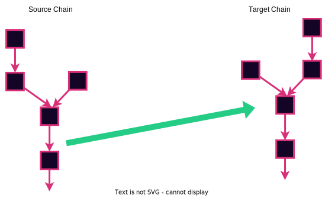
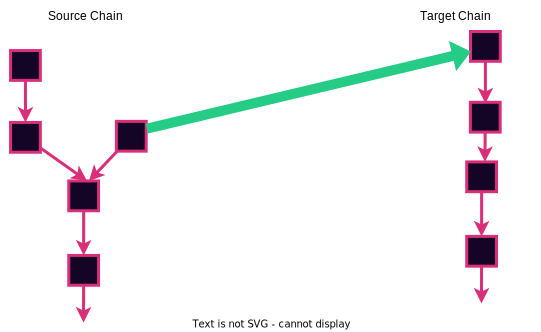
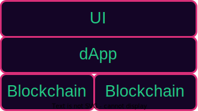

# Light Clients

<pba-cols>
<pba-col>

</pba-col>
<pba-col>

> 
 What can I say?
 <!-- .element: class="fragment" -->
> 
 It's a client but light.
  <!-- .element: class="fragment" -->

</pba-col>
</pba-cols>

---

## 😢 Running a Node is Hard 😭

<pba-cols>
<pba-col>
<pba-flex center>

Ideally:

- Everyone runs their own node.

</pba-flex>
</pba-col>
<pba-col>

<pba-flex center>

Reality:

- It takes a lot of disk, memory, etc
- It takes some know-how
- I don't need it _all the time_

<!-- .element: class="fragment" -->

</pba-flex>
</pba-col>
</pba-cols>

Notes:

The bitcoin whitepaper clearly assumes that users will run their own nodes.
This is the most trustless and decentralized way to operate, and you should do it whenever you can.
If you think you can't you're probably wrong.
Just ask the Monero community.

There are _some_ reasons not to run a full node and the reality is that not everyone will.
So even though we should always run our own nodes, let's look at some alternatives and ways we can make node running more accessible.

---v

## RPC Nodes

AKA, trust somebody else's node.

<pba-flex center>

<ul>
<li>🕵️ Spy on you (<a href="https://decrypt.co/115486/infura-collect-metamask-users-ip-ethereum-addresses-after-privacy-policy-update">like infura</a>).</li> <!-- .element: class="fragment" -->
 
<li>🔞 Censor you <!-- .element: class="fragment" -->
<li>🤥 Lie to you <!-- .element: class="fragment" -->
<li>💔 Steal your boyfriend <!-- .element: class="fragment" -->
</ul>

</pba-flex>

Notes:

The easiest thing to do is just trust some expert to run a node for you.
Very web2.
Lot's of things can go wrong.

So this is definitely not the best option.
Let's see if we can do better.

---v

## Lighten the Load

For resource constrained systems and people in a hurry

<pba-flex center>

- Phone
- Raspberry pi
- Microcontroller
- Inside Web Browser

</pba-flex>

Notes:

One of the complaints was that the node takes too much resources.
This is especially true if we want people to be able to run the node in all kinds of exotic environments.
And we do want that because we want people to run their own node even when they're just paying the bill at dinner from their phone or liking social posts while scrolling on the bus.
Let's make the client lighter so it doesn't require as much resources.

---v

## Light Client Duties

<pba-flex center>

- ❌ Sync blocks
- ❌ Execute blocks
- ✅ Sync headers
- ❔ Maintain Transaction Pool
- ✅ Checks consensus
- ❌ Maintains state

</pba-flex>

Notes:

This is what a typical light client does.
There is not a single definition of light client.
There are varying degrees of lightness to suit your needs.

---v

## Trustless

<pba-flex center>

- Relies on full node for data
- Does not have to trust data
- State root helps a lot

</pba-flex>

Notes:

The figure is from the Bitcoin whitepaper.
The concept of light clients has been around since bitcoin.
At that time it was known as Simplified Payment Verification.
You could confirm that a payment was sent or received.
But you couldn't confirm that the tokens in question still existed or anything else about the state.

Chains with state roots can have much more powerful light clients

---v

## Syncing Strategies

<pba-flex center>

- Full header sync
- Checkpoints in code
- Warp sync

</pba-flex>

Notes:

We also need to address the use case of clients that are not always on.
For example if you only need your node on your phone, or when using a specific web page, that means it will have some syncing to do.

Doing a full sync is already a lot faster than on a full client because you aren't downloading or executing the blocks.
But by the time you have a few million headers, it does still take some time.

The naive solution is to just have relatively recent headers hard-coded in the client.
This works pretty well.
You already have to trust the client developers for the entire implementation so you aren't trusting a new party at least.

Warp sync is possible when you have deterministic finality.
In dead simple PoA you just check that the authorities have signed the latest block and you are good.
If you have authority hand-offs, there is more work to be done.
You have to check that each authority set signs the transition to the next authority set.
But this is still only even N blocks instead of every block.

---v

## Self Defense

Stay in the gossip protocol or you might get got.

<!-- .element: class="fragment" -->

Notes:

In the main gossip protocol, if authorities finalize two conflicting blocks, then we can prove that they have broken the rules and slash them.
If we don't watch the gossip and only peer with a single full node, then our view is entirely defined by that node.
They may gossip us an attack chain and we won't know.
So it is important to communicate with many different full nodes.

---

## Bridges

Transport layers between independent consensus systems

Notes:

Generally speaking bridges move arbitrary data between unrelated consensus systems.
Basically between different blockchains, and those messages can evoke arbitrary side effects on the target chain.
To keep it concrete, we'll mostly talk about moving tokens.

---v

## Source and Target Chain

Notes:

By convention we speak of bridges as being one-directional.
When we talk about trustless bridge design this is a core concept in the design.
It is less critical but still useful for trusted bridges.

A two-way bridge is really just two one-way bridge.
Think of a two-way
street.
There is a dedicated lane for each direction.

---v

## Source Chain Re-Orgs

Notes:

On PoW chains this is truly just a judgement call and a prayer.
If the source chain has deterministic finality we can do better.
We need to wait for finality.
But even this isn't foolproof.
More on this after we cover the basic design.

---v

## Bridge Models

<pba-cols>
<pba-col>

### Trust-based

Trusted intermediary makes a transfer manually. 
Eg. Wrapped bitcoin on ethereum (WBTC)

</pba-col>
<pba-col>

### Trustless

Trustless is the goal, like almost everything in web3.

</pba-col>
</pba-cols>

Notes:

The trust based bridges are not at all ideal.
You have to entirely trust an intermediary.
You send the intermediary tokens on the source chain.
Once the intermediary is satisfied that they really own the source tokens, they send you some target tokens on the target chain.
Or they don't whatever, not their problem.

You can make they trust properties slightly better by using a multisig or a group of people so you only have to trust some subset of them.
But this does not fundamentally eliminate the trust agreement.
One classic example is the WBTC foundation.
You send them bitcoin, they wait for "enough" block confirmations, and then they mint you an ERC20 token on Ethereum.
And they provide the same service in reverse too.

A lot of the trusted bridge design can be improved and we'll talk about that in detail in the next few slides.
But it's worth observing here that we will never be able to eliminate the part about "Once the intermediary is satisfied that they really own the source tokens".
The bridge can never be stronger than the consensus on the source chain

---

## Trustless bridge design

<pba-flex center>

- Most trustless way to interact with blockchain is to run a node
- This is true for individuals _and_ other blockchains
- A blockchain is extremely resource constrained.
- Run a source chain light client on the target chain

</pba-flex>

Notes:

---v

## BTC Relay

---

## Bridge Design Challenges

Notes:

Bridges present their own set of design challenges beyond what we encounter in regular stand-alone light clients.

---v

## Peers?

<pba-flex center>

- How can we peer without networking?
- Enter the **Relayer** - a permissionless and trustless role
- Need at least one honest relayer

</pba-flex>

Notes:

On-chain logic doesn't have network IO, so how do we peer?
There is a role known as a relayer.
It is an off-chain agent who watches the source chain, and submits headers and finality proofs from the source chain to the target chain through transactions.
Anyone can start a relayer.
It is typically a little piece of software that you run.
But there is nothing magic about it.
You could perform the relayer task manually by copying header data from an explorer into metamask for example.

You do need at least one honest relayer for the chain to get the correct header info.
For this reason a large decentralized relayer group is nice.
But even if you don't trust any relayer out there, you can always run your own.

---v

## Finality and Equivocation

<section class="!flex">
  
  
</section>

Notes:

It is not safe to accept headers as finalized immediately even if there is a deterministic finality proof.
Let that sink in.
Even if there is a valid finality proof, it is not safe to accept them as finalized.
Why not?

Because the validators may be equivocating.
They don't send equivocations to real nodes on the network because those equivocations will be gossiped around and reported on the source chain and the validators will be slashed accordingly.
But remember a light client on the target chain has no way to report such equivocations back to the source chain.

---v

## Equivocation Incentives

<pba-flex center>

- Add a **Challenge Period** and
- Add Fishermen - reverse of relayers

**OR**

- Stake Relayers
  so they can be slashed

<!-- .element: class="fragment" -->

</pba-flex>

Notes:

There are basically two classes of solutions.
Both of them require a waiting period aka challenge period before accepting a header with a finality proof as final.

One is to add a role of fishermen.
They are responsible for noticing when the header candidate on the target chain is different from the one in the main source chain protocol and reporting this behavior back to the source chain so the validators can be slashed there.
Two problems:

1.  Fishermen have weak incentives.
    If they do a good job there will be no equivocations and they will not get paid.
1.  Target chain is relying on the foreign source chain to keep the bridge secure instead of owning that security itself.

The other is to have the relayer role require a security deposit.
If it turns out that a relayer relays an attack header, that relayer is slashed and the relayer who reports it gets a reward.
Relayers will expect to earn some reward for the opportunity cost of their stake which makes the bridge operation more expensive.

---

## Multichain Apps

---v

## We have a header, now what?

<pba-flex center>

- App users submit proofs
- Need a source chain transaction? 
  Submit an spv-style transaction proof
- Need some source chain state? 
  Submit a state proof

</pba-flex>

Notes:

The header sync is just the foundation.
Now Applications can build on top of it with the best possible trust guarantees.

If you need some source chain transaction, your app needs to require an spv-style transaction proof to check against the header's extrinsics root.

If you need some source chain state, your app needs to require a state proof to check against the header's state root.

---v

## Multichain Security

Notes:

This kind of trustless bridge _with proper incentives_ gets us information about the source chain to the target chain with security about as high as it was on the source chain.
If you are building an app that spans multiple chains consider the security guarantees on both chains.
The weaker security of the two is the security your app has.
More abstractly, your app consumes two different kinds of blockspace that may be of different qualities.
Your app is only as quality as the lower of the blockspaces.

---v

## Example: Depository Mint Model

- Send tokens to a contract on source chain
- Message is relayed to destination chain
  - Offchain relay and transaction
  - XCM
  - "Somehow"
- New "wrapped" tokens are minted on the destination chain

<!-- TODO really needs a figure -->

Notes:

The same process works in reverse to get the original tokens back.
This can get get complex when there are multiple bridges.
Are their wrapped tokens interchangeable?
What if one of the bridges gets hacked?
