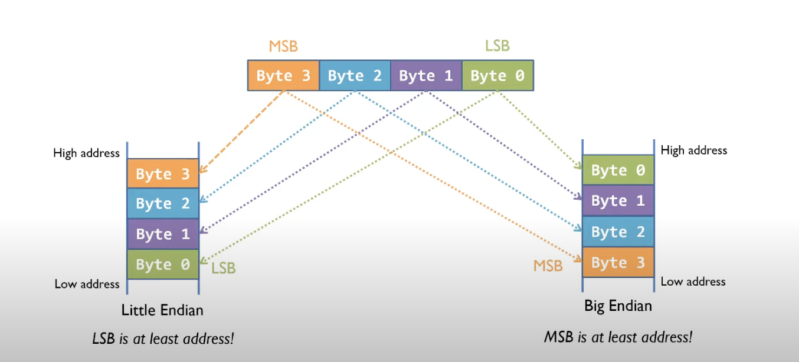

# SCALE

---

# SCALE

## Serialization

- The process of translating a data structure or object state into a format that can be stored.<!-- .element: class="fragment" -->
- Types of Serialization: Self-Describing vs Non Self-Describing<!-- .element: class="fragment" -->
- Codecs: Encoders/Decoders<!-- .element: class="fragment" -->

---

### Binary Data Recap

- What is a byte? <!-- .element: class="fragment" -->
- 8 bits => 0 - 255 => u8 <!-- .element: class="fragment" -->
- The smallest addressable unit of memory <!-- .element: class="fragment" -->

Hexadecimal representation: <!-- .element: class="fragment" -->

- Base-16 number representation <!-- .element: class="fragment" -->
- (0..15) => 0123456789abcdef <!-- .element: class="fragment" -->
- The "0x" prefix is commonly used to denote hexadecimal notation <!-- .element: class="fragment" -->
- Each hexadecimal symbol => 4 bits => 1 "nibble" => 1/2 byte <!-- .element: class="fragment" -->
- 0110 1010 => 0x6a <!-- .element: class="fragment" -->

---

## SCALE

## Stands for...

- Simple<!-- .element: class="fragment" -->
- Concatenated<!-- .element: class="fragment" -->
- Aggregate<!-- .element: class="fragment" -->
- Litte-Endian<!-- .element: class="fragment" -->

---

## SCALE

Designed for high-performance, copy-free data encoding and decoding in resource-constrained environments.

- Non Self describing: the definitions must be known to decode.<!-- .element: class="fragment" -->
- Little-Endian: has some performance benefits, like free casting.<!-- .element: class="fragment" -->

---

### Little-Endian



---

## Little-Endian vs Big-Endian Example:

- How to encode the `255` decimal value as a `u32`:

  - Big-Endian: &nbsp;&nbsp; `0x 00 00 00 ff`

  <!-- .element: class="fragment" -->

  - Little-Endian: `0x ff 00 00 00`

  <!-- .element: class="fragment" -->

---

## SCALE Basic Primitives

<ul>
<li class="fragment">
u8, u16, u32, u64, u128, u256

```sh
20  u8  0x 14
20  u16 0x 14 00
256 u16 0x 00 01
```

</li>

<li class="fragment">
i8, i16, i32, i64, i128, i256

```sh
1    i8  0x 01
-1   i8  0x ff
-1   i16 0x ff ff
-256 i16 0x 00 ff
```

</li>
<li class="fragment">
boolean (specialized u8)

```sh
true  0x01
false 0x00
```

</li>

Notes:

Nothing fancy here

---

## SCALE: Compact

- It can optimally store any integer from `0` to `2^536` without wasting memory.

<!-- .element: class="fragment" -->

- The least significant 2 **bits** of the **first byte** indicate the number of bytes that are used.

<!-- .element: class="fragment" -->

- `0b 00` => 1 byte, from 0 to 63 (2^6 - 1)

<!-- .element: class="fragment" -->

- `0b 01` => 2 bytes, from 64 to 16383 (2^14 - 1)

<!-- .element: class="fragment" -->

- `0b 10` => 4 bytes, from 16384 to 1073741823 (2^30 - 1)

<!-- .element: class="fragment" -->

- `0b 11` => The remaing bits of the first byte indicate the length (+4)

<!-- .element: class="fragment" -->

---

## SCALE: Compact Examples

- `1` &nbsp; -> `0b 000001 00` &nbsp;&nbsp;&nbsp;&nbsp;&nbsp;&nbsp;&nbsp;&nbsp;&nbsp;&nbsp;&nbsp;&nbsp;&nbsp;&nbsp;&nbsp; -> `0x04`<!-- .element: class="fragment" -->

<!-- .element: class="fragment" -->

- `2` &nbsp; -> `0b 000010 00` &nbsp;&nbsp;&nbsp;&nbsp;&nbsp;&nbsp;&nbsp;&nbsp;&nbsp;&nbsp;&nbsp;&nbsp;&nbsp;&nbsp;&nbsp; -> `0x08`<!-- .element: class="fragment" -->

<!-- .element: class="fragment" -->

- `3` &nbsp; -> `0b 000011 00` &nbsp;&nbsp;&nbsp;&nbsp;&nbsp;&nbsp;&nbsp;&nbsp;&nbsp;&nbsp;&nbsp;&nbsp;&nbsp;&nbsp;&nbsp; -> `0x0c`<!-- .element: class="fragment" -->

<!-- .element: class="fragment" -->

- `63` -> `0b 111111 00` &nbsp;&nbsp;&nbsp;&nbsp;&nbsp;&nbsp;&nbsp;&nbsp;&nbsp;&nbsp;&nbsp;&nbsp;&nbsp;&nbsp;&nbsp;&nbsp;-> `0xfc`<!-- .element: class="fragment" -->

<!-- .element: class="fragment" -->

- `64` -> `0b 000000 01 00000001` -> `0x0101`<!-- .element: class="fragment" -->

<!-- .element: class="fragment" -->

- `65` -> `0b 000001 01 00000001` -> `0x0501`<!-- .element: class="fragment" -->

<!-- .element: class="fragment" -->

---

## SCALE: Compact

- Exercise:
  - Manually decode `0x01ff` and `0x05`

---

## SCALE Complex types

A "complex" type is a codec that references other types.

- Tuples: Simply the concatenation of different types of codecs.<!-- .element: class="fragment" -->
- Structs: Same as tuples, but the values are named.<!-- .element: class="fragment" -->
- Vectors: A collection of a dynamic size of any other type.<!-- .element: class="fragment" -->
- Arrays: A collection of static size of any other type.<!-- .element: class="fragment" -->
- Enum: Discriminated unions (AKA variants, tagged unions...).<!-- .element: class="fragment" -->
<li class="fragment">Specialized Enums:
<ul>
  <li>Option: The first byte indicates whether there is a value or not.</li>
  <li>Result: An Enum which always has 2 different tags, one for success and one for error.</li>
</ul></li>
- Specialized Vector: String -> Vector(u8)<!-- .element: class="fragment" -->
- Opaque: A "meta-type" which is a de-facto standard (an specialized Vector of bytes).<!-- .element: class="fragment" -->

---

# SCALE Complex types: Enum

- The first byte indicates the index of the "tag".
- Example:

```js
Enum({
  foo: u16,
  bar: boolean,
  baz: _void,
});
```

- `0x000100` => `foo(1)`

<!-- .element: class="fragment" -->

- `0x0100` => `bar(false)`

<!-- .element: class="fragment" -->

- `0x02` => `baz()`

<!-- .element: class="fragment" -->

---

# SCALE Complex types: Enum

## Observations

- Enums make it possible to have circular Codec definitions.

<!-- .element: class="fragment" -->

- `Result` and `Option` are specialized Enums.

<!-- .element: class="fragment" -->

- There can't be more than 256 options.

<!-- .element: class="fragment" -->

---

# SCALE Complex types: Option

- `0x00`: there is no value

<!-- .element: class="fragment" -->

- `0x01`: there is a value.

<!-- .element: class="fragment" -->

- Option(u16) `0x00` -> `null / undefined / void / nil`<!-- .element: class="fragment" -->

<!-- .element: class="fragment" -->

- Option(u16) `0x010001` -> `256`<!-- .element: class="fragment" -->

<!-- .element: class="fragment" -->

---

# SCALE Complex types: Result

- `0x00`: Ok

<!-- .element: class="fragment" -->

- `0x01`: Error

<!-- .element: class="fragment" -->

- Result({ Ok: bool, Error: u8 }) `0x0101` -> `Error(1)`<!-- .element: class="fragment" -->

<!-- .element: class="fragment" -->

- Result({ Ok: bool, error: u8 }) `0x0000` -> `Ok(false)`<!-- .element: class="fragment" -->

<!-- .element: class="fragment" -->

---

# SCALE Complex types

## Structs and Tuples

- Structs and Tuples are conceptually the same thing, but Structs have named values in its definitions.

<!-- .element: class="fragment" -->

- Example:

<!-- .element: class="fragment" -->

```js
Tuple(Tuple(u8, u8, u8), boolean, Option(u16));
```

<!-- .element: class="fragment" -->

```js
Struct({
  color: Struct({ red: u8, green: u8, blue: u8 }),
  isReady: boolean,
  price: Option(u16),
});
```

<!-- .element: class="fragment" -->

---

# SCALE Complex types

## Structs and Tuples

```js
Struct({
  color: Struct({ red: u8, green: u8, blue: u8 }),
  isReady: boolean,
  price: Option(u16),
});
```

### Exercise:

Let's decode:

- `0xff001001010001` -> `{color: {red:255, green:0, blue:16}, isReady:false, price:256}}`<!-- .element: class="fragment" -->
- `0x0f10000000` -> `{color: {red:15, green:16, blue:0}, isReady:false, price:null}`<!-- .element: class="fragment" -->

---

# SCALE: Complex types:

## Vectors

- A compact encoded value denotes the number of instances.

<!-- .element: class="fragment" -->

- Example:

<!-- .element: class="fragment" -->

```js
Vector(u8);
```

<!-- .element: class="fragment" -->

- `[]` => `0x00`<!-- .element: class="fragment" -->

<!-- .element: class="fragment" -->

- `[1]` => `0x04 01`<!-- .element: class="fragment" -->

<!-- .element: class="fragment" -->

- `[1, 0]` => `0x08 01 00`<!-- .element: class="fragment" -->

<!-- .element: class="fragment" -->

```js
Vector(compact);
```

<!-- .element: class="fragment" -->

- `[1, 0]` => `0x08 04 00`<!-- .element: class="fragment" -->

<!-- .element: class="fragment" -->

- `[1, 0, 64]` => `0x0c 04 00 0101`<!-- .element: class="fragment" -->

<!-- .element: class="fragment" -->

Notes:

Mention specialized vectors: string, bytes

---

# SCALE: Complex types:

## Arrays

Exactly the same as `Vectors`, with the difference that their size is part of the codec definition, and thus is not
encoded.

```sh
Array<u8,4> # [u8;4]
[2,1,3,0] => 0x 02 01 03 00

Array<u16,2> # [u16;2]
[258,3]   => 0x 0201 0300

Array<u16,4> # [u16;4]
[2,1,3,0] => 0x 0200 0100 0300 0000
```

---

# SCALE

## "Opaque"

- Sometimes its convenient to use a Vector of bytes, so that we don't have to decode everything.

<!-- .element: class="fragment" -->

- Example: The body of a block is: `Vector(Opaque(Extrinsic))` => `Vector(Vector(u8))`

<!-- .element: class="fragment" -->

```sh
# Vector<Extrinsic>
{length}{ext_1}{ext_2}{ext_3}{…}

# Vector<Opaque<Extrinsic>> => Vector<Vector<u8>>
{length}{length_ext_1}{ext_1}{length_ext_2}{ext_2}{…}
```

<!-- .element: class="fragment" -->

---

### Implementations

SCALE Codec has been many languages, including:

- Rust: [`parity-scale-codec`](https://github.com/paritytech/parity-scale-codec)
- TypeScript: [`scale-ts`](https://github.com/unstoppablejs/unstoppablejs/tree/main/packages/scale-ts#scale-ts)
- Python: [`polkascan/py-scale-codec`](https://github.com/polkascan/py-scale-codec)
- Golang: [`itering/scale.go`](https://github.com/itering/scale.go)
- C: [`MatthewDarnell/cScale`](https://github.com/MatthewDarnell/cScale)
- C++: [`soramitsu/scale-codec-cpp`](https://github.com/soramitsu/scale-codec-cpp)
- AssemblyScript: [`LimeChain/as-scale-codec`](https://github.com/LimeChain/as-scale-codec)
- Haskell: [`airalab/hs-web3`](https://github.com/airalab/hs-web3/tree/master/packages/scale)
- Java: [`emeraldpay/polkaj`](https://github.com/emeraldpay/polkaj)
- Ruby: [`wuminzhe/scale_rb`](https://github.com/wuminzhe/scale_rb)
