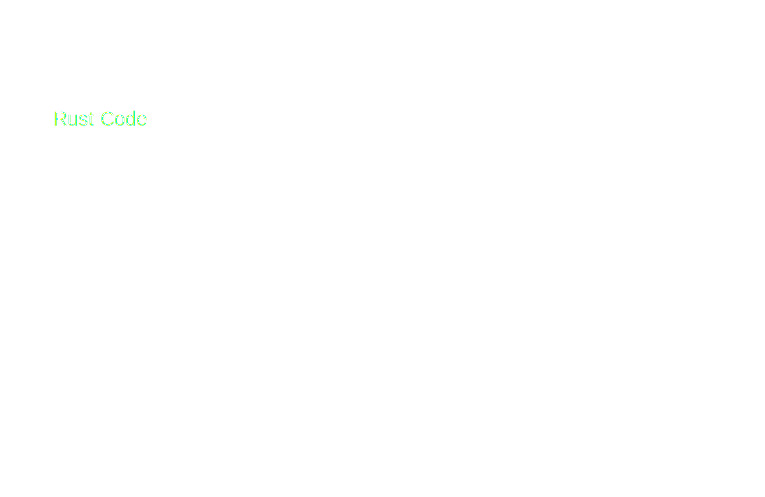
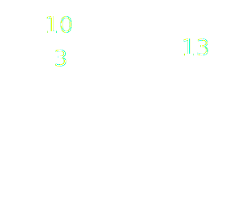

# Platform Agnostic Bytecode

---

## Review of Compilers


🤯 Fun Side Reading: <!-- .element: class="fragment" data-fragment-index="1" -->
[Reflections on Trusting Trust](https://www.cs.cmu.edu/~rdriley/487/papers/Thompson_1984_ReflectionsonTrustingTrust.pdf) <!-- .element: class="fragment" data-fragment-index="1" -->

Notes:

Just a very quick reminder of how compilers work.
Humans write programs in some human readable language like Lauren talked about.
Then the compiler translates the semantics of that program into an equivalent program in a much lower more machine-readable language called a bytecode.

CLICK

Whenever I show this diagram or talk about compilers, I always like to mention one of my favorite essays ever.
Ken Thompson's 1984 Turing Award lecture.

---

## Definition

A PAB is a bytecode that follows two main principles:

- Turing Completeness, as a standard bytecode would respect

<!-- .element: class="fragment" data-fragment-index="1" -->

- Support for tooling that makes it executable on every machine

<!-- .element: class="fragment" data-fragment-index="2" -->

Notes:

Ideally a bytecode like this is designed to be executed on a virtual machine that follows general known patterns.

---

<pba-cols>
<pba-col left>

<pba-flex center>

###### High Level Languages


</pba-flex>
</pba-col>
<!-- .element: class="fragment" data-fragment-index="1" -->

<pba-col center>
<pba-flex center>

###### PABs


</pba-flex>
</pba-col>
<!-- .element: class="fragment" data-fragment-index="2" -->

<pba-col right>
<pba-flex center>

###### Architecture's bytecode


</pba-flex>
</pba-col>
<!-- .element: class="fragment" data-fragment-index="3" -->

</pba-cols>

Notes:

From left to right you can see different levels of abstraction over the program that will ultimately be run on some machine.
Generally, from a high level language you need two compilation step if you want to pass through a PAB.

Other examples of PABs used right now:

- Inside the Linux Kernel -> eBPF
- Inside browsers -> Wasm
- Inside Blockchains -> Wasm
  - Full nodes
  - Light nodes (Wasm inside Wasm)
- LLVM Toolchain -> LLVM IR

---v

## Compiling in a PAB


Notes:

So when we are using a PAB, we need to compile twice.
This is, of course, the cost to using a PAB.
In this lesson we'll also explore the advantages.

---

#### What a PAB allows is:

<pba-flex center>

- Portability
  <!-- .element: class="fragment" data-fragment-index="1" -->
      - Avoid Hardware Centralization
  <!-- .element: class="fragment" data-fragment-index="3" -->
- Determinism
  <!-- .element: class="fragment" data-fragment-index="2" -->
      - Make consensus possible
  <!-- .element: class="fragment" data-fragment-index="4" -->

</pba-flex>

Notes:

The main goal of a PAB is to make the code **portable**, you should be able to compile it once and then share it around without caring about the architecture on which will be executed. Of course in a decentralized network we want that different nodes, with different architectures came up to the same result if the input are the same, that's called **determinism**, if a PAB would not have determinism then reaching consensus is impossible.

---v

##### That's why PABs are so important

---

## Desireable Features

- Hardware Independence
<!-- .element: class="fragment" data-fragment-index="1" -->
- Efficiency: minimize overhead vs. native
<!-- .element: class="fragment" data-fragment-index="2" -->
- Tool Simplicity
<!-- .element: class="fragment" data-fragment-index="3" -->
- Support as Compilation Target
<!-- .element: class="fragment" data-fragment-index="4" -->
- Sandboxing
<!-- .element: class="fragment" data-fragment-index="5" -->
- Deterministic execution
<!-- .element: class="fragment" data-fragment-index="5" -->

Notes:

- Hardware Independence: It should not be tightly related to a specific architecture, otherwise the execution on different machine could be convoluted
- Efficiency: the execution and compilation of a PAB should be efficient, the problem for a PAB is that in the execution time is also considered the "translation" to the machine's bytecode or the interpretation
- Support as Compilation Target: The PAB should be possible to be compiled by as many as possible High Level languages
- Tool Simplicity: If the tools that makes the PAB executable are extremely complex then nobody will use it
- Deterministic execution: Same execution (always) on any platform

---v

### Sandboxing?

An environment for running untrusted code without affecting the host.

<!-- .element: class="fragment" data-fragment-index="1" -->


A SmartContract is _Arbitrary Code_ that may be executed on other people's infrastructure, we don't want SmartContracts capable of destroying the nodes on which they are executed

<!-- .element: class="fragment" data-fragment-index="2" -->

Notes:

CLICK read definition

The term sandbox is an analogy to kids playing in a sandbox.
The parent puts the kid in the sandbox and tells them they can play in the sandbox and they are safe as long as they stay in.
Don't go in the woods and get bitten by a snake or in the road and get hit by a car.
Just stay in the sandbox.

Of course the analogy isn't perfect.
The children in the sandbox stay there because the parent asked them to.
They could leave anytime they wanted to.
For actual untrusted code, a better analogy would be a walled garden or a Jail

---v

### Sandboxing?

 <!-- .element: class="fragment" data-fragment-index="1" -->

A sandboxed environment must be created by the executor of the PAB.

<!-- .element: class="fragment" data-fragment-index="2" -->

Notes:

Of course the security can be seen by various point of view and some examples are:

- Compilation takes too much time -> "compiler bomb"
- Access to the environment -> "buffer overflow" techniques

Those things can't be addressed by the PAB itself but they can give good guidelines and code design to make an 100% secure implementation of the executor possible.

---

## PAB's lifecycle example

<div class="r-stack">


<!-- .element: class="fragment" data-fragment-index="1" -->

<!-- .element: class="fragment" data-fragment-index="2" -->

<!-- .element: class="fragment" data-fragment-index="3" -->

<!-- .element: class="fragment" data-fragment-index="4" -->

<!-- .element: class="fragment" data-fragment-index="5" -->
</div>

---

<pba-cols>
<pba-col center>

# WebAssembly

- Parachain validation function
- Contracts (so far)

<!-- .element: class="fragment" data-fragment-index="1" -->

</pba-col>
<pba-col center>


</pba-col>
</pba-cols>

---

## WebAssembly and Polkadot


---

## Wasm's key points

<pba-flex center>

- Hardware independent
  <!-- .element: class="fragment" data-fragment-index="1" -->
  - Binary instruction format for a stack-based virtual machine
  - Altough with "locals" (registers) and higher level control flow elements
  <!-- .element: class="fragment" data-fragment-index="1" -->
- Supported as compilation target by many languages
  <!-- .element: class="fragment" data-fragment-index="2" -->
  - Rust, C, C++ and many others
  <!-- .element: class="fragment" data-fragment-index="2" -->
- Fast (with near-native performance when compiled - more later)
<!-- .element: class="fragment" data-fragment-index="3" -->
- Safe (executed in a sandboxed environment)
<!-- .element: class="fragment" data-fragment-index="4" -->

</pba-flex>

Notes:

Wasm seems to respect every rating points we defined before

---

## Stack-Based Virtual Machine Example

<pba-cols>
<pba-col center>

Adding two number in wasm text representation (.wat)

<!-- .element: class="fragment fade-out" data-fragment-index="1" -->

```wasm [1-12|5|6|8]
(module
  (import "console" "log" (func $log (param i32)))
  (func $main
    ;; load `10` and `3` onto the stack
    i32.const 10
    i32.const 3

    i32.add ;; add up both numbers
    call $log ;; log the result
  )
  (start $main)
)
```

<!-- .element: class="fragment" data-fragment-index="0" -->

</pba-col>
<pba-col center>

<div class="r-stack">

<!-- .element: class="fragment" data-fragment-index="1" -->

<!-- .element: class="fragment" data-fragment-index="2" -->

<!-- .element: class="fragment" data-fragment-index="3" -->

<!-- .element: class="fragment" data-fragment-index="4" -->

<!-- .element: class="fragment" data-fragment-index="5" -->

<!-- .element: class="fragment" data-fragment-index="6" -->
</div>

</pba-col>
</pba-cols>

Notes:

Wasm has also a text representation,
Wat has some features that allow for better readability:

- Stack push operations can be grouped to its consuming instruction.
- Labels can be applied to elements.
- Blocks can enclosed with parenthesis instead of explicit start/end instructions.

Instructions push results to the stack and use values on the stack as arguments, the compilation process generally translate this stack-based bytecode to register based, where registers are used to pass values to instructions as a primary mechanism. The compilation will try to elide the wasm stack and work with only the architecture registers.

There is another type of stack used in wasm and that's called: shadow stack, resource to learn more: https://hackmd.io/RNp7oBzKQmmaGvssJDHxrw

---

## How Wasm is executed

<pba-flex left>

There are multiple ways to execute wasm:

- Ahead Of Time Compilation
  - Program is stored in executable format on disk
  - Thus it can be executed directly (after linking and loading)
- Just in Time Compilation
  - Program isn't stored in executable format
  - Instead it's compiled into an executable format just before it is executed
- Single Pass Compilation
  - Same as JIT but tries to minimize work done during compilation
  - Used in situations when JIT can't spend much time
- Interpretation
  - Program isn't store in executable format and never compiled into such
  - Instead, the programs instruction are _interpreted_ one by one
- ...

<!-- .element: class="fragment" data-fragment-index="1" -->

</pba-flex >

Notes:

AOT: Compile all the code at the beginning, this allows to makes a lot of improvement to the final code efficiency
JIT: The code is compiled only when needed, examples are functions that are compiled only when called, this leave space only to partials improvements
SPC: This is a specific technique of compilation that is made in linear time, the compilation is done only passing once on the code
Interpretation: The wasm blob is treated as any other interpreted language and executed in a Virtual Machine

---

### Wasmtime

- Stand alone, sandboxed Wasm environment
- Wasmtime is compiling Wasm code
- Built on the optimizing Cranelift code generator to (quickly) generate high-quality machine code either at runtime (JIT) or ahead-of-time (AOT)

<!--TODO: graphics-->

Notes:

- wasmtime book: https://docs.wasmtime.dev/
- Used in substrate as embedder for the blockchain logic

Cranelift is a fast, secure, relatively simple and innovative compiler backend. It takes an intermediate representation of a program generated by some frontend and compiles it to executable machine code

---

#### Wasm lifecycle in Wasmtime

<div class="r-stack">


<!-- .element: class="fragment" data-fragment-index="1" -->

<!-- .element: class="fragment" data-fragment-index="2" -->

<!-- .element: class="fragment" data-fragment-index="3" -->
</div>

---

### Wasmi

- Wasm interpreter
- Minimal compilation work but the interpreter is still very fast
  - The wasm code is transpiled to WasmI IR, another stack-based bytecode
  - The WasmI IR is then interpreted by a Virtual Machine
- First approach for contracts on Polkadot (pallet-contracts)

<!--TODO: graphics-->

Notes:

proposal to switch from a stack based ir to registry based ir https://github.com/paritytech/wasmi/issues/361

paper explaining the efficiency of translating wasm to registry based code https://www.intel.com/content/www/us/en/developer/articles/technical/webassembly-interpreter-design-wasm-micro-runtime.html <!-- markdown-link-check-disable-line -->

Due to it's characteristics it is mainly used to execute SmartContracts on chain

---

#### Wasm lifecycle in Wasmi

<div class="r-stack">


<!-- .element: class="fragment" data-fragment-index="1" -->

<!-- .element: class="fragment" data-fragment-index="2" -->

<!-- .element: class="fragment" data-fragment-index="3" -->
</div>

<!-- Really nice slide but there's not enough knowledge about substrate

There are also light clients, where both Runtime and Client are implemented in wasm, so we have:

- A browser as embedder of the node's client
  - the node's client as embedder for the node's runtime
    - the node's runtime as embedder for the SmartContract


We have a double recursion of a PAB that embed itself

-->

---

### Wasmi

- Why use something different for contracts? Why not use Wasmtime?

<!-- .element: class="fragment" data-fragment-index="1" -->

- Mainly because compilation is too slow and resulting code isn't deterministic.

<!-- .element: class="fragment" data-fragment-index="2" -->

- We'll investigate this in the next lecture.

<!-- .element: class="fragment" data-fragment-index="2" -->

---

# Alternatives

---

## EVM

- The **Ethereum Virtual Machine** executes a stack machine
- See previous lecture

---

## Solana

- Berkeley Packet Filter
- eBPF used in Linux
  - Allows untrusted code execution in kernel space
  - Bytecode verifier prevents attacks
  - For example: No unbounded loops allowed
- Solana uses a eBPF variant for contracts (rBPF / Solana VM)

Notes:

https://forum.polkadot.network/t/ebpf-contracts-hackathon/1084

## PolkaVM

More to be said about that very soon!

---

## Additional Resources! 😋

> Check speaker notes (click "s" 😉)

Notes:

- More on PAB:

  - https://github.com/gabriele-0201/IPABDN/blob/main/thesis/IPABDN.pdf

- More on Rust target spec:

  - https://rust-lang.github.io/rfcs/0131-target-specification.html

- Lin Clark's awesome talks on WASI (not super relevant to our work though):

  - https://www.youtube.com/watch?v=fh9WXPu0hw8
  - https://www.youtube.com/watch?v=HktWin_LPf4

- `wasm-unknown` vs `wasm-wasi`:

  - https://users.rust-lang.org/t/wasm32-unknown-unknown-vs-wasm32-wasi/78325/5

- `extern "C"`:

  - https://doc.rust-lang.org/std/keyword.extern.html
  - https://doc.rust-lang.org/book/ch19-01-unsafe-rust.html#using-extern-functions-to-call-external-code

- Chapter 11 of this book is a great read: https://nostarch.com/rust-rustaceans
