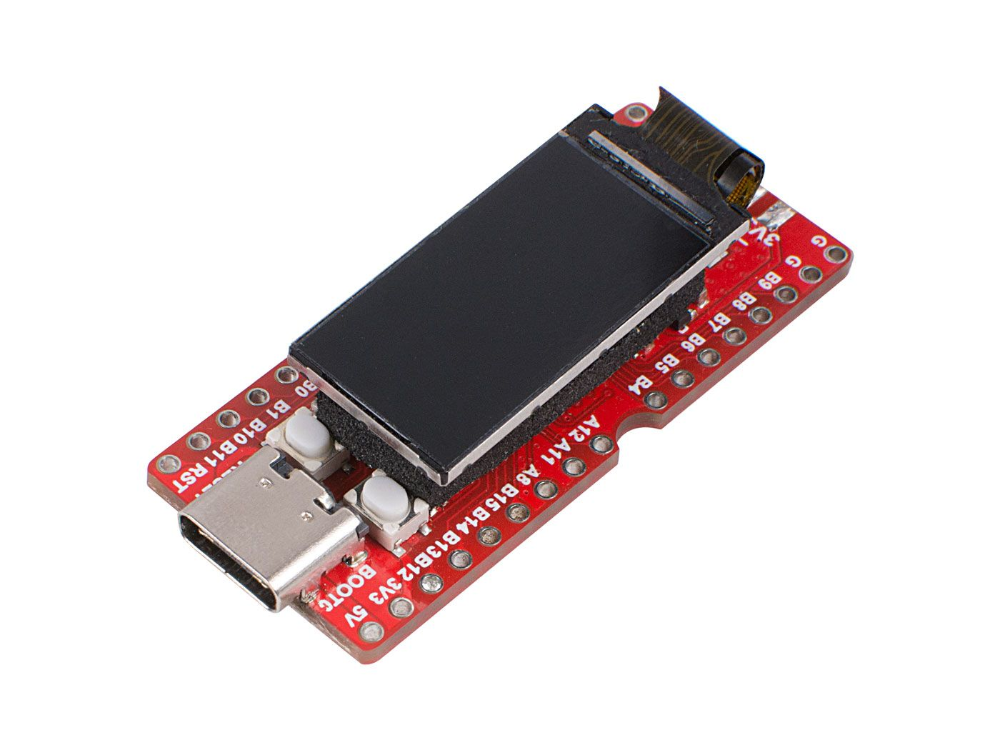
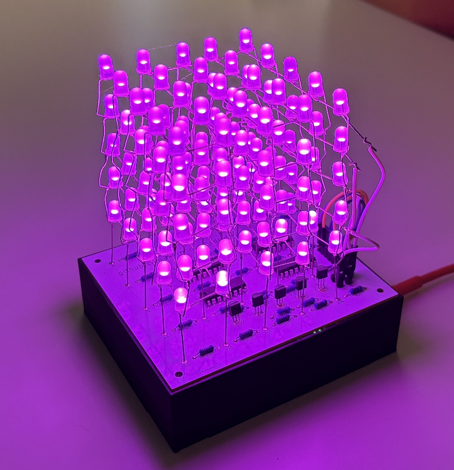
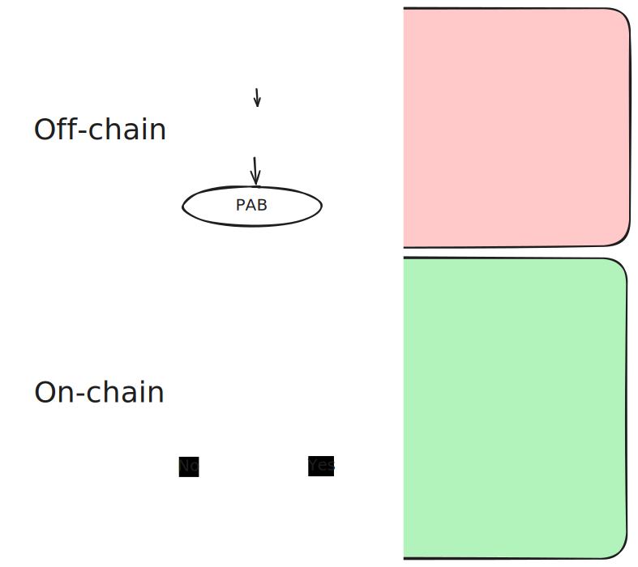
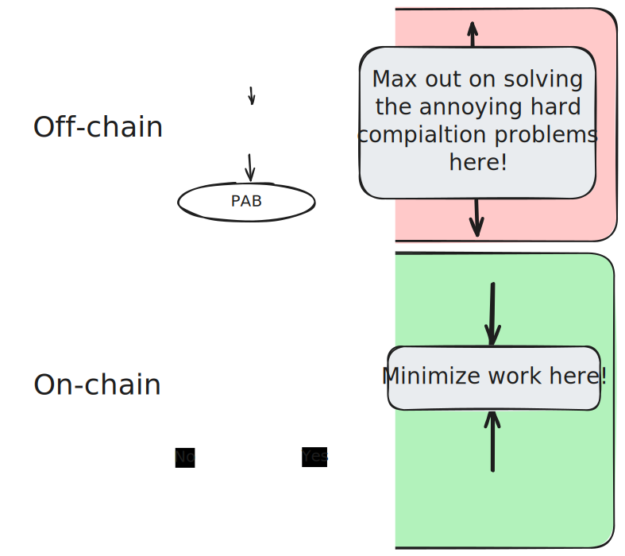
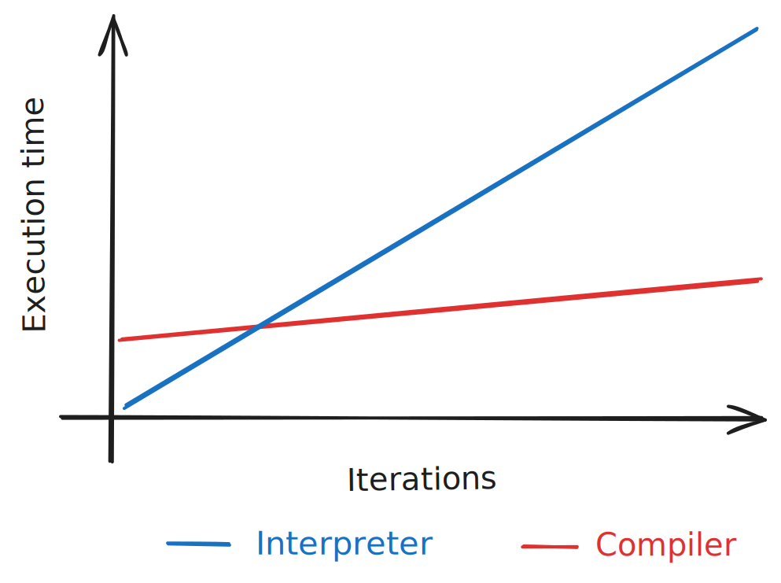
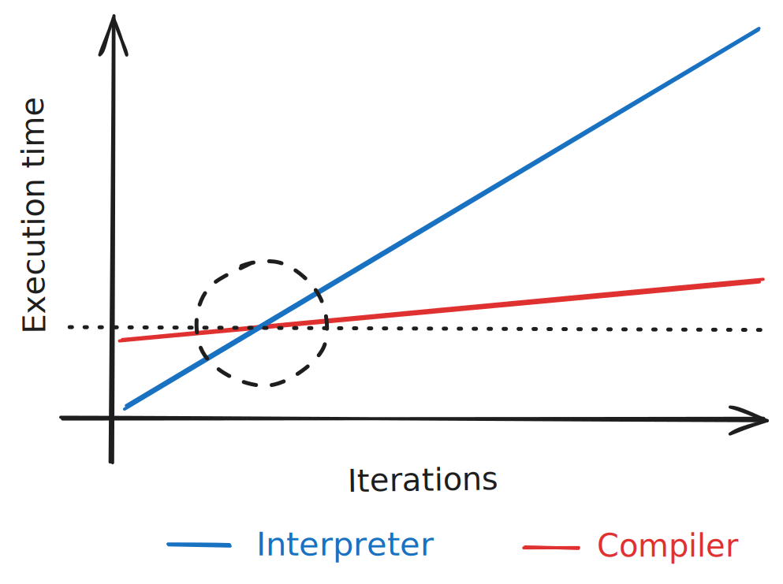
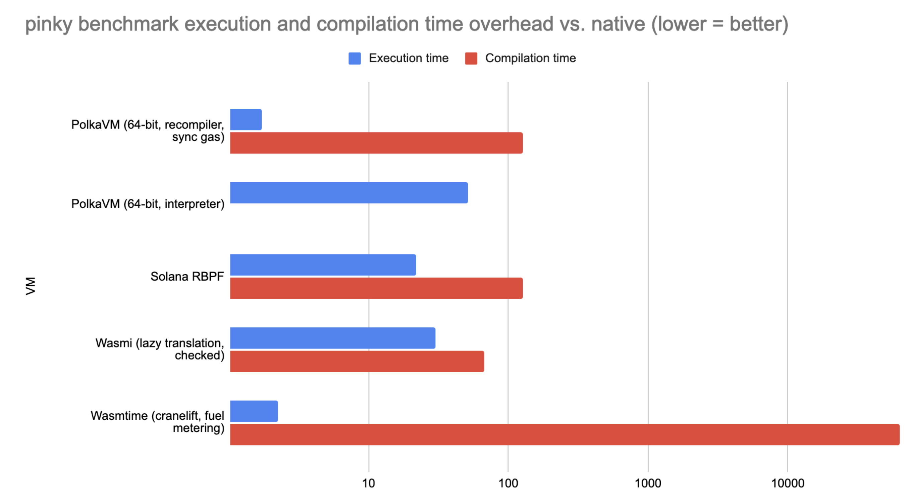
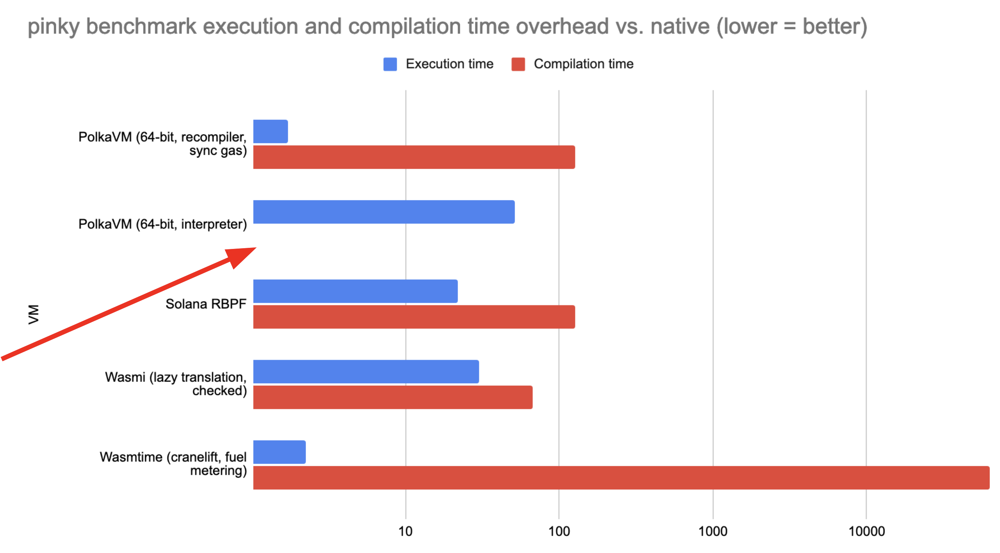

# PolkaVM

## From the past (Wasm) to the future (PVM)

> "the next generation virtual machine for Polkadot and PolkaJam"

-- Jan Bujak, author of the first PolkaVM implementation

---

# Wasm

Polkadot is abandoning Wasm: Here's why!

Notes:

Click-baity introduction slide

---

# Wasm: The obvious choice?

- Open standard
- Mature and widely adopted
- Many production-grade implementation available
- Faster than EVM

Notes:

On a first glance Wasm seems like an obvious choice for blockchains.
For the reasons listened.

---

# Wasm: The obvious choice **for blockchains**?

1. Indeterministic execution
2. Compiling Wasm to machine code

Notes:

However, the way Wasm is designed, in practice it's actually not the ideal choice.
As it turns out, deterministic execution of Wasm code is implementation dependent.
Additionally, compiling Wasm to efficient machine code is a hard problem,
not ideal for a decentralized network that does a lot of code re-execution across nodes.

---

## Problem #1: Indeterministic execution

Executing Wasm code is not actually deterministic

<!-- .element: class="fragment" data-fragment-index="1" -->

Example: Unbounded stack

<!-- .element: class="fragment" data-fragment-index="2" -->

Notes:

We analyze why Wasm code execution isn't deterministic based how it's stack works.

---

## Indeterministic execution

What is the problem with the below snippet?

Hint: Think about the differences between how function arguments are passed in stack vs. register machines.

```wasm
(func (param i32) (param i32) (param i32) (param i32) (param i32) (param i32) (param i32) (param i32) (param i32)
    local.get 0
    local.get 1
    ;; ...
    local.get 8

    call $other
)
```

Notes:

https://forum.polkadot.network/t/deterministic-pvf-executor/4204
https://hackmd.io/@Ww6uNnIISmqGwXufqPYPOw/SklLYwb-T

---

## Indeterministic execution

```wasm
(func (param i32) (param i32) (param i32) (param i32) (param i32) (param i32) (param i32) (param i32) (param i32)
    local.get 0
    local.get 1
    ;; ...
    ;;
    ;; general purpose registers and ABI of the target platform and architecture?
    ;;
    ;; x86_64:  6 argument registers (rdi, rsi, rcx, rdx, r8, r9)
    ;; aarch64: 8 argument registers (r0..r7)
    ;; x86_64:  may eventually spill to stack
    ;; x86_64:  will eventually stack overflow
    ;; aarch64: probably fine?
    ;;
    ;; => indeterministic behavior!
    ;;
    local.get 8

    call $other
)
```

Notes:

The number of arguments is unbounded. The number of registers per platform is limited.
As a consequence a combination of the Wasm compiler and CPU architecture used
dictates the overflow behavior.

---

## Problem #2: Compiling Wasm to machine code

Wasm knows many "high level" control flow elements!

<!-- .element: class="fragment" data-fragment-index="1" -->

Wasm doesn't know about register allocation or target architecture specific optimizations!

<!-- .element: class="fragment" data-fragment-index="1" -->

Not ideal for us because compilation is expensive :(

<!-- .element: class="fragment" data-fragment-index="3" -->

Notes:

Compiling higher level control flow elements to efficient machine code
involves multiple costly algorithms.

Which is inefficient for short-lived contracts compiled on every node.

---

### High level control flow

Compilers use (expensive) algorithms to:

<!-- .element: class="fragment" data-fragment-index="1" -->

- lower "high level" control flow statements
  - `loop`
  - `if`

<!-- .element: class="fragment" data-fragment-index="2" -->

- Into a bunch of "low level" control flow instructions
  - (conditional) branch instructions
  - location labels

<!-- .element: class="fragment" data-fragment-index="3" -->

Notes:

Some examples of code lowering.

---

### High level control flow

Let's use ChatGPT for a little experiment

Notes:

We illustrate the cost of compiling Wasm to machine code.

---

### High level control flow

Prompt: _Write me fibonacci in webassembly text_

```wasm
  (func $fibonacci (param $n i32) (result i32)
    (local $a i32)
    (local $b i32)
    (local $temp i32)
    (local.set $a (i32.const 0))
    (local.set $b (i32.const 1))

    (loop $loop
      ;; if n <= 1, return n
      (if (i32.le_s (local.get $n) (i32.const 1))
        (then
          (return (local.get $n))
        )
      )
      ..
```

---

### High level control flow

Prompt: _Write me fibonacci in x86_64 assembly_

```asm
fibonacci:
    cmp rdi, 1          ; If n <= 1, return n
    jle .base_case
    mov rax, 0          ; a = 0
    mov rbx, 1          ; b = 1
    mov rcx, rdi        ; counter = n
.loop:
    add rax, rbx        ; temp = a + b
    xchg rax, rbx       ; a = b, b = temp
    dec rcx             ; counter--
    jg .loop            ; If counter > 0, repeat loop
    mov rax, rbx        ; Result is in b
    ret
.base_case:
    mov rax, rdi        ; Return n if n <= 1
    ret
```

---

<section>
  <h3>High level control flow</h3>
  <table>
  <thead>
    <tr>
      <th>Wasm</th>
      <th>x86_64</th>
    </tr>
  </thead>
    <tr>
      <td>
        <pre><code data-trim data-noescape>
        (loop $loop
          (if (i32.le_s (local.get $n) (i32.const 1))
            (then
              (return (local.get $n))
            )
          )
          ..
        )
        </code></pre>
      </td>
      <td>
        <pre><code data-trim data-noescape>
        fibonacci:
            cmp rdi, 1
            jle .base_case
            mov rax, 0
            mov rbx, 1
            mov rcx, rdi
        .loop:
            add rax, rbx
            xchg rax, rbx
            dec rcx
            jg .loop
            mov rax, rbx
            ret
        </code></pre>
      </td>
    </tr>
  </table>
</section>

---

<section>
  <h3>High level control flow</h3>
  <table>
  <thead>
    <tr>
      <th>Wasm</th>
      <th>x86_64</th>
    </tr>
  </thead>
    <tr>
      <td>
        <pre><code data-trim data-noescape>
        (loop $loop
          (if (i32.le_s (local.get $n) (i32.const 1))
        </code></pre>
      </td>
      <td>
        <pre><code data-trim data-noescape>
            cmp rdi, 1
            jle .base_case
            jg .loop
        </code></pre>
      </td>
    </tr>
  </table>
</section>

---

## Register allocation

Executing Wasm requires us to do register allocation

Notes:

A major issue for compiling stack machine code like Wasm code to
register machine code.

---

### Register allocation

> In compiler optimization, register allocation is the process of assigning local automatic variables and expression results to a limited number of processor registers.

https://en.wikipedia.org/wiki/Register_allocation

```wasm
(func (param i32) (param i32) (param i32) (param i32) (param i32) (param i32) (param i32) (param i32) (param i32)
    local.get 0
    local.get 1
    ;; ..
    local.get 8
    ;; Informally:
    ;;   Compiler needs to figure out which variable goes to which register
    ;;
    ;; For example adding two variables here requires them to be in
    ;; in registers on a real computer
)
```

---

### Register allocation

> **NP-Problem**
>
> Chaitin et al. showed that register allocation is an NP-complete problem.

https://en.wikipedia.org/wiki/Register_allocation#Common_problems_raised_in_register_allocation

Notes:

The class of nondeterministic polynomial time (NP) problems are a set of decision problems
where the answer is yes or no and this can be verified in polynomial time.

Informally, finding a solution to such a problem is hard, requires a lot of computational work.
Verifying a proof is little work.

Example: Integer factorization (finding factors is hard for large numbers - proofing that two numbers are
factors however is just a matter of a single multiplication).

NP-Complete problems can simulate every other NP problem.
They are considered the hardest of the NP problems: It follows that if they can simulate any other NP problem, solving them is at least as difficult as solving the most difficult NP problem.

---

### Register allocation

If you aren't familiar with the theory of computation, just read:

_Register allocation is a difficult problem_

---

## Compiling Wasm to machine code

- Wasm is almost a high level langauge (despite _assembly_ in the name)
- What compilers do is computationally expensive
- Can take literal hours on cheaper laptops
  - `polkadot-sdk`
  - `LLVM` framework
- There is a blog post somewhere, telling the story of a web dev rewriting everything to Wasm, only to end up with even greater load times :)

Notes:

As we can see, compiling Wasm code to machine code is annoying.

---

## Compiling Wasm to machine code

Not really a problem for long-living application like web apps

<!-- .element: class="fragment" data-fragment-index="1" -->


<!-- .element: class="fragment" data-fragment-index="2" -->

Notes:

In the context of web2 however this isn't usually a big problem.

---

## Compiling Wasm to machine code

- Every contract needs to be compiled on every node executing it!
- Transactions often involving multiple contracts amplifies the problem
- This doesn't look good from a theoretical perspective
- Caching?
  - Harder than it seems on first glance
  - Doesn't entirely solve the problem

Notes:

For us it is a problem! Contracts are short-lived and compiled on every node.

---

## Wasm compilation: Take-aways

**Theory:** Wasm is faster than EVM

<!-- .element: class="fragment" data-fragment-index="1" -->

**Practice:** By the time Wasm has finished compiling, EVM executed a token swap literally dozens to hundreds of times

<!-- .element: class="fragment" data-fragment-index="2" -->

---

## Some more problems with Wasm

- Complexity of the Wasm spec
  - Tailored towards web2
  - Spec is open but our request were turned down in the past
- Compiler bombs:
  - Optimizing compilers are not executing in linear time
  - Which is bad because it opens a DOS attack vector
  - Metered compilation slows down work that is already expensive

Notes:

A few more complaints about Wasm as contracts or blockchain runtime bytecode format.

---

# PolkaVM (PVM)

# Let's do better!

---

# PolkaVM

PolkaVM is based on RISC-V.

<!-- .element: class="fragment" data-fragment-index="1" -->


<!-- .element: class="fragment" data-fragment-index="2" -->

---

# RISC-V

Wait a minute!

<!-- .element: class="fragment" data-fragment-index="1" -->

RISC-V isn't a platform agnostic bytecode.

<!-- .element: class="fragment" data-fragment-index="2" -->

But a real CPU?

<!-- .element: class="fragment" data-fragment-index="3" -->

Notes:

I thought we are using PAB bytecodes? Let's explore why RISC-V can be used for that just fine.

---

## RISC-V



Notes:

This is an early example of a real hardware RISC-V based microcontroller.
It's CPU is a RISC-V chip.

This looks like fairly simple microcontroller and CPU. Keep this in mind!

---

## RISC-V



Notes:

This LED cube is controlled by that RISC-V microcontroller on the previous slide.

---

## RISC-V as PAB solves many Wasm problems

- Determinism
  - We are not dictated by web2
  - Instead we can have our own requirements
  - => Solved simply because we can define it as requirement
- Compilation
  - It follows that RISC-V bytecode is (much!) simpler to compile
  - => Minimze the work done on-chain!

Notes:

The main take-away is that if we have a PAB in the form of register machine code and
without high level control flow elements, compilation get's a lot easier.

---

## RISC-V

Realizations:

- RISC-V is simple
- Practically a common denominator of widely used _real_ CPUs
  - x86_64
  - aarch64

Notes:

RISC-V is close to either x86_64 and arm. Much closer than Wasm code anyways.

---

## RISC-V compilation



Notes:

Let's look at what happens when we execute contract code.

---

## RISC-V compilation



Notes:

Compilation is a lossy process. It's not ideal to compile into
Wasm, it is a lossy translation from source code into some also high level IR.

This moves compilation workloads on-chain. We should avoid this at all costs!

---

## RISC-V compilation vs. Wasm

Prompt: _Write me a fibonacci in RISC-V_

```
fibonacci:
    li t0, 1          # Load constant 1 into t0
    ble a0, t0, .base_case # If n <= 1, return n
    li t1, 0          # a = 0
    li t2, 1          # b = 1
.loop:
    add t3, t1, t2    # temp = a + b
    mv t1, t2         # a = b
    mv t2, t3         # b = temp
    addi a0, a0, -1   # n = n - 1
    bgt a0, t0, .loop # If n > 1, continue loop
    mv a0, t2         # Return b (Fibonacci(n))
    ret
.base_case:
    ret
```

Notes:

Back to our experiment.

---

<section>
  <h3>Intuitively: What's less work to compile to x86?</h3>
  <h3>Wasm or RISC-V?</h3>
  <table width="100%">
  <thead>
    <tr>
      <th>Wasm</th>
      <th>x86_64</th>
      <th>RISC-V</th>
    </tr>
  </thead>
    <tr>
      <td>
        <pre><code data-trim data-noescape>
        (loop $loop
          (if (i32.le_s ..)
            (then
              (return (local.get $n))
            )
          )
        ..
        )
        </code></pre>
      </td>
      <td>
        <pre><code data-trim data-noescape>
        fibonacci:
            cmp rdi, 1
            jle .base_case
            mov rax, 0
            mov rbx, 1
            mov rcx, rdi
        .loop:
            add rax, rbx
            xchg rax, rbx
            dec rcx
            jg .loop
            mov rax, rbx
            ret
        .base_case:
            mov rax, rdi
            ret
        </code></pre>
      </td>
      <td>
        <pre><code data-trim data-noescape>
        fibonacci:
            li t0, 1
            ble a0, t0, .base_case
            li t1, 0
            li t2, 1
        .loop:
            add t3, t1, t2
            mv t1, t2
            mv t2, t3
            addi a0, a0, -1
            bgt a0, t0, .loop
            mv a0, t2
            ret
        .base_case:
            ret
        </code></pre>
      </td>
    </tr>
  </table>
</section>

Notes:

It should be obvious just from looking at this from a distance which one
is easier to compile to a validator hardware CPU.

---

## The last puzzle piece

- PVM is based on the rv64**e**mac (_embedded_) ISA
  - The _embedded_ ISA is very similar to the standard ISA;
  - Reduces the general purpose register (GPA) count to 16
- Any computer will have 16 or more GPR (for the forseeable future)
  - x86_64 has 16 GPRs
  - aarch64 has 31 GPRs
- What this allows:
  - Instead of doing register allocation;
  - Compiling PVM bytecode is mostly a linear mapping of registers and instructions!

Notes:

Non-embedded RISC-V would give us 32 GPRs. Which would require a lot of stack spilling
on x86_64. We avoid that by using the embedded RISC-V ISA.

---

## This slide is important to understand

<pba-cols>
<pba-col center>


<!-- .element: class="fragment" data-fragment-index="1" -->

</pba-col>
<pba-col center>

PVM bytecode is

- very close to machine code
- cheap to compile **on-chain**
- efficient to execute
- heavily optimized **off-chain**

</pba-col>
</pba-cols>

Notes:

With our observation made thus fur it get's obvious why RISC-V is a better
choice for us than Wasm.

---

# PolkaVM `fibonacci` example

```rust
#![no_std]
#![no_main]

#[polkavm_derive::polkavm_export]
extern "C" fn fibonacci(n: u64) -> u64 {
    if n < 2 {
        return n;
    }

    let mut last = 1;
    let mut current = 1;

    for _ in 2..n {
        let last_temp = current;
        current = current + last;
        last = last_temp;
    }

    current
}

#[panic_handler]
fn panic(_info: &core::panic::PanicInfo) -> ! {
    unsafe {
        core::arch::asm!("unimp", options(noreturn));
    }
}
```

Notes:

Simple example of our beloved Fibonacci program.
We can compile this down to PVM.

---

# PolkaVM `fibonacci` example

<pba-cols>
<pba-col center>

```
: @0 [export #0: 'fibonacci']
 0: a2 = a0 <u 0x2
 3: a2 = 0 if a1 != 0
 5: jump @2 if a2 == 0
  : @1
 8: ret
  : @2
10: a2 = a0 ^ 0x2
13: a2 = a2 | a1
16: jump @4 if a2 != 0
  : @3
19: t0 = 0
21: a4 = 0x1
24: a0 = 0x1
27: a1 = 0
29: ret

```

</pba-col>
<pba-col center>

```
  : @4
31: sp = sp + 0xfffffff8
34: u32 [sp + 0x4] = s0
37: u32 [sp] = s1
39: t1 = 0
41: t2 = 0
43: a5 = 0
45: a3 = 0x2
48: s0 = 0x1
51: a2 = 0x1
54: fallthrough
  : @5
55: a3 = a3 + 0x1
58: a4 = a3 <u 0x1
61: a5 = a5 + a4
64: a4 = a2 + s0
67: t0 = a4 <u a2
```

</pba-col>
<pba-col center>

```
 70: t1 = t1 + t2
 73: t0 = t0 + t1
 76: t1 = a3 <u a0
 79: s0 = a5 ^ a1
 82: s1 = a5 <u a1
 85: s1 = t1 if s0 == 0
 88: s0 = a2
 90: t1 = t2
 92: a2 = a4
 94: t2 = t0
 96: jump @5 if s1 != 0
   : @6
 99: s0 = i32 [sp + 0x4]
102: s1 = i32 [sp]
104: sp = sp + 0x8
107: a0 = a4
109: a1 = t0
111: ret
```

</pba-col>
</pba-cols>

Notes:

The PVM bytecode looks like this. As said, close to RISC-V.
But most importantly, it is simple and close to real CPU assembly.
No high level control flow, variables already allocated to registers.

---

## PolkaVM interpreter vs. JIT compiler

- The PVM JIT compiler is fast!
- Compiling a PVM blob is faster than hashing it using `blake2b`.
- But.. for contracts it is still a significant overhead!
- Idea: Instead of compiling the PVM blob to native code, interpret it!
  - Pro: Nearly instant code execution
  - Con: Much slower than compiled code

Notes:

The PVM compiler is very fast. Hashing a code blob using one of the fastest (but still
cryptographically secure hash algorithms is slower than compiling it!

But even with the fastest possible JIT compiler, compilation overhead is still significant
and for some workloads still slower than just interpreting it.

The PVM solution: It can do both!

---

## PVM bytecode interpreter vs. JIT compiler



Notes:

Consider some imaginary contract workload. For example calulating Fibonacci numbers.

Horizontal axis is the time it takes to execute the contract.

Vertical axis is the parameter, the amount of iterations, the contract
will calculate Fibonacci numbers.

---

## PVM bytecode interpreter vs. JIT compiler



Notes:

As we can see, the compiler has a fixed base cost (fixed non-zero y-intercept).

This means we essentially have an optimization problem.

If the user wants to calculate only a few Fibonacci numbers => use interpreter.
For calculating many numbers => Paying the upfront cost for the compiler is amortized.

Example:

For a simple token swap, prefer the interpreter.

For a cryptographic computation, for example verifying a ZK proof, use the compiler.

---

# PVM Benchmarks



Notes:

Pinky is a NES emulator. The benchmark shows executing the emulator in various VMs.

---

# PVM Benchmarks



Notes:

There's nothing missing for the interpreter. It's just very fast because it has so little
work to do in order to start executing.

Conclusion is: PVM offers very fast execution (JIT compiler) but also very fast
compilation (interpreter).

Moreover, interpreter performance is still competitive and JIT compilation
is still the fastest of all.

In other words, PolkaVM easily crushes other existing solutions.

Also note that we still have optimizations to implement in PVM.

# EVM vs. PVM

- EVM is slower because it has to interpreted
- EVM isn't a general purpose VM
  - Pinky benchmarks not possible on EVM
  - EVM doesn't run contracts written other languages, e.g. Rust

---

# PVM beyond contracts

- Parachain Validation Function (PVF)
- Join-accumulate-machine (JAM)
  - https://github.com/gavofyork/graypaper
  - https://graypaper.fluffylabs.dev/

Notes:

Deterministic compilation also benefits PVF.

PolkaVM will be powering JAM, a major protocol overhaul over Polkadot.

---

# PVM Demo

## Doom

Notes:

If we have enough time for it

---

# Summary

- PoklaVM solves blockchain specific pain points of Wasm
  - Inderministic execution
  - Compilation heavy-liftings moved off-chain
- Fast
- General purpose

Notes:

We decided to turn away from Wasm and fix the problems we discovered it with a new
VM and bytecode format. Benchmarks for both execution and compilation perforamnce
seem confirm our theoretical assumptions.
