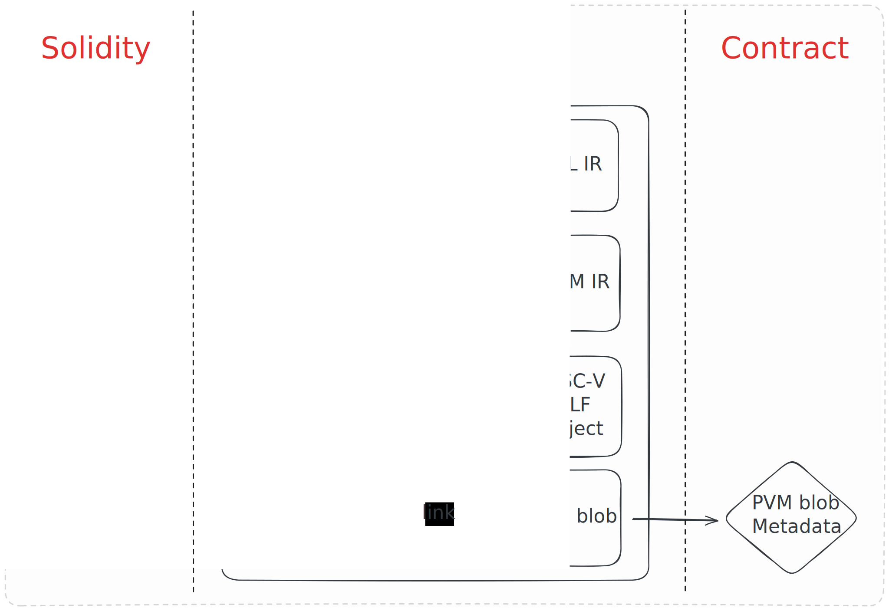

# The revive Solidity compiler

- Compiles Solidity to PVM bytecode
- Ethereum Solidity solc compiler is the Solidity frontend
- State-of-the-art LLVM compiler framework is the backend
- Emits PVM blobs and ETH metadata
- resolc executable + Wasm version

Notes:

The incumbent smart contract languages is Solidity.
The Ethereum Solidity compiler can only emit EVM bytecode.
Instead of interpreting it as EVM bytecode, we can speed Solidity code up by
compiling Solidity contracts to PVM bytecode.

---

## Compilation process



Notes:

- solc is used to lower the Solidity source code into YUL intermediate representation.
- revive lowers the YUL IR into LLVM IR.
- LLVM optimizes the code and emits a RISC-V ELF shared object (through LLD).
- The PolkaVM linker finally links the ELF shared object into a PolkaVM blob.

---

## YUL frontend

<pba-cols>
<pba-col center>

- Solidity is a moving target
- Spec still being worked on
- Still no stable version 1.0
- `YUL` IR is a lot simpler and has a formal spec
- `solc` can parse Solidity and lower it YUL for us

<!-- .element: class="fragment" data-fragment-index="1" -->

</pba-col>
<pba-col center>


</pba-col>
</pba-cols>

Notes:

The revive resolc frontend executable is almost a drop-in replacement for solc.

---

## YUL IR

Solidity example:

```solidity
contract Flipper {
    bool coin;

    constructor(bool _coin) {
        coin = _coin;
    }

    function flip() public {
        coin = !coin;
    }
}
```

Notes:

We will show what YUL IR is with a simple Solidity example.

---

## YUL IR

YUL (harder for humans but easier for compilers):

```yul
object "Flipper_23" {
    code {
        {
            /// @src 0:952:1104  "contract Flipper {..."
            let _1 := memoryguard(0x80)
            if callvalue() { revert(0, 0) }
            let programSize := datasize("Flipper_23")
            let argSize := sub(codesize(), programSize)
            let newFreePtr := add(_1, and(add(argSize, 31), not(31)))
            if or(gt(newFreePtr, sub(shl(64, 1), 1)), lt(newFreePtr, _1))
            {
                mstore(/** @src -1:-1:-1 */ 0, /** @src 0:952:1104  "contract Flipper {..." */ shl(224, 0x4e487b71))
                mstore(4, 0x41)
                revert(/** @src -1:-1:-1 */ 0, /** @src 0:952:1104  "contract Flipper {..." */ 0x24)
            }
    // ..
    }
}
```

Our simple flipper example looks like this in YUL IR (EVM dialiect).

The revive compiler lowers this into LLVM IR.

---

## LLVM backend

<pba-cols>
<pba-col center>

- Powerful and mature compiler framework
- Does the heavy lifting in terms of optimizations
- Supports the RISC-V `rv64e` target

<!-- .element: class="fragment" data-fragment-index="1" -->

</pba-col>
<pba-col center>


</pba-col>
</pba-cols>
