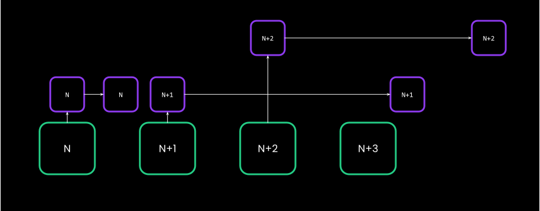

# 🪝 FRAME/Pallet Hooks 🪝

You can not just execute logic in calls, but regularly on events.

Notes:
One of the distinctions from contracts that always need to be called.

---

## Hooks: All In One

- Onchain / STF
  - `on_runtime_upgrade`
  - `on_initialize`
  - `on_poll`
  - `on_idle`
  - `on_finalize`
- Offchain:
  - `genesis_build`
  - `offchain_worker`
  - `integrity_test`
  - `try_state`

Notes:

https://paritytech.github.io/substrate/master/frame_support/traits/trait.Hooks.html

---v

### Hooks: All In One

```rust
#[pallet::hooks]
impl<T: Config> Hooks<BlockNumberFor<T>> for Pallet<T> {
  fn on_runtime_upgrade() -> Weight {}
  fn on_initialize() -> Weight {}
  fn on_finalize() {}
  fn on_idle(remaining_weight: Weight) -> Weight {}
  fn on_poll(weight: &mut WeightMeter) {}
  fn offchain_worker() {}
  fn integrity_test() {}
  #[cfg(feature = "try-runtime")]
  fn try_state() -> Result<(), &'static str> {}
}

#[pallet::genesis_build]
impl<T: Config> BuildGenesisConfig for GenesisConfig<T> {
	fn build(&self) {}
}
```

Notes:

Many of these functions receive the block number as an argument, but that can easily be fetched from
`frame_system::Pallet::<T>::block_number()`

---

## Hooks: `on_runtime_upgrade`

- Called every time the `spec_version`/`spec_name` is bumped.
- Why might you be interested in implementing this?
  - &shy;<!-- .element: class="fragment" --> **State Migration**, see dedicated lecture
- &shy;<!-- .element: class="fragment" --> _Note_: Called before `on_initialize`, so the state might be subtly different from an extrinsic.

Notes:

Because very often runtime upgrades need to be accompanied by some kind of state migration.
Has its own lecture, more over there.

---

## Hooks: `on_initialize`

- Useful for any kind of **automatic** and **necessary** operation.
- The weight you return is interpreted as `DispatchClass::Mandatory`.

---v

### Hooks: `on_initialize`

- `Mandatory` Hooks should really be lightweight and predictable, with a bounded complexity.

```rust
fn on_initialize() -> Weight {
  // any user can create one entry in `MyMap` 😱🔫.
  <MyMap<T>>::iter().for_each(do_stuff);
}
```

<!-- .element: class="fragment" -->

---v

### Hooks: `on_initialize`

- &shy;<!-- .element: class="fragment" --> Question: If you have 3 pallets, in which order are their `on_initialize` hooks called?
- &shy;<!-- .element: class="fragment" --> Question: If your runtime panics `on_initialize`, how can you recover from it?
- &shy;<!-- .element: class="fragment" --> Question: If your `on_initialize` consumes more than the maximum block weight?

Notes:

- The order comes from `construct_runtime!` macro.
- Panic in mandatory hooks is fatal error. You are pretty much done. Most likely need to fork the chain.
- Overweight blocks using mandatory hooks are possible, ONLY in the context of solo-chains. Such a
  block will take longer to produce, but it eventually will. If you have your eyes set on being a
  parachain developer, you should treat overweight blocks as fatal as well.

---

## Hooks: `on_poll`

```rust
fn on_poll(_n: BlockNumber, _weight: &mut WeightMeter)
```

- The non-mandatory version of `on_initialize`, i.e. it is not guaranteed to execute every block.
- Runs after inherents.
- Comes with a weight meter that needs to be adhered to. More on weights in the dedicated lecture.

Notes:

See https://github.com/paritytech/substrate/pull/14279 , https://github.com/paritytech/polkadot-sdk/pull/1781 and related PRs

---

## Hooks: `on_finalize`

- Extension of `on_initialize`, but at the end of the block.
- Its weight needs to be known in advance. Therefore, less preferred compared to `on_initialize`.

```rust
fn on_finalize() {} // ✅
fn on_finalize() -> Weight {} // ❌
```

<!-- .element: class="fragment" -->

- Nothing to do with _finality_ in the consensus context.

<!-- .element: class="fragment" -->

---v

### Hooks: `on_finalize`

> Generally, avoid using it unless if something REALLY needs to happen at the end of the block.

&shy;<!-- .element: class="fragment" --> _Tip_: Sometimes, rather than thinking "at the end of block N", consider writing code "at the beginning of block N+1".

Notes:

Sometimes, rather than thinking "at the end of block N", consider writing code "at the beginning of block N+1"

---

## Hooks: `on_idle`

- **_Optional_** variant of `on_finalize`, also executed at the end of the block, that uses left-over weight.
- Small semantic difference: executes pallets' hooks randomly, rather than in `construct_runtime` order, and only
  if there is weight left.

---v

## The Future: Moving Away From Mandatory Hooks

- `on_initialize` -> `on_poll`
- `on_finalize` -> `on_idle`
- New primitives for multi-block migrations
- New primitives for optional service work via extrinsics.

Notes:

This is all in the agenda of the FRAME team at Parity for 2023.

https://github.com/paritytech/substrate/issues/13530
https://github.com/paritytech/substrate/issues/13690

---

## Recap: Onchain/STF Hooks

<diagram class="mermaid">
%%{init: {'theme': 'dark', 'themeVariables': { 'darkMode': true }}}%%
graph LR
    subgraph AfterTransactions
        direction LR
        OnIdle --> OnFinalize
    end

    subgraph OnChain
        direction LR
        Optional --> BeforeExtrinsics
        BeforeExtrinsics --> Inherents
        Inherents --> Poll
        Poll --> Transactions
        Transactions --> AfterTransactions
    end

    subgraph Optional

OnRuntimeUpgrade
end

    subgraph BeforeExtrinsics
        OnInitialize
    end

    subgraph Transactions
        Transaction1 --> UnsignedTransaction2 --> Transaction3
    end

    subgraph Inherents
        Inherent1 --> Inherent2
    end

</diagram>

Notes:

implicit in this:

Inherents are only first, which is being discussed RIGHT NOW: https://github.com/polkadot-fellows/RFCs/pull/13

---

## Hooks: `genesis_build`

- Means for each pallet to specify a $f(input): state$ at genesis.
- This is called only once, by the client, when you **create a new chain**.
  - &shy;<!-- .element: class="fragment" --> Is this invoked every time you run `cargo run`?
- `#[pallet::genesis_build]`.

---v

### Hooks: `genesis_build`

```rust
#[pallet::genesis_build]
pub struct GenesisConfig<T: Config> {
  pub foo: Option<u32>,
  pub bar: Vec<u8>,
}
```

<!-- .element: class="fragment" -->

```rust
impl<T: Config> Default for GenesisConfig<T> {
  fn default() -> Self {
    // snip
  }
}
```

<!-- .element: class="fragment" -->

```rust
#[pallet::genesis_build]
impl<T: Config> GenesisBuild<T> for GenesisConfig<T> {
  fn build(&self) {
    // use self.foo, self.bar etc.
  }
}
```

<!-- .element: class="fragment" -->

---v

### Hooks: `genesis_build`

- `GenesisConfig` is a composite/amalgamated item at the top level runtime.

```rust
construct_runtime!(
  pub enum Runtime where {
    System: frame_system,
    Balances: pallet_balances,
  }
);
```

```rust
struct RuntimeGenesisConfig {
  SystemConfig: pallet_system::GenesisConfig,
  PalletAConfig: pallet_a::GenesisConfig,
}
```

<!-- .element: class="fragment" -->

Notes:

https://paritytech.github.io/substrate/master/node_template_runtime/struct.RuntimeGenesisConfig.html

---v

### Hooks: `genesis_build`

<!-- check what the state of this is -->

- Recent changes moving `genesis_build` to be used over a runtime API, rather than native runtime.
- `#[cfg(feature = "std")]` in pallets will go away.

Notes:

https://github.com/paritytech/substrate/issues/13334

---

## Hooks: `offchain_worker`

**Fully offchain application**:

- Read chain state via RPC.
- submit desired side effects back to the chain as transactions.

**Runtime Offchain Worker**:

- &shy;<!-- .element: class="fragment" --> Code lives onchain, upgradable only in synchrony with the whole runtime 👎
- &shy;<!-- .element: class="fragment" --> Ergonomic and fast state access 👍
- &shy;<!-- .element: class="fragment" --> State writes are ignored 🤷
- &shy;<!-- .element: class="fragment" --> Can submit transactions back to the chain as well ✅
- &shy;<!-- .element: class="fragment" --> Source of many confusions!

Notes:

People have often thought that they can do magic with things with OCW, please don't. BIG warning to
founders to be careful with this!

https://paritytech.github.io/substrate/master/pallet_examples/index.html

---v

### Hooks: `offchain_worker`

- Execution entirely up to the client.
- Has a totally separate thread pool than the normal execution.

```
--offchain-worker <ENABLED>
    Possible values:
    - always:
    - never:
    - when-authority

--execution-offchain-worker <STRATEGY>
    Possible values:
    - native:
    - wasm:
    - both:
    - native-else-wasm:
```

---v

### Hooks: `offchain_worker`

- Threads can **overlap**, each is reading the state of its corresponding block



<!-- .element: class="fragment" -->

Notes:

https://paritytech.github.io/substrate/master/sp_runtime/offchain/storage_lock/index.html

---v

### Hooks: `offchain_worker`

- &shy;<!-- .element: class="fragment" -->Offchain workers have their own **special host
  functions**: http, dedicated storage, time, etc.
- &shy;<!-- .element: class="fragment" -->Offchain workers have the same **execution limits** as
  Wasm (limited memory, custom allocator).

- &shy;<!-- .element: class="fragment" -->Source of confusion, why OCWs cannot write to state.

Notes:

These are the source of the confusion.

Word on allocator limit in Substrate Wasm execution (subject to change).

- Max single allocation limited
- Max total allocation limited.

---

## Hooks: `integrity_test`

- Put into a test by `construct_runtime!`.

```rust
__construct_runtime_integrity_test::runtime_integrity_tests
```

<!-- .element: class="fragment" -->

```rust
fn integrity_test() {
  assert!(
    T::MyConfig::get() > 0,
    "Are all of the generic types I have sensible?"
  );
  // notice that this is for tests, std is available.
  assert!(std::mem::size_of::<T::Balance>() > 4);
}
```

<!-- .element: class="fragment" -->

Notes:

I am in fan of renaming this. If you are too, please comment here

---

## Hooks: `try_state`

- A means for you to ensure correctness of your $STF$, after each transition.
- &shy;<!-- .element: class="fragment" -->Entirely offchain, custom runtime-apis, conditional
  compilation.
  - &shy;<!-- .element: class="fragment" -->Called from `try-runtime-cli`, which you will learn about in another lecture.
- &shy;<!-- .element: class="fragment" -->Examples from your assignment?

Notes:

What is a transition? Either a block, or single extrinsic

---

## Hooks: Recap

<diagram class="mermaid">
%%{init: {'theme': 'dark', 'themeVariables': { 'darkMode': true }}}%%
graph LR
    subgraph Offchain
        OffchainWorker
        TryState
    end

    subgraph Genesis
        GenesisBuild
    end

    subgraph AfterTransactions
        direction LR
        OnIdle --> OnFinalize
    end

    subgraph OnChain
        direction LR
        Optional --> BeforeExtrinsics
        BeforeExtrinsics --> Inherents
        Inherents --> Poll
        Poll --> Transactions
        Transactions --> AfterTransactions
    end

    subgraph Optional

OnRuntimeUpgrade
end

    subgraph BeforeExtrinsics
        OnInitialize
    end

    subgraph Transactions
        Transaction1 --> UnsignedTransaction2 --> Transaction3
    end

    subgraph Inherents
        Inherent1 --> Inherent2
    end

</diagram>

- What other hooks can you think of?

Notes:

What other ideas you can think of?

- a hook called once a pallet is first initialized.
  https://github.com/paritytech/substrate/issues/14098
- Local on Post/Pre dispatch: https://github.com/paritytech/substrate/issues/12047
- Global on Post/Pre dispatch is in fact a signed extension. It has to live in the runtime, because you have to specify order.

---

## Additional Resources! 😋

> Check speaker notes (click "s" 😉)

Notes:

## Post lecture Notes

Regarding this drawback to offchain workers that you can only upgrade in cadence with the network.
Offchain worker, like tx-pool api, is only called from an offchain context. Node operators can
easily use the runtime overrides feature to change the behavior of their offchain worker anytime
they want.
