# FRAME Benchmarking

## Lesson 1

---

## Overview

- Quick Recap of Weights
- Deep Dive Into Benchmarking

---

## Blockchains are Limited

Blockchain systems are extremely limited environments.

Limited in:

- Execution Time / Block Time
- Available Storage
- Available Memory
- Network Bandwidth
- etc...

---

## Performance vs Centralization

Nodes are expected to be decentralized and distributed.

Increasing the system requirements can potentially lead to centralization in who can afford to run that hardware, and where such hardware may be available.

---

## Why do we need benchmarking?

Benchmarking ensures that when users interact with our Blockchain, they are not using resources beyond what is available and expected for our network.

---

## What is Weight?

Weight is a general concept used to track consumption of limited blockchain resources.

---

## What is Weight in Substrate?

We currently track just two main limitations:

- Execution Time on "Reference Hardware"
- Size of Data Required to Create a Merkle Proof

```rust
pub struct Weight {
	/// The weight of computational time used based on some reference hardware.
	ref_time: u64,
	/// The weight of storage space used by proof of validity.
	proof_size: u64,
}
```

This was already expanded once, and could be expanded in the future.

---

## Weight limits are specific to each blockchain.

- 1 second of compute on different computers allows for different amounts of computation.
- Weights of your blockchain will evolve over time.
- Higher hardware requirements will result in a more performant blockchain (i.e. TXs per second), but will limit the kinds of validators that can safely participate in your network.
- Proof size limitations can be relevant for parachains, but ignored for solo-chains.

---

## What can affect relative Weight?

<pba-cols>

<pba-col>

- Processor
- Memory
- Hard Drive
  - HDD vs. SSD vs. NVME
- Operating System
- Drivers
- Rust Compiler

</pba-col>
<pba-col>

- Runtime Execution Engine
  - compiled vs. interpreted
- Database
  - RocksDB vs. ParityDB vs. ?
- Merkle trie / storage format
- and more!

</pba-col>
</pba-cols>

---

## Block Import Weight Breakdown

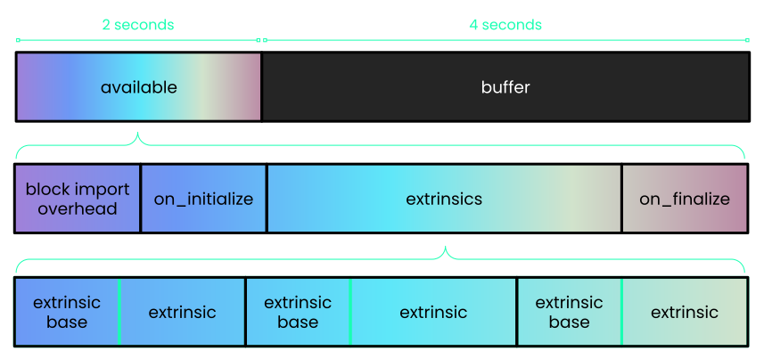

---

# The Benchmarking Framework

---

## The Benchmarking Plan

<div class="flex-container">
<div class="left-large">

- Use empirical measurements of the runtime to determine the time and space it takes to execute extrinsics and other runtime logic.
- Run benchmarks using worst case scenario conditions.
  - Primary goal is to keep the runtime safe.
  - Secondary goal is to be as accurate as possible to maximize throughput.

</div>
<div class="right">

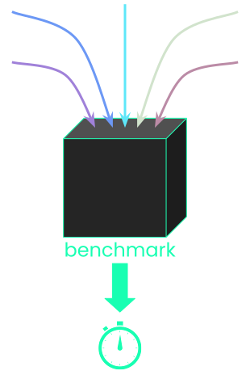

</div>
</div>

---

## The `#[benchmarks]` Macro

```rust
#[benchmarks]
mod benchmarks {
	use super::*;

	#[benchmark]
	fn benchmark_name() {
		/* setup initial state */

		/* execute extrinsic or function */
		#[extrinsic_call]
		extrinsic_name();

		/* verify final state */
		assert!(true)
	}
}
```

---

## Multiple Linear Regression Analysis

<div class="flex-container">
<div class="left-small">

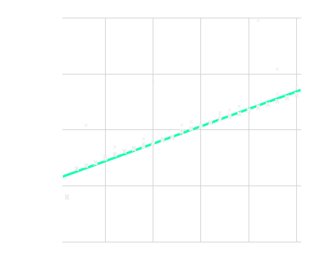

</div>
<div class="right">

- We require that no functions in Substrate have superlinear complexity.
- Ordinary least squared linear regression.
  - linregress crate
- Supports multiple linear coefficients.
  - `Y = Ax + By + Cz + k`
- For constant time functions, we simply use the median value.

</div>
</div>

---

## The `benchmark` CLI

Compile your node with `--features runtime-benchmarks`.

```sh
➜  ~ substrate benchmark --help
Sub-commands concerned with benchmarking.
The pallet benchmarking moved to the `pallet` sub-command

Usage: polkadot benchmark <COMMAND>

Commands:
  pallet     Benchmark the extrinsic weight of FRAME Pallets
  storage    Benchmark the storage speed of a chain snapshot
  overhead   Benchmark the execution overhead per-block and per-extrinsic
  block      Benchmark the execution time of historic blocks
  machine    Command to benchmark the hardware
  extrinsic  Benchmark the execution time of different extrinsics
  help       Print this message or the help of the given subcommand(s)

Options:
  -h, --help     Print help information
  -V, --version  Print version information
```

---

## `pallet` Subcommand

- Benchmark the weight of functions within pallets.
  - Any arbitrary code can be benchmarked.
- Outputs Autogenerated Weight files.

```rust
pub trait WeightInfo {
   fn transfer() -> Weight;
   fn transfer_keep_alive() -> Weight;
   fn set_balance_creating() -> Weight;
   fn set_balance_killing() -> Weight;
   fn force_transfer() -> Weight;
}
```

---

# Deep Dive

So let’s walk through the steps of a benchmark!

Reference: `frame/benchmarking/src/lib.rs`

```rust
-> fn run_benchmark(...)
```

---

## The Benchmarking Process

For each component and repeat:

1. Select component to benchmark
1. Generate range of values to test (steps)
1. Whitelist known DB keys
1. Setup benchmarking state
1. Commit state to the DB, clearing cache
1. Get system time (start)
1. Execute extrinsic / benchmark function
1. Get system time (end)
1. Count DB reads and writes
1. Record Data

---

## Benchmarking Components

- Imagine a function with 3 components
  - let x in 1..2;
  - let y in 0..5;
  - let z in 0..10;
- We set number of steps to 3.
- Vary one component at a time, select high value for the others.

|     | Δx  | Δy  | Δy  | Δz  | Δz  | max |
| --- | --- | --- | --- | --- | --- | --- |
| x   | 1   | 2   | 2   | 2   | 2   | 2   |
| y   | 5   | 0   | 2   | 5   | 5   | 5   |
| z   | 10  | 10  | 10  | 0   | 5   | 10  |

---

## Benchmarks Evaluated Over Components

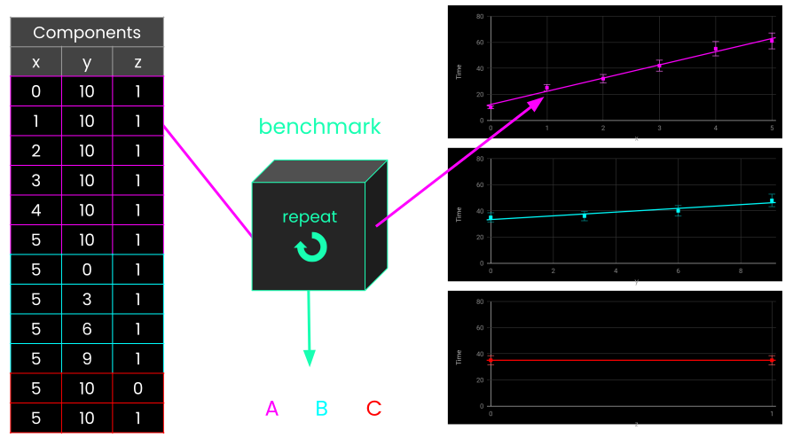

---

## Whitelisted DB Keys

```rust [3]
/// The current block number being processed. Set by `execute_block`.
#[pallet::storage]
#[pallet::whitelist_storage]
#[pallet::getter(fn block_number)]
pub(super) type Number<T: Config> = StorageValue<_, BlockNumberFor<T>, ValueQuery>;
```

- Some keys are accessed every block:
  - Block Number
  - Events
  - Total Issuance
  - etc…
- We don’t want to count these reads and writes in our benchmarking results.
- Applied to all benchmarks being run.
- This includes a “whitelisted account” provided by FRAME.

---

## Example Benchmark

The Identity Pallet


---

## Identity Pallet

- Identity can have variable amount of information
  - Name
  - Email
  - Twitter
  - etc…
- Identity can be judged by a variable amount of registrars.
- Identity can have a two-way link to “sub-identities”
  - Other accounts that inherit the identity status of the “super-identity”

---

## Extrinsic: Kill Identity

```rust
pub fn kill_identity(
	origin: OriginFor<T>,
	target: AccountIdLookupOf<T>,
) -> DispatchResultWithPostInfo {
	T::ForceOrigin::ensure_origin(origin)?;

	// Figure out who we're meant to be clearing.
	let target = T::Lookup::lookup(target)?;

	// Grab their deposit (and check that they have one).
	let (subs_deposit, sub_ids) = <SubsOf<T>>::take(&target);
	let id = <IdentityOf<T>>::take(&target).ok_or(Error::<T>::NotNamed)?;
	let deposit = id.total_deposit() + subs_deposit;
	for sub in sub_ids.iter() { <SuperOf<T>>::remove(sub); }

	// Slash their deposit from them.
	T::Slashed::on_unbalanced(T::Currency::slash_reserved(&target, deposit).0);
	Self::deposit_event(Event::IdentityKilled { who: target, deposit });
	Ok(())
}
```

---

## Handling Configurations

- `kill_identity` will only execute if the `ForceOrigin` is calling.

```rust
T::ForceOrigin::ensure_origin(origin)?;
```

- However, this is configurable by the pallet developer.
- Our benchmark needs to always work independent of the configuration.
- We added a special function behind a feature flag:

```rust
/// Returns an outer origin capable of passing `try_origin` check.
///
/// ** Should be used for benchmarking only!!! **
#[cfg(feature = "runtime-benchmarks")]
fn successful_origin() -> OuterOrigin;
```

---

## External Logic / Hooks

```rust
// Figure out who we're meant to be clearing.
let target = T::Lookup::lookup(target)?;
```

- In general, hooks like these are configurable in the runtime.
- Each blockchain will have their own logic, and thus their own weight.
- We run benchmarks against the real runtime, so we get the real results.
- **IMPORTANT!** You need to be careful that the limitations of these hooks are well understood by the pallet developer and users of your pallet, otherwise, your benchmark will not be accurate.

---

## External Logic / Hooks

```rust
T::Slashed::on_unbalanced(T::Currency::slash_reserved(&target, deposit).0);
```

Here you adjust the balance.

- What happens with slashed funds is configurable too!

---

## Deterministic Storage Reads / Writes

```rust
// Grab their deposit (and check that they have one).
let (subs_deposit, sub_ids) = <SubsOf<T>>::take(&target);
let id = <IdentityOf<T>>::take(&target).ok_or(Error::<T>::NotNamed)?;
```

- 2 storage reads and writes.
- The size of these storage items will depends on:
  - Number of Registrars
  - Number of Additional Fields

---

## Variable Storage Reads / Writes

```rust
for sub in sub_ids.iter() { <SuperOf<T>>::remove(sub); }
```

- There will be more or fewer writes depending on the number of subs.

---

## Whitelisted Storage

```rust
Self::deposit_event(Event::IdentityKilled { who: target, deposit });
```

- We whitelist changes to the Events storage item, so generally this is “free” beyond computation and in-memory DB weight.

---

## Preparing to Write Your Benchmark

- 3 Components

  - `R` - number of registrars
  - `S` - number of sub-accounts
  - `X` - number of additional fields

- Need to:
  - Set up account with funds.
  - Register an identity with additional fields.
  - Set up worst case scenario for registrars and sub-accounts.
  - Take into account `ForceOrigin` to make the call.

---

## Kill Identity Benchmark

```rust
#[benchmark]
fn kill_identity(
	r: Linear<1, T::MaxRegistrars::get()>,
	s: Linear<0, T::MaxSubAccounts::get()>,
	x: Linear<0, T::MaxAdditionalFields::get()>,
) -> Result<(), BenchmarkError> {
	add_registrars::<T>(r)?;

	let target: T::AccountId = account("target", 0, SEED);
	let target_origin: <T as frame_system::Config>::RuntimeOrigin = RawOrigin::Signed(target.clone()).into();
	let target_lookup = T::Lookup::unlookup(target.clone());
	let _ = T::Currency::make_free_balance_be(&target, BalanceOf::<T>::max_value());

	let info = create_identity_info::<T>(x);
	Identity::<T>::set_identity(target_origin.clone(), Box::new(info.clone()))?;
	let _ = add_sub_accounts::<T>(&target, s)?;

	// User requests judgement from all the registrars, and they approve
	for i in 0..r {
		let registrar: T::AccountId = account("registrar", i, SEED);
		let balance_to_use =  T::Currency::minimum_balance() * 10u32.into();
		let _ = T::Currency::make_free_balance_be(&registrar, balance_to_use);

		Identity::<T>::request_judgement(target_origin.clone(), i, 10u32.into())?;
		Identity::<T>::provide_judgement( RawOrigin::Signed(registrar).into(), i, target_lookup.clone(), Judgement::Reasonable, T::Hashing::hash_of(&info),
		)?;
	}
	ensure!(IdentityOf::<T>::contains_key(&target), "Identity not set");
	let origin = T::ForceOrigin::successful_origin();

	#[extrinsic_call]
	kill_identity<T::RuntimeOrigin>(origin, target_lookup)

	ensure!(!IdentityOf::<T>::contains_key(&target), "Identity not removed");
	Ok(())
}
```

---

## Benchmarking Components

```rust
fn kill_identity(
	r: Linear<1, T::MaxRegistrars::get()>,
	s: Linear<0, T::MaxSubAccounts::get()>,
	x: Linear<0, T::MaxAdditionalFields::get()>,
) -> Result<(), BenchmarkError> { ... }
```

- Our components.
  - R = Number of Registrars
  - S = Number of Sub-Accounts
  - X = Number of Additional Fields on the Identity.
- Note all of these have configurable, known at compile time maxima.
  - Part of the pallet configuration trait.
  - Runtime logic should enforce these limits.

---

## Set Up Logic

```rust
add_registrars::<T>(r)?;

let target: T::AccountId = account("target", 0, SEED);
let target_origin: <T as frame_system::Config>::RuntimeOrigin = RawOrigin::Signed(target.clone()).into();
let target_lookup = T::Lookup::unlookup(target.clone());
let _ = T::Currency::make_free_balance_be(&target, BalanceOf::<T>::max_value());
```

- Adds registrars to the runtime storage.
- Set up an account with the appropriate funds.
- Note this is just like writing runtime tests.

---

## Reusable Setup Functions

```rust
let info = create_identity_info::<T>(x);
Identity::<T>::set_identity(target_origin.clone(), Box::new(info.clone()))?;
let _ = add_sub_accounts::<T>(&target, s)?;
```

- Using some custom functions defined in the benchmarking file:
- Give that account an Identity with x additional fields.
- Give that Identity `s` sub-accounts.

---

## Set Up Worst Case Scenario

```rust
// User requests judgement from all the registrars, and they approve
for i in 0..r {
	let registrar: T::AccountId = account("registrar", i, SEED);
	let balance_to_use =  T::Currency::minimum_balance() * 10u32.into();
	let _ = T::Currency::make_free_balance_be(&registrar, balance_to_use);

	Identity::<T>::request_judgement(target_origin.clone(), i, 10u32.into())?;
	Identity::<T>::provide_judgement( RawOrigin::Signed(registrar).into(), i, target_lookup.clone(), Judgement::Reasonable, T::Hashing::hash_of(&info),
	)?;
}
```

- Add r registrars.
- Have all of them give a judgement to this identity.

---

## Execute and Verify the Benchmark:

```rust
ensure!(IdentityOf::<T>::contains_key(&target), "Identity not set");
let origin = T::ForceOrigin::successful_origin();

#[extrinsic_call]
kill_identity<T::RuntimeOrigin>(origin, target_lookup)

ensure!(!IdentityOf::<T>::contains_key(&target), "Identity not removed");
Ok(())
```

- First ensure statement verifies the “before” state is as we expect.
- We need to use our custom origin.
- Verify block ensures our “final” state is as we expect.

---

## Executing the Benchmark

Build the runtime.

```sh
cargo build -p my-runtime --release --features runtime-benchmarks
```

Run the omni-bencher with the built runtime.

```sh
frame-omni-bencher v1 benchmark pallet
	--runtime runtime.wasm \       # Specify runtime wasm path
	--pallet "pallet_identity" \   # Specify pallet to benchmark
	--extrinsic ""                 # Specify extrinsics to benchmark
	--output "identity_weights.rs" # Output results into a Rust file
	--header=./HEADER-APACHE2 \    # Custom header file to include with template
	--template=./.maintain/frame-weight-template.hbs # Handlebar template
```

Notes:
`--extrinsic ""` runs the benchmarks for all extrinsics in the pallet.

---

# Looking at Raw Benchmarking Data

---

## Results: Extrinsic Time vs. # of Registrars

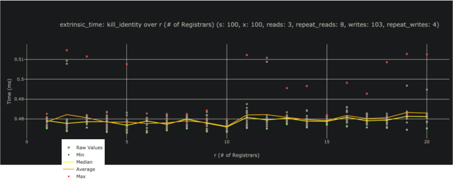

Notes:

Source of graph: https://www.shawntabrizi.com/substrate-graph-benchmarks/old/

---

## Results: Extrinsic Time vs. # of Sub-Accounts

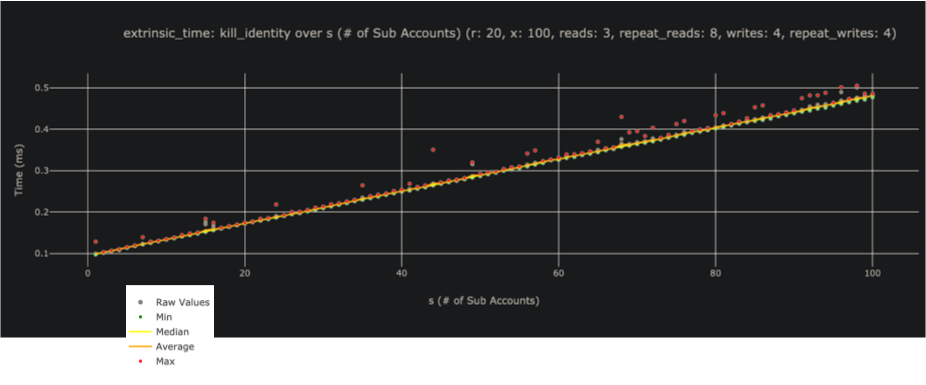

Notes:

Source of graph: https://www.shawntabrizi.com/substrate-graph-benchmarks/old/

---

## Results: Extrinsic Time vs. Additional Fields

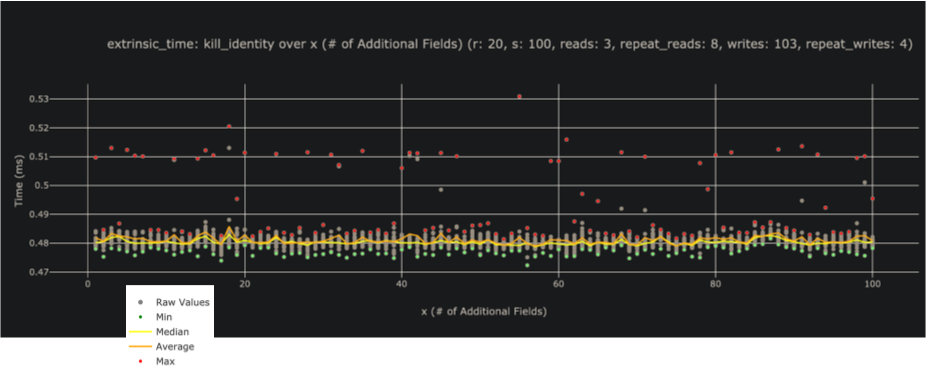

Notes:

Source of graph: https://www.shawntabrizi.com/substrate-graph-benchmarks/old/

---

## Result: DB Operations vs. Sub Accounts

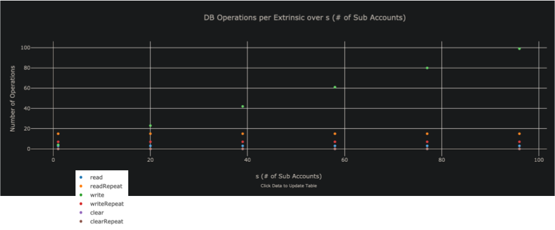

Notes:

Source of graph: https://www.shawntabrizi.com/substrate-graph-benchmarks/old/

---

## Final Weight

```rust
// Storage: Identity SubsOf (r:1 w:1)
// Storage: Identity IdentityOf (r:1 w:1)
// Storage: System Account (r:1 w:1)
// Storage: Identity SuperOf (r:0 w:100)
/// The range of component `r` is `[1, 20]`.
/// The range of component `s` is `[0, 100]`.
/// The range of component `x` is `[0, 100]`.
fn kill_identity(r: u32, s: u32, x: u32, ) -> Weight {
	// Minimum execution time: 68_794 nanoseconds.
	Weight::from_parts(6_000_000, 1554)
		// Standard Error: 4_808
		.saturating_add(Weight::from_parts(153_462, 0).saturating_mul(r as u64))
		// Standard Error: 939
		.saturating_add(Weight::from_parts(1_084_612, 0).saturating_mul(s as u64))
		// Standard Error: 939
		.saturating_add(Weight::from_parts(170_112, 0).saturating_mul(x as u64))
		.saturating_add(T::DbWeight::get().reads(3 as u64))
		.saturating_add(T::DbWeight::get().writes(3 as u64))
		.saturating_add(T::DbWeight::get().writes((1 as u64).saturating_mul(s as u64)))
}
```

---

## WeightInfo Generation

```rust
/// Weight functions needed for pallet_identity.
pub trait WeightInfo {
	fn add_registrar(r: u32, ) -> Weight;
	fn set_identity(r: u32, x: u32, ) -> Weight;
	fn set_subs_new(s: u32, ) -> Weight;
	fn set_subs_old(p: u32, ) -> Weight;
	fn clear_identity(r: u32, s: u32, x: u32, ) -> Weight;
	fn request_judgement(r: u32, x: u32, ) -> Weight;
	fn cancel_request(r: u32, x: u32, ) -> Weight;
	fn set_fee(r: u32, ) -> Weight;
	fn set_account_id(r: u32, ) -> Weight;
	fn set_fields(r: u32, ) -> Weight;
	fn provide_judgement(r: u32, x: u32, ) -> Weight;
	fn kill_identity(r: u32, s: u32, x: u32, ) -> Weight;
	fn add_sub(s: u32, ) -> Weight;
	fn rename_sub(s: u32, ) -> Weight;
	fn remove_sub(s: u32, ) -> Weight;
	fn quit_sub(s: u32, ) -> Weight;
}
```

---

## WeightInfo Integration

```rust
#[pallet::weight(T::WeightInfo::kill_identity(
	T::MaxRegistrars::get(), // R
	T::MaxSubAccounts::get(), // S
	T::MaxAdditionalFields::get(), // X
))]
pub fn kill_identity(
	origin: OriginFor<T>,
	target: AccountIdLookupOf<T>,
) -> DispatchResultWithPostInfo {

	// -- snip --

	Ok(Some(T::WeightInfo::kill_identity(
		id.judgements.len() as u32,      // R
		sub_ids.len() as u32,            // S
		id.info.additional.len() as u32, // X
	))
	.into())
}
```

---

## Initial Weight

```rust
#[pallet::weight(T::WeightInfo::kill_identity(
	T::MaxRegistrars::get(), // R
	T::MaxSubAccounts::get(), // S
	T::MaxAdditionalFields::get(), // X
))]
```

- Use the WeightInfo function as the weight definition for your function.
- Note that we assume absolute worst case scenario to begin since we cannot know these specific values until we query storage.

---

## Final Weight (Refund)

```rust
pub fn kill_identity(...) -> DispatchResultWithPostInfo { ... }
```

```rust
Ok(Some(T::WeightInfo::kill_identity(
	id.judgements.len() as u32,      // R
	sub_ids.len() as u32,            // S
	id.info.additional.len() as u32, // X
))
.into())
```

- Then we return the actual weight used at the end!
- We use the same WeightInfo formula, but using the values that we queried from storage as part of executing the extrinsic.
- This only allows you to **decrease** the final weight. Nothing will happen if you return a bigger weight than the initial weight.

---

<!-- .slide: data-background-color="#4A2439" -->

# Questions

In another presentation we will cover some of the things we learned while benchmarking, and best practices.

---

# Benchmarking Exercise

---

# FRAME Benchmarking

## Lesson 2

---

## Overview

- Databases
- Our Learnings Throughout Development
- Best Practices and Common Patterns

---

# Databases

---

### RocksDB

A Persistent Key-Value Store for Flash and RAM Storage.

- Keys and values are arbitrary byte arrays.
- Fast for a general database.

See http://rocksdb.org/.

Big project, can be very tricky to configure properly.

Notes:

(also a big part of substrate compilation time).

---

### ParityDB

An Embedded Persistent Key-Value Store Optimized for Blockchain Applications.

- Keys and values are arbitrary byte arrays.
- Designed for efficiently storing Patricia-Merkle trie nodes.
  - Mostly Fixed Size Keys.
  - Mostly Small Values.
  - Uniform Distribution.
- Optimized for read performance.

Notes:

See: https://github.com/paritytech/parity-db/issues/82

Main point is that paritydb suit the triedb model.
Indeed triedb store encoded key by their hash.
So we don't need rocksdb indexing, no need to order data.
Parity db index its content by hash of key (by default), which makes access faster (hitting entry of two file generally instead of possibly multiple btree indexing node).
Iteration on state value is done over the trie structure: having a KVDB with iteration support isn't needed.

Both rocksdb and paritydb uses "Transactions" as "writes done in batches".
We typically run a transaction per block (all in memory before), things are fast (that's probably what you meant).
In blockchains, writes are typically performed in large batches, when the new block is imported and must be done atomically.
See: https://github.com/paritytech/parity-db

Concurrency does not matter in this, paritydb lock access to single writer (no concurrency).
Similarly code strive at being simple and avoid redundant feature: no cache in parity db (there is plenty in substrate).

'Quick commit' : all changes are stored in memory on commit , and actual writing in the WriteAheadLog is done in an asynchronous way.

TODO merge with content from https://github.com/paritytech/parity-db/issues/82

---

### ParityDB: Probing Hash Table

ParityDB is implemented as a probing hash table.

- As opposed to a log-structured merge (LSM) tree.
  - Used in Apache AsterixDB, Bigtable, HBase, LevelDB, Apache Accumulo, SQLite4, Tarantool, RocksDB, WiredTiger, Apache Cassandra, InfluxDB, ScyllaDB, etc...
- Because we do not require key ordering or iterations for trie operations.
- This means read performance is constant time, versus $O(\log{n})$.

---

### ParityDB: Fixed Size Value Tables

- Each column stores data in a set of 256 value tables, with 255 tables containing entries of certain size range up to 32 KB limit.

<div class="text-smaller">

```rust
const SIZES: [u16; SIZE_TIERS - 1] = [
	32, 33, 34, 35, 36, 37, 38, 39, 40, 41, 42, 43, 44, 46, 47, 48, 50, 51, 52, 54, 55, 57, 58, 60,
	62, 63, 65, 67, 69, 71, 73, 75, 77, 79, 81, 83, 85, 88, 90, 93, 95, 98, 101, 103, 106, 109,
	112, 115, 119, 122, 125, 129, 132, 136, 140, 144, 148, 152, 156, 160, 165, 169, 174, 179, 183,
	189, 194, 199, 205, 210, 216, 222, 228, 235, 241, 248, 255, 262, 269, 276, 284, 292, 300, 308,
	317, 325, 334, 344, 353, 363, 373, 383, 394, 405, 416, 428, 439, 452, 464, 477, 490, 504, 518,
	532, 547, 562, 577, 593, 610, 627, 644, 662, 680, 699, 718, 738, 758, 779, 801, 823, 846, 869,
	893, 918, 943, 969, 996, 1024, 1052, 1081, 1111, 1142, 1174, 1206, 1239, 1274, 1309, 1345,
	1382, 1421, 1460, 1500, 1542, 1584, 1628, 1673, 1720, 1767, 1816, 1866, 1918, 1971, 2025, 2082,
	2139, 2198, 2259, 2322, 2386, 2452, 2520, 2589, 2661, 2735, 2810, 2888, 2968, 3050, 3134, 3221,
	3310, 3402, 3496, 3593, 3692, 3794, 3899, 4007, 4118, 4232, 4349, 4469, 4593, 4720, 4850, 4984,
	5122, 5264, 5410, 5559, 5713, 5871, 6034, 6200, 6372, 6548, 6729, 6916, 7107, 7303, 7506, 7713,
	7927, 8146, 8371, 8603, 8841, 9085, 9337, 9595, 9860, 10133, 10413, 10702, 10998, 11302, 11614,
	11936, 12266, 12605, 12954, 13312, 13681, 14059, 14448, 14848, 15258, 15681, 16114, 16560,
	17018, 17489, 17973, 18470, 18981, 19506, 20046, 20600, 21170, 21756, 22358, 22976, 23612,
	24265, 24936, 25626, 26335, 27064, 27812, 28582, 29372, 30185, 31020, 31878, 32760,
];
```

</div>

- The last 256th value table size stores entries that are over 32 KB split into multiple parts.

---

### ParityDB: Fixed Size Value Tables

- More than 99% of trie nodes are less than 32kb in size.
- Small values only require 2 reads: One index lookup and one value table lookup.
- Values over 32kb may require multiple value table reads, but these are rare.
- Helps minimize unused disk space.
- For example, if you store a 670 byte value, it won't fit into 662 bucket, but will into 680 bucket, wasting only 10 bytes of space.

Notes:

That fact that most values are small allows us to address each value by its index and have a simple mechanism for reusing the space of deleted values without fragmentation and periodic garbage collection.

---

### ParityDB: Asynchronous Writes

- Parity DB API exposes synchronous functions, but underlying IO is async.
- The `commit` function adds the database transaction to the write queue, updates the commit overlay, and returns as quickly as possible.
- The actual writing happens in the background.
- The commit overlay allows the block import pipeline to start executing the next block while the database is still writing changes for the previous block.

---

### Practical Benchmarks and Considerations

Let's now step away from concepts and talk about cold hard data.

---

### Common Runtime Data Size and Performance

<br/>

<div class="flex-container">
<div class="left">

- Most runtime values are 80 bytes, which are user accounts.
- Of course, this would depend on your chain's logic.

</div>
<div class="right" style="padding-left: 10px;">

<div class="r-stack">
	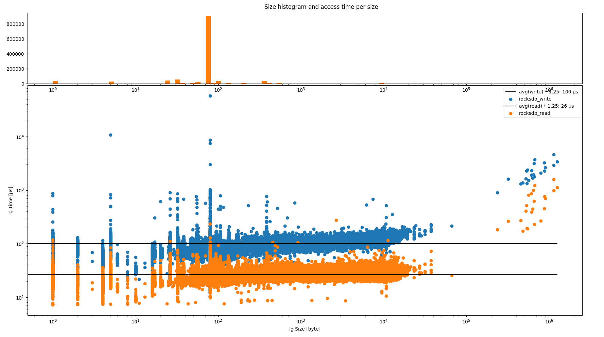
	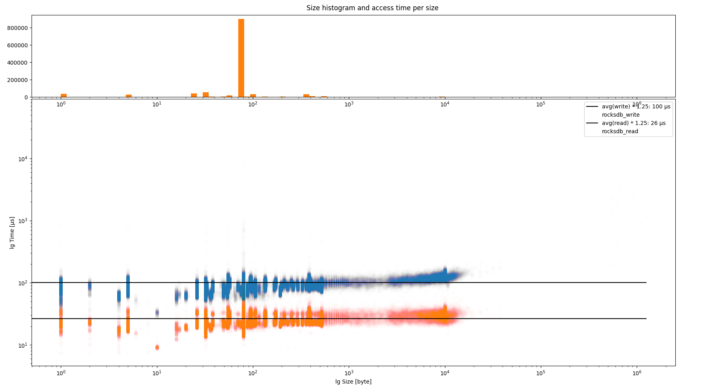
</div>
</div>

Notes:

Impact of keys size is slightly bigger encoded node.
Since eth scaling issue, we usually focus on state nodes.
Other content access can be interesting to audit enhance though (with paritydb).

See more details here:

https://substrate.stackexchange.com/questions/525/how-expensive-is-it-to-access-storage-items/526#526

---

### RocksDB vs ParityDB Performance

At 32 KB, performance decreases for each additional 4 KB.

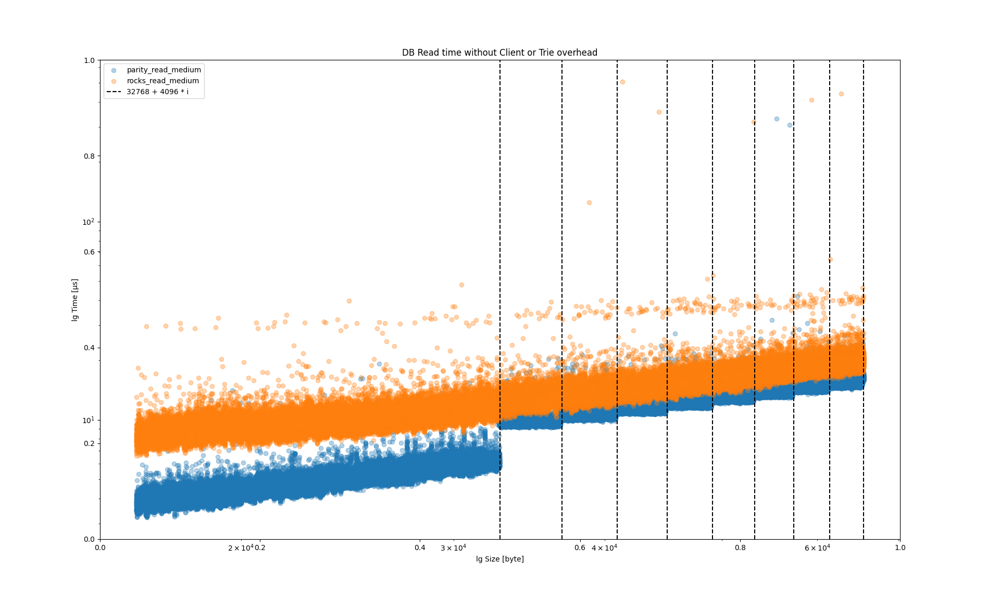

---

### RocksDB Inconsistency


When doing benchmarking, we saw some really bizarre, but reproducible problems with RocksDB.

---

## Things we tried

## Things we learned

---

## Isolating DB Benchmarks (PR #5586)

<pba-cols>
<pba-col>

### We tried…

To benchmark the entire extrinsic, including the weight of DB operations directly in the benchmark. We wanted to:

- Populate the DB to be “full”
- Flush the DB cache
- Run the benchmark

</pba-col>
<pba-col>

### We learned…

RocksDB was too inconsistent to give reproducible results, and really slow to populate.
So we use an in-memory DB for benchmarking.


</pba-col>
</pba-cols>

---

## Fixing Nonlinear Events (PR #5795)

<pba-cols>
<pba-col>

### We tried…

Executing a whole block, increasing the number of txs in each block. We expected to get linear growth of execution time, but in fact it was superlinear!

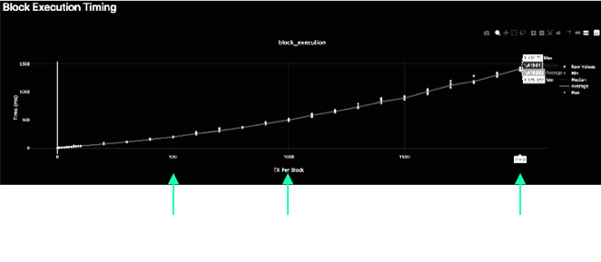

</pba-col>
<pba-col>

### We learned…

Each time we appended a new event, we were passing the growing event object over the Wasm barrier.

We updated the append api so only new data is pushed.

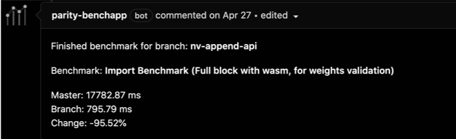

</pba-col>
</pba-cols>

---

## Enabling Weight Refunds (PR #5584)

<pba-cols>
<pba-col>

### We tried…

To assign weights to all extrinsics for the absolute worst case scenario in order to be safe.

In many cases, we cannot know accurately what the weight of the extrinsic will be without reading storage… and this is not allowed!

</pba-col>
<pba-col>

### We learned…

That many extrinsics have a worst case weight much different than their average weight.

So we allow extrinsics to return the actual weight consumed and refund that weight and any weight fees.

</pba-col>
</pba-cols>

---

## Customizable Weight Info (PR #6575)

<pba-cols>
<pba-col>

### We tried…

To record weight information and benchmarking results directly in the pallet.

</pba-col>
<pba-col>

### We learned…

This was hard to update, not customizable, and not accurate for custom pallet configurations.

</pba-col>
</pba-cols>

So we moved the weight definition into customizable associated types configured in the runtime trait.

```rust
#[weight = 45_000_000 + T::DbWeight::get().reads_writes(1,1)]
```

turned into...

```rust
#[weight = T::WeightInfo::transfer()]
```

---

## Inherited Call Weight Syntax (PR #13932)

```rust
#[pallet::call(weight(<T as Config>::WeightInfo))]
impl<T: Config> Pallet<T> {

	pub fn create(
		...
```

---

## Custom Benchmark Returns / Errors (PR #9517)

```rust
override_benchmark {
	let b in 1 .. 1000;
	let caller = account::<T::AccountId>("caller", 0, 0);
}: {
	Err(BenchmarkError::Override(
		BenchmarkResult {
			extrinsic_time: 1_234_567_890,
			reads: 1337,
			writes: 420,
			..Default::default()
		}
	))?;
}
```

---

## Negative Y Intercept Handling (PR #11806)

---

## Multi-Dimensional Weight (Issue #12176)

```rust
#[derive(
	Encode, Decode, MaxEncodedLen, TypeInfo, Eq, PartialEq, Copy, Clone, RuntimeDebug, Default,
)]
#[cfg_attr(feature = "serde", derive(Serialize, Deserialize))]
pub struct Weight {
	#[codec(compact)]
	/// The weight of computational time used based on some reference hardware.
	ref_time: u64,
	#[codec(compact)]
	/// The weight of storage space used by proof of validity.
	proof_size: u64,
}
```

---

# Best Practices & Common Patterns

---

## Initial Weight Calculation Must Be Lightweight

- In the TX queue, we need to know the weight to see if it would fit in the block.
- This weight calculation must be lightweight!
- No storage reads!

Example:

- Transfer Base: ~50 µs
- Storage Read: ~25 µs

---

## Set Bounds and Assume the Worst!

- Add a configuration trait that sets an upper bound to some item, and in weights, initially assume this worst case scenario.
- During the extrinsic, find the actual length/size of the item, and refund the weight to be the actual amount used.

---

## Separate Benchmarks Per Logical Path

- It may not be clear which logical path in a function is the “worst case scenario”.
- Create a benchmark for each logical path your function could take.
- Ensure each benchmark is testing the worst case scenario of that path.

---

## Comparison Operators in the Weight Definition

```rust
#[pallet::weight(
   T::WeightInfo::path_a()
   .max(T::WeightInfo::path_b())
   .max(T::WeightInfo::path_c())
)]
```

---

## Keep Extrinsics Simple

- The more complex your extrinsic logic, the harder it will be to accurately weigh.
- This leads to larger up-front weights, potentially higher tx fees, and less efficient block packing.

---

## Use Multiple Simple Extrinsics

- Take advantage of UI/UX, batch calls, and similar downstream tools to simplify extrinsic logic.

Example:

- Vote and Close Vote (“last vote”) are separate extrinsics.

---

## Minimize Usage of On Finalize

- `on_finalize` is the last thing to happen in a block, and must execute for the block to be successful.
- Variable weight needs at can lead to overweight blocks.

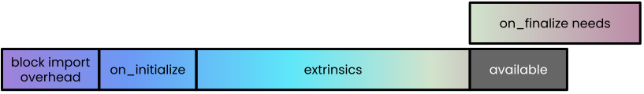

---

## Transition Logic and Weights to On Initialize

- `on_initialize` happens at the beginning of the block, before extrinsics.
- The number of extrinsics can be adjusted to support what is available.
- Weight for `on_finalize` should be wrapped into on_initialize weight or extrinsic weight.

---

## Understand Limitations of Pallet Hooks

- A powerful feature of Substrate is to allow the runtime configuration to implement pallet configuration traits.
- However, it is easy for this feature to be abused and make benchmarking inaccurate.

---

## Keep Hooks Constant Time

- Example: Balances hook for account creation and account killed.
- Benchmarking has no idea how to properly set up your state to test for any arbitrary hook.
- So you must keep hooks constant time, unless specified by the pallet otherwise.

---

<!-- .slide: data-background-color="#4A2439" -->

# Questions
