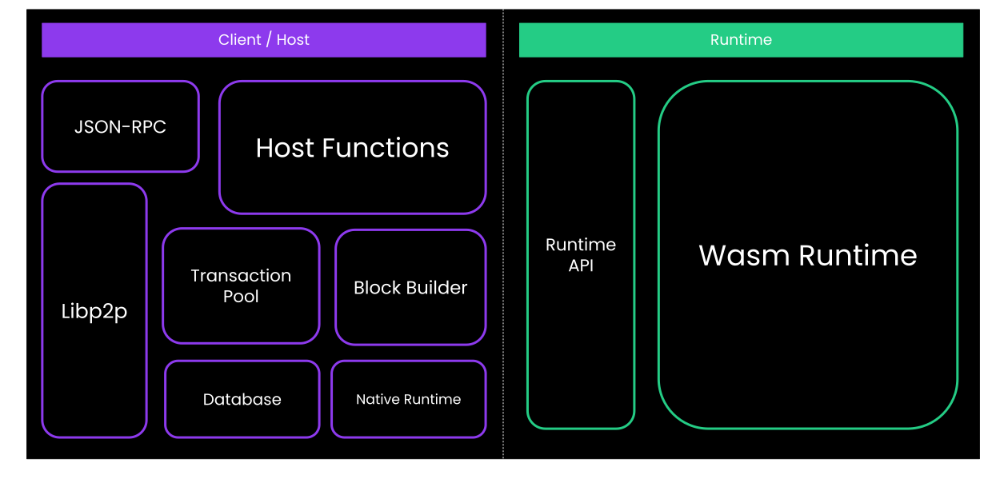

# FRAME Deep Dive

---v

## Agenda

Recall the following figure:



Notes:

Without frame, there is the runtime and there is the client, and an API that sits in between.

---v

## Agenda

By the end of this lecture, you will fully understand this figure.


---

## Expanding A Pallet

- Grab a simple pallet code, and expand it.

- `Pallet` implements the transactions as public functions.
- `Pallet` implements `Hooks`, and some equivalents like `OnInitialize`.
- `enum Call` that has in itself is just an encoding of the transaction's data

- and implements `UnfilteredDispatchable` (which just forward the call back to `Pallet`)

---v

### Expanding A Pallet

- Make sure you understand why these 3 are the same!

```rust
let origin = ..;

// function call
Pallet::<T>::set_value(origin, 10);

// dispatch
Call::<T>::set_value(10).dispatch_bypass_filter(origin);

// fully qualified syntax.
<Call<T> as UnfilteredDispatch>::dispatch_bypass_filter(Call::<T>::set_value(10), origin);
```

---

## `construct_runtime!` and Runtime Amalgamator.

- Now, let's look at a minimal runtime amalgamator.

---v

### `construct_runtime!` and Runtime Amalgamator.

- struct `Runtime`
- implements the `Config` trait of all pallets.
- implements all of the runtime APIs as functions.
- `type System`, `type SimplePallet`.
- `AllPalletsWithSystem` etc.
  - and recall that all pallets implement things like `Hooks`, `OnInitialize`, and all of these traits are tuple-able.
- enum `RuntimeCall`
- enum `RuntimeEvent`, `GenesisConfig`, etc. but we don't have them here.

---

## Executive

- This part is somewhat optional to know in advance, but I want you to re-visit it in a week and then understand it all.

- I present to you, Executive struct:

```rust
pub struct Executive<
  System,
  Block,
  Context,
  UnsignedValidator,
  AllPalletsWithSystem,
  OnRuntimeUpgrade = (),
>(..);
```

---v

#### Expanding The Generic Types.

```rust
impl<
    // System config, we know this now.
    System: frame_system::Config,
    // The block type.
    Block: sp_runtime::traits::Block<Header = System::Header, Hash = System::Hash>,
    // Something that has all the hooks. We don't know anything else about pallets here.
    AllPalletsWithSystem: OnRuntimeUpgrade
      + OnInitialize<System::BlockNumber>
      + OnIdle<System::BlockNumber>
      + OnFinalize<System::BlockNumber>
      + OffchainWorker<System::BlockNumber>,
    COnRuntimeUpgrade: OnRuntimeUpgrade,
  > Executive<System, Block, Context, UnsignedValidator, AllPalletsWithSystem, COnRuntimeUpgrade>
where
  // This is the juicy party, and we have to learn more sp_runtime traits to follow.
  Block::Extrinsic: Checkable,
  <Block::Extrinsic as Checkable>::Checked: Applyable
  <<Block::Extrinsic as Checkable>::Checked as Applyable>::Call: Dispatchable<_>,
{...}
```

---v

#### `Block::Extrinsic: Checkable`

- Who implements `Checkable`?
- That's right, the `generic::UncheckedExtrinsic` that we indeed used as `Block::Extrinsic` in the
  top level runtime. Recall:

```rust
type UncheckedExtrinsic = generic::UncheckedExtrinsic<_, _, _, _>;
type Header = ..
type Block = generic::Block<Header, UncheckedExtrinsic>;
type Executive = frame_executive::Executive<_, Block, ...>;
```

---v

#### What Does `Checkable<_>` Do?

- Signature verification!

```rust
impl Checkable<_> for UncheckedExtrinsic<_, _, _, _> {
  // this is the output type.
  type Checked = CheckedExtrinsic<AccountId, Call, Extra>;

  fn check(self, lookup: &Lookup) -> Result<Self::Checked, TransactionValidityError> {
    ..
  }
}
```

---v

#### `<Block::Extrinsic as Checkable>::Checked: Applyable`

- `UncheckedExtrinsic::Checked` is `CheckedExtrinsic`.
- And it surely does implement `Applyable`.

---v

#### What Does `Applyable<_>` Do?

- TLDR: `Ok(self.call.dispatch(maybe_who.into()))`

---v

#### Lastly: `<<Block::Extrinsic as Checkable>::Checked as Applyable>::Call: Dispatchable`

- And guess who implemented `Dispatchable`, which we already looked at!
- The `enum Call` that we had in our expanded file!

---v

### Circling Back..

So, to recap:

```rust
struct Runtime;

impl frame_system::Config for Runtime {}
impl simple_pallet::Config for Runtime {}

enum Call {
  System(frame_system::Call<Runtime>),
  SimplePallet(simple_pallet::Call<Runtime>),
}

impl Dispatchable for Call {
  fn dispatch(self, origin: _) -> Result<_, _> {
    match self {
      Call::System(system_call) => system_call.dispatch(),
      Call::SimplePallet(simple_pallet_call) => system_pallet_call.dispatch(),
    }
  }
}

struct UncheckedExtrinsic {
  function: Call,
  signature: Option<_>,
}

type Executive = Executive<_, UncheckedExtrinsic, ...>;

//
let unchecked = UncheckedExtrinsic::new();
let checked = unchecked.check();
let _ = checked.apply();
```
