# Introduction to Substrate

---

## What is Substrate?

Substrate is a **Rust framework** for **building blockchains**.

Note:

like a blockchain making factory.

---v

### Why Substrate?


Notes:

Highlight the multi-chain part.

---v

### Why Substrate?

- ⛓️ Future is multi-chain.
- 😭 Building a blockchain is hard. Upgrading it even harder.
<!-- .element: class="fragment" -->
- 💡 Framework!
<!-- .element: class="fragment" -->

---v

### Why Substrate?


Notes:

Substrate is a pure technological investment against chain maximalism, even outside of Polkadot. You
can create sovereign chains with substrate, or Polkadot Parachains, or more hybrid things. More on
this when you learn about Substrate's role in the Polkadot ecosystem.

Figure: https://www.youtube.com/watch?v=0IoUZdDi5Is

---v

### Why Substrate?

#### 💭 An update in 2024 💭

🧐 Multi-chain vs. Multi-shard 🧐

Note:

Polkadot led the way since 2016 to convince the world that the future is multi-chain.

Cosmos tried to replicate the same without shared security.

ETH is now doing something similar, with a Rollup-Centric roadmap.

Interestingly, Polkadot is now arguing that the future is not necessarily multi-chain, but rather
multi-shard. In that, there needs to be a sharded system, with a high degree of flexibility to
schedule those shards. "Multi-chain" is merely one manifestation of a multi-shard system, which is
actually not so flexible. We are now striving to make the multi-chain Polkadot more flexible, which
is what JAM is going to be.

---

## Core Philosophies of Substrate 💭

The **pre-substrate** way of thinking:

- 😭 _Building a blockchain is hard. Upgrading it even harder_.
- 💪🏻 We are going to spend maximal resources at making sure we get it right.
<!-- .element: class="fragment" -->

---v

### Core Philosophies of Substrate 💭

But has this worked?

- 😭 Bitcoin block size debate
<!-- .element: class="fragment" -->
- 2️⃣ L2s and beyond
<!-- .element: class="fragment" -->
- 📈 Ethereum gas price
<!-- .element: class="fragment" -->

Notes:

Bitcoin block size has never been and is an ongoing debate.

I am not against L2s per se, but it is truth that they mostly exist because the underlying protocol
is too hard/slow to upgrade itself. ETH Gas prices is also shows that the underlying protocol cannot
meet the demands of today.

https://en.wikipedia.org/wiki/Bitcoin_scalability_problem
https://ycharts.com/indicators/ethereum_average_gas_price

It is interesting to checkout some projects that are now trying to be "Substrate for L2s":
https://github.com/Sovereign-Labs/sovereign-sdk / https://arbitrum.io/orbit

---v

### Core Philosophies of Substrate 💭

The **Substrate** way of thinking:

- ☯️ Society and technology evolve
<!-- .element: class="fragment" -->
- 🦸 Humans are fallible
<!-- .element: class="fragment" -->
- 🧠 Best decision of today -> mistake of tomorrow
<!-- .element: class="fragment" -->

---v

### Core Philosophies of Substrate 💭

Outcomes of this:

- 🦀 Rust
- 🤩 Generic, Modular and Extensible Design
- 🏦 Governance + Upgradeability

Notes:

Think about how each of these links back to "whatever you decide today will be a mistake soon".

---

## 🦀 Rust

- First line of defense: prevent human error when possible.
- Safe language, no memory safety issues.

Notes:

So at least we don't want to deal with human error, and only deal with the fact that we cannot
predict the future.

Memory safety is a fundamental issue in most major system-level programming languages.

Some such mistakes are impossible to make in Rust.

---v

### 🦀 Rust

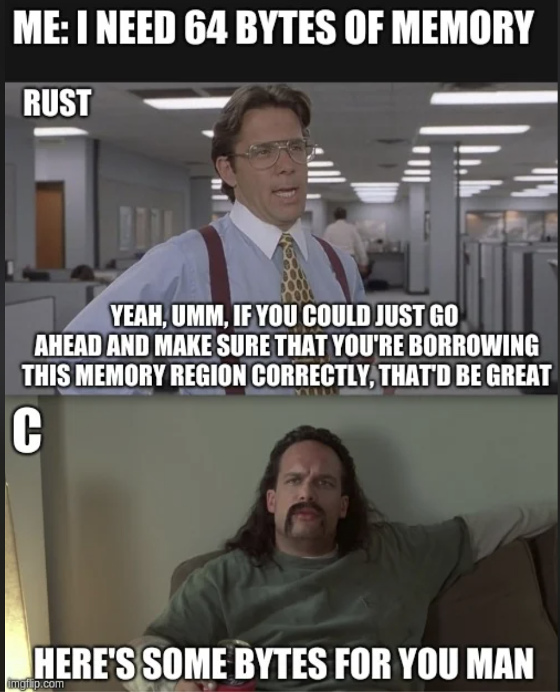

Note:

```c
int main() {
    int* x = malloc(sizeof(int));
    *x = 10;
    int* y = x;
    free(x);
    printf("%d\n", *y);  // Accessing memory after it's been freed
}
```

<br/>

```rust
fn main() {
    let x = Box::new(10);
    let y = x;
    println!("{}", *y); // ❌
}
```

<!-- .element: class="fragment" -->

Notes:

another one:

```c
int* foo() {
    int x = 10;
    return &x;
}

int main() {
    int* y = foo();
    printf("%d\n", *y); // Accessing memory out of its scope
}

```

<br/>

```rust
fn foo() -> &'static i32 {
    let x = 10;
    &x
}

fn main() {
    let y = foo();
    println!("{}", y); // ❌
}
```

---v

### 🦀 Rust

> Microsoft and Google have each stated that software memory safety issues are behind around 70 percent of their vulnerabilities.

Notes:

https://www.nsa.gov/Press-Room/News-Highlights/Article/Article/3215760/nsa-releases-guidance-on-how-to-protect-against-software-memory-safety-issues/#:~:text=Microsoft%20and%20Google%20have%20each,70%20percent%20of%20their%20vulnerabilities.

---v

### 🦀 Rust

- 🏎️ Most Rust abstractions are **zero-cost**.
- ⏰ Rust has (almost) no "runtime".

<br/>

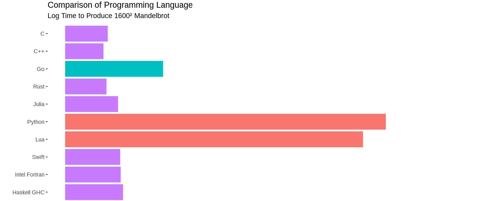

Notes:

this is not 100% accurate though, rust has a small runtime that is the panic handler etc. Rust for Rustacean's chapter on `no_std` covers this very well.

Also, this is a good time to talk about how we use "Runtime" in a different way.

---

## 🤩 Generic, Modular and Extensible Design

- Second line of defense.
- Whatever code we write is (thanks to Rust) perfectly executed, _but what should we write_?

Notes:

this is where a module, generic design is useful. You can change components easily based on the
needs of the future.

---v

### 🤩 Generic, Modular and Extensible Design

- Multiple consensus engines (BABE/Grandpa/AURA/PoW/Sassafras)
<!-- .element: class="fragment" -->
- Multiple network protocols (QUIC, TCP)
<!-- .element: class="fragment" -->
- Multiple database implementations (ParityDB, RocksDB)
<!-- .element: class="fragment" -->
- Highly configurable, graph-based transaction-pool.
<!-- .element: class="fragment" -->
- Easy to change primitives: AccountId, Signature, BlockNumber, Header, Hash, and many more.
<!-- .element: class="fragment" -->

Notes:

FRAME takes this even multiple steps further, but that's for later.

These are all examples of being generic, modular and extensible at the Substrate level. FRAME takes
these even further, but more on that later.

---v

### 🤩 Generic, Modular and Extensible Design

- **AlephZero**: Custom finality, DAG-based, 1s block time.
- **Moonbeam**: Ethereum compatible, build with substrate.
- **HydraDX**: Custom transaction pool logic to match DEX orders.
- **Kulupu**: Proof of work, custom hashing.

Notes:

Substrate has been coded, from the ground up, such that it is easy to have multiple implementations
for certain functions. Heavy use of traits and generics is the key to achieve this. As noted,
Substrate has a lot of APIs, and optional implementations. You are bound to the API, but not the
particular implementation.

---

## 🏦 Governance + Upgradeability

- Third, final, and non-negotiable line of defense to survive the test of time.

---v

### 🏦 Governance + Upgradeability

- We have correct code, and components are easy to swap, replace, and upgrade.
- What use is that, if we cannot agree on what to replace/upgrade?
- Governance!

Notes:

Even if we are governable, but we still need "trust" to enact the upgrade, it is hardly any better.
In essence, if an upgrade mechanism is not self-enacting, it might as well just reside offchain and
be a signaling mechanism.

---v

### 🏦 Governance + Upgradeability

- ✅ Governance: Easy
- 😢 (Trustless) Upgradeability: Not so much

---v

### 🏦 Governance + Upgradeability

- How does a typical blockchain upgrade itself?

Notes:

1. Discussion, offchain signaling
2. Possibly onchain voting
3. Hard(ish) Fork

---v

### 🏦 Governance + Upgradeability


---v

### 🏦 Governance + Upgradeability


Notes:

the problem is that the system is one big monolith protocol. Updating any part of it requires the
whole thing to be updated.

---v

### 🏦 Governance + Upgradeability

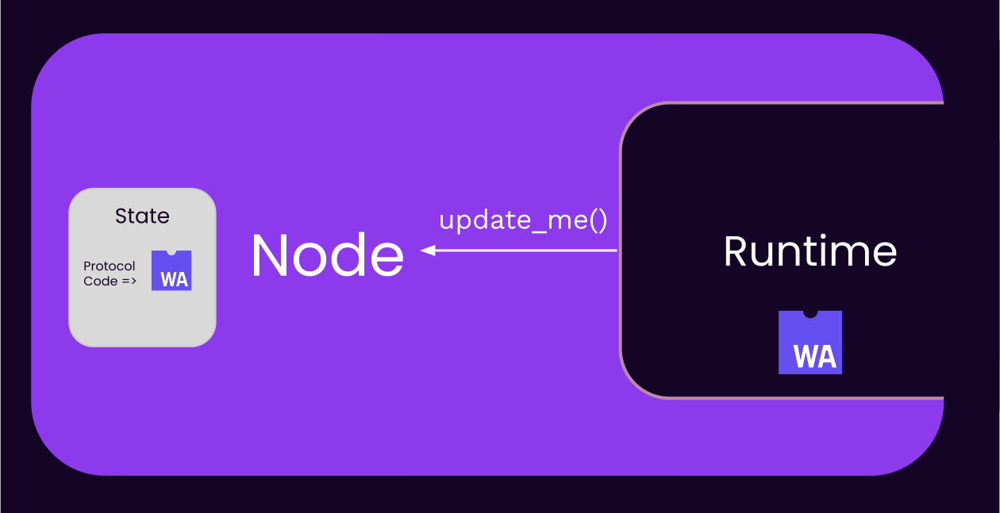

Note:

This is very similar to treating your own runtime as a smart contract.

---v

### 🏦 Governance + Upgradeability


Note:

In this figure, the meta-protocol, the substrate node, is not forklessly upgrade-able. It can only
be upgraded with a fork.

---v

### 🏦 Governance + Upgradeability

_The way to make a protocol truly upgradeable is to design a (fixed) meta-protocol._

---

## Substrate Architecture


---v

#### Substrate (simplified) Architecture

<pba-cols>

<pba-col center>
<h3 style="color: var(--substrate-runtime); top: 0"> Runtime (Protocol) </h3>

- Application logic aka. How we execute block
- Stored as a part of your chain state as a WASM Blob
- Upgradeable
- Also known as: STF

</pba-col>

<pba-col center>


</pba-col>
</pba-cols>

---v

#### Substrate (simplified) Architecture

<pba-cols>
<pba-col center>
<h3 style="color: var(--substrate-host); top: 0"> Fixed Node (Meta-protocol) </h3>

- Native Binary
- Executes the Wasm runtime
- Everything else: Database, Networking, Mempool, Consensus..
- Also known as: Host, Client

</pba-col>

<pba-col center>


</pba-col>

</pba-cols>

---

## Core Substrate Philosophies

\*For a system to survive the **test of time\***:

0. Correct and Safe
1. Generic
2. Governable
3. Trust-less-ly Upgradeable.

Substrate's Wasm meta-protocol exactly enables the latest ✅

<!-- .element: class="fragment" -->

Notes:

Question: how would you put the meta-protocol of Substrate into words?

The node is basically a wasm meta-protocol that does only one thing. This meta-protocol is
hardcoded, but the protocol itself is flexible.

---v

## Core Substrate Philosophies

- Why all this complexity? 😵‍💫😵‍💫


Note:

- Don't care about a timeless system -> Substrate is not the right tool
- Don't care about a truly resilient platform -> Polkadot is not the right platform

---

## Positive Consequences of _Wasm_ Runtime 🔥

---v

### 🤖 Deterministic Execution

- Portable, yet deterministic bytecode.

Notes:

Wasm's instruction set is deterministic, so all good.

---v

### 🧱 Sandboxing

- Useful when executing untrusted code.

1. Smart contracts
2. Parachain runtime

Notes:

how can we guarantee that neither enter an infinite loop, or try to access the filesystem?

---v

### 🌈 Easier (light)Node Development

Notes:

for the case of node, your node only needs to implement the host/client, and NOT re-implement the
business logic.

Simply compare the process to create an alternative node for Ethereum, where you need to
re-implement the EVM.

Same applies to light node, as they do not need to deal with the state transition function.

---v

### 😎 Forkless Upgrade

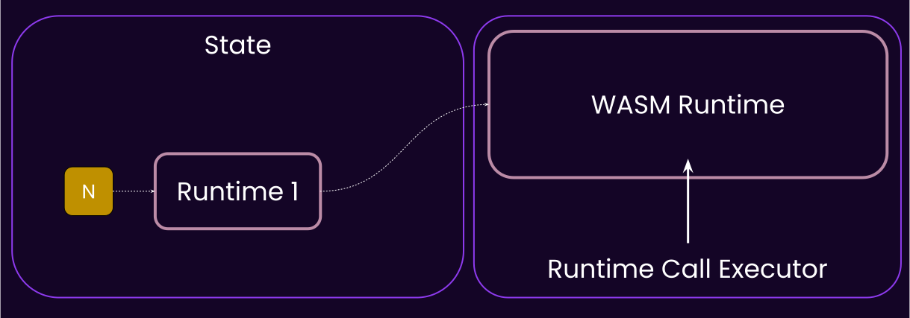

---v

### 😎 Forkless Upgrade


---v

### 😎 Forkless Upgrade

This update was:

1. Forkless
2. Self-enacting

Notes:

take a moment to establish that this upgrade is forkless. The runtime is upgraded, but the node is
not. In fact, the node didn't need to know about this at all.

This is what the meta-protocol achieves.

---

## Negative Consequences of _Wasm_ Runtime

---v

### 😩 Constrained Resources

👾 memory, speed, host access

Notes:

- 4GB of memory, which we limit even further.
- Wasm has no allocator+panic handler of its own
- Can be slower than native, depending on the executor/execution method.
- Limited access to the host host env, all needs to be done through syscalls.

---v

### 🌈 Node diversification != runtime diversification

Notes:

Less state-transition diversification, because the runtime is the same for all clients. If there a
bug in it, everyone is affected.
---v

### 🔄 Metering

- Is not so great in WASM...
- New experimental work on PolkaVM, based on RiscV.

Notes:

It is possible to meter wasm, but it has overhead, and it is still not perfect. Goes back to the instruction set being relatively large.

Both of the following are amazing reads:

https://forum.polkadot.network/t/eliminating-pre-dispatch-weight/400

https://forum.polkadot.network/t/announcing-polkavm-a-new-risc-v-based-vm-for-smart-contracts-and-possibly-more/3811/32

---

## Communication Paths


---v

### Communication Paths


---v

### Example: SCALE vs JSON

- SCALE is an efficient, non-descriptive, binary encoding format, used EXTENSIVELY in the Substrate ecosystem.

---v

### Example: SCALE vs JSON

<div class="flex-container text-smaller">
<div class="left">

```rust
use parity_scale_codec::{ Encode };

#[derive(Encode)]
struct Example {
	number: u8,
	is_cool: bool,
	optional: Option<u32>,
}

fn main() {
	let my_struct = Example {
		number: 42,
		is_cool: true,
		optional: Some(69),
	};
	println!("{:?}", my_struct.encode());
	println!("{:?}", my_struct.encode().len());
}
```

```sh
[42, 1, 1, 69, 0, 0, 0]
7
```

</div>
<div class="right" style="margin-left: 10px;">

```rust
use serde::{ Serialize };

#[derive(Serialize)]
struct Example {
	number: u8,
	is_cool: bool,
	optional: Option<u32>,
}

fn main() {
	let my_struct = Example {
		number: 42,
		is_cool: true,
		optional: Some(69),
	};
	println!("{:?}", serde_json::to_string(&my_struct).unwrap());
	println!("{:?}", serde_json::to_string(&my_struct).unwrap().len());
}
```

```sh
"{\"number\":42,\"is_cool\":true,\"optional\":69}"
42
```

</div>
</div>

---

## Substrate and Smart Contracts


---v

### Substrate and Smart Contracts

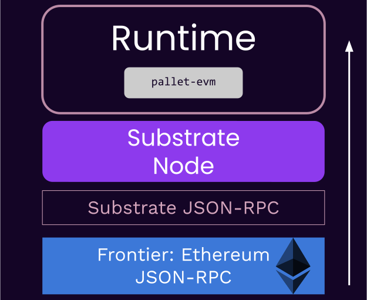

---v

### Substrate and Smart Contracts

<pba-cols>

<pba-col>
  
</pba-col>

<pba-col>
  
</pba-col>

</pba-cols>

---v

### Substrate and Smart Contracts

<pba-cols>

<pba-col>
  
</pba-col>

<pba-col>
  
  <p style="font-size: 6rem;">😎</p>
</pba-col>

</pba-cols>

---v

### Substrate and Smart Contracts

- So when should you write with a smart contract, and when a Runtime (FRAME)?

Notes:

https://paritytech.github.io/polkadot-sdk/master/polkadot_sdk_docs/reference_docs/runtime_vs_smart_contract/index.html

I was asked this yesterday as well. My latest answer is: if you don't need any of the customizations
that a blockchain node/runtime gives to you, and the performance of a shared platform is okay for
you, then go with a smart contract. If you need more, you need a "runtime" (some kind of chian,
parachain or solo)

An example of customization is that a runtime has access to `on_initialize` etc.

Also, a contract can not have fee-less transactions.

Also, a contract usually depends on a token for gas, while a runtime can be in principle token-less
fee-less.

---

## Development Options

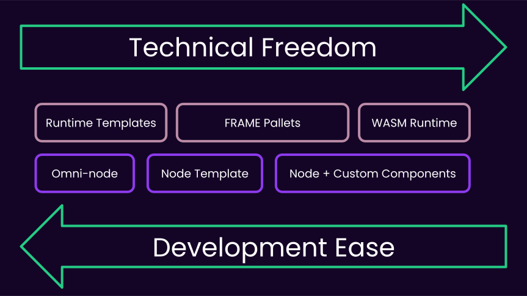

Notes:

OpenZepplin is working on templates for substrate now:

https://github.com/OpenZeppelin/polkadot-runtime-template

We also have some of our own:

https://paritytech.github.io/polkadot-sdk/master/polkadot_sdk_docs/polkadot_sdk/templates/index.html

Omni node:

https://forum.polkadot.network/t/polkadot-parachain-omni-node-gathering-ideas-and-feedback/7823/5

---

## Substrate and Polkadot


> ..is the biggest bet against chain maximalism

---v

### Repository Structure

#### [`polkadot-sdk`](https://github.com/paritytech/polkadot-sdk)

- Substrate + FRAME + XCM
- Cumulus
- Bridges
- Polkadot Node

**This is a big repo, please clone and run `cargo build` on it after this lecture**

<br/>

#### [`polkadot-fellowship/runtime`](https://github.com/polkadot-fellows/runtimes)

- Polkadot Runtimes

Notes:

https://paritytech.github.io/polkadot-sdk/master/polkadot_sdk_docs/polkadot_sdk/index.html

---

## Substrate: The Gaming Console of Blockchains!

<pba-cols>
<pba-col>


Substrate Node

</pba-col>
<pba-col>


Substrate's Wasm Runtime

</pba-col>
</pba-cols>

Notes:

Another good analogy: Node is the FPGA, and FRAME/Wasm is the VHDL.

---

## Lecture Recap - Part 1

- Substrate's design stems from 3 core principles:
  - **Rust**, **Generic Design**, **Upgradeability/Governance**
  - **Runtime <> Node** Architecture
- Positive and negative consequences of Wasm
- Substrate next to Polkadot and other chains.
- Development Options
- Substrate and Smart Contracts.

---v

## Lecture Recap - Part 1

- Questions?


---

## Part 2: Substrate Architecture

So far we covered high level facts about Substrate. Now let's dive deeper into its architecture using the Runtime/STF.

---

## State Transition Function

Let's explore this definition of the runtime a bit more.

---v

### State Transition Function

**State**

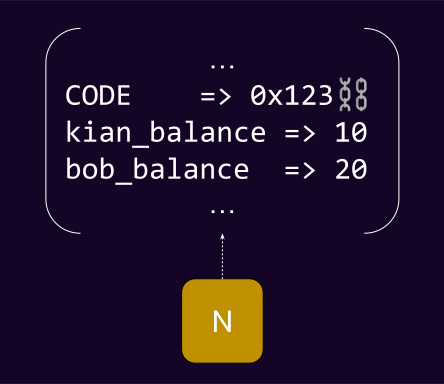

Notes:

entire set of data upon which we want to maintain a consensus.
key value.
associated with each block.

---v

### State Transition Function

**Transition Function**


---v

### State Transition Function

$$STF = F(block_{N+1}, state_{N}, code_{N}): state_{N+1}$$

Note:

Who can find a small nitpick issue in this?

Code is part of state.

---v

### State Transition Function

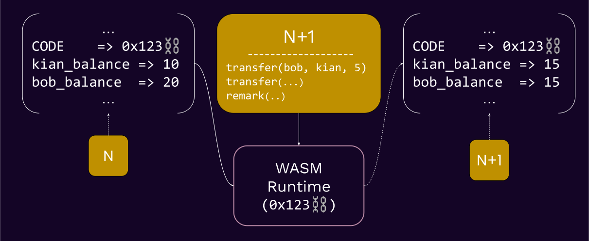

Notes:

This diagram should really be 100000% clear to everyone. Pause.

The Wasm runtime in this figure is in fact obtained from the state (see `0x123`)

---v

### State Transition Function

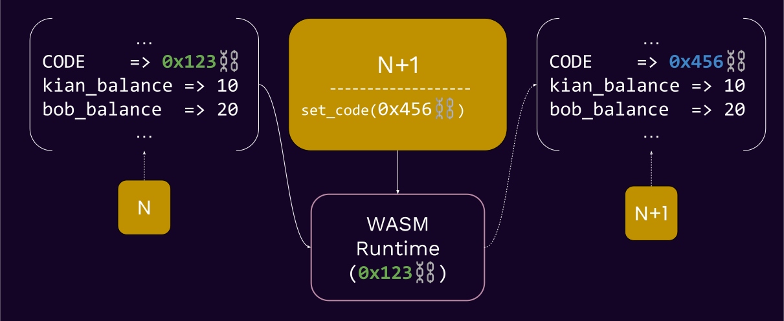

Note:

now what would happen when we want to execute block N+2?

---v

### State Transition Function


Notes:

THIS IS HOW A META-PROTOCOL MAKES A SYSTEM UPGRADE-ABLE.

Q: could we have updated the code in N+1? By default, no because we load the wasm before you even look
into the block.

IMPORTANT: State is not IN THE BLOCK, each state has AN ASSOCIATED BLOCK.

Keeping the state is 100% optional. You can always re-create the state of block `N` by re-executing
block `[0, .., N-1]`.

ofc, changing the Wasm code cannot be done by anyone. That's up to governance.

---v

### The Runtime

<div>

- Blockchain -> **State Machine**
- Runtime -> **State Transition Function**
  - &shy;<!-- .element: class="fragment" -->Or, **application logic**.
  - &shy;<!-- .element: class="fragment" -->Or, **how to execute blocks**

Notes:

- I would personally call the runtime STF to avoid confusion with the "runtime" that is the general
  programming runtime, but kinda too late for that now.
- Among the definitions of the Wasm runtime, let's recap what the state transition is.
- The block execution definition will be described more in the Wasm-meta lecture.

---

## Full Substrate Architecture


---

## Consensus <> Runtime 🤔

- Yes, consensus is not a core part of a blockchain runtime. Why?
- Not part of your STF!
<!-- .element: class="fragment" -->
- The consensus protocol is to your runtime what HTTP is to Facebook.
<!-- .element: class="fragment" -->

Notes:

comments from Joshy:

I think this is important. The runtime is the application you want to run.

Consensus is outside of this application helping us agree what the official state of this runtime
is. Last wave I used this analogy.

Imagine a writers room for some TV show. Writers are sitting around coming up with potential plot
points for future episodes. Any of their ideas could work. But eventually they need to agree what
the next episode to air actually will be.

---

## Database <> State 🤔

- State is the entire set of key value data that is associated with one block.
- Database is the component that allows this be stored in disk. May or may not be key-value.

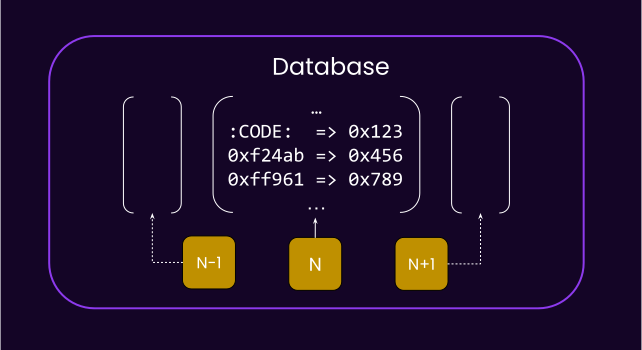

Notes:

state is sometimes called "storage" asd well.

---

### Database <> Runtime 🤔

- Yes, data is stored outside of the runtime. Why?
- Wasm runtime does not have the means to store it.
<!-- .element: class="fragment" -->
- Yet, the interpretation of the data is up to the runtime.
<!-- .element: class="fragment" -->

---v

### Database <> Runtime 🤔

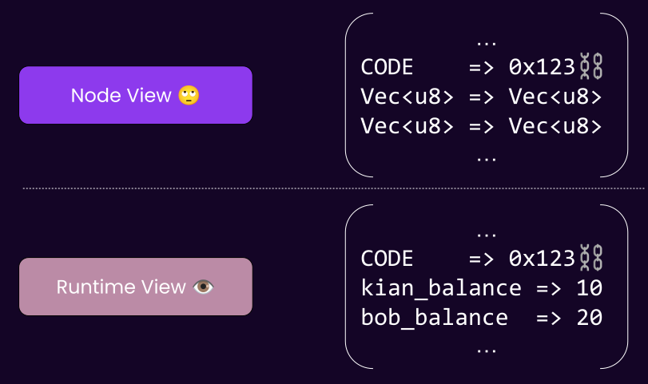

---v

### The Node: Database 🤔

- The database, from the client's PoV, is a _untyped_, key-value storage.
- The runtime knows which key/value means what.

---

## Lecture Recap - Part 2

- Full Substrate Architecture
- State Transition Deep Dive -> Forkless Upgrade
- Consensus / Database being in node.

---v

### Lecture Recap - Part 2


---

## Rest of This Module! 😈

#### Track: Main Lectures

- Wasm Meta Protocol
- Substrate Storage

#### Track: Aux Lecture

- Tx Pool
- Interacting with Substrate
- SCALE Codec

#### Track: Activity

- FRAMELess Runtime

---

## Homework 📚

Highly suggested reading to ingest this lecture better:

- [`polkadot-sdk-docs`](https://paritytech.github.io/polkadot-sdk/master/polkadot_sdk_docs/polkadot_sdk/index.html)

---

## Additional Resources! 😋

> Check speaker notes (click "s" 😉)


Notes:

- Great documentation about all things substrate/blockchain from SMOLDOT: https://docs.rs/smoldot/latest/smoldot/

- Read more about why we use Rust at Parity: https://www.parity.io/blog/why-rust

- An interesting question on JVM/Wasm: https://stackoverflow.com/questions/58131892/why-the-jvm-cannot-be-used-in-place-of-webassembly

- Rust safety: https://stanford-cs242.github.io/f18/lectures/05-1-rust-memory-safety.html
- https://www.reddit.com/r/rust/comments/5y3cxb/how_many_security_exploits_would_rust_prevent/ <!-- markdown-link-check-disable-line -->

- The substrate clients should still have some level of _determinism in their performance_. If
  authority nodes have extremely varied performances, they could start finalizing different forks.

- There have been attempts at writing FRAME alternatives, namely AssemblyScript. https://github.com/LimeChain/as-substrate-runtime

- Think about the differences between a runtime and a smart contract.

  - A runtime is in some sense a smart contract as well, but not a user-deployed one.
  - https://en.wikipedia.org/wiki/Smart_contract
  - https://www.futurelearn.com/info/courses/defi-exploring-decentralised-finance-with-blockchain-technologies/0/steps/251885#:~:text=to%20the%201990s.-,Writing%20in%201994%2C%20the%20computer%20scientist%20Nick%20Szabo%20defined%20a,of%20artificial%20intelligence%20is%20implied.

- Substrate Primitives (`sp-*`), Frame (`frame-*`) and the pallets (`pallets-*`), binaries (`/bin`)
  and all other utilities are licensed under [Apache
  2.0](https://www.apache.org/licenses/LICENSE-2.0.html).

Substrate Client (`/client/*` / `sc-*`) is licensed under [GPL
v3.0](https://www.gnu.org/licenses/gpl-3.0.html) with a [classpath linking
exception](https://www.gnu.org/software/classpath/license.html).

- Apache2 allows teams full freedom over what and how they release, and giving licensing clarity to
  commercial teams.

- GPL3 ensures any deeper improvements made to Substrate's core logic (e.g. Substrate's internal
  consensus, crypto or database code) to be contributed back so everyone can benefit.

- Currently, the Wasm binary spec v1 is used, read more about the new version here: https://webassembly.github.io/spec/core/binary/index.html

### Post Lecture Feedback

- a takeaway after each section, more clear path (shawn).

---

## Appendix

Content that is not covered, but is relevant.

---

### More Diagrams of Substrate and Polkadot

Notes:

I made these figures recently to explain the relationship between Substrate, Cumulus and Polkadot.
They use the most generic term for client and runtime, namely "Host" and "STF" respectively.

---v

Substrate


---v

Polkadot


---v

A Parachain


---

## Appendix: What is Wasm Anyways?

> WebAssembly (abbreviated Wasm) is a _binary instruction format_ for a _stack-based virtual
> machine_. Wasm is designed as a _portable compilation_ target for programming languages, enabling
> deployment on the web for client and server applications.

---v

### What is Wasm Anyways?


---v

### What is Wasm Anyways?

<pba-cols>
<pba-col>

- Wasm ❤️ Web
- Streaming and rapid compilation.
- Designed with the concept of host in mind.
  Sandboxed, permissioned sys-calls.

> Anyone remember "Java Applets"?

</pba-col>
<pba-col>

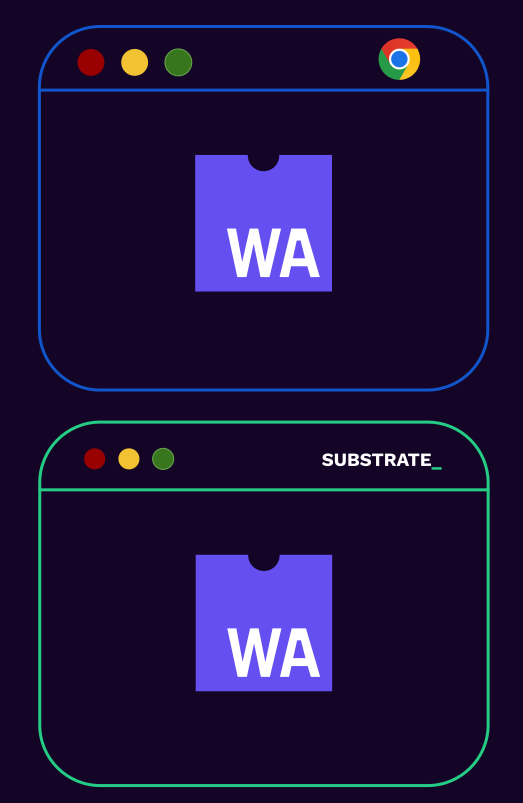

</pba-col>
</pba-cols>

Notes:

People actually tried sticking things like JVM into the browser (_Java Applets_), but it didn't work.

---v

### How to Write a Wasm Runtime?

- Any language that can compile to Wasm and exposes a fixed set of functions, to be used by the client.
- ... But, of course, Substrate comes with a framework to make this developer-friendly, **FRAME™️**.

---

## State of Light Client/Nodes

- Node that follows headers, therefore knows state roots and can ask for state-proofs to do more.

Note:

Establish that it is merely an alternative node implementation.

---v

### State of Light Clients


Notes:

What was a light client? follows only block headers, therefore knows state roots, and a few other
pieces of information, others send it state proofs if it wishes to do more.

SMOLDOT is not exactly a substrate client. It is mainly designed to work with Polkadot. But with
minimal tweaks, you could make it work for more substrate based chains.

This has to do with the fact that consensus and a few other bits of the client and runtime are not
100% independent. For example, GRANDPA has a pallet on the runtime side, but is mostly in the
client. Now, a client that is configured with GRANDPA can only work with runtimes that are also
configured with GRANDPA.

---v

### State of Light Clients

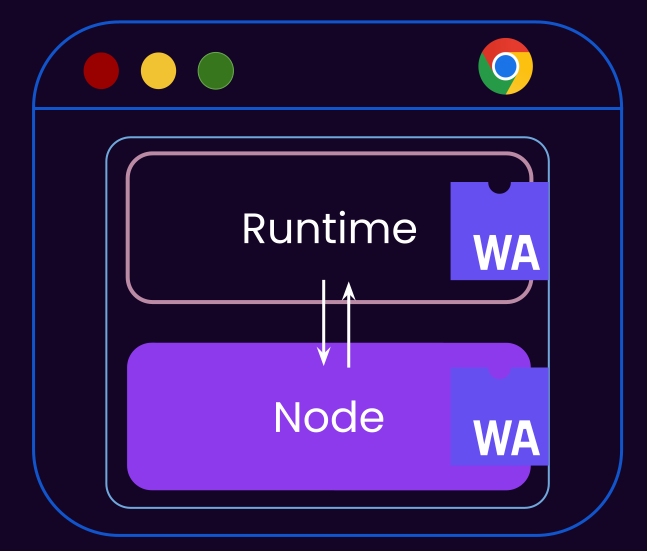

Note:

Similarly it is dead simple to embed smoldot in mobile etc.

Separate lecture on this later.

---v

### Substrate and Smart Contracts

> SMOLDOT is syncing a chain who's runtime is executing wasm contracts.

Question: How many nested Wasm blobs are executing one another?

---v

### Substrate and Smart Contracts

<pba-cols>
<pba-col center>


</pba-col>
<pba-col>

- The browser is executing:
- a Wasm blob (SMOLDOT in extension)
- that executes a Wasm blob (runtime)
- that executes a Wasm blob (contract)

</pba-col>
</pba-cols>
