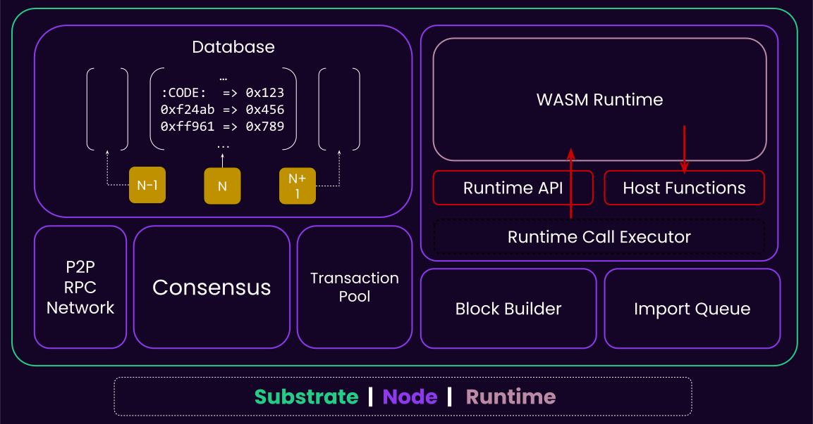
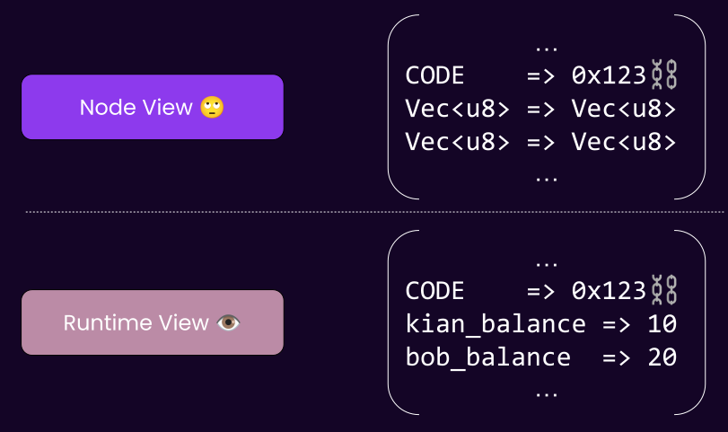
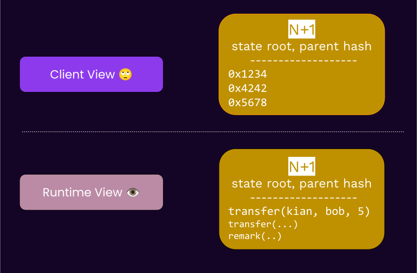
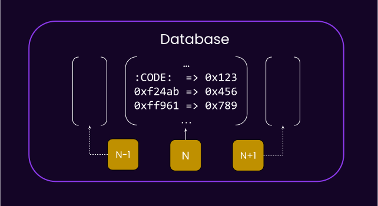
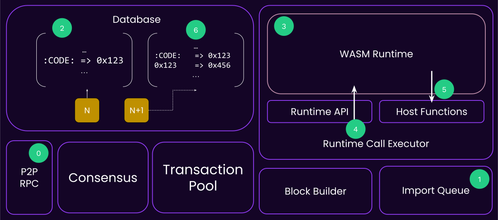
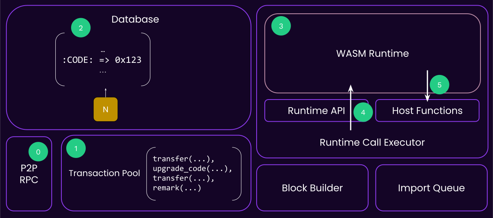
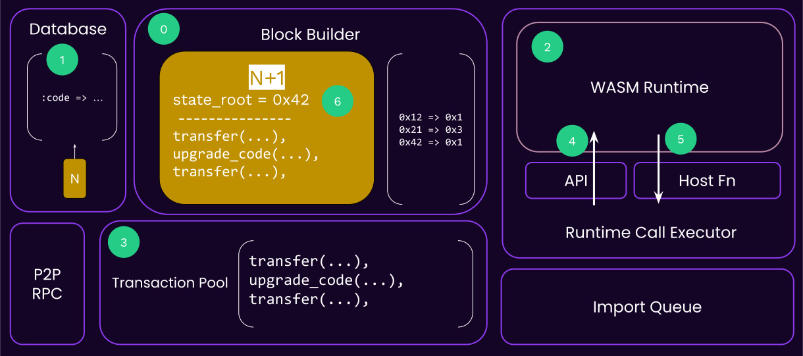
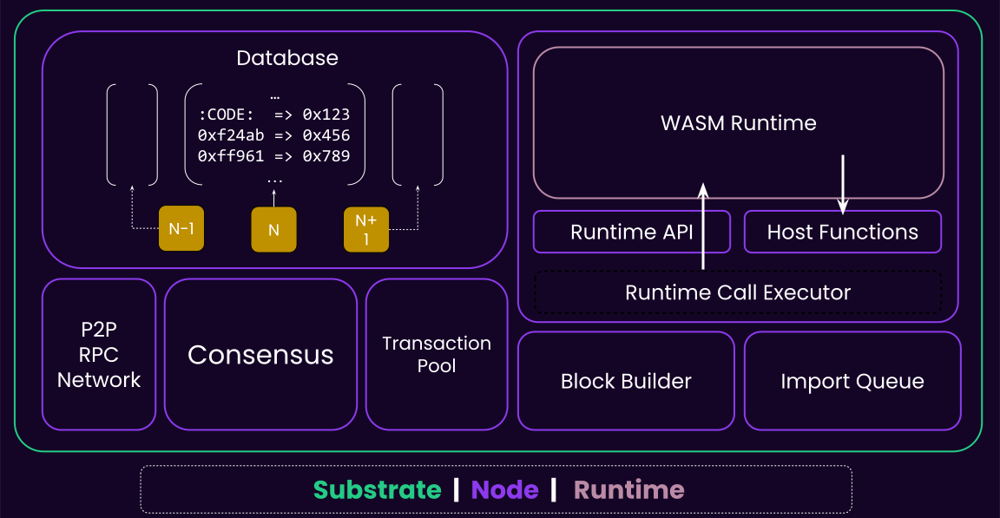
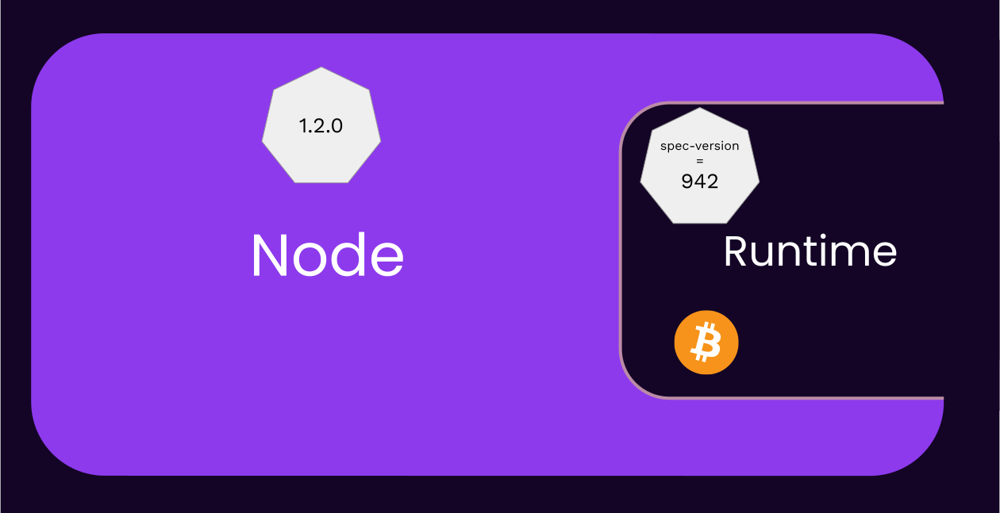
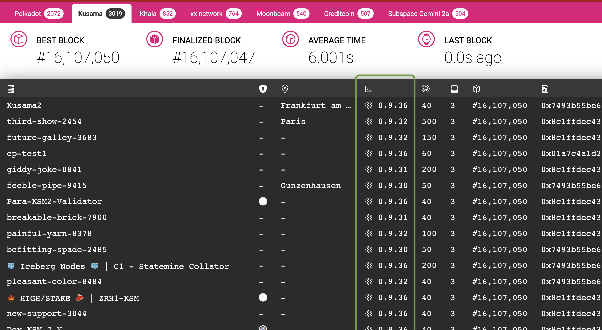

# Substrate Wasm Meta Protocol

---

# Part 1

- This is a big lecture, so I divided it into two small parts, that's all 🫵🏻

---

## Meta Protocol

- The Node / Runtime division is one of the most important design decisions in Substrate.
  - &shy;<!-- .element: class="fragment" --> 👿 Bad: _One_ fixed opinion.
  - &shy;<!-- .element: class="fragment" --> 😇 Good: _Countless_ other things to flexible.

Notes:

Recall that the boundary for this division is the **state transition**

---

## Substrate: a short recap



---v

### Substrate: a short recap

- **Host Functions**: Means of a runtime communicating with its host environment, i.e. the Substrate node.

---v

### Substrate: a short recap

- **Runtime API**: The well-defined functions that a Wasm substrate runtime is providing.

Notes:

Building a Wasm module's activity was building something akin to runtime-apis

---v

### Substrate: a short recap

- **Database** is on the node side, storing an opaque key-value state per block.

---v

### Substrate: a short recap

- Communication language of node/runtime is **SCALE**:

<diagram class="mermaid">
flowchart LR
  B[Known Type eg. `u32`] --Encode--> V["Vec(u8)"]
  V --Decode-->B
</diagram>

---

## Learning with Examples

and some pseudo-code

Notes:

During each example, we deduce what host functions and/or runtime APIs are needed.

---

## Example #1: State

- The runtime wants to add 10 units to Kian's balance.

---v

### Example #1: State

```rust [1-100|1-2|4,5|7,8|10,11|13,14|1-100]
// the runtime decides what key stores kian's balance.
key: Vec<u8> = b"kian_balance".to_vec();

// the runtime reads the raw bytes form that key.
let current_kian_balance_raw: Vec<u8> = host_functions::get(key);

// and needs to know to which type it should be decoded, u128.
let mut current_kian_balance: u128 = current_kian_balance_raw.decode();

// actual logic.
current_kian_balance += 10;

// encode this again into an opaque byte-array.
let new_balance_encoded: Vec<u8> = current_kian_balance.encode();

// write the encoded bytes again.
host_functions::set(key, new_balance_encoded);
```

---v

### Example #1: State

- 💡 The runtime needs host functions to read/write to state.

```rust
fn get(key: Vec<u8>) -> Vec<u8>;
fn set(key: Vec<u8>, value: Vec<u8>);
```

Notes:

ofc the IO to these functions is all opaque bytes, because the node does not know the state
layout.

---v

### Example #1: State

- could we have communicated with the node like this?

```rust
fn set_balance(who: AccountId, amount: u128)
```

Notes:

This would imply that the node would have to know, indefinitely, the types needed for account id
and balance. Also, it would have to know the final key for someone's balance.

---v

### Example #1: State

- [Exceptions](https://paritytech.github.io/polkadot-sdk/master/sp_storage/well_known_keys/index.html):

```rust
/// The keys known to the node.
mod well_known_keys {
  const CODE: &[u8] = b":code";
}
```

Notes:

See https://paritytech.github.io/substrate/master/sp_storage/well_known_keys/index.html

---v

### Example #1: State



---

## Example #2: Block Import

---v

### Example #2: Block Import

- Node's view of the state -> Opaque.
- Node's view of the transactions? 🤔
<!-- .element: class="fragment" -->

Notes:

Short answer is: anything that is part of the STF definition must be opaque to the node, and is
upgradeable, but we will learn this later.

Another way to think of it: Anything that we want to keep upgrade-able needs to be opaque.

---v

### Example #2: Block Import

- Transactions format is by definition part of the state transition function as well -> Opaque

Notes:

What about header, and other fields in a typical block?

as in, do we want to able to update our transactions format as well in a forkless manner?
we want the runtime to be able to change its transactions format as well, in a forkless manner.

The answer to the latter is more involved. The short answer is that these fields like header must be
known and established between node and runtime. If you want to alter the header format, that's a
hard fork.

The concept of `digest` is a means through which additional data can be put in the header without
breaking changes, but that is outside the scope of this lecture.

Yet, as with other primitives, substrate allows you to readily change your header type when you are
building your blockchain. This is achieved by a set of traits in `sp-runtime`. Notably, `trait
Block` and `trait Header` in this crate define what it means to be a header and block, and as long
as you fulfill that, you are good to go.

Also, substrate provides one set of implementation for all of these types in
https://paritytech.github.io/substrate/master/sp_runtime/generic/index.html

---v



---v

### Example #2: Block Import

<pba-cols>

<pba-col>

```rust
struct NodeBlock {
  header: Header,
  transactions: Vec<Vec<u8>>
}
```

</pba-col>

<pba-col>

```rust
struct RuntimeBlock {
  header: Header,
  transaction: Vec<KnownTransaction>
}
```

</pba-col>

</pba-cols>

Notes:

this slide is intentionally using the keyword transaction instead of extrinsic.

---v

### Example #2: Block Import

```rust [1-100|1-2|4-6|8-9|1-100]
// fetch the block from the outer world.
let opaque_block: NodeBlock = import_queue::next_block();

// initialize a wasm runtime.
let code = database::get(well_known_keys::CODE);
let runtime = wasm::Executor::new(code);

// call into this runtime.
runtime.execute_block(opaque_block);
```

---v

### Example #2: Block Import

- 💡 The node needs a runtime API to ask the runtime to execute the block.

```rust
fn execute_block(opaque_block: NodeBlock) -> Result<_, _> { .. }
```

Notes:

`execute_block` is the most basic, fundamental runtime API that any substrate based runtime has to
implement in order to be called a "blockchain runtime".

---

### Example #2: Block Import: Something Missing

```rust
// 🤔
let code = database::get(well_known_keys::CODE);

// 🤔
runtime.execute_block(opaque_block);
```



Notes:

- From which block's state do we fetch the code??
- This probably calls into `host_functions::{get/set}` internally. What do we return

---v

### Example #2: Block Import

```rust [1-100|1-2|4-6|8-10|12-15|17-100]
// fetch the block from the outer world.
let block: NodeBlock = import_queue::next_block();

// get the parent block's state.
let parent = block.header.parent_hash;
let mut state = database::state_at(parent);

// initialize a wasm runtime FROM THE PARENT `state`!
let code = state::get(well_known_keys::CODE);
let runtime = wasm::Executor::new(code);

// call into this runtime, updates `state`.
state.execute(|| {
  runtime.execute_block(block);
});

// create the state of the next_block
database::store_state(block.header.hash, state)
```

Notes:

- Question: why is `state` defined as `mut`?
- within these snippets, more or less, everything inside `state.execute` is executed within Wasm.

---v

### Example #2: Block Import

- _A state key is only meaningful at a given block_
- &shy;<!-- .element: class="fragment" -->_A `:code` / Runtime is only meaningful at at given block_
- &shy;<!-- .element: class="fragment" -->_A runtime (API) is only meaningful when executed at a give block_

Notes:

- The same way that Alice's balance value is only meaningful when read at a given block.

- Based on that:

  - The correct runtime code is loaded.
  - The correct state (and other host functions) is provided.

- Similarly, almost all RPC operations that interact with the runtime have an `Option<Hash>`
  argument. This specifies "at which block to load the runtime and state from".

---v

### Example #2: Block Import

```rust
state.execute(|| {
  // What is the most important check that a runtime must do
  // inside `execute_block` 🤔?
  runtime.execute_block(block);
});
```

Note: make sure roots in the header match!

---v

### Example #2: Block Import: Recap



---

## Example #3: Block Authoring

---v

### Example #3: Block Authoring



<div class="fragment fade-out" style="width: 220px; height: 120px; position: fixed; left: 450px; bottom: 180px; background: #140526"></div>
<div class="fragment fade-out" style="width: 220px; height: 90px; position: fixed; left: 450px; bottom: 180px; background: #140526"></div>
<div class="fragment fade-out" style="width: 220px; height: 60px; position: fixed; left: 450px; bottom: 180px; background: #140526"></div>
<div class="fragment fade-out" style="width: 220px; height: 30px; position: fixed; left: 450px; bottom: 180px; background: #140526"></div>

Notes:

The point being, eventually the pool builds a list of "ready transactions".

---v

### Example #3: Block Authoring



<div id="pool-1" class="fragment" style="
    width: 300px; height: 30px; position: fixed; left: 450px; top: 610px;
    background: #140526"></div>

<div id="block-1" class="fragment fade-out" style="
    width: 300px; height: 90px; position: fixed; left: 320px; bottom: 400px;
    background: #BF9001"></div>

<div id="pool-2" class="fragment" style="
    width: 300px; height: 30px; position: fixed; left: 450px; top: 640px;
    background: #140526"></div>

<div id="block-2" class="fragment fade-out" style="
    width: 300px; height: 60px; position: fixed; left: 320px; bottom: 400px;
    background: #BF9001"></div>

<div id="pool-3" class="fragment" style="
    width: 300px; height: 30px; position: fixed; left: 450px; top: 670px;
    background: #140526"></div>

<div id="block-3" class="fragment fade-out" style="
    width: 300px; height: 30px; position: fixed; left: 320px; bottom: 400px;
    background: #BF9001"></div>

<!-- This is the box that will unhide the state root. -->
<div class="fragment fade-out" style="
  width: 240px; height: 30px; position: fixed; left: 320px; top: 350px;
  background: #BF9001;"></div>

---v

### Example #3: Block Authoring

```rust [1-100|1-2|4-5|7-9|11-12|14-21|23-100]
// get the best-block, based on whatever consensus rule we have.
let (best_number, best_hash) = consensus::best_block();

// get the latest state.
let mut state = database::state_at(best_hash);

// initialize a wasm runtime.
let code = state::get(well_known_keys::CODE);
let runtime = wasm::Executor::new(code);

// get an empty node block.
let mut block: NodeBlock = Default::default();

// repeatedly apply transactions.
while let Some(next_ext) = transaction_pool_iter::next() {
  state.execute(|| {
    if runtime.apply_extrinsic(next_ext).is_ok() {
      block.extrinsics.push(next_ext);
    }
  });
}

// set the new state root.
block.header.state_root = state.root();
```

Notes:

- What is the type of `next_transaction`? `Vec<u8>`
- Do we actually loop forever until the tx-pool is empty? probably not!

---v

### Example #3: Block Authoring

- Substrate based runtimes are allowed to perform some operations at the beginning and end of each
  block.
- ✋🏻 And recall that a smart contract could not do this.

---v

### Example #3: Block Authoring

```rust [14-15,25-100]
// get the best-block, based on whatever consensus rule we have.
let (best_number, best_hash) = consensus::best_block();

// get the latest state.
let mut state = database::state_at(best_hash);

// initialize a wasm runtime.
let code = state::get(well_known_keys::CODE);
let runtime = wasm::Executor::new(code);

// get an empty node block.
let mut block: NodeBlock = Default::default();

// tell this runtime that you wish to start a new block, and pass in a raw header.
runtime.initialize_block(&block.header);

// repeatedly apply transactions.
while let Some(next_ext) = transaction_pool_iter::next() {
  state.execute(|| {
    if runtime.apply_extrinsic(next_ext).is_ok() {
      block.extrinsics.push(next_ext);
    }
  });
}

// finalize and set the final header.
block.header = runtime.finalize_block();
```

Notes:

The header interactions here are a substrate implementation detail, not a golden rule. I guess it
could have been done otherwise. I am mainly covering it because it is relevant to the assignment.

Good question to ask: what about inherents? see appendix slides.

---v

### Example #3: Block Authoring

```rust
fn initialize_block(raw_header: Header) { ... }
fn apply_extrinsic(extrinsic: Vec<u8>) { ... }
fn finalize_block(..) -> Header { ... }
```

---

## BUT WAIT A MINUTE 😱

- if the `code` changes, all the following can also change:

  - <!-- .element: class="fragment" --> What state key is Kian's balance.
  - <!-- .element: class="fragment" --> What extrinsic format is valid.

- <!-- .element: class="fragment" --> How on earth is an application (i.e. a wallet) is supposed to survive?

---v

### BUT WAIT A MINUTE 😱

- Metadata 🎉

```rust
fn metadata() -> Vec<u8> { ... }
```

Notes:

Notice the opaque return type.

In order the address the mentioned issue, metadata must be a runtime API.

<hr>

- Metadata contains all the basic information to know about all storage items, all extrinsics, and so
  on. It will also help a node/app decode them into the right type.
- Substrate itself doesn't impose what the metadata should be. It is `Vec<u8>`.
- FRAME based runtime expose a certain format, which is extensively adopted in the ecosystem.

---v

### BUT WAIT A MINUTE 😱

- Recall the fact that "runtime is only meaningful at a certain block".

<div class="fragment">

- Two different runtimes at block `N` and `N+1` return different metadata ✅.

</div>

Notes:

By Applications I really mean anyone/anything. Substrate node doesn't really use metadata
because it is dynamically typed, but if needed, it could.

---

## Radical Upgradeability

Comes at the cost of radical opaque/dynamic typing.

Notes:

I wish you could have both, but not so easy.

Some personal rant: radical upgrade-ability is the biggest advantage, and arguably one of the main
develop-ability problems of the substrate ecosystem. Writing nodes, such as block explorers,
scanners, and even exchange integration are orders of magnitude harder than a blockchain that has a
fixed format and only changes every 18 months at most. That being said, this is a battle that is to
me obvious: we simply HAVE to win. When ethereum first introduced smart contracts, everyone
probably had the same class of issues. This is the same matter, on a a different level.

also, as noted in an earlier slide, once you make it work for one chain, it works for many chains.

---

## Oblivious Node 🙈🙉

- The underlying reason why the node is "**kept in the dark**" is so that it wouldn't need to care
  about the runtime upgrading from one block to the other.

---v

### Oblivious Node 🙈🙉

$$STF = F(blockBody_{N+1}, state_{N}) > state_{N+1}$$

_Anything that is part of the STF is opaque to the node, but it can change forklessly!_

- <!-- .element: class="fragment" --> The `F` itself (your Wasm blob)? It can change!
- <!-- .element: class="fragment" --> Extrinsic format? It can change!
- <!-- .element: class="fragment" --> State format? It can change!

Notes:

In essence, all components of the STF must be opaque to the node. `Vec<u8>`.
Metadata is there to assist where needed.
This is why forkless upgrades are possible in substrate.

---v

### Oblivious Node 🙈🙉

- What about new host functions?
- <!-- .element: class="fragment" --> What about a new header field*?
- <!-- .element: class="fragment" --> What about a new Hashing primitive?
- <!-- .element: class="fragment" --> A new consensus/networking engine?

🥺 No longer forkless.

<!-- .element: class="fragment" -->

Notes:

But, recall that substrate's extensibility and generic-ness clause applies here.

For some, like header, some hacks exist, like the `digest` field.

Changing these is hard in a forkless manner. If you want to just change them at genesis and launch a new chain, they are all VERY easy to change.

---

## Substrate: The Full Picture



Notes:

time to ask any missing questions.

---

## Activity: Finding APIs and Host Functions

---v

### Finding APIs and Host Functions

- look for `impl_runtime_apis! {...}` and `decl_runtime_apis! {...}` macro calls.
  - Try and find the corresponding the node code calling a given api as well.
- Look for `#[runtime_interface]` macro, and try and find usage of the host functions!
  - Look for `sp_io::storage`
- You have 15 minutes!

---v

### Defining a Runtime API

```rust [1-7|9-15|17-100|1-100]
// somewhere in common between node/runtime => substrate-primitive.
decl_runtime_apis! {
	pub trait Core {
		fn version() -> RuntimeVersion;
		fn execute_block(block: Block) -> bool;
	}
}

// somewhere in the runtime code.
impl_runtime_apis! {
  impl sp_api::Core<Block> for Runtime {
    fn version() -> RuntimeVersion { /* stuff */ }
    fn execute_block(block: Block) -> bool { /* stuff */ }
  }
}

// somewhere in the node code..
let block_hash = "0xffff...";
let block = Block { ... };
let outcome: Vec<u8> = api.execute_block(block, block_hash).unwrap();
```

Notes:

- All runtime APIs are generic over a `<Block>` by default.
- All runtime APIs are executed on top of a **specific block**. This is the implicit _at_ parameter.
- Going over the API, everything is SCALE encoded both ways, but abstractions like
  `impl_runtime_apis` hide that away from you.

---v

### Defining a Host Function

```rust
// somewhere in substrate primitives, almost always `sp_io`.
#[runtime_interface]
pub trait Storage {
  fn get(&self, key: &[u8]) -> Option<Vec<u8>> {...}
  fn get(&self, key: &[u8], value: &[u8]) -> Option<Vec<u8>> {...}
  fn root() -> Vec<u8> {...}
}

#[runtime_interface]
pub trait Hashing {
	fn blake2_128(data: &[u8]) -> [u8; 16] {
		sp_core::hashing::blake2_128(data)
	}
}

// somewhere in substrate runtime
let hashed_value = sp_io::storage::get(b"key")
  .and_then(sp_io::hashing::blake2_128)
  .unwrap();
```

---v

### Finding APIs and Host Functions

Activity Outcomes:

- `Core` is the essence of import.
- `TaggedTransactionQueue` and `BlockBuilder` for validators.
- `header: Header` being passed around.

Notes:

a question that arise here is that why don't have multiple runtimes, where one is only for import,
one only for authoring, and such? the reality is that while these have different names, the
underlying code is like 95% the same.

---v

### Finding APIs and Host Functions

<pba-cols>
<pba-col>

#### Block Import

```rust
runtime.execute_block(block);
```

</pba-col>
<pba-col>

#### Block Authoring

```rust
runtime.initialize_block(raw_header);
loop {
  runtime.apply_extrinsic(ext);
}
let final_header = runtime.finalize_block();
```

</pba-col>
</pba-cols>

Notes:

to be frank, these are still a simplification. Inherent for example are not really represented here.

---v

### Finding APIs and Host Functions

- Most important host functions

```
sp_io::storage::get(..);
sp_io::storage::set(..);
sp_io::storage::root();
```

---

## Lecture Recap (Part 1)

- Revise "**Runtime API**" and "**Host Function**" concepts.
- Deep look at block import and authoring.
- Oblivious node. STF has to be opaque, but can be forklessly upgraded.
- Metadata to the rescue!

---

# Part 2

---

## Detour: Extrinsic

- Previous slides used the term "transactions" in a simplified way. Let's correct it.

---v

### Detour: Extrinsic

<diagram class="mermaid" center>
  %%{init: {'theme': 'dark', 'themeVariables': { 'darkMode': true }}}%%
  flowchart TD
    E(Extrinsic) ---> I(Inherent);
    E --> T(Transaction)
    T --> ST("Signed (aka. Transaction)")
    T --> UT(Unsigned)
</diagram>

---v

### Detour: Extrinsic

- An Extrinsic is data that come from outside of the runtime.
- &shy;<!-- .element: class="fragment" -->Inherents are data that is put into the block by the block author, directly.
- &shy;<!-- .element: class="fragment" -->Yes, transactions are **a type of extrinsic**, but not all extrinsics are transactions.
- &shy;<!-- .element: class="fragment" -->So, why is it called _Transaction Pool_ and not _Extrinsic Pool_?

Notes:

extrinsics are just blobs of data which can be included in a block. inherents are types of extrinsic
which are crafted by the block builder itself in the production process. they are unsigned because
the assertion is that they are "inherently true" by virtue of getting past all validators.

notionally the origin can be said to be a plurality of validators. take for example the timestamp
set inherent. if the data were sufficiently incorrect (i.e. the wrong time), then the block would
not be accepted by enough validators and would not become canonicalised. so the "nobody" origin is
actually the tacit approval of the validators.

transactions are generally statements of opinion which are valuable to the chain to have included
(because fees are paid or some other good is done). the transaction pool filters out which of these
are indeed valuable and nodes share them.

---v

### Detour: Extrinsic

More change is coming; advance topic; not needed, but FYI:

https://github.com/paritytech/polkadot-sdk/issues/2415

---

## Considerations: Speed

- (new) Wasmtime is near-native 🏎️.
- (old) `wasmi` is significantly slower 🐢.

Notes:

slower wasmi was one of the reasons to have native execution.
there are talks of exploring Risk-v ISA instead of wasm nowadays.

https://github.com/paritytech/substrate/issues/13640

---v

### Considerations: Speed

<pba-cols>
<pba-col center>

- Host is generally **faster** and **more capable**, but it has a one-time cost of getting there,
  and copying the data.
- &shy;<!-- .element: class="fragment" -->🤔 Hashing, Crypto?
- &shy;<!-- .element: class="fragment" -->🤔 Storage?

</pba-col>
<pba-col center>


</pba-col>
</pba-cols>

Notes:

Hashing and crypto is done as host function for performance

Storage because of the runtime not being capable.

- Going over the runtime boundary is analogous to your CPU needing to go to memory.

On the other hand things as `next_storage` are high cost (generally iteration on state from runtime
is expensive). This design is related to the memory location, there is alternative but this is
simple (simple as good design).

- Question: we got host function for running computation intensive code in native, but when simd for
  wasm would be added, then will host function for a hashing be still useful:
  A: wait and see, but is possible that simd optimization of the hash function in wasm is way faster.

Again using a host function for speed up needs to be reasoned, cost of transmitting parameter in
wasm can be bigger than the actual hashing cost.

---

### Runtime Version vs. Node Version

```rust
#[sp_version::runtime_version]
pub const VERSION: RuntimeVersion = RuntimeVersion {
	spec_name: create_runtime_str!("node"),
	spec_version: 268,
	impl_version: 0,
  ..
};
```

---v

### Speaking of Versions..



---v

### Speaking of Versions..



---v

### Speaking of Versions..


---v

### Speaking of Versions..

- What happens when Parity release a new `polkadot` node binary?
- What happens when the Polkadot fellowship wants to update the runtime?

---

## Considerations: Panic

- What if any of the runtime calls, like `execute_block` or `apply_extrinsic` panics 😱?

---v

### Considerations: Panic

- Panic is a (free) form of wasting a validator's time.
- Practically Wasm instance killed; State changes reverted.
  - Any fee payment also reverted.

Notes:

While you might think the state revert is the good thing here, it is the main problem, and the main
reason you should not let a code-path that is accessible by arbitrary users to panic. Because, any
fees paid for the wasted execution of that runtime API call is also reverted.

In other words, a panic in the runtime typically allows everyone's time to be wasted, for free,
indefinitely. In other words, a DOS vector.

> A panic in `initialize_block` and `finalize_block` have even more catastrophic effects, which will
> be discussed further in the FRAME section.

workshop idea: make a panicing runtime, and DoS it out.
workshop idea for FRAME: find all instances where the runtime actually correctly panics (wrong timestamp, disabled validator)

---v

### Considerations: Panic

- Panic in a user-callable code path?
- 🤬 annoy/DOS your poor validators
- Panic on "automatic" part of your blockchain like "initialize_block"?
- 😱 Stuck forever

---v

### Considerations: Panic

- This is why, crucially, transaction pool checks always include, despite being costly, at least
  some sort of nonce and payment checks to make sure you can pay the transaction.

---v

### Considerations: Panic

<diagram class="mermaid">
graph LR
    TransactionPool --"😈"--> Authoring --"😇"--> Import
</diagram>

Notes:

Consider two cases:

1. A transaction that panic-ed
2. A transaction that cannot pay for fees, but the pool somehow validated it by mistake.

when you author a block, you hope that the tx-pool has pre-validated things for you, but you cannot
be sure. The pool cannot pre-execute stuff. If it fails, then you have to continue. For example, the
pool might validate a nonce that becomes invalid. Or a fee payment. In that case, the block author
wasted time, but everyone else will not.

To the contrary, once you have authored a block, the importers expect you to only have put VALID
transactions into it, those that will not fail to be **included**.

Note that a transaction might still fail (failed transfer), but so long as it can pay for its fee,
it **is included** fine.

See the documentation of `ApplyExtrinsicResult` in Substrate for more info about this.

---

## Consideration: Altering Host Function

- A runtime upgrade now requires a new `sp_io::new_stuff::foo()`. Can we do a normal runtime upgrade?

<div>

- Nodes need to upgrade first. No more fully forkless upgrade 😢

</div>

<!-- .element: class="fragment" -->

---v

### Consideration: Breaking a Host Function

- Here's another example, from substrate:

```rust
// old
fn root(&mut self) -> Vec<u8> { .. }

// new
fn root(&mut self, version: StateVersion) -> Vec<u8> { .. }
```

<div>

- For some period of time, the node needs to support both..🤔

</div>

<!-- .element: class="fragment" -->

<div>

- When can the old host function be deleted?

</div>

<!-- .element: class="fragment" -->

---v

### Host Functions..

#### NEED TO BE KEPT FOREVER 😈

<!-- .element: class="fragment" -->

- Optional activity: Go to the substrate repo, and find PRs that have altered host functions, and see the PR discussion. There are a few labels that help you find such PRs 😉.
<!-- .element: class="fragment" -->

---

## Activity: Inspecting Wasm Code

---v

- `wasm2wat polkadot_runtime.wasm > dump | rg import`

```
  (import "env" "memory" (memory (;0;) 22))
  (import "env" "ext_crypto_ed25519_generate_version_1" (func $ext_crypto_ed25519_generate_version_1 (type 17)))
  (import "env" "ext_crypto_ed25519_verify_version_1" (func $ext_crypto_ed25519_verify_version_1 (type 18)))
  (import "env" "ext_crypto_finish_batch_verify_version_1" (func $ext_crypto_finish_batch_verify_version_1 (type 11)))
  (import "env" "ext_crypto_secp256k1_ecdsa_recover_version_2" (func $ext_crypto_secp256k1_ecdsa_recover_version_2 (type 19)))
  (import "env" "ext_crypto_secp256k1_ecdsa_recover_compressed_version_2" (func $ext_crypto_secp256k1_ecdsa_recover_compressed_version_2 (type 19)))
  (import "env" "ext_crypto_sr25519_generate_version_1" (func $ext_crypto_sr25519_generate_version_1 (type 17)))
  (import "env" "ext_crypto_sr25519_public_keys_version_1" (func $ext_crypto_sr25519_public_keys_version_1 (type 5)))
  (import "env" "ext_crypto_sr25519_sign_version_1" (func $ext_crypto_sr25519_sign_version_1 (type 20)))
  (import "env" "ext_crypto_sr25519_verify_version_2" (func $ext_crypto_sr25519_verify_version_2 (type 18)))
  (import "env" "ext_crypto_start_batch_verify_version_1" (func $ext_crypto_start_batch_verify_version_1 (type 14)))
  (import "env" "ext_misc_print_hex_version_1" (func $ext_misc_print_hex_version_1 (type 16)))
  (import "env" "ext_misc_print_num_version_1" (func $ext_misc_print_num_version_1 (type 16)))
  (import "env" "ext_misc_print_utf8_version_1" (func $ext_misc_print_utf8_version_1 (type 16)))
  (import "env" "ext_misc_runtime_version_version_1" (func $ext_misc_runtime_version_version_1 (type 21)))
  (import "env" "ext_hashing_blake2_128_version_1" (func $ext_hashing_blake2_128_version_1 (type 22)))
  (import "env" "ext_hashing_blake2_256_version_1" (func $ext_hashing_blake2_256_version_1 (type 22)))
  (import "env" "ext_hashing_keccak_256_version_1" (func $ext_hashing_keccak_256_version_1 (type 22)))
  (import "env" "ext_hashing_twox_128_version_1" (func $ext_hashing_twox_128_version_1 (type 22)))
  (import "env" "ext_hashing_twox_64_version_1" (func $ext_hashing_twox_64_version_1 (type 22)))
  (import "env" "ext_storage_append_version_1" (func $ext_storage_append_version_1 (type 23)))
  (import "env" "ext_storage_clear_version_1" (func $ext_storage_clear_version_1 (type 16)))
  (import "env" "ext_storage_clear_prefix_version_2" (func $ext_storage_clear_prefix_version_2 (type 24)))
  (import "env" "ext_storage_commit_transaction_version_1" (func $ext_storage_commit_transaction_version_1 (type 14)))
  (import "env" "ext_storage_exists_version_1" (func $ext_storage_exists_version_1 (type 22)))
  (import "env" "ext_storage_get_version_1" (func $ext_storage_get_version_1 (type 21)))
  (import "env" "ext_storage_next_key_version_1" (func $ext_storage_next_key_version_1 (type 21)))
  (import "env" "ext_storage_read_version_1" (func $ext_storage_read_version_1 (type 25)))
  (import "env" "ext_storage_rollback_transaction_version_1" (func $ext_storage_rollback_transaction_version_1 (type 14)))
  (import "env" "ext_storage_root_version_2" (func $ext_storage_root_version_2 (type 5)))
  (import "env" "ext_storage_set_version_1" (func $ext_storage_set_version_1 (type 23)))
  (import "env" "ext_storage_start_transaction_version_1" (func $ext_storage_start_transaction_version_1 (type 14)))
  (import "env" "ext_trie_blake2_256_ordered_root_version_2" (func $ext_trie_blake2_256_ordered_root_version_2 (type 26)))
  (import "env" "ext_offchain_is_validator_version_1" (func $ext_offchain_is_validator_version_1 (type 11)))
  (import "env" "ext_offchain_local_storage_clear_version_1" (func $ext_offchain_local_storage_clear_version_1 (type 27)))
  (import "env" "ext_offchain_local_storage_compare_and_set_version_1" (func $ext_offchain_local_storage_compare_and_set_version_1 (type 28)))
  (import "env" "ext_offchain_local_storage_get_version_1" (func $ext_offchain_local_storage_get_version_1 (type 29)))
  (import "env" "ext_offchain_local_storage_set_version_1" (func $ext_offchain_local_storage_set_version_1 (type 30)))
  (import "env" "ext_offchain_network_state_version_1" (func $ext_offchain_network_state_version_1 (type 15)))
  (import "env" "ext_offchain_random_seed_version_1" (func $ext_offchain_random_seed_version_1 (type 11)))
  (import "env" "ext_offchain_submit_transaction_version_1" (func $ext_offchain_submit_transaction_version_1 (type 21)))
  (import "env" "ext_offchain_timestamp_version_1" (func $ext_offchain_timestamp_version_1 (type 15)))
  (import "env" "ext_allocator_free_version_1" (func $ext_allocator_free_version_1 (type 1)))
  (import "env" "ext_allocator_malloc_version_1" (func $ext_allocator_malloc_version_1 (type 0)))
  (import "env" "ext_offchain_index_set_version_1" (func $ext_offchain_index_set_version_1 (type 23)))
  (import "env" "ext_default_child_storage_clear_version_1" (func $ext_default_child_storage_clear_version_1 (type 23)))
  (import "env" "ext_default_child_storage_get_version_1" (func $ext_default_child_storage_get_version_1 (type 24)))
  (import "env" "ext_default_child_storage_next_key_version_1" (func $ext_default_child_storage_next_key_version_1 (type 24)))
  (import "env" "ext_default_child_storage_set_version_1" (func $ext_default_child_storage_set_version_1 (type 31)))
  (import "env" "ext_logging_log_version_1" (func $ext_logging_log_version_1 (type 30)))
  (import "env" "ext_logging_max_level_version_1" (func $ext_logging_max_level_version_1 (type 11)))
```

<!-- .element: class="fragment" -->

---v

- `wasm2wat polkadot_runtime.wasm > dump | rg export`

```
  (export "__indirect_function_table" (table 0))
  (export "Core_version" (func $Core_version))
  (export "Core_execute_block" (func $Core_execute_block))
  (export "Core_initialize_block" (func $Core_initialize_block))
  (export "Metadata_metadata" (func $Metadata_metadata))
  (export "BlockBuilder_apply_extrinsic" (func $BlockBuilder_apply_extrinsic))
  (export "BlockBuilder_finalize_block" (func $BlockBuilder_finalize_block))
  (export "BlockBuilder_inherent_extrinsics" (func $BlockBuilder_inherent_extrinsics))
  (export "BlockBuilder_check_inherents" (func $BlockBuilder_check_inherents))
  (export "NominationPoolsApi_pending_rewards" (func $NominationPoolsApi_pending_rewards))
  (export "NominationPoolsApi_points_to_balance" (func $NominationPoolsApi_points_to_balance))
  (export "NominationPoolsApi_balance_to_points" (func $NominationPoolsApi_balance_to_points))
  (export "StakingApi_nominations_quota" (func $StakingApi_nominations_quota))
  (export "TaggedTransactionQueue_validate_transaction" (func $TaggedTransactionQueue_validate_transaction))
  (export "OffchainWorkerApi_offchain_worker" (func $OffchainWorkerApi_offchain_worker))
  (export "ParachainHost_validators" (func $ParachainHost_validators))
  (export "ParachainHost_validator_groups" (func $ParachainHost_validator_groups))
  (export "ParachainHost_availability_cores" (func $ParachainHost_availability_cores))
  (export "ParachainHost_persisted_validation_data" (func $ParachainHost_persisted_validation_data))
  (export "ParachainHost_assumed_validation_data" (func $ParachainHost_assumed_validation_data))
  (export "ParachainHost_check_validation_outputs" (func $ParachainHost_check_validation_outputs))
  (export "ParachainHost_session_index_for_child" (func $ParachainHost_session_index_for_child))
  (export "ParachainHost_validation_code" (func $ParachainHost_validation_code))
  (export "ParachainHost_candidate_pending_availability" (func $ParachainHost_candidate_pending_availability))
  (export "ParachainHost_candidate_events" (func $ParachainHost_candidate_events))
  (export "ParachainHost_session_info" (func $ParachainHost_session_info))
  (export "ParachainHost_dmq_contents" (func $ParachainHost_dmq_contents))
  (export "ParachainHost_inbound_hrmp_channels_contents" (func $ParachainHost_inbound_hrmp_channels_contents))
  (export "ParachainHost_validation_code_by_hash" (func $ParachainHost_validation_code_by_hash))
  (export "ParachainHost_on_chain_votes" (func $ParachainHost_on_chain_votes))
  (export "ParachainHost_submit_pvf_check_statement" (func $ParachainHost_submit_pvf_check_statement))
  (export "ParachainHost_pvfs_require_precheck" (func $ParachainHost_pvfs_require_precheck))
  (export "ParachainHost_validation_code_hash" (func $ParachainHost_validation_code_hash))
  (export "BeefyApi_beefy_genesis" (func $BeefyApi_beefy_genesis))
  (export "BeefyApi_validator_set" (func $BeefyApi_validator_set))
  (export "BeefyApi_submit_report_equivocation_unsigned_extrinsic" (func $BeefyApi_submit_report_equivocation_unsigned_extrinsic))
  (export "BeefyApi_generate_key_ownership_proof" (func $BeefyApi_generate_key_ownership_proof))
  (export "MmrApi_mmr_root" (func $MmrApi_mmr_root))
  (export "MmrApi_mmr_leaf_count" (func $MmrApi_mmr_leaf_count))
  (export "MmrApi_generate_proof" (func $MmrApi_generate_proof))
  (export "MmrApi_verify_proof" (func $MmrApi_verify_proof))
  (export "MmrApi_verify_proof_stateless" (func $MmrApi_verify_proof_stateless))
  (export "GrandpaApi_grandpa_authorities" (func $GrandpaApi_grandpa_authorities))
  (export "GrandpaApi_current_set_id" (func $GrandpaApi_current_set_id))
  (export "GrandpaApi_submit_report_equivocation_unsigned_extrinsic" (func $GrandpaApi_submit_report_equivocation_unsigned_extrinsic))
  (export "GrandpaApi_generate_key_ownership_proof" (func $GrandpaApi_generate_key_ownership_proof))
  (export "BabeApi_configuration" (func $BabeApi_configuration))
  (export "BabeApi_current_epoch_start" (func $BabeApi_current_epoch_start))
  (export "BabeApi_current_epoch" (func $BabeApi_current_epoch))
  (export "BabeApi_next_epoch" (func $BabeApi_next_epoch))
  (export "BabeApi_generate_key_ownership_proof" (func $BabeApi_generate_key_ownership_proof))
  (export "BabeApi_submit_report_equivocation_unsigned_extrinsic" (func $BabeApi_submit_report_equivocation_unsigned_extrinsic))
  (export "AuthorityDiscoveryApi_authorities" (func $AuthorityDiscoveryApi_authorities))
  (export "SessionKeys_generate_session_keys" (func $SessionKeys_generate_session_keys))
  (export "SessionKeys_decode_session_keys" (func $SessionKeys_decode_session_keys))
  (export "AccountNonceApi_account_nonce" (func $AccountNonceApi_account_nonce))
  (export "TransactionPaymentApi_query_info" (func $TransactionPaymentApi_query_info))
  (export "TransactionPaymentApi_query_fee_details" (func $TransactionPaymentApi_query_fee_details))
  (export "TransactionPaymentApi_query_weight_to_fee" (func $TransactionPaymentApi_query_weight_to_fee))
  (export "TransactionPaymentApi_query_length_to_fee" (func $TransactionPaymentApi_query_length_to_fee))
  (export "TransactionPaymentCallApi_query_call_info" (func $TransactionPaymentCallApi_query_call_info))
  (export "TransactionPaymentCallApi_query_call_fee_details" (func $TransactionPaymentCallApi_query_call_fee_details))
  (export "TransactionPaymentCallApi_query_weight_to_fee" (func $TransactionPaymentCallApi_query_weight_to_fee))
  (export "TransactionPaymentCallApi_query_length_to_fee" (func $TransactionPaymentCallApi_query_length_to_fee))
  (export "TryRuntime_on_runtime_upgrade" (func $TryRuntime_on_runtime_upgrade))
  (export "TryRuntime_execute_block" (func $TryRuntime_execute_block))
  (export "__data_end" (global 1))
  (export "__heap_base" (global 2))
```

---v

### Activity: Inspecting Wasm Code

- Once you reach the Polkadot module, and you build your first parachain, repeat the same, I promise
  you will learn a thing or two :)

---

## Activity: Expected Panics In The Runtime

- Look into the `frame-executive` crate's code. See instances of `panic!()`, and see if you can make
  sense out of it.
- You have 15 minutes!

<diagram class="mermaid">
graph LR
    TransactionPool --"😈"--> Authoring --"😇"--> Import
</diagram>

Note:

you should for example find that a real FRAME-based runtime, in `execute_block`, we certainly do
panic if any transaction fails to apply.

---

## Lecture Recap (Part 2)

- Considerations:

  - Speed
  - Versioning
  - Panics
  - Altering Host Functions

- Activity:
  - Inspecting a wasm blob for import and export
  - Finding panics in `FRAME` runtimes.

---

## Additional Resources! 😋

> Check speaker notes (click "s" 😉)


Notes:

- New runtime API for building genesis config: https://github.com/paritytech/substrate/pull/14310 / https://github.com/paritytech/polkadot-sdk/pull/1492

- New changes to `initialize_block` to support MBM: https://polkadot-fellows.github.io/RFCs/approved/0013-prepare-blockbuilder-and-core-runtime-apis-for-mbms.html

- New metadata version, including types for the runtime API: https://github.com/paritytech/substrate/issues/12939

- Recent development on api versioning: https://github.com/paritytech/substrate/issues/13138

- In Substrate, a type needs to provide the environment in which host functions are provided, and
  can be executed.

> We call this an "externality environment", represented by `trait Externalities`.

```rust
SomeExternalities.execute_with(|| {
    let x = sp_io::storage::get(b"foo");
});
```

### Post Lecture Notes

HK:

- The panic section is so important and it comes at the end, therefore hard to understand. Simplify
  it and deliver it sooner.
- More examples of unsigned tx

---

## Appendix

Content that is not covered, but is relevant.

---

## Consideration: Runtime API Versioning

- Same principle, but generally easier to deal with.
- Metadata is part of the runtime, known **per block**.
- Those written in a dynamically typed languages are usually fine 😎.

Notes:

Also, it is arguable to say that the runtime is the boss here. The node must serve the runtime
fully, but the runtime may or may not want to support certain APIs for certain applications.

Recall from another slide:

> - A lot of other runtime APIs _could_ be optional depending on the context.

---v

### Consideration: Runtime API Versioning

- The Rust code (which is **statically** typed) in substrate node does care if the change _is breaking_.
  - For example, input/output types change. Rust code cannot deal with that!

---v

### Consideration: Runtime API Versioning

```rust
sp_api::decl_runtime_apis! {
    // latest version
    fn foo() -> u32;

    // old version
    #[changed_in(4)]
    fn foo() -> u64;
}

let new_return_type = if api.version < 4 {
    // this weird function name is generated by decl_runtime_apis!
    let old_return_type = api.foo_before_version_4();
    // somehow convert it. don't care
    old_return_type.try_into().unwrap()
} else {
    api.foo()
}
```

---v

### Consideration: Runtime API Versioning

> Rule of thumb: Every time you change the signature of a host function / runtime API, i.e. change
> the input/output types, you need to think about this.

But what you have to do is dependent on the scenario.

### Activity: API Versioning

- Look into substrate and find all instances of `#[changed_in(_)]` macro to detect runtime api version.
- Then see if/how this is being used in the node code.

- Find all the `#[version]` macros in `sp-io` to find all the versioned host functions.

---

## Inherents and Block Authoring

- What about Inherents?

---v

### Inherents and Block Authoring

```rust [14-26]
// get the best-block, based on whatever consensus rule we have.
let (best_number, best_hash) = consensus::best_block();

// get the latest state.
let mut state = database::state_at(best_hash);

// initialize a wasm runtime.
let code = state::get(well_known_keys::CODE);
let runtime = wasm::Executor::new(code);


// get an empty node block.
let mut block: NodeBlock = Default::default();

// tell this runtime that you wish to start a new block, and pass in a raw header.
runtime.initialize_block(&block.header);

let inherents: Vec<Vec<u8>> = block_builder::inherents();
block.extrinsics = inherents;

// repeatedly apply transactions.
while let Some(next_ext) = transaction_pool_iter::next() {
  state.execute(|| {
    runtime.apply_extrinsic(next_ext);
  });
  block.extrinsics.push(next_ext);
}

// finalize and set the final header.
block.header = runtime.finalize_block();
```

Notes:

In reality, the node can either get the inherents itself or ask the runtime about them. There is
actually a runtime API for this too, but we won't cover it.

while inherents can in principle come at any point in the block, since FRAME restricts them to
come first, we also keep our example aligned.

Should you wish to see the real version of this, check this crate:
https://paritytech.github.io/substrate/master/sc_basic_authorship/index.html

---

## Misc


