# Substrate Storage

---

## What We Know So Far

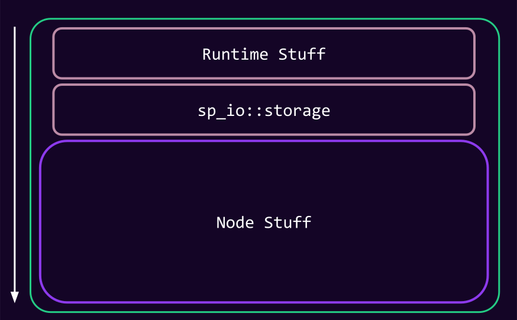

Notes:

- Runtime interacts with Client/Host using Host functions.
- sp_io::storage helps with saving runtime state in the client using these host functions.

---v

#### Externalities

> Externalities: An environment in which the runtime can access host functions, namely storage ones.

Notes:

- In Substrate, a type needs to provide the environment in which host functions are provided, and can be executed.
- We call this an "externality environment", represented
  by [`trait Externalities`](https://paritytech.github.io/substrate/master/sp_externalities/trait.Externalities.html).
- By convention, an externality has a "**backend**" that is in charge of dealing with storage.
- Externality is a trait that provides functionality to interact with storage and other extensions registered in the
  node.

---v

### What We Know So Far


---v

### What We Know So Far

- Recall that at the `sp_io` layer, you have **opaque keys and values**.

```rust
    let storage_key = vec![8, 2];
    sp_io::storage::get(storage_key);
    sp_io::storage::set(storage_key, vec![42, 33]);

```

---v

### What We Know So Far

```rust
  sp_io::TestExternalities::new_empty().execute_with(|| {
        sp_io::storage::get(..);
    });
```

Notes:

- TestExternalities mimic a client.

---

## Key Value

> This seems to indicate our storage could be key-value all the way.. 🤔

---v

### Key Value

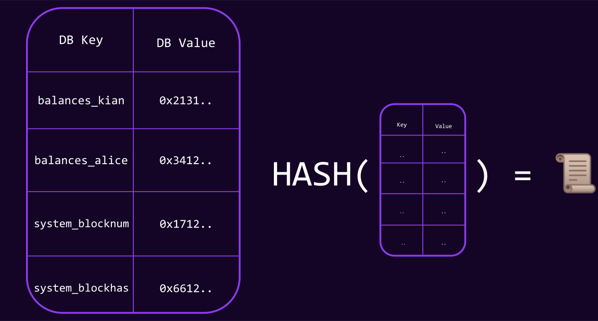

---v

### Key Value

- Concatenate all data and hash to get the root.
- O(1) read and write.

> Spoiler, that is not how data is stored internally in the database.

<!-- .element: class="fragment" -->

Notes:

- "_Storage keys_" (whatever you pass to `sp_io::storage`) directly maps to "_database keys_".
- Probably don't wanna introduce storage key and db key right now.
  Good time to hammer down what you mean by storage key and what you mean by database key.

literally imagine that in the implementation of `sp_io::storage::set`, we write it to a key-value
database.

---v

### Key Value: Proof sizes

- Suppose there is a large database.
- Alice has the state root of this database, wants to lookup her balance from this database.
- How can Alice verify the balance she receives from a full node is correct?

SEND HER THE WHOLE DATABASE 😱.

<!-- .element: class="fragment" -->

Notes:

Alice is representing a light client, I represent a full node.

---v

### Key Value: State Root

- If you change a single key-value, we need to re-hash the whole thing again to get the updated state root 🤦.

---

## Substrate Storage: Merklized

> Substrate uses a base-16, (patricia) radix merkle tree.

Notes:

- Find the code at [paritytech/trie](https://github.com/paritytech/trie).

---

### Recap

<pba-cols>
<pba-col>

<diagram class="mermaid">
%%{init: {'theme': 'dark', 'themeVariables': { 'darkMode': true }}}%%
flowchart TD
  A["A \n value: Hash(B|C)"] --> B["B \n value: Hash(D|E)"]
  A --> C["C \n value: Hash(F) \n"]
  B --> D["D \n value: 0x12"]
  B --> E["E \n value: 0x23"]
  C --> F["F \n value: 0x34"]
</diagram>

</pba-col>
<pba-col>

- Merkle tree.
- Typically contains values at leafs.

</pba-col>
</pba-cols>

---v

### Recap

<pba-cols>
<pba-col>

<diagram class="mermaid">
%%{init: {'theme': 'dark', 'themeVariables': { 'darkMode': true }}}%%
flowchart TD
  A["A \n value: Hash(B|C)"] -- v --> B["B \n value: Hash(D|E)"]
  A --w--> C["C \n Hash(F) \n"]
  B --"x"--> D["D \n value: 0x12"]
  B --y--> E["E \n value: 0x23"]
  C --z--> F["F \n value: 0x34"]
</diagram>

</pba-col>
<pba-col>

- Trie aka. Prefix tree
- Assuming only leafs have data, this is encoding:

<table>
<tr>
  <td> "vx" => 0x12</td>
</tr>
<tr>
  <td> "vy" => 0x23</td>
</tr>
<tr>
  <td> "wz" => 0x34</td>
</tr>
</table>

</pba-col>
</pba-cols>

Notes:

- this is how we encode key value based data in a trie.
- Optimization of simple trie,

---v

### Recap

<pba-cols>
<pba-col>

<diagram class="mermaid">
%%{init: {'theme': 'dark', 'themeVariables': { 'darkMode': true }}}%%
flowchart TD
  A["A \n Hash(B|C)"] -- v --> B["B \n Hash(D|E)"]
  A --wz--> F["F \n value: 0x34"]
  B --"x"--> D["D \n value: 0x12"]
  B --y--> E["E \n value: 0x23"]
</diagram>

</pba-col>
<pba-col>

- Radix Tree.
- Less nodes to encode the same data.

<table>
<tr>
  <td> "vx" => 0x12</td>
</tr>
<tr>
  <td> "vy" => 0x23</td>
</tr>
<tr>
  <td> "wz" => 0x34</td>
</tr>
</table>

</pba-col>
</pba-cols>

Notes:

More resources:

- https://en.wikipedia.org/wiki/Merkle_tree
- https://en.wikipedia.org/wiki/Radix_tree
- https://en.wikipedia.org/wiki/Trie

Namely:

> The data structure was invented in 1968 by Donald R. Morrison, with whom it is primarily
> associated, and by Gernot Gwehenberger.

> Donald Knuth, pages 498-500 in Volume III of The Art of Computer Programming, calls these
> "Patricia's trees", presumably after the acronym in the title of Morrison's paper: "PATRICIA -
> Practical Algorithm to Retrieve Information Coded in Alphanumeric".
> Today, Patricia tries are seen
> as radix trees with radix equals 2, which means that each bit of the key is compared individually
> and each node is a two-way (i.e., left versus right) branch.

---

### Merklized

- Substrate does in fact use a key-value based database under the hood.
- But this KV based DB is used to store the trie nodes, not directly the storage keys.
  <br />

<div>

- We take the **storage key**, and make it to be the path on a trie.

</div>
<!-- .element: class="fragment" -->

<div>

- Then we store the **trie nodes**, referenced by **their hash**, in the main database.

</div>
<!-- .element: class="fragment" -->

---v

### Merklized

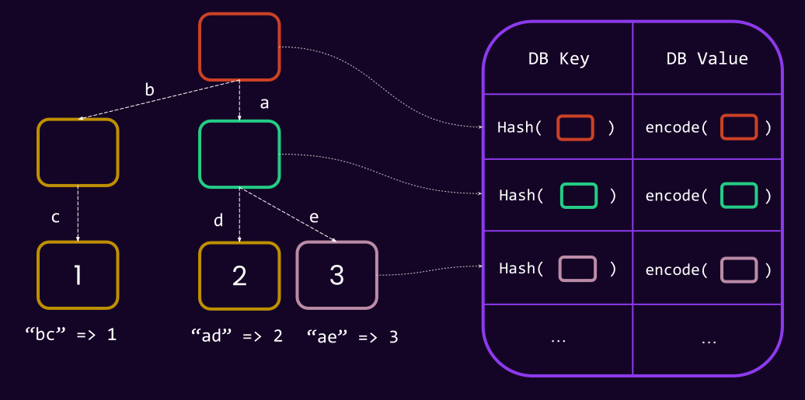

Notes:

- imagine: `sp_io::storage::get(b"ad")`
- We will traverse the path later.

---v

### Merklized

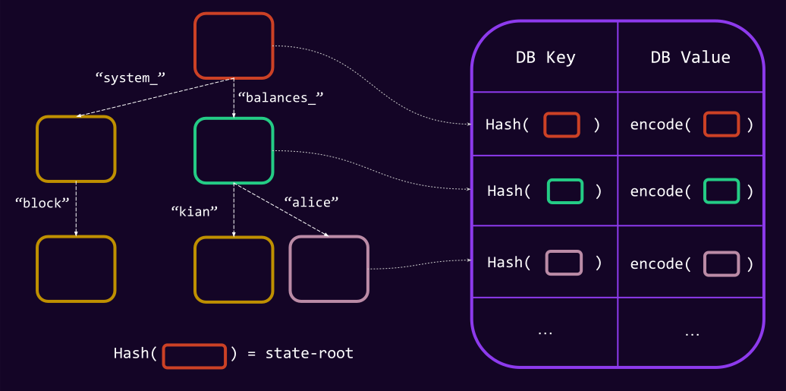

Notes:

realistically, the storage key is something like `(system_)16`, but I have put the strings here for
simplification.

---

## Traversing the Trie

- We know the state-root at a given block `n`.
- Assume this is a base-27, patricia trie.
  English alphabet along with '\_' is the key-scope.
- Let's see the steps needed to read `balances_alice` from the storage.

---v

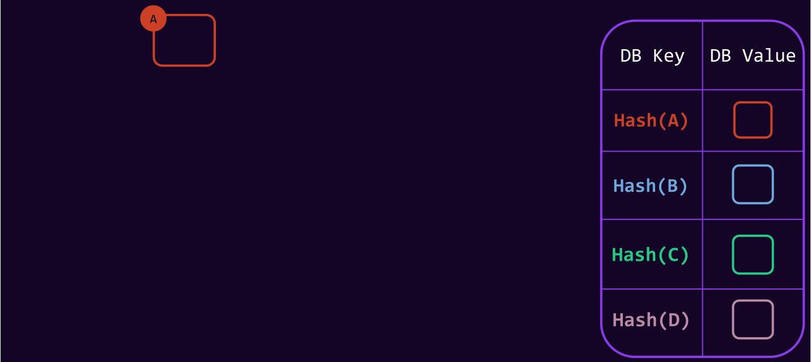

Notes:

- We start with the state root node.
- Read its children.

---v


Notes:

- We are interested in "balances\_" so we read that node from database.
- Did you notice the mistake in the slide? "\_" technically would not be allowed in base-26, so it really is base-27.

---v


---v


---v

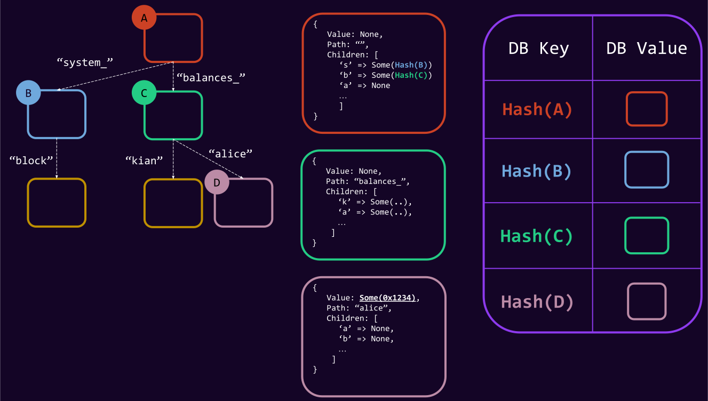

---v

## Q/A Break


Try inserting (and deleting) bunch of keys and see how you fill up the trie in
the [radix tree visualization](https://www.cs.usfca.edu/~galles/visualization/RadixTree.html).

---

## Merklized: Proofs

Back to our question

> If alice only has this state root, how can she verify her balance is correct?

---v

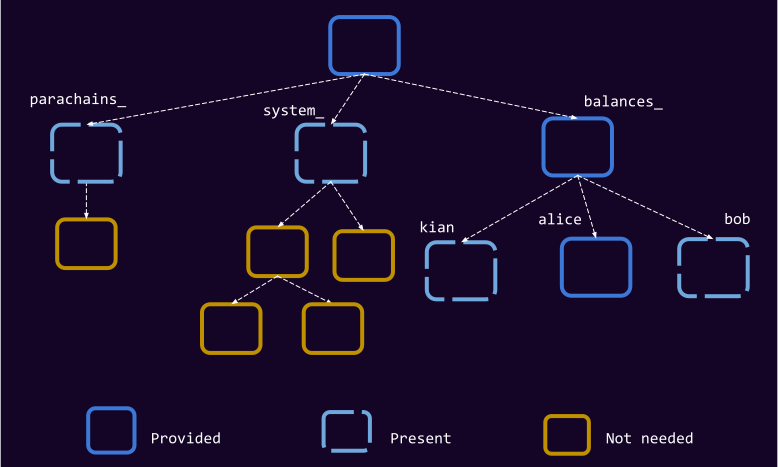

Notes:

Give 30 seconds to students to make sense of the image by themselves.

The important point is that for example the whole data under `_system` is hidden away behind one hash.

Receiver will hash the root node, and check it against a publicly known storage root.

This differs slightly from how actual proof generation might work in the code.

In general, you have a tradeoff: send more data, but require less hashing on Alice, or opposite (this is what we call "
compact proof").

---v

### Merklized: Proofs

- 🏆 Small proof size is a big win for light clients.

---

## Merklized: Recap

<div>

- Storage key (`balances_alice`) is the path on the trie.
- `sp_io::storage::get("balances_alice");`

</div>
<!-- .element: class="fragment" -->

<div>

- Storage key is arbitrary length.

</div>
<!-- .element: class="fragment" -->

<div>

- Intermediary (branch) nodes could contain values.
  - `:code` contains some value, `:code:more` can also contain value.

</div>

<!-- .element: class="fragment" -->

<div>

- Storage Key != Database Key.
- 1 Storage access = Many database access.

</div>
<!-- .element: class="fragment" -->

Notes:

how many database access would do you think it is?

we will explain this in a few slides, but assuming an order `N` tree, and assuming it is balanced,
it will be `O(LOG_n)`.

---

## Substrate Storage: The Updated Picture


---

### Unbalanced Tree

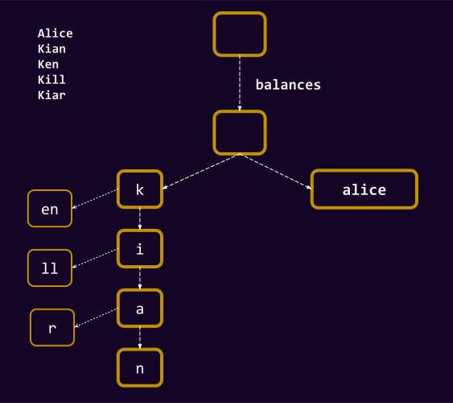

---v

### Unbalanced Tree

- Unbalanced tree means unbalanced performance.
  An attack vector, if done wrong.
- More about this in FRAME storage, and how it is prevented there.

Notes:

- under-estimate weight/gas etc.
- You as the runtime developer must ensure that you use the right keys.
- This is particularly an issue if an end user can control where they can insert into the trie!
- The main prevention is using a cryptographically secure hash function on the frame side.

---

## Trie Caching 🤔

- We rarely care about state root and all the trie shenanigans before the end of the block...

> A block-scoped cache for storage.

<!-- .element: class="fragment" -->

Notes:

In other words, one should care too much about updating a "trie" and all of its hashing details while the block is still
being executed?
All of that can be delayed.

---v

## Overlay

- Is a cache layer **outside of the Runtime**.
- It works **based on key-values**, **not trie-format**.

---v

### Overlay

- Almost identical semantic to your CPU cache:
  - <!-- .element: class="fragment" --> Once you read a value, it stays here, and can be re-read for cheap.
  - <!-- .element: class="fragment" --> Once you write a value, it will only be written here.
    - It can be read for cheap.
  - <!-- .element: class="fragment" --> All writes are flushed when all extrinsics for a block are applied.
- <!-- .element: class="fragment" --> No race conditions as runtime is single-threaded.

---v

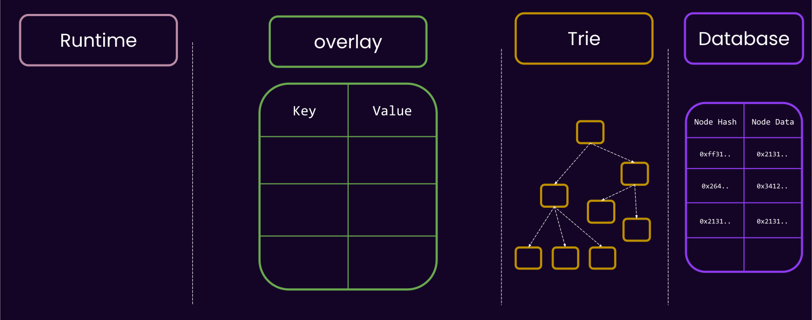

---v

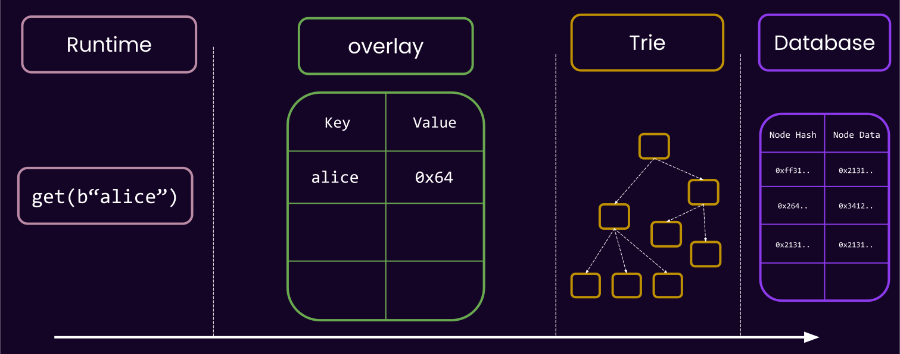

---v


---v


---v

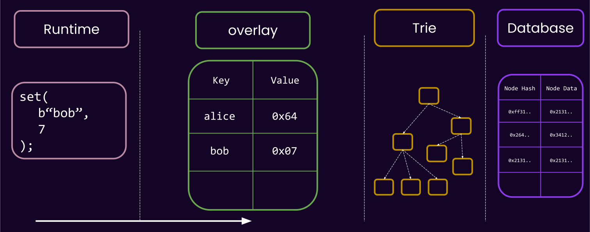

---v


---v

### Overlay

<pba-cols>

<pba-col>

- Cheap != Free

</pba-col>
<pba-col>


</pba-col>

</pba-cols>

Notes:

- In your code, you often have an option to either pass stack variables around, or re-read code from `sp-io`.
  Most often, this is a micro-optimization that won't matter too much, but in general you should know that the former is
  more performant, as won't go the the host at all.
- A deletion is basically a write to `null`.

---v

### Overlay

- The overlay is also able to spawn child-overlays, known as "_storage layer_".
- Useful for having a _transactional_ block of code.

```rust
// spawn a new layer.
with_storage_layer(|| {
    let foo = sp_io::storage::read(b"foo");
    sp_io::storage::set(b"bar", foo);

    if cond {
        Err("this will be reverted")
    } else {
        Ok("This will be commit to the top overlay")
    }
})
```

<!-- .element: class="fragment" -->

Notes:

- implement with zero-copy. So, the size of values is not so important, it is more about the number.

---v

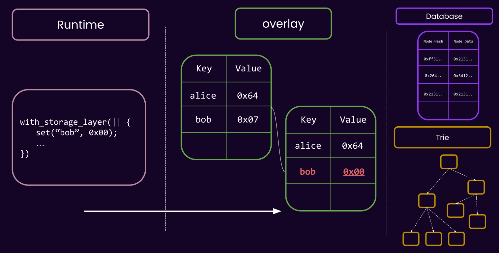

---v


---v

### Overlay

- What if I call `sp_io::storage::root()` in the middle of the block?
- Can the overlay respond to this?

Notes:

NO!
The overlay works on the level on key-values, it knows nothing of trie nodes, and to compute the root we have to go to
the trie layer and pull a whole lot of data back from the disk and build all the nodes etc.

---v

### Overlay: More Caches

- There are more caches in the trie layer as well. But outside of the scope of this lecture.

```bash
./substrate --help | grep cache
```

Notes:

https://www.youtube.com/embed/OoMPlJKUULY

---

### Substrate Storage: Final Figure

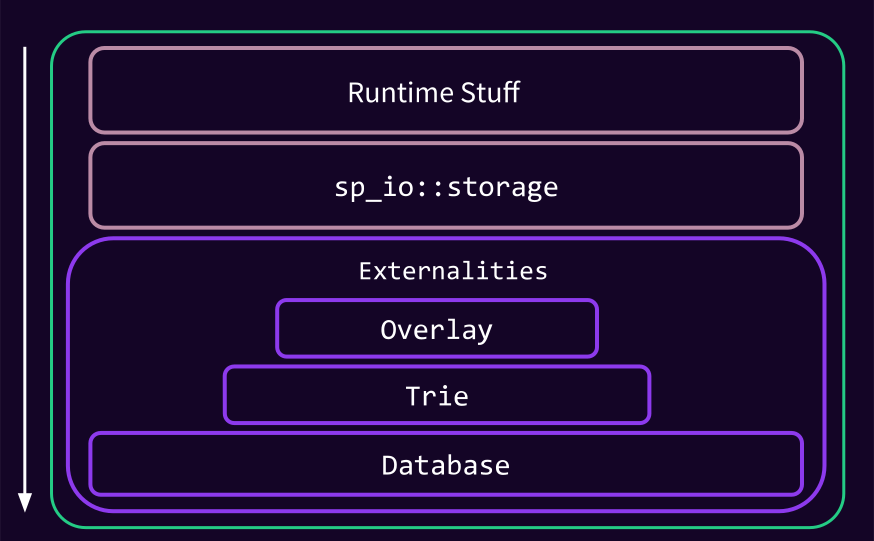

---v

### Substrate Storage

- Recall: Any code accessing host functions needs to wrapped in something that implements
  `Externalities`

```rust
// ❌
let x = sp_io::storage::get(b"foo");

// error:
// thread '..' panicked at '`get_version_1` called outside of an Externalities-provided environment.'
```

```rust
// ✅
SomeExternalities.execute_with(|| {
    let x = sp_io::storage::get(b"foo");
});
```

---

## State Pruning

- Each runtime will think that it has access to **_its_** full state, behind `sp_io::storage`.
- Does the client then store one full trie per-block?

Surely not.

<!-- .element: class="fragment" -->

Notes:

- Only trie nodes that are updated from one block to the other are created as new DB Keys.
- For the unchanged ones, we only reference the existing one.

---v

### State Pruning


---v

### State Pruning


---v

### State Pruning


---v

### State Pruning

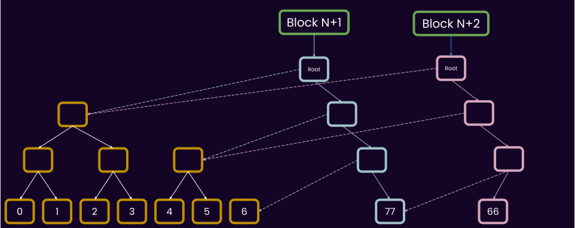

---v

## State Pruning

- 🧠 Data stored onchain, but rarely changed? De nada.
- State pruning is an _entirely client side optimization_,

---

## Base 2, Base 16, Base-26?

- Instead of alphabet, we use the base-16 representation of everything.

> Base-16 (Patricia) Merkle Trie.

- `System` -> `73797374656d`
- `:code` -> `3a636f646500`

---v

### Base 2, Base 16, Base-26?

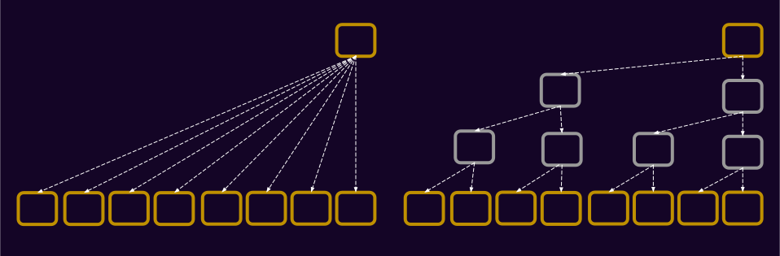
<!-- TODO: update figure to represent node size. -->

Tradeoff: "_IO count vs. Node size_"

<!-- .element: class="fragment" -->

Between a light client and a full node, who cares more about which?

<!-- .element: class="fragment" -->

Notes:

Light client cares about node size.
When proof is being sent, there is no IO.

First glance, the radix-8 seems better: you will typically have less DB access to reach a key.
For example, with binary, with 3 IO, we can reach only 8 items, but with radix-8 512.

So why should not choose a very wide tree?
Because the wider you make the tree, the bigger each node gets, because it has to store more hashes.
At some point, this start to screw with both the proof size and the cost of reading/writing/encoding/decoding all these
nodes.

---v

### Base 2, Base 16, Base-26?

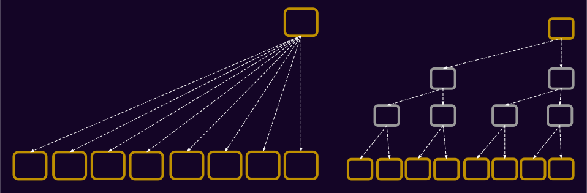

Note:

Here's a different way to represent it; the nodes are bigger on the base-8 trie.

---v

### Base 2, Base 16, Base-26?

- base-2: Small proofs, more nodes.
- base-26: Bigger proofs, less nodes.

Notes:
✅ 16 has been benchmarked as a good middle-ground.

---

#### Lecture Summary/Recap:

<pba-cols>

<pba-col>

- KV-Based storage
- Merklized storage, and proofs
- Unbalanced tree
- State pruning
- Radix order consequences

In the Appendix, you will find:

- Large nodes affecting the proof
- Child tries

</pba-col>

<pba-col>

</pba-col>

</pba-cols>

---

## Additional Resources! 😋

- Check speaker notes (click "s" 😉).
- Follows some additional content that is not covered.


Notes:

- Shawn's deep dive: https://www.shawntabrizi.com/blog/substrate/substrate-storage-deep-dive/

- Basti's talk on Trie caching: https://www.youtube.com/watch?v=OoMPlJKUULY

- About state version:

  - https://github.com/paritytech/substrate/pull/9732
  - https://github.com/paritytech/substrate/discussions/11824

- An "old but gold" read about trie in
  Ethereum: https://medium.com/shyft-network/understanding-trie-databases-in-ethereum-9f03d2c3325d

- On optimizing substrate storage proofs: https://github.com/paritytech/substrate/issues/3782
- Underlying trie library maintained by Parity: https://github.com/paritytech/trie

- https://github.com/paritytech/trie/

- https://spec.polkadot.network/chap-state#sect-state-storage

- https://research.polytope.technology/state-(machine)-proofs

- An interesting, but heretical idea: can the runtime of block N, access state of block N-1?
  HELL.
  NO.
  It might sound like a "but why nooooot" type of situation, but it breaks down all assumptions
  about what a state transition is.
  The runtime is the state transition function.
  Recall the formula of that, and then you will know why this is not allowed.

### Post Lecture Feedback

Double check the narrative and example of the `BIG_STUFF` node.
An example/exercise of some sort
would be great, where students call a bunch of `sp_io` functions, visualize the trie, and invoke
proof recorder, and see which parts of the trie is exactly part of the proof.

---

## Appendix

Content that is not covered, but is relevant.

---

### Overlay Limits

- There is a limit to how many nested layers you can spawn
- It is not free, thus it is attack-able.

```rust
with_storage_layer(|| {
    let foo = sp_io::storage::read(b"foo");
    with_storage_layer(|| {
        sp_io::storage::set(b"foo", b"foo");
        with_storage_layer(|| {
            sp_io::storage::set(b"bar", foo);
            with_storage_layer(|| {
                sp_io::storage::set(b"foo", "damn");
                Err("damn")
            })
            Ok("what")
        })
        Err("the")
    });
    Ok("hell")
})
```

---

## Trie Format Matters!

- Recall that in our "trie walking", we took the state root, and got the root node from the DB.
- The state root of any substrate-based chain, including Polkadot, is the hash of the "Trie Node".

> Trie format matters! and therefore it is part of [the polkadot spec](https://spec.polkadot.network).

Notes:

Meaning, if another client wants to sync polkadot, it should know the details of the trie format.

---

## Child Trees

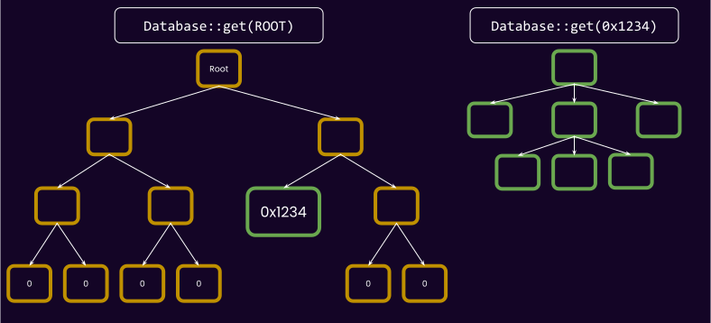

Notes:

Shawn's answer on usecases: https://substrate.stackexchange.com/questions/139/what-are-good-use-cases-for-child-tries/144#144

- Used in smart contracts for being able to delete contract data and reinstate later.
- Generating proof of contribution to crowdloan.
- Alternative trie format.

---v

### Child Trees

- Stored on a different DB Column (async-ish bulk deletion).
- Easily prove-able
- Most importantly, alternative trie formats.

---

## Large data nodes 🤔

- Two common problems that merkle proofs have:
  - If the one of the parent nodes has some large data.
  - If you want to prove the deletion/non-existence of a leaf node.

---v


---v

## Large data nodes 🤔

New "trie format" 🌈:

- All data containing more than 32 bytes are replaced with their hash (pointer to the actual value).
- The (larger than 32 bytes) value itself stored in the database under this hash.

```rust
struct RuntimeVersion {
    ...
    state_version: 0,
}
```

<!-- .element: class="fragment" -->

---v


What is the ramification of this for full nodes, and light clients?

Notes:

Both read and write have an extra step now, but proof are easier.

Note from emeric: the green node is not really a "real" node, it is just `{ value: BIG_STUFF }` stored in the database.
I will skip this detail for the sake of simplicity.
One can assume that the green node is like any other node in the trie.

---

### Storage Implementation

There are multiple implementations of `Externalities`:

- [`TestExternalities`](https://paritytech.github.io/substrate/master/sp_state_machine/struct.TestExternalities.html):
  - `Overlay`
  - `TrieDb` with `InMemoryBackend`
- [`Ext`](https://paritytech.github.io/substrate/master/sp_state_machine/struct.Ext.html) (the real thing 🫡)
  - `Overlay`
  - `TrieDb` with a real database being the backend
