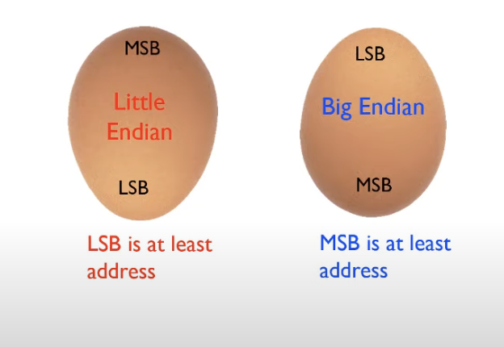
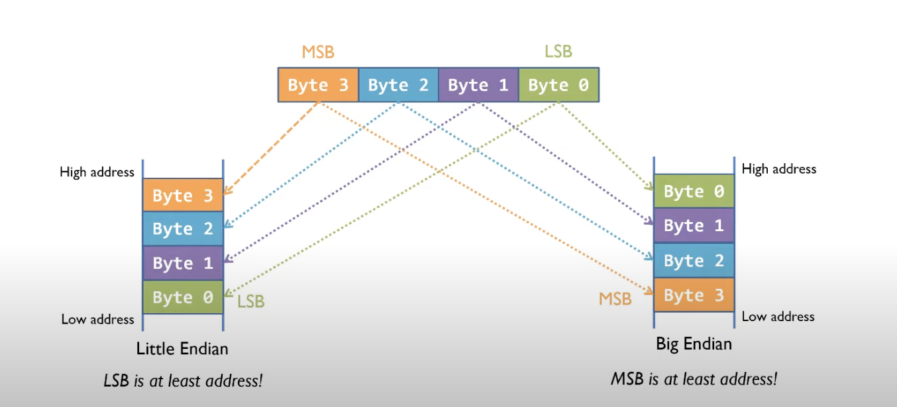
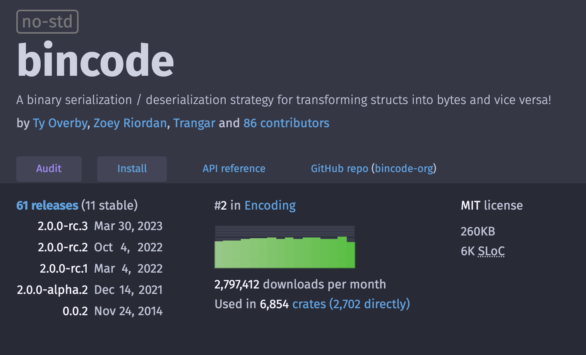
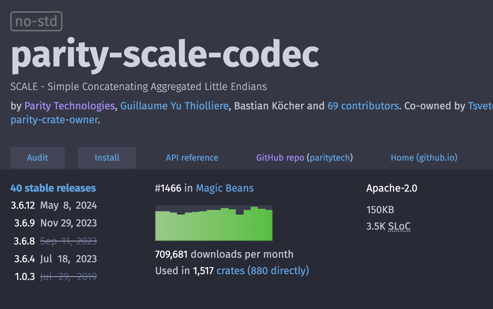

# SCALE Codec

---

## SCALE Codec

At the end of this lecture, you will learn why Substrate uses SCALE codec, how all different kinds of data types are encoded.

---

### SCALE

Simple Concatenated Aggregate Little-Endian

SCALE is a light-weight format which allows encoding (and decoding) which makes it highly suitable
for resource-constrained execution environments like blockchain runtimes and low-power, low-memory
devices.

Notes:

- It is a encoding format used to communicate over the wire. Similar to json, protobuf.
- Extremely light weight, we will see how.

---

### Little-Endian

- Each `word`'s memory address is the address of the smallest byte in the `word`.
- Do we interpret this as the MSB or LSB?
- WASM is Little Endian



---

### Little-Endian



Notes:

- Endianness is the order of bytes.
- Big Endian => Most significant byte at the smallest address. Similar to English. Generally used in network protocols.
- Little Endian => Least significant byte at the smallest address.

---

### Why SCALE? Why not X?

- Simple to define.
- Not Rust-specific (but happens to work great in Rust).
  - Easy to derive codec logic: `#[derive(Encode, Decode)]`
  - It does not use Rust `std`, and thus can compile to Wasm `no_std`.
- Consensus critical / bijective
- Supports a copy-free decode for basic types on LE architectures.

Notes:

- MaxEncodedLen: Maximum encoded size to make some runtime guarantees about computation.
- TypeInfo: Used to generate metadata.
- Bijective exception later.
  - one value will always encode to one blob and that blob will only decode to that value.

---

### Why SCALE? Why not X?

- It is about as thin and lightweight as can be.
- Truthfully, ahead of its time in the Rust community

<pba-cols>
<pba-col center>



</pba-col>

<pba-col center>



</pba-col>
</pba-cols>

---

### SCALE is NOT Self-Descriptive

- The need for metadata!

note:

- It is important to note that the encoding context (knowledge of how the types and data structures look) needs to be known separately at both encoding and decoding ends.
- The encoded data does not include this contextual information.

---

### Example: SCALE vs JSON

<div class="flex-container text-smaller">
<div class="left">

```rust
use parity_scale_codec::{ Encode };

#[derive(Encode)]
struct Example {
	number: u8,
	is_cool: bool,
	optional: Option<u32>,
}

fn main() {
	let my_struct = Example {
		number: 42,
		is_cool: true,
		optional: Some(69),
	};
	println!("{:?}", my_struct.encode());
	println!("{:?}", my_struct.encode().len());
}
```

```sh
[42, 1, 1, 69, 0, 0, 0]
7
```

</div>
<div class="right" style="margin-left: 10px;">

```rust
use serde::{ Serialize };

#[derive(Serialize)]
struct Example {
	number: u8,
	is_cool: bool,
	optional: Option<u32>,
}

fn main() {
	let my_struct = Example {
		number: 42,
		is_cool: true,
		optional: Some(69),
	};
	println!("{:?}", serde_json::to_string(&my_struct).unwrap());
	println!("{:?}", serde_json::to_string(&my_struct).unwrap().len());
}
```

```sh
"{\"number\":42,\"is_cool\":true,\"optional\":69}"
42
```

</div>
</div>

---

### Try It Yourself!

```sh
cargo init temp
cargo add parity-scale-codec --features derive
```

---

### Little vs Big Endian Output

It can be confusing to read the output, and keep in mind endianness.

The order of bytes in the vector follow endianness, but the hex and binary representation of each byte is the same, and independent of endianness.

`0b` prefix denotes a binary representation, and `0x` denotes a hex representation.

<pba-cols>
<pba-col center>

```rust
fn main() {
	println!("{:b}", 69i8);
	println!("{:02x?}", 69i8.to_le_bytes());
	println!("{:02x?}", 69i8.to_be_bytes());
	println!("{:b}", 42u16);
	println!("{:02x?}", 42u16.to_le_bytes());
	println!("{:02x?}", 42u16.to_be_bytes());
	println!("{:b}", 16777215u32);
	println!("{:02x?}", 16777215u32.to_le_bytes());
	println!("{:02x?}", 16777215u32.to_be_bytes());
}
```

</pba-col>

<pba-col center style="margin-left: 10px;">

```sh

1000101
[45]
[45]
101010
[00, 2a]
[2a, 00]
111111111111111111111111
[00, ff, ff, ff]
[ff, ff, ff, 00]


```

</pba-col>
</pba-cols>

---

### Fixed Width Integers

Basic integers are encoded using a fixed-width little-endian (LE) format.

```rust
use parity_scale_codec::Encode;

fn main() {
	println!("{:b}", 258u16);
	println!("{:02x?}", 258u16);
	println!("{:02x?}", 258u16.encode());
	println!("{:02x?}", 16777215u32.encode());
}
```

```sh
1_00000010
102
[02, 01]
[ff, ff, ff, 00]
```

Notes: xx notice the first two being the same. SCALE IS NOT DESCRIPTIVE of the type. The decoder is
responsible for decoding this into some 1 byte-width type, be it u8 or i8 or something else.

Note that a normal <type>.encode() is printed out equivalent to the .to_be_bytes()

---

### Compact Integers

A "compact" or general integer encoding is sufficient for encoding large integers (up to
2<sup>536</sup>) and is more efficient at encoding most values than the fixed-width version.

Though for single-byte values, the fixed-width integer is never worse.

---

### Compact Prefix

<div class="text-small">

<!-- prettier-ignore -->
| `0b00` | `0b01` | `0b10` | `0b11` |
| ------ | ------ | ------ | ------ |
| **single-byte mode**: upper six bits are the LE encoding of the value. Valid only for values of `0` through `63`. | **two-byte mode**: upper six bits and the following byte is the LE encoding of the value. Valid only for values `64` through `(2^14 - 1)`. | **four-byte mode**: upper six bits and the following three bytes are the LE encoding of the value. Valid only for values `(2^14)` through `(2^30 - 1)`. |**Big-integer mode**: The upper six bits are the number of bytes following, plus four. The value is contained, LE encoded, in the bytes following. The final (most significant) byte must be non-zero. Valid only for values `(2^30)` through `(2^536 - 1)`. |

</div>
<br>

- Compact/general integers are encoded with the two least significant **bits** denoting the mode.

Note:

- The ranges must not overlap, or else encoding would be ambiguous. We prefer each number to be encoded in the smallest possible number of bits ofc.
- How is the range 2^536 achieved? (64 + 3) \* 8

---

### Compact Integers: 0

```rust
use parity_scale_codec::{Encode, HasCompact};

#[derive(Encode)]
struct AsCompact<T: HasCompact>(#[codec(compact)] T);

fn main() {
	println!("{:02x?}", 0u8.encode());
	println!("{:02x?}", 0u32.encode());
	println!("{:02x?}", AsCompact(0u8).encode());
	println!("{:02x?}", AsCompact(0u32).encode());
}
```

```sh
[00]
[00, 00, 00, 00]
[00]
[00]
```

---

### Compact Integers: 42

```rust
use parity_scale_codec::{Encode, HasCompact};

#[derive(Encode)]
struct AsCompact<T: HasCompact>(#[codec(compact)] T);

fn main() {
	println!("{:02x?}", 42u8.encode());
	println!("{:02x?}", 42u32.encode());
	println!("{:02x?}", AsCompact(42u8).encode());
	println!("{:02x?}", AsCompact(42u32).encode());
}
```

```sh
[2a]
[2a, 00, 00, 00]
[a8]
[a8]
```

- 42 as binary: `0b101010` = `[0x2a]`.
- Add `00` to the least significant bits.
- `0b10101000` = `[0xa8]` = 168 as decimal.

---

### Compact Integers: 69

```rust
use parity_scale_codec::{Encode, HasCompact};

#[derive(Encode)]
struct AsCompact<T: HasCompact>(#[codec(compact)] T);

fn main() {
	println!("{:02x?}", 69u8.encode());
	println!("{:02x?}", 69u32.encode());
	println!("{:02x?}", AsCompact(69u8).encode());
	println!("{:02x?}", AsCompact(69u32).encode());
}
```

```sh
[45]
[45, 00, 00, 00]
[15, 01]
[15, 01]
```

- 69 as binary: `0b1000101` = `[0x45]`.
- Add `01` to the least significant bits.
- `0b100010101` = `[0x15, 0x01]` = 277 as decimal.

---

### Compact Integers: 65535 (u16::MAX)

```rust
use parity_scale_codec::{Encode, HasCompact};

#[derive(Encode)]
struct AsCompact<T: HasCompact>(#[codec(compact)] T);

fn main() {
	println!("{:02x?}", 65535u16.encode());
	println!("{:02x?}", 65535u32.encode());
	println!("{:02x?}", AsCompact(65535u16).encode());
	println!("{:02x?}", AsCompact(65535u32).encode());
}
```

```sh
[ff, ff]
[ff, ff, 00, 00]
[fe, ff, 03, 00]
[fe, ff, 03, 00]
```

- 65535 as binary: `0b1111111111111111` = `[0xff, 0xff]`.
- Add `10` to the least significant bits.
- `0b111111111111111110` = `[0xfe, 0xff, 0x03, 0x00]`: 262142 as decimal.

---

### Compact Integers Are "Backwards Compatible"

- For any unsigned integer value, regardless of the size/type , there is only one compact encoding.
- As you can see, you are able to "upgrade" a type without affecting the encoding.

```rust
println!("{:02x?}", Compact::<u32>::from(1024).encode());
println!("{:02x?}", Compact::<u64>::from(1024).encode());
println!("{:02x?}", Compact::<u128>::from(1024).encode());
```

---

### Enum

Prefix with index (`u8`), then the value, if any.

```rust
use parity_scale_codec::Encode;

#[derive(Encode)]
enum Example {
	First,
	Second(u8),
	Third(Vec<u8>),
	Fourth,
}

fn main() {
	println!("{:02x?}", Example::First.encode());
	println!("{:02x?}", Example::Second(2).encode());
	println!("{:02x?}", Example::Third(vec![0, 1, 2, 3, 4]).encode());
	println!("{:02x?}", Example::Fourth.encode());
}
```

```sh
[00]
[01, 02]
[02, 14, 00, 01, 02, 03, 04]
[03]
```

---

### Tuple and Struct

Just encode and concatenate the items.

```rust
use parity_scale_codec::Encode;

#[derive(Encode)]
struct Example {
	number: u8,
	is_cool: bool,
	optional: Option<u32>,
}

fn main() {
	let my_struct = Example {
		number: 0,
		is_cool: true,
		optional: Some(69),
	};
	println!("{:02x?}", (0u8, true, Some(69u32)).encode());
	println!("{:02x?}", my_struct.encode());
}
```

```sh
[00, 01, 01, 45, 00, 00, 00]
[00, 01, 01, 45, 00, 00, 00]
```

Notes:

Note that tuple and struct encode the same, even though struct has named fields.

---

## Embedded Compact

```rust
use parity_scale_codec::Encode;

#[derive(Encode)]
struct Example {
	number: u64,
	#[codec(compact)]
	compact_number: u64,
}

#[derive(Encode)]
enum Choices {
	One(u64, #[codec(compact)] u64),
}

fn main() {
	let my_struct = Example { number: 42, compact_number: 1337 };
	let my_choice = Choices::One(42, 1337);
	println!("{:02x?}", my_struct.encode());
	println!("{:02x?}", my_choice.encode());
}
```

```sh
[2a, 00, 00, 00, 00, 00, 00, 00, e5, 14]
[00, 2a, 00, 00, 00, 00, 00, 00, 00, e5, 14]
```

---

### Unit, Bool, Option, and Result

```rust
use parity_scale_codec::Encode;

fn main() {
	println!("{:02x?}", ().encode());
	println!("{:02x?}", true.encode());
	println!("{:02x?}", false.encode());
	println!("{:02x?}", Ok::<u32, ()>(42u32).encode());
	println!("{:02x?}", Err::<u32, ()>(()).encode());
	println!("{:02x?}", Some(42u32).encode());
	println!("{:02x?}", None::<u32>.encode());
}
```

```sh
[]
[01]
[00]
[00, 2a, 00, 00, 00]
[01]
[01, 2a, 00, 00, 00]
[00]
```

---

### Arrays, Vectors, and Strings

- Arrays: Just concatenate the items.
- Vectors: Also prefix with length (compact encoded).
- String: Just `Vec<u8>` as utf-8 characters.

```rust
use parity_scale_codec::Encode;

fn main() {
	println!("{:02x?}", [0u8, 1u8, 2u8, 3u8, 4u8].encode());
	println!("{:02x?}", vec![0u8, 1u8, 2u8, 3u8, 4u8].encode());
	println!("{:02x?}", Compact::<u32>::from(5).encode());
	println!("{:02x?}", "hello".encode());
	println!("{:02x?}", vec![0u8; 1024].encode());
	println!("{:02x?}", Compact::<u32>::from(1024).encode());
}
```

```sh
[00, 01, 02, 03, 04]
[14, 00, 01, 02, 03, 04]
[14]
[14, 68, 65, 6c, 6c, 6f]
[01, 10, 00, 00, ... snip ... , 00]
[01, 10]
```

Notes:

Note that the length prefix can be multiple bytes, like the last example.

---

### Decoding

- We can similarly take raw bytes, and decode it into a well known type.
- Metadata can be used to convey to a program how to decode a type properly...
- But bad or no information means the proper format for the data cannot be known.

---

### Decoding Examples

```rust
use parity_scale_codec::{ Encode, Decode, DecodeAll };

fn main() {
	let array = [0u8, 1u8, 2u8, 3u8];
	let value: u32 = 50462976;

	println!("{:02x?}", array.encode());
	println!("{:02x?}", value.encode());
	println!("{:?}", u32::decode(&mut &array.encode()[..]));
	println!("{:?}", u16::decode(&mut &array.encode()[..]));
	println!("{:?}", u16::decode_all(&mut &array.encode()[..]));
	println!("{:?}", u64::decode(&mut &array.encode()[..]));
}
```

```sh
[00, 01, 02, 03]
[00, 01, 02, 03]
Ok(50462976)
Ok(256)
Err(Error { cause: None, desc: "Input buffer has still data left after decoding!" })
Err(Error { cause: None, desc: "Not enough data to fill buffer" })
```

Notes:

- Decoding can fail
- Values can decode badly

---

### Decode Limits

- Decoding isn't free!
- The more complex the decode type, the more computation that will be used to decode the value.
- Generally you always want to `decode_with_depth_limit`.
- Substrate uses a limit of 256.

---

### Decode Bomb

Here is an example of a decode bomb.

```rust
use parity_scale_codec::{ Encode, Decode, DecodeLimit };

#[derive(Encode, Decode, Debug)]
enum Example {
	First,
	Second(Box<Self>),
}

fn main() {
	let bytes = vec![1, 1, 1, 1, 1, 0];
	println!("{:?}", Example::decode(&mut &bytes[..]));
	println!("{:?}", Example::decode_with_depth_limit(10, &mut &bytes[..]));
	println!("{:?}", Example::decode_with_depth_limit(3, &mut &bytes[..]));
}
```

```sh
Ok(Second(Second(Second(Second(Second(First))))))
Ok(Second(Second(Second(Second(Second(First))))))
Err(Error { cause: Some(Error { cause: Some(Error { cause: Some(Error { cause: Some(Error { cause: None, desc: "Maximum recursion depth reached when decoding" }), desc: "Could not decode `Example::Second.0`" }), desc: "Could not decode `Example::Second.0`" }), desc: "Could not decode `Example::Second.0`" }), desc: "Could not decode `Example::Second.0`" })
```

Note:

question to ask: Will encoding of `T` or `Box<T>` differ? no

---

### Exceptions: BTreeSet

- BTreeSet will decode from an unordered set, but will also order them as a result.
- Be careful... this one isn't bijective.

```rust
use parity_scale_codec::{ Encode, Decode, alloc::collections::BTreeSet };

fn main() {
	let vector = vec![4u8, 3u8, 2u8, 1u8, 0u8];
	let vector_encoded = vector.encode();
	let btree = BTreeSet::<u8>::decode(&mut &vector_encoded[..]).unwrap();
	let btree_encoded = btree.encode();

	println!("{:02x?}", vector_encoded);
	println!("{:02x?}", btree_encoded);
}
```

```sh
[14, 04, 03, 02, 01, 00]
[14, 00, 01, 02, 03, 04]
```

note: SCALE is bijective within one type.

---

### Optimizations and Tricks

- `DecodeLength`: Read the length of a collection (like `Vec`) without decoding everything.
- `EncodeAppend`: Append an item without decoding all the other items. (like `Vec`)

Note:

https://paritytech.github.io/polkadot-sdk/master/frame_support/storage/trait.StorageDecodeLength.html?search=DecodeLength
https://paritytech.github.io/polkadot-sdk/master/frame_support/storage/trait.StorageDecodeLength.html?search=EncodeAppend

---

### Implementations

SCALE Codec has been implemented in other languages, including:

- Python: [`polkascan/py-scale-codec`](https://github.com/polkascan/py-scale-codec)
- Golang: [`itering/scale.go`](https://github.com/itering/scale.go)
- C: [`MatthewDarnell/cScale`](https://github.com/MatthewDarnell/cScale)
- C++: [`soramitsu/scale-codec-cpp`](https://github.com/soramitsu/scale-codec-cpp)
- JavaScript: [`polkadot-js/api`](https://github.com/polkadot-js/api)
- TypeScript: [`scale-ts`](https://github.com/unstoppablejs/unstoppablejs/tree/main/packages/scale-ts#scale-ts)
- AssemblyScript: [`LimeChain/as-scale-codec`](https://github.com/LimeChain/as-scale-codec)
- Haskell: [`airalab/hs-web3`](https://github.com/airalab/hs-web3/tree/master/packages/scale)
- Java: [`emeraldpay/polkaj`](https://github.com/emeraldpay/polkaj)
- Ruby: [`wuminzhe/scale_rb`](https://github.com/wuminzhe/scale_rb)

---

## Missing Some Metadata?

- To make SCALE useful as an encoding format within the Substrate and Polkadot ecosystem, we need to
  figure out a way to provide **metadata** about all the types we will expect, and when we will expect
  them.

- HINT: We do.

---

### Remember, in the end of the day, everything is just 0's and 1's.

---

## Additional Resources! 😋

> Check speaker notes (click "s" 😉)


Notes:

https://www.reddit.com/r/RISCV/comments/131ssuk/why_exactly_riscv_is_little_endian/
