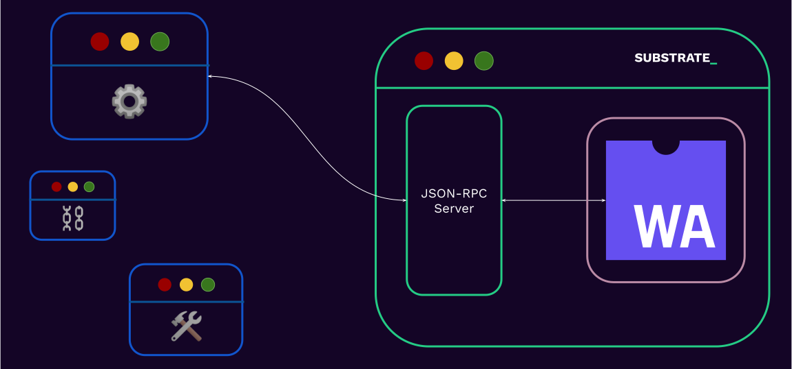

# Interacting With a Substrate Blockchain

---

## Before we start

- Find all the commands that will be used in this workshop in the `speaker notes`:
- Run these two now:

```
cargo install staging-chain-spec-builder
cargo install --force --git https://github.com/kianenigma/pba-omni-node.git
```

Notes:

Install stuff
cargo install staging-chain-spec-builder
cargo install --force --git https://github.com/kianenigma/pba-omni-node.git

generate chain-spec file
chain-spec-builder create --chain-name pba-chain -r ./target/release/wbuild/minimal-template-runtime/minimal_template_runtime.wasm default

add some stuff to `balances.balances`

["5GrwvaEF5zXb26Fz9rcQpDWS57CtERHpNehXCPcNoHGKutQY", 1000000],
["5FHneW46xGXgs5mUiveU4sbTyGBzmstUspZC92UhjJM694ty", 1000000],
["5FLSigC9HGRKVhB9FiEo4Y3koPsNmBmLJbpXg2mp1hXcS59Y", 1000000],
["5DAAnrj7VHTznn2AWBemMuyBwZWs6FNFjdyVXUeYum3PTXFy", 1000000],
["5HGjWAeFDfFCWPsjFQdVV2Msvz2XtMktvgocEZcCj68kUMaw", 1000000],
["5CiPPseXPECbkjWCa6MnjNokrgYjMqmKndv2rSnekmSK2DjL", 1000000],
["5GNJqTPyNqANBkUVMN1LPPrxXnFouWXoe2wNSmmEoLctxiZY", 1000000],
["5HpG9w8EBLe5XCrbczpwq5TSXvedjrBGCwqxK1iQ7qUsSWFc", 1000000],
["5Ck5SLSHYac6WFt5UZRSsdJjwmpSZq85fd5TRNAdZQVzEAPT", 1000000],
["5HKPmK9GYtE1PSLsS1qiYU9xQ9Si1NcEhdeCq9sw5bqu4ns8", 1000000],
["5FCfAonRZgTFrTd9HREEyeJjDpT397KMzizE6T3DvebLFE7n", 1000000],
["5CRmqmsiNFExV6VbdmPJViVxrWmkaXXvBrSX8oqBT8R9vmWk", 1000000],
["5Fxune7f71ZbpP2FoY3mhYcmM596Erhv1gRue4nsPwkxMR4n", 1000000],
["5CUjxa4wVKMj3FqKdqAUf7zcEMr4MYAjXeWmUf44B41neLmJ", 1000000]

Change chain typw

"chainType": "Development"

"properties": {
"tokenDecimals": 1,
"tokenSymbol": "PBA"
},

Now you are ready for PJS

---

## Running a Substrate Chain

- The 2024 and beyond edition
- omni-node-driven-future

Note:

https://forum.polkadot.network/t/polkadot-parachain-omni-node-gathering-ideas-and-feedback/7823/4

---v

## Running a Substrate Chain

- A Substrate node was meant to be oblivious to the runtime
- Truth is that we have cheated a bit for some optimizations over the years
  - Genesis state
  - Native runtime for debugging

...

- Now, we are moving back towards removing the native runtime.
- Node can be fully oblivious to the runtime, except for some _assumptions_:
  - Consensus, Block/Header format, database type

#### ☯️ !!Omni Nodes!! ☯️

---v

## Running a Substrate Chain

- A runtime template --> `.wasm` file
  - Exposes some apis that define how the genesis state should be built
- A `chain-spec` file
  - Specification of the chain, most notably includes **genesis state**.
  - Possibly generated with `chain-spec-builder`
- `./omni-node --chain spec.json --tmp...`

Note:

https://paritytech.github.io/polkadot-sdk/master/sc_chain_spec/index.html

---

## Interacting With a Substrate Blockchain

> How does a user or an application interact with a blockchain?

Notes:

- Wait for 1 answer from students or at least for 10 seconds.

---v

## Interacting With a Substrate Blockchain

- Usually they connect to a public RPC server, i.e. a substrate node that exposes its RPC interface publicly.

<br/>

- Run their own node.

<!-- .element: class="fragment" -->

---v

## Interacting With a Substrate Blockchain



---

## JSON-RPC

> JSON-RPC is a remote procedure call protocol encoded in JSON. It is similar to the XML-RPC
> protocol, defining only a few data types and commands.

---v

### JSON-RPC

```json
{
  "jsonrpc": "2.0",
  "method": "subtract",
  "params": {
    "minuend": 42,
    "subtrahend": 23
  },
  "id": 3
}
```

<br/>

```json
{
  "jsonrpc": "2.0",
  "result": 19,
  "id": 3
}
```

<!-- .element: class="fragment" -->

---v

### JSON-RPC

- Entirely transport agnostic.
- Substrate based chains expose both `websocket` and `http` (or `wss` and `https`, if desired).

Notes:

- You could choose which port to run the ws or http server on by using the flags `--ws-port` and `--rpc-port`
  respectively. By default, port 9944 is used.

---v

### JSON-RPC

The RPC methods that a substrate node exposes are scoped and has the pattern `"<scope>_<method>"`.

```sh
 wscat \
  -c ws://localhost:9944 \
  -x '{"jsonrpc":"2.0", "id": 42, "method":"rpc_methods" }' \
  | jq
```

---v

### JSON-RPC: Scopes

- &shy;<!-- .element: class="fragment" --> `author`: for submitting extrinsic to the chain.
- &shy;<!-- .element: class="fragment" --> `chain`: for retrieving information about the _blockchain_ data.
- &shy;<!-- .element: class="fragment" --> `state`: for retrieving information about the _state_ data.
- &shy;<!-- .element: class="fragment" --> `system`: information about the chain.
- &shy;<!-- .element: class="fragment" --> `rpc`: information about the RPC endpoints.

Notes:
recall:

https://docs.rs/sc-rpc-api/latest/sc_rpc_api/

- The full list can also be seen here: https://polkadot.js.org/docs/substrate/rpc/
- Specs: https://paritytech.github.io/json-rpc-interface-spec/introduction.html
- Upcoming changes to JSON-RPC api: https://forum.polkadot.network/t/new-json-rpc-api-mega-q-a/3048

---

## Workshop

We will do a transfer twice:

1. Once using the PJS-APPs.
2. Once manually using RPC.

---v

## Workshop: Step 0

- Complete the steps in the README
- Open PJS-APPs and connect to your local node.

> Don't forget to run with `--tmp` flag.

- Ideas:

- Play with `--consensus`
- Try a `transfer`

---v

### Workshop: Check balance

- Query current balance of Alice and Bob.

* To get the storage key: `Developer -> Extrinsics`
* `System -> Account`

```sh
wscat \
  -c ws://localhost:9944 \
  -x '{"jsonrpc":"2.0", "id": 42, "method":"state_getStorage", "params": [""] }' \
  | jq
```

Notes:

- You will learn how the storage key is calculated in FRAME based substrate chains in the FRAME
  module.

---v

### Workshop: Metadata

- Recall type information is lost in SCALE encoded data.
- Substrate exposes type information using metadata.

```sh
wscat \
  -c ws://localhost:9944 \
  -x '{"jsonrpc":"2.0", "id": 42, "method":"state_getMetadata" }' \
  | jq
```

<br/>

- This itself is Scale Encoded. See [frame-metadata](https://github.com/paritytech/frame-metadata).
- Derive type of AccountInfo using this metadata.

<!-- .element: class="fragment" -->

Notes:

- Use PJS app to get frame-metadata: Developer > RPC Calls > state > getMetadata.
- [Metadata](https://hackmd.io/@ak0n/rJUhmXmK6) with most details not relevant stripped off.

```
{
  magicNumber: 1,635,018,093
  metadata: {
    V14: {
      lookup: {
        types: [
          {
            id: 3
            type: {
              path: [
                frame_system
                AccountInfo
              ]
              params: [
                {
                  name: Nonce
                  type: 4
                }
                {
                  name: AccountData
                  type: 5
                }
              ]
              def: {
                Composite: {
                  fields: [
                    {
                      name: nonce
                      type: 4
                      typeName: Nonce
                      docs: []
                    }
                    {
                      name: consumers
                      type: 4
                      typeName: RefCount
                      docs: []
                    }
                    {
                      name: providers
                      type: 4
                      typeName: RefCount
                      docs: []
                    }
                    {
                      name: sufficients
                      type: 4
                      typeName: RefCount
                      docs: []
                    }
                    {
                      name: data
                      type: 5
                      typeName: AccountData
                      docs: []
                    }
                  ]
                }
              }
              docs: []
            }
          }

          ..

          {
            id: 4
            type: {
              path: []
              params: []
              def: {
                Primitive: U32
              }
              docs: []
            }
          }

          ..

          {
            id: 5
            type: {
              path: [
                pallet_balances
                types
                AccountData
              ]
              params: [
                {
                  name: Balance
                  type: 6
                }
              ]
              def: {
                Composite: {
                  fields: [
                    {
                      name: free
                      type: 6
                      typeName: Balance
                      docs: []
                    }
                    {
                      name: reserved
                      type: 6
                      typeName: Balance
                      docs: []
                    }
                    {
                      name: frozen
                      type: 6
                      typeName: Balance
                      docs: []
                    }
                    {
                      name: flags
                      type: 7
                      typeName: ExtraFlags
                      docs: []
                    }
                  ]
                }
              }
              docs: []
            }
          }

          ..


          {
            id: 6
            type: {
              path: []
              params: []
              def: {
                Primitive: U64
              }
              docs: []
            }
          }

          ..

          {
            id: 7
            type: {
              path: [
                pallet_balances
                types
                ExtraFlags
              ]
              params: []
              def: {
                Composite: {
                  fields: [
                    {
                      name: null
                      type: 8
                      typeName: u128
                      docs: []
                    }
                  ]
                }
              }
              docs: []
            }
          }

          ..

          {
            id: 8
            type: {
              path: []
              params: []
              def: {
                Primitive: U128
              }
              docs: []
            }
          }

        ]
      }
      pallets: [],
      extrinsic: {},
      type: 107
    }
  }
}
```

---v

### Workshop: Decoding balance

- Use [scale decoder](https://www.shawntabrizi.com/substrate-js-utilities/codec/) to decode balance.
- Use the following type information for AccountInfo.

```json
{
  "info": {
    "nonce": "u32",
    "ignore": "(u32, u32, u32)",
    "balance": {
      "free": "u64",
      "ignore": "(u64, u64, u128)"
    }
  }
}
```

Notes:
The actual type is:

```json
{
  "info": {
    "nonce": "u32",
    "ignore": "u32",
    "providers": "u32",
    "sufficients": "u32",
    "balance": {
      "free": "u64",
      "reserved": "u64",
      "frozen": "u64",
      "flags": "u128"
    }
  }
}
```

---v

### Workshop: Transfer some tokens

- Take PJS help to get the signed extrinsic.
  - `Developer -> Extrinsics -> Balances -> Transfer`
- Use the following command to submit the extrinsic.

```sh
wscat \
  -c ws://localhost:9944 \
  -x '{"jsonrpc":"2.0", "id": 42, "method":"author_submitExtrinsic", "params": [""] }' \
  | jq
```

- Check balance again for both accounts.
- What happens to nonce of Alice?

Notes:

- Students will learn how to build the signed extrinsic themselves in their assignment.
- Let students do the second part themselves.

---

### Workshop: Versions

- Find runtime version of the polkadot and westend chain `state_getRuntimeVersion`.
- Find node version of the polkadot and westend chain `system_version`.
- Change RPC provider and see if any of the above value changes?

<br/>

- For runtime version, you read `specVersion` : `1,005,000` as `1.5.0`.

<!-- .element: class="fragment" -->

Notes:

- `wscat -c wss://polkadot-rpc.dwellir.com -x '{"jsonrpc":"2.0", "id":1, "method":"state_getRuntimeVersion"}' | jq`.
- `wscat -c wss://polkadot-rpc.dwellir.com -x '{"jsonrpc":"2.0", "id":1, "method":"system_version"}' | jq`.
- Show polkadot telemetry: https://telemetry.polkadot.io/.

---

### JSON-RPC: Application

- On top of `SCALE` and `JSON-RPC`, a large array of libraries have been built.

- `PJS-API` / `PJS-APPS`
- future: `PAPI`
- `subxt`
- Any many more!

---

## Additional Resources! 😋

> Check speaker notes (click "s" 😉)

Notes:

- see "Client Libraries" here: https://project-awesome.org/substrate-developer-hub/awesome-substrate
- https://paritytech.github.io/json-rpc-interface-spec/introduction.html
- Full subxt guide: https://docs.rs/subxt/latest/subxt/book/index.html
- https://github.com/JFJun/go-substrate-rpc-client
- https://github.com/polkascan/py-substrate-interface
- https://github.com/polkadot-api/polkadot-api
- more here: https://project-awesome.org/substrate-developer-hub/awesome-substrate
- Listen to James Wilson introducing subxt: https://www.youtube.com/watch?v=aFk6We_Ke1I

---

### JSON-RPC: Mini Activity

In Kusama:

- Find the genesis hash..
- Number of extrinsics at block 10,000,000.
- The block number is stored under `twox128("System") ++ twox128("Number")`.
- Find it now, and at block 10,000,000.

<br/>

- Refer to the "Substrate; Show Me The Code" lecture to find the right RPC endpoints.
- You have 15 minutes!

Notes:

```sh
# 10,000,000 in hex
printf "%x\n" 10000000
# Genesis hash
wscat -c wss://kusama-rpc.polkadot.io -x '{"jsonrpc":"2.0", "id":72, "method":"chain_getBlockHash", "params": ["0x0"] }' | jq
# Hash of the block at height 10,000,000
wscat -c wss://kusama-rpc.polkadot.io -x '{"jsonrpc":"2.0", "id":72, "method":"chain_getBlockHash", "params": ["0x989680"] }' | jq
# The block at height 1,000,000
wscat -c wss://kusama-rpc.polkadot.io -x '{"jsonrpc":"2.0", "id":72, "method":"chain_getBlock", "params": ["0xdcbaa224ab080f2fbf3dfc85f3387ab21019355c392d79a143d7e50afba3c6e9"] }' | jq

# `0x26aa394eea5630e07c48ae0c9558cef702a5c1b19ab7a04f536c519aca4983ac` now.
wscat -c wss://kusama-rpc.polkadot.io -x '{"jsonrpc":"2.0", "id":72, "method":"state_getStorage", "params": ["0x26aa394eea5630e07c48ae0c9558cef702a5c1b19ab7a04f536c519aca4983ac"] }' | jq
# `0x26aa394eea5630e07c48ae0c9558cef702a5c1b19ab7a04f536c519aca4983ac` at block 1,000,000.
wscat -c wss://kusama-rpc.polkadot.io -x '{"jsonrpc":"2.0", "id":72, "method":"state_getStorage", "params": ["0x26aa394eea5630e07c48ae0c9558cef702a5c1b19ab7a04f536c519aca4983ac", "0xdcbaa224ab080f2fbf3dfc85f3387ab21019355c392d79a143d7e50afba3c6e9"] }' | jq
```

Notice that this number that we get back is the little endian (SCALE) encoded value that we passed in at first.

---

## `subxt`

- Something analogous to `PJS api` for Rust.
- The real magic is that it generates the types by fetching the metadata at compile time, or linking
  it statically.
- ..It might need manual updates when the code, and therefore the metadata changes.
