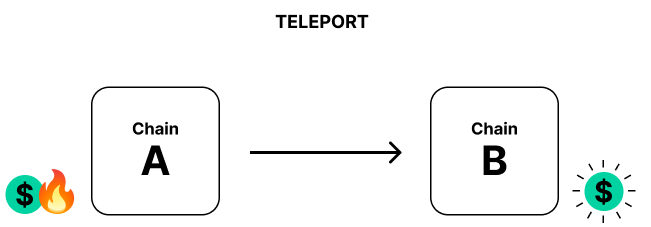

# Cross-consensus transfers

Notes:

The two ways of transferring assets between consensus systems are teleports and reserve transfers.

---v

## 1. Asset teleportation

Notes:

Teleportation works by burning the assets on the source chain and minting them on the destination chain.
This method is the simplest one, but requires a lot of trust, since failure to burn or mint on either side will affect the total issuance.

---v

### 1.1. Example: System parachains?

<diagram class="mermaid">
graph LR
    BridgeHub(Bridge Hub)--"Trust"-->AssetHub(Asset Hub)
</diagram>

---v

### 1.2. Example: Polkadot and Kusama?

<diagram class="mermaid">
graph LR
    Polkadot(Polkadot)--"No trust"-->Kusama(Kusama)
</diagram>

---v

## 2. Reserve asset transfers

Notes:

Reserve asset transfers are more complicated, since they bring in a third actor called the reserve chain.
Chain A and B needn't trust each other, they only need to trust the reserve chain.
The reserve chain holds the real assets, A and B deal only with derivatives.
The transfer is made by burning derivatives from A, moving them from A's SA to B's SA in R, then minting on B.

In some cases, the sender, A, can also be the reserve for a particular asset, in which case the process is simplified, there's no burning of derivatives.
This usually happens with parachains' native tokens.

You always trust the issuer of the token to not mint infinite tokens.

---v

### 2.1. Example: Parachain native tokens

<diagram class="mermaid">
graph LR
    subgraph A [A = R]
        Sender(Sender account)--"Move X real asset"-->BSovereignAccount(B's Sovereign Account)
    end
    A--"Mint X derivatives"-->B(B)
</diagram>

Notes:

Most parachains act as the reserve for their own token.
To transfer their token to other chains, they move the real assets to a sovereign account and then tell the chain to mint equivalent derivatives.

---v

### 2.2. Example: Polkadot to Kusama

<diagram class="mermaid">
graph LR
    Polkadot(Polkadot)-->AssetHubP
    subgraph AssetHubP [Asset Hub Polkadot]
        Sender(Sender account)--"Move X real DOT"-->KusamaSovereignAccount("Kusama's sovereign account")
    end
    AssetHubP--"Mint X DOT derivatives"-->Kusama(Kusama)
</diagram>

Notes:

AssetHub Kusama acts as the reserve for KSM.
Kusama doesn't trust Polkadot to teleport KSM to it, but it does trust its own reserve, the AssetHub.
Polkadot has a sovereign account in Kusama's AssetHub with some amount of KSM.
Whenever some user in Polkadot wants to get KSM on Kusama, they just give the DOT to Polkadot and the KSM are moved from one sovereign account to another.
No new trust relationships are added.

---

# Example

Notes:

We'll look at an example and build on it as the lectures go on.

---v

## Locations

---v

## Assets

---v

## Instructions (simple)

---v

## Instructions (actual)

---

# Next steps

How are these instructions executed?
