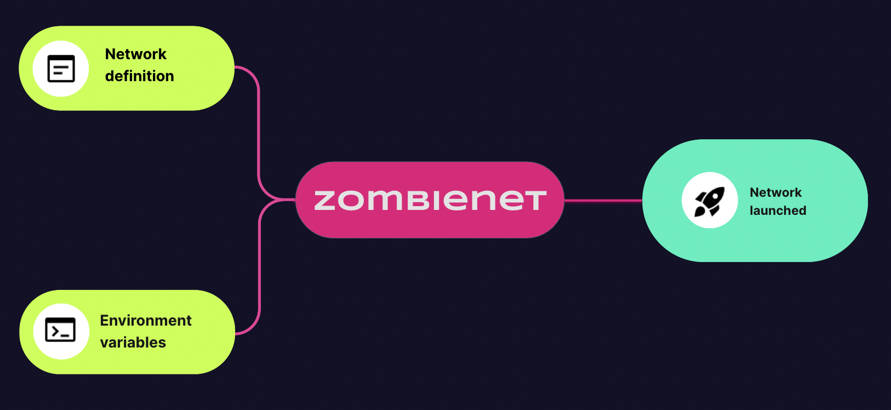

<style>
    .colored {
        color: var(--r-link-color);
    }

    .colored-green {
        color: #18ffb2;
    }

    .colored-light-green {
        color: #c2ff33;
    }
</style>

# Zombienet

---

## What we will learn?

The goal of the lecture is present Zombienet (<span class="colored">v1/v2</span>) and familiarize with the process of setup, spawn and test in both version.

---

## What is Zombienet?

Zombienet is an <span class="colored">integration testing tool</span> that allows users to _<span class="colored">spawn</span>_ and _<span class="colored">test</span>_ ephemeral substrate based networks.

---

## Why Zombienet?

Integration tests are always <span class="colored">complex</span>:

<br/>

<pba-flex center>

- Setup Configuration
<!-- .element: class="fragment" -->
- Port management
<!-- .element: class="fragment" -->
- Ready state off all artifacts
<!-- .element: class="fragment" -->
- Observability
<!-- .element: class="fragment" -->
- Leaking resources
<!-- .element: class="fragment" -->

</pba-flex>

---v

## Friction to resolve

<br/>

<pba-flex center>

- Config flexibility
<!-- .element: class="fragment" -->
- Local environment
<!-- .element: class="fragment" -->
- Maintenance
<!-- .element: class="fragment" -->
- CI friendly
<!-- .element: class="fragment" -->
- Scaling
<!-- .element: class="fragment" -->
- Test-runner
<!-- .element: class="fragment" -->

</pba-flex>

---v

## Design goals

<br/>

<pba-cols style="align-items:normal">
    <pba-col>

##### Hassle free setup

- Toml / json
- Nice defaults
- Templating lang.

</pba-col>
<pba-col>

##### Multiple envs

- **Local**
- **k8s**
- **podman**
- **docker**

</pba-col>
<pba-col>

##### Extensible

- Custom assertions
- Intuitive <span class="colored">D.S.L</span>
- Templating lang.

  </pba-col>
  </pba-cols>

---

<!-- .slide: data-background-color="#4A2439" -->

# Phases

---

## Phases

<pba-cols style="align-items:normal">
<pba-col>

Spawn

- Custom chain-specs
- Custom command
- Port-mapping
- Parachains registration

</pba-col>
<!-- .element: class="fragment" -->
<pba-col>

Test

- Custom <span class="colored">D.S.L</span>
- Multiple assertions
- Extensible
- Custom reporting

</pba-col>
<!-- .element: class="fragment" -->
</pba-cols>

---

## Zombienet Options

<pba-flex center>

- As binary ([releases](https://github.com/paritytech/zombienet/releases))
- As library (@zombienet)
- As container (published in docker hub)
- From source ([zombienet](https://github.com/paritytech/zombienet) repo)

</pba-flex>

Notes:

- As binary: Binaries for Linux and MacOS are available in each release in Github.
- npm packages: cli, orchestrator, utils
- image: docker.io/paritytech/zombienet
  code is available in GitHub with the instructions on how to build and run Zombienet.
  (https://github.com/paritytech/zombienet)

---v

### Download Zombienet

```sh
# macOS (m* chips)
curl -L https://github.com/paritytech/zombienet/releases/download/v1.3.106/zombienet-macos-arm64
-o ./zombienet

# linux (x86_64)
curl -L https://github.com/paritytech/zombienet/releases/download/v1.3.106/zombienet-linux-x64
-o ./zombienet

# make executable
chmod +x zombienet
```

---

<!-- .slide: data-background-color="#4A2439" -->

# Let’s spawn a new network!

---v

## But first, try manually…

<br/>
<div>
<ul><li>Create chain-spec (parachain)</li></ul>

```sh
parachain-template-node build-spec --chain local \
--disable-default-bootnode > /tmp/para.json
```

</div>
<!-- .element: class="fragment" -->
<br/>
<div>
<ul><li>Create chain-spec (relay chain)</li></ul>

```sh
polkadot build-spec --chain rococo-local \
 --disable-default-bootnode > /tmp/relay.json
```

</div>
<!-- .element: class="fragment" -->

Notes:

Tutorials https://docs.substrate.io/tutorials/build-a-parachain/

---v

### Add keys\*

<br/>

When not using --alice or --bob, you need to provide additional `aura` and `grandpa` keys and inject them into the keystore! (**per node**)

```sh
  ./target/release/polkadot \
  key insert --base-path /tmp/node01 \
    --chain /tmp/relay.json \
    --scheme Sr25519 \
    --suri <your-secret-seed> \
    --password-interactive \
    --key-type aura
```

<br/>

```sh
  ./target/release/polkadot key insert \
    --base-path /tmp/node01 \
    --chain /tmp/relay.json \
    --scheme Ed25519 \
    --suri <your-secret-key> \
    --password-interactive \
    --key-type gran
```

Notes:

This step is optional if you use the dev accounts (e.g. alice, bob, charlie, dave, etc)

---v

- Start relay chain nodes

```sh[1-2|4-10|12-18]
# create nodes dirs
  mkdir -p /tmp/relay/{alice,bob}

  ./target/release/polkadot \
  --alice \
  --validator \
  --base-path /tmp/relay/alice \
  --chain /tmp/relay.json \
  --port 30333 \
  --ws-port 9944

  ./target/release/polkadot \
  --bob \
  --validator \
  --base-path /tmp/relay/bob \
  --chain /tmp/relay.json \
  --port 30334 \
  --ws-port 9945
```

Notes:

Why do we need to use different ports for Alice and Bob?

---v

- Start collator

```sh
# create nodes dirs
mkdir -p /tmp/para/alice

parachain-template-node \
--alice \
--collator \
--force-authoring \
--chain /tmp/para.json \
--base-path /tmp/para/alice \
--port 40333 \
--ws-port 8844 \
-- \
--execution wasm \
--chain /tmp/relay.json \
--port 30343 \
--ws-port 9977
```

---v

- Register ParaId on relay chain

1. Modify parachain chain-spec and create raw format
1. Generate genesis wasm and state
1. Register parachain using sudo call

<br/>

```sh[1,2|4,5|7,8]
parachain-template-node build-spec --chain /tmp/para-raw.json \
--disable-default-bootnode --raw > /tmp/para-raw.json

parachain-template-node export-genesis-wasm --chain /tmp/para-raw.json \
para-2000-wasm

parachain-template-node export-genesis-state --chain /tmp/para-raw.json \
para-2000-genesis-state
```

---

<!-- .slide: data-background-color="#4A2439" data-visibility="hidden" -->

# Activity

Follow the [connect a local parachain](https://docs.substrate.io/tutorials/build-a-parachain/connect-a-local-parachain/) to launch your own network.

---

## Non-trivial chore

<pba-flex center>
<pba-cols style="align-items:normal">
<pba-col>

- Error prone.
- Multiple commands.
- Port management.
- Multiple process.

</pba-col>
<pba-cols>
</pba-flex>

<div class="fragment center" style="font-size:150%;">Zombienet allow you to set everything in <span style="color: var(--r-link-color);font-weight:bold;">just</span> 1 file.</div>

</pba-col>
</pba-cols>

---v

## Zombienet network definition

Zombienet allow to [define your network](https://paritytech.github.io/zombienet/network-definition-spec.html) with a simple configuration file.

Notes:

https://paritytech.github.io/zombienet/network-definition-spec.html

---v

```toml[1|3-12|14-21]
# examples/0001-small-network.toml

[relaychain]
default_image = "docker.io/parity/polkadot:latest"
default_command = "polkadot"
chain = "rococo-local"

  [[relaychain.nodes]]
  name = "sub"

  [[relaychain.nodes]]
  name = "zero"

[[parachains]]
id = 1001

  [parachains.collator]
  name = "collator01"
  image = "docker.io/parity/polkadot-parachain:latest"
  command = "polkadot-parachain"
```

Notes:

https://github.com/pepoviola/zombienet-presentation-examples/blob/main/examples/0001-small-network.toml

---v

### Spawn the network

```sh
./zombienet spawn examples/0001-small-network.toml
```

---

<!-- .slide: data-background-color="#4A2439" data-visibility="hidden" -->

# Activity

Try to launch a network with `2` parachains.

<br/>

https://paritytech.github.io/zombienet/

---

## Make the network config dynamic

The network definition supports using [nunjucks](https://mozilla.github.io/nunjucks/) templating language (similar to [tera](https://github.com/Keats/tera)).
Where <span class="colored-green">{{variables}}</span> are replaced with <span class="colored-green">env vars</span> and you can use all the built-in features.

<br/>

```toml[2]
[relaychain]
default_image = "{{ZOMBIENET_INTEGRATION_IMG}}"
default_command = "polkadot"
```

---v

## Make the network config dynamic



---

## Providers

Zombienet <span class="colored">providers</span> allow to <span class="colored-green">spawn and test</span> networks with in different environments.

---v

<pba-cols style="align-items:normal">

<pba-col>

<span class="colored">Kubernetes</span>
<br/>

- Used internally, integrated with the [Grafana](https://grafana.com/oss/grafana/) stack.
- You need to provide your infra stack.

</pba-col>

<pba-col>

<span class="colored">Podman</span>
<br/>

- Automatically spawn and wire an instance of [Grafana](https://grafana.com/oss/grafana/) stack.
- Attach a jaeger instance if enabled in the network definition.

</pba-col>

<pba-col>

<span class="colored">Native</span>
<br/>

- Allow to attach to a running [Grafana](https://grafana.com/oss/grafana/) stack.
  **(wip)**

</pba-col>

</pba-cols>

---

<!-- .slide: data-background-color="#4A2439" -->

# Questions?

---

## Meet the Test-runner

Zombienet’s built-in <span class="colored">test-runner</span> allows users to use a simple <span class="colored-green">D.S.L.</span> to easily and intuitively write tests with a set of natural language expressions to make assertions.

---v

### Built-in assertions

<br/>

- <span class="colored">Prometheus</span>: Query the exposed metrics/histograms and assert on their values.

- <span class="colored">Chain</span>: Query/subscribe chain's storage/events.

- <span class="colored">Custom scripts</span>: Run custom js scripts or bash scripts (inside the pod).

- <span class="colored">Node's logs</span>: Match regex/glob patterns in the node's logs.

- <span class="colored">Integrations</span>: Zombienet supports multiple integrations, like jaeger spans, polkadot introspector and the backchannel.

---v

```[1-3|6|7|14-16|18-20|22-24|26-28]
Description: Small Network Paras
Network: ./0002-small-network-paras.toml
Creds: config # Only used with k8s

# well known functions
validator: is up # check all the validators in the group
validator-0: parachain 1000 is registered within 225 seconds

# ensure parachains are producing blocks
validator-0: parachain 1000 block height is at least 5 within 300 seconds

# metrics
validator-0: reports node_roles is 4
validator-0: reports block height is at least 2 within 15 seconds

# logs (patterns are transformed to regex)
validator-1: log line matches glob "*rted #1*" within 10 seconds
validator-1: log line matches "Imported #[0-9]+" within 10 seconds

# system events (patterns are transformed to regex)
validator-2: system event contains "A candidate was included" within 10 seconds
validator-2: system event matches glob "*was backed*" within 10 seconds

# custom scripts
validator-0: js-script ./custom.js with "alice" within 200 seconds
validator-0: run ./custom.sh within 200 seconds
```

Notes:

First three lines are the header

Each line represents an assertion

Each assertion is executed sequentially

Assertions on a group check each node

within keyword allows to keep-trying until time expires

---

## DSL extension

Learning a new DSL can be tedious, but if you are using vscode we develop an [extension](https://github.com/paritytech/zombienet-vscode-extension) that can help you to write test easily.

Notes:

Show the extension link
https://github.com/paritytech/zombienet-vscode-extension

---

# Demo time

```sh
./zombienet -p native test examples/0002-small-network-paras.zndsl
```

---

# Extensibility

<span class="colored">Zombienet</span> allow users to use the custom-js assertion to extend and run custom tests.

---v

## Custom-js

```sh
# custom scripts
validator-0: js-script ./custom.js with "alice" within 200 seconds
```

```js
async function run(nodeName, networkInfo, args) {
  const { wsUri, userDefinedTypes } = networkInfo.nodesByName[nodeName];
  const api = await zombie.connect(wsUri, userDefinedTypes);
  const validator = await api.query.session.validators();
  return validator.length;
}

module.exports = { run };
```

Notes:

Zombienet will load your script and call the run function.

Passing the node name, network info and an array of arguments from the assertion

Your function have access to the zombie object exposing utilities like connect, ApiPromise, Keyring, etc \*

The assertions can validate the return value or the completions of your script.

\*similar to the way that scripts are written in PolkadotJS apps - developer page (https://polkadot.js.org/apps/?rpc=wss%3A%2F%2Frpc.polkadot.io#/js)

---

## More extensibility

<span class="colored">Zombienet</span> also allow users to use as a library to create their own interactions with the running network.

---v

### As a Library

- <span class="colored">@zombienet/orchestrator</span> module expose the start function as entrypoint.

- Returning a [network](https://github.com/paritytech/zombienet/blob/main/javascript/packages/orchestrator/src/network.ts#L77) instance, with all the information about the running topology.

- You can also use the [test](https://github.com/paritytech/zombienet/blob/main/javascript/packages/orchestrator/src/orchestrator.ts#L853) function passing a callback to run your test.

- <span class="colored">@zombienet/utils</span> module expose misc utils functions like _readNetworkConfig_.

---v

```js[1|2|6-7|10-12|14|]
import {start} from "@zombienet/orchestrator";
import { readNetworkConfig } from "@zombienet/utils";

const ZOMBIENET_CREDENTIALS = "";

// can be toml or json
const launchConfig = readNetworkConfig("../examples/0001-small-network.toml");

( async () => {
    const network = await start(ZOMBIENET_CREDENTIALS, launchConfig, {
        spawnConcurrency: 5,
    });

    // write your own test, `network` will have all the network info
})();
```

---

## How we use it

We are currenlty using zombienet (v1) as part of our `CI` in polkadot-sdk:

<pba-flex center>

- [Substrate](https://github.com/paritytech/polkadot-sdk/tree/master/substrate/zombienet)
- [Cumulus](https://github.com/paritytech/polkadot-sdk/tree/master/cumulus/zombienet)
- [Polkadot](https://github.com/paritytech/polkadot-sdk/tree/master/polkadot/zombienet_tests)

</pba-flex>

---

## The road ahead...

🚧 🚧 <span class="colored"><b>Zombienet v2</b> (a.k.a [SDK](https://github.com/paritytech/zombienet-sdk))</span> is currently _around the corner_ ([PoC of migration](https://github.com/paritytech/polkadot-sdk/pull/4140)) 🚧 🚧

The [SDK](https://github.com/paritytech/zombienet-sdk) will provide a set of building blocks that users can combine to spawn and interact with the network and also a fluent API for crafting different topologies and assertions for the running network.

Notes:

SDK repo: https://github.com/paritytech/zombienet-sdk

---

### SDK fluent api

The new <span class="colored">SDK</span> provide a fluent api for creating the confguration

```rust [21|2|3-6|7-8|10-15|18]
pub fn minimal_config() -> Result<NetworkConfig, Vec<anyhow::Error>> {
    let config = NetworkConfigBuilder::new()
        .with_relaychain(|r| {
            r.with_chain("rococo-local")
            .with_default_command("polkadot")
            .with_default_image("docker.io/parity/polkadot:latest")
            .with_node(|n| n.with_name("alice"))
            .with_node(|n| n.with_name("bob"))
        })
        .with_parachain(|p| {
            p.with_id(2000).with_collator(|n| {
                n.with_name("collator")
                    .with_command("polkadot-parachain")
                    .with_image("docker.io/parity/polkadot-parachain:latest")
        })
    });

    config.build()
}

let network_config = minimal_config()?;
```

---

### Or load a network definiton

You can still use the _toml_ network definition to load the config

```rust

let network_config = NetworkConfig::load_from_toml("./0001-simple.toml")?;

```

---

### Spawn from Config

Spawning can be _easily_ abstracted and using some _env_vars_, so the same code works in all the providers\*

```rust
// Helper that use the env_var `ZOMBIE_PROVIDER` to return the fn to use.
use zombienet_sdk::environment::get_spawn_fn;

let config = minimal_config();
let spawn_fn = get_spawn_fn();

let network = spawn_fn(config).await?;
```

---

### SDK network interactions

The [SDK](https://github.com/paritytech/zombienet-sdk) provides new _interactions_ that allow to interact with the network

<pba-flex center>

- Add / remove nodes (both in relaychain and parachains)

- Add parachains

</pba-flex>

---v
Example: Add new relaychain node

```rust [5-9|11]
let config = minimal_config();
let spawn_fn = get_spawn_fn();
let network = spawn_fn(config).await?;

let opts = AddNodeOptions {
    rpc_port: Some(9444),
    is_validator: true,
    ..Default::default()
};

network.add_node("new1", opts).await?;
```

---v
Example: [Add a new parachain](https://paritytech.github.io/zombienet-sdk/zombienet_orchestrator/network/struct.Network.html#method.add_parachain) to a running network

```rust [1-7|9]
let para_config = network
    .para_config_builder()
    .with_id(100)
    .with_default_command("polkadot-parachain")
    .with_collator(|c| c.with_name("col-100-1"))
    .build()
    .map_err(|_e| anyhow!("Building config"))?;

network.add_parachain(&para_config, None, None).await?;
```

---v

Node interactions:

<pba-flex center>

- Mertics (local prometheus)

- Logs

- Shell Commands (in the _pods_ contexts)

- [Subxt]() client

</pba-flex>

---v

```rust

// Get a ref to the node
let alice = network.get_node("alice")?;

// metrics, check best block through metrics with timeout
alice.wait_metric_with_timeout(
  "block_height{status=\"best\"}",
  |x| x > 10_f64, // metrics are f64
  45
).await?;

// subxt, wait 3 blocks
let client = alice.wait_client::<subxt::PolkadotConfig>().await?;
let mut blocks = client.blocks().subscribe_finalized().await.unwrap().take(3);
while let Some(block) = blocks.next().await {
    println!("Block #{}", block.unwrap().header().number);
}

---

<!-- .slide: data-background-color="#4A2439" -->

# Demos

Notes:

- [Zombienet-sdk demos](https://github.com/pepoviola/zombienet-demo)

---

### _SDK test-runner_

The _SDK_ doesn't provide a built-in test-runner as the previous version, currently we are exploring differents options to create an smooth _dx_ using the default [harness]() or [nextest]()

---

## Acknowledgement & Contributions

<span class="colored"><b>Zombienet</b></span> take inspiration and some patterns from <span class="colored-light-green">polkadot-launch</span> and <span class="colored-light-green">SimNet</span>.

We encourage everyone to test it, provide feedback, ask question and contribute.

---

<!-- .slide: data-background-color="#4A2439" -->

# Questions?

---

<!-- .slide: data-visibility="hidden" -->

## Activity

- Launch a network with two validators and one parachain.

- Add a test to ensure:
  - block producing
  - peers number
  - node's role

---

## Additional Resources!

> Check speaker notes (click "s" 😉)

Notes:

- Zombienet repo: https://github.com/paritytech/zombienet

- Zombienet docs: https://paritytech.github.io/zombienet/

- Zombienet v2 Roadmap: https://github.com/orgs/paritytech/projects/55

- [Zombienet sub0 slides](https://docs.google.com/presentation/d/1wPjbrqLg9MCfygvBYV5gDra39cSr5TXg)

- [Zombienet sub0 presentation](https://www.youtube.com/watch?v=QKTZZCpdGH4)

- [Setting up a local testnet](https://hackmd.io/kSFS2ButRESeJ7hu_iKKoA)

- [Zombienet presentation examples](https://github.com/pepoviola/zombienet-presentation-examples)

- [Zombienet-sdk docs](https://paritytech.github.io/zombienet-sdk/)

- [Zombienet-sdk demos](https://github.com/pepoviola/zombienet-demo)
```
