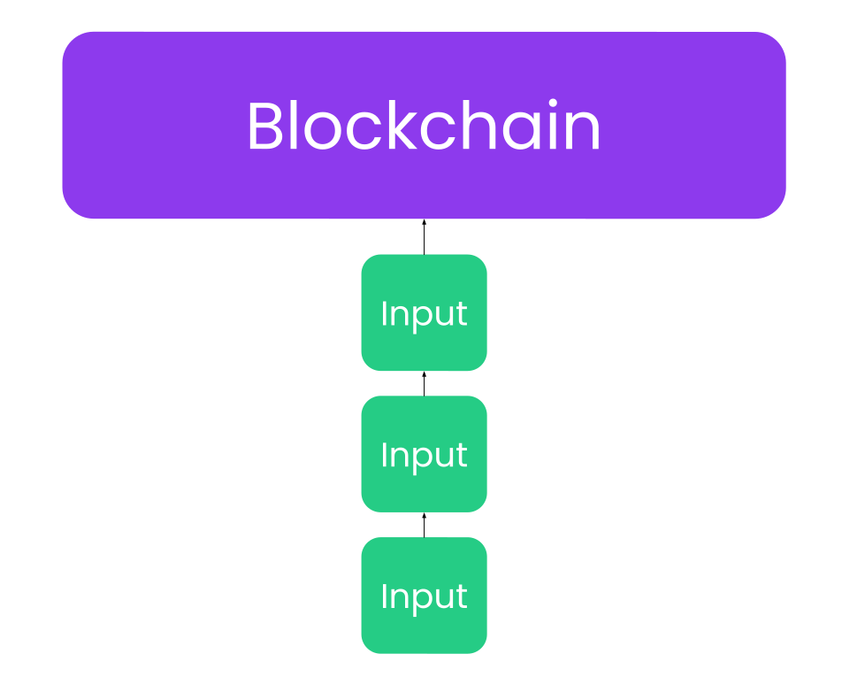
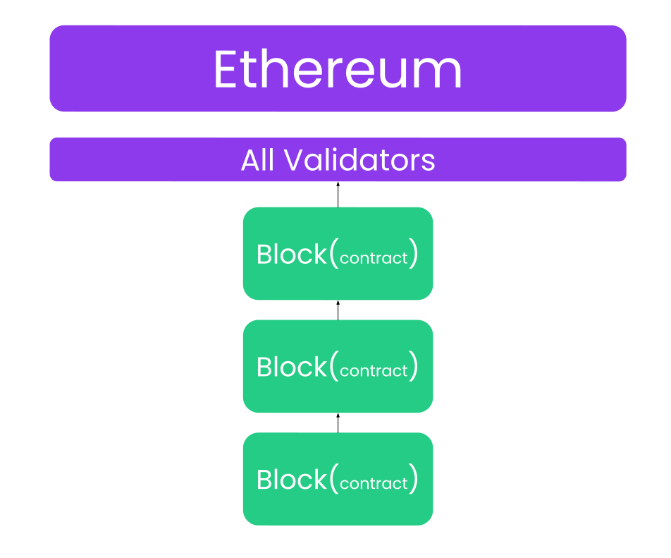
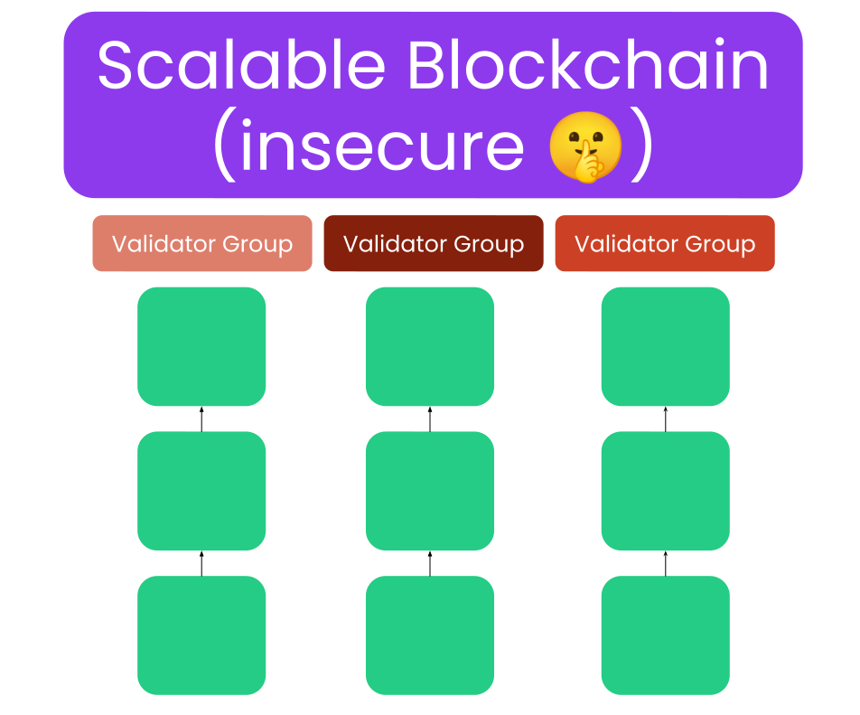
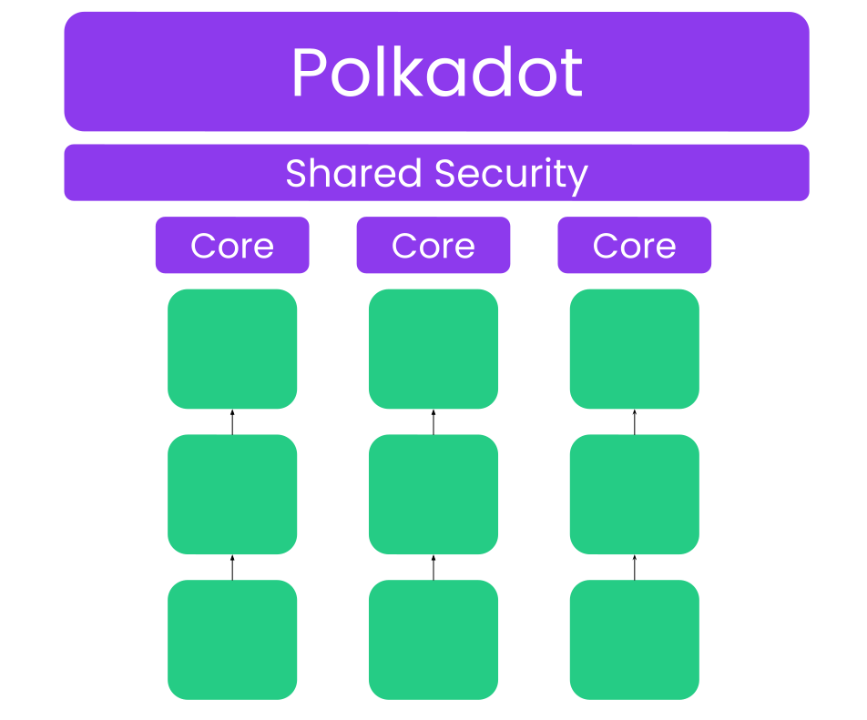
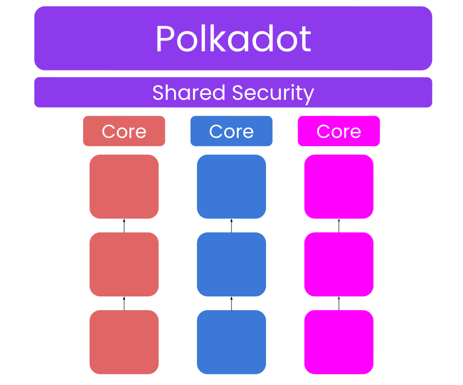
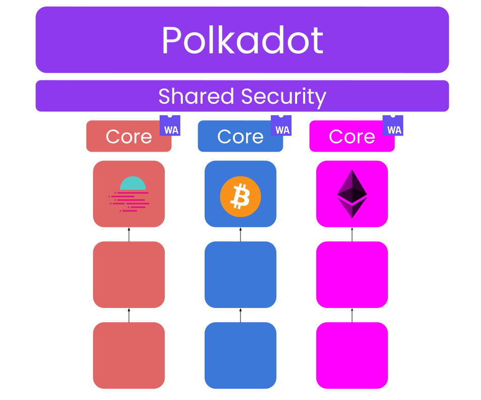
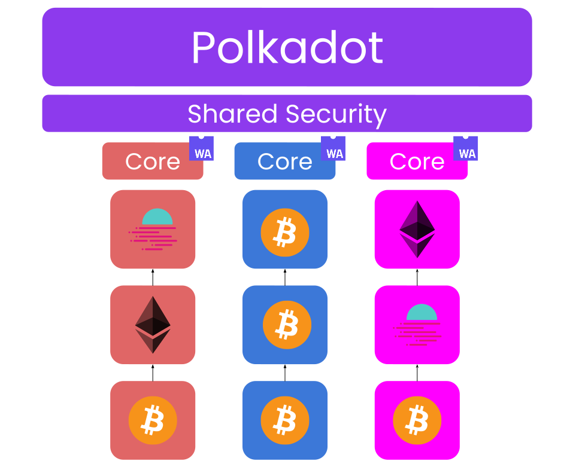
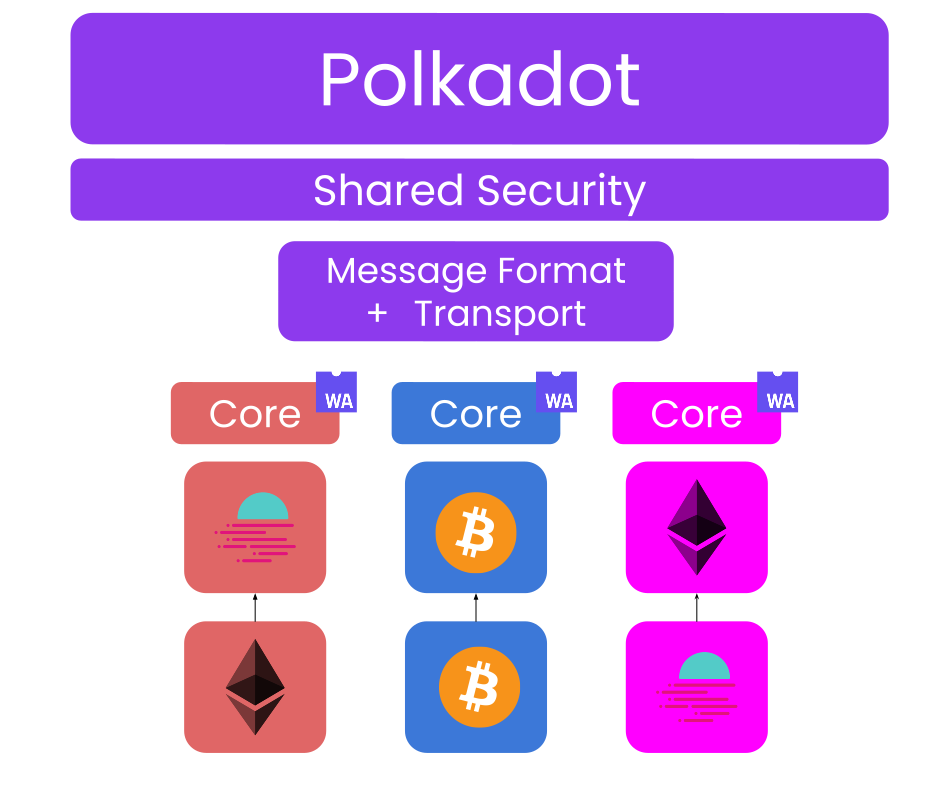

## Meta

Before Getting started

- 👋🏻 Questions
- ⏰ Slides
- `@kianenigma` / `kian@parity.io`

Note:

meta questions for ice breaker:

- how many ppl know substrate/frame already?
- how many ppl feel like they are comfortable with rust
- with rust generics, traits and associated types
- how many ppl know what polkadot-sdk is?
- how many ppl know jam already? do you have the question of why are we still learning all of this?

---

# Introduction to Polkadot SDK

- Polkadot + Substrate + FRAME + XCM

Note:

This lecture is about learning two things:

1. Polkadot
2. Polkadot SDK
   1. Substrate
   2. FRAME
   3. XCM

There will be amazing modules going into further details of each. This will be very high level.

meta questions for ice breaker:

- how many ppl know substrate/frame already?
- how many ppl feel like they are comfortable with rust
- with rust generics, traits and associated types
- how many ppl know what polkadot-sdk is?
- how many ppl know jam already? do you have the question of why are we still leaning all of this?

---

## Learning Outcomes

1. Understand what Polkadot is as a developer platform.
2. Understand the pieces of the Software Development Kit (SDK) of this platform

---

## Polkadot

- As a platform for developers.
- Polkadot stems from Ethereum. A single threaded smart contract blockchain.

---v

### Polkadot

---v

### Polkadot

---v

### Polkadot

- O.G ETH2 Vision from 2015
- Let's make this _sharded_, such that it can achieve execution sharding.

Note:

The holy grain of what ETH 2.0 was meant to be.

---v

### Polkadot

Note:

Have we compromised security in any way in this model?

---v

### Polkadot

Note: Polkadot achieves perfect shared security and sharded execution. The primitives that can
progress an input in parallel is called a "Core", much like a normal CPU.

---v

### Polkadot

Note:

Let's make it heterogenous. The state transition function of these shards need NOT be the same. WASM
is used.

---v

### Polkadot

Note:

The beautify of a heterogenous system is that we are no longer bound to running a single chain, and
therefore smart contracts. We can run anything we want. We can run a whole blockchain as a shard.

---v

### Polkadot

Note:

Finally, let's make the deployment of those shards flexible and permissionless. We arrive at
Polkadot what it is today.

---v

### Polkadot

> Polkadot 1.0 is a platform to launch blockchains that can progress in parallel, whilst absolutely
> sharing the security of Polkadot Relay Chain.

Terminology:

- Polkadot Relay Chain
- Parachain
- Execution Core

Note:

Polkadot initially allowed parachains to compete for deployment on Polkadot via auctioned slots.
Winners get access to a Core for a long long time. Now, it is moving toward a more agile system where
parachains can purchase cores on-demand.

In some sense, Polkadot is moving towards a general purpose computer, exposing its Core as the
primary primitive. Whether they are used to build a Parachain or not, it does not care. The future
of Polkadot is the World Computer vision.

TODO: maybe turn into slides, maybe leave as notes for now.

---

## Polkadot SDK

> .. So how do we build one of these parachains?

---v

### Polkadot SDK

- Building a blockchain is damn painful hard.
- This is why Polkadot has pivoted for years to build a modular and extensible blockchain framework
  called _Substrate_ and _FRAME_.

---v

### Polkadot SDK

⛓️‍💥 Substrate 🤝 FRAME 🤝 Cumulus ⛓️‍💥

---v

### Polkadot SDK

- Substrate: Un-opinionated primitives for building blockchains based on a WASM meta-protocol.
- FRAME: An opinionated way to build that WASM protocol/runtime/STF.
- Cumulus: Parachain turbocharger

Note:

**FRAME** is a subset of blockchain within Substrate that allow you to focus only on writing the
state transition function aka. Runtime of your blockchain and not deal with the rest of the
software. WASM.

---v

### Polkadot SDK

All proudly™️ built with Substrate.

1. the mighty Polkadot Relay Chain
2. all the Polkadot Parachains to date.
3. (less known) can be used to build any blockchain unrelated to Polkadot.

---v

### Polkadot SDK

Cumulus augments Substrate to make it Polkadot-compatible.

---

## Interoperability

Underrated truth about interoperability of blockchains:

_🚀 Shared security puts communication on steroids 🚀_

Note:

Shared Security is GREAT, but it would be even more FAN-TAS-TIQUE is if these parachains could
communicate with each other.

https://x.com/TheDotsMagazine/status/1790755070490857778

Chains can trust the execution of each other to a much higher extent. But note that it is still not
100% guarantee. The Relay Chain cannot guarantee that a parachain won't upgrade itself to go rogue,
but it can 100% ensure that the parachain will do exactly as stated in its WASM blob.

---v

### Interoperability

---v

### Interoperability

Polkadot-SDK's services to developers:

- Transport protocols for parachains/cores to send payloads to one
  another.
  - XCMP, HRMP, VMP, DMP 😶‍🌫️
  - As a developer you won't deal with these! 😮‍💨
- Language to compose messages and programs and send them over.
  - XCM
    - Shared ideas between sovereign consensus systems.
    - Asynchronous.

Note:

On "XCMP, HRMP, VMP, DMP": It is similar to building a website. You know HTTP and TCP and such
exist, and you use them via an interface, but you don't need to know them by heart.

Consensus System: Moreover, the sender and recipient of these messages can be contracts, accounts, or any
other abstract entities within chains, not just the chain itself.

Async and Sync: Disjoint consensus systems are in principle[^1] asynchronous by nature. This is an
important concept to keep in mind.

[^1]:
    Technically, if two parachains are co-scheduled in the same core in the same block, they
    could have synchronous communication. But they cannot count on this. So at the programming
    model, one must assume everything is always asynchronous.

---

## Lecture Recap

About Polkadot

- Heterogenous Sharded Execution, Shared Security.
- Parachain
- Core
- Exposing Cores: Auctions -> On-Demand -> World Computer

About Polkadot SDK

- Substrate
- FRAME
- XCM

---

## Schedule

(tentative)

- 🤓 _Substrate_: Tuesday -> Thursday
  - More theory, 2 ungraded activities
- 🧑‍💻 _FRAME_: Thursday -> Thursday
  - Main graded assignment
  - Mix lecture and live-coding
- 🚀 _XCM_: Friday + Saturday
  - Hands-on

---

## Additional Resources! 😋

> Check speaker notes (click "s" 😉)

Note:

https://blog.kianenigma.nl/posts/tech/polkadot-s-build-horizon/
https://paritytech.github.io/polkadot-sdk/master/polkadot_sdk_docs/index.html
https://wiki.polkadot.network/
