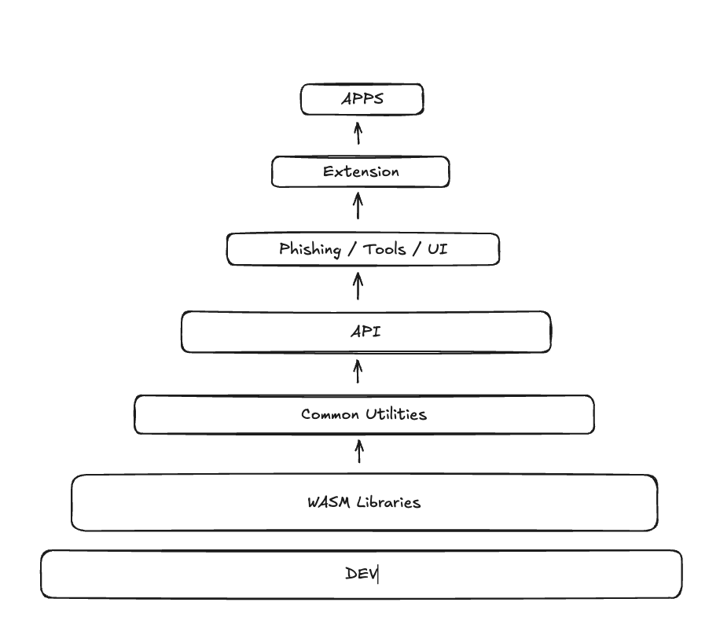

# What is Polkadot-JS

---

### Polkadot-JS Dependency Tree



Notes:

This image shows the complex dependency structure of the Polkadot-JS ecosystem. The various packages are highly interconnected, with core utilities at the base and more specialized tools building on them.

This dependency structure illustrates both a strength and a weakness of Polkadot-JS. On one hand, it promotes code reuse and consistency across the ecosystem. On the other hand, it creates tight coupling that can make it difficult to use individual components without pulling in much of the entire system.

Understanding this dependency structure is important for developers working with Polkadot-JS, as it helps explain some of the challenges in bundle size optimization and maintenance that we'll discuss in the limitations section.

---

### @polkadot/dev - Development Infrastructure

<pba-flex center>

- Build configurations and scripts for TypeScript projects
- Shared ESLint and TSLint configurations
- Testing frameworks and utilities
- Common development dependencies
- Publishing utilities

</pba-flex>

Notes:

The dev repository serves as the foundation that enables consistent development practices across the Polkadot-JS ecosystem. It includes tools for interacting with Polkadot, Kusama, and other Substrate-based blockchains.

Developers working on Polkadot-JS projects can rely on these shared tools rather than having to configure their own development environments from scratch. The repository helps maintain consistency in coding standards, build processes, and testing methodologies across the various components that make up the Polkadot-JS ecosystem.

This standardization of development tools has been critical for maintaining quality and consistency across the numerous packages that form the complete Polkadot-JS ecosystem, especially as the number of contributors has grown over time.

---

### @polkadot/wasm - WebAssembly Cryptography

<pba-flex center>

- WASM implementations of cryptographic functions
- Performance optimization for critical operations
- Cross-platform compatibility
- Bridge between Rust and JavaScript
- Key generation and verification

</pba-flex>

Notes:

The WASM repository provides WebAssembly versions of critical cryptographic functions used in Polkadot, including hashing algorithms (like Blake2b, SHA-256), signature schemes (like ed25519, sr25519), and other cryptographic primitives.

The WASM implementations offer better performance for cryptographic operations compared to pure JavaScript implementations, which is crucial for blockchain interactions. However, there are tradeoffs to consider:

Advantages of WASM over Pure JavaScript:

- Better Performance – WASM executes at near-native speeds, often 2x–10x faster than JavaScript
- Optimized for Cryptography – Uses efficient integer operations and avoids JS floating-point limitations
- No Garbage Collection Overhead – WASM has manual memory management, preventing GC-related slowdowns
- Access to Optimized Libraries – Many cryptographic libraries are available in WASM
- Better Security – Less exposure to JavaScript runtime vulnerabilities or side-channel attacks

Potential Drawbacks of WASM:

- Higher Startup Time – WASM modules take longer to instantiate and compile than JavaScript functions
- Complexity – Requires writing in Rust, C, or C++, then compiling to WASM, adding extra build steps
- Larger File Sizes – WASM binaries are often larger than equivalent JS code, which can impact load times
- Interoperability Challenges – Calling WASM from JS incurs a performance cost due to boundary overhead
- Browser & Environment Limitations – Older browsers and some restricted environments may lack full WASM support

---

### @polkadot/common - Core Utilities

<pba-flex center>

- Cryptographic utilities (key generation, hashing, SS58 encoding)
- Key management (keypairs, accounts, signing)
- Network information for Substrate chains
- Cross-platform compatibility utilities
- Hardware wallet interfaces

</pba-flex>

Notes:

The `polkadot-js/common` repository is a monorepo that provides essential utilities for working with Substrate-based blockchains. It forms the foundation for most other Polkadot-JS tools and applications.

Key components include:

- Cryptographic utilities for key generation, hashing, and SS58 address encoding
- Keyring utilities for managing keypairs, accounts, and transaction signing
- A registry of network information for known Substrate chains
- Cross-platform compatibility modules like `@polkadot/x-bigint`, `@polkadot/x-randomvalues`, `@polkadot/x-textencoder`, and `@polkadot/x-ws`
- Interfaces for hardware wallets like Ledger

These utilities are designed to work in both Node.js and browser environments, making them versatile for different types of applications. The common repository is often the most reusable part of the Polkadot-JS ecosystem, with many of its utilities being useful even in applications that don't use the full API.

---

### @polkadot/api - Blockchain Interaction

<pba-flex center>

- Complete blockchain interaction suite
- Type-safe TypeScript interfaces
- Reactive programming model with RxJS
- Automatic codec handling (SCALE)
- Dynamic metadata adaptation
- Transaction management

</pba-flex>

Notes:

The API package is the central component for interacting with Substrate-based blockchains. It offers:

- Complete Blockchain Interaction: A full suite of tools to connect to nodes, query blockchain state, submit transactions, and listen to events.
- Type-Safe Interfaces: Leverages TypeScript to provide strongly-typed interfaces that match the on-chain runtime definitions, reducing errors and improving developer experience.
- Reactive Programming Model: Built on RxJS, allowing for reactive subscription-based programming patterns to handle blockchain events and state changes.
- Automatic Codec Handling: Automatically encodes and decodes data between JavaScript objects and the SCALE codec format used by Substrate.
- Metadata Adaptation: Dynamically adapts to each chain's metadata, allowing it to work with any Substrate-based chain regardless of custom pallets or types.
- Transaction Management: Provides comprehensive tools for creating, signing, and submitting extrinsics (transactions), including fee estimation and nonce management.

Limitations include:

- Limited light client support
- Reliance on the older JSON-RPC interface
- Challenges with static type support for dynamic chain metadata

---

### API Example: Basic Usage

```typescript
import { ApiPromise, WsProvider } from '@polkadot/api';

async function main() {
    // Create the API instance
    const api = await ApiPromise.create({
      provider: new WsProvider('wss://rpc.polkadot.io')
    });

    // Get chain information
    const [chain, nodeName, nodeVersion] = await Promise.all([
      api.rpc.system.chain(),
      api.rpc.system.name(),
      api.rpc.system.version()
    ]);

    console.log(`Connected to ${chain} using ${nodeName} v${nodeVersion}`);

    // Query account balance
    const ADDR = '13UVJyLnbVp9RBZYFwFGyDvVd1y27Tt8tkntv6Q7JVPhFsTB';
    const { data: balance } = await api.query.system.account(ADDR);

    console.log(`Treasury Balance: ${balance.free.toString()}`);
  }

  main().catch(console.error);</code></pre>
```

Notes:

This example demonstrates the basic usage of the Polkadot-JS API to connect to a node, retrieve chain information, and query an account balance. The code is straightforward and follows a promise-based pattern that will be familiar to JavaScript developers.

---

### API Example: Historical Queries

```typescript
import { ApiPromise, WsProvider } from "@polkadot/api";

async function main() {
  const api = await ApiPromise.create({
    provider: new WsProvider("wss://rpc.polkadot.io"),
  });

  // Get a historical block hash
  const blockHash = await api.rpc.chain.getBlockHash(1000000);

  // Create an API instance at that block
  const apiAt = await api.at(blockHash);

  // Query historical state
  const ADDR = "13UVJyLnbVp9RBZYFwFGyDvVd1y27Tt8tkntv6Q7JVPhFsTB";
  const currentBalance = await api.query.system.account(ADDR);
  const historicalBalance = await apiAt.query.system.account(ADDR);

  console.log(`Current Balance: ${currentBalance.data.free.toString()}`);
  console.log(`Balance at Block 1,000,000: ${historicalBalance.data.free.toString()}`);
}

main().catch(console.error);
```

Notes:

This example demonstrates one of Polkadot-JS API's most powerful features: the ability to query historical state at any block height. This capability is essential for applications like block explorers, analytics tools, and any service that needs to understand how the chain state has changed over time.

The `api.at()` method creates a specialized API instance that is pinned to a specific block. All state queries made through this instance will return data as it existed at that block height, allowing for accurate historical analysis.

This historical state capability relies on the node having the state data available, which depends on the node's pruning settings. Archive nodes store all historical state and allow querying at any block height, while pruned nodes may only have recent state available.

The API handles all the complexity of tracking runtime upgrades and metadata changes, ensuring that historical queries work correctly even if the chain's structure has changed between the queried block and the current state.

---

### @polkadot/phishing - Security Protection

<pba-flex center>

- Curated database of known phishing sites
- Address blacklists for suspicious accounts
- Community-maintained security resource
- Integration with wallet extensions
- Regular updates to protect users

</pba-flex>

Notes:

The polkadot-js/phishing repository is a specialized component of the Polkadot-JS ecosystem focused on security and anti-phishing protection for users of Polkadot and Substrate-based blockchain applications.

Key features include:

- Phishing Site Database: Maintains a curated list of known phishing websites and malicious domains that target Polkadot, Kusama, and other related blockchain users.
- Address Blacklists: Contains lists of suspicious or known malicious addresses that have been associated with scams or theft.
- Community Maintenance: The repository is community-run, allowing for rapid response to new threats as they emerge.

This repository serves as a crucial security layer for the ecosystem, helping to protect users from common scams and attacks. The data is used by wallet interfaces, including the Polkadot{.js} Extension, to warn users when they might be interacting with potentially malicious sites or addresses.

The community-driven nature of this repository allows for quick updates as new threats are identified, creating a collaborative defense mechanism against scammers targeting the Polkadot ecosystem.

---

### @polkadot/tools - Developer Utilities

<pba-flex center>

- Command-line interfaces for chain operations
- Metadata extraction and analysis utilities
- Network monitoring applications
- Key management tools
- Transaction signing utilities
- JSON-RPC testing interfaces

</pba-flex>

Notes:

The polkadot-js/tools repository provides a collection of useful command-line utilities and developer tools designed to facilitate working with Polkadot, Kusama, and other Substrate-based blockchains.

Key components include:

- CLI Utilities: Command-line interfaces for common operations like querying chain state, submitting transactions, and monitoring events without needing to build a full application.
- Metadata Extraction: Tools for extracting, analyzing, and working with chain metadata, which is essential for understanding the capabilities and structure of different chains.
- Monitor Applications: Utilities for monitoring node status, network performance, and blockchain metrics.
- Key Management: Command-line tools for generating and managing cryptographic keys.
- Signer Utilities: Tools that help with transaction signing processes, which can be used for testing or automated systems.
- JSON-RPC Interface Tools: Utilities for exploring and testing the JSON-RPC endpoints exposed by Substrate nodes.

These tools are particularly valuable for developers who need to perform quick operations or automate tasks without building complete applications. They provide a command-line interface to many of the same capabilities available through the API, making them useful for scripts, CI/CD pipelines, and server-side applications.

---

### @polkadot/ui - User Interface Components

<pba-flex center>

- React components for blockchain applications
- Address formatting and visualization
- Balance and data formatting utilities
- Identicon generators
- Specialized input components
- Responsive design elements
- Keyring integration

</pba-flex>

Notes:

The polkadot-js/ui repository provides a collection of user interface components and utilities designed specifically for creating web applications that interact with Polkadot, Kusama, and other Substrate-based blockchains.

Key features include:

- React Components: A library of ready-to-use React components tailored for blockchain applications, including account selection and display, address formatting and visualization, transaction submission forms, and balance displays.
- UI Utilities: Helper functions for formatting blockchain data in user-friendly ways, such as balance and token formatting, time and block number formatting, and data presentation helpers.
- Identicon Generators: Various implementations of address visualization (identicons) to help users recognize addresses visually, supporting multiple styles including Polkadot's unique circular format.
- Input Components: Specialized input components for blockchain-specific data types like addresses and token amounts.
- Responsive Design: Components designed to work across different screen sizes for mobile and desktop applications.
- Theming Support: Customizable styling options to match different application designs while maintaining consistent behavior.
- Keyring Integration: UI components that integrate with the Polkadot-JS keyring for secure key management.

These components help developers create consistent, user-friendly interfaces for Polkadot ecosystem applications without having to build everything from scratch. They ensure that common UI patterns follow best practices and maintain consistency across different applications.

---

### @polkadot/apps - Comprehensive Web Interface

<pba-flex center>

- Feature-rich dashboard for all on-chain functionality
- Automatic adaptation to any Substrate chain
- Block explorer and transaction viewer
- Staking and governance interfaces
- Parachain tools and cross-chain functionality
- Developer tools and testing interfaces
- Account management

</pba-flex>

Notes:

The polkadot-js/apps repository houses the flagship application in the Polkadot-JS ecosystem - a comprehensive web-based interface for interacting with Polkadot, Kusama, and any Substrate-based blockchain. Often referred to as "Polkadot-JS Apps" or simply "the Apps," this is the official reference implementation UI for Substrate chains.

Key features include:

1. Complete Chain Dashboard: A feature-rich interface providing access to virtually all on-chain functionality including account management, transfers, staking, governance, and parachains.
2. Multi-chain Support: Built to work seamlessly with any Substrate-based chain, automatically adapting its interface based on the connected chain's capabilities and metadata.
3. Explorer Functions: Comprehensive block explorer functionality including block details, transaction history, events, and state queries.
4. Staking Management: Complete tools for nominators and validators to participate in network security through staking, including validator selection, reward tracking, and stake management.
5. Governance Participation: Interfaces for participating in on-chain governance through proposals, referenda voting, and treasury proposals.
6. Parachain Tools: Specialized interfaces for parachain-specific functions like crowdloans, auctions, and cross-chain messaging.
7. Developer Tools: Advanced functionality for developers including extrinsic submission, chain state queries, RPC calls, and contract interaction.
8. Account Management: Comprehensive account management with address book functionality, transaction history, and integration with browser extensions.
9. Network Customization: Support for connecting to custom networks and local development nodes.
10. Settings & Flexibility: Extensive customization options for display preferences, connection settings, and advanced features.

The application is designed as a single-page application built with React that leverages the entire Polkadot-JS ecosystem. It's hosted officially at https://polkadot.js.org/apps/, but can also be run locally or self-hosted for additional security.

---

### @polkadot/extension - Browser Extension

<pba-flex center>

- Secure key management in browser environment
- Separation of dApp and key storage concerns
- Authorization system for website connections
- Multiple account management
- Transaction signing interface
- Metadata management for chain compatibility

</pba-flex>

Notes:

The Polkadot{.js} Extension (from the polkadot-js/extension repository) provides a secure browser extension for managing accounts and signing transactions for Substrate-based blockchains.

Key features include:

- Secure Key Management: Stores private keys securely within the browser's extension storage, isolating them from potentially malicious websites.
- dApp Integration: Provides an interface for websites to request accounts and transaction signatures without ever accessing the private keys.
- Website Authorization: Implements a permission system where users must explicitly authorize websites to access their accounts.
- Multiple Account Support: Allows users to manage multiple accounts across different networks within a single interface.
- Transaction Signing: Provides a secure interface for reviewing and signing transactions before they're submitted to the blockchain.
- Metadata Management: Keeps track of metadata from different chains to ensure accurate transaction construction and display.

The extension follows a security model similar to MetaMask and other Web3 wallets, where the extension maintains custody of private keys and websites can only request signatures for specific operations after receiving user permission.

This clean separation of concerns is crucial for security in blockchain applications, as it prevents websites from directly accessing private keys while still allowing them to request the necessary signatures for blockchain operations.

---

## Key Takeaways

<pba-flex center>

- Polkadot-JS is a comprehensive ecosystem, not a single library
- Each component serves a specific purpose but works together seamlessly
- The API provides the core blockchain interaction capabilities
- Historical metadata support remains unmatched
- UI components and Apps serve as reference implementations
- Security and developer experience are prioritized throughout

</pba-flex>

Notes:

Understanding Polkadot-JS as a complete ecosystem rather than a single library is crucial for making the most of its capabilities. Each component is designed to fulfill a specific role while maintaining compatibility with the rest of the ecosystem.

The API remains the heart of the ecosystem, providing the essential capabilities for interacting with Substrate-based chains. Its comprehensive historical metadata support makes it particularly valuable for applications that need to work with chain history.

The UI components and Apps interface serve as reference implementations that demonstrate best practices for blockchain interaction. Developers can learn from these implementations or use them directly in their own applications.

Throughout the ecosystem, there's a consistent focus on security (as seen in the phishing protection and extension design) and developer experience (reflected in the comprehensive tools and documentation).

By understanding the structure and capabilities of each component, developers can make informed decisions about which parts of the ecosystem to use for their specific needs, whether they're building simple scripts or complex applications.

---

<!-- .slide: data-background-color="#4A2439" -->

# Questions?
