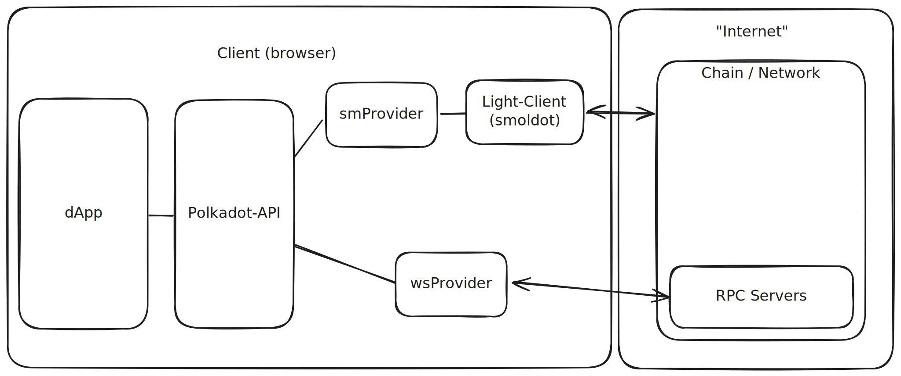

# dApps / Off-chain

---

## Module Overview

- Understand interaction with a chain
- Metadata in-depth <!-- .element: class="fragment" -->
- JSON-RPC Interface <!-- .element: class="fragment" -->
  - chainHead <!-- .element: class="fragment" -->
  - storage <!-- .element: class="fragment" -->
  - transactions <!-- .element: class="fragment" -->

---

## Module Overview

- Polkadot-API
  - Sub-libraries <!-- .element: class="fragment" -->
  - Subscriptions <!-- .element: class="fragment" -->
  - Compatibility API <!-- .element: class="fragment" -->
  - Signers <!-- .element: class="fragment" -->
  - Ink! <!-- .element: class="fragment" -->
- PAPI SDKs <!-- .element: class="fragment" -->

---

## Grading

- Assignment
  - dApp for specific chain feature <!-- .element: class="fragment" -->
  - Optional Add-ons <!-- .element: class="fragment" -->
  - Qualitative grading <!-- .element: class="fragment" -->
- UI/UX is NOT graded <!-- .element: class="fragment" -->
- Business logic code <!-- .element: class="fragment" -->
- Research, considerations <!-- .element: class="fragment" -->

Notes:

Optional Add-ons many are related together, so you might choose to focus on on a specific area within the pallet.

---

## Grading

- During class
  - Participation
  - Academic integrity
  - Cooperation
  - Overall engagement

Notes:

You MUST pay attention to class and do the assignment after and not in class.

For working with the assignment, we have office hours after lessons.

Depending on timeline, we might have days where we might have some extra class time for assignment Q&A, specially towards the end.

---

## Today

- Getting started - Polkadot-api <!-- .element: class="fragment" -->
- Dev Tools <!-- .element: class="fragment" -->
- Assignment description <!-- .element: class="fragment" -->

Notes:

During this module we will go deep through Polkadot-API, from a low-level, interacting with a JSON-RPC endpoint to a higher level like polkadot-api and then its SDKs.

To unblock you from working on the assignment, here's a quick getting started with polkadot-api, which will let you connect with a chain and start interacting with it.

---

# Polkadot-API

## Getting Started

---

## Polkadot-API

Typescript library to interact with Polkadot-based chains

https://papi.how/

---

## Polkadot-API

- 💡 Fully Typed
- 🪶 Light-client first
- 🚀 Performant and light-weight
- 🧩 Modular

Notes:

Full Typed: Not only the library itself, but the interactions with each chain. It even pulls the interaction docs as JSDocs to show them in intellisense.

---

## Concepts



Notes:

https://excalidraw.com/#json=SLLLnZdCrJdd1PYIurjGv,IwZlWHL0yw0GLMW6uMEnZw

---

## Polkadot-API

```sh
npm install polkadot-api

npx papi add dot -n polkadot
```

Notes:

Let's jump into live demo

- Basics
  - Installing papi
  - Connecting to a chain (westend, will be needed for sending tx)
- Operations
  - Query storage: System.account
  - Runtime call: estimate fees with TransactionPaymentApi.queryInfo
    - Create extrinsic System.remark
  - Constant: Balances.ExistentialDeposit
    - introduce compatibility token

=> Find how much balance does the account holding the sudo key have.
=> Find all the Proxy(any) accounts
=> Find out if some account has configured the maximum amount of proxy delegates.

- Transactions
  - Connect to pjs extension
  - Get signer from extension
  - Submit a System.remark to westend
- Compatibility
  - Remark the meaning of descriptors
  - Show example of connecting to a different chain (polkadot) with the same wnd descriptors
    - System.Remark => works, but throws a payment
    - Sudo => fails

---

## Devtools

https://dev.papi.how/

https://polkadot.js.org/apps/
