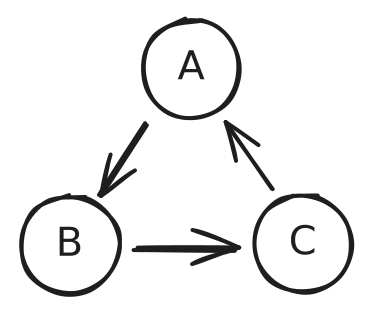
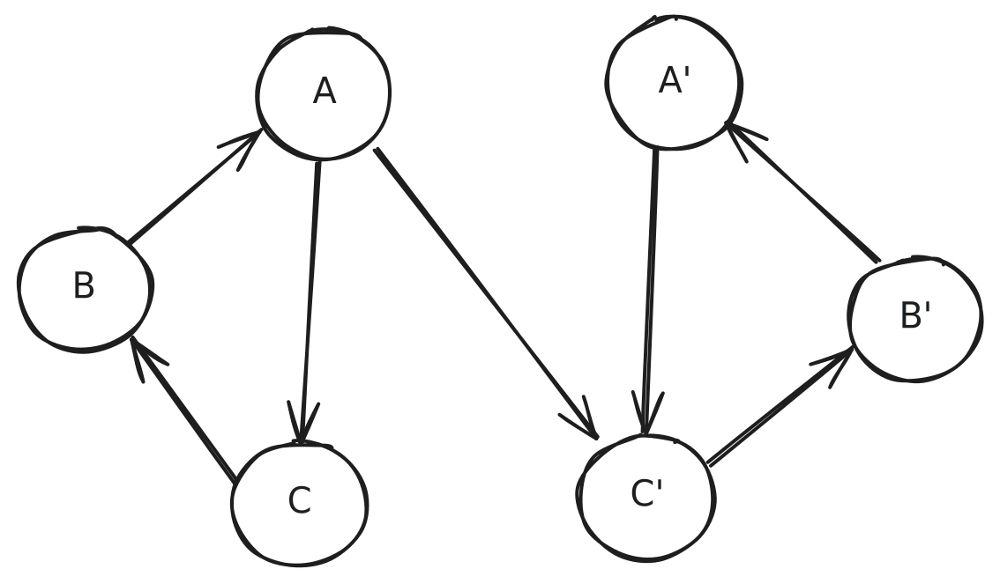
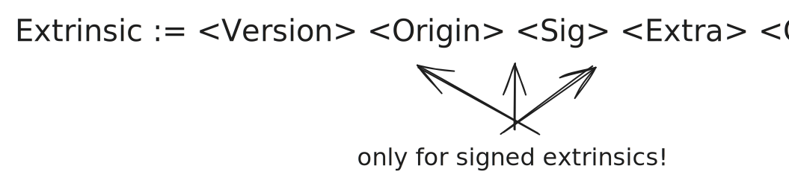
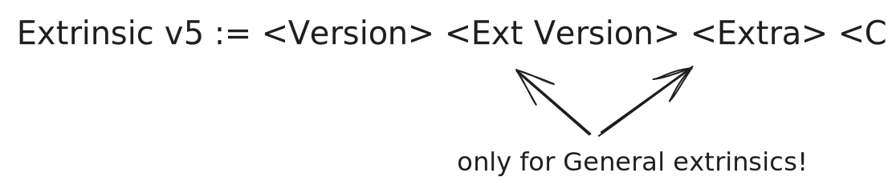

# Metadata

---

## Metadata

#### Content

- Mod. 2 recap:
  - What is the runtime (and its metadata)?
  - The metadata sets us apart of other blockchains.
- Deep dive into metadata
- Extrinsics

---

## Runtime

- The runtime is the business logic of Polkadot-based networks.
- It defines the algorithm needed for determining the state of the next block.
- It is part of the state, not part of the host.

Notes:

Compared to other blockchains (such as Ethereum) the logic to determine the next block state is not part of the
state itself. Therefore, it can't be modified without a change in the host itself.

---

## Metadata

- The Runtime's Metadata is a bunch of information needed to interact with the Runtime. It defines the shape of the
  interactions, instead of "what" do they do.
- It includes _enough_ information to perform any kind of interaction with the blockchain, as well as decoding its state.

---

## Metadata

#### Shape

The metadata is versioned, and its current stable version is `15`.

```typescript [|2|3|4|6|]
interface RuntimeMetadataV15 {
  types: Vec<LookupEntry>;
  pallets: Vec<PalletMetadata>;
  extrinsic: ExtrinsicMetadata;
  ty: Type; // not useful, it is the type of the runtime itself
  apis: Vec<RuntimeApiMetadata>;
  outer_enums: OuterEnums;
  custom: CustomMetadata; // we won't enter this one, un-typed extra metadata
}
```

---

## Metadata

#### Lookup

The lookup of the metadata defines the shape of all types used in the runtime.

<span style="font-size: 0.6em; opacity: 0.6">(This is already `scale-info`)</span>

```typescript [|2|3,4,6|5|]
interface LookupEntry {
  id: u32; // this one is unique, and sequential
  path: Vec<String>; // where is it found in Rust code
  type_params: Vec<TypeParameter>; // Rust generics
  type_def: TypeDef; // THE JUICE!
  docs: Vec<String>; // Rust docs
}
```

Notes:

Docs are self-descriptive. Type params only give information about the generics used in Rust. Path defines the file
where it is defined in rust.

---v

## Metadata

#### Lookup `type_def`

```typescript [|2|3|4,5|6|7,8|]
enum TypeDef {
  Composite, // struct
  Variant, // enum
  Sequence, // variable length
  Array, // fixed length
  Tuple,
  Primitive, // essentially integers and booleans
  Compact,
  BitSequence,
}
```

Notes:

Explain a bit every one. Don't focus particularly, it is just a quick summary of something already explained in mod 2.

---v

## Metadata

#### Lookup challenges

- Circular types
  - There are types that reference themselves, or form circles.
  - This makes it difficult to calculate a _checksum_ of the type itself.

<span style="font-size: 0.6em; opacity: 0.6">We used Tarjan's SCC algorithm to detect cycles, see notes</span>



Notes:

https://en.wikipedia.org/wiki/Tarjan's_strongly_connected_components_algorithm

---v

## Metadata

#### Lookup challenges

- Mirrored types
  - These are types that are completely equivalent, but yet they have different structures that connect them.



---v

## Metadata

#### Lookup challenges

- _Second-class_ citizens
  - Types like balances (_"amount"_) or `AccountId32` are first-class citizens in the blockchains, yet in the Metadata they are not. Identifying them as what they are is a heuristic labour.

---v

#### Example: `AccountId32` and _Balance_

```json [|2-17|18-27]
[
  {
    "id": 0,
    "path": ["sp_core", "crypto", "AccountId32"],
    "params": [],
    "def": {
      "tag": "composite",
      "value": [
        {
          "type": 1,
          "typeName": "[u8; 32]",
          "docs": []
        }
      ]
    },
    "docs": []
  },
  {
    "id": 63,
    "path": [],
    "params": [],
    "def": {
      "tag": "compact",
      "value": 6 // u128
    },
    "docs": []
  }
]
```

---v

## Metadata

#### Lookup challenges

- Non-descriptive types
  - Some types are created in Rust in a way that they get generated in a non-descriptive way.
  - There are some that are on purpose created this way to save bytes when encoded.

---v

#### Example: `IdentityData`

- A variable length array of bytes `Vec<u8>` (up to `len=32`) is expressed as several variants in an enum.

```json
{
  "id": 327,
  "path": ["pallet_identity", "types", "Data"],
  "params": [],
  "def": {
    "tag": "variant",
    "value": [
      {
        "name": "None",
        "fields": [],
        "index": 0,
        "docs": []
      },
      {
        "name": "Raw0",
        "fields": [
          {
            "type": 328,
            "docs": []
          }
        ],
        "index": 1,
        "docs": []
      },
      {
        "name": "Raw1",
        "fields": [
          {
            "type": 329,
            "docs": []
          }
        ],
        "index": 2,
        "docs": []
      },
      {
        "name": "Raw2",
        "fields": [
          {
            "type": 330,
            "docs": []
          }
        ],
        "index": 3,
        "docs": []
      },
      {…},
      {
        "name": "Raw32",
        "fields": [
          {
            "type": 1,
            "docs": []
          }
        ],
        "index": 33,
        "docs": []
      },
      {
        "name": "BlakeTwo256",
        "fields": [
          {
            "type": 1,
            "docs": []
          }
        ],
        "index": 34,
        "docs": []
      },
      {…}
    ]
  },
  "docs": []
}
```

---v

#### Example: `Vote`

- It encodes `{ aye: boolean; conviction: [0..6] }`
- `aye` fits in one bit, and `conviction` fits in the rest of the `u8` (aka `u7`).
- `vote = (aye << 7) + conviction`

```json
{
  "id": 155,
  "path": ["pallet_conviction_voting", "vote", "Vote"],
  "params": [],
  "def": {
    "tag": "composite",
    "value": [
      {
        "type": 2, // u8
        "docs": []
      }
    ]
  },
  "docs": []
}
```

---v

## Metadata

#### Metadata is autogenerated!

- Many of these flaws arise due to the way the metadata is generated from the Rust code directly.
- Some of the Runtime implementation details leak to the metadata

---

## Metadata

#### Outer Enums

They are sugar! One can build this type by himself by aggregating all pallets information.

These types are handy though to decode any `call_data`, `event`, or module `error`.

```typescript
interface OuterEnums {
  call_enum_ty: Type;
  event_enum_ty: Type;
  error_enum_ty: Type;
}
```

---

## Metadata

#### Runtime APIs

They allow to execute functions from the Runtime itself.
Examples:

- Dry Run
- Fee estimation
- Metadata

```typescript
interface RuntimeApiMetadata {
  name: String;
  methods: Vec<{
    name: String;
    inputs: Vec<{ name: String; ty: Type }>;
    output: Type;
    docs: Vec<String>;
  }>;
  docs: Vec<String>;
}
```

Notes:

Use this slide to exemplify the "pointer" idea of the metadata.

---v

Example: `Metadata` APIs

```json [|4-9|26-31|10-25]
{
  "name": "Metadata",
  "methods": [
    {
      "name": "metadata",
      "inputs": [],
      "output": 862,
      "docs": [" Returns the metadata of a runtime."]
    },
    {
      "name": "metadata_at_version",
      "inputs": [
        {
          "name": "version",
          "type": 4
        }
      ],
      "output": 863,
      "docs": [
        " Returns the metadata at a given version.",
        "",
        " If the given `version` isn't supported, this will return `None`.",
        " Use [`Self::metadata_versions`] to find out about supported metadata version of the runtime."
      ]
    },
    {
      "name": "metadata_versions",
      "inputs": [],
      "output": 121,
      "docs": [" Returns the supported metadata versions.", "", " This can be used to call `metadata_at_version`."]
    }
  ],
  "docs": [" The `Metadata` api trait that returns metadata for the runtime."]
}
```

---

## Metadata

#### Pallets

Every pallet can define an arbitrary number (including none) of **constants**, **calls**, **events**, **errors**,
**storage queries**. We will walk every one of them.

```typescript
interface PalletMetadata {
  name: String;
  constants: Vec<PalletConstantMetadata>;
  event: Option<Type>;
  error: Option<Type>;
  calls: Option<Type>;
  storage: Option<PalletStorageMetadata>;
  index: u8;
  docs: Vec<String>; // rust docs
}
```

---

## Metadata

#### Constants

They represent values that are defined in compile time of the runtime.
The metadata includes both the type of them and their values.

```typescript
interface PalletConstantMetadata {
  name: String;
  ty: Type;
  value: Vec<u8>;
  docs: Vec<String>;
}
```

---

## Metadata

#### Events

They are emitted by the runtime when executing certain actions.

There are three types (called `phase`s):

- Initialization: runtime _hooks_ before applying transactions
- Apply Extrinsic: events emitted by applying transactions
- Finalization: runtime _hooks_ after applying transactions

They can also include topics, which generally are a vector of hashes. They can be useful to help identify the origin of
the event (e.g. smart contracts).

---

## Metadata

#### Errors

Pallets can define errors to explain why an extrinsic had no success.

- `System.ExtrinsicSuccess` 🎉
- `System.ExtrinsicFailed` 🔴
  - Inside its payoad we find the specific error.

---

## Metadata

#### Calls

They expose all transactions available in that pallet.

We will dig into it during the day.

---

## Metadata

Example: `System`

```json
{
  "name": "System",
  "storage": {…}, // let's follow up with it!
  "calls": 94,
  "events": 22,
  "constants": [
    {
      "name": "Version",
      "type": 508,
      "value": "0x20706f6c6b61646f743c7061726974792d706f6c6b61646f7400000000fc4d0f00000000005cc51ff1fa3f5d0cca01000000df6acb689907609b0500000037e397fc7c91f5e40200000040fe3ad401f8959a0600000017a6bc0d0062aeb30100000018ef58a3b67ba77001000000d2bc9897eed08f1503000000f78b278be53f454c02000000af2c0297a23e6d3d0b00000049eaaf1b548a0cb00300000091d5df18b0d2cf58020000002a5e924655399e6001000000ed99c5acb25eedf503000000cbca25e39f14238702000000687ad44ad37f03c201000000ab3c0572291feb8b01000000bc9d89904f5b923f0100000037c8bb1350a9a2a804000000f3ff14d5ab527059030000006ff52ee858e6c5bd0100000091b1c8b16328eb92010000009ffb505aa738d69c01000000fbc577b9d747efd6010000001a00000001",
      "docs": [" Get the chain's in-code version."]
    },
    {…}
  ],
  "errors": 512,
  "index": 0,
  "docs": []
}
```

---v

## Metadata

Example: `System` calls

```json [|12-24|]
{
  "id": 96,
  "path": ["frame_system", "pallet", "Call"],
  "params": [
    {
      "name": "T"
    }
  ],
  "def": {
    "tag": "variant",
    "value": [
      {
        "name": "remark",
        "fields": [
          {
            "name": "remark",
            "type": 14,
            "typeName": "Vec<u8>",
            "docs": []
          }
        ],
        "index": 0,
        "docs": ["Make some on-chain remark.", "", "Can be executed by every `origin`."]
      },
      {…}
    ]
  },
  "docs": ["Contains a variant per dispatchable extrinsic that this pallet has."]
}
```

---

## Metadata

#### Storage

Every pallet can **optionally** define storage entries. They have the following shape in the metadata:

```typescript [|2|4|5,14|6-13|]
interface PalletStorageMetadata {
  prefix: String;
  entries: Vec<{
    name: String;
    modifier: "Optional" | "Default";
    ty: Enum<{
      Plain: { value: Type };
      Map: {
        hashers: Vec<StorageHasher>;
        key: Type;
        value: Type;
      };
    }>;
    default: Vec<u8>;
    docs: Vec<String>;
  }>;
}
```

---

## Metadata

Example: `System`

```json [|24-33|6-23|]
{
  "name": "System",
  "storage": {
    "prefix": "System",
    "items": [
      {
        "name": "Account",
        "modifier": 1,
        "type": {
          "tag": "map",
          "value": {
            "hashers": [
              {
                "tag": "Blake2128Concat"
              }
            ],
            "key": 0,
            "value": 3
          }
        },
        "fallback": "0x0000000000000000000000000000000000000000000000000000000000000000000000000000000000000000000000000000000000000000000000000000000000000000000000000000000000000080",
        "docs": [" The full account information for a particular account ID."]
      },
      {
        "name": "ExtrinsicCount",
        "modifier": 0,
        "type": {
          "tag": "plain",
          "value": 4
        },
        "fallback": "0x00",
        "docs": [" Total extrinsics count for the current block."]
      },
      {…}
    ]
  },
  {…}
}
```

---

## Extrinsic

#### Content

- What is an extrinsic?
- Extrinsic v4 deep dive
- Future: extrinsic v5

---

## Extrinsic

An **extrinsic** is a request to the runtime to modify the state from outside of it.

TL;DR: **extrinsic** == **transaction**

---

## Extrinsic

#### Type and Versioning

Every extrinsic starts with a version byte, inclunding the extrinsic kind and version.

| Version |   Kind   |    Version Byte     |
| :-----: | :------: | :-----------------: |
|    4    | Unsigned |  4 (`0b0000_0100`)  |
|    4    |  Signed  | 132 (`0b1000_0100`) |
|    5    |   Bare   |  5 (`0b0000_0101`)  |
|    5    | General  | 69 (`0b0100_0101`)  |

<span style="font-size: 0.6em; opacity: 0.6">We will focus on version 4, and explain version 5 a bit ahead</span>

---

## Extrinsic

#### Metadata

```typescript
interface ExtrinsicMetadata {
  version: 4;
  address_ty: Type;
  call_ty: Type;
  signature_ty: Type;
  extra_ty: Type;
  signed_extensions: Vec<{
    identifier: String;
    ty: Type;
    additional_signed: Type;
  }>;
}
```

---

## Extrinsic

#### Signed extensions

Signed extensions are appended to every signed extrinsic with information that is agnostic to the call itself. Examples:

- Mortality (i.e. until which block the transaction should be valid)
- Tip
- Genesis hash
- Nonce

---v

#### `additional_signed`

Some of them are _implicit_. They can only be one single value to be valid. Therefore, they are not encoded in the
extrinsic to save block space, yet they are signed. Examples:

- Spec version
- Genesis hash

---v

#### `extra`

These are parts that need to be _explicit_, since multiple values might be valid. They are encoded in the extrinsic.
Examples:

- Tip
- Nonce™
- Mortality

---

## Extrinsic

#### Extrinsic shape



<span style="font-size: 0.6em; opacity: 0.6">It is _opaque_ encoded; i.e. prepended by its compact-encoded length</span>

---

## Extrinsic

#### Sign Payload

In order to sign an extrinsic, the payload to be signed by the algorithm is:


---

## Extrinsic

#### Future: `v5`

Extrinsic `v5` will rely on extensions to define its origin. I.e. no `origin` or `signature` will be hardcoded.

This increases the flexibility of the extrinsics, leaving the runtime (through extensions) decide the permission level.



<span style="font-size: 0.6em; opacity: 0.6">Take it with a pinch of salt, it is still under RFC process (RFC#0124)</span>
