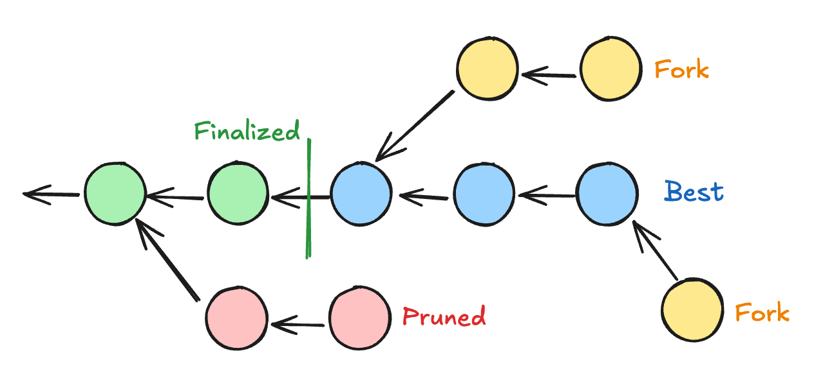

# JSON-RPC Spec

---

# Recap

## Block States



Notes:

https://excalidraw.com/#json=rV-hfREHgg-bLmhQtMb0o,jc3goNcep8O8tg_HANnz5A

Concepts: Finalized, Pruned, Best, Fork

---

# Recap

## JSON-RPC

- Client - Server RPC protocol with JSON
- Request

```js
{ jsonrpc: "2.0", id: "{req_id}", method: "method_name", params: {…} }
```

- Response

```js
{ jsonrpc: "2.0", id: "{req_id}", result: {…} }
```

- Notification

```js
{ jsonrpc: "2.0", method: "method_name", params: {…} }
```

---

# Recap

## JSON-RPC Spec

- Spec build for polkadot that uses JSON-RPC
- Group of functions
  - rpc
  - chainSpec
  - <span class="fragment highlight-red">chainHead</span>
  - transaction
  - transactionWatch
  - archive

Notes:

We will focus on chainHead

---

# JSON-RPC Spec

```js
>> { jsonrpc: "2.0", id: "1", method: "rpc_methods", params: {} }

<< { jsonrpc: "2.0", id: "1", result: [
     "rpc_methods",
     "chainSpec_v1_chainName",
     "chainSpec_v1_genesisHash",
     "chainSpec_v1_properties",
     "chainHead_v1_call",
     "chainHead_v1_follow",
     …
   ]}
```

Notes:

Mention `id` field can be any string, used to correlate messages.

---

# Chain Head

- Subscription
  - `chainHead_v1_follow`
  - `chainHead_v1_unfollow`
- Operations <!-- .element: class="fragment" -->
  - `chainHead_v1_header`
  - `chainHead_v1_body`
  - `chainHead_v1_storage`
  - `chainHead_v1_call`
- Control <!-- .element: class="fragment" -->
  - `chainHead_v1_continue`
  - `chainHead_v1_stopOperation`
  - `chainHead_v1_unpin`

---

# Follow

- Parameters
  withRuntime: boolean
  ```ts
  { jsonrpc: "2.0", id: "1", method: "chainHead_v1_follow", params: [true] }
  ```
  <span class="fragment" style="font-size: 0.7em; opacity: 0.7">(Pro tip: Always use `true`)</span>
- Result: Subscription ID <!-- .element: class="fragment" -->
  ```ts
  { jsonrpc: "2.0", id: "1", result: "B4GEopiw1w38Wkr…MxpkWH4JPd4S" }
  ```
- Notifications <!-- .element: class="fragment" -->
  ```js
  {
      jsonrpc: "2.0",
      method: "chainHead_v1_followEvent",
      params: {
        subscription: "B4GEopiw1w38Wkr…MxpkWH4JPd4S",
        result: {…}
      }
  }
  ```

Notes:

Dig a bit into the `withRuntime` parameter, and why using `false` it's a bad idea 99% of the time.

The notifications we will see will be the value of `result`, we omit the JSON-RPC wrapper and subscription parameter for simplicity.

---

## Initialized

```ts
{
  event: "initialized",
  finalizedBlockHashes: [
    "0x00…000",
    …
    "0x00…000"
  ],
  finalizedBlockRuntime: {…}
}
```

---

## New Block

```ts
{
  event: "newBlock",
  blockHash: "0x00…000",
  parentBlockHash: "0x00…000",
  newRuntime: {…}
}
```

---

## Best Block Changed

```ts
{
  event: "bestBlockChanged",
  bestBlockHash: "0x00…000"
}
```

---

## Finalized

```ts
{
  event: "finalized",
  finalizedBlockHashes: [
    "0x00…000",
    …
    "0x00…000"
  ],
  prunedBlockHashes: [
    "0x00…000",
    …
    "0x00…000"
  ],
}
```

---

# Follow


Notes:

Example of notifications emitted by a follow subscription based on this image.

Show papi-console with the following logsRecorder:

```ts
/*
import.meta.env.DEV && source.id !== "polkadot_people"
    ? withLogFollowEvents(console.debug, provider)
    : provider
*/
const withLogFollowEvents = (logFn: (...args: string[]) => void, provider: JsonRpcProvider): JsonRpcProvider => {
  const events = ["initialized", "newBlock", "bestBlockChanged", "finalized", "stop"];

  return onMsg => {
    let followId = "";

    const connection = provider(message => {
      onMsg(message);
      if (message.includes(`"id":"${followId}"`) || events.some(m => message.includes(`"event":"${m}"`))) {
        const { event, ...rest } = JSON.parse(message)?.params?.result || {};
        logFn(`<< ${event}`, rest);
      }
    });

    return {
      send(message) {
        if (message.includes(`"method":"chainHead_v1_follow"`)) {
          const parsed = JSON.parse(message);
          followId = parsed.id;
          logFn(`>> chainHead_v1_follow`, parsed.params);
        }
        connection.send(message);
      },
      disconnect() {
        connection.disconnect();
      },
    };
  };
};
```

---

# Block Pinning

- Light-client friendly
- Initialized event `finalizedBlockHashes`
- New Block event `blockHash`
- `chainHead_v1_unpin`

---

## Stop

```ts
{
  event: "stop";
}
```

---

# Operations

- Query the chain

- Send an operation request
- Receive an Operation ID as a result
- Receive a Follow Event with the Operation ID with the actual result

---

## Header

<ul>
<li>
  Parameters

```ts
[followSubscription: string, hash: string]

{ jsonrpc: "2.0", id: "1",
  method: "chainHead_v1_header",
  params: ["B4GEopiw1w38Wkr…MxpkWH4JPd4S", "0x00…00"]
}
```

</li>
<li class="fragment">
  Result: SCALE-encoded header

```ts
{ jsonrpc: "2.0", id: "1", result: "0x00…00" }
```

</li>
</ul>

Notes:

The only exception, as the header is guaranteed to be already in the node.

---

## Body

<ul>
<li>
  Parameters

```ts
[followSubscription: string, hash: string]

{ jsonrpc: "2.0", id: "1",
  method: "chainHead_v1_body",
  params: ["B4GEopiw1w38Wkr…MxpkWH4JPd4S", "0x00…00"]
}
```

</li>
<li class="fragment">
  Result: Operation ID

```ts
{ jsonrpc: "2.0", id: "1", result: "GhwhKA4yL3…Roc29d8e" }
```

</li>
<li class="fragment">
  Notification

```ts
{
  event: "operationBodyDone",
  operationId: "GhwhKA4yL3…Roc29d8e",
  value: [
    "0x00…00",
    …
    "0x00…00",
  ]
}
```

</li>
</ul>

Notes:

The only exception, as the header is guaranteed to be already in the node.

---

### JSON-RPC Spec Playground

Notes:

Show basic correlating messages, pinning / unpinning

```ts
import { chainSpec } from "polkadot-api/chains/westend2";
import { getSmProvider } from "polkadot-api/sm-provider";
import { start } from "polkadot-api/smoldot";

const smoldot = start({
  maxLogLevel: 0,
});

const provider = getSmProvider(smoldot.addChain({ chainSpec }));

let id = 0;
const connection = provider(message => {
  const msg = JSON.parse(message);
  ellipsisBody(msg);
  console.log(msg);
  if (msg.method === "chainHead_v1_followEvent" && msg.params.result.event === "newBlock") {
    const reqId = id++;
    console.log("Request body", reqId);
    connection.send(
      JSON.stringify({
        jsonrpc: "2.0",
        id: reqId,
        method: "chainHead_v1_body",
        params: [msg.params.subscription, msg.params.result.blockHash],
      })
    );
  }
});

connection.send(
  JSON.stringify({
    jsonrpc: "2.0",
    id: id++,
    method: "chainHead_v1_follow",
    params: [true],
  })
);

function ellipsisBody(res: any) {
  if (res.method === "chainHead_v1_followEvent" && res.params.result.event === "operationBodyDone") {
    res.params.result.value = res.params.result.value.map((v: string) => (v.length > 32 ? v.slice(0, 32) + "…" : v));
  }
}
```

---

## Runtime Call

<ul>
<li>
  Parameters

```ts
[subscription: string, hash: string, fnName: string, params: string[]]

{ jsonrpc: "2.0", id: "1",
  method: "chainHead_v1_body",
  params: [
    "B4GEo…JPd4S",
    "0x00…00",
    "AccountNonceApi_account_nonce",
    "0x00…00"
  ]
}
```

</li>
<li class="fragment">
  Notification

```ts
{
  event: "operationCallDone",
  operationId: "GhwhKA4yL3…Roc29d8e",
  output: "0x00…00"
}
```

</li>
</ul>

---

### Fetch metadata playground

Notes:

```ts
import { chainSpec } from "polkadot-api/chains/westend2";
import { getSmProvider } from "polkadot-api/sm-provider";
import { start } from "polkadot-api/smoldot";
import { decAnyMetadata, u32 } from "@polkadot-api/substrate-bindings";
import { toHex } from "polkadot-api/utils";

const smoldot = start({
  maxLogLevel: 0,
});

const provider = getSmProvider(smoldot.addChain({ chainSpec }));

let id = 0;
const connection = provider(message => {
  const msg = JSON.parse(message);

  if (msg.method === "chainHead_v1_followEvent") {
    if (msg.params.result.event === "initialized") {
      const lastFinalized = msg.params.result.finalizedBlockHashes.at(-1);
      connection.send(
        JSON.stringify({
          jsonrpc: "2.0",
          id: `${id++}-call`,
          method: "chainHead_v1_call",
          params: [msg.params.subscription, lastFinalized, "Metadata_metadata_at_version", toHex(u32.enc(15))],
        })
      );
      msg.params.result.finalizedBlockHashes.forEach((hash: string) =>
        connection.send(
          JSON.stringify({
            jsonrpc: "2.0",
            id: `${id++}-unpin`,
            method: "chainHead_v1_unpin",
            params: [msg.params.subscription, hash],
          })
        )
      );
    }
    if (msg.params.result.event === "newBlock") {
      connection.send(
        JSON.stringify({
          jsonrpc: "2.0",
          id: `${id++}-unpin`,
          method: "chainHead_v1_unpin",
          params: [msg.params.subscription, msg.params.result.blockHash],
        })
      );
    }

    if (msg.params.result.event === "operationCallDone") {
      const metadata = decAnyMetadata(msg.params.result.output);
      console.log("received metadata");
      console.log(metadata);
    } else {
      console.log(msg);
    }
  }
});

connection.send(
  JSON.stringify({
    jsonrpc: "2.0",
    id: id++,
    method: "chainHead_v1_follow",
    params: [true],
  })
);
```

---

# Chain Storage

- State transition function
- How is the state structured? 🤔

---v

## High-level view

<table>
  <thead>
    <tr>
      <th>Key</th>
      <th>Value</th>
    </tr>
  </thead>
  <tbody>
    <tr>
      <td>Balance(ALICE)</td>
      <td>123.21 DOT</td>
    </tr>
    <tr>
      <td>Balance(BOB)</td>
      <td>72.76 DOT</td>
    </tr>
    <tr>
      <td>Assets(USDC, ALICE)</td>
      <td>1785.32 USDC</td>
    </tr>
    <tr>
      <td>Votes(BOB, MediumSpender)</td>
      <td>[{ ref: 1234, vote: 'aye' }]</td>
    </tr>
  </tbody>
</table>

---v

## Inner structure

- It's still a key-value store!
- But it's ✨Merklized✨

---v

## Merkle Tree Recap


Notes:

https://excalidraw.com/#json=udTXjn9JdUlGMx0UMv3fq,9EeDxmFCZW2IgCwMgSpsjQ

---v

## Merkle Tree Recap

<table>
  <thead>
    <tr>
      <th>Key</th>
      <th>Value</th>
    </tr>
  </thead>
  <tbody>
    <tr>
      <td>0x45…5f</td>
      <td>123.21</td>
    </tr>
    <tr>
      <td>0xe4…28</td>
      <td>72.76</td>
    </tr>
    <tr>
      <td>0x7f…41</td>
      <td>{ ALICE: 0x45…5f, BOB: 0xe4…28 }</td>
    </tr>
    <tr>
      <td>0x9a…a2</td>
      <td>1785.32</td>
    </tr>
    <tr>
      <td>0x92…af</td>
      <td>{ ALICE: 0x9a…a2 }</td>
    </tr>
    <tr>
      <td>0x50…ee</td>
      <td>[{ ref: 1234, vote: 'aye' }]</td>
    </tr>
    <tr>
      <td>0x2c…72</td>
      <td>{ BOB: 0x50…ee }</td>
    </tr>
    <tr>
      <td>0x36…c1</td>
      <td>{ Balance: 0x7f…41, Assets: 0x92…af, Votes: 0x2c…72 }</td>
    </tr>
  </tbody>
</table>

Notes:

Explain structure, then explain an example of how the storage is traversed.

---v

## But there's more!

- It's important to keep the merkle tree balanced.
- To avoid attacks, keys are hashed.
- But if they are hashed
  - It would be hard to know the original key for a given entry
- Solution
  - Hash parts of the key individually.
  - Include the original value in the key\*.

"0x2e7…847{Balances}83a…231{BOB}"

---v

## Key concepts

<pba-cols>
<pba-col style="flex-shrink: 0">

- Key
- Value
- Hash
- Merkle value

</pba-col>
<pba-col>

</pba-col>
<pba-cols>

---v

<pba-cols>
<pba-col style="flex-shrink: 0">

## Can do

- Access a value
- Subtree differences
- Get values by subtree
- Get storage proofs

</pba-col>
<pba-col>

## Can't do

- Query values
- Get key from a value

</pba-col>
<pba-cols>

Notes:

Explain that you can't query for specific values unless they are part of a subtree.

E.g. the votes for a given referendum, as the storage is Votes -> Account -> Referendum

---

# Storage

- followSubscription: string
- hash: string
- items: Array
  - key: string
  - type
    - value
    - hash
    - closestDescendantMerkleValue
    - descendantsValues
    - descendantsHashes
- childTrie

---v

## Storage

- You can query multiple values.
- The node might drop some of them.

```ts
  {
    result: "started",
    operationId: "…",
    discardedItems: 5
  }
```

- Just try later!

---v

## Storage

```ts
{
  event: "operationStorageItems",
  operationId: "…",
  items: [{
    key: "0x00…00",
    value: "0x00…00",
    hash: "0x00…00",
    closestDescendantMerkleValue: "0x00…00",
  }, …]
}

{
  event: "operationStorageDone",
  operationId: "…",
}
```

---v

## Storage

```ts
{
  event: "operationWaitingForContinue",
  operationId: "…"
}

// [followSubscription: string, operationId: string]
{ jsonrpc: "2.0", id: "1",
  method: "chainHead_v1_continue",
  params: ["B4GEopiw1w38Wkr…MxpkWH4JPd4S", "…"]
}
```

---

## Light-Client and RFC-0009

[Improved light client requests networking protocol](https://github.com/polkadot-fellows/RFCs/blob/main/text/0009-improved-net-light-client-requests.md)

Notes:

tl;dr; Light Clients currently can't request the hashes, they must download the values. RFC-0009 adds more granularity

- Check whether a key exists in the storage.
- Check for storage changes between two blocks.
- Query all descendants without needing round trips.

---

# Challenges

---v

## Correlating messages

- It's not a simple `fetch`.
- Abstraction to correlate
  - JSON-RPC message ID
  - Follow Subscription
  - Operation ID
- `@polkadot-api/substrate-client`

---v

## Handling forks


---v

### Operation inaccessible

---v

## Block pinning

---v

## Stop event recovery
