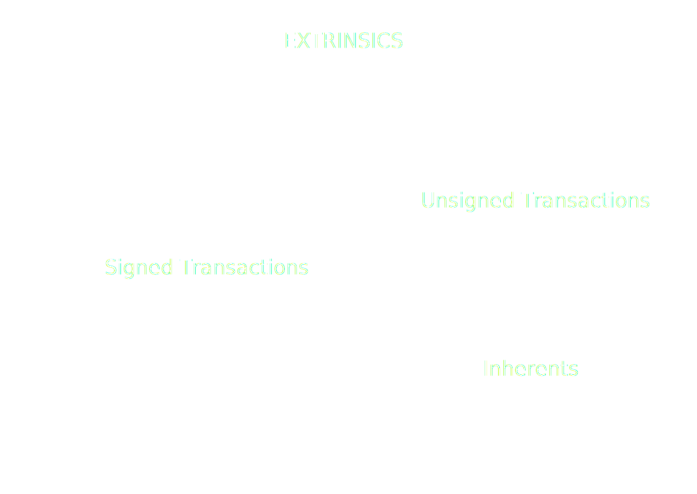

# JSON-RPC Spec

## Transactions

---

## Transactions

---

## JSON-RPC Transaction

- transaction_v1_broadcast(tx) -> id
- transaction_v1_stop(id)

Simple? <!-- .element: class="fragment" --->

Notes:

Not so much

---v

## Challenges

- Creating the transaction
- Transaction validation
- Tracking transactions
- Transaction states

---

# Transactions

---v

## Transaction types

Notes:

https://excalidraw.com/#json=Mv0Y4f-NgpogwQkoTLHfq,JSVgtIc_-tbxSHfuDbZocA

---v

## Extrinsic V4

#### Signed

[0x84 | Address | Signature | Extra | CallData]

#### Unsigned

[0x04 | CallData]

---v

## Signature

- What is being signed?
  - Call data
  - Signed extensions

---v

## Call Data

- The information needed to execute the call.
- Shape:
  - First byte: the index of the pallet.
  - Second byte: the index of the call (inside the pallet).
  - Remaining bytes: the encoded parameters of the call.

Notes:

Ask what is the shortest amount of bytes that a call can have.

---v

## Signed extensions

- Signed extensions are functions that get executed for all transactions, prior to the execution of the call-data. <!-- .element: class="fragment" --->
- They play 2 important roles: <!-- .element: class="fragment" --->
  1. Perform checks to determine whether the transaction is valid. <!-- .element: class="fragment" --->
  2. Provide transversal logic to the execution of a transaction.<!-- .element: class="fragment" --->
- Important: the evaluation of the call-data is not taken into account for determining the validity of a transaction.<!-- .element: class="fragment" --->
- Signed extensions are currently not weighted. Therefore, they must be very cheap to compute.<!-- .element: class="fragment" --->

Notes:

- Example: can a transfer that exceeds the free-balance be a valid transaction? Would that tx be valid?

---v

## Signed extensions - Examples:

<ul>
<li class="fragment">

`CheckGenesis`: ensures that the transaction belongs to this chain.

</li>
<li class="fragment">

`CheckSpecVersion`: ensures that the transaction was created for this runtime version.

</li>
<li class="fragment">

`CheckTxVersion`: ensures that we are using the correct tx version.

</li>
<li class="fragment">

`CheckMetadataHash`: ensures that the signer device used the correct metadata to display the transaction information to the user/signer.

</li>
<li class="fragment">

`CheckMortality`: determines the range of blocks in which the transaction can be included into a block.

</li>
<li class="fragment">

`CheckNonce`: prevents replay attacks.

</li>
<li class="fragment">

`ChargeTransactionPayment`: Handles the logic for charging the fees for the execution of the transaction, it also sets
the tip for the validator.

</li>
</ul>

---v

## Signed Extensions: Extra

- Each signed extensions has 2 different kinds of arguments:<!-- .element: class="fragment" --->
  - Implicitly known data.<!-- .element: class="fragment" --->
  - "Extraneous" data, which must be included in the "extra" field (so that the signature can be verified).<!-- .element: class="fragment" --->
- Examples:<!-- .element: class="fragment" --->
  - The genesis hash, the spec version, the tx version, etc: is known by the chain.<!-- .element: class="fragment" --->
  - The "nonce", the "asset", the "tip" are extraneous data. Therefore, it must be included in the "extra" field.<!-- .element: class="fragment" --->
  - "CheckMortality": the "period" and the "phase" are extraneous, the block hash is implicit data.<!-- .element: class="fragment" --->

Notes: explain how the block has can be derived from the period and the phase, explain how inmortal transactions work.

---

# Transaction States

---v

## Transaction Validation

- The validity of a transaction is determined against a particular block.

  - A transaction could be valid against one block, but invalid against a "sibling fork" of the same height.

- Realistically speaking, there are 3 different kinds of validity states:
  1. Valid: the transaction can be included into the next block.
  2. Invalid: the transaction will "never" be able to be included into a block (and thus, not be broadcasted).
  3. "Future" Valid: the transaction can not yet be included into a block, but it may be included in the future. Ie: nonce
     too high.

Notes:

- Go through different validation states, what they mean
- Transactions valid in a future block.

---v

## Transaction Result

- Once a transaction is included in a block, then the call-data has been evaluated and we can know its outcome.
- A failed transaction is a valid transaction that was included into a block, but did not succeed.

Notes:

- Extrinsic Failed / Extrinsic success
- Difference between failed vs invalid

---v

## Broadcasting

- Once a transaction is deemed as valid it can be broadcasted.
- Broadcasting is a "fire and forget" operation. There is no response.
- Once a transaction is deemed as invalid, we must immediatelly stop broadcasting it.

Notes:

Explain what it means to broadcast - it's not cancellable

---

## Putting it all together

# Transaction Tracking

---v

## Transaction Tracking

---v

## Transaction Life Cycle:

For each transaction:

- Validate beforehand against finalized block.
- Broadcast if it's valid.
- Track it inside incoming blocks, until there is a finalized block where the transaction is either:
  - Included
  - Invalid

Once we find a block where the transaction is either included or invalid, we consider that the transaction is "settled"
on that block. Which implies that we don't have to run any checks for its descendant blocks.

---v

## Transaction Tracking:

- For every "new block" event:

  - Is this block the descendant of a "settled block"?
    - Yes: Ignore.
    - No: Is the transaction present in the body?
      - No: Is it valid in this block?
        - Yes: Ignore.
        - No: Flag the tx for this block as "settled invalid".
      - Yes:
        - Check if the transaction was successful.
        - Flag the tx for this block as "settled successful/unsuccessful"

---v

## Transaction Tracking:

- For every "finalized" event:
  - Is this a "settled" block (or the descendant of a "settled" block)?
    - Yes: Stop broadcasting and report the outcome to the user.
    - No: Ignore

---v

## JSON-RPC TransactionWatch

<pba-cols>
<pba-col>

- submitAndWatch(tx) => subId
- unwatch(subId)

</pba-col>
<pba-col>

- validated
- bestChainBlockIncluded
- finalized
- error
- invalid
- dropped

</pba-col>
</pba-cols>

---v

## Problem

- TransactionWatch is detached from ChainHead
- Might receive blocks that
  - ChainHead hasn't received
  - ChainHead did receive but now unpinned
- Useful only to know if it has been included.
- But can't get any other info: events, storage, etc.
