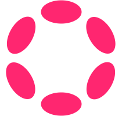
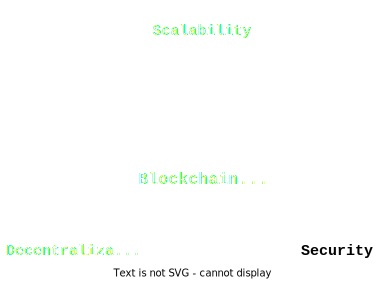
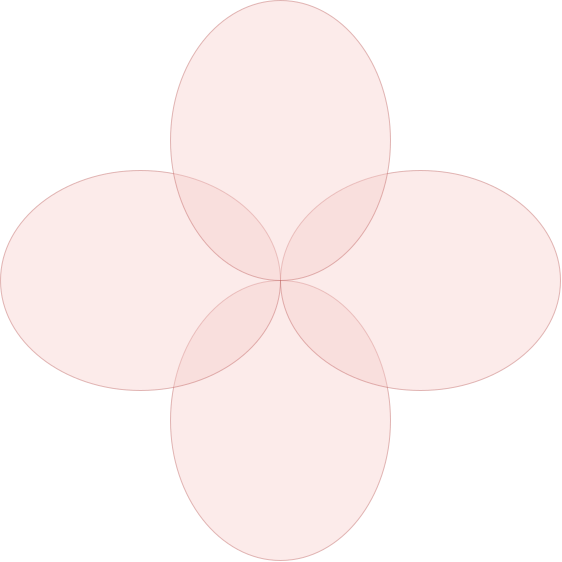

# Polkadot Re-Introduction

Notes:
Introduction

---

# Polkadot Re-Introduction

## Agenda

- Core Tenets
- Blockchain Landscape Overview
- Actors in the Polkadot Network
- Core Polkadot Technologies Glossary
- Polkadot Module Agenda Overview

Notes:

---

# Core Tenets

- [...]

- [...]

- [...]

- [...]

- [...]

Notes:
Before we jump into the main topic let me make a few comments on what are the core tenets of Polkadot. Even tho Polkadot is changing over the years and the protocol evolves those values where accurate when the network first launched, are accurate today and will still be accurate when JAM launches.

---v

# Core Tenets

- **Accessibility**

- [...]

- [...]

- [...]

- [...]

Notes:
The first one is that Polkadot needs to be accesible which should be apparent with the open-source nature of the community. Negligible barriers to innovation, being easy, fast and cheap are the core properties here.

Hopefully all of you being here in this room learning about Polkadot is a bit of a proof of our values, that access to the protocol and the knowledge of it should be easily accessible.

Remember that all of you are here on this free course because the world largest DAO, Polkadot OpenGov funds it. The eocystsem tries to make itself as accessible as possible. And spread of knowledge is a core component here.

---v

# Core Tenets

- Accessibility

- **Generality**

- [...]

- [...]

- [...]

Notes:
Polkadot is a ubiquitous computer and every good computer needs to provide some generality. The key pieces to this were supplied by the customizable and programmable substrate/frame chains so something you got to experience in details over the last few weeks. They are fully adjustable state transition machines that can be deployed online. And they will play an intergral role as building blocks for the Polkadot Ecosystem.

---v

# Core Tenets

- Accessibility

- Generality

- **Composability/Interoperability**

- [...]

- [...]

Notes:
Next one is Composability which can be closely married with interoperability. In Polkadot individual parachains are fully coherent and composable within themselves but to interact between the parachain boundaries you need XCM which grants us native bridging beween the chains. All of that allows various sub-ecosystems to thrive together.

---v

# Core Tenets

- Accessibility

- Generality

- Composability/Interoperability

- **Performance**

- **Resilience**

Notes:

The goal of the next 2 days will be mainly spent understanding how we achieve that last two tenets: Performance and Resilience.

Performance is a big one. We all want a bigger variety of applications hosted on blockchain but this cannot be done unless we provide more throughput and lower latency. Just like web2 systems need to scale their architecture we had to innovate and evolve ours. No longer can every validator EXECUTE and STORE everything and for that we will explore how Polkadot is sharded. In fact we will be exploring both STATE SHARDING and EXECUTION SHARDING in the upcoming lectures.

Do notice that decentralisation is not a core principle, we only care about decentralisation because we believe it provides true resilience. It's not decentralisation for the sake of decentralisation.

---

# Blockchain Landscape

Notes:
Let's zoom out for a second and remind ourselves how Polkadot overall aims to compare to the blockchain landscape and what it aims to bring to the table. This is my own take on the history but I will try and highlight some core innovations, strenghts and weaknesses of all the different solutions so we can appreciate and understand all the trade-offs.

---v

# Blockchain Landscape

## Simple Monolithic - (Bitcoin etc)

<pba-cols>
<pba-col>
  <ul>
    <li>Shared single state</li>
    <li>Everyone executes everything</li>
    <li>Shared single and constant state transition function</li>
  </ul>
</pba-col>
<pba-col>

</pba-col>
</pba-cols>

Notes:
We started with single simple state machine blockchains like Bitcoin. Every node hat to fully sync up and store the state and reexecute all the state transitions. Nevertheless it initially didn't require much hardware and was easy to host so a well diversified networks of nodes quickly arose.

The state transition function was immutable. It was just moving balances left and right so it was all essentially a giant ledger.

And I often here the complaint that blockchains are jsut giant ledgers and it certainly was true in the past. BUt modern blockchains are so so much more than that. They are closer to virtual computers than ledgers.

---v

# Blockchain Landscape

## General Monolithic - (Ethereum 1.0 etc)

<pba-cols>
<pba-col>
  <ul>
    <li>Shared single state</li>
    <li>Everyone executes everything</li>
    <li><b>Programmable logic (smart contracts)</b></li>
  </ul>
</pba-col>
<pba-col>

</pba-col>
</pba-cols>

Notes:
And that was all started with Ethereum. The big innovation was that it was programmable. The state transition function was no longer immutable but instead effectively turing complete. This opened up a lot more demand for blockchain throughput but original Ethereum did really not address this demand. Everything was being reexecuted by every single validator.

This was still a world where each blockchain to communicate with another needed to develop a brand new bridging technique supporting both landscapes.

---v

# Blockchain Landscape

## Supercharged Monolithic - (Solana etc)

<pba-cols>
<pba-col>
  <ul>
    <li>Shared single state</li>
    <li>Everyone executes everything</li>
    <li>Programmable logic (smart contracts)</li>
    <li>[...]</li>
  </ul>
</pba-col>
<pba-col>

</pba-col>
</pba-cols>

Notes:
Then there came solutions that tried to quickly boost the throughput. The easiest solution to achieve it was to throw money at it. So all the core state, execution and generality components are the same as previously but the hardware just gets super beefy and expensive.

---v

# Blockchain Landscape

## Supercharged Monolithic - (Solana etc)

<pba-cols>
<pba-col>
  <ul>
    <li>Shared single state</li>
    <li>Everyone executes everything</li>
    <li>Programmable logic (smart contracts)</li>
    <li><b>Just on super expensive hardware</b></li>
  </ul>
</pba-col>
<pba-col>

</pba-col>
</pba-cols>

Notes:
Each validator and node is required to use this very expensive hardware which technically allows the monolithic solution to "scale". This solution comes with major trade-offs because running a node gets so expensive only a single operator or maybe a few can afford it which generally sacrifices on the core tenets of blockchain.

It topoligically looks like all other monolithic but just a lot more sparse and centralised.

---v

# Blockchain Landscape

## Fragmented Networks - Cosmos

<pba-cols>
<pba-col>
  <ul>
    <li><b>State split between subnetworks</b></li>
    <li><b>Fragmented economic security</b></li>
    <li><b>Execution separated and encapsulated within subnetworks</b></li>
    <li>Programmable logic (usually)</li>
  </ul>
</pba-col>
<pba-col>

</pba-col>
</pba-cols>

Notes:
Now we can take a look at solutions that realised a single state machine is not scalable. To scale we need to delegate, separate, split and shard.

One solution like that is Cosmos which features a framework for building blockchains and they provide a shared communication language between chains. Although the chains in the cosmos world all have different security guarantees and different rules and while they can speak the same messaging language it is up to the chains to ensure the message gets to the other chains and is respected there.

In this solution cosmos blockchains are like separate islands, they technically speak the same language but they are so remote and independent it is difficult to fascilitate safe and regular communication. Each island is responsible for their own security and resources needed for maintaining security are spread between the islands.

---v

# Blockchain Landscape

## Sharded Networks - Polkadot

Notes:
And finally we can take a look at Polkadot. Polkadot since day 1 of its inception was centered around sharding. A single monolithic blockchain cannot scale unless it compromises on core blockchain principles.

---v

# Blockchain Landscape

## Sharded Networks - Polkadot

Notes:
and at this point I'm sure you all are very familiar with the blockchain trilemma.

---v

# Blockchain Landscape

## Sharded Networks - Polkadot

Notes:
So on a high level Polkadot also decided to split the state into smaller subnetworks.

---v

# Blockchain Landscape

## Sharded Networks - Polkadot

Notes:
Each subnetwork or shard with a fully programmable runtime logic thanks to substrate and wasm.

---v

# Blockchain Landscape

## Sharded Networks - Polkadot

Notes:
but then Instead of fully separating the execution and security layers Polkadot instead chooses to start pooling them together. Combining forces.

---v

# Blockchain Landscape

## Sharded Networks - Polkadot

Notes:
From the diagram here you can start noticing that there is a region forming that is crossection between all of the islands. The islands are no longer separated, individual beings, they have something in common.

---v

# Blockchain Landscape

## Sharded Networks - Polkadot

Notes:
And the more and more subnetworks we add the emergent existence of this central core becomes more and more obvious.

---v

# Blockchain Landscape

## Sharded Networks - Polkadot

Notes:
So lets crystalize it a bit. Some nodes remain unique and specialised for the subnetwork while others aim to remain very generic and sitting in the middle. The middle section is not just one node but a full on family of general compute nodes able to fully sync up with every other subnetwork in the ecosystem.

---v

# Blockchain Landscape

## Sharded Networks - Polkadot

Notes:
The universal nodes in the middle will be a unifying force bringing together all the subnetworks into a single cohesive structure. We will be looking into more and more detail of what is this central structure, but some of you might already now it as the Polkadot Beacon Chain, or Polkadot Relay Chain. This is the auditing layer of Polkadot that is the source of its security and interoperability.

And looking at this diagram it should already be pretty straightforward to see what the Polkadot logo actually represents. Just by adding a bit of color...

---v

# Blockchain Landscape

## Sharded Networks - Polkadot

Notes:
And we can arrive to our familiar design.

---v

# Blockchain Landscape

## Sharded Networks - Polkadot

Notes:
Pause

---v

# Blockchain Landscape

## Sharded Networks - Polkadot

<pba-cols>
<pba-col>
  <ul>
    <li>Sharded state</li>
    <li><b>Shared security</b></li>
    <li><b>Sharded execution</b></li>
    <li>Programmable logic</li>
    <li>Built in bridging</li>
  </ul>
</pba-col>
<pba-col>

</pba-col>
</pba-cols>

Notes:
Let's summarize and zoom out for a second.

Polkadot is at its core a sharded network. The state and execution is separated into subnetworks, but the security is pooled and not separated. Individual subnetworks are of course fully programmable with wasm runtimes.

You can think of the polkadot rolay chain as a layer 0 solution. It's like a mothership for all the smaller shards connecting to it.

Additionally Polkadot not only provides a messaging language BUT it also comes with a messaging protocol over which those messages can be sent and received.

---v

# Blockchain Landscape

## Sharded Networks - Polkadot

Notes:
In this module we will be mainly focusing on the role of responsibilities of the central nodes. They are the Polkadot validators hosting the Polkadot Relay Chain.

The subnetworks are called parachains, parallel chains -> parachains. And the nodes for parachains are called collators. They are akin to sequencers in other ecosystems and parachains are like rollups or L2 solutions.

---

## Main Actors

Notes:
So let's do a quick summary of the different actors we'll be seeing in this module. Think of the Polkadot Protocol as a game with different teams and roles and the actors here as players.

---v

## Main Actors

- **Validators**
- [...]
- [...]
- [...]

Notes:
There will be 4 main actors that we will be discussing. First and foremost we have the Validators. When we say the validators we mean the physical nodes of the Polkadot Relay Chain. They are the general purpose super-validators that allow all the parachains to come together and meet at the relay chain. They are also the block producers of the relay chain.

There is a subflavour of a validator worth mentioning here. Validators are a wide set but only some of them are elected to perform their duties in the active validator set. Usually when we say validator we mean an active validator currently selected by the staking system. The staking elections take place every day but we will discuss that in the next lecture.

---v

## Main Actors

- Validators
- **Collators**
- [...]
- [...]

Notes:
Another crucial actor is a collator. Collators are parachain or rollup nodes. They are nodes specialized in supporting their own subnetworks. Ther main job managing parachain state and gathering together transactions to then send them over to the relay chain for audting. They also need to manage physical hardware to perform all those duties.

---v

## Main Actors

- Validators
- Collators
- **Nominators**
- [...]

Notes:
Nominators are a bit more ephemeral. They generally are not physical nodes but abstract account holding some funds. They are all the DOT tokenholders participating in the staking protocol to elect validators. You can think of them as the stakers.

Trivia, validators are often also nominators of themselves.

---v

## Main Actors

- Validators
- Collators
- Nominators
- Users

Notes:
Users here are a bit of a blanket statement, but I generally mean the people or entities that submit transactions or extrinsics. This might be a proxy or a UI interface that submits it in the end but from the perspective of the protocol we don't care that much.

Disclaimer: This is not en exhaustive list and there are some extra actors as well as various subflavours of the presented here roles. For instance some nodes don't store the fully blockchain history while others don't and we call them archival nodes. There are also light clients and simillar. My aim here is to show you the 4 core roles we'll see in the protocol.

For every lecture or subprotocol we'll be discussing I will try and provide a general outline of what actors will be participating in it.

---

# Core Technologies of Polkadot

Notes:
Now that we enumerated all the actors it's time for more lists. You all already worked a bunch with various technologies that are foundational to Polkadot but I wanted to make a short glossary of the key pieces. So what core technologies used to power Polkadot today?

---v

# Core Technologies of Polkadot

1. Framework: Substrate
1. VM: WASM/PolkaVM
1. Governance: OpenGov
1. [...]
1. [...]
1. [...]
1. [...]
1. [...]
1. [...]

Notes:
Some of them you are already very familiar with. Substrate is our framework for building modular blockchains and WASM is the go-to runtime featured in Substrate. Substrate and Wasm together gives us monolithic and proggrammable blockchains to play with.

Governance which was already discussed at depth is for the evolutions of the system. Runtimes can be changed over time and system parameters can be adjusted. Governance is also crucial for rescue operations in emergency situations.

---v

# Core Technologies of Polkadot

1. Framework: Substrate
1. VM: WASM/PolkaVM
1. Governance: OpenGov
1. Authority: Nominated Proof of Stake
1. [...]
1. [...]
1. [...]
1. [...]
1. [...]

Notes:
Then we have something a bit newer. The authority modules which essentialy need to decide who gets to be in the temporary priviliged set of relay chain validator nodes running the show. We are using a Nominated Proof of Stake system and we'll dive into it in the next lecture. It's a more energy efficient alternative to Proof of Work, and a more democratic one than Proof of Authority.

---v

# Core Technologies of Polkadot

1. Framework: Substrate
1. VM: WASM/PolkaVM
1. Governance: OpenGov
1. Authority: Nominated Proof of Stake
1. Block Production: BABE/SASSAFRAS
1. [...]
1. [...]
1. [...]
1. [...]

Notes:
Next is block production. Once NPoS selected us some relay chain validator then we need to figure out between them who makes the next block. And Polkadot Relay Chain is just a substrate blockchain in the end. Someone needs to author the relay chain Block and this is where BABE comes in.

In future we will be transition to a newer variant called Sassafras but we will cover that in the Block Production lectures.

---v

# Core Technologies of Polkadot

1. Framework: Substrate
1. VM: WASM/PolkaVM
1. Governance: OpenGov
1. Authority: Nominated Proof of Stake
1. Block Production: BABE/SASSAFRAS
1. Sharding: ELVES
1. [...]
1. [...]
1. [...]

Notes:

---v

# Core Technologies of Polkadot

1. Framework: Substrate
1. VM: WASM/PolkaVM
1. Governance: OpenGov
1. Authority: Nominated Proof of Stake
1. Block Production: BABE/SASSAFRAS
1. Sharding: ELVES
1. Shard Interoperability: XCMP + XCM
1. [...]
1. [...]

Notes:

---v

# Core Technologies of Polkadot

1. Framework: Substrate
1. VM: WASM/PolkaVM
1. Governance: OpenGov
1. Authority: Nominated Proof of Stake
1. Block Production: BABE/SASSAFRAS
1. Sharding: ELVES
1. Shard Interoperability: XCMP + XCM
1. Finality: GRANDPA, BEEFY
1. [...]

Notes:

---v

# Core Technologies of Polkadot

1. Framework: Substrate
1. VM: WASM/PolkaVM
1. Governance: OpenGov
1. Authority: Nominated Proof of Stake
1. Block Production: BABE/SASSAFRAS
1. Sharding: ELVES
1. Shard Interoperability: XCMP + XCM
1. Finality: GRANDPA, BEEFY
1. Scheduling: CoreTime

Notes:

---v

# Core Technologies of Polkadot

1. Framework: Substrate
1. VM: WASM/PolkaVM
1. Governance: OpenGov
1. Authority: Nominated Proof of Stake
1. Block Production: BABE/SASSAFRAS
1. Sharding: ELVES
1. Shard Interoperability: XCMP + XCM
1. Finality: GRANDPA, BEEFY
1. Scheduling: CoreTime
1. Database: RocksDB
1. Encoding: SCALE
1. Networking: LibP2P/LiteP2P

Notes:
This isn't a comprehensive list of all the technologies but there are some more generic ones in the backend connected to databases, networking and encoding like RocksDB, SCALE, and LibP2P.

---

# Polkadot Module Agenda

1. Re-Introduction
1. Staking
1. Block Production
1. State Sharding
1. Data Availability
1. Execution Sharding
1. Confirmations and Finality
1. Scheduling
1. JAM & Future

Notes:
Now it's time to have a generak overview of the topics and lectures I have planned specifically for this module.

We will be primarily covering the relay chain protocol aspects. You can think of the relay chain protocol as a big game. Staking is what selects the player for the game. Block production is who gets to make the next move. All the other lectures are trying to explain the rules of them game. To be precise the next ext three lectures of State Sharding, Data Availability and Execution Sharding are all parts of the ELVES protocol. This is how Polkadot scales and guarantees shared security to its rollups.

Finality is a bonus rule to the game that gives us a lot of new features. And scheduling is just some organizational janitorial stuff.

---v

## Why are we learning it?

Notes:
And I want to make something clear. We will be diving deep into the protocol. This is stuff that's not the easiest but I don't believe you all are here to learn the easy stuff.

Different parts of what we'll be learning will be useful to different people. Some will build light clients, some wallets, some will join parity, others will optimize execution for parachains. There will be something for everyone.

And in general If all you care about is building a simple dapp that moves the balances left and right you might not need to have such an in-depth knowledge, just a bit of solidity is enough.

But if you ever want to innovate and build something new, then you need to learn what the boundaries are before pushing them further. And the boundaries in blockchain mainly arise from the protocol itself.

If you want to build the next uniswap, cryptokitties, next moonbeam or hyperbridge then we have to understand the protocol.

---

# JAM

Notes:
now let's give a short disclaimer about JAM. I am not focusing on it but it's worth making a stance and how it connects to what I'll be talking about.

---v

# JAM

## Polkadot 3.0

JAM is a further generalization and abstraction of Polkadot.

JAM can do everything the current Polkadot Relay Chain can and more stuff on top of it.slightly different. That means that whatever Polkadot does now will still be very relevant in JAM.

Notes:
JAM was proposed as a potential next step for the Polkadot Network. Generally think of it as a generalization of the protocol. JAM can do everything the current Polkadot Relay Chain can and more stuff on top of it.

So many of the steps in parachain consensus like finality, block production, approval checking and disputes will be recreated and ported to JAM, so understanding them now gives you an awesome headstart to understanding what JAM truly aims to achieve.

---
