### Transforming Math Formulas into Code

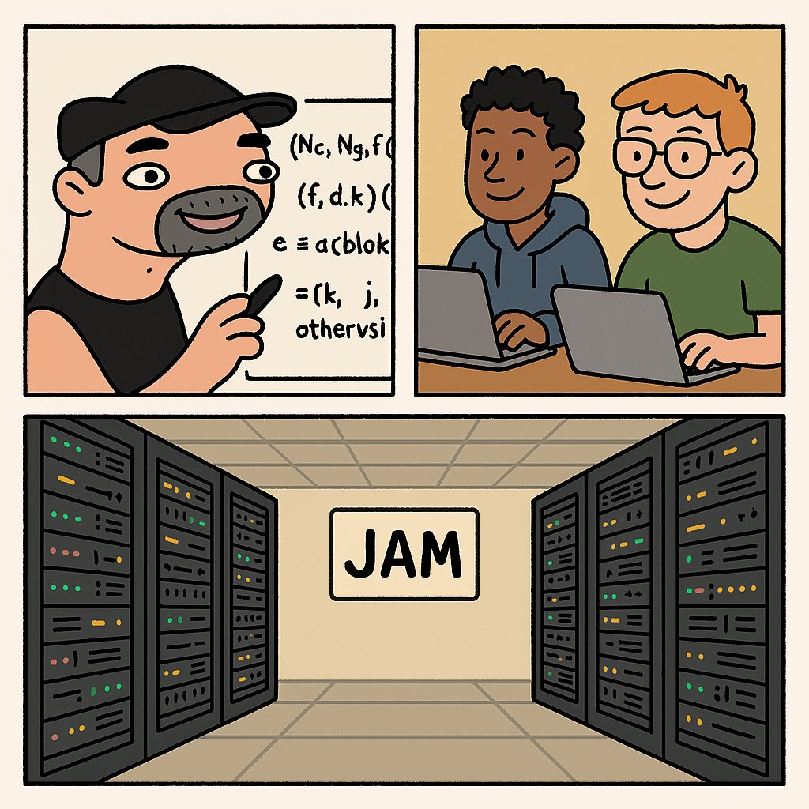

---

## What is this talk NOT About?

- What is JAM 🚫
- Why JAM is useful 🚫
- How JAM is different from Polkadot 🚫

---

## What is this talk About?

- Hands-on approach ✅
- Read (and understand) math formulas ✅
- Implement JAM in actual code ✅

---

## JAM Crypto Innovations

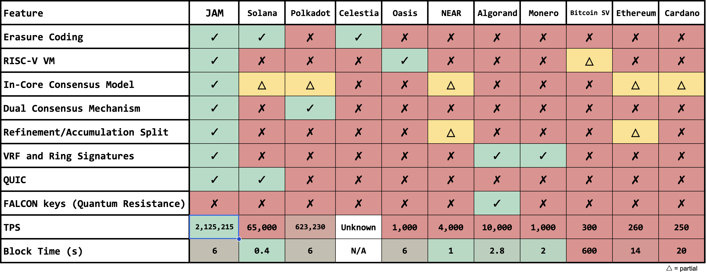

---

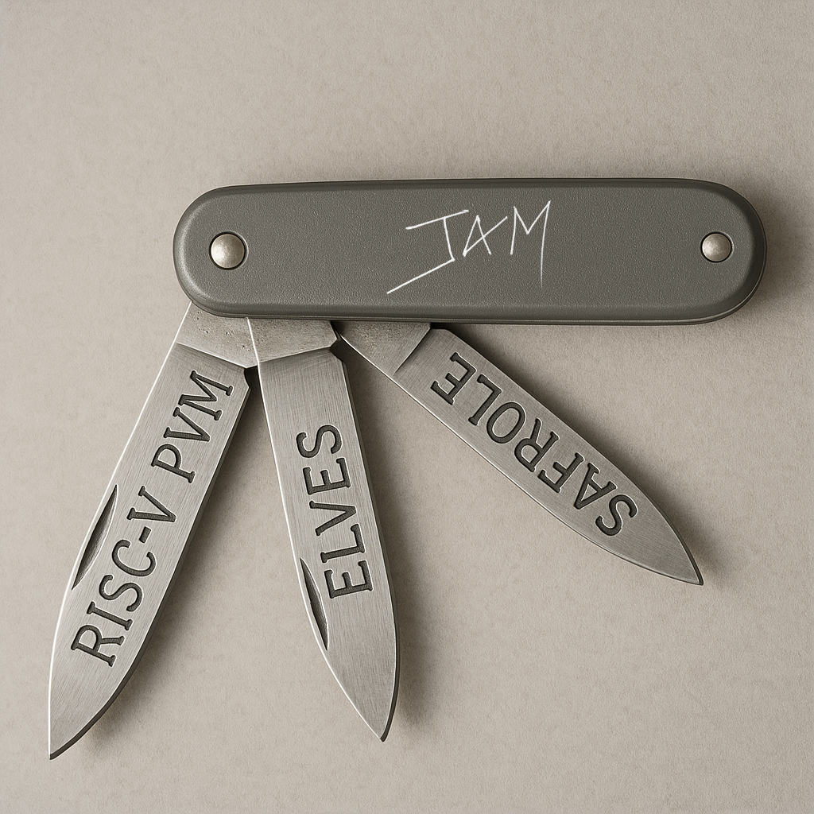

---

## JAM Crypto Innovations

<!--  .slide: data-visibility="hidden" -->

- Polkadot Virtual Machine (PVM) - RISC-V
- Erasure Coding DA
- VRF Ring Signatures / Bandersnatch
- In-core + on-chain
- Parallel Execution
  - Each Core runs different computing jobs
  - State components updated in parallel
- Safrole and Grandpa - less forks

---

# Formal Specification

---

## PVM

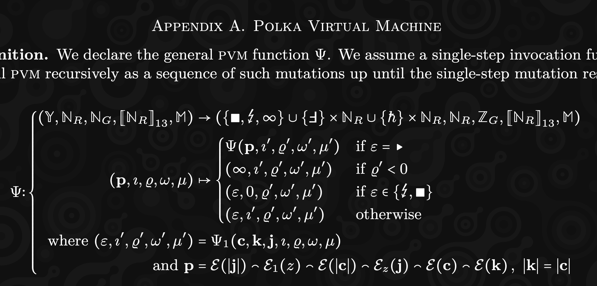

---

## Erasure Coding

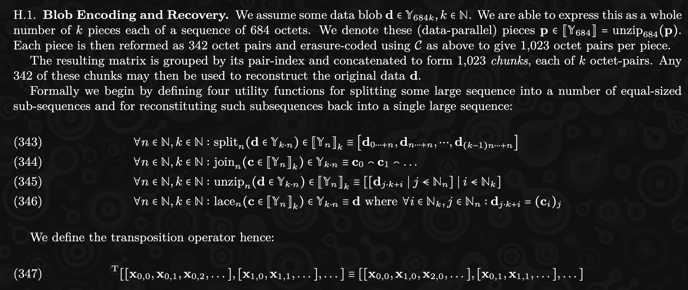

---

## Bandersnatch

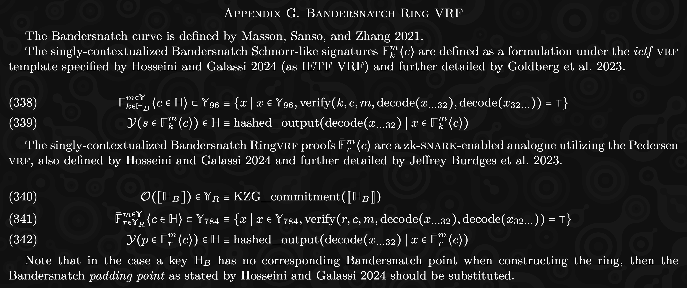

---

## Disclaimer ⚠️

- I learnt **Rust** 16 months ago in PBA Hong Kong.
- 12 months ago I decided to build JAM in **Elixir**

---

## Block Structure

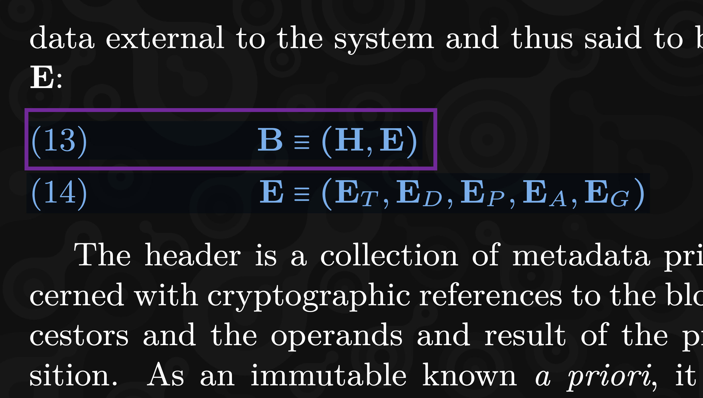

```rust
struct Block {
    header: Header,
    extrinsic: Extrinsic,
}
```

---

## Extrinsic Structure


```rust
struct Extrinsic {
    tickets: Vec<Ticket>,
    disputes: Disputes,
    preimages: Vec<Preimage>,
    assurances: Vec<Assurance>,
    guarantees: Vec<Guarantee>,
}
```

---

## State Structure

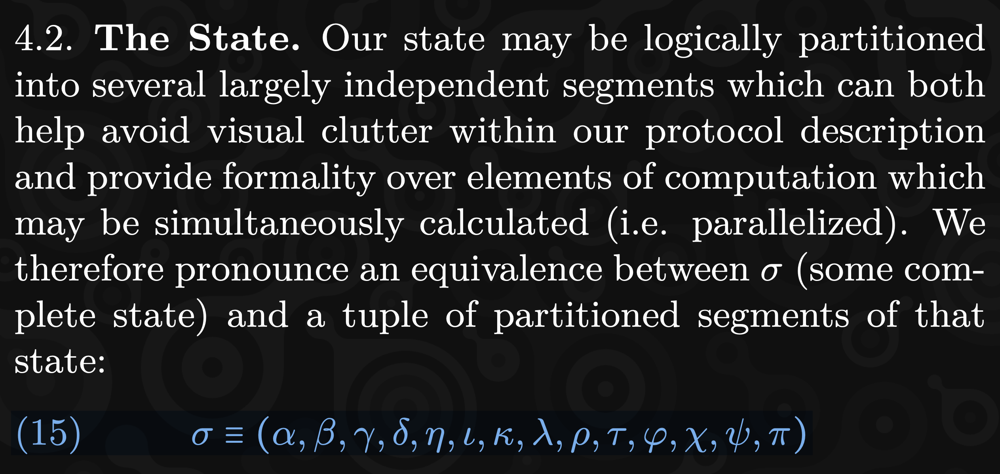

```rust
struct State {
    authorizer_pool: Vec<Vec<Hash>>,         // α
    recent_history: RecentHistory,           // β
    safrole: Safrole,                        // γ
    services: HashMap<u64, ServiceAccount>,  // δ
    entropy_pool: EntropyPool,               // η
    ...
}
```

---

## State Transition Function

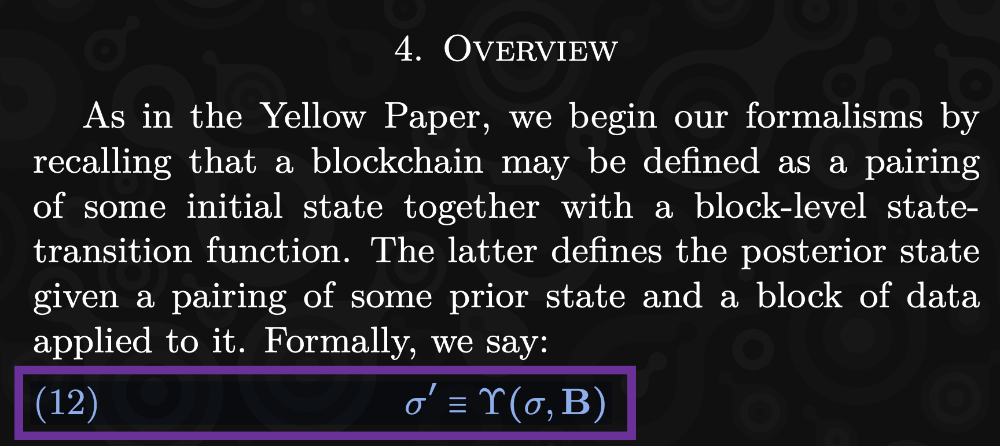

```rust
let new_state = state_transition(state, block)

fn state_transition(state: &State, block: Block) -> State {
  // Logic to update state with new block
}
```

---

## State Dependencies

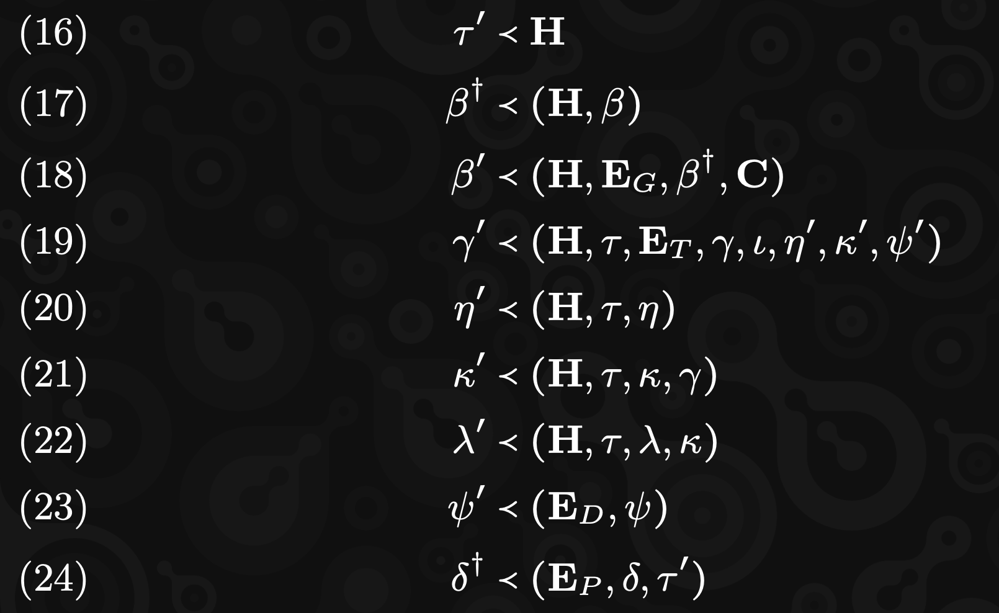

```rust
let timeslot_ = get_timeslot(h);
let history_daga = get_history_data(h, &state.recent_history);
let history_ = get_history_(h, &ext.tickets, &history_daga, c);
```

---

## Data Encoding

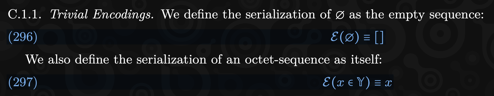

```rust
trait Encode {
    fn e(&self) -> Vec<u8>;
}

impl Encode for Vec<u8> {
    fn e(&self) -> Vec<u8> {
        self.clone()
    }
}

```

---

## Data Encoding

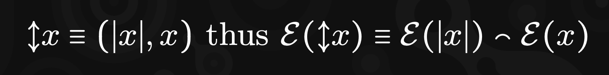

```rust
struct VariableSize<T> {
    size: usize,  // Assuming size is stored as usize
    value: T,     // Generic type to allow flexible values
}

impl<T: Encode> Encode for VariableSize<T> {
    fn encode(&self) -> Vec<u8> {
        let mut encoded = Vec::new();
        encoded.extend(self.size.to_le_bytes()); // Encode size as bytes
        encoded.extend(self.value.encode());     // Encode the actual value
        encoded
    }
}
```

---

## Data Encoding (Elixir)


```Elixir
def e(nil), do: []
def e(x) when is_binary(x), do: x
def e(%VariableSize{} = x), do: e(x.size) <> e(x.value)
```

---

## Block Encoding

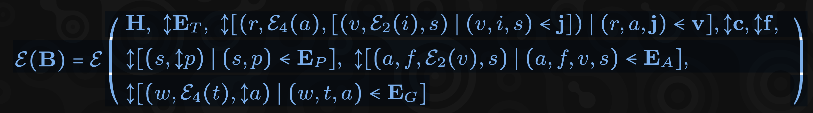

```rust
impl Encode for Block {
    fn encode(&self) -> Vec<u8> {
        let mut encoded = Vec::new();
        encoded.extend(self.header.encode());
        encoded.extend(self.extrinsic.encode());
        encoded
    }
}

impl Encode for Extrinsic {
    fn encode(&self) -> Vec<u8> {
        let mut encoded = Vec::new();
        encoded.extend(self.tickets.encode());
        encoded.extend(self.disputes.encode());
        ...
        encoded
    }
}
```

---

## Block Encoding (Elixir)


```Elixir
  def e(%Block{extrinsic: e, header: h}), do: e({h, e})

  def e(%Block.Extrinsic{} = ex),
    do: e({vs(ex.tickets), ex.disputes, vs(ex.preimages),
     vs(ex.assurances), vs(ex.guarantees)
    })
```

---

## PVM

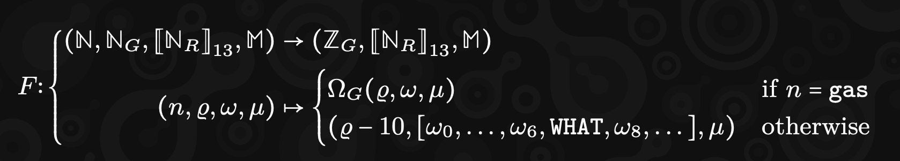

```rust
fn f(
      n: u64,
      gas: u64,
      mut registers: Vec<u64>,
      memory: Memory
) -> (u64, Vec<u64>, Memory) {
  if n == GAS {
      return Host::remaining_gas(gas, registers, memory);
  }
  registers[7] = WHAT;
  (gas.saturating_sub(10), registers, memory)
}
```

---

## Conclusion

- Start coding to understand JAM from a developer's perspective
- Faster development
- Functional alignment with math
- Learn Elixir, as its functional features reduces learning curve
