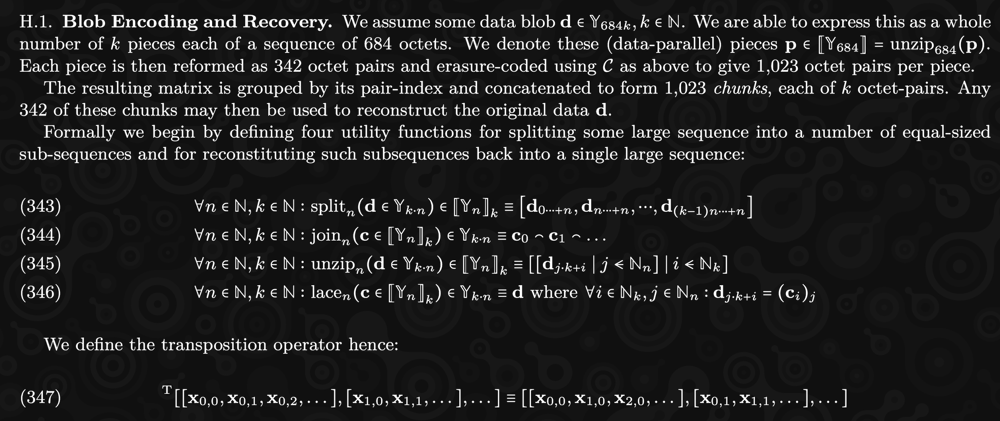
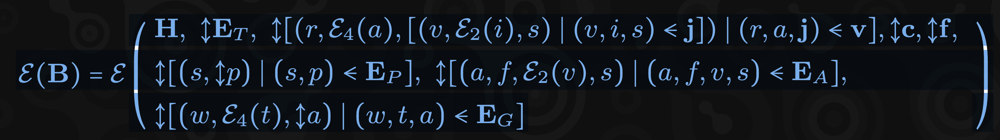

# Not about JAM

---

#### What is this talk about?

Our aproach <br />
to learning how <br />
to implement JAM

Notes:
We want to share with you how we approached building JAM from scratch in TypeScript
(crazy idea, I know) in hope to encourage you to do the same in your language
of choice.

---

#### How do you even start?

- The Gray Paper
- JAM Lectures (youtube)
- The Gray Paper
- Element Rooms (#jam:polkadot.io, #graypaper:polkadot.io)
- The Gray Paper
- Did I mention the Gray Paper already?

Notes:
We want to share with you how we approached building JAM from scratch in TypeScript
(crazy idea, I know) in hope to encourage you to do the same in your language
of choice.

---

#### Gray Paper - First impression



Gray Paper is a description of the protocol using language-agnostic,
mathematical notation.

Notes:
As you probably already know, the main source of truth for JAM is the Gray Paper.
It's a formal specification of the protocol, which uses a mix of a prose and math
notation to describe the IMPORTANT (consensus-sensitive) details in a language
agnostic way.

So when you start off the first thing you'll see is something like.

---v

#### Gray Paper - The scary stuff



Block encoding description.

Notes:
If you go deeper, things might get a little bit more scary though! :)

---v

#### Gray Paper - Even worse (!)


A recursive step-by-step invocation function describing PVM.

Notes:
Or even this!

---

#### Bottom-up approach

Start from the very beginning and go through the formulas 1 by 1

<!-- .element: class="fragment" -->

- ✅ straightforward to start
- ✅ works equally well if you do and don't have experience
- ❌ you might get stuck
- ❌ depending on the language you might end up with inefficient architecture

<!-- .element: class="fragment" -->

---v

### Top-down approach

Think high level about the client architecture first

<!-- .element: class="fragment" -->

- ✅ you MIGHT build a very efficient client
- ❌ requires a lot of experience
- ❌ extremely easy to get wrong

<!-- .element: class="fragment" -->

---v

### Reality (our approach)

- Alternate between bottom-up and top-down.

- Points to consider:
  - Team composition
  - Understanding of the domain
  - Understanding the language/technology

---

#### Who are we?

- JAM implementation in TypeScript
- JAM tooling (also TS)

- Dev team:
  - 1 dev with blockchain background
  - 1-3 TS devs with no prior blockchain background
  - 2 frontend developers

---

### How did we actually start?

- 📖 Reading the prose of Gray Paper.

  - Getting the gist of what JAM is about.

- 🤖 Figured, we will be working with raw bytes a lot
  - `Bytes<N>` and `BytesBlob` helpers.

<!-- .element: class="fragment" -->

- 💾 Reading (not running!) JSON tests (w3f/jamtestvectors)

  - Type-safe custom parser.

- ⏱️ Performance measurements from day 1
  - Micro-benchmarks for "low-level" stuff.

<!-- .element: class="fragment" -->

Notes:

- Reading/loading JSON tests allows us to get some understanding of what's
  going to be needed and how things might need to be stitched together.
  While it seems super simple `JSON.parse` we've learned a ton just
  by trying to model the data structures in a typesafe way.
- Obviously the choice of the language dictates the steps that you need to
  tackle first. If you have support for bytes natively - why bother :)

---v

#### `Bytes` helpers

```ts
export class Bytes<T extends number> extends BytesBlob {
  readonly length: T;
  ...
  static fromBlob<N extends number>(len: N, v: Uint8Array): Bytes<N> {...}
  static fromNumbers<N extends number>(len: N, v: number[]): Bytes<N> {...}
  static zero<N extends number>(len: N): Bytes<N> {...}
  static fill<N extends number>(len: N, input: U8): Bytes<N> {...}
  static parseBytes<N extends number>(len: N, v: string): Bytes<N> {...}

  /** Compare the sequence to another one. */
  isEqualTo(other: Bytes<T>): boolean {
    check(this.length === other.length, "Comparing incorrectly typed bytes!");
    return u8ArraySameLengthEqual(this.raw, other.raw);
  }
}
```

---v

### Benchmarking examples

- 🤔 What's the most performant way to represent a `Bytes<32>` in TypeScript?
- 🤠 We need data structures! `Set`, `Dictionary`
- 🚄 Hashing / Crypto - WASM gives us huge gains.

Notes:
While it's not strictly necessary to be a performant client for the first milestones
we are focusing on the performance as we go since our ambitions reach beyond M2/MN2.

---v

### Benchmarking

```ts
type ArrayHash = Uint8Array;
type NumberHash = number[];
type StringHash = string[];
type PackedNumberHash = number[];
type BigIntHash = bigint[];
```

Which one is the fastest?

---v

# OBVIOUSLY IT DEPENDS!

- comparison?
- ordering?
- memory consumption?
- string-parsing?
- worker-threads passing?

The trade-offs of time-investement might be completely different for your
language of choice. But the optimisation goal always matters.

---

#### Implementation as exploration

- While re-reading the Gray Paper we started composing the low-level structures
  and modeling the initial (very rough) architecture.
- Some other structures were composed based on the W3F JSON test vectors
  and later fact-checked with the Gray Paper.

<br />

- ✅ GP-navigation skills
- ✅ Detecting language-specific caveats
- ✅ Just start coding.

Notes:

By searching the structures in the Gray Paper we were gaining better knowledge
about the structure of the paper.

---v

### Header code sample

```ts
export class Header extends WithDebug {
  ...
  /**
   * `H_p`: Hash of the parent header.
   *
   * In case of the genesis block, the hash will be zero.
   */
  parentHeaderHash: HeaderHash = Bytes.zero(HASH_SIZE).asOpaque();
  /** `H_r`: The state trie root hash before executing that block. */
  priorStateRoot: StateRootHash = Bytes.zero(HASH_SIZE).asOpaque();
  /** `H_x`: The hash of block extrinsic. */
  extrinsicHash: ExtrinsicHash = Bytes.zero(HASH_SIZE).asOpaque();
  /** `H_t`: JAM time-slot index. */
  timeSlotIndex: TimeSlot = tryAsTimeSlot(0);
  ...
}
```

---v

#### Block code sample

```ts
/**
 * The block consists of the header and some external input data (extrinsic).
 *
 * `B = (H, E)`
 * https://graypaper.fluffylabs.dev/#/579bd12/089900089900
 */
export class Block extends WithDebug {
  ...
  constructor(
    /** `H`: Block header. */
    public readonly header: Header,
    /** `E`: Extrinsic data. */
    public readonly extrinsic: Extrinsic,
  ) { ... }
}
```

---v

#### Gray Paper Reader


---

#### In the search of unknown-unknowns

- 😎 known-knowns: Things we are aware of and understand.
- 😱 known-**unknowns**: Things we are aware of but don't fully understand.
- 🤯 **unknown-unknowns**: Things we are not even aware exist, so we cannot prepare
  for them.

Notes:

While you gain understanding of the Gray Paper and the overall domain, you start
to realize that there are things that you have to do that you didn't even consider
ealier. These unknown-unknowns turn into known-unknowns.

---v

### How to proceed?

1. Depth-first mode:
   1. Pick a known-know.
   1. Research it and uncover known-**\*unknowns**.
   1. Add them to the list.
   1. If you have enough items on the list:
      - go to (2) otherwise go deeper.
2. Breadth-first mode:
   1. Parallelize the work
   1. Go back to (1.) if you run out of tasks.

Notes:

- After we got enough **known-unknowns** we went into breadth-first mode
- and parallelized the work.

---

### First "proper" tasks

- Codec
- Merkleization
- PVM
- State transitions
- Running test vectors **\***

Gav's notes on this: <br />
https://hackmd.io/@polkadot/jamprize#Advice

Notes:

- We figured implementing for JSON test vectors will be simple, so we initially
  went with things that we believed are going to be hard :)

---v

### First tasks - take aways

- ❌ Don't rely ONLY on JSON test vectors.
- ✅ Invest in your own unit testing suite.

Notes:

- JSON tests are work in progress and will change.

---

### PVM - alternative implementation

- AssemblyScript - sub-set of TypeScript, can be compiled to WASM
- Since optimizing stuff to WASM will be needed it was a fun experiment
  to learn AS via PVM.

Game of life demo: https://todr.me/anan-as/conway.html

---v

### Second PVM - Why?

- Fuzz testing between the two implementations found us a ton of bugs.
- PVM debuggger was extremely handy in identifying differences.
- More work, but extremely helpful to share experiences and PoVs.

PVM debugger demo: https://pvm.fluffylabs.dev

---v

### PVM take aways

- 🤠 Building an interpreter is fairly easy (common sense).
- 🫣 Making it fully compatbile with GP is harder (focus on the formulas).
- ☠️ Polkadot-level performance (recompiler) - seems very time-consuming.

**\*** There is a Non-PVM Validating Node Path though.

---

### Open ideas

- ⁉️ WASM to PVM recompiler?
  - AssemblyScript JAM SDK!
- ⁉️ PVM JAM-Client-Plugin support?
  - Non-core code: RPC, indexers, protocol extensions, etc.
- ⁉️ What components does our Web3 stack miss?
  - Should "Your project is just a web2 database?" be the answer?

---

# Questions?
