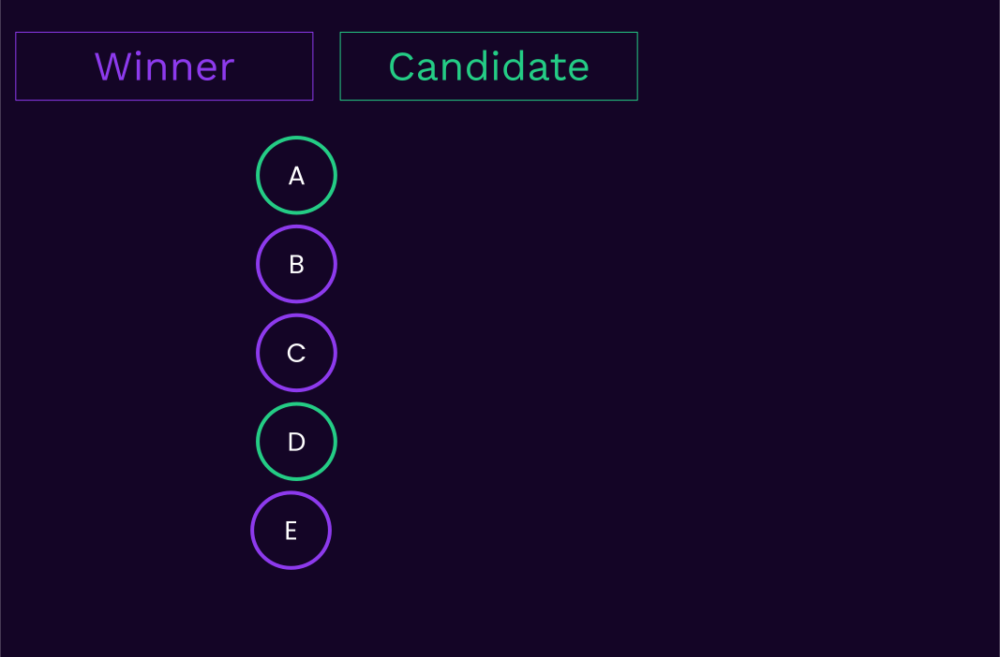
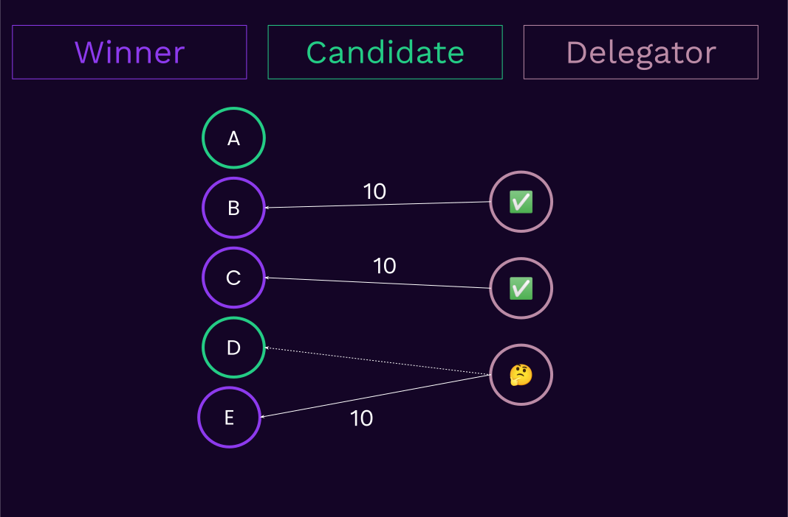
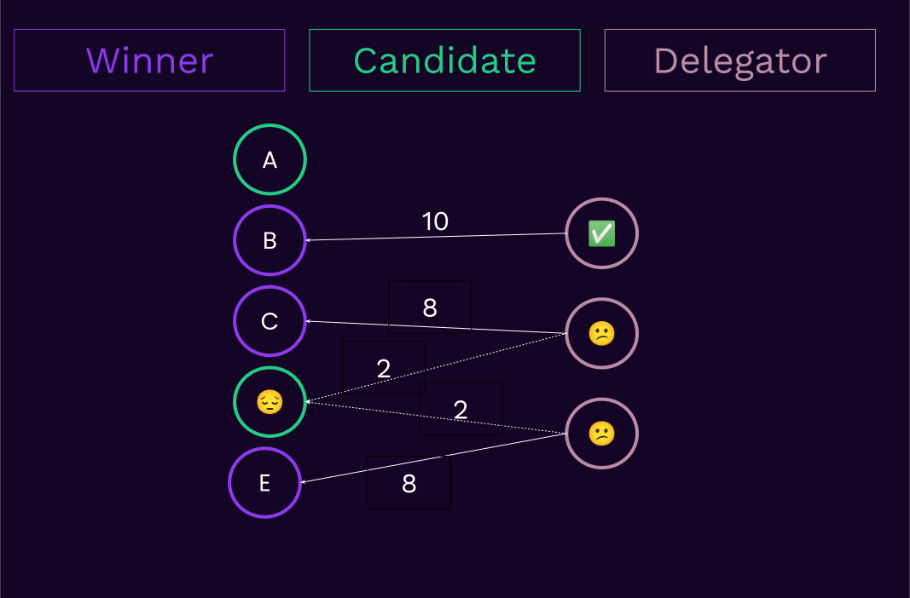
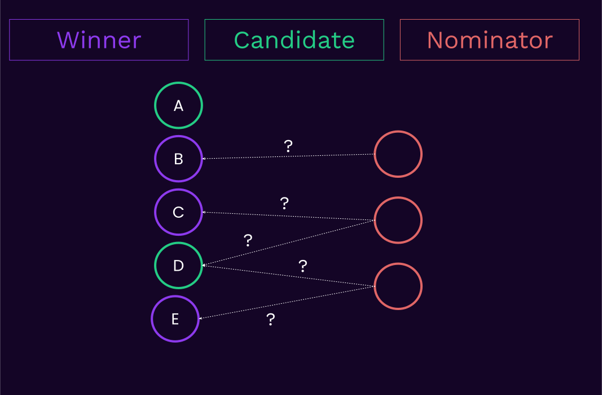
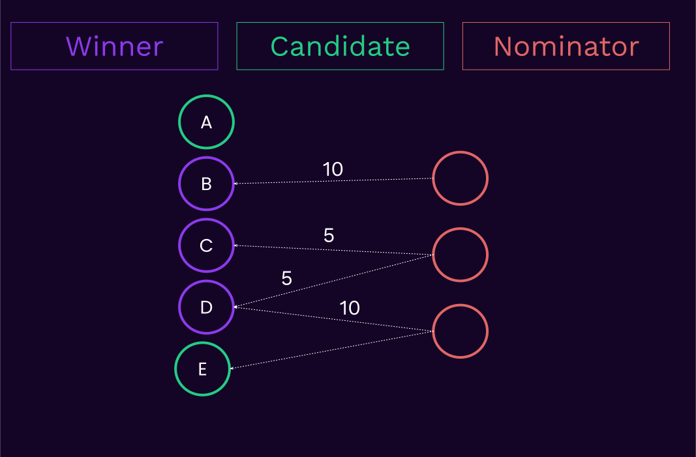

# Polkadot Staking

Notes:
Today we’ll be covering the staking subsystem in Polkadot.
Who here as ever interacted with the staking system?

---

# Polkadot Staking

## Actors

- Nominators
- Validators

Notes:
When it comes to actors this one is surprisingly simple. It is just nominators and validators. In fact this will be the only lecture where we’ll be talking about nominators. Their sole purpose is to interact with staking.

---

# Polkadot Staking

## Problem Statement

Why do we need staking?

Notes:
So first let’s zoom out for a second and let’s try and see what problem we are even trying to solve with staking. What are we trying to achieve?

---v

# Polkadot Staking

## Problem Statement

- Who gets to build new blocks?
- Validate transactions?
- Vote on finality?

<br></br>

In summary we are trying to answer the question of:

**"Who are the authorities?"**

Notes:
The problem is figuring out who gets to produce or author the next relay chain blocks or perform some other blockchain specific privileged duties. We had to come up with an algorithm or protocol that in the end will appoint the authorities to perform the necessary duties.

---

# What about Proof of Work?

How did Bitcoin solve this problem?

Notes:
When trying to understand the problem it’s often useful to look at how bitcoin dealt with it. Bitcoin is not perfect but its beauty lies in its simplicity. It’s a minimal viable blockchain.

---

# Proof of Work

<pba-cols>
<pba-col>
  <ul>
    <li>All miners compute some hashes</li>
    <li>A sufficiently small hash eables block authoring</li>
  </ul>
</pba-col>
<pba-col>

</pba-col>
</pba-cols>

Notes:
Bitcoin uses proof of work as its authority module. It allows all nodes with some hardware to generate random numbers and if you find the sufficiently small number you get to be the next block author.

---v

# Proof of Work

<pba-cols>
<pba-col>
  <ul>
    <li>No well defined authority list</li>
    <li>Endless* arms race</li>
    <li>Better hardware does not boost throughput only security</li>
  </ul>
</pba-col>
<pba-col>

</pba-col>
</pba-cols>

Notes:
This solution is quite sleek because there is no well defined authority list. There doesn’t have to be a bounded set. Anyone can mine at any time and you might not even know it until they find the solution.

There are unfortunately some tradeoffs in the PoW design. It’s an endless arms race wasting more hardware and more energy to secure the network. And unfortunately better hardware does not mean that bitcoin gets better performance. Performance capabilities are completely disjoint from the hardware.

There were some alternatives though and one of them was...

---

# Proof of Authority

<pba-cols>
<pba-col>
  <ul>
    <li>Whitelisted set of participants</li>
    <li>Usually round robin</li>
  </ul>
</pba-col>
<pba-col>

</pba-col>
</pba-cols>

Notes:
Proof of Authority. It was an old alternative to PoW. It was in fact even older than PoW. Instead of playing elaborate games what if we simply chose a set of authorities. Then they might take turns authoring blocks and will perform all the important duties.

This of course comes with huge tradeoffs as it is inherently not decentralized if we just appoint our trusted friends and family.

But this idea of selecting a bounded set of authorities and then working only with them is a useful primitive for later.

---v

# Proof of Authority

<pba-cols>
<pba-col>
  <ul>
    <li>Not inherently bad</li>
    <li>All depends on how participants get added and/or removed from the set</li>
    <li>_usually_ a single entity managing the set (!)</li>
    <li>Prone to corruption, censoring and poor decentralisation</li>
  </ul>
</pba-col>
<pba-col>

</pba-col>
</pba-cols>

Notes:
Proof of Authority. It was an old alternative to PoW. It was in fact even older than PoW. Instead of playing elaborate games what if we simply chose a set of authorities. Then they might take turns authoring blocks and will perform all the important duties.

This of course comes with huge tradeoffs as it is very dependant on how people get added or removed or if there is a super authority that can do it. If yes then this is particularly bad and will inherently suffer from terrible decentralization if we just appoint our trusted friends and family. And in most cases there is a single entity doing the appointing.

But this idea of selecting a bounded set of authorities and then working only with them is a useful primitive for later. Especially if the process is more democratic and representative.

---

# Proof of Stake

## Context for its creation

<pba-cols>
<pba-col>
  <ul>
    <li>PoW was getting unsustainable</li>
    <li>Mining hardware = $$$</li>
    <li>More money meant more mining power</li>
  </ul>
</pba-col>
<pba-col>

</pba-col>
</pba-cols>

Notes:
As PoW was getting more and more popular its downsides were becoming more and more severe. And very soon a new alternative arose on the market and that was Proof of Stake.

The short explainer is that…

In proof of work the more money to buy hardware you had the more influence you had. So at this point might as well skip the hardware step and just verify how much money you have.

---v

# Proof of Stake

## In a Nutshell

<pba-cols>
<pba-col>
  <ul>
    <li>Lock some funds 🔒💰</li>
    <li>You get power proportional to locked stake 💰👑</li>
    <li>Use that power for good to gain rewards 📈</li>
    <li>Misbehave to get slashed 📉</li>
  </ul>
</pba-col>
<pba-col>

</pba-col>
</pba-cols>

Notes:
Proof of Stake in a nutshell is a process where stakers, those are the people with tokens lock them. Locking is simillar to spending your money on GPUs or ASICS to mine in PoW. You are committing your resources to the protocol to be invested in it.

The more you invest the more power the protocol gives you. You maybe have a higher chance of authoring a block, you are entrusted more responsibility because you put more faith and resources into the protocol.

But you are still an individual. You can use the power for good and be rewarded for it by the protocol or use it for bad to exploit, double-spend and abuse. Then if the protocol detects it you will be punished and your stake slashed.

---v

# Proof of Stake

## Slashes

<pba-cols>
<pba-col>
  <ul>
    <li>PoS explicit slashing is an equivalent to the implicit oppurtunity cost of reorging in PoW</li>
  </ul>
</pba-col>
<pba-col>

</pba-col>
</pba-cols>

Notes:
Slashing is quite interesting because in PoW you could argue there wasnt an explicit way of punishing someone. But there always was an implciit way of doing it builit into the protocol. If someone built an invalid block other nodes would ignore it and all the effort the attacker put into building it is wasted. This oppurtunity cost is equivalent to the more explicit punishments in PoS.

---v

# Proof of Stake

## Characteristics

<pba-cols>
<pba-col>
  <ul>
    <li>Less energy usage</li>
    <li>Decoupling throughput scaling with security scaling</li>    
    <li>Stronger hardware = better throughput</li>
    <li>Ecosystem TVL growing usually automatically improves (economic) security</li>
    <li>Removes economy of scale</li>
  </ul>
</pba-col>
<pba-col>

</pba-col>
</pba-cols>

Notes:
So some core characteristics of all PoS approaches are for instance much much lower energy usage. Blockchains that moved to PoS from PoW often reduce their energy usage to less than 1% of the original.

PoS additionally does something which is rarely talked about. It decouples throughput scaling with security scaling. In bitcoin better hardware just meant being more secure. In PoS better hardware is generally better throughput.

Security is derived from the total value locked of the tokens being staked. So as the ecoystem grows the economic security grows naturally with it. No hardware adjustments are usually needed. And when we talk about economic security we mean how much resources or money it would take to get enough stake to attack or control the network.

PoS also helps with in reducing the impact of economy of scale which generally leads to centralization. Barely anyone runds a single btc miner nowadays. Only large mining operations can remain profitable.

---v

# Proof of Stake

## Desybilling

<pba-cols>
<pba-col>
  <ul>
    <li>1 person =/= 1 vote</li>
    <li>More funds = More power</li>
    <li>Plutocratic by design</li>
    <li>but there are addons that can help with it</li>
  </ul>
</pba-col>
<pba-col>

</pba-col>
</pba-cols>

Notes:
There is also one core feature is that it desybils our users. But it doesn't do it perfectly.
PoW and PoS both share this one feature and a flaw and that is that they dont care who you are or that you are an individual person or a group of people. All that matters is how much funds or resources you have. So 1 person 1 vote are not inherently a part of staking and it is all proportional to the resources.

That being said there are some approaches and research being done to help with that. For instance implementing quadratic voting with a proof of personhood to limit the effects of large stakeholders and empowering the small ones.

---v

# Proof of Stake

## Proof of Authority in Disguise

<pba-cols>
<pba-col>
  <ul>
    <li>PoS usually tries to elect a small & temporary authority set</li>
    <li>Once elected it often behaves like a classic PoA</li>
    <li>PoS is like plutocratic representative government</li>
  </ul>
</pba-col>
<pba-col>

</pba-col>
</pba-cols>

Notes:
One interesting thing about all proof of stake protocols is that they have a proof of authority embedded in them.

Essentially PoS never directly identifies an individual block author or a single privileged entity. It instead introduces election mechanisms that create a small and well bounded temporary set of authorities. The authorities then gain special privileges and can perform some validator duties in exchange for rewards. So every Proof of Stake eventually leads to a temporary Proof of Authority. Think of that as a temporary representative government like a parlament. They authorities change quite regularly and they all keep each other responsible.

And in this lecture we are solely focused on the part of selecting the authorities and not what they do after they are selected.

---

# Proof of Stake

## Subflavours

- Classic PoS
- Delegated PoS
- Nominated PoS

Notes: There are a few different ways to approach the elections. Out main goal is to narrow down from a wide set of authority candidates into a smaller well bounded list of active authorities.

The first msot naive approach is a classic PoS, but w ealso have more complex variants like Delegeated Pos and Nominated PoS.

Classic PoS is something akin to initial Ethereum PoS systems, while DPoS is like Tron, EOS and other. NPoS is used in Polkadot and we'll be slowly building towards it.

---

# Proof of Stake

## Prerequisites

- Physical Hardware (Node) & Operators
- Value Bearing Token

Notes:
In all of those systems there are some prerequisites.
There need to be some node operators. The blockchain will be hosted on them and we always need some machines.
There needs to be a value bearing token that can be at stake. This represents someone’s commitment. The stake can grow or decrease based on various actions.

The difference between the staking flavors is mainly about how the stake interacts with the people operating the hardware.

---

# Classic PoS

<pba-cols>
<pba-col>
  <ul>
    <li>Stakers are also hardware operators</li>
    <li>A subset of stakers (usually highest n) wins the election</li>
    <li>Elections repeat regularly</li>
  </ul>
</pba-col>
<pba-col>

</pba-col>
</pba-cols>

Notes:
Classic PoS means that to stake you need to operate the hardware yourself. The stake provider and node operator are exactly the same person. This is the very naive and simple approach. So on the right you can see various different stakers a small subset, usually with highstest stake wins. Then we repeat the elections once in a while.

---v

# Classic PoS

## Drawbacks

- Low amount of stake that we can capture
- Impossible for those who don't want to run the hardware to join

Notes:
Because what if I have a lof of stake but I dont want to run a hardware node? What if you like running the node but have little money?
And finally what if the stake is spread over many people and taking the top N is accounting only for a small amount of stake? This essentially incentives centralisation of stake.

If we were to implement such a protocol very very quickly people would start creating abstractions of it. For instance I pay someone a bit and rent them my stake but they run the nodes for me and we share profits. To account for those needs and remedy the issues people came up with...

---

# Delegated Proof of Stake

<pba-cols>
<pba-col>
  <ul>
    <li><b>Validator Candidates</b> are competing for votes</li>
    <li><b>Delegators</b> vote on candidates with their stake</li>
    <li>Most total votes decide <b>Active Validators</b></li>
  </ul>
</pba-col>
<pba-col>

</pba-col>
</pba-cols>

Notes:
delegated proof of stake. In DPoS we have 3 distinct groups. The Validator Candidates, Active Validators, those are the election winners and the delegators which doing the voting with their stake.

The votes are generally 1:1. If you have some stake you pick a node operator you think will do a good job. The rewards are usually shared between the stake providers and hardware operators.

---v

# Delegated Proof of Stake

## Drawbacks

- Stake gets diluted between all candidates
- Funds might be delegated to non-winners, which get wasted
- Leads to centralisation because there is no reward for choosing smaller but trustworthy node operators

Notes:
But this solution is also far from perfect. Because you have to pick a single validator the stake gets diluted among many many candidates. If your candidate does not win your stake does not contribute to the overall economic security of the chain. So this system has a pretty low stake utilisation rate.

---v

# Multi-Delegated Proof of Stake

<pba-cols>
<pba-col>
  <ul>
    <li>Split your stake amongst multiple candidate when voting</li>
  </ul>
</pba-col>
<pba-col>

</pba-col>
</pba-cols>

Notes:
To address those issues we need to implement a simple change. Instead of allowing a single delegation let's allow multiple. Then your chances of selecting a winning validator increase! If you would contribute 1 token to every single candidate then tehcnically you have 100% of picking a winning validator.

---v

# Multi-Delegated Proof of Stake

<pba-cols>
<pba-col>
  <div><b>Problems?</b></div>
  <br/>
  <ul>
    <li>Your stake is <b>SPLIT</b> amongst multiple candidate</li>
    <li>Low stake utilization</li>
  </ul>
</pba-col>
<pba-col>

</pba-col>
</pba-cols>

Notes:
So the same thing that is the strength of this model is also it's weakness. Because splitting your stake means that each individual delegation is worth less and less. In this example we see two delegators on the right that tried to diverisfy and commited some stake to the unsuccesful candidate. The delagators wanted to stake it to earn rewards and secure the network but their stake was not used. It is being wasted. Just as it was in the previous method.

---

# Nominated Proof of Stake



Notes:
And now we organically arrived the the Nominated Proof of Stake which is the next step in the evolution of staking.

In NPoS instead of delegators we have nominators. Nominators dont split their stake in voting, but they simply nominate, or select multiple candidates. It is a binary choice for each validator. You either choose them or not. Often there is a hard cap for how many candidates you can nominate and in Polkadot it is 16.

---v

# Nominated Proof of Stake



Notes:
Next once we have all the nominations there is an algorithm that tries to compute the allocations of stake based on the nominations. This algorithm will never change who you nominate, it will only compute which of the nominations should receive your stake and how much of it. We will explore how it is done in a second.

---v

# Nominated Proof of Stake

- You name up to `N` nominees, an _algorithm_, computed either onchain or offchain, decides
  the **winners** and **how to distribute the stake among them**.
- Voters are called **Nominators**.

Notes:
So to summarize You name up to `N` nominees, and an _algorithm_, computed or verified onchain , decides
the **winners** and **how to distribute the stake among them**.

- Voters are called **Nominators**.

---v

# Nominated Proof of Stake

- ✅ As a nominator, you are free to express your desire to back non-winners. If you have some other strong nominations you will NOT be disadvantaged.
<!-- .element: class="fragment" -->
- ✅ Has a much higher chance to make sure staked tokens won't get wasted.
<!-- .element: class="fragment" -->
- ✅ Can optimize other criteria other than "who had more votes".
<!-- .element: class="fragment" -->

Notes:
As a nominator, you are free to express your desire to back non-winners. If you have some other strong nominations you will NOT be disadvantaged.

Has a much higher chance to make sure staked tokens won't get wasted. This leads to a higher stake utilization rate.

Can optimize other criteria other than "who had more votes".

---v

# Nominated Proof of Stake

## Drawbacks

- We decided to solve an NP-hard, multi-winner, approval based, election problem onchain 🤠.

<pba-flex center>

- scalability. <!-- .element: class="fragment" -->
- scalability. <!-- .element: class="fragment" -->
- scalability. <!-- .element: class="fragment" -->
- and scalability. <!-- .element: class="fragment" -->

</widget-text>

- But we get much better economic security measures in return 🌈.

<!-- .element: class="fragment" -->

Notes:
But as always there are some trade-offs here. Computing the elections is actually an NP-hard problem! Same as the knapsack problem. In general the election algorithm we use is called phragmen. Let's have a very quick look at what we are trying to compute and I'll link you the explainer of the whole algorithm but it is a bit tricky.

---

# Nominated Proof of Stake

## Elections

<pba-cols>
<pba-col>
  <ul>
    <li>Imagine we have 3 nominators each with 10 tokens</li>
    <li>They can place up to 2 nominations each</li>
    <li>We need to select 3 validators</li>
    <li>Who should win?</li>
  </ul>
</pba-col>
<pba-col>

</pba-col>
</pba-cols>

---v

# Nominated Proof of Stake

## Elections

<pba-cols>
<pba-col>

</pba-col>
<pba-col>

</pba-col>
<pba-col>

</pba-col>
</pba-cols>

Notes:
There are multiple solutions. Each one here makes an allocation of stake to some validators and tried to suggest three winners. Which one do you think is the best? What is your reasoning?

---v

# Nominated Proof of Stake

## Scoring Election Solutions

```rust
pub struct ElectionScore {
  /// The minimal winner, in terms of total backing stake.
  ///
  /// This parameter should be maximized.
  pub minimal_stake: u128,
  /// The sum of the total backing of all winners.
  ///
  /// This parameter should maximized
  pub sum_stake: u128,
  /// The sum squared of the total backing of all winners, aka. the variance.
  ///
  /// Ths parameter should be minimized.
  pub sum_stake_squared: u128,
}
```

Notes:
We need some objective and deterministic ways of comparing and judging solutions.

We trie to maximise the lowest stake. So a solution that has 3 validators, one with a milion, one with 2 millions and 3rd one with 10 tokens would be really bad because the lowest stake is very small.

Next we trie to make it so the total elected stake is very high. This number is how much stake is economically securing the network.

Additionally we try to minimise the variance so trying to make it so all the validators have roughly the same stake at hand.

---v

# Nominated Proof of Stake

## Scoring Election Solutions

[333, 333, 333]

[900, 90, 9]

Note:
I will give an example why we care about the minimal stake so much.

Imagine we have 3 validators. A total stake is thousand which lets assume is a lot of money.

Now let's compare two examples. One where the stake is evenly distributed and one where some validators have a much higher stake. The protocol to properly function needs to maintain 2/3 honest nodes. So that means that to perform the attack you need to control 1/3 of the nodes.

The system is a secure as it is to attack the weakest 1/3rd of the nodes.

---v

# Nominated Proof of Stake

## Scoring Election Solutions

[333, 333, 333]

[900, 90, 10] <s>9</s>

Note:
In the second example all you need is 10 tokens and you can outbid the weakest staker that has 9 tokes. SO having evenly distributed stakes drstically increases our stake efficiency. In the first example you would need more than 333 tokens to effectively attack the network.

---v

# Nominated Proof of Stake

## Phragmen

<pba-cols>
<pba-col>
  <ul>
  <li>
    <a href="https://en.wikipedia.org/wiki/Phragmen%27s_voting_rules">Phragmen Algorithm (link)</a>
  </li>
  <li>Does not guarantee an optimal solution, just like greedy algorithms just tries to create a decent one</li>
  <li>Proved to provide high fairness and justified representation properties whilst being verifiable in
  linear time.</li>
  </ul>
</pba-col>
<pba-col>

Lars Phragmén
(1863-1937)
</pba-col>
</pba-cols>

Notes:
Okay so now we've seen how exemplary solutions look like. We know how to compare them to each other so how do we actually find good solutions? Hopefully it is not at random right?

Luckily no. We use an algorithm introduced by Phragmen. It is well defined algorithm that is quite expensive to run but provides decent solutins. It does not guarantee optimal solutions so we still need to verify and compare various options to find the best one we can afford.

Verifying them is luckily linear and this will be crucial in the next steps.

---v

# Nominated Proof of Stake

## Phragmen Examples in Polkadot:

https://wiki.polkadot.network/learn/learn-phragmen/

Notes:
For those super curious check this resources with some exaples of how exactly phragmen creates the staking solutions in Polkadot.

---

# Nominated Proof of Stake

## Dealing with complexity

- Phragmen is computationally expensive so run it offchain
- Submit solutions onchain
- Compare them onchain to find the best one

---v

# Nominated Proof of Stake

## Polkadot Implementation

The current NPoS protocol revolves around an **election round**, which is itself made up of 4 episodes.

---v

# Nominated Proof of Stake

## Episode 1 - **Snapshot**

- Snapshots the state of all nominations and candidate validators
- Enables multi-block election.
- Allows us to not need to "freeze" the staking system.
- Allows us to index stakers, not `AccountIds`.

---v

# Nominated Proof of Stake

## Episode 2 - **Signed Submissions**

- Any signed account can come up with a **NPoS solution** based on that snapshot.
- Deposits, rewards, slash, other game-theoretic tools incorporated to make to secure.

---v

# Nominated Proof of Stake

## Episode 3 - **Validator Submissions as Fallback**

- As the first backup, any validator can also submit a solution as a part of their block authoring.

---v

# Nominated Proof of Stake

## Episode 4 - **Absolute Fallbacks**

- If all of the above fails, the chain won't rotate validators and the governance can either:
  - dictate the next validator set.
  - trigger an onchain election (limited in what it can do).

---

# Nominated Proof of Stake

## Nomination Pools


Notes:

---

# Polkadot Staking

# How economically secure is it?

More validators does not always mean more secure.

[100, 100, 100] vs [5, 5, 5, 5]

[210, 210, 210, 210, 210] vs [1000, 10, 10, 10, 10, 10]

Notes:

---v

## Nakamoto Coefficient


https://nakaflow.io/

---

# Polkadot Staking

## Parametrisation

- Couple thousands candidate validators
- 600-1000 elected validators
- Tens of thousands of nominators
- 16 nominations per nominator
- Elections every 24h
- Minimum nominator stake 250 DOT
- Minimum stake to join nomination pool 1 DOT
- Minimum Validator Bond (includes nominations): ~12M DOT
- Average Staking APY: 8-16%
- Unbonding Period: 28 days

---

# Polkadot Staking

## Future

- Staking Migration (moving from RLC to a Polkadot Hub System Chain)
- [Github issue-tracker/project](https://github.com/orgs/paritytech/projects/33)
- Multi-page election submission

---

# Polkadot Staking

## Usefool Tools

Staking Dashboard: https://staking.polkadot.cloud/#/overview

Validator Insights: https://apps.turboflakes.io/?chain=polkadot#/insights

---

### Further Reading

Starting:

- Staking Guide: https://wiki.polkadot.network/learn/learn-staking/
- Advanced Staking Concepts: https://wiki.polkadot.network/learn/learn-staking-advanced/
  Advanced:
- [A verifiably secure and proportional committee election rule](https://arxiv.org/abs/2004.12990)
- 4.1 in [Overview of Polkadot and its Design Considerations](https://arxiv.org/abs/2005.13456)
- [Proportional Justified Representation](https://arxiv.org/abs/1611.09928)
- [Justified representation - Wikipedia](https://en.wikipedia.org/wiki/Justified_representation)
