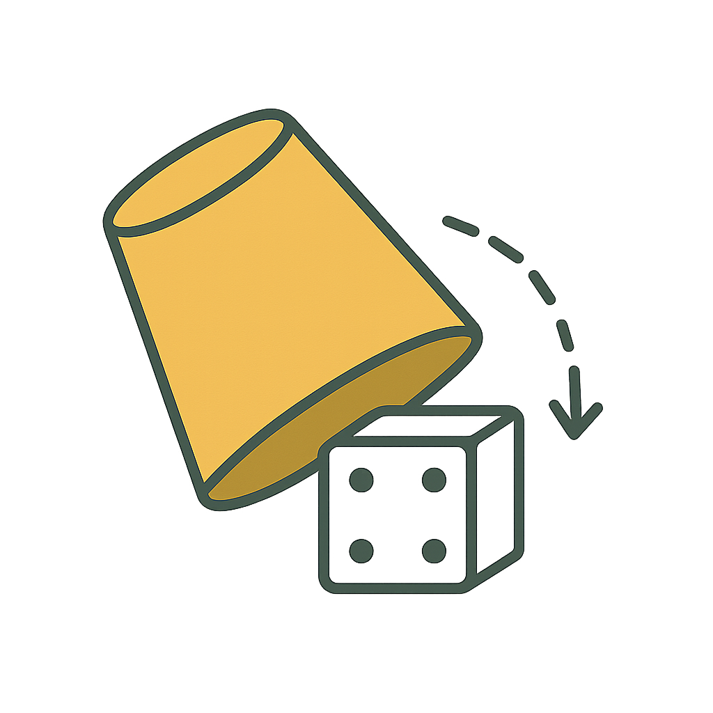

# Block Production

Notes:
In this lecture we’ll be covering what is block authoring as well as how it interacts with various consensus styles.

---

# Block Production

## Agenda

- Authoring Overview

- AURA

- GRANDPA

- Safrole

- Equivocations

---

# Block Production

## Actors

- Validators

---

# Block Production

## Overview

- Leader election problem
- Most fundemental validator/miner duty
- Leads to extending the blockchain
- Unthrottled block authoring would like to a fork chaos

Notes:
First we are gonna start with a quick overview. Block authoring is the most primitive and fundemental validaot responsibility there is.

In fact in Bitcoin and most proof of work chains it was the only responsibility. There was nothing else than collecting transactions and authoring a block that contains them. This would in turn extend the blockchain. Someone always has to author the block.

We could technically allow anyone to author anytime, but this would lead to a forkful chaos. Chaos like that would be borderline imppossible to manage. All nodes couldnt import all the blocks, reexcuting them localy can be expensive so we need to slow things down.

So the main issue we'll be solving is ordering and throttling of authoring.

We will not be focusing on proof of work or simillar authoring mechanisms on this lecture, instead we will be exploring the authoring methods used in Polkadot and its ecosystem. As you remember from the previous lecture we already are given a few nice primitives from staking.

---

# Block Production

## Prerequisites

- Well bounded set of validators
- All validators have stake exposure

Notes:
As one of the prerequisite the staking system already yielded us a small bounded set of authorities and the job of the block authoring module is to further narrow it down into individual block authoring spaced over time.

Additionally all the validators have something at stake. We can leverage that stake to potentially punish them and reward them proportionally.

---

# Block Production

## Throttling

<pba-cols>
<pba-col>
  <ul>
    <li>Split the 24h authority term period into 6s timeslots</li>
    <li>Ideally there should be 1 block per timeslot</li>
  </ul>
</pba-col>
<pba-col>

</pba-col>
</pba-cols>

Notes:
To slow down production we introduce the idea of a timeslot. Timeslot corresponds to specific amount of real world time, for instance 6s in Polkadot. We assume that all nodes have access to a commonly synchronised clock. Then based on their clocks we expect that in every time slot there will be a single block created.

---v

# Block Production

## Throttling

<table border="1" cellspacing="0" cellpadding="8">
  <thead>
    <tr>
      <th>Polkadot</th>
      <th>Time</th>
      <th>Slots</th>
    </tr>
  </thead>
  <tbody>
    <tr>
      <td>Slot</td>
      <td>6 seconds</td>
      <td>1</td>
    </tr>
    <tr>
      <td>Session/Epoch</td>
      <td>4 hours</td>
      <td>2_400</td>
    </tr>
    <tr>
      <td>Era</td>
      <td>24 hours</td>
      <td>14_400</td>
    </tr>
  </tbody>
</table>

Notes:
Timeslots are then further grouped into bigger time slices. For instance 4h which are used to schedule validator duties other than block authoring.
Reminder that elections happe every 24h, so every day our validator set can drastically change.

---

# Block Production

## Aura

<pba-cols>
<pba-col>
  <ul>
    <li>Just a round-robin scheme</li>
    <li>Problems?</li>
  </ul>
</pba-col>
<pba-col>

</pba-col>
</pba-cols>

Notes:
So now that we have our 14_400 timeslots it is time to figure out who authors when. And the first and most naive solution is just to do a round robin. Pick any atribtrary ordering and everyone takes turns. We have much more timeslots than validators so a full lopp will complete a few times so noone will be omitted.

---v

# Block Production

## Aura

<pba-cols>
<pba-col>
  <ul>
    <li>Just a round-robin scheme</li>
    <li>Problems?</li>
      <ul>
        <li>Next authority is known well in advance</li>
        <li>Makes it easy to pinpoint DDoS and censor</li>
    </ul>
  </ul>
</pba-col>
<pba-col>

</pba-col>
</pba-cols>

Notes:
The main problem is that it is apparent and public who the next author will be. You don't have to guess and can plan to for instance DDoS them exactly when they are authoring. DDoSing the whole active set is not viable but DDoSing a single author once in a while is totally doable. This could be abused to censor and manipulate the chain or affect the randomness aggregators.

So we need a solution that is a bit more secretive in how it chooses the validators.

---

# Block Production

## BABE

### (Blind Assignment for Block Extension)

Notes:
And this is where BABE comes in. Babe stands for Blind Assignment for Block Extension so you can already see in the name that it will be trying to be more secretive with the blind part. What we want to achieve is some obfuscation and secrecy hiding who is the next author. It will be someone from the active set, that is our anonymity set but who exactly should be hidden for as long as possible.

---v

# Block Production

## BABE

<pba-cols>
<pba-col>
  <ul>
    <li>One VRF output per validator per slot</li>
    <li>Outputs are kept hidden</li>
    <li>If the output is below a set threshold: </li>
      <ul>
    <li>publish output to claim the slot</li>
    <li>author the corresponding block</li>
  </ul>
  </ul>
</pba-col>
<pba-col>

</pba-col>
</pba-cols>

Notes:
BABE uses VRFs to achieve its blind assignment. I hope that you all remember what are verifiable random functions. They are random generators where you usually use some entropy context and your private key to generate some outputs which are later verifiable with your corresponding public key. A very useful primitive.

So in Babe every validator generates a VRF output for every slot they see in the future. But they keep those outputs hidden. Then if their random number is below a specific constant threshold it means that they will be able to publish their number and claim the slow to author a block.

Untill you publish your result and prove it noone else knew you would win. This makes it so the attackers don;t even know who to DDoS.

This is exactly like Proof of Work whre they are looking for a small hash, but in BABE the validators get only a single try instead of endlesslly computing the hashes. You either get it or dont. No need to waste energy.

---v

# Block Production

## BABE

<pba-cols>
<pba-col>
    <b>Any problems with that approach?</b>
  <ul>
  </ul>
</pba-col>
<pba-col>

</pba-col>
</pba-cols>

Notes:
Does anyone see an obvious issue with this approach of rolling the dice and claiming slots?

---v

# Block Production

## BABE

<pba-cols>
<pba-col>
    <b>Any problems with that approach?</b>
  <ul>
    <li>Sometimes two validators can claim the same slot</li>
    <li>Sometimes no validators claim the slot</li>
  </ul>
</pba-col>
<pba-col>

</pba-col>
</pba-cols>

Notes:
The main problem is that sometimes simply no validator will get a random value below the threshold. This would cause the blockchain to skip a slot which is very undesirable. We want a nice and consistent block time.

And on top of that it is possible that sometimes we will get multiple validators claiming a slot if many of them got lucky. This would in turn cause a fork. We can deal with them in the long run but they waste a lot of computation and add extra complexity.

---v

# Block Production

## BABE

<pba-cols>
<pba-col>
    
  <ul>
    <li><b>BABE uses Aura as plan B</b></li>
    <li>For every slot we try and find a VRF winner and we call those <b>primaries</b></li>
    <li>If no primary is present default to AURA and select a <b>secondary</b> author</li>
  </ul>
</pba-col>
<pba-col>

</pba-col>
</pba-cols>

Notes:
To deal with the eventuality BABE introduces AURA as a backup plan. We still try to get a VRF winner every slot and those are called primaries. But if it fails and no priamry is selected we default to aura to subbly a backup validator called a secondary.

This combination leads to preserving the security benefits of BABE while benefitting for the predictability and efficiency of AURA. It injects just enough randomness to make censorship and DDoSing very difficult.

In reality VRF thresholds are configured so that around 25% of the slots have a primary author.

---

# Block Production

## Safrole

Notes:
And finally we can take a look at the newest iteration of the block authoring mechanism and it's called Safrole. Safrole is not something that is being used in Polkadot today but it will is planned to release together with JAM.

---v

# Block Production

## Safrole

- Aims to (mostly) elimate forks
- Reduce the reliance on AURA
- Keep complete privacy for ALL block authors

---

# Block Production

## Equivocations

<pba-cols>
<pba-col>
    <b>Ambigious or conflicting statements</b>
</pba-col>
<pba-col>

</pba-col>
</pba-cols>

Notes:
We discussed how the protocol operates and if everything goes according to plan validators will start authoring their blocks. Unfortunately there some validators might now want to paly along with the rules. The main malicious behavaiour they can exhibit is called an equiovcation.

An our case equivocation will be strickly referring to giving conflicting statements. Imagine you have a single phone number. You met Alice and Bob and given them your numbers. But you give them two different numbers. At this point we dont even need to check what exact numbers you've given them. As long as we know they were two different numbers we know you lied at some point. You equivocated.

The same malicious behaviour can be done by block authors. An author can technically claim as slot and then author multiple blocks and try to double spend. Other nodes will be importing the blocks and if they detect two blocks from the same author on the same slot they will report him for equivocation. This is very easily provable as long as we have access to the two different blocks.

This proof be permisionlessly provided on chain and will be verified and then trigger slashes to the offending validators.
