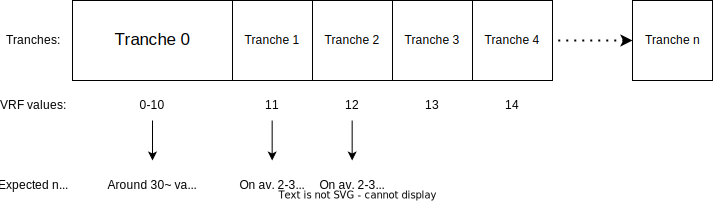
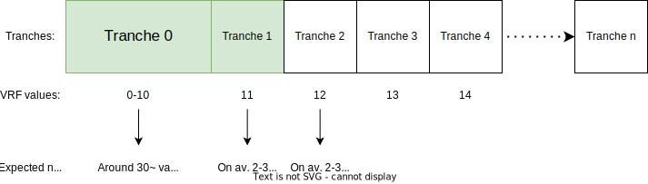
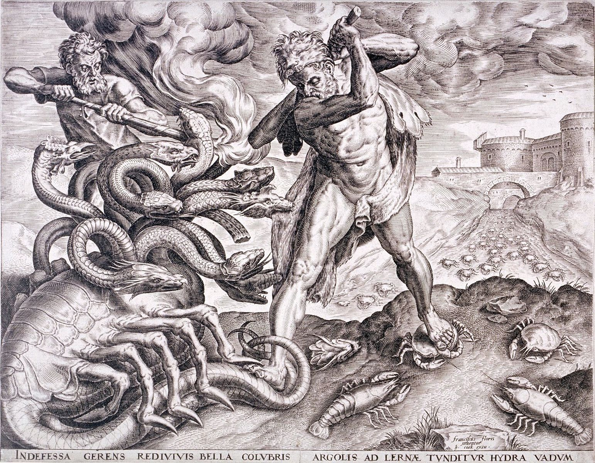
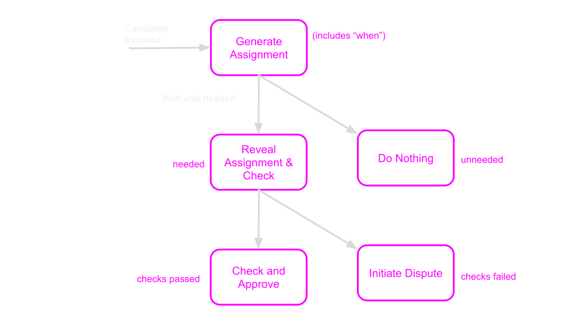

# Execution Sharding in Polkadot

Notes:
Introduction

---

# Execution Sharding in Polkadot

## Actors

<pba-cols>
<pba-col>
  <ul>
    <li>Validators</li>
  </ul>
</pba-col>
<pba-col>

</pba-col>
</pba-cols>

---

## Execution Sharding in Polkadot


Notes:
First let's outline why we even need to go through all of that trouble. IN short sharding is our answer to scalability. And I could say that in general sharding is **solving** scalability. But in truth as many have heard...

---

## Execution Sharding in Polkadot

<pba-cols>
    <pba-col>
        
    </pba-col>
    <pba-col>
        <blockquote>
            <p>“There are no solutions. There are only trade-offs.”</p>
        </blockquote>
        <footer>― Thomas Sowell</footer>
    </pba-col>
</pba-cols>

Notes:
There are no solutions. There are only trade-offs. And this is no exception to it so we'll look into how sharding gets us closer to better scalability and what are the trade-offs that we have to make to get there. But first let's look at the problem itself.

---

## Scalability of Blockchains

**Why is there even an issue?**

Notes:
We all heard that blockchains supposedly don't scale. In short what causes blockchains to scale poorly? Anyone wants to give a very short answer?

-Question time-

---

## Scalability of Blockchains

**Why is there even an issue?**

Everyone checking everything is sacrificing scalability for security (and simplicity).

Notes:
Everyone checking everything is sacrificing scalability for security (and simplicity).
Everyone checking everything was a nice solution at first for things like BTC because it was the simplest option to guarantee safety. But unfortunately it introduces so much unnecessary work that it stops us for scaling.

---

## Company analogy

- Start-up with 3 employees
- All make hand-crafted bags
- At the end of the day they all share their bags between each other to check for defects

Notes:
Imagine a start-up company with 3 employees. They all make hand-crafted bags and at the end of the day they all share their bags between each other to check for defects. This is a simple approach and ensures that even if one employee was being lazy in the end we'll get a good product because the mistakes will be caught. That was BTC when it was a small network.

---

## Company analogy

- Company grows to **100** employees
- All make hand-crafted bags
- At the end of the day they all share their bags between each other to check for defects... **but there are too many bags!**

Notes:
But what if this company grows? What if we have 100 employees? Issues is there is too many bags to have everyone check everything.
Okay that's it! We close the company! Bag making clearly cannot be scaled. NO. We change our ways. We introduce new levels, abstractions, and responsibilities.

---

## Company analogy

- Company grows to **100** employees
- **Most** make hand-crafted bags
- **Some check for defects**

Notes:
Maybe people working in this company really dislike checking for defects and would rather make bags. So bag makers simply take turns checking for defects. If a bag checker spots a defect they can escalate the issue and the bag maker will be held accountable. And here we encountered the first absolutely core principle of sharding - **Issue Escalation**.

---

## Company analogy

- Company grows to 100 employees
- Most make hand-crafted bags
- Some check for defects
- **ESCALATE in case of defects**

Notes:
It's the "Hey, everyone check this out!" in the start-up setting. That's the whisteblowing of corporations, ticket sending of IT, and the "I want to speak to your manager" of Karens. If there is an issue we only need someone, anyone to raise it and then we can escalate and investigate in full force. Now how does that relate to Polkadot?

---

## Escalation in Polkadot

> In Polkadot not all validators checks everything, but enough of them check so that if there is a problem it will be escalated. Escalation causes everyone to check and always means consequences.

Notes:
Because if you imagine a whisteblower, you only need one such brave person in the most corrupt company to completely ruin their scheme. It's the same in Polkadot because we leverage this property to the fullest. As long as we get at least **one**, a single one validator doing the checks we can escalate them and ruin the day of the attackers, despite only a fraction of the network doing the checks.

---

## Properties of Escalation

Escalation is the happy path optimization. If there is no issue only very few checkers will participate in the process.

Notes:
Escalation is the happy path optimization. If there is no issue only very few checkers will participate in the process.
This solution is only effective because in reality most of the blocks produced are indeed valid and honest. So the happy path optimization brings insane gains and allows for shared workload.

It's worth pointing that optimistic rollups are also a happy path optimization, but our approach is just... less optimistic which gives us the perfect balance between security and scalability. And a bit of a spoiler but also reduces our time to finality to manageable numbers.

---

## Properties of Escalation

If there are issues, due to the escalation, everyone will check everything. We temporarily break sharding (slow down) to ensure security.

Notes:
If there are issues, due to the escalation, everyone will check everything. We temporarily break sharding (slow down) to ensure security.
If everyone has to check bags for defects they have no time to produce that many bags BUT when the quality of bags it the most important thing in the world for us that's a good trade. And in blockchain security is the most important thing in the world for us. So we are willing to temporarily slow down to maintain absolute security.

---

# ELVES

Notes:
Now that we have the core principle of sharding and let's see where it manifests the most in the Elves protocol.

---

## ELVES

<pba-flex center>

1. **Collation**: Collect transactions.
1. **Backing**: Assign responsibility.
1. **Availability**: Distribute data.
1. **Approval Checking**: Verify correctness.
1. **Disputes**: Resolve escalations.

</pba-flex>

Notes:
ELVES which gives us execution sharding depends on Collation, Backing and Availability, but it primarily happens in the Approval Checking and Disputes protocol.

[Polkadot v1.0: Sharding and Economic Security](https://polkadot.network/blog/polkadot-v1-0-sharding-and-economic-security/) is a comprehensive writeup of the content here in much more detail. Please read it after the lesson if you would like to understand how Polkadot works from top to bottom.

---

## ELVES

Validators are constantly running many instances of these protocols, for candidates at different stages in their lifecycle.

Notes:
One important note about this whole system is that it runs asynchronously in multiple threads on the same validator. A validator can receive collations for one parachain, while managing availability chunks for a different parablock, while approval checking a totally different parablock. All of that happens at the same time in various subsystems.

---

# Approval Checking

Notes:
Approval Checking is the most important part of the protocol and it's also the biggest chunk of the work. It's the battle royale for the blocks and only those that survive can get to finalization.

---

# Approval Checking

## Prerequisites

- A parachain block was included on the relay chain

Notes:
Approval checking is getting triggered by importing a relay chain block that includes some parablocks. Remember that inclusion means it was backed and made available.

---

## Approval Checking - Validation

**What is validating a Parablock?**

<pba-flex center>

1. Recovering the data from the network (by fetching chunks or from backers)
1. Executing the parablock using the PVF, checking success
1. Check that outputs match the ones posted to the relay chain by backers
1. Share a statement with other validators

</pba-flex>

Notes:
At this stage what does it mean to validate a parablock?
It is very similar to the initial checks of backers but instead of getting the data from collators data is recovered from backers and if they refuse from availability chunks

Step 3 is of crucial importance.
Without it, backers could create things like messages and runtime upgrades out of thin air, by backing a valid candidate but lying about the outputs of the candidate.

---

## Approval Checking - Kick-off

When a relaychain block is authored it includes a list of included parablocks chosen by the block author.
For each of those included parablocks a separate approval checking process is started.

Notes:
The whole approval checking process is simply started whenever we spot some included blocks. We then move on to the tranche assignment of approval checkers. And remember that a relay chain block includes a bunch of parablocks so we repeat the same process for all of them at the same time.

---

## Approval Checking - Assignment (simplified)

- Imagine you use a VRF to randomize a number between 0 and 100.
- The number you get is for how much you should wait before doing the check yourself.
- Others don't know what number you got.

Notes:
Everyone generates a random number and thus suggests for how long they should wait before doing the check themselves. This essentially makes it so everyone will potentially do the check at one point, but hopefully as explained in a second, in the happy path not everyone will have to.

Polkadot doesn't necessarily use the number 100 and divides the validator into discrete tranches of 2-3 validators by generating the random VRF output.

---

## Approval Checking - Tranches

- Validators starting with the lowest numbers (in the lowest tranches) start validating the parablock.

Notes:
Validators starting with the lowest numbers (in the lowest tranches) start validating the parablock. So initially the checks are made with people that randomized very low numbers...

---

## Approval Checking - Tranches

- Validators starting with the lowest numbers (in the lowest tranches) start validating the parablock.
- Gradually higher and higher numbers start revealing themselves continuing the process.



Notes:
but over time more and more people start checking because higher and higher numbers are called in to reveal themselves. This is how it can be visualized. We group up validators with similar roles together into those small tranches. Every single active validator is one of those tranches. The more time passes the more tranches are woken up and do their checks. You can notice that the first tranche is a bit larger. That is because...

---

## Approval Checking - Threshold

- Validators starting with the lowest numbers (in the lowest tranches) start validating the parablock.
- Gradually higher and higher numbers start revealing themselves continuing the process.
- Once a certain threshold of validators (30) have submitted valid statements, the parablock is considered **Approved**.



Notes:
The protocol is parametrised to such a way that we require around 30 checks made in total. If we get 30 positive checks the parablock is considered approved. But wait... wait if it's invalid?

---

## Approval Checking - Invalidity

- Validators starting with the lowest numbers (in the lowest tranches) start validating the parablock.
- Gradually higher and higher numbers start revealing themselves continuing the process.
- Once a certain threshold of validators (30) have submitted valid statements, the parablock is considered Approved.
- If even a single validator submits an invalid statement, the issue is **escalated** into a **Dispute**.

Notes:
So this is the moment we've been building up to all this time. If at least one node out of those 30 is honest then at this point if we have an invalid block it is time to raise the alarm. It is time to escalate the problem. The node will send a special statement called a dispute statement and that will cause the issue to be escalated. We'll cover the consequences of that in the next step.

Also for those wondering what are the chances that all 30 are malicious it's 1/3^30 which is around 1 in 205 trillions.

---

## Approval Checking - No-Shows

- Validators starting with the lowest numbers (in the lowest tranches) start validating the parablock.
- Gradually higher and higher numbers start revealing themselves continuing the process.
- Once a certain threshold of validators (30) have submitted valid statements, the parablock is considered Approved.
- If even a single validator submits an invalid statement, the issue is **escalated** into a **Dispute**.
- If a validator disappears (no-shows) after revealing themselves we assume a DoS attack and we require more checkers (+ 1 tranche).

Notes:
Malicious attackers can try and eliminate good guys so that they get the first 30 votes in. The best way to do it is to DoS honest guys causing them to miss their spot. Although assignments are hidden so they don't even know who to DoS. Only option is to DoS them after they reveal themselves which gives us an option to react and be extra cautious when nodes suddenly disappear.

---

## Approval Checking - No-Shows


Notes:
So this will look something like that. In one tranche one of the validators will wake up because it is their time to check. They announce themselves first, start rebuilding the PoV, but before they can publish they PVF result they get DoSed. We never receive their result so remaining validators raise a soft alarm, they start requiring more checkers. And because of that another tranche will be called in before finishing the approval process.

---

## Approval Checking - No-Shows



Notes:
Fighting DoS should be like fighting a hydra. Even if you eliminate a few honest nodes even more will raise in their place. 2/3 \* 3 gives us 2 extra honest nodes per one no-show.

---

## Approval Checking - Summary



Notes:
This is a flow chart from the perspective of an individual approval checker. First once we notice inclusion we generate the assignment. Then we wait for our turn but if the parablock got approved before that we call it a day, we locally mark it as approved for us and finish the process.
In case our voice is still needed we reveal our assignment, recover data, do checks and send our statement. If we don't like the block we start a dispute with a dispute statement.

## Interesting this state machine either outputs or stalls. In case of stalling it might be because there is a dispute started in the dispute coordinator subsystem.

# Disputes

Notes:
Disputes are the last step of the protocol. They are the last resort to ensure security. This is the part of the protocol that is definitely not on the happy path, that's the path of war. Disputes is the logic that if written correctly should never ever trigger, because the incentives will be stacked against the attackers so much that why even bother attacking.

---

## Disputes - Gambler's Ruin

The security argument for Polkadot is based on Gambler’s Ruin.

An attacker who can take billions of attempts to brute-force the process would eventually be successful.

But because of slashing, every failed attempt means enormous amounts of DOT slashed.

Disputes is the part of the protocol that is dispensing those consequences and slashes.

Notes:
The security argument for Polkadot is based on Gambler’s Ruin. It's a very simple game theory argument. The attackers can technically win but it will cost them so many many tries that the expected cost of even attempting it greatly outweighs the potential gains.

---

# Disputes - Initiation

- When validators disagree about the validity of a parablock, a dispute is automatically raised.
- Disputes involve all validators, which must then check the block and cast a vote.
- Backing and Approval statements already submitted are counted as dispute votes.
- Votes are transmitted by p2p and also collected on-chain.

Notes:
When a dispute is initiated it means that we have two validators with opposing statements for a parablock. One believing it's valid and someone else it's invalid. TO determine the truth we escalate the issue and involve all the validators.

---

# Disputes - Sharding

> In Polkadot disputes break execution sharding. They temporarily sacrifice scalability to ensure security.

Notes:
Disputes are very inefficient but they are the ultimate source of truth. We forego sharding to ask everyone for their opinion. Majority vote in our system should always reveal the truth because only a 1/3 can be malicious.

---

# Disputes - Resolution

Dispute reaches a resolution when a supermajority of validators (2/3rds) agree on the validity of the parablock.

The parablock was either valid or invalid.

Notes:
To be extra careful the dispute reaches its resolution only when we get to 2/3rds of the validators agreeing on the validity of the parablock. The parablock was either valid or invalid. This cannot fail. It's expensive to get this confirmation because everyone makes the checks but it reveals the truth. So now that we know it we need to make someone pay for it.

---

# Disputes - Slashing

The validators on the losing side of the dispute are punished.

If block is invalid the backers are slashed 100% of their stake.

If block is valid the dispute initiators are slashed a small part of their stake for raising a false alarm.

Notes:
In short whoever lost needs to be punished. There is some nuance here but the general idea is that if the block was actually invalid the backers that approved it will pay the price by loosing al their stake.
If the dispute says that the block was actually valid it means it was a false alarm dispute. Someone might have done it to waste the network's time so the there needs to be a cost. The node that initiated the dispute will pay a small price in their stake.

---

## ELVES

<pba-flex center>

1. **Collation**: Collect transactions.
1. **Backing**: Assign responsibility.
1. **Availability**: Distribute data.
1. **Approval Checking**: Verify correctness.
1. **Disputes**: Resolve escalations.

</pba-flex>

Notes:
So now we have the full picture of the path a parablock would take through the ELVES. There's a few more things in the bigger picture and then we'll be done. Just to recap the 5 steps. Collation was the bundling of transactions into parablocks. Backing was the initial checks and accepting responsibility for the parablock. Availability was the encoding and distribution of data. Approval checking was the main part of the protocol where we checked the parablock and in case of issues we escalate into disputes.

---

## Chain Selection Rule

Validators refuse to author relay chain blocks on top of forks containing parablocks which are invalid or have lost disputes.
This causes a "reorganization" whenever a dispute resolves against a candidate.


Notes:
The authoring mechanism is also paired with a chain selection logic. This logic helps us leverage forks to our advantage by tactically ignoring relay blocks with invalid parablocks so the chain can easily reorg those out.

---

## Finality

Only relay chain blocks with fully approved parablocks will be considered for finalization

Notes:

---

# The Nitty Gritty Details

> How are complex off-chain systems implemented using Substrate?

Notes:
That's it from the high-level overview. Now I have a few small minor implementation details and how we make it all work together nicely.

---

## Interaction Between Client & Runtime

Since Polkadot involves not only on-chain logic but off-chain logic, the runtime is the central source of truth about validators, assignments, parachain states, etc.

Clients learn about the state by invoking **Runtime APIs** at recent blocks, and the runtime is updated with **new blocks**.


Notes:

Because the runtime is updated by new blocks, malicious or poorly connected validators have some choice in which information to provide the runtime with.
This must be accounted for in the protocol: we cannot assume that the runtime is always perfectly informed.

---

## Orchestra

https://github.com/paritytech/orchestra

**Orchestra** allows us to split up the node's logic into many "Subsystems" which run asynchronously.

These subsystems communicate with message passing and all receive signals which coordinate their activities.

---

## Orchestra: Signals

Signals are sent to all subsystems and act as a "heartbeat".

Messages sent after a signal arrives on one subsystem cannot arrive at another subsystem until it has received the same signal.

---

## Orchestra: Signals in Polkadot

```rust
/// Signals sent by the overseer (Polkadot's Orchestra name) to all subsystems.
pub enum OverseerSignal {
	/// Subsystems should adjust their jobs to start
	/// and stop work on appropriate block hashes.
	ActiveLeaves(ActiveLeavesUpdate),
	/// `Subsystem` is informed of a finalized block
	/// by its block hash and number.
	BlockFinalized(Hash, BlockNumber),
	/// Conclude the work of the `Overseer` and all `Subsystem`s.
	Conclude,
}
```

Notes:

The instantiation of Orchestra in Polkadot is called "Overseer".

---

## Without Orchestra:

```rust
fn on_new_block(block_hash: Hash) {
  let work_result = do_some_work(block_hash);
  inform_other_code(work_result);
}
```

Problem: There is a race condition!

The other code may receive `work_result` before learning about the new block.

---

## With Orchestra:

```rust
fn handle_active_leaves_update(update: ActiveLeavesUpdate) {
  if let Some(block_hash) = update.activated() {
    let work_result = do_some_work(block_hash);
    inform_other_subsystem(work_result);
  }
}
```

This works!
Orchestra ensures that the message to the other subsystem only arrives after it has received the same update about new blocks.

---

## Examples of Subsystems in Polkadot

<pba-flex center>

- Dispute Participation
- Candidate Backing
- Availability Distribution
- Approval Checking
- Collator Protocol
- everything!

</pba-flex>

---

## Implementers' Guide

[The Implementers' Guide](https://paritytech.github.io/polkadot/book) contains information about all subsystems, architectural motivations, and protocols used within Polkadot's runtime and node implementation. This is the gospel for the Chains team.

---

<!-- .slide: data-background-color="#4A2439" -->

# Questions
