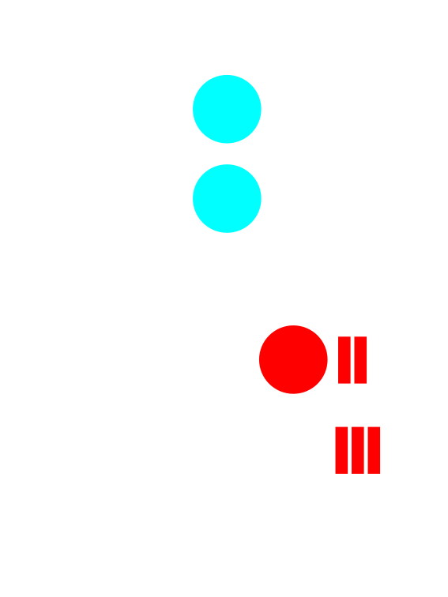
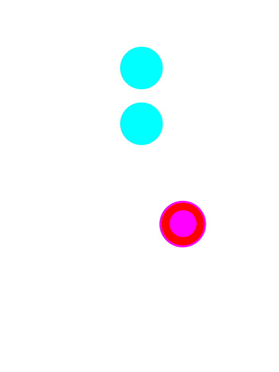
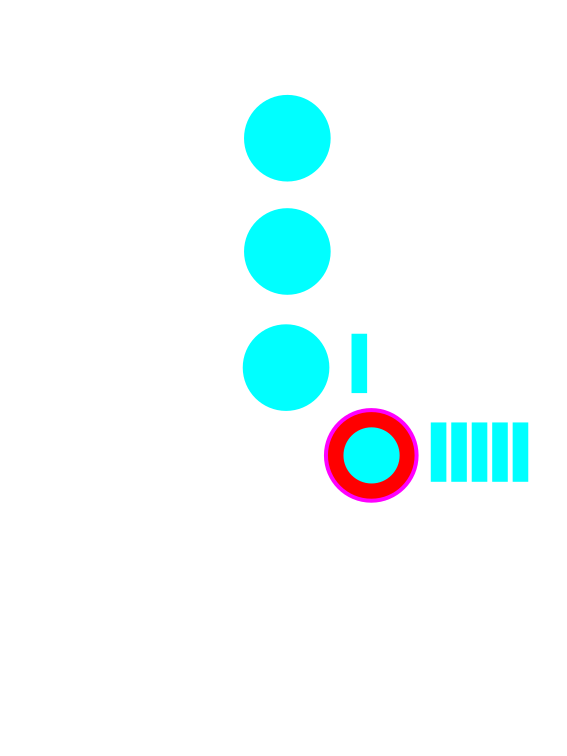

# Consensus: Finality

---

## Consensus is...

...a decision making process that strives to achieve acceptance of a decision by all participants.

Notes:

If we have external factors like trust relationships or Social hierarchy it can be quite easy.

Trust example: If everyone trusts each other, then any one person can propose an outcome, and all the others will trust that it is in the community's best interest.

Social Hierarchy example: If a community has an executive (President, Queen, CEO), the executive can propose her preference and everyone will accept it based on the external mechanism that keeps her as the executive.

But these conditions are not interesting, and are often not realistic. It gets interesting when we don't make these simplifying assumption.

---v

## Five Aspects of Blockchain Consensus

<pba-flex center>

- State machine validity
- Arbitrary / Political validity
- Authorship throttling
- Fork choice heuristic
- Finality

</pba-flex>

---

## What do these things have in common?

---v

## What do these things have in common?

---v

## What do these things have in common?

---v

## What do these things have in common?

---

## Adversarial Conditions

- The participants want to agree on _something_
- They don't trust each other
- Some could be faulty, or make mistakes
- Some could be straight up malicious (aka Byzantine)

---

# One Shot Consensus

A single decision to make.

Once it is made, we are done.

---v

## Desired Properties

All honest participants...

- **Termination** - Eventually reach some decision
- **Agreement** - Reach the same decision
- **Integrity** - Reach at most one decision, which was proposed by at least one participant.

---v

## Also Validity

If all participants unanimously propose the same decision, all honest participants reach that decision.

Notes:

Another desireable property that is sometimes too obvious to say.

---

## Example: Where to go for dinner

<pba-cols>
<pba-col>

</pba-col>

<pba-col>

- Termination - Stan, Kyle, and Kenny will each eventually decide where to eat.
- Agreement - Stan, Kyle, and Kenny will each decide to eat at the same place.
- Integrity - Stan, Kyle, and Kenny will eat at either Whistlin' Willies or Casa Bonita.

</pba-col>
</pba-cols>

Notes:

Stan, Kyle, Kenny, and Cartman are trying to decide where to have dinner.
Stan, Kyle, and Kenny want to have something yummy and spend time together.
Cartman is secretly pursuing his own goals and doesn't care whether dinner is yummy.
In fact he secretly hopes they won't decide at all so he can go home and eat KFC with his mom.

Stan and Kyle both propose Whistlin' Willie's for dinner.
Kenny and Cartman propose Casa Bonita.

In the end Kenny may not agree that Whistlin' Willie's is the best option for dinner, but he will agree that it is the legitimate group decision.

---v

## Mistakes vs Malice

**Crash Tolerance** - A system can keep operating normally when some actors crash or go offline.

**Byzantine Fault Tolerance** - A system can keep operating normally when some actors are intentionally malicious. Byzantine actors may:

- Crash - Or pretend to have crashed - Byzantine faults are a superset of crash faults
- Lie - Sending false information to peers
- Equivocate - Send inconsistent information to different peers

Notes:

These examples and many others are _instances_ of the Byzantine Generals Problem

---v

## Mistake or Malice?

<pba-cols>
<pba-col>

</pba-col>

<pba-col>

- Consider an Airplane flight computer.
- The pilot _must_ know the airspeed at all times.
- Airspeed sensors can fail.
- Sensors can be buggy.
- Are these malicious?

</pba-col>
</pba-cols>

Notes:

Consider an Airplane flight computer. It is critical that the pilot (human or automated) knows the aircraft's airspeed at all times.
Airspeed sensors can fail due to extreme temperatures, icing, solar radiation, and other reasons.
For this reason, there are redundant sensors, and they run a consensus protocol.

Imagine that one of the sensors has an overflow _bug_ such that when the airspeed exceeds a certain threshold, maybe `u8::max_value()`, it actually reports a much lower speed.

Are these crash faults or byzantine?

In a blockchain system, bugs in the code may cause nodes whose operators are intending to be honest, to deviate from the protocol anyway. This is why client diversity is important.

---

## Byzantine Generals Problem

<pba-cols>
<pba-col>

</pba-col>

<pba-col>

- Divisions plan to attack
- Must make coordinated attack to succeed
- Some generals might be traitors and behave maliciously

</pba-col>
</pba-cols>

[Cornell Lecture Slides](https://www.cs.cornell.edu/courses/cs6410/2018fa/slides/18-distributed-systems-byzantine-agreement.pdf)

Notes:

Several divisions of the Byzantine army are camped around an enemy city.
They plan to attack the city, but have not yet decided when to attack.
If the attack is coordinated, they will probably be successful, but if it is uncoordinated, they will probably be defeated.
What do our three properties mean in this scenario?

- Termination - every honest general will eventually decide when to attack
- Agreement - honest general will all agree to attack ta the same time
- Integrity - the attack time will have been proposed by at least one honest general

Leslie Lamport proposed this problem in the form of a story as a typical representative of the distributed consensus problem.

This is a big moment for us, so let's stop and savor it.
Two days ago Lauren kicked us off by talking about human coordination.
How it can achieve long railroads and the great pyramids and sports teams and dancing, and even this academic program.
Since then we've looked through so many layers of abstraction (contracts, smart contracts, state machines, dags) and so many technical implementation details (P2P networking, platform agnostic bytecodes, blockchain headers, merkle proofs).
We've taken a huge class of problems - human coordination problems - and distilled them down to their absolute essence.
Human coordinate at global scale reduced to this one cute, carefully stated problem.

---v

## Byzantine Generals: Solved

_Miguel Castro and Barbara Liskov, 1999_

Notes:

_Image = Cover page: Practical Byzantine Fault Tolerance_

And great news.
The problem is solved!
At least under some conditions.
And also great news.
We have a pretty good understanding of under what circumstances it is solvable.

Before I can tell you exactly how and where it can be solved, we have to understand networks a little bit.

---

# History Lesson

---

## Synchrony

A network is one of:

- **Synchronous** - When sent, a message is received immediately by all.
- **Asynchronous** - When a message is sent it may be received after some delay, or not at all. The sender doe not know whether it is received. Messages may be received in different orders by different parties.
- **Partially Synchronous** - When a message is sent, it may be received after some delay up to a maximum delay, $T$. It may not be dropped entirely. Messages may be received in different orders by different parties.

Roughly analogous to real-time (async) vs. turn-based (sync) games.

---v

## Sync or Async?

Classify each of these:

<pba-flex center>

- Telephone call
- Mail communication
- Text message
- Jitsi video call
- Element chat

</pba-flex>

Notes:

- Telephone call is sync. You say something and wait for the other party to reply
- Mail is async. You send a letter, then go do other stuff for several days
- Jitsi video call is basically sync just like the phone call.
- The others can be either. Sometimes you text back and forth quickly and wait for replies. Other times you send and come back later like mail.

---

## Determinism

A system is one of:

- **Deterministic** - The same inputs give the same outputs every time.
- **Probabilistic** - The same inputs may not give the same outputs. 
  $~~~~~~~~~~~~~~~~~~~~~~~~~$ Requires a source of entropy. eg coin flipping. <!-- $~~~$ is a hack to put in white space chars -->

---

## FLP Impossibility

[Excellent Podcast with Ethan Buchman](https://www.youtube.com/watch?v=t0T-5QOXvrQ)

Notes:

Once it was shown that deterministic consensus is impossible in an async network, the field split into two major parts. Either you:

- Assume the network is (at least partially) synchronous
- Introduce non-determinism

One interesting thing about Nakamoto pow consensus is that it does _both_.

- Nondeterminism because you don't know who will solve the pow first
- Partial synchrony because it only works if the time to download and execute the block is much less than the time to solve the PoW

---

## Ongoing Consensus

We want to continue agreeing on an every-growing history of events

Notes:

Blockchains are intended to keep processing and finalizing transactions forever. This is more like deciding where to go to dinner every night over and over.

---v

## Desireable Properties

<pba-flex center>

- **Safety** aka **Finality** - Nothing bad will happen
- **Liveness** - Something good will eventually happen

</pba-flex>

Notes:

Traditional literature typically uses the term safety. Blockchain folks typically talk about finality. They basically mean the same thing.

Finality can be proved to entities that are not involved in consensus.

We spoke about liveness previously in the authoring system. There it means that more blocks will be authored, more blockspace will be created and put up for sale. Here, in finality, it means that more blocks will be finalized. Of course liveness in the finality depends on liveness in the authoring.

These two decisions can be entirely orthogonal to one another, or wrapped up together.

---v

## Liveness vs Termination

Earlier I described Termination as desireable, now I'm saying Liveness is desireable.

Are these at odds with each other?

Notes:

Termination guarantees that, for a given decision, each honest participant will eventually decide something. This concept is relevant when there is a single decision to be made. In the blockchain context, it guarantees that we will eventually know which block is final at height n.

Liveness guarantees that a system that is intended to continue making progress, will indeed eventually make progress. In the context of the blockchain, liveness means that once we've decided what block is final at height n, we will eventually go on to decide what block is final at height n + 1.

---

## Finality in Nakamoto Consensus

<pba-flex center>

- Longest chain rule
- Longest chain is "best"... for now
- Someone could always start mining a chain and,with low but non-zero probability,  end up with it longer.
- There could _already_ be a longer chain that you just haven't heard of.

<pba-flex>

The finality is only probabilistic. 
Nakamoto consensus in only safe in a synchronous network.

Notes:

This is to say that Nakamoto consensus is NOT safe on the real asynchronous internet. In practice, as long as
blocks can be downloaded and executed much more quickly than the target block time, it is usually good enough.

- Longest could also mean most accumulated work

---

## Deterministic Finality

<pba-flex center>

- Based on traditional methods (BFT)
- Requires an honest-majority finite authority set

</pba-flex>

<!-- two flexes needed so the next bullet points don't show too early, margin hack... TODO -->

<pba-flex center style="margin-left: 48px">

- Consensus protocol that assumes honest majority
- Economic game that keeps them honest

</pba-flex>
<!-- .element: class="fragment"-->

Notes:

If you want deterministic finality, it basically means employing BFT agreement protocols that we talked about in the history lesson. This means we need a finite authority set with an honest majority. And that means we need incentives to keep them honest.

---v

## Incentives: Game Theory!

Abstractly: You behave honestly when the utility of doing so exceeds the cost.

Incentive designers may potentially:

<pba-flex center>

- Reward honest behavior
- Punish (aka slash) dishonest behavior

</pba-flex>

Notes:

Many systems use both of these, but doing so is not strictly necessary. Even without slashes, the opportunity cost of staking and the missed rewards from authoring invalid blocks may be sufficient.

It is often the case that blockchain systems give rewards in the authorship and punishments in the finality. There is no fundamental reason for this; it is just a little more straightforward to implement.

---v

## What is potentially punishable?

<pba-flex center>

- Authoring when you aren't supposed to
- Failing to author when you are supposed to
- Casting finality votes for conflicting blocks
- Casting a finality vote for a block (or chain)  that includes an invalid state transition.

> How severe are each of these offenses? 
> Do they all warrant a slash? 
> A full slash?

Notes:

PoW has inherent punishment through wasted energy. BFT based system's don't.

Instead, aspiring participants will typically lock up a security deposit which can be slashed in part or in whole.

---v

### Concrete Punishment Example

Let's say a slash is 100 units, and the reporter gets 10%. I plan to attack.

If my attack is successful, I expect to gain roughly 200 units worth of utility.

I ask another authority to cooperate with me: "I'll pay you 20 units to _not_ rat me out for my attack".

> How would you respond?

Notes:

"I don't believe you can carry out the attack because _someone else_ will report you and take the 10 units, leaving me with 0."

---

## Case Study: Tendermint

<pba-flex center>

- Authorship is like Aura - simple round robin
- Naive but **simple** BFT implementation
- If the block has enough votes by the end of the slot, it is finalized. 
  Otherwise, it is rejected via timeout.
- "Instant finality"
- Forkless - Forks are disallowed because blocks can only be authored on finalized parents.

</pba-flex>

Notes:

Tendermint assumes a partially synchronous network, like all the BFT based systems - That is to say that messages may not arrive immediately, but will arrive within a finite time bound. In practice this means it is slot-based just like so many of the authoring schemes.

Tendermint is often touted as "instant finality". It is instant in the sense that finality is tied to authorship. In practice this means that authorship, which is inherently O(n), is slowed down to stay in sync with finality which is O(n^2). They sacrifice liveness to guarantee absolute safety at all times.

---v

## Tendermint Deep Dive

<pba-flex center>
<ol>
<li class="fragment">Wait for a block (or author one if it is your turn)</li>
<li class="fragment">Prevote
  <ul>
    <li>If the block is valid, Prevote for it.</li>
    <li>If the block is invalid, Prevote `Nil`</li>
  </ul>
</li>
<li class="fragment">Precommit
  <ul>
    <li>Wait for 2/3 prevotes then Precommit</li>
    <li>If you don't get 2/3 prevotes, Precommit `Nil`</li>
  </ul>
</li>
<li class="fragment">Complete
  <ul>
  <li>Wait for 2/3 Precommits them finalize</li>
  <li>If you don't get it, throw the block away</li>
  </ul>
</li>
</ol>

[Very useful blog post](https://medium.com/softblocks/explaining-how-tendermint-consensus-works-433066cbc465) <!-- .element: class="fragment" -->

</pba-flex>

---

## Hybrid Consensus

<pba-cols>
<pba-col>

</pba-col>
<pba-col>
<pba-flex center style="font-size: 0.7em; margin-left:-50px">

- Separates block production from finality.
- Block production stays live even if finality lags.
- Allows lower overhead in the finality layer.
- Used in Substrate.

</pba-flex>
</pba-col>
</pba-cols>

---v

## What About Re-Orgs

 

Notes:

Previously we talked about how a node's view of the best block can change, and that is called a re-org.

---v

## Modified Fork Choice Rule

 

Only extend best finalized chain
Notes:

Once you have a finality gadget installed, you have to make sure you only ever author on top of finalized blocks. Even if another chain is longer.

---

## Case Study: Grandpa

<pba-flex center>

- Deterministic finality _only_
- Requires an external block authoring scheme  with its own liveness proof.
- Kind of like Tendermint but better.
- Finalizes chains, not blocks.

</pba-flex>

---v

## Vote on Chains, not Blocks

Notes:

BFT finality with $n$ authorities is in $O(n^2)$.
Tendermint does this at **every block**.
This bounds the size of the authority set.

With separated, we treat each vote as a vote not only for one block,but also for each ancestor block.
This significantly reduces the number of total messages sent.
Allows the chain to stay live even when many validators are offline

---

## A GRANDPA Round

Each validator **broadcasts** a **prevote** for the **highest block** that it thinks **should** be **finalized**

- For **honest** validators, this block **must include** the chain that was previously finalized
- This **new chain** could be **several blocks** longer than the **last finalized** chain

A **validator** that is designated as the **primary** broadcasts the highest block that it thinks could be final from the previous round

---

## A GRANDPA Round

Notes:

- 7 = # Validators
- 5 = # Threshold

---

## A GRANDPA Round

Notes:

- 7 = # Validators
- 5 = # Threshold

---

## A GRANDPA Round

Each validator **computes** the **highest block** that can be **finalized based** on the set of **prevotes**

- i.e. we find the **common ancestor** of all votes that has **support** from **more** than $\frac{2}{3}N + 1$ validators
- We refer to this block as the **prevote GHOST**

---

## A GRANDPA Round

Notes:

- 7 = # Validators
- 5 = # Threshold

---

## A GRANDPA Round

We define the round **estimate** as the **highest ancestor** of the **prevote GHOST** for which it is **still possible** to **precommit**

- i.e. when **no precommit** votes have been **sent** out yet, then:

`estimate == prevote GHOST`

---

## A GRANDPA Round

Notes:

- 7 = # Validators
- 5 = # Threshold

---

## A GRANDPA Round

If the **estimate** extends the **last finalized** chain, then each validator will cast a **precommit** for that chain.

Each validator **waits** to receive **enough precommits** to be able to finalize

- We again find the **common ancestor** of the **estimate** which has **threshold precommits**
- We declare that **block** as **finalized**

---

## A GRANDPA Round

Notes:

- 7 = # Validators
- 5 = # Threshold

---

## A GRANDPA Round

Notes:

- 7 = # Validators
- 5 = # Threshold

---

## A GRANDPA Round

The **round** is deemed **completable**:

- if the **estimate** is **lower** than the **prevote GHOST**
- or if it's **impossible** to have a **supermajority** on any **block higher** than the current **estimate**

Validators **start** a **new round** after it becomes **completable**.

---

## A GRANDPA Round

Notes:

- 7 = # Validators
- 5 = # Threshold

---

## A GRANDPA Round

Notes:

- 7 = # Validators
- 5 = # Threshold

---

## A GRANDPA Round

Notes:

- 7 = # Validators
- 5 = # Threshold

---

## A GRANDPA Round (Alt)

Notes:

- 7 = # Validators
- 5 = # Threshold

---

## A GRANDPA Round (Alt)

Notes:

- 7 = # Validators
- 5 = # Threshold

---

## A GRANDPA Round (Alt)

Notes:

- 7 = # Validators
- 5 = # Threshold

---

## A GRANDPA Round (Alt)

Notes:

- 7 = # Validators
- 5 = # Threshold

---

## Summary

<pba-flex center>

- Networks can be {Synchronous, Asynchronous}
- Consensus systems can be {Deterministic, Probabilistic}
- Consensus systems can be {Open participation, Finite participation}
- There is always an assumption that at least {1/2, 2/3} participants are honest
- In decentralized systems, we use Economics and Game Theory to incentivize honest execution of the consensus protocol

---

<!-- .slide: data-background-color="#4A2439" -->

# Game Time

> I want to play a game... a board game!
