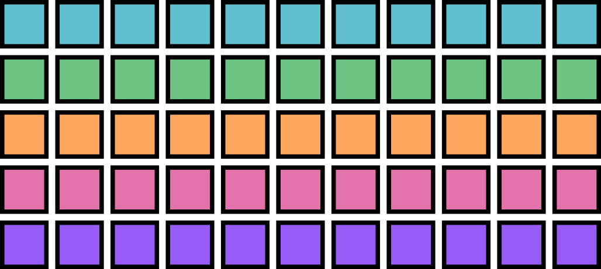
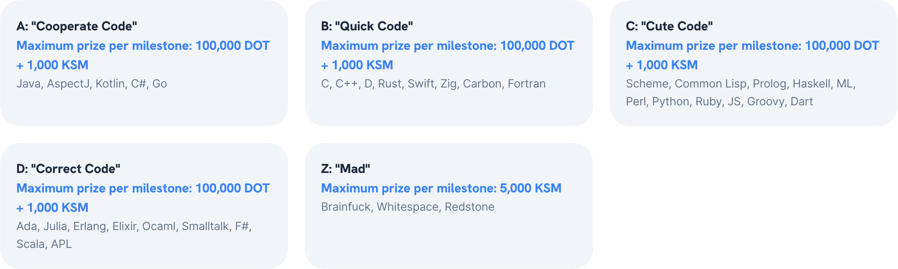

# Ecosystem and Economy

---

## Ecosystem and Economy

This presentation will give you a high level overview of the ecosystem and economy of the Polkadot Network.

Unfortunately this presentation could never be fully exhaustive, but perhaps it will shed light on areas previously unknown.

---

# Economy

---

## The DOT Token

<div class="grid grid-cols-2">

<div>

<image src="../../assets/img/7-Polkadot/eco/token.avif" style="width: 400px;">

</div>

<div class="text-left">

DOT is the native token of the Polkadot Network.

DOT tokens can be in one of the following states:

1. Transferable
2. Frozen (Locked)
3. Held (Reserved)

</div>

</div>

---

## Frozen vs Held Balance

- Old terms "Reserved" and "Locked" are on their way out...
- DOT in both states belong to the user... but cannot be spent / transferred.
- Held balances stack on top of one another.
  - Useful for user deposits, or other use cases where there is sybil concerns.
  - Ex: Deposit for storing data on-chain,
- Frozen balances can overlap each other.
  - Useful when you want to use the same tokens for multiple use cases.
  - Ex: Using the same tokens for both staking and voting in governance.

---

## Storage Bloat

One blockchain scaling problem is storage bloat over time.

<br />

Consider the "cost" of storing data on Ethereum:

- A one time gas fee based on the amount of data stored.
- Once is it placed on the network, it lives there forever, with no additional costs.
- Over a long enough period of time, the cost of storage per time will reduce to zero.

---

## Storage Deposits

To solve this problem, Polkadot additionally takes a storage deposit (in the form of Reserved Balance) for any data stored in the blockchain.

- This deposit is returned to the user when the user removes the data from the chain.

- This deposit can be quite extreme, since it is returned to the user, and can represent the impermanence or lack of "importance" of the data.

---

## Dust Accounts & Existential Deposit

The most bloat-ful storage on most blockchains are user accounts:

- Both Ethereum and Bitcoin are riddled with "dust accounts" which have such a small balance, they are not worth "cleaning up".

- Polkadot solves this by having an "existential deposit" that all users must hold a minimum amount of DOT, else their account data will be cleaned up.

- Existential deposit can be thought of as a storage deposit for account data.

---

## Scaling with Data Sharding

- Polkadot is already designed to scale by sharding data.
  - Polkadot only needs to store the merkle root representing large amounts of data.
- The cost to store data on shards are orders of magnitude cheaper.
  - We can have decreased storage deposits on these shards:
    - ED: 1.0 DOT on Polkadot -> .01 DOT on Asset Hub
    - Identity: 20 DOT on Polkadot -> .2 DOT on People Chain

---

## DOT is a Utility Token

<div class="grid grid-cols-3">

<div>

<image src="../../assets/img/7-Polkadot/eco/utility.avif" style="width: 500px;">

</div>

<div class="text-left col-span-2">

The DOT token serves multiple purposes to help the Polkadot network function:

- Purchasing Blockspace
- Staking
- On-Chain Decision Making
- Value Bearing for Trading / Using

</div>
</div>

---

## DOT Inflation

<div class="grid grid-cols-2">

<div>

<image src="../../assets/img/7-Polkadot/eco/inflation.svg" style="width: 500px;">

</div>

<div class="text-left">

DOT is currently configured to have a fixed inflation rate of 10% per year.

Newly minted tokens are distributed to the treasury and stakers (validators / nominators).

RFC for Flexible Inflation: https://github.com/polkadot-fellows/RFCs/pull/89

</div>

</div>

---

## Ideal Staking Rate

- We cannot force / tell users how to use their tokens.
  - So we encourage "ideal" behavior by associating DOT token usage to how inflation is distributed.
  - There’s a function that redirects staking inflation to the Treasury, instead of the stakers, when `ideal_rate != staking_rate`.
  - Token holders are financially incentivized to maximize their staking returns, and thus distribute their tokens appropriately.
- Ideal Staking Rate is in the process of being adjusted since the introduction of coretime sales:
  - https://forum.polkadot.network/t/adjusting-polkadots-ideal-staking-rate-calculation/3897

---

## DOT Inflation vs Staking

<image src="../../assets/img/7-Polkadot/staking-rate.png" style="width: 900px;">

> Blue: Inflation vs Staking Rate
>
> Green: APY of Stakers vs Staking Rate
>
> Black: Total Inflation vs Staking Rate

Notes:

Blue line shows that:

- When there is too little being staked, validators are encouraged to stake more.
- When there is too much being staked, validators are encouraged to stake less.

Green line shows that validator APY goes down whenever more validators enter the staking system, that is unavoidable, but specifically past the ideal staking rate, the decrease in APY sharply decreases.

Black line shows that inflation for for the whole network is fixed at 10%.

The gap between the blue line and the black line shows the amount of inflation that is forwarded to the treasury, as compared to given to validators.
Event at the ideal staking rate, some percentage of the inflation is guaranteed to go to the treasury.

---

## DOT Utility: Purchasing Blockspace

Polkadot provides many utilities, but arguably its most important utility is providing flexible, secure, and scalable blockspace.

Developers can purchase this blockspace **only** with the DOT token.

<br />

> If you believe that flexible and secure blockspace has value, then you agree that DOT also has value.

---

## Evolution of the Blockspace Marketplace

<div class="grid grid-cols-3">

<div>



</br></br>


</div>

<div class="col-span-2">

- Initially blockspace was only sold in 2 year slots, in the form of Parachain auctions.
- We recently transitioned to agile coretime which allows more flexible access to blockspace.
  - Coretime sales use periodic dutch auctions.
- JAM will continue to increase the flexibility of allocating and distributing blockspace.
- Exactly how blockspace is allocated and sold will continue to evolve over time.

</div>

</div>

Notes:

- https://forum.polkadot.network/t/initial-coretime-pricing/5187
- https://grillapp.net/12935/agile-coretime-pricing-explained-166522
- https://www.youtube.com/watch?v=ci-h9zC-57Y
- https://twitter.com/rphmeier/status/1797339044893917397

---

## DOT Utility: Staking

<div class="grid grid-cols-3">

<div class="col-span-2 text-left">

Given the existence of a value bearing token, it can be used to provide security to Polkadot:

- If users want to provide security to the network, they can stake their tokens.

- Stakers are rewarded for good behavior, and punished for bad behavior.

- Punishment is designed to maximize the costs for a rational actor and thereby deter misbehavior.

https://polkadot.network/features/staking/

</div>

<div>

<image src="../../assets/img/7-Polkadot/eco/staking.svg" style="width: 400px;">

</div>

</div>

---

## Staking: Validators and Nominators

<div class="grid grid-cols-3">

<div class="col-span-2 text-left">

In the staking system, there are two roles:

- Validators: Those who run block producing / parachain validating nodes for Polkadot.
- Nominators: Users who place their tokens behind validators they think will perform their job well.

Validators (and their nominators) are rewarded based on work done for the network. Rewards may vary day to day, but should be consistent over long periods of time.

</div>

<div>

<image src="../../assets/img/7-Polkadot/eco/collab.svg" style="width: 400px;">

</div>

</div>

---

## DOT Utility: Governance

<div class="grid grid-cols-3">

<div class="col-span-2 text-left">

The future of Polkadot is decided by token holders.

Polkadot has an on-chain governance system called OpenGov which is used to:

- Spend Treasury Funds
- Upgrade the Network
- Manage the Fellowship
- Support Parachain Teams
- etc...

https://polkadot.network/features/opengov/

</div>

<div>

<image src="../../assets/img/7-Polkadot/eco/governance.avif" style="width: 500px;">

</div>

</div>

---

## Conviction Voting

Polkadot utilizes an idea called voluntary locking / conviction voting.

This allows token holders to increase their voting power by locking up their tokens for a longer period of time.

```text
votes = tokens * conviction_multiplier
```

The conviction multiplier increases the vote multiplier by one every time the number of lock periods double.

<div class="text-small">

| Lock Periods | Vote Multiplier | Length in Days |
| ------------ | --------------- | -------------- |
| 0            | 0.1             | 0              |
| 1            | 1               | 7              |
| 2            | 2               | 14             |
| 4            | 3               | 28             |
| 8            | 4               | 56             |
| 16           | 5               | 112            |
| 32           | 6               | 224            |

</div>

---

## Tracks

The OpenGov system has different voting tracks which have different levels of power, and proportionally different level of difficulty to pass.

Here are just some of the currently 15 tracks:

| ID  |       Origin       | Decision Deposit | Prepare Period | Decision Period | Confirm Period | Min Enactment Period |
| :-: | :----------------: | :--------------: | :------------: | :-------------: | :------------: | :------------------: |
|  0  |        Root        |    100000 DOT    |    2 Hours     |     28 Days     |     1 Day      |        1 Day         |
|  1  | Whitelisted Caller |    10000 DOT     |   30 Minutes   |     28 Days     |   10 Minutes   |      10 Minutes      |
| 10  |   Staking Admin    |     5000 DOT     |    2 Hours     |     28 Days     |    3 Hours     |      10 Minutes      |
| 11  |     Treasurer      |     1000 DOT     |    2 Hours     |     28 Days     |    3 Hours     |        1 Day         |
| 12  |    Lease Admin     |     5000 DOT     |    2 Hours     |     28 Days     |    3 Hours     |      10 Minutes      |

---

## Approval and Support Curves

Each track has their own set of curves which determine if the proposal has passed or failed.

All votes will eventually resolve one way or another.

<image src="../../assets/img/7-Polkadot/eco/pjs-curves.png" style="width: 1000px;">

You can find these curves on the Polkadot JS Developer Console.

---

## Example: Root

The origin with the highest level of privileges. Requires extremely high levels of approval and support for early passing. The prepare and enactment periods are also large.

<image src="../../assets/img/7-Polkadot/eco/root-curve.png" style="width: 800px;">

For instance, a referendum proposed in this track needs to amass 48.2% support (total network issuance) by the end of the first day with over 93.5% approval to be considered to be part of the confirm period.

---

## Governance Token Mechanics

- DOT tokens are frozen when you vote on a proposal.
- You can reuse your frozen tokens across multiple proposals.
  - Voting for one proposal does not affect your ability to vote on another proposal.
- You can also reuse staked tokens (which are also just frozen).
- You can update your vote while the proposal is ongoing.
- If you used conviction voting, your tokens might be frozen for long periods of time passed the end of a proposal.

---

## Treasury

<div class="grid grid-cols-3">

<div class="text-left col-span-2">

Polkadot has an on-chain treasury which is used to support permissionless and decentralized development of the network.

- Treasury gets its funds through inflation, slashing, and by taking 80% transaction fees.

- Treasury will automatically burn a 1% of its funds every spending period (24 days), placing pressure on spending the tokens.

</div>

<div>


</div>

</div>

---

## Treasury Outlets

- Proposals: Instant payments to individuals approved by governance.
- Bounties: Multi-stage payments to individuals managed by governance and an appointed bounty curator.
- Tips: Small payments to individuals that can be made more easily through specific governance tracks.

The Polkadot Treasury currently has over 22,000,000 DOT. (June 2024)

---

# Ecosystem

---

## A Future Full of Clients

The Web3 Foundation is allocating 10 Million DOT for creating a diverse ecosystem of Polkadot clients.



This can help provide additional resilience to the network from software bugs.

---

## System Parachains

- System parachains contain core Polkadot protocol features, on a parachain rather than Polkadot itself.
- **Polkadot uses its own heterogenous sharded scaling technology to scale itself.**
- System parachains remove transactions from the main Polkadot chain, allowing it to allocate more blockspace to other services.
- System parachains are allocated blockspace by governance.

Notes:

- https://wiki.polkadot.network/docs/learn-system-chains
- https://github.com/polkadot-fellows/RFCs/blob/34d26ff1aa343b0cc980afbf2f40c1d5b6a781ea/text/0032-minimal-relay.md

---

## Current and Future System Parachains

Current:

- Asset Hub: Allows creation and registration of tokens (FT & NFTs).
- Bridge Hub: A chain for managing bridges to other networks.
- Coretime Chain: responsible for the sales of coretime.
- Collectives: Acts as a place for coordination of the Polkadot DAOs.
- Encointer: A third-party built chain providing Proof of Personhood.
- People Chain: A chain for managing identity and Personhood.

Future:

- Governance: Manage all the various proposals and tracks.
- Staking: Manage all the validator and nominator logic, rewards, etc...
- Eventually everything...

Notes:

https://wiki.polkadot.network/docs/learn-system-chains

---

## Market Bought Blockspace

<div class="grid grid-cols-2">

<div>

Anyone with a great idea, and access to DOT token, can launch an application on Polkadot.

Dozens of teams from around the world have already done that, and are taking advantage of the features that Polkadot provides.

With JAM, this will only get easier.

</div>

<div>

<image src="../../assets/img/7-Polkadot/eco/polkadot-parachains.svg" style="width: 500px;">

</div>

</div>

Notes:

https://polkadot.subscan.io/parachain

---

## Ecosystem Verticals

While this list is not exhaustive, some of the verticals we have seen appear in Polkadot are:

<div class="grid grid-cols-5">

<div class="col-span-3">

- Smart Contract Chains
- Decentralized Finance (DeFi)
- Decentralized Social (DeSo)
- Decentralized Identity (DID) Services
- Tokenization (Real World Assets)

</div>

<div class="col-span-2">

- Gaming
- NFTs (Music, Art, etc...)
- Bridges
- File Storage
- Privacy

</div>

</div>

Notes:

https://substrate.io/ecosystem/projects/

---

## Wallets

Thanks to the treasury and Polkadot community, a number of different wallets have been developed across the ecosystem.

<image src="../../assets/img/7-Polkadot/eco/wallets.png" style="width: 1200px;">

https://polkadot.network/ecosystem/wallets/

---

## Generic Ledger Support

<div class="grid grid-cols-3">

<div class="col-span-2">

Polkadot has been working with Ledger to provide rich support for the Polkadot network.

Users can get clear visibility into the transactions they are signing, and perform complicated tasks such as batching, multisigs, staking, governance, and more.

</div>

<div>

<image src="../../assets/img/7-Polkadot/eco/ledger.webp" style="width: 500px;">

</div>

</div>

Notes:

- https://forum.polkadot.network/t/polkadot-generic-ledger-app/4295

---

## Block Explorers

- Polkadot-JS Apps Explorer - Polkadot dashboard block explorer. Supports dozens of other networks, including Kusama, Westend, and other remote or local endpoints.
- Subscan - Blockchain explorer for Substrate chains.
- 3xpl.com - Universal block explorer and JSON API with Polkadot support.
- Blockchair.com - Universal blockchain explorer and search engine with Polkadot support.
- Statescan.io - Polkadot & Kusama Blockchain explorer.

Notes:

https://wiki.polkadot.network/docs/build-tools-index#block-explorers

---

## Governance Dashboards

The most popular ones at the moment:

<div class="grid grid-cols-2">

<div>

### Polkassembly

<image src="../../assets/img/7-Polkadot/eco/polkassembly.png" style="width: 600px;">

</div>

<div>

### Subsquare

<image src="../../assets/img/7-Polkadot/eco/subsquare.png" style="width: 600px;">

</div>

</div>

---

## Polkadot Forum

<image src="../../assets/img/7-Polkadot/eco/forum.png" style="width: 1200px;">

Notes:

https://forum.polkadot.network/

---

## Fellowship

The Polkadot Fellowship is a decentralized technical collective on the Polkadot network designed to recognize, nurture, and incentivize contributors to the core Polkadot protocol.

---

## Fellowship Manifesto

<image src="../../assets/img/7-Polkadot/eco/fellowship-manifesto.png" style="width: 1200px;">

Notes:

https://github.com/polkadot-fellows

---

## Fellowship Members

<image src="../../assets/img/7-Polkadot/eco/fellowship-members.png" style="width: 1200px;">

Notes:

https://polkadot.js.org/apps/?rpc=wss%3A%2F%2Fkusama-rpc.polkadot.io#/fellowship

---

## RFCs

<image src="../../assets/img/7-Polkadot/eco/rfcs.png" style="width: 1200px;">

---

<!-- .slide: data-background-color="#4A2439" -->

# Questions

Did I miss anything?
