# Grandpa - The Board Game

> - Players: 5+ (4 actual players, 1 author)
> - Play time: 15 - 60 min
> - Materials: A large whiteboard and many colored markers

## Overview

Grandpa is a Byzantine fault tolerant blockchain finality gadget ([formal spec](https://arxiv.org/pdf/2007.01560.pdf)).
This collaborative board game allows players to learn and practice the Grandpa protocol while also having fun together.

Your goal in the game is to finalize blocks in an ever-growing blockchain data structure.
You will work together to share information with other players and reach consensus.
But watch out; some players may be Byzantine!

<figure>
    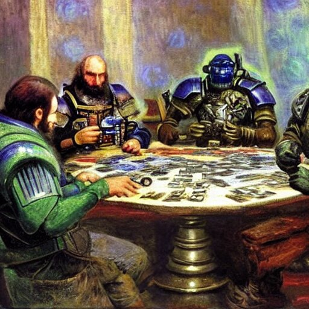
    <figcaption><b>Pictured: Byzantine Generals solving distributed consensus via a board game.</b></figcaption>
</figure>

Some less important details of the grandpa protocol (such as primaries, and timeout conditions) are omitted from the board-game for the sake of playability and clarity.

## Setup

Select one participant to act as the "author" who is responsible for creating the blockchain structure, but will not actually play the grandpa protocol.
The remaining participants are all players in the grandpa protocol.

Give one marker to each participant including the author.
Each player should have their own marker color.
Avoid colors that are hard to distinguish such as light red and pink.
If you have colorblind players, take special care when choosing marker colors.

Choose a goal number of blocks that you wish to finalize together as a team.
The game will end when you reach this block number.

### Views and Gossip

The grandpa protocol operates in a decentralized asynchronous blockchain network.
As such, there is no universal view of the blockchain data structure or the messages that are being passed between players in the protocol.
Some players may see more information than others and information may arrive to the various players in different orders.

Divide the whiteboard into a dedicated space for each player in the protocol.
Each player should have roughly 50cm X 50cm.
The author does not need their own dedicated space.

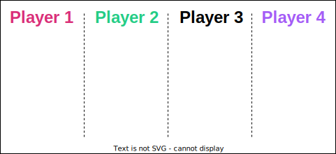

Throughout the game all participants including the author are responsible for communicating with other players by adding information _to other players dedicated spaces_.
In fact, most of the marks that you make during the game will be on someone else's space rather than your own.
For a more realistic game, take care to share information with other players in a different order each time.

### Genesis Block

Before game play begins, the author draws a single genesis block labeled `G` on each player's view.
Each player marks the genesis block as final by shading it with their color in their own view.

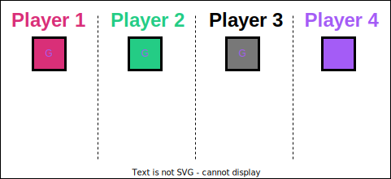

## Authoring

The author is responsible for creating the blockchain data structure and gossiping it to the players.
As the game progresses the author will grow the blockchain by creating descendant blocks of this genesis block.
The author may create blocks anywhere in the chain they see fit.
They may create forks, or linear runs without forks.
They may create a long chain and then go back and create shorter forks from earlier in the chain.

When the author creates a block they should gossip it to all players by drawing it on each player's view.
A block is drawn with a pointer to its parent block and a short unique block identifier like a few characters or digits.
The author should take care to vary to order in which they place new blocks on various players' views.
In fact, the author may even gossip multiple blocks to a single player before going back and gossiping any of them to other players.
However the author should ensure that all blocks are eventually gossiped to all players.

<figure>
    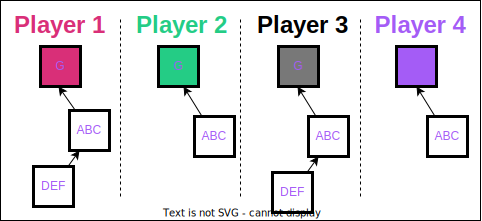
    <figcaption><b>Two blocks have been authored since genesis. Not all players have heard about block <code>DEF</code> yet.</b></figcaption>
</figure>

In some ways the author acts as a "party host" or "dungeon master" for the game.
They should observe the players progress, struggles, and enthusiasm, and author accordingly.
If players are struggling to keep up or getting frustrated or overwhelmed the author should slow down the authoring rate or build a simpler chain with fewer forks.
If players are easily finalizing blocks or getting bored the author should speed up, create a more complex tree with many forks, or decrease the synchrony.

## Game Play

The Grandpa protocols proceeds in rounds.
Each player has their own view of what round they are on, and not all players will be on the same round at the same time.
In each round, each player casts two votes known as the "prevote" and "precommit" in that order.
Each player begins in round 1.

Like many other BFT protocols, Grandpa requires strictly greater than 2/3 of players (not counting the author) to be properly following the protocol.
For the remainder of this section this will be referred to as a "threshold".

### Prevoting

Each player begins a round by casting their prevote.
A prevote can be thought of as a non-binding signal for what the player hopes to finalize in this round.
Generally the prevote should be for the longest chain that extends the best finalized block.
A player casts their prevote by writing the current round number off to the right of the block they are prevoting for first on their own view, and then on other players' views.
Remember you should send your prevotes out to other players in a different order each time, and it is okay to allow some latency between sending it to each player.

<figure>
    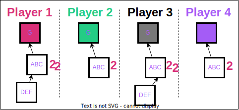
    <figcaption><b>Players 1 and 4 have cast prevotes for block <code>ABC</code> in round 2. Their prevote has not yet been gossiped to all players. Players 2 and 4 have not yet cast prevotes for round 2.</b></figcaption>
</figure>

If a player hasn't yet seen the block you're prevoting for, you may add the block and its parents to their view.

### The Prevote Ghost

When a player has seen a threshold of prevotes in the current round, they can _may_ mark the round's "Prevote Ghost" on their own view.
They may also choose to wait a short time to see if any new prevotes are coming in.
The prevote ghost is defined as the highest block that has a threshold of prevotes, and it is marked by drawing the letters `PG` and a round number off to the left of the block.
For example `PG2` for the round two prevote ghost.
(Or optionally `👻2` if you are feeling artistic).

<figure>
    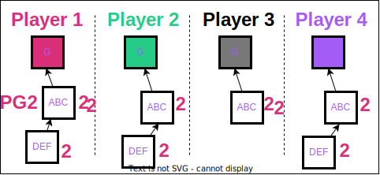
    <figcaption><b>Now that player 1 has seen a threshold of prevotes (3 in this case of 4 players), they can mark the prevote ghost. No other players have seen enough prevotes to mark a prevote ghost yet.</b></figcaption>
</figure>

### The Estimate

As you mark your prevote ghost, also mark your estimate on your own view to the left of the same block that is the prevote ghost with the letter `E` and a round number.
For example, `E4` for round four's estimate.

<figure>
    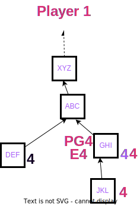
    <figcaption><b>In round 4, Player 1 has marked their prevote ghost previously, and is now setting the estimate to the same slide.</b></figcaption>
</figure>

A round's estimate is defined as the highest block that is in the chain of the prevote ghost that could possibly achieve a threshold of precommits.
So while the estimate _begins_ at the same block as the prevote ghost, it may move up the chain as more precommits come in.

### Precommitting

Once you have marked a prevote ghost, you may, again, wait a short time for any more prevotes to come in.
Once you get tired of waiting (or when you have seen all the prevotes), you may cast your precommit for the block that you see as the prevote ghost.
Mark your precommit first on your own view and then on other players' views by writing the round number off to the right of the block and circling it.
Precommits are distinguished from prevotes by the circle.
Remember not all players will agree on which block is the prevote ghost, so others may precommit for blocks different than you have.

<figure>
    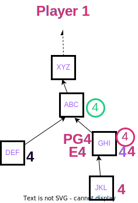
    <figcaption><b>Player 1 casts their round 4 precommit for the block that they see as the prevote ghost. They have also observed a Player 2's precommit.</b></figcaption>
</figure>

As you observe more precommits appearing on your view, your estimate may change. Specifically it may move up the chain to ancestor blocks.

<figure>
    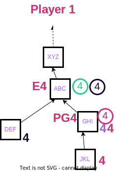
    <figcaption><b>As Player 1 observes more precommits arriving, it becomes impossible for block<code>GHI</code> to achieve a threshold of precommits, and thus the estimate moves up the chain.</b></figcaption>
</figure>

### Completing a Round

We will decide that _some_ block is finalized in each round, although it may be a block that was already finalized in a previous round.
We will only ever finalize an ancestor of the estimate.
Once some ancestor of the estimate has achieved a threshold of precommits, you can declare that block finalized by shading it with your color on your view.

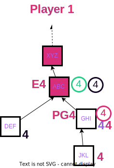

After a round has completed, you may choose to erase the votes for that round from your view to keep the board tidy.
But you are not required to do so.
Be careful not to erase votes for _future_ rounds by accident as some players may have advanced to the next round before you.

<figure>
    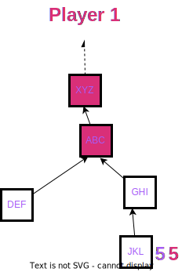
    <figcaption><b>As Player 1 has completed round 4 and has erased markings related to round 4. They have NOT erased marking related to round 5.</b></figcaption>
</figure>

Proceed to the next round.

## Ending the Game

Grandpa is intended to continue finalizing blocks forever.
Since you likely don't want to play this board game forever, the board game does have an end.

The honest players win when they all finalize the goal number of blocks chosen at the beginning without a safety violation.

The Byzantine players (if any; see next section) win when two honest players finalize conflicting blocks or the honest players get fed up and flip the whiteboard over.

## Byzantine Actors

Once you have played a few rounds of the game and are able reliably finalize new blocks, you can spice things up by assigning one or more players to be Byzantine.
Byzantine players are not required to follow the protocol rules.
For example they may:

- Prevote for chains that do not extend the latest finalized chain
- Precommit for blocks other than the ones indicated by the prevote
- Go back and cast votes in previous rounds
- Fail to participate at all.

When first adding Byzantine players, you may assign the Byzantine roles such that everyone knows who is Byzantine.
Or, for a more realistic experience, you may assign it blindly by eg drawing straws.
Remember that in order for Grandpa to work you must have strictly less than one third of grandpa players Byzantine.

For the most realistic experience, allow players to self select whether they are Byzantine.
By doing this there is no guarantee that the honest super majority criteria is met and you experience safety faults where different players finalize conflicting chains.
