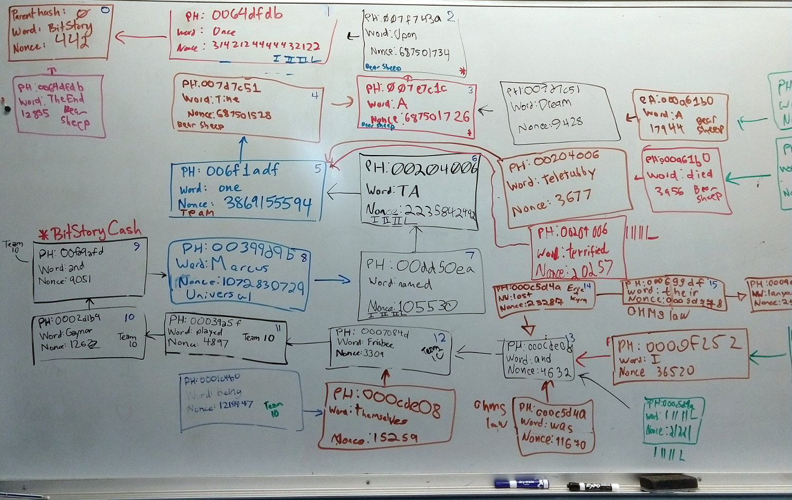

# Manual Consensus (aka BitStory)

In this activity students will encounter and explore blockchain consensus mechanisms such as PoW, PoA, and PoS by acting them out manually.

Students will collaborate in telling a shared story.
The shared story is represented by a blockchain with one word in each block.
To add a word to the story, a student must create a valid block, and draw that block on the community whiteboard\*

<pba-flex center>

</pba-flex>

- If no whiteboard is available, you may be able to substitute; a paper, online drawing tool, or even a chalkboard if you are desperate.

## Proof of Work

The PoW phase is the original, and a working hasher tool is available here: <https://joshorndorff.github.io/BitStory/bitStoryLive.html>

To begin we'll explore the Nakamoto style Proof of Work.
To add a block a student must:

- Choose a parent block hash to build on
- Choose a word to add to the story
- Find a nonce so that the block's hash meets the required difficulty

The process of finding a nonce is accomplished by entering the parent hash and word into [the hasher](https://joshorndorff.github.io/BitStory/bitStoryLive.html) and repeatedly mashing the `increment nonce` button until you find a valid one.
In this way students are manually performing the preimage search.

The game ends at a pre-determined time.
The winner is the person who authors the most blocks in the longest chain at the end of the game.

### Attacks

The instructor can encourage student groups to perform various attacks on the PoW network.

- Censor specific words or plot points by forking around them.
- Publish invaild blocks to trick other miners into wasting their hash rate on invalid chains.
- Perform a hard fork where your block start to have two words each.
  Some students will like the two-words-per-block rule and keep building on them.
  Other students (ideally ones who don't know the instructor is in on the shenanigans) may think the two-word blocks are not following the rules, and choose to ignore them.
  Welcome to bitstory cash.

## Formalize the Language

Our previous story had basically no structure.
Let's change it to specifically allow a small set of "transaction types".
From here on each block will contain a very short sentence (can be abbreviated on the whiteboard) The following is an _example_ and your group is encouraged to make modifications if you like.
The degree of formalization is up to you.
The more formal it gets, the more it starts to look like real world blockchains.

- Choose a fixed cast of max 3 or 4 characters
- Choose a fixed set of a few locations
- Allow one simple action in each block (a character moves, or does one simple thing)
- Consider letting your characters affect your "real world" by letting them change the difficulty necessary for a block to be valid.
  You now have a difficulty adjustment algorithm.

Play a few more games.
This time each miner write down a few goals that they want to accomplish in-story (eg, bob and alice have a fight, charlie is elected mayor).
This time the winners are whoever best accomplishes their in-story goals.
Notice that in some cases the goals may al lbe mutually compatible, and in other cases they may not.
In subsequent rounds, establish goals together.
Try to play at least one round where there are incompatible goals.
Miners may choose to form alliances (pools) and censor blocks that don't build on their allies' in-story goals.

## Proof of Authority (Aura)

In this phase, students will choose some authorities to act as block authors and a slot duration and they will take turns authoring in order.
They should observe that this method is much simpler and less chaotic.
It does indeed take less work.

## Attacks

- You can skip your slots to slow the progress of the story once it isn't going your way.
- Censor plot points.
- Publish blocks in slots in which they are not valid to try to trick other miners.
  This may be particularly convincing when the correct author is skipping their slot.
- Polarize the authorities to work on two different forks

## Discussion

What attacks worked best in PoW vs PoA.
What strengths and weaknesses does each have.

## Proof of Stake

One weakness of PoA is that only some of the participants are authors.
We can improve this situation by allowing the authority set to rotate.
Challenge the students to consider ways in which the authority set might change.
What if the story itself is about who is elected as authorities?

Notice that this is the foundation of proof of stake.
The on-chain story is about people bonding and unbonding their security deposits.
Formalize a new language around this story.

### Mixed PoW PoA

Some early PoS designs envisioned interleaving PoS and PoW blocks.
Invent such a scheme, and try it out.

## Grandpa and finality

This one is a little different.
Here we assume an external block production method.
At first this can just be one student who is not playing grandpa, but instead being the sole block producer.

The other students use a shared whiteboard to post their pre-votes and pre-commits and personal paper to track which blocks they have finalized.

## Hybrid Consensus

If there is time in the activity slot, we can combine any of the block production methods with grandpa.
My personal favorite is PoW + Grandpa.
