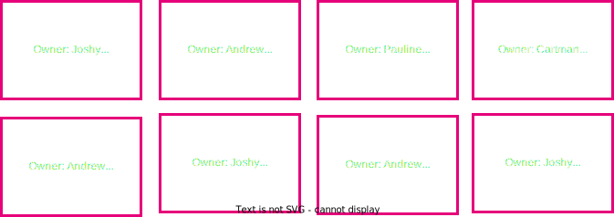
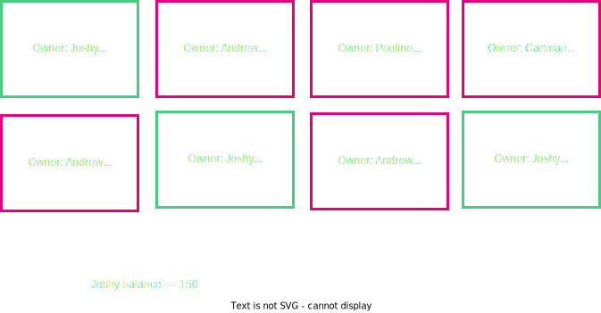
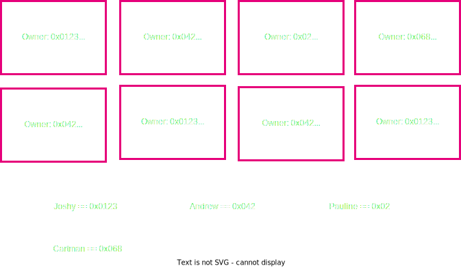
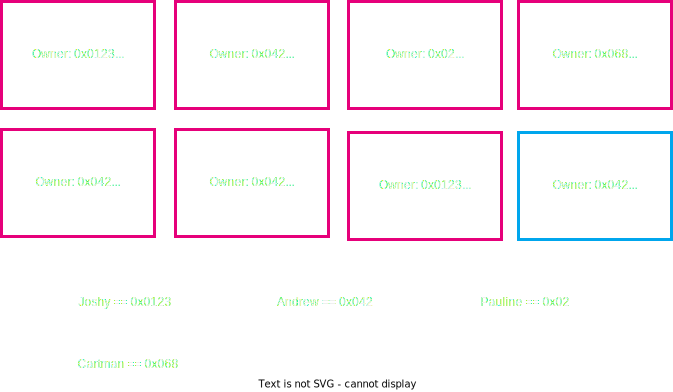
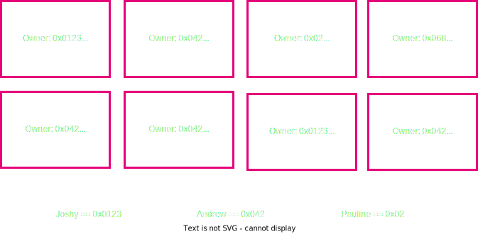
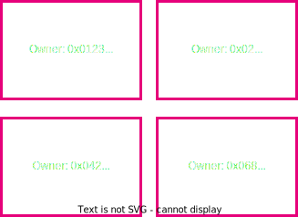
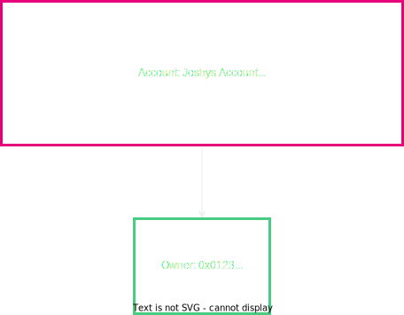

# Accounting Models & User Abstractions in Blockchains

---

## Overview

- Cryptography, Signatures, Hash functions, Hash based Data Structures
  <!-- .element: class="fragment" data-fragment-index="2" -->
- Economics/Game Theory
  <!-- .element: class="fragment" data-fragment-index="3" -->
- Blockchain structure
  <!-- .element: class="fragment" data-fragment-index="4" -->

---

## Where do we go from here?

- We have some base elements, ideas, and concepts
  <!-- .element: class="fragment" data-fragment-index="2" -->
- Now, let's put them together into something cool..
  <!-- .element: class="fragment" data-fragment-index="3" -->

---

## What are we talking about?

<pba-cols>
<pba-col style="font-size:smaller">

- Now that we have this structured decentralized tamper proof state machine..
- Let's think of ways we can formulate a state and a state transition in terms of representing users

</pba-col>

---

## State User Model

---

## State User Model

---

## How to represent Joshy and Andrew?

---

## User Representation

---

## How to send from Joshy to Andrew? What do you need?

Notes:

What would be catastrophic if we got wrong??

---

## What if we want to spend this?

Notes:

Why do we say spend here and not modify?

---

## Input

---

## Transaction

Notes:

Why do we not send all of the 70 to Andrew?

---

## How to verify this state change is valid?

- We can actually spend this thing signature verification!
- Sum of the inputs is >= sum of the outputs
- No coins are worth 0
- Has this already been spent before?

Notes:

Which did I forget??

---

## Our new state

---

## How do we generalize beyond money?

---

## How do we generalize beyond money?

Notes:

How are we going to verify now that the state transition is valid?

---

## Transaction

---

## Transaction

---

## Is this a good model? Why or why not? Let's discuss

- Scalability
- Privacy
- General Computation

---

## Is there a different way?

Notes:

Now ease them to the solution of Accounts

---

## Accounts

Notes:

Now ease them to the solution of Accounts

---

## State Transition Accounts

---

## State Transition Accounts

---

## How do we verify and handle this transaction?

- Verify enough funds are in Joshy's account
- Verify this amount + Andrews amount don't exceed the max value
- Check the nonce of the transaction
- Do the actual computation of output values

Notes:

Did I forget any?

---

## State Transition Accounts

---

## What did we do differently in Accounts vs UTXO model?

Notes:" />

Verify as opposed to determining the outcome.
Not submitting output state in transaction

---

## Account Arbitrary Data

---

## Is this a good model? Why or why not? Lets Discuss

- Scalability
- Privacy
- General Computation

Notes:

Parallelization? Storage space, privacy solutions?

---

## Small shill... Tuxedo 👔

> <https://github.com/Off-Narrative-Labs/Tuxedo>

---

<!-- .slide: data-background-color="#4A2439" -->

# Questions
