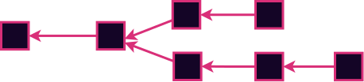
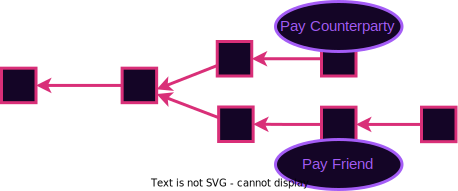

# Consensus: Authoring

---v

### Consensus is...

...a decision making process that strives to achieve acceptance of a decision by all participants.

---v

## Blockchain Consensus is...

...a decentralized consensus system to reach agreement over a shared history of a state machine.

---v

## Blockspace


Blockchain consensus systems produce a resource called blockspace.

Strong incentive alignments and strong guarantees make for high quality blockspace.

Notes:

As we discussed blockspace represents the right to contribute to the shared history.
This is a valuable resource that is offered to users as a product.
We will discuss the selling of this resource in a later lecture on allocation and fees.
The consensus system used plays a large role in determining the quality of the blockspace.

---

## Forks Review


There are going to be forks.
We need to decide which one is the real one.

We can rule some forks out to reduce the problem space.
Then we are left to decide which is canonical.

Notes:

Forks represent alternate courses that history could take.
They arise every time there is a difference of opinion.

You can think of them at a social level.
Court cases, arguments, wars.
Ideally we can resolve them peacefully

You can think of them at a very low physics-y level.
Every time an electron encounters a potential barrier it either reflects of tunnels.
When consensus is high-quality, the result is as objective as the outcome of a physical process.

---

## Five Aspects of Consensus

<pba-flex center>

- State machine validity
- Arbitrary / Political validity
- Authorship throttling
- Fork choice heuristic
- Finality

</pba-flex>

Notes:

The first two aspects are relatively simple and I'll discuss them briefly right now.
The third and fourth are the main topic of this lecture.
The fifth is covered in detail two lectures from now in great detail.

The first three aspects are about ruling possibilities out.
The fourth and fifth are about deciding between any remaining possibilities.

---v

## State Machine Validity

Some forks can be ruled out simply because they contain invalid state transitions.


Notes:

Example spending more money than you have.
Noting your present location such that you would have traveled faster than speed of light since last record.
Calling a smart contract with invalid parameters.

---v

## Arbitrary / Political Validity

Similar to state machine validity.<br />
Examples:

<pba-flex>

- Blocks that are too big
- Blocks that have "hack" transactions
- Empty blocks
- Block with Even state roots

</pba-flex>


Notes:

This concept is similar to the previous slide.
In some sense this is even the same.
This allows us to rule out some forks just for not having properties that we like.
Or for having properties that we dislike.

Not everyone will agree on these properties ad that leads to long-term network splits.

---

## Authorship Throttling

Real-world blockchains impose additional restrictions on who can author blocks.
Why?


Notes:

These blockchains are supposed to be permissionless right? At least many of them are.
Some are even very hardcore about that goal.
So why would we want to restrict the authoring.
Answer: So the nodes are not overwhelmed.
Unthrottled authoring leads to fork chaos.
If anyone authored at any moment there would be blocks raining down left and right.
It would be impossible to check them all.
It would be DOS central.
So we need some organization / order to the process.

---v

## Leader Election

We need to elect a small set (or ideally a single) entity who are allowed to author next.

In pre-blockchain consensus this was called the "leader", and still often is.

Notes:

By electing a few leaders, we are able to throttle the authoring.

---v

## Liveness

The ability of the system to keep authoring new blocks

Notes:

Before we go on, I want to introduce the concept of liveness.
It is a desireable property that consensus systems want to have.
Systems that have better liveness properties offer higher quality blockspace.
Chains without liveness guarantees become stalled.

---

## Proof of Work

Satoshi's Big invention.

Solve a Pre-image search - earn the right to author.

---v

## Proof of Work: Pros

<pba-flex center>

- Permissionless (or so we thought)
- Requires an external scarce resource: Energy
- Blind: Nobody knows the next author until the moment they publish their block
- Expensive to author competing forks - Clear incentive

</pba-flex>

Notes:

On the surface one big strength of PoW is that anyone can spin up a node and join at any time without anyone's permission.
This is clearly how it was described in the whitepaper.
In practice, many systems now have such a high hashrate that your home computer is useless.
It is now permissioned by who can afford and acquire the right hardware.

The reliance on an external resource is good in some sense because it is an objective measure of the market's valuation of the consensus system.
This helps valuate the blockspace.

The blindness is a good property because it makes it impossible to perform a targeted attack (DOS or physical) on the next leader to stall the network.

Some attacks rely on the leader authoring two competing forks and gossiping them to different parts of the network.
With PoW, it costs energy for every block you author.
This makes it expensive to perform such attacks.
This provides an economic incentive for authors to only author blocks on the "correct" fork.

---v

## Proof of Work: Cons

<pba-flex center>

- Energy Intensive
- Irregular block time
- Not so permissionless

</pba-flex>

Notes:

Energy consumption is more often considered a negative property.
Sometimes called proof of _waste_.
I won't go that far, but in a world where climate change is a reality, it is certainly not ideal to be spending so much energy if we can get away with far less.

Worth noting that some PoW schemes (eg Monero's) strive to minimize the energy impact by choosing algorithms that are "asic resistant".
While these are decidedly better than Bitcoin's, they do not fundamentally solve the problem.
Just alleviate it somewhat in practice.

Secondly, the block time is only probabilistically known.
When waiting for block to be authored, there are sometimes spurts of blocks followed by long stretches without any.

Although it seems permissionless on its face, in practice, to be a bitcoin miner you need to have expensive specialized hardware.

---v

## Why Author at All?

- Altruism - You feel good about making the world a better place
- Your Transitions - Because you want to get your own transitions in
- Explicit incentives - Eg block reward

Notes:

If it costs energy to author blocks, why would anyone want to author to begin with?

Mining only when you want to get your transaction in seems like a good idea to me.
People who don't want to self author, can pay other a fee to do it for them.
This is the purpose of transaction fees.
Most chains have transaction fees specified in the transactions themselves which go to the author

Some networks also add an explicit incentives such as a 50BTC reward per block.

---

## Proof of Authority

Traditional class of solutions.

Divide time into slots.

Certain identities are allowed to author in each slot.

Prove your identity with a signature.

---v

## Proof of Authority: Pros

<pba-flex center>

- Low energy consumption
- Stable block time

</pba-flex>

Notes:

Stable block time is a property of high-quality block space.
It allows applications that consume the blockspace to have expectations about throughput.
In PoW you will occasionally have long periods without a block which can negatively affect applications.

---v

## Proof of Authority: Cons

<pba-flex center>

- Permissioned
- No external resource to aid valuation
- Incentives for honesty are not always clear

</pba-flex>

Notes:

Does anything bad happen if they misbehave? Not inherently.
We will need an incentive for that.

---

# Some PoA Schemes

Reminder: PoA is a family of leader election schemes

---v

## Aura

The simple one.

Everyone takes turns in order.

```rust
authority(slot) = authorities[slot % authorities.len()];
```

Notes:

Pros:

- Simple
- Single leader elected in each slot

Cons:

- Not blind - welcome targeted attacks

---v

## Babe

**B**lind **A**ssignment for **B**lockchain **E**xtension

- In each slot, compute a VRF output.
- If it is below a threshold, you are eligible to author. <!-- .element: class="fragment" data-fragment-index="2" -->
- If eligible, author a block showing VRF proof <!-- .element: class="fragment" data-fragment-index="3" -->
- If NOT eligible, do nothing <!-- .element: class="fragment" data-fragment-index="4" -->

Notes:

Pros:

- No fixed order helps alleviate DOS attacks

Cons:

- Some slots have no authors - There is a workaround for this.
- Other slots have multiple authors which leads to forks - There is **no** workaround for this.

---v

## Sassafras

<pba-cols>
<pba-col>

</pba-col>
<pba-col>

Single blind VRF-based leader election

🙈TBH, IDK how it works internally. <!-- .element: class="fragment" data-fragment-index="2" -->

But Jeff does! <!-- .element: class="fragment" data-fragment-index="3" -->

</pba-col>
</pba-cols>

Notes:

- Has most of the Pros of PoW (except for the external resource based valuation hint)
- Has all the Pros of PoA

---v

## Sassafras Analogy

<pba-cols>
<pba-col>

</pba-col>
<pba-col>

> Sassafras is kinda cards against humanity

</pba-col>
</pba-cols>
---v

## Sassafras Analogy


<!-- .element: class="fragment" data-fragment-index="2" -->

<!-- .element: class="fragment" data-fragment-index="3" -->

---v

## Sassafras Analogy

<pba-cols>
<pba-col>

</pba-col>
<pba-col>
<blockquote style="font-size: 80%">Ring VRF outputs are "cards".  You anonymously "play" the best aka smallest cards in your hand.</blockquote>
<!-- .element: class="fragment" data-fragment-index="2" -->
<blockquote style="font-size: 80%">Those cards are sorted, not by funniness since they're just numbers, but by the number.</blockquote>
<!-- .element: class="fragment" data-fragment-index="3" -->
<blockquote style="font-size: 80%">The order in which they wind up is the block production order.</blockquote>
<!-- .element: class="fragment" data-fragment-index="4" -->
<blockquote style="font-size: 80%">You claim the ones that're yours by doing a non-ring VRF with identical outputs.</blockquote>
<!-- .element: class="fragment" data-fragment-index="5" -->
</pba-col>
</pba-cols>

---v

# Proof of Stake

It's just PoA in disguise 🤯

Uses an economic staking game to select the authorities.

Restores the permissionlessness to at least PoW levels.

Restores clear economic incentives

Notes:

There is an economic game called staking as part of the state machine that allows selecting the authorities who will participate in the PoA scheme.
Actually there isn't just _one_ way to do it, there are many.
Kian will talk a lot more about this and about the way it is done in Polkadot later.
I'll just give the flavor now.

The basic idea is that anyone can lock up some tokens on chain (in the state machine).
The participants with the most tokens staked are elected as the authorities.
There is a state transition that allows reporting authority misbehavior (eg authoring competing blocks at the same height), and the authority loses their tokens.
There are often block rewards too like PoW.

---v

## 💒 Consensus 🪢 State Machine

- Loose coupling between consensus and state machine is common
- Eg Block rewards, slashing, authority election
- In PoW there is a difficulty adjustment algorithm

In Substrate there is a concept of a **Runtime API** - Consensus can read information from state machine.

<!-- .element: class="fragment" data-fragment-index="2" -->

Notes:

So far I've presented consensus as orthogonal to the state machine.
This is mostly true.
But in practice it is extremely common for there to be some loose coupling.
We already saw an example when we talked about block rewards.
The consensus authors are rewarded with tokens (in the state machine) for authoring blocks.
Now we see that they can have tokens slashed (in state machine) for breaking consensus protocol.
And we see that even the very authorities can be elected in the state machine.

---

# Fork Choice Heuristics

Each node's preference for which fork is best

<pba-flex center>

- Longest chain rule
- Most accumulated work
- Most blocks authored by Alice
- Most total transactions (or most gas)


</pba-flex>

Notes:

The fork choice allows you, as a network participant, to decide which fork you consider best for now.
It is not binding.
Your opinion can change as you see more blocks appear on the network

---v

## Reorganizations


 <!-- .element: class="fragment" data-fragment-index="2" -->

Dropped transactions re-enter tx pool and re-appear in new blocks shortly <!-- .element: class="fragment" data-fragment-index="3" -->

Notes:

Having seen more blocks appear, we now have a different opinion about what chain is best.
This is known as a reorg.
Re-orgs are nearly inevitable.
There area ways to make sure they don't happen at all, but there are significant costs to preventing them entirely.
Typically short reorgs are not a big problem, but deep reorgs are.

You can experience this in a social way too.

- Imagine that you are waiting for a colleague to submit a paper.
  You believe they have submitted it yesterday, but it turns out that they didn't submit it until today or won't submit it until tomorrow.
  Might be annoying, but not world shattering (usually).
- Imagine that you believe the colleague submitted the paper months ago and the paper has been published.
  You have applied on a job having listed the publication.

---v

## Double Spends


Notes:

The name comes from bitcoin, but the attack generalizes.
It exploits the existence of forks.
Attacker has to get two conflicting transactions into two forks.
And convince a counterparty to believe one chain long enough to take an off-chain action before they see the reorg.

---v

## Double Spends



---

## Five Aspects of Consensus

<pba-flex center>

- State machine validity
- Arbitrary / Political validity
- Authorship throttling
- Fork choice heuristic
- Finality

</pba-flex>

Notes:

We just discussed the first four aspects.
Finality will be discussed in an upcoming lesson
