# Coordination and Trust in Web3

Notes:

In this module we're going to talk about Smart Contracts.

---

# Smart Contracts

## Two Definitions

### Broad Definition <!-- .element: class="fragment" data-fragment-index="1" -->

_aka Szabo definition_ <!-- .element: class="fragment" data-fragment-index="1" -->

<blockquote>A machine program with rules that we could have defined in a contract, but instead a machine performs or verifies performance.</blockquote> <!-- .element: class="fragment" data-fragment-index="1" -->

Notes:

The first question we should answer is "wtf is a smart contract"?
The term has been around for a long time (longer than any blockchain platform) and has evolved over time.
It was first introduced by this guy Nick Szabo in the '90s.

CLICK - read szabo definition

Szabo's definition is primitive and kind of vague.
It might even be argued that it includes all computer programs.
But it gets at the essence of his thinking at the time.
Szabo studied both law and computer science and his big idea was that agreements that are traditionally legal contracts could be better expressed and enforced as computer programs.
Over time, as this vision was gradually realized, the term took on a more specific meaning and was refined quite a bit.

---

# Smart Contracts

## Two Definitions

### Narrow Definition <!-- .element: class="fragment" data-fragment-index="1" -->

_aka web3 definition_ <!-- .element: class="fragment" data-fragment-index="1" -->

<blockquote>A program that specifies how users can interact with a state machine and is deployed permissionlessly to a blockchain network</blockquote> <!-- .element: class="fragment" data-fragment-index="1" -->

Notes:

click - read web3 definition.
This definition is clearly more technical and precise, which is helpful in a lot of ways.
At this point though, we haven't even learned all the terms in this web3 definition.
As an educator, that deeply pains me.
So - my promise to you - by the end of the week, this sentence will 100% make sense to you.
The broad definition (szabo's - the first one we just saw) is useful in understanding the broader space, historical context, and its philosophy.
This though, the narrow definition is useful when you're talking about deploying code to actual blockchain platforms.
In this first lesson today, we'll focus mostly on Szabo's broader notion and explore the ways in which smart contracts are a modern extension to an ancient technology: contracts.
We'll also look at some criticisms of the term "smart contract" and some alternatives that might have been better if it weren't already way too late.

---

## Coordination

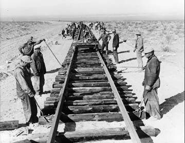

Examples of coordinated activities:

<pba-flex center>

- dancing, music band
- money, business, trade
- rowing team
- building homes, buildings, roads

</pba-flex>

Doing the above safely through bureaucracies like inspection and certification procedures, automobile registration

Notes:

Okay so let's do that! Let's rewind a bit.
Because before we can understand the ways in which smart contracts are "smart" versions of contracts, we need to understand what contracts are in the first place.

After all, we are standing on the shoulders of giants here.

So, in order to understand what contracts are, we'll start all the way back at human coordination.

We'll see that contracts are just a pretty good technology to achieve coordination, and that smart contracts are an improvement on that technology.

So, let's start here.
I'm going to assert that coordinated activity is the basis of so much human behavior.
Consider the building we're in right now.
It has technicians, janitors, grounds people to run it, not to mention the crew it took to build it.
Coordination is what allows this team of workers pictured here to complete a railroad that stretches across a continent.
Obviously some coordination require more bureaucracy than others.
Building a railroad that crosses many state lines? That will require government approval, inspection, and certification procedures - especially as it relates to safety.
But two people dancing? That most definitely could be categorized as coordinate - but can be negotiated or navigated between two individuals.

---

## Coordination

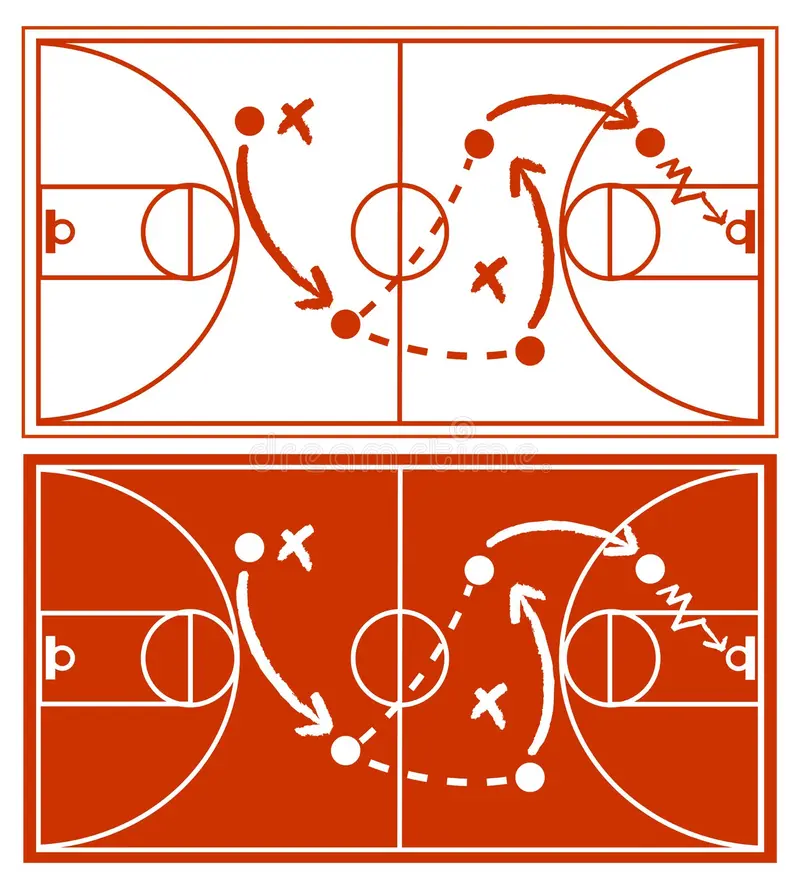

Notes:

There are so many examples of things we as humans can achieve only through coordination, not as individuals, it would be impossible to list them all.
I hope it's evident that I think coordination is good a good thing! Because of it, we can build big big things and create beautiful music in a symphony together because of it.

---

## Coordination

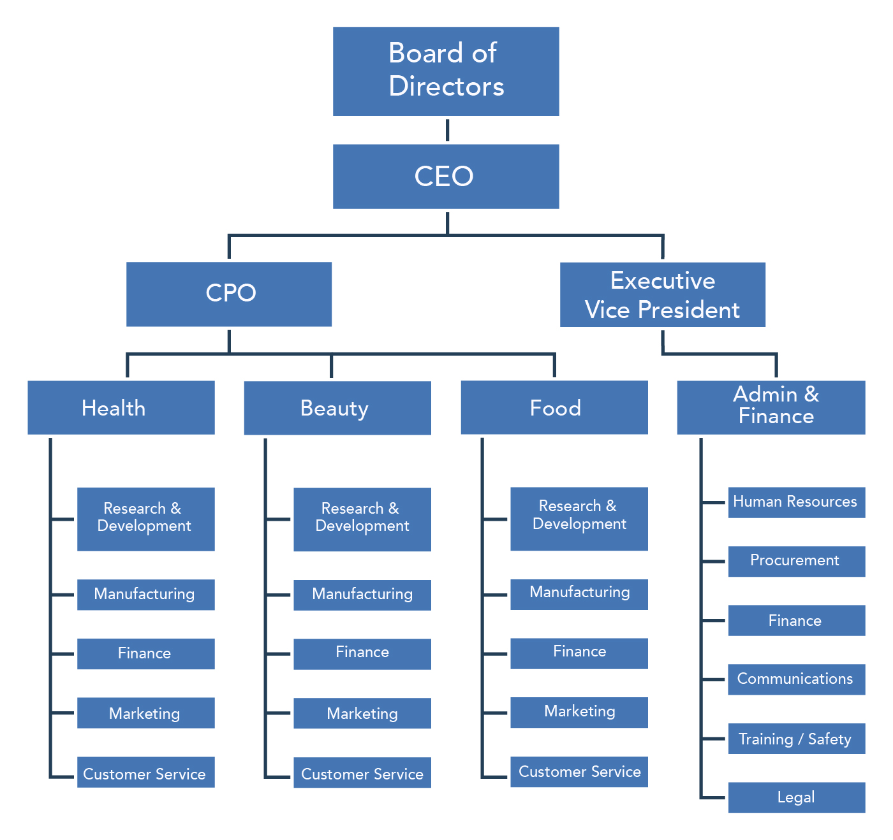

Notes:

It is how massive organizations like corporations and governments are able to function.

---

## Voluntary vs Forced Coordination

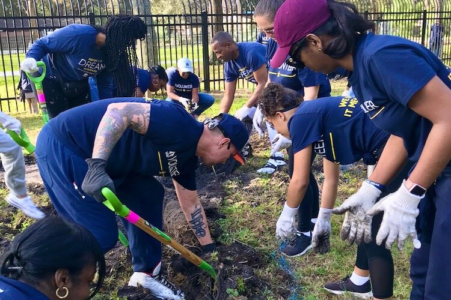

Notes:

A clarifying attribute of coordination is that it can happen voluntarily or by force.
Here, we have a picture of folks working together, let's assume it's voluntarily - as it looks like they're volunteering their time at a community garden.
This is a wonderful example of human coordination at its best.

---

## Voluntary vs Forced Coordination

Notes:

But like all things, of course coordination can have it's ugly side.
Pictured here, a slave boat, is categorically a coordinated effort; people are forced to work together.
Most of us consider slavery a bad outcome.
It IS a bad outcome.
Even those with sketchier moral compasses would agree that _they_ don't want to be the slaves.

The point I'm making here is this: We want to create conditions (otherwise known as, incentives) where voluntary coordination can happen freely and easily.
And thus make slavery as an outcome unlikely.
And by building proper tools for voluntary coordination, we can help prevent forced coordination from happening in the first place.
And again, voluntary coordination is a good thing between individuals - it's how we together achieve things that are impossible otherwise on our own.
Thinking back to our first example of building a railroad - if I were to drive railroad spikes every day for the rest of my life, say I start in Miami where I live now? Maybe I eventually would make it to Georgia? But big collaborative coordination efforts? Railroads made it California! They stretch all over and across a continent!

---

## Business and Trade

<pba-flex center>

- primitive trade
- dead weight loss
- counterparty risk

</pba-flex>

Notes:

From a historical perspective, one of the first forms of coordination was simple trading.
Let's imagine that I grow food and you make houses.
So, I'll give you some food, if you build me a house, and I pay your daily wage by giving you food as long as you're building my house.
This is a classic example of what is called primitive trade.
You the house builder - you need food, so you can only build houses for people who grow food.
As in, you can't earn food by building houses for randos who don't have food to pay you with.
Obviously there are a whole lot of problems within this situation and it won't scale over time.
But it's also a classic example of what is called 'deadweight loss' - The definition of which is: "a cost to society created by market inefficiency, which occurs when supply and demand are out of equilibrium".
Another classic example would be if I, for example, grow corn in the summer and you ice fish in the winter.
And together, we _would love_ to have some way to feed each other during our off seasons - me to feed you in the summer and you to feed me in the winter - but there's no way to coordinate that because someone has to go first.
So let's say I go first and I just give you half of my corn all summer.
It's within reason that you could just, you know, piece out and I'm… left with nothing all winter.
And that is what we call counterparty risk.
And because I don't want to take on that counterparty risk, I don't engage in such a deal, which is then deadweight loss.
So, despite the fact that we both kinda want to trade, we have no real way of making it happen.
So are we stuck?? Do we just not do the deals because we're afraid of counterparty risk and deadweight loss?

---

# Trust

So you want to coordinate with someone.

But you don't want to get ripped off.

Notes:

Let’s then move on to talk about trust - as it makes sense that it's one common way to achieve coordination.
Because let's imagine, you want make an agreement, but you don't want to get ripped off.
Trust means that we decide to trust whoever we're coordinating with - we're creating an agreement between one another to not to rip each other off.
Say for example we're builders - you and I decide to build your house this week.
Well then I in turn believe that we’ll build mine next week.

---

# Personal/Real Trust

## vs

# Rational Expectations

Personal trust - you can build it over time through a slow give and take like you do with your family or long term business partners. <!!-- .element: class="fragment" -->

Notes:

For those houses to be built, for that coordination to happen, we need credible expectations that the promises we make to one another will be upheld.
AKA I have to be willing to trust you - that you are going to fulfill your end of the bargain.
So here on the slide, I have two concepts: Personal or 'real' trust vs. rational expectation.
CLICK - I like to think of personal trust, as a familial thing - or something that's been developed between people over time - I for example trust that my mom, who is watching my son right now, is taking good care of him.
But she and I have gradually built up that trust over many years.
This sort of trust happens within families, between friends or neighbors, but it can also happen in business relationships - say for example, you have a new business partner and you start that relationship off by doing say one small deal together.
And yeah, you may choose to take on a little risk within the deal, but it’s small.
And then the next time you interact, the deal evolves and becomes a little bigger.
And maybe that time the other party/person takes on that little bit of risk.
At no point is there SO much risk that you could get completely wrecked if they rip you off.
Again, there's some, and so by accepting that risk slowly more and more over the years, you two are able to actually build up that personal and real trust.

---

# Trust: A Dirty Word

_Less Trust, More Truth_ <!-- .element: class="fragment" data-fragment-index="1" -->

Notes:

Okay pause - I should fully acknowledge that I'm talking a whole lot about this thing _trust_, and who here has heard or seen ppl in the web3 world wearing hats saying - CLICK - less trust, more truth.
Anyone? (check for nods)

_So, some personal historical context on me_, when I was a newbie in the web3 space, I hadn’t heard this phrase (or slogan rather?).
I saw it on ppl’s shirts and felt sort of confused and honestly, kind of excluded from what felt like maybe an inside joke.
I remember thinking, _wait, I trust people, does that make me wrong... Is that a bad thing_?
I asked myself the question, _why is trust such a dirty world in our world_?
Well, in time, thanks to some of my fellow instructors in the room, I came to understand that this phrase is referring to the fact that life is not all sunshine and roses! Not all relationships and interactions are filled with trustful actors.
In fact, most aren't!
Literally every day we're in situations in which we are forced to treat complete strangers as if we've established real, authentic trust between one another.
Treat them as if they're a close friend or business partner.
And _that_ is definitely bad, and is a dirty word, and is a thing that we really shouldn't do.
And yet! This literally happens all the time - every day really -when you give a merchant your credit card number and you trust that they won't go off on an amazon spree with it.
Or when you give your social security number to a new employer and you trust that they won't steal your identity.
Or when you give your passport to a border agent and you trust that they won't sell it on the black market.
Okay, end pause - back to the slides.

---

# Personal/Real Trust

# vs

# Rational Expectations

- Personal trust - you can build it over time through a slow give and take like you do with your family or long term business partners. <!-- .element: class="fragment" data-fragment-index="1" -->
- Rational expectations - you can believe that a person will act faithfully because they are incentivized to do so. <!-- .element: class="fragment" data-fragment-index="1" -->

Notes:

So.
We know that we don't have the luxury of only interacting with people we truly personally trust.
It's impossible to get personal trust with every person you'd in theory like to because it takes a super long time to bootstrap that real kind of relationship.
And frankly, sometimes you want to interact with a stranger more immediately, say today, and not have to court them for years upon years.
So, again, this should lead us to the question of - how do you handle these every day situations? How DO I trust that the coffee guy isn't going to run off with my credit card details?
CLICK - Well, that's where rational expectations come into play.
This is a game theory, incentives-based concept.
Where you believe credibly that a person _will_ act faithfully according to an agreement you've made - because the incentives make them do so.
So, in a sorta loose way you could say this is another kind of trust? But it's not the genuine, real, authentic kind.
It's more like, I trust that you will act in a certain way because you are _so incentivized_ to do so and being truthful and upholding your end of the agreement ultimately is your best strategy and option.

---

## Personal Trust for Performance

Personal trust can make things _really_ efficient, and it's reasonable to leverage this trust _when it's warranted_

Notes:

Again, I want to make sure you're all hearing me when I say that personal/familial trust is not wrong, or bad, or dirty.
I don’t want us all walking out here calling our moms and dissolving our trust with them.
That just isn’t the scenario we speak to when we say 'trust is dirty'.
And further, if you have someone who you genuinely trust, you can actually get things done a whole lot faster and more efficiently by leveraging that trust.
So, it may be worth it to bootstrap genuine personal trust.
You know, start small, accept a small bit of risk and gradually increase that over time.
Again, it's only bad when you have to do that with someone that you don't know or you actively distrust AND they aren't incentivized to return that trust.

---

## Promises and Reputation

<pba-flex center>

- how enforceable is it?
- does it work in small setting?
- does it work in a large setting?

</pba-flex>

Notes:

So these incentives are obviously really important.
Let's talk about what they are or could be.
Often they are civic duty based - the fear that society or your town will turn on you if you break your promise.
OR they're morality or religion based - you know, you keep your promise to someone out of fear of otherwise going to hell.
Or they are based on the fact that you have a reputation to uphold.
You don't want to be known as a liar or a cheat.
I think you get what I'm saying here, yeah?
It's social norms and expectations that keep people.
Reputation is on the line.
And this can get society pretty far.
But, it's not perfect.
It's not always enforceable - or rather - a threat of a bad reputation isn't always enough to keep people in line.
Or a town grows enough that you can't keep track of everyone's reputation.
Or, you know, you're in a big city and you don't care about your reputation because you're never going to see these people again.
F trust.
F reputation.
Outlaw life is for me!

From a sociological perspective, we know that if people within a society tend to keep promises, the society tends to prosper.
But! Eventually, it will be sufficiently profitable to defect and to break promises.
womp womp!

And this is why we started the lecture off with discussing coordination.
So let's quickly merge some of the concepts we’ve discussed thus far.
Coordination and trust.
Because let’s be real, to achieve things on this planet, it requires some coordination between the 8 billion people here.
And sure, genuine personal trust can help in a small village.
And promises based on societal reputation and civic incentives can help getting things done across a town.
But promises don't get us all the way up to scalable, global trust.
When talking with Joshy, about this problem his example, that I can’t seem to get out of my head was that: “It's the modern equivalent of a primitive village deciding "okay everyone, let's all agree we're going to poop in the same corner of our village, not just wherever we feel like it.” So as he says: Promises can make a village of 100 shit in the same corner, but not 8 billion.
I think this is his way of saying that we need some bigger and more resilient coordination tools.

---

# Contracts

<pba-flex center>

- **Contracts are Promises**
- Some involve money, but they're much **more general than just money**.
- Traditionally, contracts are special promises that the **government will enforce**.

</pba-flex>

Notes:

So how do we incentivize people to keep their promises beyond a civic duty?
Ding ding ding - Finally! This brings us to the idea of contracts.
They're basically, pretty much, promises.
They could involve money, a lot of them do, though they don't have to.
Ultimately, think of them as abstractions over promises.
And someone is enforcing the contract.

On a very small scale, think of siblings fighting over a toy, a parent might encourage them to agree to take turns.
Later when it is time to tarde, the parent might remind the child, "you said you would trade in 5 minutes, so now you have to." The parent is big enough to physically overpower the child if it were to come to that, and the child knows it, so therefore it rarely comes to that.
The parent in this situation is the enforcer.

Same thing in sports.
We all agree to the rules, and agree to let a referee make the judgement calls.
The ref is the enforcer.
In big leagues, where there can suspend players and affect their career, this works.
In the public park, it doesn't always, because the ref is just a peer and there is no real power differential.

Traditionally what you've probably learned is that "enforcer" of these contracts (or promises) is the government.
The government, by being the enforcer, can help people engage in so much voluntary coordination just by making them keep their own promises.

And sure, that's valuable because governments are big and powerful.
You could say that even in some sense, the government enforcing it is a lot like God enforcing it.
As in, the government is big enough to have power over individuals interacting, and if anyone tries to rip someone else off, the government will step in and make sure the contract is upheld.

This essentially allows us to interact as if we trusted each other.
And over time, the stickiness sets in and people actually do start to trust each other! Yay, happy days - But wait! What am I talking about? We know the unfortunate truth which is that government having such a power differential over the people is not always a good thing...

---

# Promises with Force

  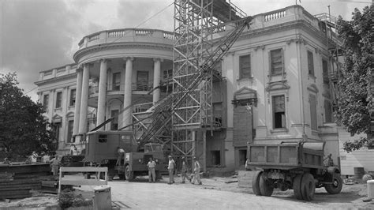
  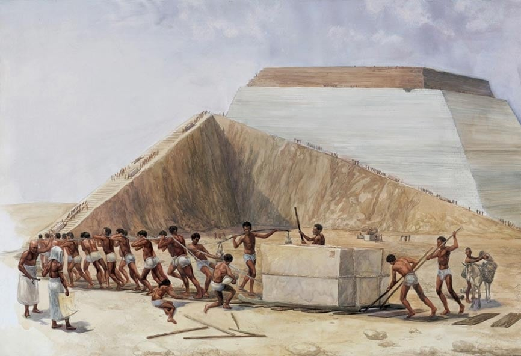

<!-- .element: class="fragment" -->

Notes:

This is a picture of the white house being built - CLICK - and of course the pyramids.

Both are impressive works of human coordination.
But to the workers they are much different.
The construction crew building the white house was engaged in voluntary coordination through employment and they were probably excited about their new government too.
The slaves building the pyramids, are engaged in forced coordination, and when they die, their corpses won't even make it in that pyramid, they'll just get thrown out in the desert.
Our job, in this smart contract module, is to design systems of coordination that make it likely and easy for voluntary coordination so that it is not necessary or desireable to resort to forced coordination.

---

# Promises with Force

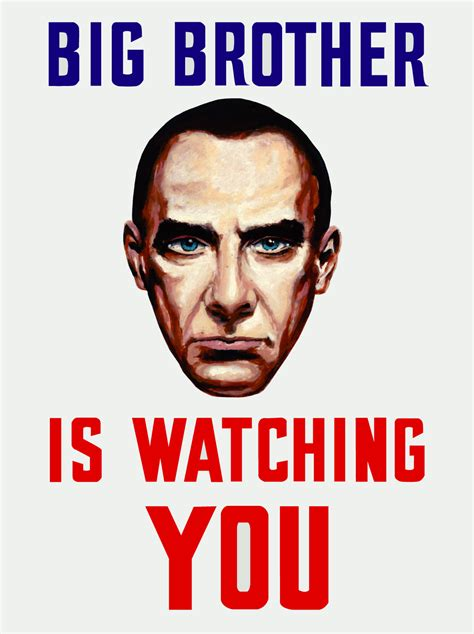
<!-- .element: class="fragment" -->
Notes:

We're doing that because contracts, which often require enforcers, who usually is the government - CLICK - Yeah, which could of course not always be a good thing...

---

## What is a Contract Again?

(to summarize)

A promise, made between parties, backed by the government, to coordinate together to accomplish something together.

Notes:

So yeah, that's the goal and what we're trying to solve.
But, again, just before we go any further, let’s make sure we’re all on the same page about what a contract itself is.
A promise, made between parties, backed by the government, to coordinate together to accomplish something together.
The notion of promise is very abstract:

- It could involve coordinating over time.
- It could involve money or even credit.
- It also could have multiple possible valid outcomes.

Okay.
Cool.
All on the same page? Nodding heads? We can agree we understand this concept?

---

# Smart Contracts 🎉

 <!-- .element: class="fragment" -->

Notes:

Amazing… because, now onto smart contracts! - CLICK - We've finally made it here, folks, horary!
Back in the 90s, this CS guy, Nick Szabo, and some other cypherpunks realized that contract law and computer science actually had a lot in common, and thus developed the _idea_ of smart contracts.
And together we'll develop and tease out those same comparisons here.

---

## Smart Contracts - Szabo Definition

<blockquote>A machine program with rules that we could have defined in a contract, but instead a machine performs or verifies performance.</blockquote>

Broad definition _aka Szabo definition_ formulated c 1997

Notes:

So Szabo has this idea of the smart contract - which is basically to write contractual agreements as computer programs in programming languages.
And then to run those programs on a computer that will then execute the instructions faithfully with machine-like precision.
He was pretty excited about some of the research in multi-party computation that was happening at the time and had a sense that this vision might be right around the corner.
Remember, there is a second smart contract definition that we called the "web3 definition" right at the beginning of this lecture.
That definition is heavily dependent on content you'll learn during the blockchain module - so Joshy will be sure to build off of that later this week.

<https://nakamotoinstitute.org/the-god-protocols/>
<https://nakamotoinstitute.org/formalizing-securing-relationships/>

---

## Smart Contracts 😠👎

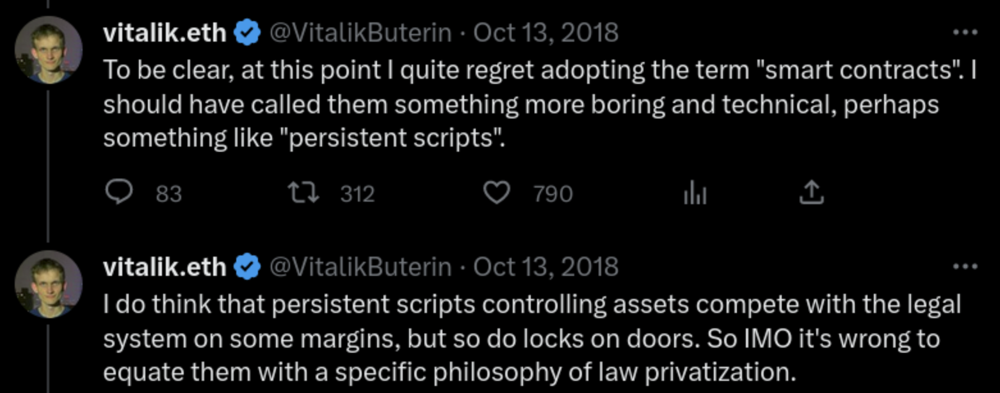

Notes:

Of course, I want to caveat that the term isn't perfect and not everybody likes it.
As you can see in the tweet, Vitalik has worried that the term is too catchy and gives the wrong impression...

With these caveats and criticisms in mind, it is still worth exploring the idea of contracts as computer programs.

---

## Quick review of how we got here

Notes:

So remember we started all the way back at simple primitive trade.
One solution to those problems were to have personal trust with one another.
But that doesn't work for everything.
So we evolved to use rational expectations based on incentives and reputation and societal norms.
But then we had the problem of scalability.
Which brought us to, contracts, aka promises, which allowed us to really scale and achieve some incredible coordination.
And to ensure that those contracts were upheld, the government functioned as a central point of enforcement.
But, as we've seen, that's not always a good thing.
And so now, we're going make the next iteration in this long, rich history of how to coordinate: which is the smart contract.

---

## Smart Contract Objectives

<pba-flex center>

- Retain all the value of traditional governmental contracts
  - Can trust strangers promises
  - Can coordinate with little risk
  - etc.
- Remove the need for a powerful government
- Remove ambiguity about what contracts are enforceable
- Make writing and understanding contracts more approachable
- Make contract execution and enforcement more efficient

</pba-flex>

Notes:

These are the goals of a smart contract.
We basically want to keep all the good stuff that contracts brought us, but then of course make them better by not making the government the central point of enforcement.
We want to know, without a doubt that the contracts will be enforced.
We want them to be approachable, legibility wise, and we want them to be efficient.

---

# Smart Contracts - Two Parts

<pba-flex center>

1. Expression
1. Execution / Enforcement

</pba-flex>

Notes:

So, we'll look at smart contracts in two parts.
Expression - this is the part about actually codifying or expressing what you agree to unambiguously.
From a programmer's perspective, this is by writing code.
Or from a lawyer's perspective, this is writing up a bunch of pages of legalese, which basically is a DSL for being really specific in a legal contract.
And then the part about making sure it actually happens? and what to do if something goes wrong? That’s the execution or enforcement part.
Execution is ultimately where the two worlds contrast - running unstoppable code on a blockchain vs. having courts and judges and police officers and things like that.
Essentially the idea of a smart contract is: we're going to take a contract, which we all feel really confident in our definition, and we're going to glue it together with all of Szabo’s incredible Computer Science research that's come out way more recently than contract research, and that all together is the next iteration and improvement on contracts.
I should note - of these two parts, Programming languages are good at part 1 and computers are good at part 2.

---

# Expression -- Pt. 1

_Domain Specific Languages_

_Legalese:_ In witness whereof, the parties hereunto have set their hands to these presents as a deed on the day month and year hereinbefore mentioned.

_ink!:_ `signatures = [alice, bob]`

Notes:

Okay when we're talking expression we're really talking - Domain Specific Languages (which we say DSL for short).
Humans have been inventing DSL forever.

---

## Domain Specific Languages

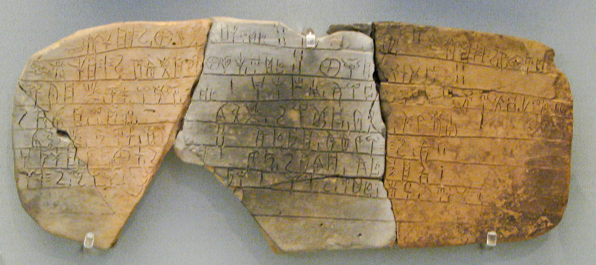

Notes:

From the ancient greek accounting and administrative language, [linear b](https://en.wikipedia.org/wiki/Linear_B),

---

## Domain Specific Languages

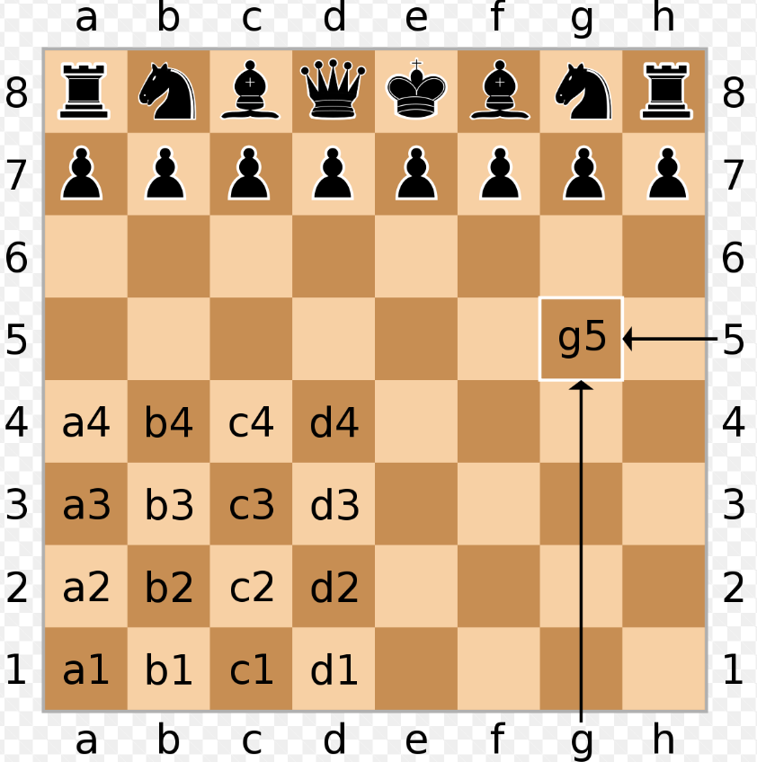

Notes:

to the shorthand for summarizing chess games,

---

## Domain Specific Languages

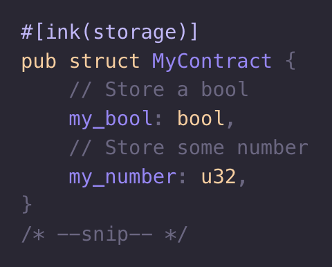

Notes:

to the ink! programming language that you will soon learn.
Contract law is a DSL and is an important part of society.
It’s hard to read (read the sentence on the slide).
Computer Programming languages are also DSLs, which of course had it’s own evolution, independent from contract law.
It can be quite hard to read (asm or solidity), whereas good ones can also be easier to read.
But really, the point I'm trying to make here is that legalese contract law and computer programming languages are not so different.
They are both DSL meant to precisely express the nuances of detailed human agreements.
And they're both hard to read for non experts.
Szabo recognized this similarity and thus had the idea that programming may be the future of law.

---

## Coding Style

- Adding laws vs negative diffs
- Elegance vs handling each special case
- Testing and Repeatability

Notes:

Back to the thing about both being hard to read for non-experts, a goal of mine is to make smart contracts more accessible to everyday people so that people can read their own contracts!

HOWEVER since we're talking similarities - we should also speak to the differences.
And hence be careful with this legal and coding comparison.
The culture of the two can certainly be different:

---

# Execution / Enforcement -- Pt. 2

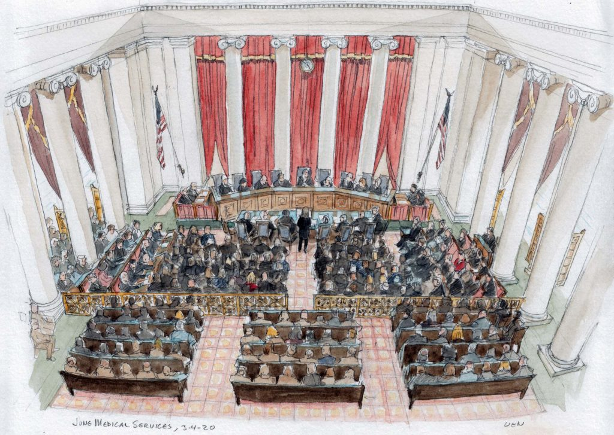

Notes:

Okay, so now that we understand what it means to express and write a contract, imagine now that the legal agreement has been made, what comes next?

---

# Execution / Enforcement -- Pt. 2

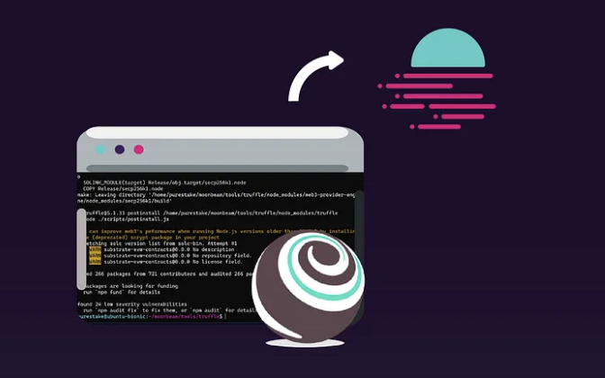

Notes:

Well it must be executed / enforced.
Where does that happen? How does that work?

---

## Traditional Execution

<pba-flex center>

- There is rarely an official submission moment.
- Parties Self Execute
- Sometimes, that's it.
  Success.
- Sometimes it goes to court.

</pba-flex>

Notes:

So - let’s talk about execution.
In a traditional sense, parties often just sign the contract - maybe there is a witness, sometimes even a notary, rarely does it actually get submitted to a judge.
On the happy path, no further action is necessary - this is actually a decided strength of the traditional system - it is maximally lazy.
When there is a dispute though, parties can go to court for a human judge to rule.
A judge enforces through powerful agencies like police and jails, and also through social consensus.
In practice there is little consideration for scaling, queue length, ruling priority, resource exhaustion.
But in principle there could be.
The existing systems of the nation states could be optimized considerably without having to even adopt any real smart contract.

---

# Computerized Execution

<pba-flex center>

- There is a deployment moment
- Sometimes there are checkpoints or milestones or other official interactions
- Sometimes there is dispute resolution

</pba-flex>

Notes:

Moving beyond traditional execution to computerized: you start some process on some computer and that computer faithfully executes the program for users to interact with.
At first you can think of it like a computer in the basement and we walk up to it when we want to interact.
This is how nintendo works.
Multiple controllers and multiple physically present users.
The internet makes it better in some ways.
We can interact with our smart contract remotely instead of being physically present.
But now, there is the question of the server operator.
Are they really executing the correct contract?
A corrupt server operator is essentially the same as a corrupt judge.
Hmmm...
so I wonder how we might solve this?

---

# Code is Law

Notes:

So, after all of that talk comparing law and code, it's inevitable that we get here: 'Code is law' which is another web3-ism you'll hear quite often.
We know tech can be used to enforce rules.
So we might wonder, do we actually need lawyers? Can code dictate what we can and cannot do? Can smart contracts be the answer? I'm not coming for lawyers.
I'm sure they're nice.
But could this be the answer to make life more trustless and secure?
But this is where we'll end it today.
I hope I've primed you with a few lingering questions.
These smart contracts do sound cool, but perhaps the execution, where it actually happens, hopefully is a bit opaque and puzzling still.
That's what Joshy will be able to speak to this week.

---

<!-- .slide: data-background-color="#4A2439" -->

# Activity

Notes:

Any questions?

Now I'm going to turn it over to Aaron to demonstrate this idea of expressing contracts as programming code.
