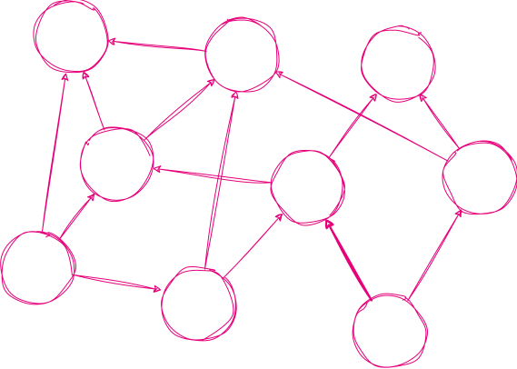

# Designing DAG-based consensus

---

## Goals of this lecture

 

1. formalize the consensus problem and related concepts <!-- .element: class="fragment"-->
2. provide a framework for designing DAG-based consensus protocols <!-- .element: class="fragment"-->

---

## What is consensus?

 

- a **process** of agreeing on the same result among a group of participants
- a fundamental **problem** in distributed computing
- a key **component** of blockchain technology stack

---

## Consensus features

 

liveness, safety, integrity

---

## We have already seen some

 

Nakamoto

Babe

Grandpa

Sassafras

Tendermint

...

---

## Who is running the protocol?

 

Participants, called **nodes**

---

## Nodes

 

- nodes can be either honest or malicious
- honest nodes follow the protocol
- malicious nodes can deviate from the protocol in any way they want
- malicious nodes can collude with each other
- malicious nodes can be controlled by an adversary

---

## Public key infrastructure

 

- every node has its own private and public key
- every node signs messages with its private key
- every node verifies messages with other nodes' public keys

---

## Public key infrastructure

 

authenticated point-to-point communication

---

## Adversary

 

Adversary **can** control the network delays, but is _computationally bounded_, i.e. it **cannot** break the cryptography (like forging the signatures).

---

## Network

 

Communication via network... but what kind of network?

---

## Network models

 

synchronous

partially synchronous

asynchronous

---

## Network models: synchronous

 

> There exists a known upper bound \\(\Delta\\) on message delivery time.

 
 

_Intuition: there's a well-defined notion of a protocol round_

---

## Network models: asynchronous

 

> There is no upper bound on message delay, though delivery is guaranteed.

 
 

_Intuition: you can't tell whether a node has crashed or has a long delay_

---

## Network models: asynchronous

 

> There is no upper bound on message delay, though delivery is guaranteed.

 
 

- We assume that the adversary has full control over the message delays.
- The concept of a timeout is basically useless.

---

## Network models: partially synchronous

 

> There exists a known bound \\(\Delta\\), and an unknown point in time **GST** after which the communication becomes synchronous with a delay \\(\Delta\\).

 
 

_Intuition: protocol will eventually work synchronously, but it needs to be safe before_

---

## Crucial theoretical results

 

> \[FLP theorem\] It is impossible to have a deterministic protocol that solves consensus in an asynchronous system in which at least one process may fail by crashing.

 
 

> \[Castro-Liskov theorem\] It is impossible to have a protocol that solves consensus in a partially synchronous system with \\(3f+1\\) nodes in which more than \\(f\\) processes are byzantine.

---

## Crucial theoretical results

 

> \[FLP theorem\] It is impossible to have a deterministic protocol that solves consensus in an asynchronous system in which at least one process may fail by crashing.

 
 

> \[Castro-Liskov theorem\] It is impossible to have a protocol that solves consensus in a partially synchronous system with \\(3f+1\\) nodes in which more than \\(f\\) processes are byzantine.

---

## Consequence

 

The best one can hope for in **asynchronous** scenario is **probabilistic** protocol tolerating **up to** \\(f\\) faults for \\(3f+1\\) participants.

 

> ✅  **Doable!**

<!-- .element: class="fragment"-->

---

## Note on randomness

 

Real probability is actually needed in the extremely hostile environment.
In case where the adversary is not legendarily vicious, even a dumb (but non-trivial) randomness source will do.

---

## Responsiveness

---

## Responsiveness

 

Protocols that are **not responsive** have to **wait for** \\(\Delta\\) **time** to proceed to the next round.
 

---

## Responsiveness

 

Protocols that are **not responsive** have to **wait for** \\(\Delta\\) **time** to proceed to the next round.
 
 

- \\(\Delta\\) must be long enough to allow all honest nodes to send their messages.
- \\(\Delta\\) must be short enough to allow the protocol to make progress.
- In case of failure, they have to perform a pretty expensive recovery procedure (like the leader change).

---

## Responsiveness

 

Protocols that are **responsive** **wait for** \\(2f+1\\) **messages** to proceed to the next round.

 
 

> Why \\(2f+1\\)?

<!-- .element: class="fragment"-->

---

## Responsiveness

 

Protocols that are **responsive** **wait for** \\(2f+1\\) **messages** to proceed to the next round.

 
 

> Among \\(2f+1\\) nodes, there are at least \\(f+1\\) honest ones, i.e. honest majority.

---

## Responsiveness

 

Protocols that are **responsive** **wait for** \\(2f+1\\) **messages** to proceed to the next round.
 
 

- Asynchronous protocols must be responsive.
- In good network conditions, they significantly much faster.

---

## Checkpoint

 

Up to this point, we covered:

- consensus problem
- node types and adversary
- inter-node communication
- network models (synchronicity)
- protocol limitations in asynchronous network (honesty fraction and the need for randomness)
- responsiveness

---

## Warmup exercise: broadcast

 

> (In an asynchronous network) **reliably** send a single message to all other nodes.

 
 

- (_validity_) If the sender is honest and broadcasts a message \\(m\\), then every honest node outputs \\(m\\).

<!-- .element: class="fragment"-->

- (_integrity_) If an honest node outputs a message \\(m\\), then it must have been broadcast by the sender.

<!-- .element: class="fragment"-->

- (_agreement_) If an honest node outputs a message \\(m\\), every other honest node outputs \\(m\\).

<!-- .element: class="fragment"-->

---

## Reliable broadcast protocol (RBC)

 

---

## Reliable broadcast in practice

 

Due to the very high communication complexity we use heuristics or cryptography-based tricks.

---

## Blockchain protocol vs Atomic broadcast

 

Atomic broadcast
 

---

## Randomness formalized

 

Randomness beacon
 

---

## Atomic broadcast: timeline

 

---

## Atomic broadcast: timeline

 

---

## Fun fact

 

Aleph paper, as the first, also achieved fully asynchronous randomness beacon:

- with efficient setup (\\(O(1)\\) rounds, \\(O(N^2)\\) communication)
- with \\(O(1)\\) expected rounds to output a random value with \\(O(N)\\) communication per round

---

## Consensus protocols (selection)

 

<pba-cols>
<pba-col>

### Classical protocols:

- \[DLS’88\], \[CR’92\],
- PBFT \[CL’99\]
- Random Oracles … \[CKS’05\]
- Honey Badger BFT \[MXCSS’16\]
- Tendermint \[BKM’18\]
- VABA \[AMS’19\]
- Flexible BFT \[MNR’19\]
- HotStuff \[YMRGA’19\]
- Streamlet \[CS’20\]
- Grandpa \[SKK'20\]

</pba-col>
<pba-col>

### DAG-based protocols:

- \[L. Moser, P. Meliar-Smith ‘99\]
- Hashgraph \[B’16\]
- Aleph \[GLSS’18\]
- DAG-Rider \[KKNS’21\]
- Highway \[KFGS’21\]
- Narwhal&Tusk \[DKSS’22\]
- Bullshark \[SGSK’22\]

</pba-col>
</pba-cols>

---

## DAG-based protocols

---

## DAG

 

Directed Acyclic Graph
 

---

## How does it relate to consensus?

 

Intuition: graph represents the dependencies between messages (units).
 

---

## Framework core

 

1. We maintain a local DAG representing our knowledge of the units. <!-- .element: class="fragment"-->
2. We perform a local, offline consensus on our DAG. <!-- .element: class="fragment"-->

---

## Framework core

 

1. We maintain a local DAG representing our knowledge of the units.
2. We perform a local,  **offline consensus** on our DAG.

---

## Framework core (in other words)

 

1. (online): sending and receiving units that contribute to the local DAG
2. (offline): everybody performs a local consensus on the DAG, just by looking at it

---

## Clue observations

 

- local DAGs might differ... <!-- .element: class="fragment"-->
- but they are guaranteed to converge to the same DAG <!-- .element: class="fragment"-->
- the offline consensus is guaranteed to produce the same result <!-- .element: class="fragment"-->

---

## Adversary control

 

---

## Randomness? Where is randomness?

 

It is put into the local consensus protocol.

---

## Relation to the atomic consensus problem

 

- nodes receive transactions and put them into units
- nodes send each other their new units
- (locally) nodes come up with a linear ordering of the units and make blocks from chunks

---

## Digression: block production, information dissemination and finalization

 

The common approach (e.g. in Substrate):

- production and dissemination is done in the same layer
- afterwards, nodes perform consensus on finalizing disseminated blocks

 

Natural approach for DAG-based protocols:

- information dissemination happens as 'the first phase'
- block building and (instant) finalization happens locally

---

## Main consequences of the different separation

 

- block signatures
- speed

---

## Local consensus: goal

 

Local copies might differ significantly, blocks might have not come to all nodes yet, etc...
but we have to make common decision about unit ordering!

---

## Key concept: availability

 

Intuitively, a unit is **available** if:

 

- most of the nodes have it <!-- .element: class="fragment"-->
- it was distributed pretty promptly (we won't call a unit available, if it finally arrived everywhere after a month) <!-- .element: class="fragment"-->
- most of the nodes know that most of the nodes know that most of the nodes know... that it is available (mutual awareness) <!-- .element: class="fragment"-->

---

## Availability

 

If a unit is available, it is a good candidate for being chosen as an 'anchor' in extending current ordering.

---

## Lightweight case study

 

Aleph Zero BFT protocol

---

## Head

 

---

## Building blocks

 

---

## Choosing head

 

---

## Availability determination

 

Units vote for each other's availability.

---

## (Part of) availability determination

 

VoteU(V) =

- \[\[U is parent of V\]\] if V is from the round just after the round of U
- `0`/`1` if all children of U voted `0`/`1`
- `CommonVote(round(`U `), round(`V `))` otherwise
   
   

_(U comes from the earlier round than V)_

---

## Bonus: generating randomness

 

Sig `sk`(nonce)

<!-- .element: class="fragment"-->
 

- randomness must be unpredictable
- delayed reveal
- must depend on \\(f+1\\) nodes
- cannot be disturbed by the adversary

---

## Standard way

 

---

## Standard way

 

Problem: need for trusted dealer! <!-- .element: class="fragment"-->

---

## One simple trick

 

Everybody is dealing secrets <!-- .element: class="fragment"-->

---

## Combining randomness

 

