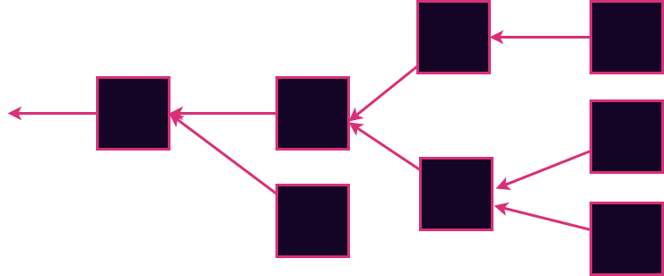

# The Quest for Infrastructure

OR

Where can I actually run these things!?

---

# Quick Review of Smart Contracts

---v

## Expression

Write code instead of long confusing legalese

---v

## Execution

Let the computer run it instead of the judge interpreting it.

---

# Quick Review of Service Providers

They are the technicians that keep the infra running.

They are the technicians that keep the infra running.

They don't have any particular morals, certainly not the same ones you have.

Notes:

We need people to keep the computers online and replace broken hardware and make sure the data is backed up etc.
But those people should be just that, technicians.
They are not elected officials or Judges or anything like that.
So we don't want to accidentally let them fil that role.

Many, probably even most, data center workers are perfectly good people not trying to scam anyone.
The point is that any individual server operator could be evil and it will be easier to coordinate voluntarily if people don't have to trust the server operator to do it.

---

# Where to Run the Contracts?

Notes:

We know we need somewhere to run these things with no back door or trusted party.

We have seen some hints so far.
Let's check them out.

---v

## Diversity and Redundancy

- Geographical - for natural disasters and terrorist attacks
- Jurisdictional - to resist the incumbent governments - they are the ultimate server operators
- Moral - so all compasses are represented in the network, and no group can impose hegemony
- Of compute hardware - incase some is bugged or backdoored or prohibitively expensive

Notes:

Web2 gets a lot of this right.
At least they are good at the first two and preventing accidental data loss etc.
There is a lot to be kept from web 2.
Some digital services, or subsystems of digital services may never even need web3 upgrades.

But indeed there is also some to be thrown out or improved.

---v

## P2P Networking

Replace the operator with a system where peers all have power.

Notes:

We saw well how this worked out well in the file sharing and anonymous browsing domains (bit torrent,)

---v

## Reproducible Execution

- Computers are better than courts
- PABs make distributed code execution practical

Notes:

We saw even back in the early 2000s with java web applets that allowing more people to run the same program is hugely useful.

A few decades later we have much better tech for this, and it is even more valuable.

PABs make it practical for diverse parties all over the world to run the same software deterministically on their bespoke hardware in their unique environments.

---

# Blockchain

## Solves ALL Your Problems

---v

## Solves Some Specific Problems

Allows us to replace the central server operator with a P2P network and Consensus System

Notes:

Actually it is a fallacy that blockchain solves all our problems.
It actually solves some very specific coordination problems.
It also brings some efficiency improvements to modern bureaucracies.
It does not automatically make everyone believe the same things or magically arrive in happy unicorn bunny land.
Tomorrow and Thursday will dig in on how the blockchain and its P2P network work together.

---v

## Blockchain Data structure

Notes:

We'll discuss two new blockchain related topics.
First is the blockchain data structure which you can see here.
This one is forked which is when things get really interesting, and when you need to invoke the second part

---v

## Blockchain Consensus

Notes:

Consensus deals with how we agree which version of the data structure is real.
It is an interesting and complex topic, but we first need to learn a bit more about how the data structure allows us to track a shared story.

---v

## Reading Assignment

For tomorrow please read the bitcoin whitepaper
